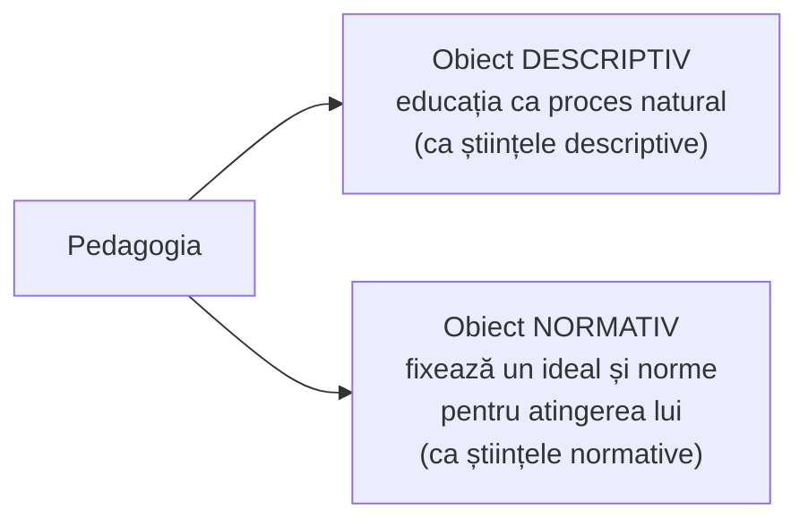
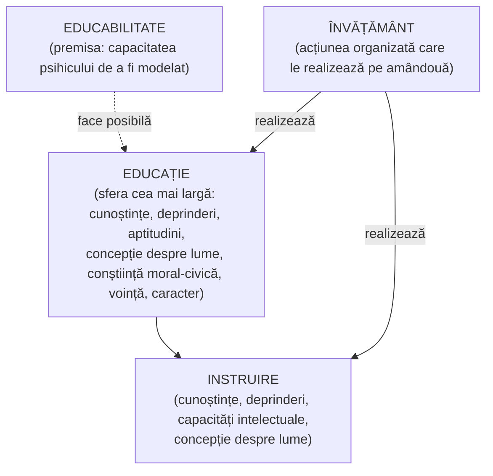
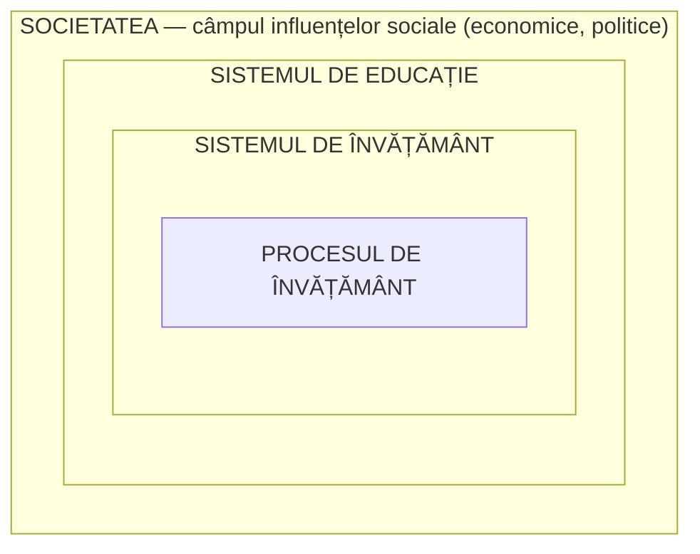

↑ [[Modulul 01 - Statutul științelor educației]] · → [[1.2 Evoluția științelor educației]]

> [!abstract] Pe scurt
> - Educația este un obiect **prea complex** pentru o singură disciplină → s-a format un **ansamblu de științe ale educației**, unificat prin **obiectul comun** (educația) și prin **pluridisciplinaritate**.
> - **Pedagogia** (gr. *pais, paidos* = copil + *agoge* = a conduce) este **știința educației**: studiază esența, finalitățile, conținutul, principiile, metodele și formele educației; are un **dublu obiect** — **descriptiv** (ce este educația) și **normativ** (ce trebuie să fie).
> - Caracteristicile pedagogiei: **socio-umană, teoretică, acțională (praxiologică), prospectivă** — și, în același timp, **artă** a educației.
> - Concepte fundamentale: **educație, educabilitate, instruire, învățământ**; relația în trepte **societate ⊃ sistem de educație ⊃ sistem de învățământ ⊃ proces de învățământ**.
> - Pentru un cadru didactic, specialitatea nu ajunge: e nevoie de **pregătire fundamentală în științele educației** (măiestrie, tact pedagogic, tehnologii educaționale).

---

# PARTEA I — Ce spune manualul

## 1. Geneza științelor educației (p. 11)

- Științele educației s-au născut din **nevoia de specializare**: educația e un „obiect prea complex” pentru o singură disciplină, deci a fost abordată din **perspective multiple**.
- Sintagma **„știință a educației”** e impusă de curentul **Educația Nouă** în primele decenii ale sec. XX — întâi în **Europa**, apoi în **SUA** (în variantele **progresivismului** și **reconstrucționismului**).
- În Antichitate exista o singură știință — **filozofia**; din ea s-au desprins treptat logica, fizica, etica și celelalte științe.
- **John Dewey** vorbește explicit despre „știința educației”, întemeiată filozofic pe **unitatea abordării psihologice și sociale** a educației.
- Același obiect e studiat de mai multe „miniștiințe”, în două variante:
  1. **negarea pedagogiei** și înlocuirea ei cu „științele educației”;
  2. științele educației ca **științe auxiliare** ale pedagogiei „sistematice”/„generale” → devin „**științe pedagogice**”.

### Două tendințe ale sec. XX (după S. Cristea)

| Tendință | Accent |
|---|---|
| **Pedagogia filozofică** | nevoia de **conceptualizare** și de **normativitate** în educație și instruire |
| **Pedagogia științifică** | nevoia de **abordare obiectivă** a educației, la nivelul practicii sociale și didactice |

Pedagogia contemporană valorifică **ambele** tendințe.

## 2. Etimologia termenului „pedagogie” (p. 12)

- Pedagogia se constituie ca știință abia în **sec. al XVII-lea**, când își definește obiectul, legile, principiile, finalitățile, sistemul conceptual și metodele de cercetare (→ [[1.2 Evoluția științelor educației]]).
- Gr. ***paidagogia*** = *pais, paidos* (**copil**) + *agoge* (**a conduce**) → „conducerea copilului”, adică creșterea și educarea lui în sens practic.
- Derivate:
  - ***paidagogos*** — **servul** care îl însoțea pe copilul cetățeanului grec spre școală → „grămăticul” de altădată, pedagogul de azi;
  - **„pedant”** — atent, meticulos, vigilent — trăsătura asociată acestui rol.

## 3. Pedagogie și științe ale educației: raportul dintre termeni (p. 12–13)

- La un nivel general, pedagogia este **știința educației** — studiază esența și trăsăturile fenomenului educațional, scopul, sarcinile, valoarea și limitele educației, conținutul, principiile, metodele și formele (C. Cucoș).
- **Émile Durkheim** (orientare sociologică) distinge încă de la începutul anilor 1900 între **pedagogie** și **știința educației**.
- Din anii **1960–1970**, „științe ale educației” și „pedagogie” se folosesc **în paralel**; „pedagogic” ajunge să fie folosit mai ales ca **adjectiv** (intenție pedagogică, relație pedagogică).
- Azi, poziția dominantă: **recunoașterea diversității abordărilor științifice** ale educației. Motivul profund: **diversitatea factorilor** implicați în actul educativ.

> [!quote] Definiție — științele educației (p. 12–13)
> **Științele educației** = ansamblul disciplinelor care studiază **condițiile de existență, de funcționare și de evoluție** ale situațiilor și faptelor educaționale. Unitatea lor e asigurată de **pluridisciplinaritate**.

- După **1980**, domeniul se **revalorizează**: **pedagogia generală** își recapătă statutul de **știință fundamentală** între științele educației. Rolul ei: **(re)sistematizarea continuă** a cunoștințelor și integrarea experiențelor conceptualizate, inclusiv cele cotidiene. Sinteza se adresează **educatorului**, dar beneficiarul principal trebuie să fie **educatul** (p. 13).
- Termenul **„educație”** desemnează **acțiunea practică** de intervenție socială în evoluția unei persoane.

## 4. Pedagogia azi (p. 13)

Pedagogia este înțeleasă ca știința care studiază:
- **funcționalitatea și structura** activității de formare-dezvoltare a personalității, proiectate și realizate prin **corelația subiect–obiect** (educator–educat);
- **funcțiile generale** ale educației (din care derivă **finalitățile**) și **structura generală** a educației, prezentă obiectiv în orice acțiune educativă (→ [[Modulul 02 - Clasic, modern și postmodern în educație]], §2.3 și §2.5; [[Modulul 04 - Finalitățile educației]]);
- **formarea educatorilor**, dotându-i cu mijloace teoretice și metodologice.

Pedagogia asigură o educație pe măsura **așteptărilor societății** și cultivă **cetățeanul activ și responsabil**.

## 5. Definiții ale pedagogiei (p. 13–16)

Manualul notează că definirea pedagogiei rămâne o **preocupare actuală**. Autorii invocați ca susținători ai pedagogiei ca domeniu științific distinct: **E. Planchard, R. Hubert, L. Cellerier, I. Jinga & E. Istrate, C. Bârzea, I. Stanciu, I. Nicola**. Definițiile sunt redate **fără atribuire individuală**; atribuirile de mai jos (coloana 3) sunt reconstituite din literatura românească de specialitate.

| # | Idee centrală (parafrază) | Autor probabil |
|---|---|---|
| 1 | **teoria generală a artei educației**: grupează experiențele izolate și metodele personale într-un sistem legat prin principii universale, separând realul de ideal | **L. Cellerier** (*Esquisse d'une science pédagogique*, 1910) |
| 2 | știința care, pornind de la **cunoașterea naturii umane** și de la **idealul** omenirii, stabilește **principiile** influenței intenționate a educatorului | **G. G. Antonescu** (de verificat anul ediției) |
| 3 | știință a **paradigmelor** în rezolvarea problemelor-cheie ale educației | nesemnalat (probabil C. Bârzea — de verificat) |
| 4 | știință a **modelelor** de interpretare și realizare a educației — pentru că obiectul ei e un **proiect**, educația e o **totalitate**, o acțiune socială, un **sistem deschis**, iar condiționarea morală/ideologică poate fi controlată prin modele | idem (de verificat) |
| 5 | știința de a **modela personalități** conform unor finalități asumate deliberat; propune metode, mijloace, forme, instituții | nesemnalat |
| 6 | studiază fenomenul educațional și implicațiile lui asupra personalității, în vederea **integrării sociale active** | nesemnalat |
| 7 | se ocupă de **ce este** (realul), **ce trebuie să fie** (idealul), **ce se face** (realizarea) → știință **teoretică și descriptivă**, **normativă** și **tehnică de acțiune** | **E. Planchard** |
| 8 | elaborează o **doctrină a educației**, teoretică și practică, prelungire a moralei; nu e exclusiv știință, tehnică, filozofie sau artă, ci **toate la un loc**, ordonate logic | **R. Hubert** (*Traité de pédagogie générale*, 1946) |

> [!quote] Definiție — C. Cucoș (p. 15)
> Pedagogia este **știința educației** care studiază **esența și caracteristicile** fenomenului educațional, **scopul și sarcinile** educației, **valoarea și limitele** ei, **conținutul, principiile, metodele și formele** proceselor paideutice. Obiectul ei este **educația**, iar ea studiază **legile educației omului pe tot parcursul vieții**.

- **I. Bontaș**: pedagogia explică esența, idealul, conținutul, metodele, mijloacele și formele educației, urmărind formarea **științifică** a personalității și a **profesionalității** pentru activitatea social-utilă (p. 15).

### Dublul obiect al pedagogiei (p. 15)

### Definiții din dicționare (p. 15–16)

1. **Știință socială cu statut academic** — studiază educația ca ansamblu de **principii și legități** care reglementează desfășurarea probabilă a fenomenelor educaționale, la nivel de **sistem** și de **proces** (S. Cristea, *Dicționar de pedagogie*).
2. **Știință a educației cu caracter normativ** — elaborează teorii, modele și principii privind dinamica și armonizarea **situației pedagogice**.
3. Știință a **legilor de dezvoltare** a procesului de educație, formare, instruire, în contextul legilor dezvoltării **relațiilor sociale**.

### Pedagogia văzută ca știință… (p. 16)

| Tip de știință | Autori citați de manual |
|---|---|
| **socioumană** | Julien Freund (1973); B. I. Lihaciov (1999) |
| **normativă** | Eugen Cizek (1998) |
| **a comunicării** | H. A. Gleason; Jürgen Habermas (1983, 2000) |
| **socială analitică** | J. D. Bernal (1964) |

- Pedagogia mai apare ca **sistem de teorii** care servește o **finalitate socială** și o realizează prin cultivarea **identității** (individuale, de grup, comunitare, naționale, internaționale).

> [!quote] Sinteza lui S. Cristea (p. 16)
> Pedagogia este o **știință socioumană** care studiază **structura și funcția educației** prin **metodologii de cercetare specifice**, cu scopul de a descoperi și valorifica **legități, principii și norme** de acțiune educațională.

> [!tip] De reținut — caracteristicile pedagogiei (p. 16)
> 1. **caracter socio-uman** — educația e un fenomen social;
> 2. **caracter teoretic**;
> 3. **caracter acțional, praxiologic**;
> 4. **caracter prospectiv**.
>
> În plus, pedagogia este identificată și ca **artă a educației**.

## 6. Conceptele fundamentale (p. 16–18)

Manualul numește patru concepte care exprimă aspecte ale fenomenului educațional: **educația, educabilitatea, instruirea, învățământul**.

### 6.1. Educația (p. 16–17)

- Definiția amplă e amânată pentru un modul ulterior; aici se reține că educația este fenomenul prin care se **transmit generației tinere cunoștințele și experiența acumulată**.
- **Însușirile esențiale ale educației** (după **I. Bontaș**):
  1. dobândirea de **cunoștințe** generale și de specialitate;
  2. formarea **priceperilor și deprinderilor** intelectuale și practice;
  3. formarea **capacităților** și dezvoltarea **aptitudinilor**;
  4. formarea **concepției despre lume**;
  5. formarea **conștiinței moral-civice** și a comportării civilizate;
  6. formarea trăsăturilor de **voință și caracter**.
- Educația este **obiectul de studiu al pedagogiei**: pedagogia urmărește cunoașterea ei științifică la nivel de **sistem** și de **proces**, abordând problemele fundamentale (conceptul de educație, analiza funcțional-structurală și contextuală, caracteristicile generale) (p. 17–18).

### 6.2. Educabilitatea (p. 17)

> [!quote] Definiție (după S. Cristea, *Dicționar de pedagogie*)
> **Educabilitatea** = capacitatea specifică a psihicului uman de a se **modela structural și informațional** sub influența **agenților sociali și educaționali**.

### 6.3. Instruirea (p. 17)

- Categorie **inclusă** în cea de educație, cu **mai puține însușiri esențiale**:
  1. dobândirea de **cunoștințe**;
  2. formarea de priceperi și **deprinderi**;
  3. formarea **capacităților intelectuale** și a aptitudinilor;
  4. formarea **concepției despre lume și viață**.
- Diferența față de educație: lipsesc dimensiunile **moral-civică** și **volitiv-caracterială**.

### 6.4. Învățământul (p. 17)

- Înseamnă **procesul de învățământ**: transmiterea cunoștințelor, formarea priceperilor și deprinderilor, dezvoltarea capacităților, formarea conștiinței și a conduitei.
- Este **acțiunea care realizează însușirile esențiale** ale ambelor categorii — educația și instruirea.

## 7. Societate – sistem de educație – sistem de învățământ – proces de învățământ (p. 18–19)

*Fig. 2 din manual (după L. Papuc), redată ca incluziune succesivă.*

| Nivel | Ce cuprinde (după manual) |
|---|---|
| **Societatea** | câmpul de influențe sociale — economice, politice |
| **Sistemul de educație** | toate **instituțiile, organizațiile** (economice, politice, culturale), **infrastructurile** și **comunitățile** (familie, anturaj, grup profesional, cartier) care formează personalitatea prin funcții pedagogice **explicite sau implicite, directe sau indirecte** (S. Cristea); include **educația permanentă** și educația **formală, nonformală, informală** |
| **Sistemul de învățământ** | **principalul subsistem** al sistemului de educație; **organizarea instituțională** a învățământului; cuprinde și instituții **nonformale** (cluburi, tabere, centre de pregătire profesională, televiziune școlară) și agenți sociali; „rețeaua organizațiilor școlare” |
| **Sistemul școlar** | educația **formală** în învățământul primar, secundar, postliceal, superior și special |
| **Procesul de învățământ** | **principalul subsistem** al sistemului de învățământ; aici se realizează **predarea–învățarea–evaluarea**; forma cu **cel mai înalt nivel de organizare** a instruirii; principalul mijloc prin care societatea educă tinerele generații |

→ Detalii: [[Modulul 08 - Sistemul de educație și managementul educației]]; formele educației: [[3.1 Formele generale ale educației - delimitări conceptuale]].

## 8. Structura de bază a educației (p. 19–20)

- Componentele esențiale: **subiectul educației** (educatorul — individual sau colectiv) și **obiectul educației** (educatul — individual sau colectiv). Cei doi **corelează funcțional**.
- Această corelație este **nucleul funcțional-structural** al activității de formare-dezvoltare **permanentă** a personalității.
- Un model recent de analiză funcțional-structurală: **S. Cristea**, *Fundamentele științelor educației*. Modelul (redat în manual doar prin trimitere la o „formulă grafică”) delimitează clar **obiectul de studiu specific** științelor pedagogice, într-un **timp și spațiu pedagogic** determinat (→ [[Modulul 02 - Clasic, modern și postmodern în educație]], §2.5; [[Modulul 09 - Agenții educației și factorii dezvoltării]]).

## 9. Rolul științelor educației în formarea profesională (p. 20)

- Rolul lor: **pregătirea profesioniștilor** care activează în sistemul educațional.
- Pregătirea într-o specialitate (matematică, istorie etc.) **nu este suficientă** pentru funcția de cadru didactic; e necesară și o **pregătire fundamentală în științele educației**.
- Succesul profesional presupune: **măiestrie**, **tact pedagogic**, cunoașterea **tehnologiilor educaționale** de transfer al cunoștințelor și de formare a competențelor.
- Toate acestea **se învață**, ca și specialitatea — în instituții de **profil pedagogic**. Cine n-a urmat o asemenea pregătire întâmpină **dificultăți** în rolul de cadru didactic.

> [!tip] De reținut
> Statutul științific al pedagogiei se sprijină pe **obiect propriu** (educația), **metodologie proprie** și **normativitate specifică** — idee dezvoltată în [[1.2 Evoluția științelor educației]] și [[1.3 Normativitatea activității educaționale]].

---

# PARTEA II — Completări

## 10. Etimologia termenului „educație”

- Lat. ***educo, -are*** = a crește, a hrăni, a îngriji; lat. ***educo, -ere*** = a scoate din, a conduce afară, a ridica. Cele două sensuri corespund celor două accente ale educației: **formare din exterior** vs. **dezvoltare a potențialului interior**. Manualul discută etimologia în Modulul II (§2.1).
- ***Paidagogos*** era, în Grecia antică, de regulă un **sclav** (adesea în vârstă) care însoțea și supraveghea copilul; profesorul propriu-zis era *grammatistes* sau *didaskalos*. Pentru cultura educațională greacă: **Werner Jaeger**, *Paideia* (1933–1947); **H.-I. Marrou**, *Histoire de l'éducation dans l'Antiquité* (1948).

## 11. „Pedagogie” vs. „științe ale educației” — repere

| Reper | Contribuție |
|---|---|
| **I. Kant**, *Über Pädagogik* (1803, ed. F. T. Rink) | pedagogia ca reflecție sistematică; teza că **omul devine om numai prin educație** |
| **J. F. Herbart**, *Allgemeine Pädagogik* (1806); *Umriss pädagogischer Vorlesungen* (1835) | pedagogia întemeiată pe **etică** (scopuri) și **psihologie** (mijloace); **educabilitatea** (*Bildsamkeit*) — **conceptul fundamental** al pedagogiei |
| **A. Bain**, *Education as a Science* (1879) | argumentează posibilitatea unei științe a educației, în spirit psihologic |
| **É. Durkheim**, *Éducation et sociologie* (1922, postum) | distinge **știința educației** (descrie, explică faptele educaționale) de **pedagogie** — o **„teorie practică”** care orientează acțiunea |
| **É. Claparède** — Institutul J.-J. Rousseau, Geneva (1912) | primul centru dedicat explicit **științelor educației** în spațiul francofon |
| **J. Dewey**, *The Sources of a Science of Education* (1929) | sursele științei educației sunt **practicile educative**; alte științe sunt „surse” doar dacă servesc practica |
| **Franța, 1967** — primele departamente universitare de **„sciences de l'éducation”** (Bordeaux, Caen, Paris) | instituționalizarea pluralului; **G. Mialaret**, *Les sciences de l'éducation* (1976) → [[1.4 Taxonomia științelor educației]] |

> [!note] Comentariu — singular sau plural?
> - **Singularul** („pedagogia”, „știința educației”) pune accentul pe **unitatea obiectului** și pe o teorie integratoare.
> - **Pluralul** („științele educației”) pune accentul pe **diversitatea metodologiilor** (psihologică, sociologică, istorică etc.).
> - Soluția manualului, preluată de la S. Cristea: **pedagogia generală** ca **nucleu** + științele pedagogice/ale educației ca **ansamblu** în jurul ei. Aceeași tensiune apare la Mialaret, care vede **științele pedagogice** ca subansamblu al **științelor educației** (p. 40–41).

## 12. Educabilitatea — teoriile clasice

Tema e tratată pe larg în tradiția românească (I. Nicola, C. Cucoș):

| Teorie | Teza | Reprezentanți (exemple) |
|---|---|---|
| **Ereditaristă** (pesimism pedagogic) | ereditatea determină decisiv dezvoltarea; educația are un rol limitat | F. Galton, *Hereditary Genius* (1869) |
| **Ambientalistă** (optimism pedagogic) | mediul și educația pot forma aproape orice | J. Locke (*tabula rasa*); C. A. Helvétius |
| **Dublei determinări** (interacționistă) | dezvoltarea rezultă din **interacțiunea** ereditate – mediu – educație | poziția dominantă în pedagogia contemporană |

→ Factorii dezvoltării: [[Modulul 09 - Agenții educației și factorii dezvoltării]].

## 13. Conceptele-cheie în Codul Educației al R. Moldova (Legea nr. 152/2014)

- **Art. 3** definește **sistemul de educație** aproape identic cu manualul: ansamblul instituțiilor și organizațiilor (educaționale, economice, politice, științifice, culturale, obștești) și al comunităților (familie, popor, națiune, grupuri profesionale, mass-media) care, **direct sau indirect, explicit sau implicit**, realizează funcții educaționale în cadrul educației **formale, nonformale și informale**.
- **Art. 12**: **sistemul de învățământ** e organizat pe **niveluri și cicluri** conform **ISCED-2011** — de la nivelul 0 (educația timpurie) la nivelul 8 (doctorat).
- **Art. 14**: **procesul de învățământ** se desfășoară în baza **standardelor educaționale de stat**.
- **Art. 132 alin. (4)**: absolvenții programelor **nepedagogice** care vor să predea urmează obligatoriu **modulul psihopedagogic** de **60 de credite**; art. 3 îl definește ca formare teoretică în **pedagogie, psihologie, didactica disciplinei** plus **stagiu de practică**. Alin. (1) cere promovarea modulului pentru învățământul gimnazial, liceal și profesional tehnic.

> [!note] Comentariu
> Ideea din manual (§9) — că specialitatea nu ajunge pentru a preda — are astăzi **forță de lege**: fără modulul psihopedagogic, un licențiat într-un domeniu nepedagogic **nu poate ocupa** o funcție didactică în gimnaziu sau liceu.

## 14. Educație – instruire – învățământ: clarificări terminologice

| Termen | Sfera | Observație |
|---|---|---|
| **Educație** | cea mai largă: formarea personalității în toate dimensiunile | poate fi formală, nonformală, informală → [[3.1 Formele generale ale educației - delimitări conceptuale]] |
| **Instruire** | componenta **cognitiv-operațională** (cunoștințe, capacități) | se poate face și în afara școlii (autoinstruire) |
| **Învățământ** | cadrul **instituțional-organizat** al educației și instruirii | sens dublu: **sistem** de învățământ și **proces** de învățământ |
| **Învățare** | activitatea **celui care învață** (achiziția) | documentele europene recente mută accentul de pe *educație* pe **învățare** (*lifelong learning*) → [[3.6 Educația permanentă și autoeducația]] |
| **Formare** | termen apropiat de educație, frecvent pentru pregătirea **profesională** | Codul: „formare profesională”, „formare continuă a adulților” (art. 3) |

## 15. Autori moldoveni și români de referință

- **Sorin Cristea**, *Dicționar de pedagogie* (2000) și *Fundamentele științelor educației. Teoria generală a educației* (2003) — sursa principală a modelului funcțional-structural și a taxonomiei din manual.
- **Constantin Cucoș**, *Pedagogie* (Polirom, ed. I 1996; ed. III 2014) — manual de referință în spațiul românesc.
- **Cezar Bîrzea**, *Arta și știința educației* (EDP, 1995) — pedagogia ca știință a **paradigmelor** și a **modelelor**.
- **Vladimir Guțu**, *Pedagogie* (CEP USM, 2013) — manual universitar din R. Moldova, citat în bibliografie.

---

## 16. Comentariu critic

> [!warning] Probleme în textul manualului
> - **Definiții neatribuite** (p. 14): opt definiții sunt redate între ghilimele fără autor, deși lista de nume precedă. Cea a lui **Cellerier** apare de **două ori** (p. 14 și p. 15), iar definiția lui **Cucoș** e reluată aproape identic (p. 12 și p. 15).
> - **Trimitere greșită** (p. 16–17): definiția amplă a educației e anunțată pentru „modulul trei”; în realitate apare în **Modulul II** (§2.1, p. 55 și urm.), iar Modulul III tratează **formele** educației.
> - **Numerotarea figurilor**: **Fig. 2** apare la p. 18, înaintea **Fig. 1** (p. 40). Modelul „grafic” al lui S. Cristea de la p. 19 **lipsește** din text.
> - **Trimiteri bibliografice inconsecvente**: [13, p. 78] (Papuc) trimite la un articol de revistă cu paginile 28–47; bibliografia modulului are doar 13 titluri, dar textul citează [14] și [16] (în 1.2–1.4).
> - **Atribuiri discutabile** (p. 16): **Eugen Cizek** e cunoscut ca **latinist** și istoric al Antichității, iar **J. D. Bernal** ca **fizician** și istoric al științei. Prezentarea lor ca autori ai unor definiții ale pedagogiei pare preluată de mâna a doua (probabil din S. Cristea) și ar trebui verificată la sursă.
> - **Definiția învățământului** e **circulară** („învățământul... înseamnă proces de învățământ”). Lista însușirilor instruirii are „formarea de **principii** și deprinderi”, probabil greșit în loc de „**priceperi** și deprinderi”. „Caracter prospective” e o greșeală de tipar.
> - **Simplificare**: sistemul de învățământ e descris ca incluzând și **familia** și alți agenți sociali, ceea ce estompează diferența față de **sistemul de educație**. Codul Educației păstrează mai clar distincția: sistem de educație (art. 3) vs. sistem de învățământ pe niveluri ISCED (art. 12).
> - **Formula „impunerea perceptelor sociale”** (p. 13) are o tentă directivă, greu de împăcat cu principiul **centrării pe beneficiar** din Codul Educației (art. 7 lit. d).

---

## 17. Întrebări de autoverificare

1. Explicați etimologia termenului „pedagogie” și evoluția sensului cuvântului *paidagogos*.
2. De ce educația a devenit obiectul mai multor științe? Ce asigură unitatea științelor educației?
3. Comparați pedagogia filozofică și pedagogia științifică (după S. Cristea).
4. Ce înseamnă că pedagogia are un „dublu obiect”? Ilustrați cu definiția lui E. Planchard.
5. Enumerați și argumentați cele patru caracteristici ale pedagogiei. De ce este ea și artă?
6. Delimitați conceptele de educație, instruire, învățământ și educabilitate.
7. Reprezentați relația societate – sistem de educație – sistem de învățământ – proces de învățământ și explicați fiecare nivel.
8. Ce distincție face É. Durkheim între pedagogie și știința educației?
9. Ce prevede Codul Educației privind pregătirea psihopedagogică a cadrelor didactice? Legați răspunsul de rolul științelor educației în formarea profesională.

## Surse

- **Manual**: Cojocaru-Borozan, M., Sadovei, L., Papuc, L., Ovcerenco, S. (2014). *Fundamentele științelor educației*. Chișinău: UPS „Ion Creangă”, p. 10–20, 51–53.
- Cristea, S. (2000). *Dicționar de pedagogie*. Chișinău–București: Litera Educațional.
- Cristea, S. (2003). *Fundamentele științelor educației. Teoria generală a educației*. Chișinău–București: Litera Educațional.
- Cucoș, C. (2014). *Pedagogie* (ed. a III-a). Iași: Polirom.
- Bontaș, I. (2008). *Tratat de pedagogie*. București: ALL Educational.
- Bîrzea, C. (1995). *Arta și știința educației*. București: EDP.
- Guțu, V. (2013). *Pedagogie*. Chișinău: CEP USM.
- Cellerier, L. (1910). *Esquisse d'une science pédagogique*. Paris: Alcan.
- Hubert, R. (1946). *Traité de pédagogie générale*. Paris: PUF.
- Durkheim, É. (1922). *Éducation et sociologie*. Paris: Alcan.
- Herbart, J. F. (1806). *Allgemeine Pädagogik aus dem Zweck der Erziehung abgeleitet*; (1835). *Umriss pädagogischer Vorlesungen*.
- Kant, I. (1803). *Über Pädagogik* (ed. F. T. Rink). Königsberg.
- Dewey, J. (1929). *The Sources of a Science of Education*. New York: Liveright.
- Mialaret, G. (1976). *Les sciences de l'éducation*. Paris: PUF (col. „Que sais-je?”).
- Jaeger, W. (1933–1947). *Paideia. Die Formung des griechischen Menschen*; Marrou, H.-I. (1948). *Histoire de l'éducation dans l'Antiquité*. Paris: Seuil.
- Codul Educației al Republicii Moldova nr. 152/2014, art. 3, 7, 12, 14, 132.
