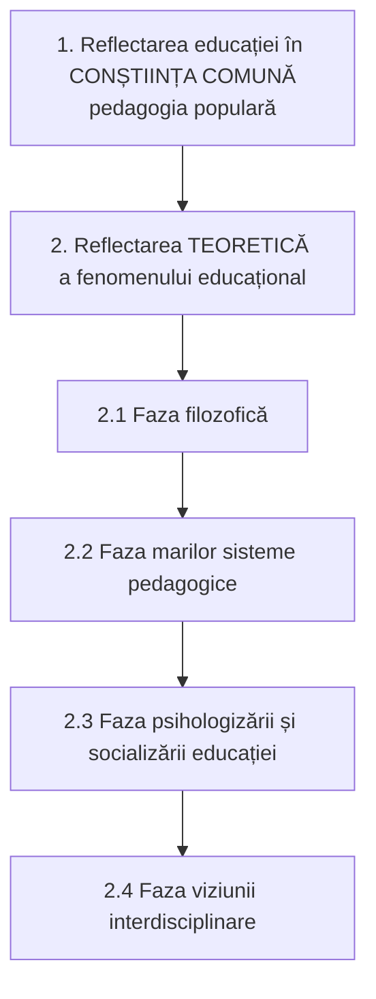
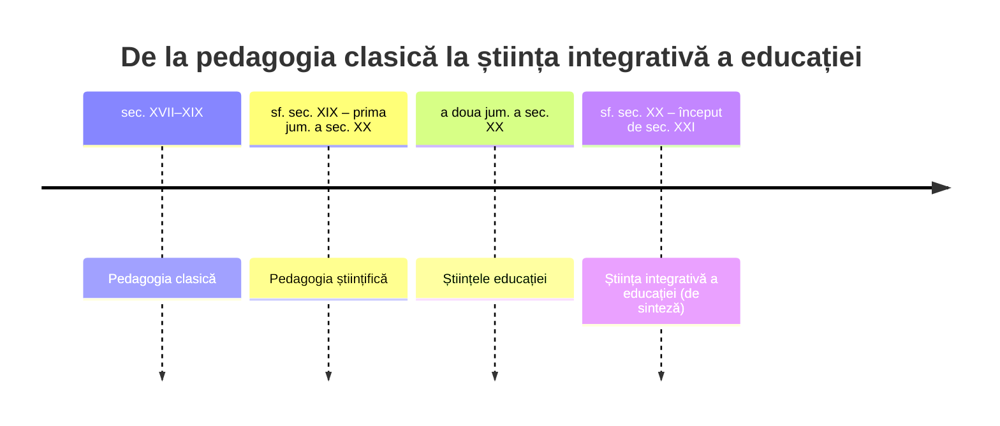

↑ [[Modulul 01 - Statutul științelor educației]] · ← [[1.1 Științele educației - delimitări conceptuale]] · → [[1.3 Normativitatea activității educaționale]]

> [!abstract] Pe scurt
> - Pedagogia a trecut prin etape succesive: **preștiințifică → empirică → științifică modernă** (I. Negreț). La I. Nicola: **reflectarea educației în conștiința comună** (pedagogia populară) → **reflectarea teoretică**, cu patru faze: **filozofică, a marilor sisteme, a psihologizării și socializării, a viziunii interdisciplinare**.
> - **J. A. Comenius** (*Didactica Magna*, sec. XVII) este considerat **fondatorul** pedagogiei ca știință (inițial sub numele de **didactică**); **J. F. Herbart** (1806, 1835) consacră denumirea de **pedagogie**.
> - O știință trebuie să aibă **obiect de studiu**, **metodologie** și **finalități cognitive** (I. Nicola) → pedagogia îndeplinește aceste cerințe.
> - Periodizarea sintetică: **pedagogie clasică** (XVII–XIX) → **pedagogie științifică** (sf. XIX – prima jumătate a sec. XX) → **științele educației** (a doua jumătate a sec. XX) → **știința integrativă a educației** (sf. XX – început de XXI).
> - Formarea specialiștilor în **Științe ale Educației** în R. Moldova: specialitatea **Pedagogie**, 180/240 de credite, **modulul pedagogic**, patru domenii de competență.

---

# PARTEA I — Ce spune manualul

## 1. Pedagogia — o știință în continuă evoluție (p. 20)

Pedagogia s-a constituit pe parcursul **dezvoltării întregii societăți**. Evoluează și azi, ceea ce cere:
- cunoașterea științifică a problemelor pedagogice **actuale**;
- abordare **intradisciplinară, interdisciplinară și transdisciplinară**;
- strategii optime de soluționare, pe baza **modelelor științelor socioumane**.

## 2. Trei etape de evoluție (p. 20–21, după I. Negreț, în Jinga & Istrate, *Manual de pedagogie*)

| Etapă | Specific |
|---|---|
| **Preștiințifică** | explicații **mitico-religioase** și abstracte ale fenomenelor educaționale |
| **Empirică** | explicare **cauzală**, interpretare **logico-matematică** a faptelor concrete |
| **Științifică modernă** | teoriile devin **modele aplicative** limitate; **metode cu utilitate imediată**; ipoteze supuse **testului falsificabilității**, dar deschise și spre cunoașterea **deductivă** și **analogică** |

## 3. Etapele constituirii pedagogiei după I. Nicola (p. 21–23)

### 3.1. Etapa reflectării în conștiința comună (p. 21)

- Educația apare ca **povețe, sfaturi, îndemnuri, tradiții, obiceiuri** transmise **oral** → **pedagogia populară**.
- Originea ei e în **societatea primitivă**: copilul era educat **în procesul muncii**, alături de adulți, și prin comunicarea cu vârstnicii. Educația avea un caracter **practic**.
- **Diviziunea muncii fizice și intelectuale** a dus la primele **idei teoretice** despre educație → trecerea la etapa a doua.

### 3.2. Etapa reflectării teoretice (p. 21–23)

#### Faza filozofică (p. 22)

- **Grecia Antică**: **Socrate, Platon, Aristotel, Democrit**.
- **Roma Antică**: profesorul de retorică **Quintilian** (Marcus Fabius Quintilianus).
- **Evul Mediu**: rolul de educator revine **educației creștine**.
- **Renașterea** — scriitorii umaniști propun idei noi despre organizarea învățământului, conținuturi și metode:

| Autor | Operă |
|---|---|
| T. Campanella | *Cetatea Soarelui* |
| Thomas Morus | *Utopia* |
| F. Rabelais | *Gargantua și Pantagruel* |

- Contribuția filozofilor și a umaniștilor pregătește **desprinderea științei educației de filozofie**.

#### Faza marilor sisteme pedagogice (p. 22–23)

- Acum se formează știința numită **pedagogie**. Fondator: **Jan Amos Comenius** (Komenský), cu *Didactica Magna* — prima **sistematizare** a teoriei pedagogice.

| Gânditor | Contribuția reținută de manual |
|---|---|
| **John Locke** | *Câteva cugetări asupra educației* — recomandări privind educația copiilor din nobilime |
| **J.-J. Rousseau** | ideea **educației libere** |
| **J. H. Pestalozzi** | educatorul **copiilor săraci** |
| **F. A. W. Diesterweg** | pregătirea cadrelor didactice — „**învățătorul învățătorilor Germaniei**” |
| **K. D. Ușinski** | prin analogie, același calificativ pentru Rusia |

#### Faza psihologizării și socializării educației (p. 23)

Spre sfârșitul sec. XIX, dezvoltarea **psihologiei** și **sociologiei** generează două orientări:

| Curent | Teza | Reprezentanți |
|---|---|---|
| **Sociologizant** | educația trebuie **subordonată intereselor societății** | H. Spencer, G. Kerschensteiner, É. Durkheim |
| **Psihologizant** | în educație totul trebuie să țină cont de **interesul copilului** | A. Binet, W. A. Lay, J. Dewey, Maria Montessori, Ellen Key |

#### Faza viziunii interdisciplinare (p. 23)

- Rezultatele unor științe sunt **valorificate de alte științe** care studiază același domeniu.
- I. Nicola: fenomenul presupune **dispariția granițelor rigide** dintre discipline și **transferul de rezultate**, pentru o explicație mai profundă și o **coordonare a unghiurilor de vedere**.

## 4. Definitivarea pedagogiei ca teorie generală a educației și instruirii (p. 23–24)

1. **Desprinderea** pedagogiei de **filozofie**.
2. **Raportarea** la progresele științelor socioumane:
   - **psihologizarea** — absolutizează **factorul intern** al dezvoltării personalității;
   - **sociologizarea** — absolutizează **factorul extern**.
3. **Extinderea cercetărilor inter- și transdisciplinare**: istorică și comparată (**istoria pedagogiei, pedagogia comparată**), economică (**planificarea învățământului**), politică (**politica educației**), managerială (**managementul educației**) → un **nou discurs** al științelor educației.
4. **Aprofundarea discursului pedagogic** → apariția **noilor științe ale educației** (→ [[1.4 Taxonomia științelor educației]]).

## 5. Repere din istoria educației în spațiul românesc (p. 24–25)

- **Geto-dacii**: practici educaționale atestate, după manual, de **Strabon** și **Dion Chrysostomos**; în **Dacia romană** ar fi existat școli elementare și superioare la **Sarmizegetusa**.
- Școli **mănăstirești și catedrale**, elementare, gimnaziale și liceale (Cluj, Iași, București), **laice** și **confesionale** (sec. XV–XIX); predarea în **slavonă, greacă, latină** e înlocuită treptat cu **limba română**.
- **Academiile Domnești** din Iași și București; **Academia Mihăileană** (Iași); **Universitatea din Iași (1860)**, **Universitatea din București (1864)**, **universitatea maghiară din Cluj (1872)**.
- **Spiru Haret** — cadrul juridic modern al învățământului: grădinițe, școli profesionale, universități. La începutul sec. XX, în România: **5073** școli primare, **55** gimnazii și licee, **12** școli normale, **141** școli profesionale (cifre date de manual).
- Perioada interbelică: noi legi pentru învățământul primar, secundar, superior.
- Idei educative apar în **literatura populară** (proverbe, zicători, povești) și la cărturari: **Gr. Ureche, M. Costin, Varlaam, Dosoftei, C. Cantacuzino, D. Cantemir**. Mai târziu: **I. Heliade Rădulescu, T. Maiorescu, N. Iorga, N. Bălcescu, M. Kogălniceanu, S. Bărnuțiu, O. Ghibu, I. Antonescu, C. Narly, St. Stoian, Șt. Bârsănescu** ș.a. (p. 25).

## 6. Statutul de știință al pedagogiei (p. 25–26)

> [!quote] Cele trei întrebări ale unei științe (I. Nicola)
> 1. Care este **obiectul de studiu**?
> 2. Care este **metodologia** (metode și procedee de cercetare)?
> 3. Care sunt **finalitățile cognitive**?

| Cerință | Răspunsul pedagogiei |
|---|---|
| **Obiect de studiu** | **fenomenul educațional** — obiect al reflecției filozofice încă de la Socrate, Platon, Aristotel |
| **Metode și procedee** | **observarea, experimentul pedagogic, convorbirea, chestionarea, cercetarea documentelor școlare, analiza activității școlare, testele psihologice** (→ [[Modulul 05 - Paradigmele pedagogiei și cercetarea pedagogică]]) |
| **Finalități cognitive** | cercetarea **comenzii sociale**, transpunerea ei în **norme și principii pedagogice**, formarea **personalității** cerute de societate |

- Pedagogia devine știință **inițial sub numele de didactică**, prin **Comenius** (*Didactica Magna*, sec. XVII).
- **J. F. Herbart** — *Pedagogie generală* (**1806**) și *Prelegeri pedagogice* (**1835**) — consacră denumirea generică de **pedagogie** (p. 26).
- Statutul s-a construit pe baza: datelor altor științe (**filozofie, psihologie, sociologie, antropologie**), **generalizării experienței educaționale** și **cercetării pedagogice**, care au dus la descoperirea **legilor educației**.

> [!tip] De reținut
> Statutul de știință al pedagogiei = **obiect de studiu propriu + metodologie de cercetare proprie + normativitate specifică**. Pedagogia își **consolidează** continuu statutul, în funcție de inovațiile științifice și de provocările sociale (p. 26).

## 7. Concepții despre educație de-a lungul istoriei (p. 26–27)

| Epocă | Concepția dominantă (parafrază) |
|---|---|
| **Antichitate** | educația = **ajutor dat copilului ca să devină om** |
| **Evul Mediu** | educația = **operă a Bisericii**, care pregătește **mântuirea** prin împlinirea cuvântului lui Dumnezeu |
| **Renaștere** | revenire la **om**: dezvoltarea sa **completă, integrală**; asumarea condiției umane |
| **Societatea modernă** | educația conduce ființa umană **de la natura concretă la natura ideală** |

- **J.-J. Rousseau** — educația respectă **natura specifică a copilului**; anticipează **„educația nouă”**, afirmată deplin în prima jumătate a sec. XX.

Idei care marchează evoluția pedagogiei (p. 27):
- scopurile educației pornesc de la **natura copilului**, pentru dezvoltarea și adaptarea lui socială (**J. Dewey**);
- organizarea educației = a **„conduce natura spre cultură”**, prin armonizarea finalităților sociale cu structurile individuale (**J. Piaget**) și prin deschidere spre **educația permanentă**;
- **stimularea învățării** — condiție a dezvoltării personale (**C. Freinet, A. S. Makarenko**); **învățământul programat**;
- noi domenii de cercetare: **istoria educației, sociologia educației, psihologia educației, psihologia învățării**.

Noile orientări: respectarea copilului ca **subiect**, a **ritmului său de dezvoltare**, creșterea rolului educației **nonformale și informale**, reorientarea obiectivelor. Pe acest fond apar **curentele contemporane**: **pedagogia negativă, antipedagogia, pedagogia instituțională, pedagogia terapeutică, pedagogia dinamicii grupului** (→ [[Modulul 02 - Clasic, modern și postmodern în educație]]).

- **Pedagogia postmodernă** valorifică realizările educației moderne: teoretic — **paradigma curriculumului**; practic — distincția față de **noile științe ale educației**, cu reconsiderarea științelor fundamentale.

## 8. Periodizarea sintetică (p. 27)

Autori invocați: É. Planchard (1975, 1992), J. L. García Garrido (1991, 1995), C. Bârzea (1995), D. Geulen (1996), R. Hofstetter & B. Schneuwly (2002).

## 9. Formarea specialiștilor în Științe ale Educației în R. Moldova (p. 28–31)

### 9.1. Cadrul (p. 28)

- Conceptualizarea specialității **Pedagogie** (L. Sadovei, L. Papuc, M. Cojocaru-Borozan, A. Zbârnea) a fost inclusă în **Nomenclatorul domeniilor de formare profesională și al specialităților**, în domeniul general **Științe ale Educației**.
- Domeniul vizează formarea **inițială și continuă** a cadrelor didactice și de conducere și dezvoltarea **competențelor psihopedagogice, metodologice și de specialitate**.
- Orientare spre **excelență** — standarde raportate la facultăți de profil din țară (UPS „Ion Creangă”, USM, USB „A. Russo”) și din străinătate (Univ. București, Univ. „Al. I. Cuza” Iași, Oxford).
- Sincronizarea cu **sistemul universitar european** cere **flexibilizarea** metodelor și formelor de organizare. Scopul: **cadre didactice de performanță**.

### 9.2. Specificul domeniului (p. 29)

- Formarea competențelor pentru **profesiunile educației** la nivel organizațional, instituțional, comunitar-local și național.
- Studentul învață nu doar **conținutul** unei științe, ci și **cum să educe/instruiască** prin acel conținut.
- Realitatea R. Moldova cere specialiști capabili să se adapteze la **schimbările permanente** din școală, clasă și personalitatea fiecărui elev.

### 9.3. Programul de formare — Ciclul I, licență (p. 29–30)

| Element | Precizare |
|---|---|
| Baza | plan-cadru, concepția curriculumului universitar, tendințe naționale și internaționale |
| Credite | **180** (monospecialitate) / **240** (două specialități înrudite) — domeniul general de studiu **14 Științe ale Educației** |
| Principiu | **învățământ centrat pe student** + formare practică adecvată |
| Forme | monospecialitate — **frecvență la zi** și/sau **frecvență redusă**; specialități duble — **la zi** |
| Specialități duble | bază **Pedagogie** + înrudită **Psihologie** sau secundară **Limba și literatura engleză** etc.; **trunchi comun**; avantaje pe piața muncii |

### 9.4. Modulul pedagogic (p. 30–31)

- Unitate de instruire construită ca **premisă teoretică, metodologică și praxiologică** a formării inițiale a cadrului didactic de orice specialitate.
- Accent **pronunțat metodologic**: legătura organică dintre **activitatea profesională** și **personalitatea profesorului**. Produsul — un profesor bine format — are un caracter **deschis, perfectibil**.

> [!tip] De reținut — domeniile competențelor pedagogice (p. 30–31)
> 1. **Specialitatea** — raportată la un domeniu științific (inclusiv dublă/triplă specializare);
> 2. **Pedagogia** și **psihologia educației/învățării** — problematica generală a educației, proiectarea, individualizarea prin cunoașterea elevilor;
> 3. **Didactica aplicată / metodica** disciplinei — structura epistemologică a specialității, treapta și vârsta școlară;
> 4. **Practica educațională** — rolurile profesorului dincolo de transmiterea cunoștințelor: **manager** al procesului didactic, **consilier, orientator, animator, îndrumător**.

### 9.5. Debușee (p. 31)

Absolventul poate lucra ca: **cadru didactic** în învățământul preuniversitar; **profesor de pedagogie și psihologie**; specialist în asistență pedagogică (școli de reeducare a minorilor, case de copii, **educația adulților**); **consilier educațional**; **pedagog-metodist**; **psiholog școlar**; specialist în **orientare școlară și profesională**; **consultanță și evaluare de programe** (ONG-uri, instituții).

---

# PARTEA II — Completări

## 10. Repere cronologice precise

| Autor | Operă și an | Contribuție |
|---|---|---|
| **Platon** | *Republica*; *Legile* | educația ca instrument al **cetății ideale**; selecție după aptitudini |
| **Aristotel** | *Politica* (cărțile VII–VIII) | educația ca **responsabilitate publică**; armonia fizic–moral–intelectual |
| **Quintilian** | *Institutio oratoria* (c. 95 d.Hr.) | formarea oratorului; atenție la **particularitățile individuale**, critica pedepselor corporale |
| **T. Morus** | *Utopia* (1516) | instrucție pentru toți, în cetatea ideală |
| **F. Rabelais** | *Gargantua și Pantagruel* (1532–1564) | critica scolasticii; educație enciclopedică |
| **T. Campanella** | *Cetatea Soarelui* (scrisă 1602, publicată 1623) | învățare intuitivă (pereții cetății ca „manual ilustrat”) |
| **J. A. Comenius** | *Didactica Magna* (redactată în cehă în anii 1630; ediția latină în *Opera didactica omnia*, 1657); *Orbis sensualium pictus* (1658) | **sistemul pe clase și lecții**, anul școlar, **principiul intuiției**, „a-i învăța **pe toți totul**” |
| **J. Locke** | *Some Thoughts Concerning Education* (1693) | educația **gentlemanului**; formarea deprinderilor, educația fizică și morală |
| **J.-J. Rousseau** | *Emil sau despre educație* (1762) | **educația naturală**, negativă; descoperirea copilăriei ca vârstă cu valoare proprie |
| **J. H. Pestalozzi** | *Leonard și Gertruda* (1781–1787); *Cum își învață Gertruda copiii* (1801) | **educația elementară**, intuiția, unitatea „cap–inimă–mână” |
| **J. F. Herbart** | *Allgemeine Pädagogik* (1806); *Umriss pädagogischer Vorlesungen* (1835) | pedagogia ca știință bazată pe **etică** și **psihologie**; **treptele formale** ale lecției |
| **F. A. W. Diesterweg** | *Wegweiser zur Bildung für deutsche Lehrer* (1835) | formarea învățătorilor; principiul **conformității cu natura** și cu **cultura** |
| **K. D. Ușinski** | *Omul ca obiect al educației* (1868–1869) | fundamentarea **antropologică** a pedagogiei; școala în limba maternă |
| **H. Spencer** | *Education: Intellectual, Moral and Physical* (1861) | ce cunoaștere are cea mai mare valoare → **știința**; utilitarism |
| **Ellen Key** | *Secolul copilului* (1900) | manifestul **pedocentrismului** |
| **W. A. Lay**, **E. Meumann** | *Experimentelle Didaktik* (Lay, 1903) | **pedagogia experimentală** |
| **M. Montessori** | *Casa dei Bambini* (Roma, 1907) | metodă bazată pe autonomie și material didactic structurat |
| **G. Kerschensteiner** | conceptul de **Arbeitsschule** (școala muncii), începutul sec. XX | educația **civică** prin muncă |
| **É. Durkheim** | *Éducation et sociologie* (1922) | educația = **socializare metodică** a tinerei generații |
| **J. Dewey** | *My Pedagogic Creed* (1897); *Democracy and Education* (1916) | **learning by doing**, școala ca comunitate democratică |
| **A. S. Makarenko** | *Poemul pedagogic* (1933–1935) | educația **în și prin colectiv** |
| **C. Freinet** | tipografia școlară, textul liber (din anii 1920) | **Școala Modernă**, cooperativă |
| **B. F. Skinner** | *The Science of Learning and the Art of Teaching* (1954) | **instruirea programată** (→ „învățământul programat” din manual) |

## 11. Precizări la reperele românești

> [!note] Comentariu — date verificabile
> - **Academia Domnească din București**: fondată de **Constantin Brâncoveanu** (**1694**). La Iași: **Colegiul/Academia Vasiliană** (**1640**, Vasile Lupu), apoi **Academia Domnească** (reorganizată la începutul sec. XVIII).
> - **Academia Mihăileană** din Iași a fost înființată în **1835** (domnitorul **Mihail Sturdza**), deci în **sec. XIX**, nu în sec. XVIII.
> - **Legea instrucțiunii publice** (**1864**, Al. I. Cuza): învățământ primar **obligatoriu și gratuit**.
> - Universitatea maghiară din Cluj (1872) devine în **1919** universitate românească („Universitatea Daciei Superioare”); numele **„Regele Ferdinand I”** i-a fost dat ulterior (1927 — de verificat). Formula manualului, „Universitatea Ferdinandi (1919)”, amestecă cele două momente.
> - **Spiru Haret** a fost ministru al Instrucțiunii în mai multe mandate între **1897 și 1910**.
> - Legislația interbelică (ministeriatul **C. Angelescu**): **Legea învățământului primar (1924)**, **Legea învățământului secundar (1928)**, **Legea învățământului superior (1932)**.
> - **Basarabia / R. Moldova**, reper absent din manual: învățământul românesc s-a dezvoltat după 1918. Instituția din care provine UPS „Ion Creangă” — **Institutul Pedagogic din Chișinău** — datează din **1940** (de verificat).

## 12. Criteriile de știință — perspectiva epistemologică

- **Karl Popper**, *Logik der Forschung* (1934; engl. *The Logic of Scientific Discovery*, 1959): o teorie e științifică dacă este **falsificabilă** — criteriu invocat de manual pentru etapa „științifică modernă”.
- **Thomas Kuhn**, *The Structure of Scientific Revolutions* (1962): științele evoluează prin **paradigme** → ideea pedagogiei ca „știință a paradigmelor” (C. Bârzea) și → [[Modulul 05 - Paradigmele pedagogiei și cercetarea pedagogică]].
- **Ion Negreț-Dobridor** (autorul capitolului citat din Jinga & Istrate) insistă că pedagogia contemporană operează cu **modele aplicative** limitate, nu cu mari sisteme.
- **R. Hofstetter & B. Schneuwly** (ed.), *Science(s) de l'éducation (19e–20e siècles)* (Peter Lang, 2002) — istoria disciplinarizării științelor educației, între **câmpuri profesionale** și **câmpuri disciplinare**.

## 13. Formarea cadrelor didactice — cadrul actual

- **Procesul Bologna** (Declarația de la Bologna, **1999**; R. Moldova aderă în **2005**): trei cicluri, **credite ECTS** (1 an ≈ **60** de credite; licența de 3 ani = **180**).
- **Codul Educației (2014)**:
  - **art. 12** — ciclul I licență = **nivelul 6 ISCED**;
  - **art. 132** — cerințe de calificare: gimnaziu = licență + **modul psihopedagogic**; liceu = **master** + modul psihopedagogic; modulul are **60 de credite** pentru absolvenții nepedagogici;
  - **art. 58** — **mentoratul** în învățământul general;
  - **art. 133** — dezvoltarea profesională **obligatorie** pe toată durata carierei.
- **Nomenclatorul**: manualul folosește codurile vechi (domeniul **14**, specialitatea **142.01 Pedagogie**). Nomenclatoarele ulterioare s-au aliniat la **ISCED-F 2013**, unde câmpul **01 Education** include **0111 Education science** (de verificat codificarea națională în vigoare).

> [!note] Comentariu
> Cele patru domenii de competență ale modulului pedagogic (specialitate – pedagogie/psihologie – didactică – practică) corespund modelului european **„profesorul ca practician reflexiv”** (D. Schön, *The Reflective Practitioner*, 1983) și cunoașterii de tip **PCK** (*pedagogical content knowledge*) descrise de **L. Shulman** (1986): profesorul trebuie să știe **ce** predă și **cum** se predă acel conținut concret.

---

## 14. Comentariu critic

> [!warning] Probleme în textul manualului
> - **Erori factuale**: „Academia Mihăileană” plasată în **sec. XVIII** (corect: **1835**); „J. **N.** Pestalozzi” (corect: **J. H.** — Johann Heinrich); „**Ian** Amos Komensky” (corect: **Jan** Amos Komenský); „Marcus Fabius **Quintilinus**” (corect: Quintilianus).
> - **Nume deformate**: „Mitropolitul **Varlaam Dosoftei**” amestecă **doi** mitropoliți diferiți (Varlaam și Dosoftei); „Onisifor **Chibu**” → **Ghibu**; „Constantin **Marly**” → **Narly**; „Emil, Planchard” → **Émile** Planchard; „Jose Luis **Garda** Garrido” → **García** Garrido; „Schneuwly, **Bemard**” → **Bernard**; „C. **Writte** Mills, 1978” → **C. Wright Mills**. Acesta din urmă a murit în **1962** și a fost sociolog, nu teoretician al „noilor științe ale educației”, deci atribuirea e îndoielnică.
> - **Afirmații neverificabile sau anacronice**: școli „superioare” la Sarmizegetusa și școli mănăstirești „în România” din **sec. IX** nu sunt susținute de izvoare citate. Termenul „România” e anacronic pentru acea perioadă. Cifrele statistice și intervalul legislativ „1928–1942” nu au sursă.
> - **Absența R. Moldova / Basarabiei** din istoria educației, într-un manual de la Chișinău.
> - **Contradicție internă**: Comenius e numit fondatorul pedagogiei ca știință, dar pedagogia se constituie „abia în sec. XVII”, adică în **faza marilor sisteme**; Nicola plasează însă aici și Rousseau, Pestalozzi, Diesterweg (sec. XVIII–XIX). Periodizarea de la p. 27 („pedagogie clasică XVII–XIX”) rezolvă parțial problema.
> - **Dewey** e plasat simultan în curentul **psihologizant** (p. 23) și e invocat pentru **adaptarea socială** (p. 27); de fapt, pedagogia lui Dewey încearcă tocmai **sinteza** psihologic–social (cum spune și p. 11).
> - **„Pedagogia negativă”** e prezentată drept curent contemporan, deși termenul descrie **educația negativă** a lui **Rousseau** (sec. XVIII).
> - **Trimiteri greșite**: [8, p. 961] — cartea lui V. Guțu are 508 pagini; [14, p. 28] și [14, p. 32–36] trimit la un titlu **inexistent** în bibliografie (probabil [13]); [16, p. 8] — la fel. Negreț e datat **1998** în text și **2008** în bibliografie.
> - **Structură**: secțiunea despre **specialitatea Pedagogie** (p. 28–31) ține de tema „rolul științelor educației în formarea profesională” din titlul **§1.1**, nu de evoluția pedagogiei. Datele (180/240 de credite, codul 142.01) sunt **datate** și specifice unui context instituțional.

---

## 15. Întrebări de autoverificare

1. Care sunt etapele constituirii pedagogiei după I. Negreț și după I. Nicola? Comparați cele două periodizări.
2. Ce este pedagogia populară și ce a determinat trecerea la reflecția teoretică?
3. De ce este considerat Comenius fondatorul pedagogiei? Ce rol are Herbart în consacrarea termenului?
4. Comparați orientarea psihologizantă și cea sociologizantă: teze, reprezentanți, limite (ce factor absolutizează fiecare).
5. Care sunt cele trei întrebări la care trebuie să răspundă o știință și cum răspunde pedagogia?
6. Numiți patru metode de cercetare pedagogică enumerate de manual.
7. Descrieți periodizarea: pedagogie clasică → pedagogie științifică → științe ale educației → știința integrativă a educației.
8. Care sunt domeniile competențelor pedagogice formate prin modulul pedagogic?
9. Identificați trei erori factuale din secțiunea despre istoria educației în spațiul românesc și corectați-le.
10. Ce cerințe de calificare impune Codul Educației (art. 132) pentru a preda în gimnaziu și în liceu?

## Surse

- **Manual**: Cojocaru-Borozan, M., Sadovei, L., Papuc, L., Ovcerenco, S. (2014). *Fundamentele științelor educației*. Chișinău: UPS „Ion Creangă”, p. 20–31.
- Nicola, I. (2003). *Tratat de pedagogie școlară*. București: Aramis (citat în manual ca „Tratat de pedagogie generală” — de verificat titlul exact).
- Negreț-Dobridor, I. „Constituirea pedagogiei ca știință”, în Jinga, I., Istrate, E. (coord.) (1998/2008). *Manual de pedagogie*. București: ALL.
- Sadovei, L., Papuc, L., Cojocaru, M., Zbârnea, A. (2011). „Fundamentarea specialității 142.01 Pedagogie...”. *Revista de științe socioumane*, nr. 3(19), p. 28–47.
- Comenius, J. A. (1657). *Didactica Magna*, în *Opera didactica omnia*. Amsterdam.
- Rousseau, J.-J. (1762). *Émile ou De l'éducation*.
- Herbart, J. F. (1806). *Allgemeine Pädagogik*.
- Durkheim, É. (1922). *Éducation et sociologie*. Paris: Alcan.
- Dewey, J. (1916). *Democracy and Education*. New York: Macmillan.
- Popper, K. (1934). *Logik der Forschung*. Wien: Springer.
- Kuhn, T. S. (1962). *The Structure of Scientific Revolutions*. University of Chicago Press.
- Hofstetter, R., Schneuwly, B. (ed.) (2002). *Science(s) de l'éducation (19e–20e siècles)*. Bern: Peter Lang.
- Schön, D. A. (1983). *The Reflective Practitioner*. New York: Basic Books.
- Shulman, L. S. (1986). „Those who understand: Knowledge growth in teaching”. *Educational Researcher*, 15(2), 4–14.
- Codul Educației al Republicii Moldova nr. 152/2014, art. 12, 58, 132, 133.
