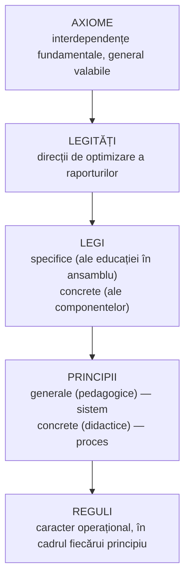

↑ [[Modulul 01 - Statutul științelor educației]] · ← [[1.2 Evoluția științelor educației]] · → [[1.4 Taxonomia științelor educației]]

> [!abstract] Pe scurt
> - **Normativitatea pedagogică** = ansamblul conexiunilor care orientează proiectarea, realizarea și dezvoltarea educației, în patru trepte: **axiome → legități → legi → principii și reguli**.
> - **3 axiome** (filozofică, sociologică, psihologică), **6 legități** (pedagogică generală, sociologică, psihologică, gnoseologică, organizațională, cibernetică), **legi specifice** și **legi concrete**.
> - **Principiile** (lat. *principium* = primul) sunt norme obligatorii pentru eficiența educației. Există **principii generale (pedagogice)**, la nivel de **sistem**, și **principii concrete (didactice)**, la nivel de **proces**; **regulile** le operaționalizează.
> - Trei principii generale detaliate (după E. Macavei): **universalitatea criteriului axiologic**; **corelația educație – autoeducație – educație permanentă**; **raportarea multiplă individ – grup – comunitate**.
> - Finalul secțiunii prezintă **teoriile clasice** (tradițională → creatoare) și **teoriile contemporane** ale educației (spiritualiste, personaliste, psihocognitive, sociale, socioculturale, academice).

---

# PARTEA I — Ce spune manualul

## 1. Normativitatea pedagogică — structura (p. 31)

> [!quote] Definiție
> **Normativitatea pedagogică** cuprinde conexiunile din **proiectarea, realizarea și dezvoltarea** educației și include: **1) axiome, 2) legități, 3) legi, 4) principii și reguli**.

## 2. Axiomele pedagogiei (p. 32)

| Axioma | Interdependența pe care o afirmă |
|---|---|
| **Filozofică** | dimensiunea **obiectivă** a educației (funcția generală de formare-dezvoltare) ↔ dimensiunea **subiectivă** (finalitățile educației/instruirii) |
| **Sociologică** | calitatea educației ↔ calitatea **dezvoltării sociale** |
| **Psihologică** | calitatea educației ↔ calitatea **dezvoltării personalității** |

## 3. Legitățile pedagogiei (p. 32)

Toate sunt formulate ca **optimizare a unor raporturi**:

| Legitatea | Optimizarea raporturilor dintre… |
|---|---|
| **Pedagogică / didactică generală** | funcțiile și finalitățile educației; **obiective – conținuturi – metodologie – evaluare** |
| **Sociologică** | **actorii educației**, la toate nivelurile sistemului (macro- și microstructural) |
| **Psihologică** | condițiile **externe** și **interne** ale educației, exprimate la nivelul **învățării** |
| **Gnoseologică** | volumul de cunoștințe acumulat **cultural** (știință, tehnologie, artă, filozofie, religie, politică) și **capacitatea de receptare** a educatului (sub îndrumarea educatorului) |
| **Organizațională** | **resursele** pedagogice existente și **rezultatele** obținute |
| **Cibernetică** | obiectivele, conținuturile și **rezultatele evaluate continuu** |

## 4. Legile educației (p. 33)

### 4.1. Legi specifice

1. Legea **ponderii specifice a funcției culturale** a educației;
2. Legea **corelației permanente educator – educat** (în orice context);
3. Legea **unității cerințelor sociale și psihologice** la nivelul finalităților;
4. Legea **unității dintre conținuturile și formele generale** ale educației;
5. Legea **organizării educației/instruirii la nivel de sistem**;
6. Legea **necesității evaluării continue**, la diferite intervale de timp;
7. Legea **proiectării pedagogice**: optimizarea raporturilor **finalități – conținuturi – metodologie – evaluare – context**.

### 4.2. Legi concrete (ale componentelor particulare)

| Componentă | Legea |
|---|---|
| **Învățarea** | **dirijarea** învățării prin intensificarea **conexiunii inverse** (reglare–autoreglare); **stimularea** învățării prin optimizarea raportului **motivație externă – internă** |
| **Calitatea învățării** | creșterea calității în termeni de **eficiență, eficacitate, progres** |
| **Obiectivele** | **operaționalizarea** în funcție de sarcinile concrete și resursele reale |
| **Conținuturile** | **selectarea** după **valoarea formativă**, potrivit vârstei și situației de instruire |
| **Metodele** | **adaptarea permanentă** la situațiile concrete de învățare |
| **Evaluarea** | valorificarea **tuturor formelor, strategiilor și metodelor** de evaluare, după context |

## 5. Principiile — definiție și tipuri (p. 34)

- Lat. ***principium*** = „primul, cel dintâi”.

> [!quote] Definiție
> **Principiile** sunt **normele care trebuie respectate** pentru a asigura **eficiența** activităților proiectate la nivelul **sistemului** și al **procesului** de învățământ.

| Tip | Sferă | Nivel |
|---|---|---|
| **Principii generale (pedagogice)** | largă — **proiectarea** activităților de educație | **sistem** |
| **Principii concrete (didactice)** | restrânsă — **realizarea** instruirii | **proces de învățământ** |
| **Reguli pedagogice** | caracter **operațional**, în interiorul fiecărui principiu | acțiune concretă |

## 6. Sinteza principiilor generale ale educației (după E. Macavei) (p. 34–35)

1. corelarea optimă a aspectelor **bio-psiho-fiziologice, ecologice, social-politice, cultural-spirituale**;
2. **unitatea vieții sociale și a educației**;
3. **unitatea valorilor general-umane și naționale**;
4. **educația etnoculturală / pluriculturală**;
5. **caracterul anticipativ (prospectiv)** — proiectează axiologia socială și individuală;
6. **umanizarea și democratizarea** vieții sociale a celui educat;
7. **diferențierea și individualizarea**;
8. dezvoltarea individuală **prin integrarea în comunitate** (interese individuale ↔ sociale);
9. **creativitatea și libertatea** (conform drepturilor copilului și ale omului);
10. **unitatea educației și autoeducației**;
11. satisfacerea **necesităților biologice** în acord cu normele conviețuirii sociale;
12. **unitatea și diversitatea** acțiunilor educaționale;
13. **valorizarea morală** a celui educat;
14. corelarea optimă a tuturor **dimensiunilor** educației (spirituală, morală, estetică, ecologică etc.) → [[Modulul 06 - Dimensiunile generale ale educației]].

- Complexitatea educației explică **multitudinea categoriilor de principii**: ale activității didactice, ale curriculumului, ale organizării sistemului de învățământ, ale **docimologiei**, managementului educațional, orientării școlare și profesionale, ale fiecărei dimensiuni a educației (p. 35).

## 7. Trei principii generale ale educației (după E. Macavei) (p. 35–38)

### 7.1. Principiul universalității criteriului axiologic (p. 35–36)

- **Axiologia** = teoria generală a **valorii**, disciplină filozofică: geneza, structura, cunoașterea, realizarea, ierarhizarea și funcțiile valorilor.
- **Valoarea** se obiectivează în produse materiale și spirituale; e un **raport** între **obiectul valorizat** și **subiectul valorizator**.
- **Educația însăși este o valoare**: prin sistemul tehnologic (idealuri, scopuri, obiective, forme, metode), prin **curriculum**, legislație, sistemul de învățământ, idei, politici — **cu condiția** ca rezultatele să corespundă **așteptărilor sociale**.
- Proiectele de formare (idealuri, scopuri, obiective) devin fapte prin **curriculum** și prin instituțiile **formale, nonformale și informale**. Rezultatele sunt **conduite**: de învățare, profesionale, civice, politice, morale, spirituale.
- Formula-cheie: **educație prin valori și pentru valori**.

**Cerințe derivate** (p. 36):
- dezvăluirea **valorilor** cunoașterii și practicii umane;
- deschiderea cunoașterii spre **valori autentice**;
- formarea **competenței axiologice** — detectarea, selectarea, **ierarhizarea** valorilor după criterii validate;
- construirea **sistemului propriu de valori** (gândire axiologică);
- atitudinea de **„autonomie axiologică”**, ca vector al **libertății spiritului**.

Cerințele se realizează prin educația **prin și pentru cultură**, prin mediul cultural al comunității (multicultural, intercultural) și prin **dialogul educat–educator**.

### 7.2. Principiul corelației educație – autoeducație – educație permanentă (p. 36–37)

Devenirea omului din ființă biologică în ființă **psiho-socio-culturală** se sprijină pe trei categorii de **trebuințe**:

| Trebuința | Tipul de influență corespunzător |
|---|---|
| **de dependență** | **heteroeducația** — influențe prin alții |
| **de independență** | **autoeducația** — educația prin sine însuși |
| **de interdependență** | **educația permanentă** |

- Performanțele dezvoltării de sine, ale integrării sociale și ale comunicării depind de **calitatea interferenței** celor trei dimensiuni.
- Când maturizarea o permite, individul devine din **obiect exclusiv** al educației **obiect și subiect** al propriei formări — **„artizanul”** ei (p. 37).
- Schimbările sociale cer **adaptări** permanente; **învățarea continuă** perfecționează adaptarea, integrarea și comunicarea, adică temeiul **calității vieții**.
- **Educația permanentă unifică** toate nivelurile **formale, nonformale și informale** (→ [[3.6 Educația permanentă și autoeducația]]).

**Cerințe derivate** (p. 37):
- stimularea **timpurie** a preocupărilor de **autocunoaștere, autoevaluare, autoformare**;
- **șanse de instruire individualizată**;
- **deschiderea** spre alții și spre lume;
- un mediu favorabil exprimării **libere și responsabile**;
- armonizarea **învățare – autoînvățare – interînvățare**;
- **interesul pentru formarea continuă**.

### 7.3. Principiul raportării multiple individ – grup – comunitate (p. 37–38)

| Centrarea pe… | Strategii / argumente (după manual) |
|---|---|
| **Individ** | soluții de **individualizare**; **instruirea asistată de calculator**. Presiunile vieții moderne (schimbare, stres, alienare, conflicte) **traumatizează** individul → nevoia de **tratare individualizată** |
| **Grup** | **sistemul pe clase și lecții** (Comenius, Pestalozzi, Herbart); **sistemul pe grupe/echipe** (O. Decroly, R. Cousinet); metode de grup: **brainstorming, sinectică, Delphi**. Armonia socială depinde de **armonia existenței în grupuri**; omul simte succesiv nevoia să fie **singur** și **cu alții** |
| **Comunitate** | promovarea valorilor **umaniste, patriotice**; teoriile **educației planetare** — soluții deocamdată mai mult teoretice |

**Cerințe derivate** (p. 38):
- abilități de **management personal**;
- abilități **antistres**;
- capacități de **comunicare și colaborare**;
- capacități de **intercomunicare**;
- cunoașterea **problemelor comunitare** și implicarea în rezolvarea lor.

> [!tip] De reținut
> Cele trei principii răspund la trei întrebări: **ce valori** transmite educația (axiologic), **cine educă și cât timp** (hetero-/auto-/permanentă), **pe cine vizează** (individ/grup/comunitate).

## 8. Modernizarea pedagogiei și teoriile educației (p. 38–40)

- Modernizarea caută **mijloacele optime de cercetare** a realității educaționale. Deschiderea spre alte științe vine din **cererea socioprofesională**: raționalizarea practicii, perfecționarea formării profesorilor, depășirea **pedagogiei tradiționale** (sursă indicată: *Les théories contemporaines de l'éducation*, Agence d'Arc, 1990).

### 8.1. Teoriile clasice — deschiderea teleologică (p. 38–39)

| Teoria | Perioada | Cine determină finalitățile | Consecință/limită |
|---|---|---|---|
| **Pedagogia tradițională** | sec. XIX | aproape exclusiv **autoritatea profesorului** | ruptura **„școală – viață”** |
| **Pedagogia nouă** | sf. XIX – început de XX | aproape exclusiv **„cerințele copilului”** | supraevaluarea **mediului natural** față de cel social |
| **Pedagogia socială** | prima jumătate a sec. XX | prioritar **„cerințele societății”** | accente **politice și politehnice**, mai ales în țările socialiste |
| **Pedagogia globalistă** | 1950–1980 | **modelul cultural al societății industrializate** | formarea **omului complex** |
| **Pedagogia creatoare** | după 1980 | **modelul cultural postindustrial, informatizat** | personalitate **adaptabilă** la o lume în schimbare rapidă |

### 8.2. Teoriile contemporane (p. 39–40)

Reflectă confruntarea dintre **modelul pedagogic industrial** (resurse pe cale de epuizare) și cel **postindustrial, informatizat** (în curs de instituționalizare):

| Teoriile… | Centrate pe… |
|---|---|
| **spiritualiste** | **transcendența** metafizică și religioasă a educației |
| **personaliste** | **exteriorizarea forțelor interne** ale educatului |
| **psihocognitive** | stimularea la maximum a **capacităților de învățare** |
| **sociale** | factorii pedagogici ai **transformării ascendente a societății** |
| **socioculturale** | valorificarea culturală a **interacțiunilor** dintre factorii sociali ai educației |
| **academice** | **valorile clasice** deschise, care asigură **formarea generală, fundamentală** |

---

# PARTEA II — Completări

## 9. Principiile fundamentale ale educației în Codul Educației al R. Moldova

**Art. 7** (Legea nr. 152/2014, cu modificările din 2022) enumeră **18 principii**:

| Lit. | Principiul | Legătura cu manualul |
|---|---|---|
| a) | **echității** — acces la învățare fără discriminare | democratizare |
| b) | **calității** — raportare la standarde naționale de referință și bune practici | legitatea organizațională |
| c) | **relevanței** — răspuns la nevoile de dezvoltare personală și socioeconomică | unitatea vieții sociale și a educației |
| d) | **centrării educației pe beneficiari** | diferențiere, individualizare |
| e) | **libertății de gândire** și independenței față de ideologii, dogme religioase, doctrine politice | creativitate și libertate |
| f) | **respectării dreptului la opinie** al elevului/studentului | umanizare |
| g) | **incluziunii sociale** | → educația incluzivă (art. 3) |
| h) | **asigurării egalității și nediscriminării** | — |
| i) | **recunoașterii drepturilor minorităților naționale** (identitate etnică, culturală, lingvistică, religioasă) | educație etnoculturală/pluriculturală |
| j) | **unității și integralității spațiului educațional** | unitate și diversitate |
| k) | **eficienței manageriale și financiare** | legitatea organizațională |
| l) | **descentralizării și autonomiei instituționale** | → [[Modulul 08 - Sistemul de educație și managementul educației]] |
| m) | **răspunderii publice** | — |
| n) | **transparenței** | — |
| o) | **participării și responsabilității** comunității, părinților și altor actori | raportarea individ–grup–comunitate |
| p) | **susținerii și promovării personalului** din educație | — |
| q) | **învățământului laic** | — |
| r) | **nonviolenței** (introdus prin LP36/2022) | — |

> [!note] Comentariu
> Principiile lui **Macavei** sunt **pedagogic-axiologice** (privesc formarea personalității). Cele din **Cod** sunt mai ales **principii de politică educațională și de guvernanță** (echitate, transparență, autonomie, răspundere publică). Tema de reflecție 6 din manual (p. 52) cere tocmai **corelarea** celor două liste.

- **Idealul educațional** (art. 6) și **finalitățile** (art. 11 — competențele-cheie) → [[Modulul 04 - Finalitățile educației]].

## 10. Principiile didactice — completare necesară

Manualul **anunță** principiile didactice (p. 34, 51), dar **nu le prezintă**. Lista clasică din didactica românească (I. Nicola, I. Cerghit, C. Cucoș — cu variații de formulare):

| Principiul didactic | Esența | Rădăcina istorică |
|---|---|---|
| **Intuiției** (unității senzorial–rațional) | pornirea de la concret, de la experiența senzorială | Comenius — „regula de aur” a didacticii |
| **Legării teoriei de practică** | aplicarea cunoștințelor | Dewey, *learning by doing* |
| **Participării conștiente și active** | înțelegere, nu memorare mecanică | pedagogia activă |
| **Sistematizării și continuității** | ordine logică, legături între cunoștințe | Comenius, Herbart |
| **Accesibilității** (respectării particularităților de vârstă și individuale) | sarcini la nivelul posibilităților, dar stimulative | L. S. Vygotsky — **zona proximei dezvoltări** |
| **Însușirii temeinice** | durabilitatea achizițiilor, repetare, exersare | — |
| **Conexiunii inverse** (feedback) | reglarea învățării pe baza rezultatelor | cibernetica (N. Wiener, 1948) → legitatea cibernetică |

## 11. Clarificări conceptuale

| Termen | Precizare |
|---|---|
| **Axiomă** | propoziție acceptată **fără demonstrație**, ca punct de plecare |
| **Legitate** | **regularitate** observată, relație **tendențială** (probabilistă) între fenomene |
| **Lege** | relație **necesară, esențială, relativ stabilă și repetabilă**. În științele socioumane, legile sunt **statistice/probabiliste**, nu deterministe ca în fizica clasică |
| **Principiu** | **normă de acțiune** derivată din legi, cu caracter **orientativ-obligatoriu** |
| **Regulă** | **prescripție operațională** concretă, prin care se aplică un principiu |

- **Axiologia**: termenul s-a impus la începutul sec. XX (**P. Lapie**, 1902; **E. von Hartmann**, 1908 — de verificat datele exacte). În pedagogia românească: **Constantin Cucoș**, *Educația. Dimensiuni culturale și interculturale* (2000); **C. Cucoș**, *Educația religioasă* (1996).
- **Heteroeducație / autoeducație**: educația făcută **de alții** vs. educația **prin sine** → [[3.6 Educația permanentă și autoeducația]].
- **Cele trei trebuințe** (dependență → independență → interdependență) seamănă cu „continuumul maturității” din literatura dezvoltării personale (S. R. Covey, *The 7 Habits of Highly Effective People*, 1989). Manualul le preia de la Macavei, fără să indice sursa inițială.

## 12. Surse ale metodelor și sistemelor invocate

| Reper | Autor și an | Precizare |
|---|---|---|
| **Metoda centrelor de interes** | **Ovide Decroly** (Belgia, *École de l'Ermitage*, 1907) | globalizare, interesele copilului |
| **Munca liberă pe grupe** | **Roger Cousinet**, *Une méthode de travail libre par groupes* (1945; experimentată din anii 1920) | grupe autoorganizate de elevi |
| **Brainstorming** | **Alex F. Osborn**, *Applied Imagination* (1953) | separarea generării ideilor de evaluarea lor |
| **Sinectica** | **William J. J. Gordon**, *Synectics* (1961) | analogii pentru creativitate |
| **Metoda Delphi** | **RAND Corporation** (anii 1950; N. Dalkey, O. Helmer) | consens al experților prin runde anonime |
| **„A învăța să trăim împreună”** | **J. Delors** (coord.), *Learning: The Treasure Within* (UNESCO, 1996) | unul dintre cei **patru piloni** ai educației: a ști, a face, a trăi împreună, a fi → principiul individ–grup–comunitate |
| **„A învăța să fii”** | **E. Faure** (coord.), *Learning to Be* (UNESCO, 1972) | fundamentarea **educației permanente** |

## 13. Teoriile contemporane — sursa tipologiei

> [!note] Comentariu
> Tipologia de la p. 39–40 corespunde lucrării **Yves Bertrand**, *Théories contemporaines de l'éducation* (Montréal/Ottawa: Éditions Agence d'Arc, 1990), citată de manual doar prin titlu. La Bertrand, după literatura secundară, apar **șapte** categorii: **spiritualiste, personaliste, psihocognitive, tehnologice, sociocognitive, sociale, academice**. Manualul **omite teoriile tehnologice** și le numește pe cele **sociocognitive** „socioculturale” (de verificat în ediția originală).
>
> Reprezentanți orientativi:
> - **personaliste** — **C. Rogers**, *Freedom to Learn* (1969);
> - **psihocognitive** — **J. Piaget**;
> - **sociocognitive** — **L. S. Vygotsky**;
> - **sociale** — **P. Freire**, *Pedagogia oprimaților* (1968);
> - **academice** — **R. M. Hutchins**, **A. Bloom** (*The Closing of the American Mind*, 1987).

---

## 14. Comentariu critic

> [!warning] Probleme în textul manualului
> - **Titlu inconsecvent**: în lista de subiecte (p. 10) apare „Principiile **educației**”, în cuprins și în text „Principiile **pedagogice**”.
> - **Promisiune neonorată**: se anunță distincția principii generale / **principii didactice**, iar concluziile (p. 51) spun că principiile includ și principiile didactice. Totuși, **niciun principiu didactic nu e prezentat** (vezi §10).
> - **Trimiteri bibliografice greșite**: Macavei este nr. **9** în bibliografie, dar e citat ca **[11, p. 74]** și **[11, p. 19–23]** (nr. 11 e Negreț). Paginile 74 și 19–23 pentru aceeași sinteză sunt, oricum, inconsecvente.
> - **Surse nedeclarate**: normativitatea (axiome–legități–legi) și teoriile clasice (tradițională → creatoare) sunt preluate, cel mai probabil, din **S. Cristea** (*Dicționar de pedagogie*; *Fundamentele științelor educației*), fără trimitere. Teoriile contemporane nu îl numesc pe **Y. Bertrand**.
> - **Distincția legitate / lege** nu e explicată: ambele sunt formulate identic („optimizarea raporturilor…”), iar diferența de statut epistemologic rămâne neclară.
> - **Plasare nepotrivită**: secțiunea „Modernizarea pedagogiei” și tipologia teoriilor (p. 38–40) nu țin de normativitate. Locul lor ar fi în [[1.2 Evoluția științelor educației]] sau în [[Modulul 02 - Clasic, modern și postmodern în educație]].
> - **Simplificări**: „pedagogia tradițională” e redusă la sec. XIX și la autoritarism; „instruirea asistată de calculator” e singurul exemplu de individualizare (datat — azi: **învățare adaptivă**, platforme digitale, plan educațional individualizat din Codul Educației, art. 3).
> - **Lista lui Macavei** amestecă niveluri: principii axiologice („unitatea valorilor”), metodologice („diferențiere și individualizare”) și biologice („satisfacerea necesităților biologice”), fără criteriu de ordonare.

---

## 15. Întrebări de autoverificare

1. Ce este normativitatea pedagogică și ce trepte cuprinde?
2. Formulați cele trei axiome ale educației și dați câte un exemplu pentru fiecare.
3. Alegeți două legități ale educației și explicați ce raporturi optimizează.
4. Distingeți principiile pedagogice (generale), principiile didactice și regulile pedagogice.
5. Explicați principiul universalității criteriului axiologic. Ce înseamnă „competență axiologică” și „autonomie axiologică”?
6. Ce trebuințe corespund heteroeducației, autoeducației și educației permanente?
7. Ce cerințe derivă din principiul raportării multiple individ – grup – comunitate?
8. Comparați pedagogia tradițională, pedagogia nouă și pedagogia socială după criteriul determinării finalităților.
9. Corelați trei principii din Codul Educației (art. 7) cu principiile generale ale educației formulate de E. Macavei.
10. Enumerați cinci principii didactice clasice și ilustrați unul cu un exemplu din practica școlară.

## Surse

- **Manual**: Cojocaru-Borozan, M., Sadovei, L., Papuc, L., Ovcerenco, S. (2014). *Fundamentele științelor educației*. Chișinău: UPS „Ion Creangă”, p. 31–40, 51–52.
- Macavei, E. (2001). *Pedagogie. Teoria educației*. București: Aramis.
- Cristea, S. (2000). *Dicționar de pedagogie*. Chișinău–București: Litera Educațional.
- Cristea, S. (2003). *Fundamentele științelor educației. Teoria generală a educației*. Chișinău–București: Litera Educațional.
- Bertrand, Y. (1990). *Théories contemporaines de l'éducation*. Montréal: Éditions Agence d'Arc.
- Nicola, I. (2003). *Tratat de pedagogie școlară*. București: Aramis.
- Cucoș, C. (2014). *Pedagogie* (ed. a III-a). Iași: Polirom.
- Faure, E. et al. (1972). *Learning to Be*. Paris: UNESCO.
- Delors, J. et al. (1996). *Learning: The Treasure Within*. Paris: UNESCO.
- Osborn, A. F. (1953). *Applied Imagination*. New York: Scribner.
- Gordon, W. J. J. (1961). *Synectics*. New York: Harper & Row.
- Cousinet, R. (1945). *Une méthode de travail libre par groupes*. Paris: Cerf.
- Wiener, N. (1948). *Cybernetics*. Cambridge, MA: MIT Press.
- Codul Educației al Republicii Moldova nr. 152/2014, art. 3, 6, 7, 11 (modificat prin LP36 din 17.02.2022).
