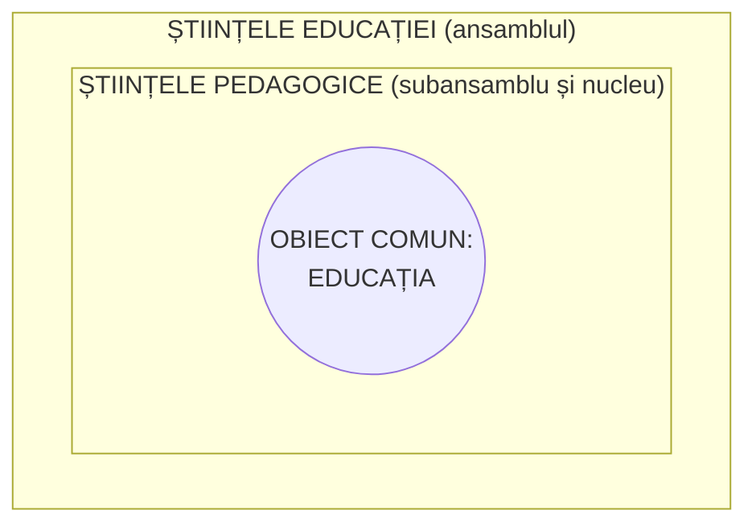
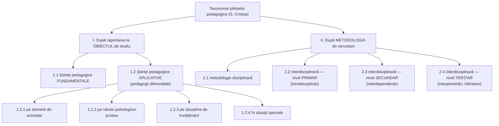

↑ [[Modulul 01 - Statutul științelor educației]] · ← [[1.3 Normativitatea activității educaționale]] · → [[1.5 Pedagogia în sistemul științelor socioumane]]

> [!abstract] Pe scurt
> - Există **mai multe modele de clasificare** (Hubert, Planchard, Dottrens & Mialaret, Babanski, García Garrido, V. de Landsheere, Cristea); o taxonomie definitivă rămâne **o problemă deschisă**.
> - **G. Mialaret**: toate științele educației au **același obiect** (educația), care le dă unitate. **Științele pedagogice** sunt un **subansamblu și nucleu** al științelor educației.
> - **S. Cristea** — **model analitic-sintetic orientativ**, pe două criterii: **(I) raportarea la obiectul de studiu** (științe **fundamentale** vs. **aplicative**) și **(II) metodologia de cercetare** (disciplinară; interdisciplinară la nivel **primar, secundar, terțiar**).
> - **Pedagogia generală** rămâne **știința fundamentală**: teoria generală a **educației**, a **instruirii**, a **curriculumului** + teoria generală a **cercetării pedagogice** (statut aparte). Funcția ei: **armonizarea** punctelor de vedere ale numeroaselor „științe ale educației”.

---

# PARTEA I — Ce spune manualul

## 1. Modele de clasificare (p. 40)

Autori care au propus taxonomii ale științelor pedagogice (cu anii dați de manual):

| Autor | An(i) |
|---|---|
| René Hubert | 1964, 1965 |
| Émile Planchard | 1968 |
| R. Dottrens & G. Mialaret | 1993 |
| I. K. Babanski | 1986 |
| José Luis García Garrido | 1991 |
| Viviane De Landsheere | 1992 |
| Sorin Cristea | 2003 |

> [!tip] De reținut
> Elaborarea unei taxonomii a științelor pedagogice **rămâne o problemă deschisă** (p. 40).

## 2. Modelul lui G. Mialaret (p. 40–41)

- Schema lui Mialaret (Fig. 1, 1985) arată că **toate științele educației au același obiect — educația**, iar acest obiect asigură **unitatea și coerența** diversității lor.
- Mialaret discută **relația dintre științele pedagogice și științele educației**: primele sunt un **subansamblu** al celor din urmă → o concepție **sistemică**.

*Reprezentare simplificată a ideii din Fig. 1 (figura propriu-zisă nu apare în textul extras al manualului).*

## 3. Modelul analitic-sintetic al lui S. Cristea (p. 41–48)

> [!quote] Punctul de plecare (p. 41)
> **Pedagogia generală** studiază educația integrând **două științe fundamentale**: **teoria generală a educației** și **teoria generală a instruirii**, abordate în ultimele decenii din perspectiva **paradigmei curriculumului**. În această accepție, pedagogia generală rămâne **știința fundamentală a educației**.

### Harta generală a modelului

## 4. Criteriul I — după raportarea la obiectul de studiu (p. 41–44)

### 4.1. Științe pedagogice fundamentale (p. 41)

Studiază domeniile de **maximă generalitate** ale educației:
1. **teoria generală a educației**;
2. **teoria generală a instruirii**;
3. **teoria generală a curriculumului**;
4. **teoria generală a cercetării pedagogice**.

### 4.2. Științe pedagogice aplicative / pedagogii diferențiale

#### 1.2.1. Pe domenii de activitate (p. 41–42)

| Pedagogia… | Specific |
|---|---|
| **socială** | educația din perspectiva **cerințelor sociale**; optimizarea raportului **școală – comunitate**. Ramuri: pedagogia **familiei**, a **muncii**, a **mass-mediei**, a **grupului școlar** |
| **artei** | educația prin artă — conținut predominant **estetic** |
| **sportului** | educația prin sport — conținut predominant **psihofizic** |
| **militară** | educația în **armată**, conform regulamentelor |
| **medicală** | educația în domeniul medical — valori ale **sănătății psihofizice** |
| **industrială** | educația în **industrie** — conținut predominant **profesional** |
| **agrară** | educația în **agricultură** — valori **tehnologice** specifice |

#### 1.2.2. Pe perioade de vârstă psihologică/școlară (p. 42–43)

| Pedagogia… | Vârste (după manual) | Mediu |
|---|---|---|
| **antepreșcolară** | **0–3 ani** | familie, instituții de creștere și îngrijire |
| **preșcolară** | **3–6/7 ani** | familie, grădiniță |
| **școlară** | școlar mic **6/7–10/11**; preadolescent **10/11–14/15**; adolescent **14/15–18/19** | învățământ primar și secundar (inferior, superior) |
| **universitară** | adolescență prelungită **18/19–24**; tinerețe **25–35**; maturitate **după 35–40** | învățământ superior (scurt, lung, postuniversitar) |
| **profesională** | **după 16–18 ani**, pe tot parcursul vieții | școlar, universitar, postuniversitar, formare continuă |
| **adulților** | **35–65 ani** | instituțional **formal și nonformal** |

#### 1.2.3. Pe discipline de învățământ (p. 43)

**Metodica / didactica specialității** — proiectarea și realizarea **predării–învățării–evaluării** la fiecare disciplină: didactica fizicii, chimiei, biologiei, istoriei, geografiei, educației fizice și tehnologice, desenului, muzicii etc.

#### 1.2.4. În situații speciale (p. 43–44)

| Pedagogia… | Obiect |
|---|---|
| **orientării școlare și profesionale** | formarea capacității de **(auto)cunoaștere** a educatului și a cerințelor sociale → **(auto)decizii** optime de integrare școlară și profesională |
| **deficiențelor** (**defectologie**) | educația persoanelor cu **handicap** (diverse naturi și grade) → **corectare, recuperare**, integrare socioprofesională |
| **ocrotirii sociale** | educația persoanelor din **instituții de asistență psihopedagogică și socială** de tip comunitar/familial |
| **aptitudinilor speciale** | educația persoanelor cu **potențial superior** (capacități, creativitate, motivație internă) → programe speciale **formale și mai ales nonformale** |
| **alternativelor educaționale** | activități formale și nonformale care oferă **soluții de schimbare a preceptelor oficiale**, la cererea comunității (familie, comunitate locală) → corectarea și chiar **restructurarea** școlii tradiționale |

## 5. Criteriul II — după metodologia de cercetare (p. 44–48)

### 5.1. Metodologie generală, de tip disciplinar (p. 44–45)

| Știința | Metodologia preluată | Scop |
|---|---|---|
| **Istoria pedagogiei** | a științelor **istorice** | analiza **sincronică–diacronică** a evoluției educației, universal și național |
| **Pedagogia comparată** | **comparativă** — descriere, **juxtapunere**, interpretare | caracteristicile esențiale ale sistemelor → explicarea prezentului, **prospectarea** viitorului |
| **Pedagogia experimentală** | **experimentală**, a științelor naturii | analiza **cât mai obiectivă** a faptelor pedagogice |
| **Pedagogia cibernetică** | principiile **ciberneticii** | **reglarea–autoreglarea** activităților didactice |
| **Managementul educației** | **managerială** | **conducerea** educației în sistem și proces |

### 5.2. Interdisciplinaritate la nivel primar — intradisciplinaritate (p. 45–46)

*Aprofundarea unui domeniu/modul al unei științe pedagogice fundamentale:*

| Știința | Ce aprofundează |
|---|---|
| **Teoria evaluării** | un modul al **didacticii generale** |
| **Teoria educației** (morale, intelectuale, tehnologice, estetice, fizice) | modulul despre **conținuturile/dimensiunile** educației → [[Modulul 06 - Dimensiunile generale ale educației]] |
| **Orientarea școlară și profesională** | obiective ale **educației tehnologice** (cunoaștere și integrare școlară, profesională, socială) |
| **Educația religioasă** | obiective ale **educației morale**, prin forme specifice concepției religioase |

### 5.3. Interdisciplinaritate la nivel secundar — interdependențe (p. 46–47)

*Sinteză între științele pedagogice fundamentale și alte științe/domenii ale culturii:*

| Știința | Fundamentează… |
|---|---|
| **Filosofia educației** | cadrul **teleologic**, pe baza **valorilor filozofice** |
| **Psihologia educației** | cadrul **psihologic** al instruirii/învățării; relația profesor–elev; cunoașterea elevului și a clasei; **aptitudinea pedagogică** |
| **Sociologia educației** | evoluția educației în raport cu **societatea**: **macrostructural** (sistemul de educație ↔ sistemul social global) și **microstructural** (organizația școlară, clasa, microgrupul) |
| **Antropologia educației** | fundamentele **culturale și interculturale** ale formării permanente |
| **Economia educației** | relația educației cu **producția** |
| **Biologia educației** | fundamentele **biologice**: creștere fizică, **ereditate**, mediu natural, structuri anatomo-fiziologice |
| **Teologia educației** | cadrul **teleologic**, pe baza **valorilor religioase** |

### 5.4. Interdisciplinaritate la nivel terțiar — interpenetrări, hibridare (p. 47–48)

| Știința | Obiect |
|---|---|
| **Logica educației** | fundamentarea **logică** a educației și instruirii |
| **Etica educației** | **normele morale** ale educației |
| **Axiologia educației** | **valorile** educației |
| **Epistemologia științelor educației** | domeniu de cercetare (neexplicitat în manual) |
| **Politica educației** | **strategiile** de politică educațională pentru proiectarea sistemelor naționale |
| **Planificarea educației** | valorificarea optimă a **resurselor** (informaționale, umane, materiale, financiare) |
| **Etnometodologia educației** | aspecte **micro-sociale**: organizarea școlii și a clasei, conflicte, factori personali, **handicapul școlar**, sursele **inegalității școlare** |
| **Managementul organizației școlare** | știința și arta **conducerii instituțiilor** de învățământ |
| **Managementul clasei de elevi** | știința și arta conducerii **activităților didactice** |
| **Fiziologia educației** | fundamentarea **fiziologică** a proceselor educative |

## 6. Rolul pedagogiei generale și tendința actuală (p. 48)

- Științele pedagogice fundamentale formează o **arie de cercetare** centrată pe educație/instruire și pe **proiectarea** lor — problematică a disciplinei de bază, **pedagogia generală** (S. Cristea).
- Pedagogia generală oferă o **perspectivă unitară** asupra unei realități educaționale tot mai **extinse, complexe și contradictorii**. **Funcția centrală**: **gestionarea și armonizarea** punctelor de vedere ale numeroaselor „științe ale educației”.
- În perspectiva **postmodernității**, pedagogia generală include: teoria generală a **educației**, a **instruirii**, a **curriculumului**. **Teoria generală a cercetării pedagogice** are **statut aparte** (→ [[Modulul 05 - Paradigmele pedagogiei și cercetarea pedagogică]]).
- Tendința modernă: cercetare prin abordări **multi-, inter- și transdisciplinare**, pentru o cunoaștere **obiectivă** a determinărilor educației.

> [!tip] De reținut
> **Fundamental** = studiază educația în general (teoria educației, instruirii, curriculumului, cercetării). **Aplicativ** = aplică teoria la un domeniu, o vârstă, o disciplină sau o situație specială. **Interdisciplinar** = se naște la granița cu altă știință (psihologie, sociologie, filosofie etc.) → [[1.5 Pedagogia în sistemul științelor socioumane]].

---

# PARTEA II — Completări

## 7. Clasificarea lui Gaston Mialaret (1976)

În *Les sciences de l'éducation* (PUF, „Que sais-je?”, 1976), Mialaret grupează științele educației în **trei categorii**:

| Grupa | Științe incluse |
|---|---|
| **1. Științe care studiază condițiile generale și locale ale educației** | istoria educației; sociologia școlară; demografia școlară; economia educației; educația (pedagogia) comparată |
| **2. Științe care studiază relația pedagogică și actul educativ** | fiziologia educației; psihologia educației; psihosociologia grupurilor mici; științele comunicării; didacticile disciplinelor; științele metodelor și tehnicilor; științele evaluării |
| **3. Științe ale reflecției și evoluției** | filosofia educației; planificarea educației și teoria modelelor |

> [!note] Comentariu
> Clasificarea lui Mialaret e mai **simplă** și mai ușor de memorat decât cea a lui Cristea, dar **nu dă un loc central pedagogiei generale**. Cristea reacționează tocmai la această **„dizolvare”** a pedagogiei într-o listă de științe: el **reafirmă pedagogia generală ca nucleu** integrator.

## 8. Alte repere de clasificare

- **Gilbert De Landsheere**, *Histoire universelle de la pédagogie expérimentale* (PUF, 1986) — accent pe **cercetarea empirică** în educație. **Viviane De Landsheere**, *L'éducation et la formation* (PUF, 1992) — sinteză a științelor educației în perspectiva formării.
- **Iuri K. Babanski** (Ю. К. Бабанский) — didact sovietic, cunoscut pentru teoria **optimizării procesului de învățământ** (anii 1970–1980); în tradiția rusă, „științele pedagogice” includ pedagogia generală, istoria pedagogiei, didactica, metodicile, pedagogia specială (defectologia) etc.
- **ISCED-F 2013** (UNESCO): câmpul larg **01 Education**, cu **011 Education** → **0111 Education science**, **0112** formarea educatorilor pentru preșcolar, **0113** formarea cadrelor didactice fără specializare pe disciplină, **0114** formarea cadrelor didactice cu specializare pe disciplină. Nomenclatoarele naționale de specialități se raportează la această clasificare.

## 9. Actualizări terminologice

| Termen din manual | Termen actual preferat | Justificare |
|---|---|---|
| **Defectologie**, „pedagogia deficiențelor”, „persoane cu handicap” | **psihopedagogie specială**; **educație incluzivă**; persoane cu **dizabilități**; copii cu **cerințe educaționale speciale (CES)** | Convenția ONU privind drepturile persoanelor cu dizabilități (2006); **Codul Educației, art. 3** (definițiile *educației incluzive*, *cerințelor educaționale speciale*, *cadrului didactic de sprijin*, *psihopedagogului special*) |
| „Pedagogia aptitudinilor speciale” | educația **copiilor capabili de performanțe înalte / supradotați** (*gifted education*) | terminologie internațională; Codul Educației (art. 9 alin. 6): statul sprijină elevii și studenții cu **performanțe remarcabile** |
| „Pedagogia alternativelor educaționale” | **alternative educaționale** (Waldorf, Montessori, Step by Step, Freinet, Jena-Plan) | Codul Educației, art. 3: alternative educaționale = programe/instituții **diferite de cele tradiționale**, dar conforme **standardelor educaționale de stat** |
| „Pedagogia adulților” | **andragogie** (M. Knowles, *The Modern Practice of Adult Education*, 1970) | termen consacrat internațional |

## 10. Științe ale educației apărute sau consolidate după modelul lui Cristea

| Domeniu | Repere |
|---|---|
| **Neuroeducația** (*Mind, Brain and Education*) | OECD, *Understanding the Brain: The Birth of a Learning Science* (2007) |
| **Științele învățării** (*learning sciences*) | R. K. Sawyer (ed.), *The Cambridge Handbook of the Learning Sciences* (2006) |
| **Tehnologia educațională / pedagogia digitală** | integrarea TIC, învățarea online; competențele digitale — Codul Educației, art. 11 lit. e) |
| **Economia educației** (dezvoltată) | teoria **capitalului uman** — T. W. Schultz (1961), G. S. Becker, *Human Capital* (1964) |

---

## 11. Comentariu critic

> [!warning] Probleme în textul manualului
> - **Figura 1 lipsește** din text (există doar legenda); numerotarea e inversată față de Fig. 2 (p. 18).
> - **Trimitere greșită**: schema lui Mialaret e citată ca **[14, p. 59]**, dar bibliografia are **13** titluri. Anul **1985** nu corespunde niciunei lucrări din bibliografie; probabil e vorba de **G. Mialaret (coord.)**, *Introduction aux sciences de l'éducation* (UNESCO/Delachaux & Niestlé, 1985) — de verificat.
> - **Ani dubioși**: „R. Dottrens și G. Mialaret (**1993**)” — Robert Dottrens a murit în **1984**, deci anul se referă, cel mult, la o reeditare. „Planchard (1968)” apare aici, dar în §1.2 Planchard e datat „1975, 1992”.
> - **Repetiții în model**: **orientarea școlară și profesională** apare de **două ori** — ca știință aplicativă în situații speciale (p. 43–44) și ca știință intradisciplinară (p. 46). **Pedagogia cibernetică** (p. 45) se suprapune cu **legitatea cibernetică** (§1.3) și cu „cibernetica pedagogică” din §1.5.
> - **Intervale de vârstă incoerente**: pedagogia **universitară** acoperă „maturitatea după 35–40”, iar pedagogia **adulților** vârstele **35–65** — suprapunere. Pedagogia adulților, limitată la 65 de ani, ignoră **educația vârstnicilor** (gerontagogie, universitățile vârstei a treia).
> - **Categorii discutabile**: **„educația religioasă”** e prezentată drept „știință pedagogică”, deși e o **dimensiune/latură** a educației, nu o știință. **„Epistemologia științelor educației — domeniul de cercetare”** e o frază incompletă.
> - **Terminologie datată**: „defectologie”, „handicap”, „pedagogia industrială/agrară/militară” (ultimele reflectă tradiția pedagogiei sovietice și românești din anii 1970–1980).
> - **Greșeli de redactare**: „studiaţă”, „destingem”, „Cistea S.”, „psihopedagogie” în loc de „psihopedagogic” (p. 44).
> - **Model preluat integral** (S. Cristea, 2003, p. 52–60), cu puțină **analiză critică** proprie a autorilor manualului. Criteriile II.2–II.4 (niveluri de interdisciplinaritate) sunt abstracte și greu de aplicat fără exemple.

---

## 12. Întrebări de autoverificare

1. De ce elaborarea unei taxonomii a științelor educației rămâne o problemă deschisă?
2. Ce relație stabilește G. Mialaret între științele pedagogice și științele educației? Ce le asigură unitatea?
3. Care sunt cele două criterii ale modelului lui S. Cristea?
4. Enumerați științele pedagogice fundamentale. Care dintre ele are statut aparte?
5. Dați câte două exemple de științe pedagogice aplicative pe domenii de activitate, pe vârste și în situații speciale.
6. Distingeți interdisciplinaritatea la nivel primar, secundar și terțiar, cu câte un exemplu.
7. Care este funcția centrală a pedagogiei generale în sistemul științelor educației?
8. Prezentați clasificarea lui G. Mialaret (1976) și comparați-o cu modelul lui S. Cristea.
9. Ce termeni din taxonomia manualului ar trebui actualizați conform Codului Educației (2014) și de ce?

## Surse

- **Manual**: Cojocaru-Borozan, M., Sadovei, L., Papuc, L., Ovcerenco, S. (2014). *Fundamentele științelor educației*. Chișinău: UPS „Ion Creangă”, p. 40–48, 52.
- Cristea, S. (2003). *Fundamentele științelor educației. Teoria generală a educației*. Chișinău–București: Litera Educațional, p. 52–60.
- Mialaret, G. (1976). *Les sciences de l'éducation*. Paris: PUF (col. „Que sais-je?”).
- Mialaret, G. (coord.) (1985). *Introduction aux sciences de l'éducation*. Paris: UNESCO / Neuchâtel: Delachaux & Niestlé (de verificat).
- De Landsheere, V. (1992). *L'éducation et la formation*. Paris: PUF.
- Legendre, R. (1993). *Dictionnaire actuel de l'éducation* (ed. a 2-a). Paris–Montréal: ESKA / Guérin.
- Knowles, M. S. (1970). *The Modern Practice of Adult Education: Andragogy versus Pedagogy*. New York: Association Press.
- OECD (2007). *Understanding the Brain: The Birth of a Learning Science*. Paris: OECD Publishing.
- Sawyer, R. K. (ed.) (2006). *The Cambridge Handbook of the Learning Sciences*. Cambridge University Press.
- Becker, G. S. (1964). *Human Capital*. New York: NBER / Columbia University Press.
- UNESCO Institute for Statistics (2014). *ISCED Fields of Education and Training 2013 (ISCED-F 2013)*. Montreal.
- Codul Educației al Republicii Moldova nr. 152/2014, art. 3, 9, 11.
