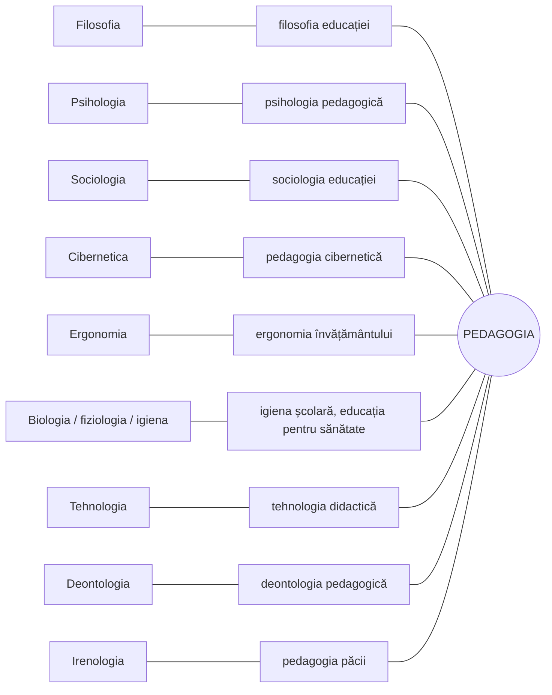

↑ [[Modulul 01 - Statutul științelor educației]] · ← [[1.4 Taxonomia științelor educației]] · → [[2.1 Clasic, modern și postmodern - delimitări conceptuale]]

> [!abstract] Pe scurt
> - **Caracterul interdisciplinar** al pedagogiei vine din faptul că **omul** — obiect și subiect al educației — este studiat și de alte științe (biologie, filosofie, psihologie, sociologie, logică, cibernetică etc.).
> - Relațiile pedagogiei cu alte științe au generat **discipline de graniță**: filosofia educației, psihologia pedagogică, sociologia educației, ergonomia învățământului, pedagogia cibernetică, igiena școlară, tehnologia didactică, pedagogia păcii, deontologia pedagogică, pedagogia democrației.
> - **Avertisment metodologic**: datele altor științe **nu devin automat adevăruri pedagogice**. Ele trebuie **analizate calitativ, extrapolate și integrate** în specificul fenomenului educațional.
> - Concluzia modulului: pedagogia are în sistemul științelor socioumane statut de **știință integratoare**.

---

# PARTEA I — Ce spune manualul

## 1. Sursa interdisciplinarității (p. 48)

- **Omul**, obiect și subiect al educației, e studiat din unghiuri diferite de **biologie, anatomie și fiziologie, filosofie, sociologie, psihologie, logică, ergonomie, cibernetică** etc.
- Ca și în alte domenii, aceste relații au dus la apariția unor **noi discipline științifice** (după I. Bontaș).

## 2. Relațiile pedagogiei cu alte științe (p. 49–51)

| Știința | Ce studiază (după manual) | Ce oferă pedagogiei / disciplina de graniță |
|---|---|---|
| **Filosofia** | legile **cele mai generale** | fundamentare **teoretică** și **metodologie generală** → **filosofia educației** |
| **Psihologia** | legile dezvoltării **proceselor psihice**, conștiinței, personalității | → **psihologia pedagogică** / „pedagogia psihologică” |
| **Sociologia** | procesele sociale, relațiile interpersonale, instituțiile | → **sociologia educației** / „pedagogia sociologică” |
| **Logica** | legile **gândirii**; operațiile logice (analiză, sinteză, comparare, abstractizare, generalizare); formele cunoașterii (**noțiune, judecată, raționament**) | predarea–învățarea **nu poate fi concepută** în afara logicii |
| **Ergonomia** (gr. *ergon* = muncă) | legile și condițiile **muncii umane** | educația și învățarea sunt **efort, muncă** → **ergonomia învățământului** |
| **Cibernetica** | studiul matematic al **legăturilor, comenzii și controlului** în organisme și sisteme tehnice; principiul **feedback-ului** | procesul de învățământ presupune **feedback** → **pedagogia cibernetică** / „cibernetica pedagogică”; aplicații: **instruirea programată și asistată de calculator** |
| **Biologia, anatomia, fiziologia, igiena** | organismul uman | → „pedagogia biologică”, **igiena școlară**, **educația pentru sănătate**, **sănătatea mentală** |
| **Antropologia** | originea, evoluția și **variabilitatea biologică** a omului, în raport cu condițiile naturale și socioculturale | → **pedagogia antropologică** |
| **Grafologia** | particularitățile individuale ale **scrisului** | → **grafopsihopedagogia** |
| **Disciplinele umaniste** — etica, dreptul, arta (literatură, teatru, film, dans, muzică) | — | elemente de **sensibilizare** emoțională, morală, juridică, estetică, cognitivă |
| **Tehnologia** (gr. *techne* = meșteșug, știință aplicată; *logos* = cuvânt, știință) | — | **mijloace tehnice** moderne în educație → **tehnologia didactică** |
| **Irenologia** — știința **păcii** | — | amenințarea armelor de distrugere în masă cere **educație pentru pace** → **pedagogia păcii** |
| **Deontologia** — știință a **moralei** profesionale | drepturi, îndatoriri, etaloane de conduită într-o profesie | → **deontologia pedagogică (didactică)** |
| **Democrația** (gr. *demos* = popor, *kratos* = putere) | — | educarea tinerei generații **pentru democrație** → **pedagogia democrației** |

- Pedagogia poate intra în relații și cu **economia, ecologia, managementul, medicina** etc., dezvoltând discipline de graniță corespunzătoare (p. 51).

## 3. Condiția metodologică a interdisciplinarității (p. 51)

> [!tip] De reținut
> - Interdisciplinaritatea pedagogiei e un fenomen **necesar și obiectiv**.
> - Datele altor științe, deși valoroase, **nu trebuie luate ca legi și adevăruri pedagogice directe, definitive**; legitățile pedagogice **nu se deduc direct** din alte științe.
> - Ele sunt valoroase doar dacă sunt **interpretate, corelate și adaptate creator**, adică **analizate calitativ, extrapolate și integrate** în specificul fenomenului educațional.

## 4. Concluziile generale ale modulului (p. 51–52)

1. **Statutul de știință** al pedagogiei e confirmat de **obiect de studiu**, **metodologie de cercetare** și **normativitate specifică** (→ [[1.2 Evoluția științelor educației]]).
2. **Principiile pedagogice** includ **principiile generale ale educației** și **principiile didactice**, obligatorii pentru eficiența educației la nivel de **sistem** și **proces** (→ [[1.3 Normativitatea activității educaționale]]).
3. **S. Cristea** propune un **model analitic și sintetic orientativ** de clasificare, rezultat al **generalizării** clasificărilor existente (→ [[1.4 Taxonomia științelor educației]]).
4. În sistemul științelor socioumane, pedagogia are statut de **știință integratoare**.

## 5. Teme de reflecție și sarcini ale modulului (p. 52–53)

- Răspunsuri la întrebări: condițiile statutului de știință; argumente pentru pedagogia ca **știință și artă**; etapele constituirii pedagogiei.
- Reprezentarea **schematică** a pedagogiei ca știință și artă.
- Argumentarea caracteristicilor pedagogiei: **socio-umană, teoretică, acțională, prospectivă, artă**.
- Analiza evoluției gândirii pedagogice, cu personalități din **sec. XX**.
- Normativitatea în practica școlară, prin metoda **„Păianjenul”** (Anexa 3).
- Aplicarea principiilor generale ale educației în R. Moldova (**Codul Educației 2014**).
- Definirea pedagogiei prin **harta conceptuală** (Anexa 4).
- **Exercițiu de creativitate**: eseu despre rolul științelor educației în formarea profesională. **Jurnal de modul**: „Ce am învățat” / „Ce pot să aplic și să schimb”.
- Bibliografia modulului: **13 titluri** (Bocoș & Jucan, Bontaș, Cristea ×2, Cucoș, *Dictionnaire actuel de l'éducation*, Gojospirova & Gojospirov, Guțu, Macavei, Momanu, Negreț, Nicola, Sadovei et al.).

---

# PARTEA II — Completări

## 6. Locul pedagogiei în clasificarea științelor — repere epistemologice

| Autor | Lucrare | Contribuție |
|---|---|---|
| **W. Dilthey** | *Einleitung in die Geisteswissenschaften* (1883) | distincția **științe ale naturii** (explică) / **științe ale spiritului** (înțeleg) → pedagogia ca **știință a spiritului**, cu metodă **hermeneutică** (tradiția *geisteswissenschaftliche Pädagogik*: H. Nohl, E. Spranger) |
| **W. Windelband** | discursul rectoral *Geschichte und Naturwissenschaft* (1894) | științe **nomotetice** (caută legi generale) / **idiografice** (descriu singularul) — pedagogia le îmbină pe amândouă |
| **J. Piaget** | *Épistémologie des sciences de l'homme* (1970) | științele omului: **nomotetice** (psihologie, sociologie, lingvistică, economie), **istorice**, **juridice**, **filozofice**; cf. și *Psychologie et pédagogie* (1969), despre raportul dintre cele două |
| **É. Durkheim** | *Éducation et sociologie* (1922) | pedagogia ca **„teorie practică”**, între știință și artă |

## 7. Niveluri ale colaborării dintre discipline

| Nivel | Esență | Exemplu în educație |
|---|---|---|
| **Monodisciplinaritate** | o singură disciplină | didactica unei discipline |
| **Multi-/pluridisciplinaritate** | mai multe discipline studiază **același obiect**, fiecare cu metodele ei, fără integrare | un fenomen (abandonul școlar) analizat separat de psiholog, sociolog, economist |
| **Interdisciplinaritate** | **transfer de metode și concepte** între discipline → discipline noi | psihologia educației, sociologia educației |
| **Transdisciplinaritate** | ceea ce e **între, dincolo și prin** discipline; unitatea cunoașterii | curriculum integrat, educația pentru dezvoltare durabilă |

- Termenul **„transdisciplinaritate”** a fost propus de **Jean Piaget** la colocviul OCDE despre interdisciplinaritate (Nisa, **1970**; volumul *L'interdisciplinarité*, 1972).
- **Basarab Nicolescu**, *La transdisciplinarité. Manifeste* (Éditions du Rocher, **1996**; trad. rom. *Transdisciplinaritatea. Manifest*, Polirom, 1999) — fundamentarea transdisciplinarității.
- Pentru curriculum: **Lucian Ciolan**, *Învățarea integrată. Fundamente pentru un curriculum transdisciplinar* (Polirom, 2008).

## 8. Precizări la disciplinele din tabel

| Disciplina | Completare |
|---|---|
| **Cibernetica** | **Norbert Wiener**, *Cybernetics: Or Control and Communication in the Animal and the Machine* (**1948**). **Instruirea programată**: B. F. Skinner (programare **liniară**, 1954); N. A. Crowder (programare **ramificată**, anii 1950–1960) |
| **Ergonomia** | din gr. *ergon* (muncă) + *nomos* (lege). Termenul e folosit de **W. Jastrzębowski** (1857) și consacrat după **1949** (K. F. H. Murrell, Marea Britanie) |
| **Deontologia** | din gr. *deon, deontos* = **„ceea ce se cuvine”, datorie** (nu „moral” în general). Termen introdus de **Jeremy Bentham** (*Deontology*, publicată postum, 1834). Codul Educației (art. 3 și capitolele despre personal) și **Codul de etică al cadrului didactic** (R. Moldova) dau conținut juridic deontologiei pedagogice |
| **Irenologia** | din gr. *eirēnē* = pace. Studiile despre pace (*peace research*) se instituționalizează cu **Johan Galtung** (Peace Research Institute Oslo, **1959**; conceptele de **pace negativă/pozitivă** și **violență structurală**, 1969) → [[Modulul 07 - Noile educații]] (educația pentru pace) |
| **Democrația** | **J. Dewey**, *Democracy and Education* (**1916**) — școala ca **„democrație în miniatură”**; Consiliul Europei — *Education for Democratic Citizenship and Human Rights* (Carta, 2010) |
| **Antropologia educației** | **K. D. Ușinski**, *Omul ca obiect al educației* (1868–1869) — „pentru a educa omul în toate privințele, trebuie să-l cunoști în toate privințele” (parafrază); **O. F. Bollnow** — antropologia pedagogică germană |
| **Neuroștiințele** (absente din manual) | legătură în plină expansiune: **neuroeducația** (OECD, 2007). Avertismentul manualului (§3) e aici foarte actual: multe **„neuromituri”** (stiluri de învățare VAK, „folosim doar 10% din creier”, dominanța emisferică) au pătruns în școli tocmai prin **transfer necritic** din altă știință |

> [!note] Comentariu — relația pedagogie–psihologie
> În tradiția sovietică și post-sovietică (inclusiv R. Moldova) se folosește termenul **„psihologie pedagogică”**. În spațiul occidental și românesc actual e mai frecvent **„psihologia educației”** (*educational psychology*, E. L. Thorndike, *Educational Psychology*, 1903). Iar „pedagogia psihologică” desemnează, istoric, curentul **psihologizant** (→ [[1.2 Evoluția științelor educației]]).

## 9. Pedagogia — „știință integratoare”: argumente pro și contra

| Pro | Contra / nuanțe |
|---|---|
| obiectul ei — educația — e **global**, cere integrarea datelor biologice, psihologice, sociale, culturale | alte științe (psihologia, sociologia educației) au o **metodologie empirică** mai riguroasă și o **autonomie** instituțională mare |
| **finalitatea practică** a educației obligă la sinteză (profesorul nu poate aplica separat „psihologia” și „sociologia”) | riscul **„colonizării”** pedagogiei de către științele-sursă (psihologizare, sociologizare — vezi §1.2) |
| pedagogia generală armonizează punctele de vedere (S. Cristea) | în mediul anglo-saxon, *education* e un **câmp** de studiu, nu o disciplină unitară — pluralitatea e acceptată ca atare |

---

## 10. Comentariu critic

> [!warning] Probleme în textul manualului
> - **Categorii eterogene**: lista pune pe același plan **științe** (psihologie, sociologie), **domenii practice** (tehnologia), un **regim politic/valoare** (democrația) și o practică **fără statut științific** (grafologia). **„Democrația”** nu este o știință. Iar **grafologia** e considerată de comunitatea științifică o **pseudoștiință**: studiile empirice nu i-au confirmat validitatea în evaluarea personalității. Prezentarea „grafopsihopedagogiei” ca știință de graniță e deci **problematică**.
> - **Etimologii inexacte**: *ergonomia* nu vine doar din *ergon*, ci și din *nomos* (lege). *Deontos* nu înseamnă „moral, etic”, ci „ceea ce se cuvine/datorie”. „*Irenos*” e o formă deformată a gr. **eirēnē**.
> - **Contradicție internă**: tabelul prezintă pedagogia mai ales ca **receptoare** de date din alte științe, iar concluzia îi atribuie statut de **știință integratoare**. Argumentele pentru rolul integrator nu sunt dezvoltate.
> - **Omisiuni**: lipsesc **neuroștiințele cognitive**, **științele comunicării**, **informatica** (în afara ciberneticii) și **lingvistica** — științe cu impact major asupra educației contemporane.
> - **Suprapuneri cu §1.4**: filosofia, psihologia, sociologia, antropologia, biologia educației apar și în taxonomia lui Cristea, fără o corelare explicită între cele două prezentări.
> - **Concluzii incomplete**: se afirmă că principiile includ **principiile didactice**, deși acestea nu au fost prezentate în modul (vezi [[1.3 Normativitatea activității educaționale]], §10).
> - **Bibliografie**: numerotarea din text nu corespunde listei finale (ex. „[2, p. 25–28]” — Bontaș — e corect, dar în modul apar trimiteri la [14] și [16], inexistente). Titlul **Momanu, *Științele educației*** (Polirom, 2002) și **Nicola, *Tratat de pedagogie generală*** ar trebui verificate: lucrarea cunoscută a lui I. Nicola este *Tratat de pedagogie **școlară***. Erată: „formarea profesionață” (p. 53).

---

## 11. Întrebări de autoverificare

1. De ce are pedagogia un caracter interdisciplinar?
2. Numiți cinci științe cu care pedagogia intră în relație și disciplina de graniță rezultată din fiecare.
3. Ce aduce cibernetica educației? Explicați rolul feedback-ului în procesul de învățământ.
4. De ce datele altor științe nu pot fi transferate direct ca adevăruri pedagogice? Dați un exemplu de „neuromit”.
5. Distingeți multidisciplinaritatea, interdisciplinaritatea și transdisciplinaritatea.
6. Argumentați sau contestați afirmația că pedagogia este o „știință integratoare”.
7. Care sunt cele patru concluzii generale ale Modulului I?
8. Ce elemente din lista manualului nu au statut de știință și de ce?

## Surse

- **Manual**: Cojocaru-Borozan, M., Sadovei, L., Papuc, L., Ovcerenco, S. (2014). *Fundamentele științelor educației*. Chișinău: UPS „Ion Creangă”, p. 48–53.
- Bontaș, I. (2008). *Tratat de pedagogie*. București: ALL Educational, p. 25–28.
- Cristea, S. (2003). *Fundamentele științelor educației. Teoria generală a educației*. Chișinău–București: Litera Educațional.
- Dilthey, W. (1883). *Einleitung in die Geisteswissenschaften*. Leipzig: Duncker & Humblot.
- Piaget, J. (1970). *Épistémologie des sciences de l'homme*. Paris: Gallimard.
- OCDE / CERI (1972). *L'interdisciplinarité. Problèmes d'enseignement et de recherche dans les universités*. Paris: OCDE.
- Nicolescu, B. (1996). *La transdisciplinarité. Manifeste*. Monaco: Éditions du Rocher (trad. rom. Polirom, 1999).
- Ciolan, L. (2008). *Învățarea integrată. Fundamente pentru un curriculum transdisciplinar*. Iași: Polirom.
- Wiener, N. (1948). *Cybernetics*. Cambridge, MA: MIT Press.
- Skinner, B. F. (1954). „The Science of Learning and the Art of Teaching”. *Harvard Educational Review*, 24(2), 86–97.
- Dewey, J. (1916). *Democracy and Education*. New York: Macmillan.
- Bentham, J. (1834). *Deontology; or, The Science of Morality*. London.
- Galtung, J. (1969). „Violence, Peace, and Peace Research”. *Journal of Peace Research*, 6(3), 167–191.
- Thorndike, E. L. (1903). *Educational Psychology*. New York: Lemcke & Buechner.
- OECD (2007). *Understanding the Brain: The Birth of a Learning Science*. Paris: OECD Publishing.
