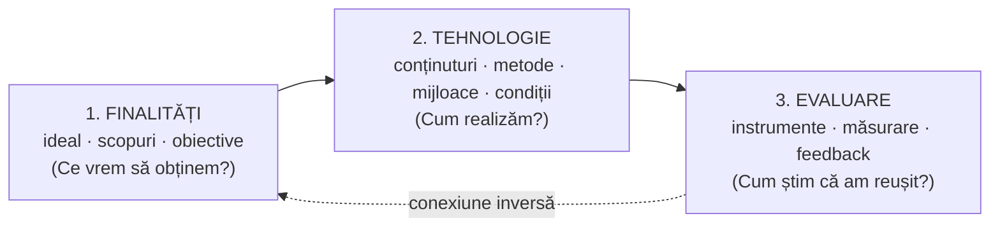
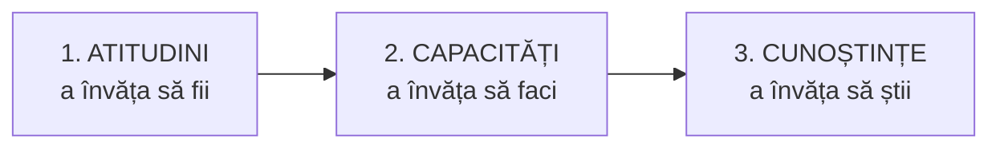

↑ [[Modulul 10 - Proiectarea, realizarea și evaluarea activității educative]] · ← [[9.4 Factorii dezvoltării personalității și factorii educativi]] · → [[10.2 Curriculum la dirigenție]]

> [!abstract] Pe scurt
> - **Proiectarea educațională** (după **I. Nicola**) creează condițiile ca educația să se orienteze spre **idealul educațional**. Are **trei dimensiuni**: stabilirea **finalităților**, elaborarea **tehnologiei** de realizare și stabilirea **instrumentelor de evaluare**.
> - Are **trei niveluri ierarhice**: proiectarea **sistemului instituțional**, a unui **modul** și a unei **unități didactice** (lecție/activitate educativă).
> - **Proiectarea curriculară** e paradigma pedagogiei postmoderne. Pornește de la **corespondența obiective – conținuturi – metodologie – evaluare** și răspunde la întrebările: *pentru ce, ce, cât, când, cum, pentru cine* se învață.
> - Modelul promovat de UNESCO **răstoarnă ierarhia** obiectivelor: **atitudini (a învăța să fii) → capacități (a învăța să faci) → cunoștințe (a învăța să știi)**.
> - Curriculumul se realizează pe mai multe **niveluri**: recomandat, scris/oficial, predat-învățat-evaluat, susținut prin resurse, testat, dobândit.

---

# PARTEA I — Ce spune manualul

## 0. Deschiderea modulului (p. 353)

- **Motto** din J. Locke: copilul nu se educă prin reguli, ci prin **practică**, folosind ocaziile care apar sau creând altele.
- **Competențe vizate**: definirea conceptelor de bază; **proiectarea**, **realizarea** și **evaluarea** activității educative (proiect, activitate, conduita dirigintelui).
- **Concepte de bază**: diriginte, rolurile dirigintelui, **referențial al competențelor profesionale** ale dirigintelui, activitate educativă, obiectivele/conținuturile/metodologia activității educative, proiectarea/realizarea/evaluarea ei, **proiect al activității educative**.

## 1. Funcția proiectării (p. 354)

- După **Ioan Nicola**, proiectarea educațională:
  - asigură condițiile pentru ca educația să se orienteze spre **idealul educațional**;
  - prevede un **șir de activități** care duc la formarea personalității cerute de societate.

## 2. Cele trei dimensiuni fundamentale ale proiectării (p. 354–355)

| # | Dimensiunea | Întrebarea-cheie | Precizări din manual |
|---|---|---|---|
| 1 | **Stabilirea finalităților** (la nivel de sistem, de treaptă sau de acțiune educațională) | *Ce anume vrem să obținem?* | finalitățile sunt **idealul, scopurile, obiectivele**. Trebuie să fie **realiste**, ca să existe armonie între cerințele societății și posibilitățile personalității |
| 2 | **Elaborarea tehnologiei** de realizare a obiectivelor | *Cu ce și cum realizăm?* | mijloacele **depind de finalități**. Se aleg după acțiunea educațională, **nivelul de dezvoltare** al elevilor și **condițiile materiale** |
| 3 | **Stabilirea instrumentelor de evaluare** a eficienței învățării | *Cum apreciem rezultatele?* | evaluarea este apreciere a calității sistemului educativ: culegerea, valorificarea, aprecierea și interpretarea informațiilor despre învățare |

- **Conexiunea inversă** (feedback-ul) este una dintre modalitățile de evaluare: oferă informații despre realizarea obiectivelor (p. 354).
- Educatorul trebuie să prevadă în proiect **ce** și **cum** va măsura. Multe achiziții se văd doar în **comportament** și sunt greu de măsurat. Proiectarea îl obligă totuși să caute modalități de evaluare pentru toate deprinderile formate (p. 355).

## 3. Structura ierarhică a proiectării educaționale (p. 355–356)

| Nivel | Obiectul proiectării | Ce presupune |
|---|---|---|
| **I. Sistemul instituțional** | obiectivele fundamentale ale învățământului într-o etapă istorică | concordanță cu direcția de dezvoltare a societății; **caracter interdisciplinar**; studii asupra realității sociale și a tendințelor ei; soluții pentru problemele **viitoare**. Variabile: calitățile dominante ale personalității (ca rezultate ale învățării), **resursele**, **instrumentele de evaluare** |
| **II. Un modul** | o parte a sistemului: **un ciclu**, anumite obiecte de învățământ, **o disciplină** sau **un capitol** | cunoașterea **contextului** și a relațiilor cu componentele **supraordonate și subordonate**. Calitatea depinde de felul în care modulul materializează proiectul sistemului |
| **III. O unitate didactică** | **o lecție** sau **o activitate educațională** | rezultatele se înscriu în **„proiectul de tehnologie didactică”** (proiectul de lecție). Concretizează nivelurile anterioare și le adaptează la particularitățile **individuale și psihosociale** ale elevilor |

- La **nivelul III** (p. 356):
  - **obiectivele** precizează în detaliu informația de asimilat, capacitățile și deprinderile, exprimate în **performanțe**;
  - **tehnologia** se concentrează pe condițiile și mijloacele predării–învățării;
  - **evaluarea** include **itemii** de performanță și **instrumentele de măsurare**.

> [!quote] Definiție (p. 356)
> Proiectarea educațională vizează **finalitățile, conținuturile, tehnologiile educaționale și evaluarea**, orientate spre formarea personalității conform **idealului educațional**.

## 4. Abordarea curriculară și modelul cultural al secolului XXI (p. 356–357)

- Teoria generală a educației este azi produsul **abordării curriculare** a (auto)formării–(auto)dezvoltării permanente, într-un **sistem social și pedagogic deschis**.
- Proiectarea curriculară valorifică deplin **educabilitatea**, în contextul **educației permanente** și al **autoeducației** (→ [[3.6 Educația permanentă și autoeducația]]).
- **Modelul cultural al personalității** în societatea informatizată presupune:
  1. formarea-dezvoltarea **permanentă**, prin **integrarea tuturor formelor și conținuturilor** educației;
  2. **autoformarea-autodezvoltarea**, prin cicluri de educație permanentă proiectate la nivelul sistemului de învățământ;
  3. **proiectarea curriculară**, centrată pe finalitățile de sistem și de proces și pe corespondența **obiective – conținuturi – metodologie – evaluare**.

## 5. Întrebările proiectării curriculare (p. 357)

| Întrebarea | Raportarea |
|---|---|
| **Pentru ce** se învață? | la **finalitățile** educației |
| **Ce** se învață? | la **conținuturi** |
| **Cât** se învață? | la **gradul de profunzime** al conținuturilor |
| **Când** se învață? | la **momentele** potrivite pentru abordarea conținuturilor |
| **Cum** se învață? | la **metode, materiale, condiții** |
| **Pentru cine** se organizează educația? | la **cunoașterea elevilor** și la particularitățile lor → învățământ **diferențiat, individualizat** |

## 6. Proiectarea curriculară ca paradigmă (p. 357–358)

- E o **direcție fundamentală** de evoluție a educației, cu **valoare de paradigmă**, promovată de **pedagogia postmodernă** în a doua jumătate a sec. XX (→ [[Modulul 02 - Clasic, modern și postmodern în educație]], [[Modulul 05 - Paradigmele pedagogiei și cercetarea pedagogică]]).
- **Componente**:
  1. **fundamentele teoretice** ale corelației educator–educat;
  2. **finalitățile** la nivel de **sistem** (ideal, scopuri) și de **proces** (obiective) (→ [[Modulul 04 - Finalitățile educației]]);
  3. **conținuturile**, selectate și organizate pedagogic;
  4. **metodologia** de instruire/învățare;
  5. **metodele și tehnicile de evaluare/autoevaluare**, integrate în metodologia instruirii.
- **Ce se proiectează curricular** (p. 358): politicile educaționale pe termen lung, **planul de învățământ**, **programele și manualele**, materialele curriculare **anexe și conexe**, proiectarea **anuală și semestrială** a activităților concrete.

### Ce asigură paradigma proiectării curriculare (p. 358)

- realizarea finalităților (ideal, scopuri, obiective);
- abordarea **globală** a educatului (individual/colectiv; elev, student, adult);
- raportarea simultană la resursele educației **morale, intelectuale, tehnologice, estetice, psihofizice** (→ [[Modulul 06 - Dimensiunile generale ale educației]]) și la cele **formale–nonformale–informale** (→ [[3.5 Relația dintre formele educației]]);
- **adaptarea continuă** a educatorului la răspunsurile (pozitive/negative) ale educatului, prin: moduri și forme de organizare; metode; strategii și tehnici de evaluare.

## 7. „Răsturnarea” ierarhiei obiectivelor (p. 358)

- Proiectarea curriculară urmărește **dezvoltarea curriculară permanentă**.
- Modelul **exersat de UNESCO** propune **„răsturnarea obiectivelor de conținut”**, adică o nouă ierarhie potrivită societății informaționale:

- În centru stau **obiectivele formative**, adaptate personalității elevului.
- Abordarea curriculară e proprie sistemelor moderne și a fost confirmată de cercetările internaționale sub egida UNESCO. Manualul trimite la **George Văideanu**, *Educația la frontiera dintre milenii*.

> [!tip] De reținut
> Pedagogia **clasică** pune pe primul loc **cunoștințele**. Proiectarea **curriculară** pune pe primul loc **atitudinile** și **capacitățile**, iar cunoștințele devin instrument al formării.

## 8. Nivelurile de realizare a curriculumului — „planul curricular deschis” (p. 359)

Proiectarea curriculară orientează valoric educația printr-un **plan curricular deschis**, care funcționează la nivel de:

| Nivel | Tip de curriculum |
|---|---|
| **politică generală** a educației | **curriculum recomandat** |
| **sistem de învățământ** | **curriculum scris, oficial** (planul de învățământ, programele) |
| **proces de învățământ** | **curriculum predat–învățat–evaluat**, realizat de profesor și elev |
| **resurse pedagogice informaționale** | curriculum realizat prin **manuale** și alte materiale-suport |
| **evaluarea rezultatelor** | **curriculum testat / evaluat** — funcție de **reglare-autoreglare** și de perfecționare a curriculumului |
| **produsul activității** | **curriculum dobândit** (învățat efectiv de elev, student) |

---

# PARTEA II — Completări

## 9. Modele clasice de proiectare a instruirii

| Autor, lucrare | Contribuția | Legătura cu manualul |
|---|---|---|
| **Ralph W. Tyler**, *Basic Principles of Curriculum and Instruction* (1949) | „**rațiunea lui Tyler**”, patru întrebări: 1) ce **scopuri** urmărește școala? 2) ce **experiențe de învățare** le pot realiza? 3) cum se **organizează** eficient aceste experiențe? 4) cum **verificăm** dacă scopurile au fost atinse? | este matricea celor **trei dimensiuni** ale lui I. Nicola (finalități – tehnologie – evaluare) |
| **Robert M. Gagné**, *The Conditions of Learning* (1965; ed. ulterioare) și *Principles of Instructional Design* (cu L. J. Briggs, 1974) | cele **nouă evenimente ale instruirii**: captarea atenției; informarea asupra obiectivelor; reactualizarea cunoștințelor anterioare; prezentarea conținutului; dirijarea învățării; obținerea performanței; feedback; evaluarea performanței; retenția și transferul | scenariul orei de dirigenție din [[10.3 Activitatea educativă a dirigintelui]] urmează această logică |
| **I. Jinga, I. Negreț**, *Învățarea eficientă* (anii '90, de verificat ediția) | **algoritmul proiectării** în patru întrebări, folosit mult în școala românească: *Ce voi face? Cu ce voi face? Cum voi face? Cum voi ști dacă am realizat?* → obiective, resurse, strategii, evaluare | o variantă didactică a modelului lui Tyler |
| **G. Wiggins, J. McTighe**, *Understanding by Design* (1998; ed. a 2-a 2005) | **proiectarea inversă** (*backward design*), în trei etape: 1) identificarea **rezultatelor dorite**; 2) stabilirea **dovezilor acceptabile** (evaluarea); 3) abia apoi **planificarea experiențelor de învățare** | inversează ordinea obișnuită: evaluarea se proiectează **înaintea** activităților |

> [!note] Comentariu
> Manualul pune evaluarea pe ultimul loc. În proiectarea inversă, evaluarea devine **a doua** etapă. Pentru ora de dirigenție, asta înseamnă să te întrebi mai întâi: *ce comportament sau ce atitudine va arăta că elevii au înțeles?* Abia apoi alegi metoda (dezbatere, joc de rol etc.).

## 10. Cadrul ERR — proiectarea pe care o folosește școala din R. Moldova

- **ERR** = **Evocare – Realizarea sensului – Reflecție**, uneori completat cu **Extindere**. Provine din programul internațional **RWCT** (*Reading and Writing for Critical Thinking*; autori: J. L. Steele, K. S. Meredith, Ch. Temple). În R. Moldova l-a promovat mai ales **Centrul Educațional Pro Didactica**.
- Este structura de lecție recomandată în multe ghiduri curriculare moderne din RM, inclusiv în ghidul disciplinei *Dezvoltare personală* (2018), unde apare explicit etapa „Realizarea sensului”.
- **Corespondențe**: *Evocarea* ≈ captarea atenției + reactualizarea; *Realizarea sensului* ≈ dirijarea învățării; *Reflecția* ≈ fixarea + feedback; *Extinderea* ≈ transferul.

## 11. Nivelurile curriculumului: sursa probabilă a listei din manual

- Lista din §8 corespunde aproape exact tipologiei lui **Allan A. Glatthorn** (*The Principal as Curriculum Leader*, 1987 și ed. ulterioare): curriculum **recomandat, scris, susținut** (prin resurse), **predat, testat, învățat**. Glatthorn adaugă și curriculumul **ascuns** și cel **exclus** (*null curriculum*).
- O tipologie înrudită: **John I. Goodlad** (1979) — curriculum **ideal, formal, perceput, operațional, trăit** (*experiential*).
- Pentru curriculumul ascuns → [[3.2 Educația formală]] (§13, Ph. Jackson).

## 12. „A învăța să fii”: precizări despre sursele UNESCO

- **Raportul Faure**, *Learning to Be / A învăța să fii* (UNESCO, 1972): educația permanentă și formarea omului complet.
- **Raportul Delors**, *Learning: The Treasure Within / Comoara lăuntrică* (UNESCO, 1996): **patru piloni** — *a învăța să știi, a învăța să faci, **a învăța să trăiești împreună**, a învăța să fii*.

> [!warning] Simplificare
> Manualul reține doar **trei** dintre cei patru piloni ai Raportului Delors. Lipsește tocmai **„a învăța să trăiești împreună”**, cel mai relevant pentru activitatea educativă a dirigintelui. Mai mult, Delors îi prezintă ca **complementari**, nu ca o ierarhie strictă.

## 13. Comentariu critic

> [!warning] Probleme ale textului
> - **Trimiteri bibliografice greșite**: „Ioan Nicola [9]” — în lista modulului, [9] este *Dicționarul* lui S. Cristea, iar I. Nicola este [15]. Lucrarea lui Văideanu e citată ca *Educația la frontiera dintre milenii*, dar la [22] figurează *UNESCO-50-Educație* (1996). Numerotarea pare preluată din altă bibliografie.
> - **Formulare contradictorie** (p. 355): se spune că efectele educației se văd în comportament, apoi că, *pentru că* se văd în comportament, nu pot fi măsurate. Probabil s-a vrut „multe achiziții **nu** se observă direct”.
> - **Erori de redactare**: „obiectelor” în loc de „obiectivelor” (p. 354, 355); definiția evaluării e dată între ghilimele, **fără sursă**.
> - **Amestec de planuri**: 10.1 începe cu proiectarea în sens **didactic** (lecție, itemi, performanțe) și trece la **paradigma curriculară** (S. Cristea), fără o legătură explicită cu **activitatea educativă a dirigintelui**, subiectul real al modulului.
> - **Suprapuneri** cu [[Modulul 04 - Finalitățile educației]] (ideal – scopuri – obiective) și cu [[Modulul 02 - Clasic, modern și postmodern în educație]] (curriculum, paradigmă).

## 14. Întrebări de autoverificare

1. Definiți proiectarea educațională. Care sunt cele trei dimensiuni ale ei după I. Nicola?
2. Caracterizați cele trei niveluri ierarhice ale proiectării. Dați câte un exemplu de produs pentru fiecare nivel.
3. La ce întrebări răspunde proiectarea curriculară? Aplicați-le unei ore de dirigenție cu tema „Să învățăm a fi toleranți”.
4. Care sunt componentele paradigmei proiectării curriculare?
5. Explicați „răsturnarea obiectivelor de conținut”. Ce pilon al Raportului Delors lipsește din manual?
6. Distingeți curriculumul recomandat, scris, predat, testat și dobândit.
7. Comparați modelul lui Tyler cu proiectarea inversă (Wiggins & McTighe).
8. Ce corespondențe există între etapele ERR și evenimentele instruirii ale lui Gagné?

## Surse

- Manual, p. 353–359; Nicola, I. (1994/2003). *Pedagogie / Tratat de pedagogie școlară*; Cristea, S. (2002). *Dicționar de termeni pedagogici*; Văideanu, G. (1988). *Educația la frontiera dintre milenii*.
- Tyler, R. W. (1949). *Basic Principles of Curriculum and Instruction*. University of Chicago Press.
- Gagné, R. M. (1965). *The Conditions of Learning*. New York: Holt, Rinehart & Winston; Gagné, R. M., Briggs, L. J. (1974). *Principles of Instructional Design*.
- Wiggins, G., McTighe, J. (1998/2005). *Understanding by Design*. Alexandria, VA: ASCD.
- Glatthorn, A. A. (1987). *The Principal as Curriculum Leader*; Goodlad, J. I. et al. (1979). *Curriculum Inquiry*.
- Faure, E. et al. (1972). *Learning to Be*. UNESCO; Delors, J. et al. (1996). *Learning: The Treasure Within*. UNESCO.
- Steele, J. L., Meredith, K. S., Temple, Ch. — materialele programului RWCT (Lectură și scriere pentru dezvoltarea gândirii critice), C.E. Pro Didactica.
- MECC (2018). *Curriculum național. Disciplina Dezvoltare personală, clasele V–IX. Ghid de implementare*. Chișinău.
