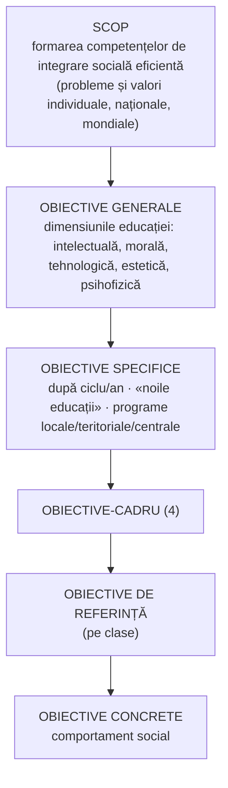

↑ [[Modulul 10 - Proiectarea, realizarea și evaluarea activității educative]] · ← [[10.1 Proiectarea activității educaționale]] · → [[10.3 Activitatea educativă a dirigintelui]]

> [!abstract] Pe scurt
> - **Curriculumul la dirigenție** (R. Moldova, 2003; autori **Vl. Pâslaru, V. Mija, E. Parlicov**) este **documentul normativ** care generalizează, consolidează și dezvoltă cunoștințele, competențele și atitudinile formate la celelalte discipline. Îi atribuie elevului **calitatea de personalitate**.
> - Diriginția a trecut de la **control și disciplină** (școala tradițională) la **flexibilitate** și formarea personalității.
> - **Ora de dirigenție** (S. Cristea) este o activitate educativă inclusă în planul de învățământ, proiectată de profesorul-diriginte. În esență e o **convorbire etică**.
> - **Scop**: formarea competențelor de **integrare socială eficientă**. **Patru obiective-cadru**: conceptul de sine; trebuințele de autorealizare; automanagementul propriei formări; cultura comportamentală.
> - Conținuturile sunt organizate pe **module**, de ex. la clasa a V-a: *Persoana și identitatea sa · Cultura dorințelor · Cultura automanagerială · Cultura comportamentului etic*.

---

# PARTEA I — Ce spune manualul

## 1. De la control la formare (p. 359–360)

- Curriculumul la dirigenție **sintetizează sistemul de valori**. Oferă profesorilor repere pentru orientarea elevilor spre **inserție socială și profesională** eficientă, condiție a **libertății persoanei**.
- În **învățământul tradițional**, funcția principală a dirigintelui era **controlul**: accent pe regulamentul școlar, iar orele de dirigenție tratau mai ales **disciplina** elevilor.
- **Azi**: activitatea de dirigenție se distinge prin **flexibilitate**. Documentul oficial a fost **elaborat în 2003** (p. 359).
- Contribuții moldovenești la „biblioteca metodologică” a dirigintelui (p. 360): **C. Calaraș, M. Braghiș, E. Sarabaș, C. Zagaevschi, L. Țurcan-Balțat** ș.a.

## 2. Definiții (p. 360)

> [!quote] Definiție — Curriculumul la dirigenție
> Documentul **normativ** care preconizează **generalizarea / consolidarea / dezvoltarea** cunoștințelor, competențelor și atitudinilor formate la diverse discipline școlare și care îi atribuie elevului **calitatea de personalitate**.

> [!quote] Definiție — Ora de dirigenție (după S. Cristea, *Dicționar de termeni pedagogici*)
> **Activitate educativă** inclusă în **planul de învățământ**, proiectată de un cadru didactic care conduce clasa de elevi (**profesorul-diriginte**).

- Specificul orei: activitate bazată pe **convorbirea etică**, orientată de **cinci principii**:
  1. al **individualizării** și al **diferențierii pozitive**;
  2. al **motivației auto-stimulatoare**;
  3. al **competenței morale productive**;
  4. al **cultivării pluralismului**;
  5. al **inițiativei creatoare**.

## 3. Principiile Curriculumului la dirigenție (p. 360)

- Curriculumul oferă **repere teleologice**. Îi cere dirigintelui să se raporteze **mai mult la conceptul educațional** promovat decât la obiectivele luate literal.
- Principiile pe care e construit:
  - respectarea **particularităților de vârstă**;
  - **continuitatea**;
  - **flexibilitatea**;
  - axarea pe **valorile naționale** și pe cele **general-umane**;
  - axarea pe **caracterul pozitiv al educației** (→ [[10.4 Dirigintele - coordonatorul activității educative]], principiul pozitiv).

## 4. Sistemul de finalități (p. 361–362)

### 4.1. Obiectivele generale (p. 361)
Vizează dimensiunile formării personalității în pedagogia modernă și postmodernă: educația **intelectuală, morală, tehnologică, estetică, psihofizică** (→ [[Modulul 06 - Dimensiunile generale ale educației]]).

### 4.2. Obiectivele specifice se stabilesc în funcție de (p. 361):
1. **particularitățile ciclului și ale anului**: educație științifică, civică, economică, politică, juridică, filosofică, religioasă, profesională, integrativă (școlară, profesională, socială), artistică (plastică, muzicală, literară), sportivă, igienico-sanitară;
2. **instituționalizarea „noilor educații”**: pentru democrație, demografică, ecologică, sanitară modernă, casnică modernă, pentru timpul liber etc. (→ [[Modulul 07 - Noile educații]]);
3. **programele educative adoptate** la nivel:
   - **local**: comisia metodică a diriginților, comisia de orientare școlară și profesională;
   - **teritorial**: inspectoratul școlar, casa corpului didactic, centrul de asistență psihopedagogică;
   - **central**: managementul grupului educat, educația pentru sănătate, a bunului cetățean, prin și pentru cultură, pentru timpul liber, pentru viața de familie, cunoașterea psihopedagogică, autocunoașterea pentru carieră, protecția civilă, protecția consumatorilor etc.

### 4.3. Obiectivele-cadru (p. 361–362)

| # | Obiectiv-cadru |
|---|---|
| I | **Formarea conceptului de sine** |
| II | **Formarea nevoilor/trebuințelor de autorealizare/actualizare** permanentă a propriei ființe |
| III | **Formarea abilităților de automanagement** al propriei formări fizice, intelectuale și spirituale |
| IV | **Dezvoltarea culturii comportamentale** |

### 4.4. Obiectivele concrete (p. 362)
Contribuie la formarea **comportamentului social**, stimulând:
- **participarea** la viața colectivului clasei;
- angajarea în activități **cooperante**;
- gândirea **independentă și critică** în situații de viață;
- **argumentarea logică** a acțiunilor și ajungerea la adevăr fără sprijinul altora.

## 5. Conținut, strategii, evaluare (p. 362–363)

| Componentă | Specific |
|---|---|
| **Conținut** | **pondere morală**, grad mare de **flexibilitate**; pornește de la **probleme sociale imperative** și de la **situații educaționale de moment** |
| **Strategii** | aplicate prioritar pe fondul **metodelor educației morale** → ora de dirigenție = **activitate de convorbire etică**. Metodologia se deduce din nivelul de capacitate, particularitățile psihologice și de vârstă, trăsăturile de personalitate ale elevilor și materiile abordate |
| **Evaluare** | analiza capacității elevilor de a formula **judecăți morale** în situații concrete: soluții normative, comparații alternative, pragmatice, obiective, subiective |
| **Structura documentului** | ca la curricula disciplinare: **obiective-cadru → obiective de referință (pe trepte) → activități educaționale → sugestii metodologice și de evaluare** |

## 6. Repere pentru clasa a V-a (gimnaziu) (p. 363–365)

### 6.1. Obiective de referință și activități (Tabelul 5, p. 363–364)

| Obiectiv-cadru | Exemple de obiective de referință | Activități/metode sugerate |
|---|---|---|
| I. Conceptul de sine | să definească și să explice noțiunea de **identitate (umană)** | discuții dirijate, studiu de caz |
| II. Trebuințe de autorealizare | să identifice **trebuințele vitale** și condițiile satisfacerii lor | discuții dirijate, studiu de caz, lecturi comentate (literatură, presă, TV), **mozaic, păianjen** |
| III. Automanagement | să explice importanța **autodirijării** în diferite profesii; să-și creeze un **model demn de urmat**; interes pentru potențialul intelectual | discuții dirijate, comentarea unor secvențe din viață, chestionare, **joc de rol**, păianjen, **masă rotundă (cercul)**, comentarea meritelor oamenilor iluștri |
| IV. Cultura comportamentală | să definească **normele etice**; să decodifice **comunicarea nonverbală**; să discearnă cerințele privind **aspectul exterior** (vârstă, sex, situație) | concursuri ale erudiților, discurs, dialog, discuție dirijată, examinarea aspectului etic, masă rotundă, studiu de caz, interviu, lectura unor texte speciale |

### 6.2. Conținuturi recomandate — clasa a V-a (p. 364–365)

| Modul | Teme (sinteză) |
|---|---|
| **I. Persoana și identitatea sa** | identitatea ca „a fi identic sieși”; identitate umană; individ – om – persoană – personalitate; apartenența la sex; **introspecția** și cunoașterea de sine; **jurnalul intim** |
| **II. Cultura dorințelor** | omul și **trebuințele** lui; trebuințe vitale/dominante; **trebuințe fiziologice** (hrană, apă, oxigen, somn, activitate fizică); supraviețuirea; stresul și alimentația (**bulimia, anorexia**); trebuințe de **protecție și securitate** (regim, ordine, lege); dorințe vs. trebuințe, limitele dorințelor; consecințele nesatisfacerii trebuințelor; **valoarea Binelui** în alegerea căilor de satisfacere |
| **III. Cultura automanagerială** | **emoțiile de bază** (plăcerea, mânia, frica, disperarea); controlul emoțiilor; **autoreglarea**; aspecte ale activității profesionale; galeria eroilor preferați; **cogniția** și cariera; **jocul** și dezvoltarea proceselor cognitive |
| **IV. Cultura comportamentului etic** | **zâmbetul**, arta de a fi simpatic; semnificația **gesturilor**; aspect cotidian și festiv; **norme de comportament** (la masă, în transport, pe stradă, la teatru); **politețea** |

## 7. Repere pentru clasa a X-a (liceu) (p. 365–367)

### 7.1. Obiective de referință și activități (Tabelul 6, p. 365–366)

| Obiectiv-cadru | Exemple de obiective de referință | Activități/metode |
|---|---|---|
| I. Conceptul de sine | esența **rolurilor de sex**; aspectul sexual al structurii persoanei; **identitatea sexuală** | discuție, masă rotundă, autoanaliză, eseu |
| II. Autorealizare | importanța **dragostei** pentru autorealizare; forța și vulnerabilitatea celui care iubește | discuție, masă rotundă, **brainstorming**, dezbateri |
| III. Automanagement | domenii de **interese stabile**; informarea despre **carieră**; limita stăpânirii emoțiilor; **maturitatea** persoanei | discuții dirijate, **discuție panel**, păianjen, masă rotundă, testare, training |
| IV. Cultura comportamentală | specificul comportamentului **feminin/masculin**; evoluția **modei** | discurs, dezbatere, discuție dirijată, joc de rol |

### 7.2. Conținuturi recomandate — clasa a X-a (p. 366–367)

| Modul | Teme (sinteză) |
|---|---|
| **I. Cultura dorințelor** | nevoia de **dragoste** și satisfacțiile ei; importanța ei pentru autorealizare; **familia** ca sursă; formele și intensitățile iubirii; iubire–sinceritate–vulnerabilitate; speranță și decepție; **gelozia, ura**; „vreau” și „nu se poate” |
| **II. Cultura automanagerială** | **maturitate/imaturitate** (biologică, psihologică, socială); emotivitatea; interesele și hobby-ul; interese și aptitudini față de profilul ales; **viitoarea profesie** și sursele de informare; personalitate – **vocație – carieră – succes** |
| **III. Cultura comportamentului etic** | dualitatea femeie–bărbat; identitatea sexuală; statutul femeii și al bărbatului în istorie; **roluri tradiționale**, diferențe de sex-rol; **stereotipuri** și idealuri ale masculinității/feminității; **moda** în retrospectivă |

> [!tip] De reținut
> Aceleași **patru obiective-cadru** se regăsesc la toate clasele. **Conținuturile** se schimbă după vârstă: la clasa a V-a domină **trebuințele de bază, emoțiile și politețea**; la clasa a X-a, **iubirea, maturitatea, cariera și identitatea de gen**.

---

# PARTEA II — Completări

## 8. Curriculumul la dirigenție — edițiile din R. Moldova

| Ediție | Date |
|---|---|
| **Ediția I (2003)** | Ministerul Educației al RM; autori **Vl. Pâslaru, V. Mija, V. [E.] Parlicov**, Ed. Liceum, Chișinău; citată în manual la [10] |
| **Ediția a II-a, revăzută (2006)** | Ministerul Educației și Tineretului; clasele **V–XII**. Autori: **Vlad Pâslaru** (coordonator, IȘE), **Violeta Mija** (IȘE), **Eugenia Parlicov** (MET). Recenzenți: Vl. Guțu, V. Goraș-Postică, T. Repida, A. Zbârnea ș.a. Componente: **teleologie, conținuturi, tehnologii, epistemologie** |

- În ediția a II-a (2006), principiile sunt **șapte**: caracterul pozitiv al educației; angajarea educației în mediul școlar – comunitar – național – european – mondial; unitatea și continuitatea dintre activitățile la clasă și cele de dirigenție; flexibilitatea; corelarea factorilor **școală – familie – comunitate**; deplinătatea axiologică (valori naționale și general-umane); centrarea pe **formarea identității personale** (respectarea particularităților de vârstă).
- Același document din 2006 precizează că la orele de dirigenție **nu se pun note**. Evaluarea e mai ales de **consiliere și orientare**, **nu de control**. Prioritate au **autoevaluarea**, autocorectarea, corectarea reciprocă și **„autoaprecierea vegheată”**.
- Ediția din 2006 folosește termenii **„identitate de gen / roluri de gen”**. Are **patru module și la clasa a X-a** (inclusiv *Persoana și identitatea sa*). Manualul, cu „identitate sexuală” și doar trei module la clasa a X-a, pare să reproducă **ediția din 2003** (de verificat pe textul ediției I).

> [!note] Comentariu
> Pasajul din 10.4 despre „coordonata națională” și „coordonata universală” a educației și despre **principiul pozitiv și principiul libertății** este preluat, aproape identic, din **Reperele conceptuale** ale acestui curriculum. Există o diferență: ediția din 2006 trimite la *Legea învățământului*, iar manualul a actualizat trimiterea la *Codul educației* (2014).

## 9. Actualizare: disciplina „Dezvoltare personală” (R. Moldova, din 2018)

- **Curriculumul național la disciplina *Dezvoltare personală***, clasele V–IX și X–XII, a fost aprobat de Consiliul Național pentru Curriculum prin **Ordinul MECC nr. 1124 din 20 iulie 2018**. Coordonatoare a grupului de lucru: **Otilia Dandara** (USM).
- **Statut**: disciplină **obligatorie**, clasele **I–XII**, în aria curriculară nou creată **„Consiliere școlară și dezvoltare personală”**; la gimnaziu, **1 oră/săptămână (34 ore/an)**.
- **Cinci module**:
  1. *Identitatea personală și relaționarea armonioasă*;
  2. *Asigurarea calității vieții*;
  3. *Modul de viață sănătos*;
  4. *Proiectarea carierei profesionale și dezvoltarea spiritului antreprenorial*;
  5. *Securitatea personală*.
- **Evaluare**: criterială, prin descriptori. Pentru clasele absolvente (a IX-a, a XII-a) se acordă calificativul **„admis/respins”** (Repere metodologice 2019–2020).
- În planul-cadru, disciplina a preluat în practică **locul orei de dirigenție**. De regulă o predă dirigintele (de verificat formularea normativă exactă).

> [!note] Comentariu
> Comparație **Curriculum la dirigenție (2003/2006)** → **Dezvoltare personală (2018)**:
> - de la **obiective-cadru și de referință** la **competențe specifice și unități de competență**;
> - de la o dominantă **morală** („convorbirea etică”) la o abordare **psihologică și de life skills** (sănătate, securitate, carieră, antreprenoriat);
> - de la oră **fără evaluare formală** la disciplină **obligatorie evaluată** (descriptori).
>
> Continuitatea se vede în modulele despre **identitate, stil de viață sănătos și carieră**, care corespund vechilor obiective-cadru I–III.

> [!note] Comentariu — paralela cu România
> În România, aria **„Consiliere și orientare”** există de mult în planurile-cadru. Din anul școlar **2026–2027** a fost anunțată pentru liceu disciplina **„Dezvoltare personală și consiliere în carieră”**, în locul orei de dirigenție (după presa de specialitate — de verificat actul normativ).

## 10. Metode active menționate în curriculum — pe scurt

| Metodă | Esența | Origine / referință |
|---|---|---|
| **Mozaicul** (*Jigsaw*) | grupuri de „experți” învață fiecare o parte a temei, apoi o predau colegilor din grupul inițial | **Elliot Aronson**, Austin, Texas (1971); *The Jigsaw Classroom* (1978) |
| **Păianjenul / pânza de păianjen** | variantă de joc: participanții, în cerc, își aruncă un ghem de ață și formulează fiecare o idee, până se formează o „pânză” a legăturilor. Variantă grafică: **diagrama-păianjen**, cu conceptul în centru și ideile asociate „pe picioare” | tehnică din practica metodică și a animației de grup (manualul **nu o descrie**; → [[Anexe - instrumente de lucru]]) |
| **Brainstormingul** | generare liberă de idei, fără critică, apoi evaluare | **Alex F. Osborn**, *Applied Imagination* (1953) |
| **Discuția panel** | un grup restrâns de „experți” discută în fața clasei, care intervine apoi cu întrebări | tehnică de dezbatere |
| **Masa rotundă** | discuție egalitară a unui grup pe o temă, cu moderator | — |
| **Jocul de rol** | asumarea unor roluri pentru exersarea comportamentelor și a empatiei | J. L. Moreno (psihodramă) — rădăcină istorică |

## 11. Consilierea educațională — sursa-reper din bibliografie

- **Adriana Băban (coord.)**, *Consiliere educațională. Ghid metodologic pentru orele de dirigenție și consiliere*, Cluj-Napoca, Imprimeria „Ardealul”, **ed. I 2001**, retipărit ulterior (manualul citează o ediție din 2011).
- Ghidul are un model **preventiv și de dezvoltare** a personalității. Teme: cunoașterea elevilor (psihologia dezvoltării), autocunoaștere și dezvoltare personală, **comunicare și conflict**, rezolvare de probleme, **managementul clasei**, **orientarea carierei**, strategii de învățare.
- Este citat și în bibliografia curriculumului *Dezvoltare personală* din RM (2018).

## 12. Comentariu critic

> [!warning] Probleme ale textului
> - **Informație datată**: manualul (2014) numește documentul din **2003** „documentul oficial” actual. Ediția a II-a apăruse deja în **2006**. După **2018**, ora de dirigenție a fost înlocuită de *Dezvoltare personală*.
> - **Discordanță internă** la clasa a X-a: **patru** obiective-cadru (inclusiv „conceptul de sine”), dar doar **trei** module de conținut. Temele de identitate sunt mutate în „Cultura comportamentului etic”.
> - **Trimitere suspectă**: principiile orei de dirigenție sunt atribuite lui [9, p. 12] (*Dicționarul* lui S. Cristea), deși o intrare despre „ora de dirigenție” nu se află, alfabetic, la p. 12.
> - **Reproducere aproape integrală** a unor fragmente din curriculum, cu erori de tipar („gimanziu”, „speciilor umană”), fără analiză critică: de ce aceste module, cum se leagă de vârstă.
> - Unele formulări din conținuturi (ex. clasificarea „formelor de iubire”) sunt azi discutabile didactic. Ediția din 2006 le reformulează în termeni de **gen, egalitate și parteneriat**.
> - Nu se face distincția între **ora de dirigenție** (formală, din planul de învățământ) și **activitățile educative** extracurriculare ale dirigintelui (→ [[3.3 Educația nonformală]]).

## 13. Întrebări de autoverificare

1. Definiți Curriculumul la dirigenție și ora de dirigenție (după S. Cristea).
2. Cum s-a schimbat funcția dirigintelui de la școala tradițională la cea actuală?
3. Enumerați principiile orei de dirigenție și principiile Curriculumului la dirigenție.
4. Care sunt cele patru obiective-cadru? Formulați câte un obiectiv de referință pentru clasa a VII-a.
5. De ce este numită ora de dirigenție o „convorbire etică”? Ce metode ale educației morale folosește?
6. Comparați conținuturile recomandate pentru clasele a V-a și a X-a. Ce logică de vârstă observați?
7. Ce aduce nou disciplina *Dezvoltare personală* (2018) față de Curriculumul la dirigenție?
8. Descrieți metoda mozaicului și propuneți o temă de dirigenție potrivită pentru ea.

## Surse

- Manual, p. 359–367; Cristea, S. (2002). *Dicționar de termeni pedagogici*.
- Pâslaru, Vl., Mija, V., Parlicov, E. (2003; ed. a II-a revăzută 2006). *Curriculum la dirigenție. Clasele V–XII*. Chișinău: Ministerul Educației (și Tineretului).
- MECC (2018). *Curriculum național. Aria curriculară Consiliere școlară și dezvoltare personală. Disciplina Dezvoltare personală, clasele V–IX. Curriculum disciplinar și ghid de implementare*. Chișinău (Ordinul nr. 1124 din 20.07.2018). [PDF](https://mecc.gov.md/sites/default/files/dp_gimnaziu_2018-08-24_curriculum_ghid.pdf)
- MECC (2019). *Repere metodologice privind organizarea procesului educațional la disciplina Dezvoltare personală, 2019–2020* (Anexă la Ordinul nr. 1046 din 21.08.2019).
- Băban, A. (coord.) (2001). *Consiliere educațională. Ghid metodologic pentru orele de dirigenție și consiliere*. Cluj-Napoca: Imprimeria „Ardealul”.
- Aronson, E. et al. (1978). *The Jigsaw Classroom*. Beverly Hills: Sage.
- Osborn, A. F. (1953). *Applied Imagination*. New York: Scribner.
