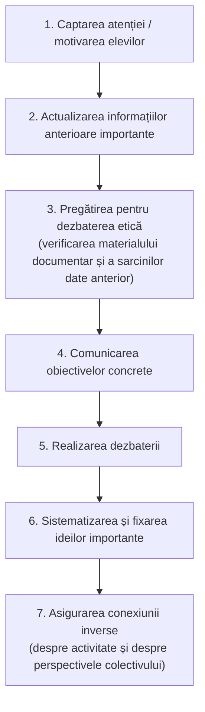

↑ [[Modulul 10 - Proiectarea, realizarea și evaluarea activității educative]] · ← [[10.2 Curriculum la dirigenție]] · → [[10.4 Dirigintele - coordonatorul activității educative]]

> [!abstract] Pe scurt
> - Activitatea educativă a dirigintelui are patru componente: **managementul clasei ca grup**, **dezvoltarea personalității** elevilor, **educația pentru sănătate și valori culturale**, **educația pentru securitate personală**. Reforma adaugă două direcții prioritare: **consilierea individuală** și **orientarea școlară și profesională**.
> - Activitatea se planifică prin **proiectul orei educative**, cu două părți: **I. Elemente generale** (data, clasa, tipul, tema, competențele, metodologia) și **II. Scenariul pedagogic** (7 momente, de la captarea atenției la conexiunea inversă).
> - Exemplu de strategie: **simularea „Școala democratică”**, cu trei modalități de decizie în grup: **votul, consensul, decizia competentă**.
> - **Stiluri manageriale** ale diriginților: **creativ / rutinar**, **centrat pe conținut / centrat pe formarea elevului**; după K. Lewin, **autoritar / democratic / permisiv**.

---

# PARTEA I — Ce spune manualul

## 1. Evoluția și structura activității educative (p. 368)

- În deceniile trecute s-a pus accent pe **funcția educativă** a dirigintelui. Au rămas însă și sarcinile **organizatorice și administrativ-disciplinare** tradiționale.
- **Componentele** activității educative, conturate treptat:

| | Componentă |
|---|---|
| a) | **managementul clasei ca grup** |
| b) | **dezvoltarea personalității** elevilor |
| c) | **educația pentru sănătate**; receptarea **valorilor culturale** |
| d) | **educația pentru securitate personală**: educație rutieră, protecția valorilor democratice, calitatea mediului, dezvoltare durabilă, protecție civilă, apărare împotriva incendiilor, prevenirea **delincvenței juvenile** și a **traficului de ființe umane** |

## 2. Direcțiile prioritare adăugate de reforma curriculară (p. 368–370)

### I. Consilierea individuală a elevilor (p. 368)
Vizează formarea:
- **autocunoașterii**: caracteristici și abilități personale, inclusiv punctele slabe sau insuficient exersate;
- disponibilității de a-și **asuma responsabilități** față de sine, familie, școală;
- capacității de a-i **asculta** pe ceilalți;
- **discernământului** în alegerea modulelor opționale și a traseului de formare profesională.

### II. Orientarea școlară și profesională (p. 369–370)
Diriginții sunt **obligați** să desfășoare o activitate susținută de orientare, individual sau în grup. Activități posibile:
- informare și documentare: **profile ocupaționale**, ghiduri, lucrări, filme, vizite, activitate practică în ateliere;
- valorificarea în grup a **experiențelor pozitive** ale elevilor și ale părinților;
- **vizite** în alte școli, întreprinderi, instituții; **invitați** din diferite profesii;
- încurajarea participării la **cercuri de specialitate**;
- invitarea directorilor de **școli profesionale și licee**;
- întâlniri cu **foști elevi** cu realizări profesionale;
- întâlniri comune **elevi – părinți – profesori**.

**Partenerii** orientării (p. 369–370):
- **Părinții**, în primul rând: discuții despre soluțiile **realiste** de orientare. Un părinte bine informat (despre instituții și despre abilitățile dovedite de copil) influențează decisiv opțiunile reale ale copilului.
- **Membrii comunității** și **angajatorii**: clarifică cerințele de pregătire, calitățile și abilitățile cerute noilor angajați.

- Aria curriculară **„Consiliere și orientare”** este descrisă ca arie de aplicații, dezvoltări practice, experiențe și atitudini de exersat pentru viață (p. 370).
- Activitățile educaționale respectă structura **Curriculumului la dirigenție**, asemănătoare cu cea a disciplinelor. Ele continuă firesc formarea personalității de la orele de curs (→ [[10.2 Curriculum la dirigenție]]).

## 3. Proiectul activității educative (p. 370–371)

Activitatea educativă este **planificată** de diriginte pe baza curriculumului, prin **proiectul orei educative**. Literatura propune multe modele. Manualul propune următoarea structură:

### I. Elemente generale
| Element | Exemple / precizări |
|---|---|
| **Data** | — |
| **Clasa** | — |
| **Tipul activității** | oră de dirigenție, **vizită** (teatru, instituții sociale), **excursie**, **masă rotundă**, **dezbatere etică**, **vizionare colectivă** de filme educative |
| **Tema** | — |
| **Competențe** | — |
| **Metodologia** | **exerciții morale, exemple morale, convorbiri morale, studii de caz, asalt de idei**, cu mijloace adecvate (material documentar, ilustrativ, bibliografic, informatizat) |

### II. Scenariul pedagogic (conținutul activității)

## 4. Strategie exemplificată: simularea „Școala democratică” (p. 371–374)

### 4.1. Fișa activității

| Parametru | Conținut |
|---|---|
| **Participanți** | 20–30 de elevi |
| **Durata** | 1–2 ore |
| **Scop educativ** | examinarea **drepturilor și responsabilităților** individuale într-o societate democratică, prin implicarea într-un **proces decizional** despre viața școlii |
| **Oportunități (cognitive)** | studiul drepturilor și responsabilităților; înțelegerea proceselor de **alegere și decizie**; relațiile dintre elementele societății democratice; **rolul școlii** în democrație; consecințele relațiilor elevi–profesori–părinți |
| **Abilități exersate** | **comunicare eficientă** pentru obiective comune; formularea de **judecăți și opinii**; **luarea deciziilor** pe baza înțelegerii subiectului |

### 4.2. Trei modalități de decizie în grup (p. 372)

| Modalitate | Cum funcționează |
|---|---|
| **Votarea** | după discuții, se adoptă propunerea cu **cele mai multe voturi** |
| **Consensul** | discuția continuă până la o opinie care **îi satisface pe toți** |
| **Decizia competentă** | un **lider ales democratic** decide singur, după ce a ascultat argumentele tuturor |

### 4.3. Pașii simulării (p. 372–373)

| Pas | Ce se face | Timp |
|---|---|---|
| 1 | elevii se împart în trei grupuri: **„elevi”, „părinți”, „profesori”** | — |
| 2 | distribuirea textului, lectură și discuție în grup | 5 min |
| 3 | fiecare grup discută **așteptările** față de școala democratică: școala în care *ar învăța* / în care *și-ar trimite copiii* / în care *ar lucra* | 20 min |
| 4 | se formează **grupuri mixte** (2 „elevi”, 2 „profesori”, 2 „părinți”). Un „profesor” e ales prin vot **„director”**. Grupurile elaborează **Regulamentul intern** al unei școli democratice, folosind diverse modalități de decizie. La final, „directorul” sintetizează și ia o **decizie competentă** | 45 min |
| 5 | prezentarea în plen (poster, model, schemă, emblemă). Subiectele controversate se discută suplimentar | ≥ 30 min |
| 6 | analiza **asemănărilor și deosebirilor** dintre școala democratică și societatea democratică; generalizare și **evaluarea simulării** | — |

### 4.4. Subiectul simulării (p. 373–374)
- **Scenariul**: o țară condusă odinioară de **un singur partid** (fără alegeri libere, fără libertatea presei și a întrunirilor, economie planificată, școală autoritară, predare *ex catedra*, învățare mecanică, legătură slabă cu părinții și comunitatea) se află în **tranziție spre democrație**. Democrația înseamnă libertate, dreptate și egalitate, adică îmbinarea **drepturilor cu responsabilitățile**.
- **Întrebarea centrală**: *Cum ar trebui să arate școala democratică — școala viitorului?* Răspunsul trebuie să atingă nouă probleme:
  1. influența **părinților**: ce se predă, cine predă, evaluarea profesorilor;
  2. influența **elevilor**: alegerea disciplinelor și a profesorilor, participarea la evaluarea profesorilor;
  3. **organele de autoconducere** ale elevilor: competențe, funcții;
  4. **presa elevilor** și eventuala cenzură;
  5. **limitele** intervenției profesorilor în viața personală (verificarea genților, învoiri, fumoar pentru elevii de peste 18 ani);
  6. accesul copiilor cu **dizabilități**;
  7. studiul **religiei**;
  8. **educația pentru sănătate**;
  9. soluționarea **conflictelor** elev–profesor și părinți–școală.

## 5. Elaborarea strategiilor educative (p. 374–375)

În etapa de elaborare a strategiilor, educatorul are grijă de:
- alegerea **formei de activitate**, a modurilor de organizare, a **metodelor și procedeelor**;
- selectarea sau **confecționarea materialelor-suport**;
- **îmbinarea optimă** a conținuturilor, metodelor și mijloacelor și imaginarea unor **situații educative** care să ducă la realizarea obiectivelor cu **majoritatea elevilor**;
- proiectarea unor **activități practice aplicative**, integrate în strategia generală.

## 6. Stilurile manageriale ale diriginților (p. 375–376)

### 6.1. Creativ vs. rutinar

| A. Stilul **creativ** | B. Stilul **rutinar** |
|---|---|
| **flexibilitate** în comportament | suplețe profesională redusă |
| receptivitate la ideile și experiențele educative noi | **rigiditate, dogmatism** |
| atașament față de comportamentul **explorativ** | spirit refractar la schimbare și inovație |
| îndrăzneală în formularea obiectivelor, selectarea conținuturilor, elaborarea strategiilor | înclinație spre **convențional și conservatorism** |
| **independență** în gândire și acțiune; o stimulează și la elevi | acceptă doar ce se potrivește cu optica lor inițială |
| tendința de a-și asuma **riscuri**; disponibilitate pentru idei, practici și metode noi; deschidere spre modernizare | refuză de obicei solicitările care presupun înnoire |

### 6.2. Centrat pe conținut vs. centrat pe formarea elevului

| C. Stilul **centrat pe conținut** | D. Stilul **centrat pe formarea elevului** |
|---|---|
| atașat de **subiectele** abordate | conținutul și strategia sunt **instrumente de formare**: caracter, inteligență, sensibilitate, judecată, imaginație, spirit de echipă |
| elaborează detaliat și independent conținutul | tratare **diferențiată și afectuoasă**; individualizează secvențele |
| stabilește lista elevilor care vor **reproduce** conținutul și insistă pe **memorare** | **parteneriat autentic** cu elevii |
| control riguros al expunerii fiecărui copil; **multe repetiții** | raportează permanent conținuturile la **viața și experiența** elevilor (intelectuală, morală, civică, estetică, de orientare) |
| **severitate**; prezentare strict după scenariu | urmărește **progresul** elevilor din toate punctele de vedere |
| activitatea devine **scop în sine** | activitatea servește **dezvoltarea elevului** |

### 6.3. Stiluri după relația cu elevii (K. Lewin) (p. 376)

| **Autoritar** | **Democratic** | **Permisiv** |
|---|---|---|
| determină **singur strategia** activității | discută problemele cu elevii și cu profesorii clasei | lasă **întreaga libertate** de decizie și acțiune elevilor |
| **dictează** tehnicile și etapele | stabilește **în comun** obiectivele și căile de realizare | intervine doar cu informații suplimentare despre strategii și conținut |
| generează **tensiuni, agresivitate, stres** | decizii **în echipă**; participarea tuturor după particularitățile individuale; climat psihologic **sanogen** | duce la **insuficiența activității** |

> [!tip] De reținut
> Manualul favorizează implicit stilurile **creativ**, **centrat pe elev** și **democratic**. Dimensiunile sunt însă diferite și se combină: un diriginte poate fi, de exemplu, creativ, dar centrat pe conținut.

## 7. Sugestii tematice pentru orele educative (p. 376–377)

18 teme, grupate aici pe domenii:

| Domeniu | Teme din manual |
|---|---|
| **Relații, toleranță, cooperare** | Să învățăm a fi toleranți · Viața este o cooperare · Comunicăm pentru a ne face compatibili · Oamenii s-au născut unii pentru alții |
| **Dezvoltare personală și gândire** | Gândește pozitiv · Gândirea este o funcție a creierului · Personalitatea umană — subiectul progresului și al libertății · Plăcerea și maniera de a învăța · Curajul și voința de a trăi frumos |
| **Libertate și responsabilitate** | Disciplina libertății · Libertate sau libertinaj · Tânăra generație și opțiunile ei |
| **Familie, iubire** | Dileme actuale ale cuplului · Iubirea — o întrebare cu răspuns deschis |
| **Riscuri sociale, media** | Modele de viață oferite de televiziunea actuală · Traficul de ființe umane · Violența — o patologie a societății |
| **Timp liber** | Bugetul general de timp și timpul liber |

---

# PARTEA II — Completări

## 8. Scenariul orei de dirigenție și modelele de instruire

| Scenariul din manual (p. 370–371) | Evenimentele instruirii (R. Gagné) | Cadrul ERR |
|---|---|---|
| 1. captarea atenției / motivare | captarea atenției | **Evocare** |
| 2. actualizarea informațiilor | reactualizarea cunoștințelor anterioare | Evocare |
| 3. pregătirea pentru dezbatere | prezentarea materialului-stimul | Realizarea sensului |
| 4. comunicarea obiectivelor | informarea asupra obiectivelor | *(de obicei în Evocare)* |
| 5. realizarea dezbaterii | dirijarea învățării; obținerea performanței | **Realizarea sensului** |
| 6. sistematizare, fixare | asigurarea retenției | **Reflecție** |
| 7. conexiune inversă | feedback; evaluare; transfer | Reflecție / **Extindere** |

> [!note] Comentariu
> În modelul lui Gagné și în practica obișnuită, **comunicarea obiectivelor** vine **devreme**, după captarea atenției. În manual apare abia la pasul 4, după pregătirea dezbaterii. În 10.4 (p. 384) apare și un **al doilea plan** al orei, în **patru** momente, fără legătură explicită cu cel de aici (→ [[10.4 Dirigintele - coordonatorul activității educative]]).

## 9. Stilurile de conducere: studiul lui Lewin, Lippitt și White

- **K. Lewin, R. Lippitt, R. K. White** (1939), *Patterns of aggressive behavior in experimentally created „social climates”*, *Journal of Social Psychology*. Experiment cu **cluburi de băieți de 10–11 ani** conduse de adulți în trei stiluri: **autocratic, democratic, laissez-faire**.
- **Rezultate**:
  - stilul **autocratic** a dus la productivitate ridicată doar **în prezența liderului**, dar și la **ostilitate/agresivitate** sau **apatie**;
  - stilul **democratic** a dat cea mai mare **motivație și originalitate**, iar munca a continuat și **în absența liderului**;
  - stilul **laissez-faire** a produs cea mai **slabă** activitate.
- Manualul redă corect concluziile, dar traduce *laissez-faire* prin **„permisiv”**, termen care în literatura despre stilurile parentale (D. Baumrind) are alt sens.

## 10. Managementul clasei: repere teoretice

| Autor, lucrare | Idee-cheie | Aplicare la diriginte |
|---|---|---|
| **Jacob S. Kounin**, *Discipline and Group Management in Classrooms* (1970) | disciplina ține de **prevenție**, nu de reacție: ***withitness*** (profesorul „are ochi la ceafă”), ***overlapping*** (gestionarea simultană a mai multor situații), **ritmul și fluența** activității (*momentum, smoothness*), **alertarea grupului** și responsabilizarea | o oră de dirigenție bine ritmată previne abaterile mai eficient decât morala |
| **Lee & Marlene Canter**, *Assertive Discipline* (1976) | profesorul **asertiv** (nici ostil, nici pasiv) fixează **reguli clare**, consecințe previzibile și întăriri pozitive | regulamentul clasei, elaborat împreună cu elevii (vezi simularea) |
| **Thomas Gordon**, *T.E.T. — Teacher Effectiveness Training* (1974) | **ascultarea activă**, **mesajele „eu”**, rezolvarea conflictelor „fără învinși” | comunicarea empatică din [[10.4 Dirigintele - coordonatorul activității educative]] |
| **R. B. Iucu**, *Managementul clasei de elevi* (Polirom, 2006; citat în bibliografie) | dimensiunile managementului clasei: ergonomică, psihologică, socială, normativă, operațională, inovatoare (de verificat lista exactă pe ediția citată) | cadru sintetic pentru analiza clasei |

## 11. Parteneriatul școală – familie – comunitate (Epstein)

- **Joyce L. Epstein** (Johns Hopkins University): articolul *School/Family/Community Partnerships: Caring for the Children We Share* (*Phi Delta Kappan*, 1995) și volumul *School, Family, and Community Partnerships* (2001; ed. ulterioare).
- **Șase tipuri de implicare**:
  1. ***parenting*** — sprijinirea familiilor în rolul parental;
  2. **comunicare** școală–familie în ambele sensuri;
  3. **voluntariat**;
  4. **învățare acasă**;
  5. **luarea deciziilor** (părinții în structurile școlii);
  6. **colaborarea cu comunitatea**.
- **Relevanță**: direcția „orientare școlară și profesională” din manual (părinți și angajatori ca parteneri) acoperă doar tipurile 2, 3 și 6. Simularea „Școala democratică” pune în discuție tipul 5.

## 12. Orientarea în carieră — completări

- **G. Lemeni, M. Miclea (coord.)**, *Consiliere și orientare. Ghid de educație pentru carieră* (Cluj-Napoca, ASCR, **2004**; manualul citează o ediție din 2010). Carieră ca **proces pe tot parcursul vieții**; autocunoaștere → explorarea ocupațiilor → decizie → plan de carieră.
- **J. L. Holland**, teoria **tipurilor vocaționale RIASEC** (*Making Vocational Choices*, 1973): realist, investigativ, artistic, social, întreprinzător, convențional. Stă la baza multor chestionare de interese folosite la orele de orientare.
- **R. Moldova**: L. Golovei, *Cariera mea începe în școală. Ghid metodologic pentru psihologi, cadre didactice și educatori* (Chișinău, 2018). MEC a publicat și un curriculum la disciplina **opțională „Ghidare în carieră”**, clasele VIII–IX (de verificat anul). Pe această temă → [[10.2 Curriculum la dirigenție]] §9 (modulul de carieră din *Dezvoltare personală*).

## 13. Comentariu critic

> [!warning] Probleme ale textului
> - **Trimitere greșită la anexă**: simularea indică **„Anexa nr. 2”** pentru regulamentul școlii democratice. În manual, **Anexa 2** este însă un **test docimologic** (→ [[Anexe - instrumente de lucru]]). Materialul provine, cel mai probabil, dintr-un ghid de educație civică, iar anexa originală nu a fost preluată.
> - **Context românesc nesemnalat**: aria curriculară **„Consiliere și orientare”** aparține planurilor-cadru din **România**. În R. Moldova (2014) nu exista o astfel de arie; ea apare abia în 2018, ca **„Consiliere școlară și dezvoltare personală”**. Și lista componentelor a–d, cu „actuala reformă curriculară”, pare preluată din documente românești (de verificat).
> - **Structură fragmentată**: secțiunea „Elaborarea strategiilor educative” (p. 374) apare **după** simulare, deși ține logic de proiectare (după §3). Pare o etapă dintr-un algoritm de proiectare mai amplu, fără etapele anterioare.
> - Termenul **„competențe”** din proiect coexistă cu „obiective concrete” din scenariu și cu „obiective de referință” din curriculum. Terminologia nu e unificată.
> - Simularea e prezentată **fără debriefing structurat** (întrebări de reflecție) și fără criterii de evaluare; → vezi Anexa 10.
> - Unele detalii (ex. „fumoar pentru elevii de peste 18 ani”) sunt **datate** și contravin legislației actuale privind controlul tutunului în instituțiile de învățământ.

## 14. Întrebări de autoverificare

1. Care sunt componentele activității educative a dirigintelui și ce direcții prioritare au fost adăugate prin reformă?
2. Enumerați cinci activități de orientare școlară și profesională și precizați rolul părinților în această activitate.
3. Care sunt elementele generale ale proiectului orei educative?
4. Reproduceți cele șapte momente ale scenariului pedagogic. Comparați-le cu evenimentele instruirii (Gagné) sau cu ERR.
5. Descrieți pașii simulării „Școala democratică”. Ce competențe civice formează?
6. Comparați votul, consensul și decizia competentă: avantaje, limite, situații potrivite.
7. Caracterizați stilurile creativ vs. rutinar și centrat pe conținut vs. centrat pe elev.
8. Ce a demonstrat experimentul lui Lewin, Lippitt și White? Cum se aplică la conducerea clasei?
9. Alegeți una dintre temele sugerate și schițați proiectul orei (elemente generale + scenariu).

## Surse

- Manual, p. 368–377.
- Pâslaru, Vl., Mija, V., Parlicov, E. (2006). *Curriculum la dirigenție. Clasele V–XII*. Chișinău.
- Lewin, K., Lippitt, R., White, R. K. (1939). Patterns of aggressive behavior in experimentally created „social climates”. *Journal of Social Psychology*, 10, 271–299.
- Kounin, J. S. (1970). *Discipline and Group Management in Classrooms*. New York: Holt, Rinehart & Winston.
- Canter, L., Canter, M. (1976). *Assertive Discipline*. Los Angeles: Canter & Associates.
- Gordon, Th. (1974). *T.E.T.: Teacher Effectiveness Training*. New York: Wyden.
- Iucu, R. B. (2006). *Managementul clasei de elevi*. Iași: Polirom.
- Epstein, J. L. (1995). School/family/community partnerships: Caring for the children we share. *Phi Delta Kappan*, 76(9), 701–712.
- Lemeni, G., Miclea, M. (coord.) (2004). *Consiliere și orientare. Ghid de educație pentru carieră*. Cluj-Napoca: ASCR.
- Holland, J. L. (1973). *Making Vocational Choices: A Theory of Careers*. Englewood Cliffs: Prentice Hall.
- Gagné, R. M., Briggs, L. J. (1974). *Principles of Instructional Design*. New York: Holt, Rinehart & Winston.
