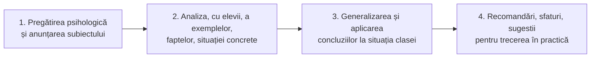
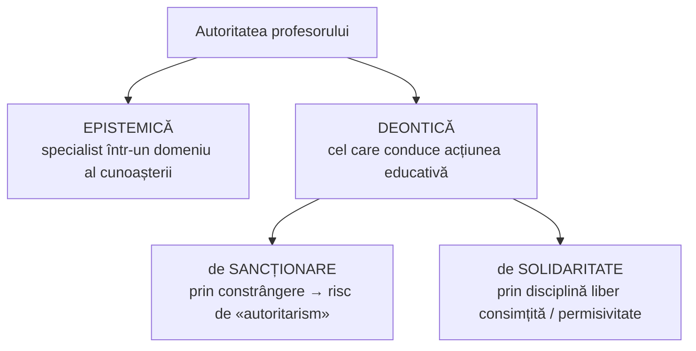
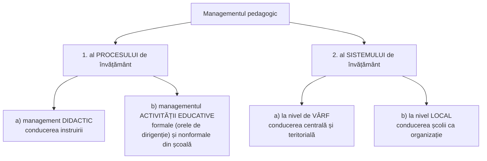

↑ [[Modulul 10 - Proiectarea, realizarea și evaluarea activității educative]] · ← [[10.3 Activitatea educativă a dirigintelui]] · → [[Anexe - instrumente de lucru]]

> [!abstract] Pe scurt
> - **Dirigintele** este cadrul didactic **cu experiență și competență**, numit de director dintre profesorii care predau la clasă. Răspunde de **planificarea, organizarea, îndrumarea și evaluarea** activității educative a clasei. Este pentru clasă ce este **directorul pentru școală**.
> - **Șase obiective** ale activității: educarea și conducerea **colectivului**; **cunoașterea** elevilor; **succesul școlar** și prevenirea abandonului; activitățile **extrașcolare** și timpul liber; **coordonarea factorilor educativi**; **orientarea școlară și profesională**.
> - **Ora de dirigenție** este punctul de convergență al activității cu clasa. Are un plan flexibil în patru momente, iar metodele sale dominante sunt **convorbirea etică** și **dialogul**.
> - Educația contemporană se întemeiază pe **principiul pozitiv** (valorile Adevăr, Bine, Frumos, Dreptate, Libertate) și pe **principiul libertății**.
> - Dirigintele acționează prin **autoritatea deontică** (de sancționare → de solidaritate) și prin **comunicarea empatică**, evitând **barierele** comunicării.

---

# PARTEA I — Ce spune manualul

## 1. Ce este un diriginte? (p. 377–379)

- **Etimologie**: din fr. ***dirigeant*** („conducător”). Termenul avea mai multe sensuri: diriginte de șantier, de oficiu poștal sau vamal, de farmacie; **în trecut**, și directorul unei școli primare rurale.
- În învățământ, azi: profesorul care **supraveghează și îndrumă o clasă** de elevi.

> [!quote] Definiție legală (p. 377)
> **Coordonatorul activităților clasei** de elevi, ales dintre cadrele didactice de predare sau de instruire practică, **numit de director**, care **predă la clasa respectivă**.

- **Responsabilități** (funcția e „o meserie în sine”) (p. 378):
  1. **baza materială** a clasei;
  2. toate aspectele **vieții școlare și extrașcolare** a elevilor;
  3. **orientarea școlară** și **consilierea**;
  4. **catalogul** și alte documente școlare; legătura cu direcțiunea, profesorii, părinții, secretariatul;
  5. **proiectarea, realizarea și autoevaluarea** activității educative, în acord cu documentele, tematica obligatorie și nevoile fiecărui elev. **Modulul se ocupă în special de acest punct.**
- **Verbe specifice** funcției: *organizează, coordonează, monitorizează, colaborează, informează, completează, motivează*.
- **Dimensiunea neoficială** (p. 378): relația **empatică** cu elevii. Uneori dirigintele știe mai multe decât părinții, din confidențele elevilor. El își pune în joc imaginația, experiența, bunătatea, cultura și adaptabilitatea.

> [!quote] Definiție de lucru (p. 378)
> **Profesorul-diriginte** este cadrul didactic **cu experiență și competență profesională**, responsabil de **planificarea / conceperea / organizarea / îndrumarea / dezvoltarea / evaluarea** activității educative a unui grup școlar, pentru un an de studiu.

- **Comparație internațională** (p. 379): în alte țări există funcții separate pentru o parte din aceste atribuții, de ex. **consilierul principal educativ** din **Franța** (manualul spune „din 1968”) sau **consilierul/psihologul școlar**.
- În **licee și colegii**, cu elevi talentați, creativi, „rebeli”, apar mai mulți **lideri în competiție**. Dirigintele are nevoie de o paletă mai largă de metode.
- **Cunoașterea elevului** înseamnă: descifrarea trăsăturilor dominante, înțelegerea **motivelor** acțiunilor, **anticiparea** comportamentului. Metode: **convorbirea, chestionarul, testele, studiul de caz**. Cunoașterea asigură caracterul **diferențiat** al educației.
- **Criteriile de desemnare** (p. 379): experiență educativă vastă, **autoritate morală și profesională**, predarea la clasa respectivă. Dirigintele răspunde în fața conducerii școlii.

## 2. De ce e necesară funcția de diriginte (mai ales din gimnaziu) (p. 379–380)

1. încetează rolul **învățătorului** ca unic conducător al clasei; munca educativă trece la profesori de **specialitate îngustă**;
2. **planul de învățământ** nu are discipline în care elevii să-și discute problemele educative **personale**;
3. **varietatea influențelor** și complexitatea problemelor cer un **coordonator** al formării personalității;
4. sunt necesare **cerințe și acțiuni unitare** pe toată durata școlarității.

- Dirigintele e un **model de conduită**. Fără să preia sarcinile celorlalți profesori, are funcții **specifice și complementare** (p. 380).
- **Analogia-cheie**: dirigintele este pentru clasă ceea ce este **directorul pentru școală**: organizatorul, îndrumătorul și coordonatorul activității educative. De aceea i se cer un **profil moral deosebit** și calități **psihice și pedagogice**. Sistematizează și crește eficiența influențelor tuturor factorilor: **profesori, familie, mass-media**.

## 3. Obiectivele activității dirigintelui (p. 380–382)

| # | Obiectiv | Conținut (sinteză) |
|---|---|---|
| 1 | **Educarea elevilor**, prin organizarea și îndrumarea **colectivului** | problema centrală. Succesul depinde de felul în care dirigintele gestionează colectivul, îi dă perspective atrăgătoare, creează relații de sprijin și entuziasm. Presupune cunoașterea **psihologiei grupului**, a **microgrupurilor**, a legilor după care **liderii** sunt aleși și urmați, și dialog permanent (p. 380–381) |
| 2 | **Cunoașterea psihologiei clasei** și a fiecărui elev | particularități de vârstă, profil spiritual, aptitudini, trăsături morale. Dirigintele e **veriga intermediară** elev–profesori și elev–familie: colectează și sistematizează date, **fără să devină „biograful” elevilor** (p. 381) |
| 3 | **Succesul la învățătură** al tuturor elevilor | mobilizare pentru performanță, urmărirea **progresului** individual la toate disciplinele; contribuție la **prevenirea abandonului școlar** (p. 381) |
| 4 | **Activitatea extrașcolare și timpul liber** | completează și consolidează pregătirea școlară. Excursii și tabere, pentru refacere și pentru **apropierea** diriginte–clasă (p. 382) |
| 5 | **Coordonarea tuturor factorilor educativi** (profesori, familie etc.) | dirigintele e **„factorul polarizator”**: dă influențelor o direcție unică, un caracter unitar, convergent și activ (p. 382) |
| 6 | **Orientarea școlară și profesională**, împreună cu profesorii clasei | pregătirea alegerii **conștiente și independente** a studiilor și profesiei. Acțiune complexă, de lungă durată, „indiciu al trăiniciei” sistemului de învățământ (p. 382) |

## 4. Metodica activității dirigintelui (p. 382–387)

### 4.1. Mijloace de acțiune (p. 383)
- convorbiri cu elevii și cu profesorii clasei;
- analiza **rezultatelor** la învățătură și în activitățile extrașcolare;
- **chestionare**; **asistențe la lecții**;
- contact permanent cu **familiile**;
- **excursii și vizite**; întâlniri cu reprezentanți ai **profesiilor**;
- **schimburi de experiență** între elevi (studiul individual, timpul liber);
- **dezbateri, concursuri**.

Dirigintele alege mijloacele după obiective, particularitățile clasei și natura activității. Evită **paralelismul** cu alți profesori și **supraîncărcarea** și urmărește **varietatea**.

### 4.2. Ora de dirigenție (p. 383–384)
- Are **rol deosebit**: prin caracterul ei organizat și **sistematic**, permite un contact consistent și urmărirea **periodică** a progresului clasei.
- **Conținut variat**: aproape toate sarcinile educației (morale, intelectuale, estetice, de orientare profesională). Temele se stabilesc uneori **cu consultarea clasei** și pot deschide dezbateri despre temele fundamentale ale societății.
- **Metodică variată**: de la expuneri și explicații la demonstrații practice și mijloace **audiovizuale**. Domină metodele **educației morale** (**convorbirea etică, exemplificarea**). Caracterul **activ** vine din dialog, dezbateri, întâlniri, referate, **analize de cazuri** și o diferențiază de lecțiile obișnuite.

**Planul orientativ al orei de dirigenție** (fără structură rigidă, p. 384):

### 4.3. Prelungirea orei: activitățile din afara clasei. Exemplul excursiei (p. 384–385)
- Ora de dirigenție e **punct de convergență** și poate fi continuată prin activități din afara clasei.
- O **excursie** are obiective complexe: instructiv-educative, de **orientare școlară și profesională**.
- Chiar dacă nu o organizează el, dirigintele: ajută la stabilirea obiectivelor, contribuie la pregătire, o **integrează în planul său**, valorifică rezultatele.
- Participând, dirigintele **cunoaște** mai bine elevii: microgrupurile și liderii, disciplina, interesele, orientarea, efectele unor evenimente asupra lor. Află astfel **mai mult decât din multe lecții**.

### 4.4. Convorbirile cu clasa (p. 385)
- Folosite **sistematic**, într-un climat de **încredere**, permit cunoașterea și influențarea **opiniei clasei**, solicitarea de sugestii și inițiative, **mobilizarea** colectivului și un climat de calm și optimism.
- **Dialogul permanent** este un „puternic instrument formativ”.
- Dirigintele devine **„modelator”** al personalității doar dacă dă fiecărei acțiuni o **notă personală și creatoare**.

### 4.5. Cerințe de calitate (p. 385–386)
- **Combaterea formalismului, rigidității, șablonului și rutinei** este o cerință **permanentă**.
- **Factorul afectiv** are un loc deosebit în relația profesor–elev: condiționează adesea succesul.

**Cerințe pedagogice generale** pentru eficiența muncii dirigintelui:
1. acțiuni **variate și interesante**, potrivite clasei;
2. obiective **clare, cuprinzătoare, realizabile**; acțiuni **planificate**;
3. îmbinarea acțiunilor **colective** cu cele **individuale**; metode variate, active;
4. **mobilizarea tuturor agenților educativi** care lucrează cu clasa, pe toată durata anilor;
5. **evaluarea sistematică** a rezultatelor, ca puncte de sprijin pentru acțiunile viitoare;
6. **dialog permanent** cu clasa și **climat favorabil**.

### 4.6. Instrumente și documente (p. 386–387)
- Instrumente formative: **discuții, dezbateri, chestionare, compuneri**.
- Documente de lucru: **caietul dirigintelui**, **fișe psihopedagogice** de cunoaștere și caracterizare, **planificări** ale acțiunilor educative. Ele nu sunt scop în sine, ci ajută la consemnarea rezultatelor și la sprijinirea colegilor.
- **Concluzie** (p. 387): numai pe baza unui **plan de perspectivă**, urmărit metodic, dirigintele devine **principalul educator** al clasei.

## 5. Coordonatele și principiile educației contemporane (p. 387–388)

- **Documentele de politică educațională** ale R. Moldova invocate: *Concepția dezvoltării învățământului*, **Codul educației**, *Programul național de dezvoltare a învățământului*, *Concepția educației în RM*, concepțiile disciplinelor, *Curriculumul de bază*, curricula disciplinare.

| Coordonata | Sursa | Conținut |
|---|---|---|
| **General-umană (universală)** | documentele **UNESCO** și alte lucrări | problemele educaționale ale **civilizației moderne** |
| **Națională** | tezele documentelor naționale și studiile de specialitate | **problemele primordiale** ale educației în R. Moldova |

Lumea contemporană cere ca educația să se întemeieze pe două principii:

> [!quote] Principiul pozitiv al educației (p. 387–388)
> Orientarea **tuturor obiectivelor** educaționale spre consolidarea și dezvoltarea **permanentă** a **valorilor fundamentale**: **Adevărul, Binele, Frumosul, Dreptatea, Libertatea** etc.

> [!quote] Principiul libertății (p. 388)
> Formarea-dezvoltarea **fizică, intelectuală, spirituală** a elevilor în acord cu valorile **congenitale**, cu cele **dobândite** și cu cele din **alteritate**, încurajându-i să se manifeste ca **subiecți ai propriei formări**.

Libertatea și caracterul pozitiv al educației străbat toate obiectivele curriculare.

## 6. Autoritatea profesorului-diriginte (p. 388–391)

### 6.1. Conceptul (p. 388)
- **Autoritatea** (lat. *auctoritas*) = **prestigiul** profesorului ca **specialist** (cunoștințe) și ca **om** (calități).
- Logic, autoritatea este o **relație cu trei termeni**: **purtătorul** autorității, **subiectul** autorității, **domeniul** autorității.
- **Nu există autoritate absolută**: nimeni nu e autoritate în toate domeniile.
- Autoritatea poate fi **întemeiată** sau **neîntemeiată** (după **M. Călin**).

### 6.2. Competență și performanță (p. 388–389)
- **Competența** = abilitatea sau capacitatea de a satisface scopurile educației. La profesor: abilitatea **comportării** sale în acțiunea educativă.
- **Competența** reprezintă **posibilul** comportamental. **Performanța** arată **realul** comportamental.
- Pentru diriginte este definitorie **cunoașterea schimbărilor semnificative** din comportamentul elevilor.

### 6.3. Reprezentări ale dirigintelui în literatură (p. 389)
Dirigintele este prezentat drept **„organizatorul, coordonatorul și modelatorul”** activității educative din școală. I se atribuie: coordonarea influențelor, cunoașterea personalității, succesul la învățătură, **consensul în educația morală**, colaborarea cu **familia**, dezvoltarea **autoconducerii** elevilor, orele de dirigenție, cunoașterea atmosferei **psihosociale**, vizite și excursii, activități extradidactice și extrașcolare, **nota la purtare**, recompense și sancțiuni.

> [!tip] Poziția critică a manualului (p. 389)
> Aceste liste reflectă mai ales **așteptările** față de diriginte și tendința de a-l **„implica” în orice** problemă a școlii. O astfel de orientare **denaturează** poziția lui pedagogică. Ea vine dintr-o cunoaștere defectuoasă: dorințe, atașament emoțional, raționamente confuze, generalizări pripite. **Soluția**: dirigintele își stabilește singur **obiectul activității**, în limitele celor două atribute definitorii, **autoritatea deontică** și **relația pedagogică** cu elevii de o anumită vârstă. Tot el alege mijloacele, inclusiv ora de dirigenție.

### 6.4. Autoritatea deontică în practică (p. 390)
- Înseamnă capacitatea de a emite **directive** însoțite de **reguli întemeiate și precise**. Se sprijină pe: puterea intelectuală de **a-și cunoaște elevii**, **calitatea comunicării** (claritate, precizie, eleganță) și **testarea intersubiectivă**.

| Fața autorității deontice | Directiva | Tipul de reguli |
|---|---|---|
| **de constrângere** (presiune exterioară) | „**Trebuie**” / „**Nu trebuie să**” | **imperative** și **interdictive** |
| **de solidaritate** | „**Poate**” | **permisive**, de îngăduință, într-un climat de **libertate rațională** |

- **Toleranța** înseamnă a răbda pe cineva în **speranța schimbării**. **Nu** înseamnă relativism radical, adică respingerea oricărei sancțiuni.
- **Relația de comunicare empatică**, bazată pe norme deontice („trebuie”, „nu este permis”, „se poate”, „se va avea în vedere”), permite **trecerea progresivă** (p. 390–391):
  - de la **autoritatea de sancțiune** la **autoritatea indicativă**;
  - de la **constrângerea externă** la **autoconstrângere**.
  
  Trecerea depinde de atitudinea reciprocă: respect, acceptare, simpatie, admirație, sau, dimpotrivă, suspiciune, iritare, provocare.

## 7. Comunicarea empatică și barierele ei (p. 391)

Relația pedagogică de comunicare înseamnă **contact și colaborare**. Unele replici ale dirigintelui produc **conflict** sau o relație **rece, distantă**:

| Tip de replică | Sensul exemplului din manual (parafrazat) |
|---|---|
| **comandă / indicație categorică** | „terminați cu mofturile și decideți odată” |
| **atenționare / amenințare** | „puneți-vă pe treabă cu ce am stabilit” |
| **predică / moralizare** | „la școală învățați, problemele personale le lăsați acasă” |
| **sugestie prin recomandare** | „soluția ar fi să ne organizăm mai bine timpul” |
| **critică / învinuire** | „sunteți pur și simplu delăsători” |
| **îndemn / consolare** | „nu sunteți singurii, și eu am simțit la fel” |
| **ironie / umor** deplasat | „să vorbim de ceva plăcut, dar acum nu e timp” |

- **Soluția**: **modul empatic de comunicare**. Profesorul se pune **în situația elevilor**, păstrând un **echilibru constant între empatie și detașare**. Deschiderea lui creează un climat de **„permisivitate modelatoare”**.

## 8. Managementul clasei (p. 391–393)

### 8.1. Resursele elevilor pe care le valorifică (p. 391–392)
| Resurse | Conținut |
|---|---|
| **cognitive** | gândirea (latura operațională), **inteligența** în rezolvarea problemelor |
| **afectiv-motivaționale** | sentimente pozitive față de învățare; **motivație internă** pentru instruire și autoinstruire |
| **caracteriale** | atitudini corecte față de învățare, școală, colectiv, familie, comunitate, muncă, autoeducație, creație responsabilă, cu susținere **volitivă** |

### 8.2. Locul managementului clasei în managementul educațional (p. 392)
- S-a afirmat în ultimul deceniu ca **domeniu special** al **managementului educațional** (→ [[Modulul 08 - Sistemul de educație și managementul educației]]).
- **G. Cristea** subliniază rolul managementului pedagogic în asigurarea **calității** educației.
- **Rodica Nicolescu** delimitează sfera managementului pedagogic:

- **Dimensiunea sociopedagogică** a managementului clasei scoate în evidență **resursele umane** din relația didactică și extradidactică profesor–elevi.

### 8.3. Capacitățile profesorului solicitate de managementul clasei (p. 393)
- a) **proiectarea obiectivelor concrete**, prin **operaționalizarea** obiectivelor generale și specifice (sau cadru și de referință);
- b) **selectarea conținuturilor de bază** și a **metodelor optime** pentru clasa respectivă;
- c) **comunicarea pedagogică**: mesaj adaptat clasei și perfecționat prin **circuite de retroacțiune**.

## 9. Concluziile generale ale modulului (p. 393–394)

> [!tip] De reținut — cele patru concluzii
> 1. **Calitatea orei de dirigenție** depinde de calitatea proiectării:
>    - **tema**: imperativitate, actualitate, originalitate;
>    - **conținutul**: esențialitate, generalitate, diversitate, noutate;
>    - **strategiile**: metode active cu impact formativ, mijloace adecvate și multiple, forme diverse de organizare a grupului.
> 2. **Proiectarea curriculară** a activității educative începe cu **consultarea Curriculumului la dirigenție**, continuă cu **analiza evenimentelor sociale imperative** și cu **formularea temei** după vârstă și grup.
> 3. **Proiectul orei** descrie detaliat scenariul: obiective, strategii de captare a atenției, **întrebările** adresate, metode, mijloace, moduri de organizare a grupului, tehnici de **evaluare curentă**.
> 4. **Eficiența** activității educative este determinată de:
>    - **utilitatea subiectului** pentru elevi;
>    - capacitatea dirigintelui de a **motiva**;
>    - **calitatea proiectului**;
>    - **managementul timpului**;
>    - **capacitatea comunicativă** și **pragmatizarea** conținutului;
>    - competența de a elabora **împreună cu elevii** strategii de abordare a problemelor sociale.

## 10. Sarcini de învățare propuse de manual (p. 394)

- **Teme de reflecție**: definirea „proiectării educaționale” și a „proiectării activității educative”; analiza Curriculumului la dirigenție; selectarea de informații pentru un **proiect de echipă**; **profilul etico-moral** al dirigintelui redat în **limbaj pictural**; impactul **stilurilor manageriale**.
- **Exercițiu de creativitate**: elaborarea proiectului unei ore de dirigenție; **evaluarea proiectului unui coleg** „conform parametrilor din anexa 5” (de fapt, Anexa 7 — vezi comentariul critic).
- **Jurnal de modul**: *Ce am învățat? Ce pot să aplic și să schimb?*
- **Bibliografia modulului** (p. 395–396): 23 de titluri, între care Băban (consiliere educațională), Beldiga–Cojocaru–Dandara (*Învăț să fiu*), Botiș et al. (*Disciplinarea pozitivă*), Calaraș (*Dirigintele — manager al actului educativ*), Iucu (*Managementul clasei de elevi*), Lemeni & Miclea, Neacșu (*Dirigintele. Ora de dirigenție*), Curriculum la dirigenție (2003), Zagaievschi (inteligența emoțională a adolescenților).

---

# PARTEA II — Completări

## 11. Principiul pozitiv — sursa: Vladimir Pâslaru

- **Vl. Pâslaru**, *Principiul pozitiv al educației. Studii și eseuri pedagogice*, Chișinău, **Civitas, 2003** (320 p.). Pâslaru este pedagog și filolog moldovean, dr. hab., coordonatorul **Curriculumului la dirigenție**.
- Manualul **nu îl numește** în 10.4, dar pasajul despre coordonatele universală și națională și despre **principiul pozitiv și principiul libertății** reproduce aproape identic **Reperele conceptuale** ale *Curriculumului la dirigenție* (ed. 2006).
- În curriculum, **coordonata națională** e legată de două crize ale generațiilor formate în regimul totalitar: **criza de identitate** și **criza de proprietate**. Manualul omite această precizare, care dă sens pasajului.

## 12. Autoritatea epistemică și deontică — sursa logică: J. M. Bocheński

- Distincția **autoritate epistemică / deontică** și definiția autorității ca **relație cu trei termeni** (purtător – subiect – domeniu) aparțin logicianului **Józef M. Bocheński**, *Was ist Autorität? Einführung in die Logik der Autorität* (1974). Trad. rom.: ***Ce este autoritatea?***, Humanitas, **1992** (reeditată).
  - **Autoritatea epistemică** („a celui care știe”): P e autoritate pentru S în domeniul D dacă S acceptă ca adevărate enunțurile lui P din D.
  - **Autoritatea deontică** („a superiorului”): S acceptă directivele lui P, pentru că urmărirea lor servește un **scop** pe care S îl dorește.
- **M. Călin** (*Teoria educației*, 1996; *Fundamentarea epistemică și metodologică a acțiunii educative*) a aplicat aceste distincții la relația educativă.
- Distincția **competență / performanță** amintește de perechea introdusă de **N. Chomsky** în lingvistică (*Aspects of the Theory of Syntax*, 1965).

> [!note] Comentariu
> În logica lui Bocheński, autoritatea deontică **legitimă** există doar cât subiectul **împărtășește scopul** (aici, propria formare). Dirigintele care vrea să treacă de la sancțiune la solidaritate trebuie deci să construiască un **scop comun** cu elevii. Asta leagă tema autorității de proiectarea „împreună cu elevii” din concluzia 4.

## 13. Barierele comunicării — modelul lui Thomas Gordon

- Lista replicilor „blocante” din manual corespunde, în mare, celor **12 „baraje ale comunicării”** (*roadblocks to communication*) descrise de **Thomas Gordon** în *Parent Effectiveness Training* (1970) și *T.E.T. — Teacher Effectiveness Training* (1974): a ordona, a amenința, a moraliza, a da sfaturi sau soluții, a argumenta logic, a critica, a lăuda, a eticheta, a interpreta, a consola, a interoga, a distrage/ironiza.
- **Alternative** propuse de Gordon: **ascultarea activă** (reformularea sentimentelor elevului; conceptul vine de la C. Rogers și R. Farson, *Active Listening*, 1957), **mesajele „eu”** în locul mesajelor „tu” și metoda de rezolvare a conflictelor **„fără învinși”**.
- Ghidurile românești de consiliere (ex. Băban, 2001) prezintă aceleași „blocaje” ale comunicării (de verificat capitolul exact).

> [!note] Comentariu
> Lista din manual include **„îndemnul/consolarea”** și **„sugestia prin recomandare”**, pe care cititorul le-ar crede pozitive. Tocmai asta e ideea lui Gordon: și replicile binevoitoare **închid** comunicarea când elevul are nevoie să fie **ascultat**, nu sfătuit.

## 14. Funcții asemănătoare dirigintelui în alte sisteme

| Țara | Funcția | Precizări |
|---|---|---|
| **Franța** | ***Conseiller principal d'éducation*** (CPE) | creat prin **Decretul nr. 70-738 din 12 august 1970**, care i-a transformat pe *surveillants généraux* (supraveghetorii disciplinari, existenți din 1847) în consilieri de educație. Se ocupă de **viața școlară**, de urmărirea elevilor și de activitățile socioeducative; la clase există și un *professeur principal* |
| **Marea Britanie** | ***form tutor*** / *head of year*; sistemul ***pastoral care*** | grija pentru bunăstarea și dezvoltarea elevului, separată de predare |
| **SUA** | ***homeroom teacher*** + ***school counselor*** | consilierea și orientarea sunt profesionalizate |
| **R. Moldova** | diriginte + **psiholog școlar**; din 2018, disciplina ***Dezvoltare personală*** | → [[10.2 Curriculum la dirigenție]] §9 |

## 15. Disciplina pozitivă și managementul comportamentului

- **A. Botiș, A. Mațanie (Matanie), A. Axente**, *Disciplinarea pozitivă — sau cum să disciplinezi fără să rănești* (2011), citată în bibliografie: reguli clare, **întăriri pozitive**, consecințe logice în loc de pedepse.
- **R. A. Barkley**, *Copilul dificil* (trad. 2011; original *Defiant Children*): program de **training pentru părinți** în gestionarea comportamentelor opozante. E util pentru colaborarea diriginte–familie.
- **J. S. Kounin** și **L. Canter** → [[10.3 Activitatea educativă a dirigintelui]] §10.

## 16. Comentariu critic

> [!warning] Erori și probleme ale textului
> - **Data greșită (Franța)**: consilierul principal de educație (CPE) a fost creat în **1970** (Decretul 70-738), nu în 1968. Anul 1968 poate trimite la contextul evenimentelor din mai 1968 sau la dezbaterile dinaintea reformei.
> - **Trimitere greșită la anexă** (p. 394): evaluarea proiectului colegului se cere „conform parametrilor din **anexa 5**”. Anexa 5 este însă un **model de oră** („Meseria — brățară de aur”); criteriile de evaluare sunt în **Anexa 7**.
> - **Trimiteri bibliografice incoerente**: „M. Călin [4, p. 47]” — [4] e ghidul Beldiga–Cojocaru–Dandara, Călin e [8]; „Rodica Nicolescu [9]” — [9] e Cristea, Nicolescu e [16]; „[1, p. 265]” — [1] e un articol de 6 pagini (p. 20–25); „[16, p. 408–409]” — [16] e un număr de revistă. Numerotarea provine dintr-o altă listă bibliografică.
> - **„G. Cristea”** (p. 392): poate fi **Gabriela C. Cristea** (autoare de lucrări de management al lecției) sau o confuzie cu **S. Cristea**. Lucrarea nu apare în bibliografie (de verificat).
> - **Preluări nesemnalate**: pasajul despre coordonate și principii (Curriculumul la dirigenție / Vl. Pâslaru); textul despre obiectivele dirigintelui (formulări clasice din pedagogia românească, cf. I. Nicola, I. Neacșu). **„Definiția legală”** nu indică actul normativ; formularea seamănă cu regulamentele școlare din România.
> - **Două structuri ale orei de dirigenție** în același modul: scenariul în **7 momente** (10.3, p. 370–371) și planul în **4 momente** (10.4, p. 384), fără să fie corelate.
> - **Repetiții**: capacitățile de proiectare (p. 393) reiau 10.1; lista de atribuții apare de mai multe ori (p. 378, 380–382, 389).
> - **Tensiune nerezolvată**: manualul enumeră întâi, pe pagini întregi, atribuțiile dirigintelui, apoi (p. 389) critică exact tendința de a-l „implica” în orice. Nu propune un **referențial de competențe** explicit, deși acesta e anunțat printre conceptele de bază ale modulului (→ [[Modulul 09 - Agenții educației și factorii dezvoltării]] pentru referențialul cadrului didactic).
> - **Greșeli de tipar**: „autoritas” (corect *auctoritas*), „calsele gimanziale”, „modelor” (modelator), „managerc”.
> - **Informații datate**: nu se pomenesc **psihologul școlar** și **consilierul** ca parteneri instituționali în RM, nici (evident, pentru 2014) disciplina *Dezvoltare personală* din 2018.

## 17. Întrebări de autoverificare

1. Definiți dirigintele (definiția legală și cea de lucru). Care sunt responsabilitățile lui?
2. De ce devine necesară funcția de diriginte mai ales din gimnaziu?
3. Enumerați și explicați cele șase obiective ale activității dirigintelui.
4. Care este planul orientativ al orei de dirigenție? Comparați-l cu scenariul pedagogic din 10.3.
5. Formulați principiul pozitiv și principiul libertății. Cui aparține conceptul de „principiu pozitiv al educației”?
6. Distingeți autoritatea epistemică de cea deontică și autoritatea de sancționare de cea de solidaritate. Ce tipuri de reguli corespund fiecăreia?
7. Numiți cinci bariere ale comunicării profesor–elev și reformulați empatic o replică de tip „predică”.
8. Cum delimitează R. Nicolescu sfera managementului pedagogic? Unde se situează ora de dirigenție?
9. Ce factori determină eficiența activității educative (concluziile modulului)?
10. Ce funcție îndeplinește în Franța consilierul principal de educație și de când există?

## Surse

- Manual, p. 377–396.
- Pâslaru, Vl. (2003). *Principiul pozitiv al educației. Studii și eseuri pedagogice*. Chișinău: Civitas.
- Pâslaru, Vl., Mija, V., Parlicov, E. (2006). *Curriculum la dirigenție. Clasele V–XII* (ed. a II-a). Chișinău: MET.
- Bocheński, J. M. (1974). *Was ist Autorität? Einführung in die Logik der Autorität*. Freiburg: Herder; trad. rom. *Ce este autoritatea?*, București: Humanitas, 1992.
- Călin, M. (1996). *Teoria educației. Fundamentarea epistemică și metodologică a acțiunii educative*. București: All.
- Gordon, Th. (1974). *T.E.T.: Teacher Effectiveness Training*. New York: Wyden.
- Rogers, C. R., Farson, R. E. (1957). *Active Listening*. Chicago: Industrial Relations Center.
- Neacșu, I. (1993). *Dirigintele. Ora de dirigenție*. București: All.
- Iucu, R. B. (2006). *Managementul clasei de elevi*. Iași: Polirom.
- Botiș, A., Mațanie, A., Axente, A. (2011). *Disciplinarea pozitivă — sau cum să disciplinezi fără să rănești* (editura de verificat; 130 p. după manual).
- Décret n° 70-738 du 12 août 1970 relatif au statut particulier des conseillers principaux d'éducation. [Légifrance](https://www.legifrance.gouv.fr/loda/id/JORFTEXT000000874749)
