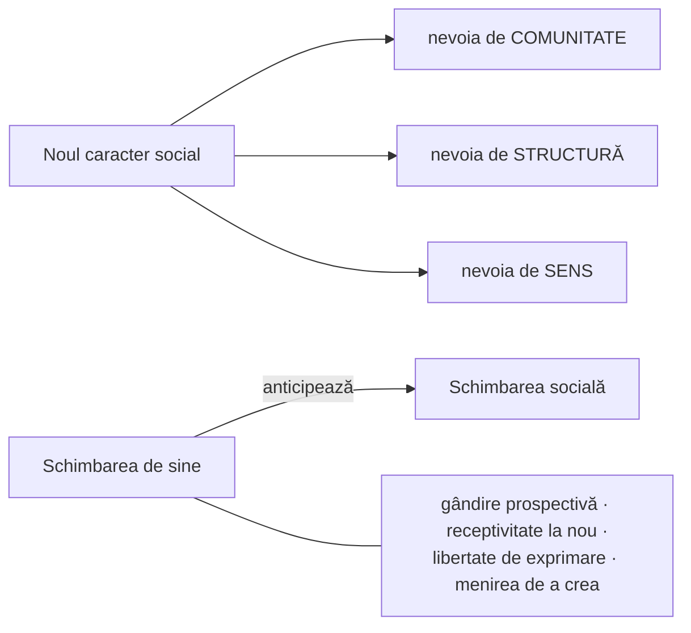
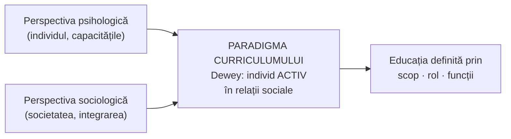

↑ [[Modulul 02 - Clasic, modern și postmodern în educație]] · ← [[1.5 Pedagogia în sistemul științelor socioumane]] · → [[2.2 Direcțiile modernizării sistemului educațional]]

> [!abstract] Pe scurt
> - **Educația** (lat. *educare* = a crește, a hrăni; *educere* = a scoate din, a conduce) este un **fenomen socio-uman** prin care se transmit noilor generații **acumulările teoretice și practice** ale omenirii, în vederea **formării personalității** și a **integrării socio-profesionale**.
> - **Clasic = tradiție** (lat. *traditio* = transmitere): obiceiuri, credințe, practici transmise din generație în generație; se păstrează **selectiv și critic**, fără absolutizarea trecutului.
> - **Modern** (lat. *modo* = acum, *modernus* = recent) = actual, inovator, orientat spre progres. **Postmodern** = contestarea certitudinilor și a exceselor modernității; valori: **libertate, toleranță, originalitate, interculturalitate**.
> - Istoric, educația a fost concepută în patru sensuri: **magistrocentrist, psihocentrist, sociocentrist, tehnocentrist**.
> - **Paradigma curriculumului** (J. Dewey, 1902) încearcă să împace perspectiva psihologică și cea sociologică: individul este **activ în relațiile sociale**.

---

# PARTEA I — Ce spune manualul

## 0. Deschiderea modulului (p. 54)

- **Motto-uri**: **Democrit** (educația îl transformă pe om și îi dă „o a doua natură”) și **J. Locke** (copilul nu se educă prin reguli, ci prin **practică** și ocazii create anume).
- **Competențe vizate**: determinarea direcțiilor de modernizare (structură, conținut, resurse, management); explicarea structurii și funcționării educației; argumentarea interdependenței formelor educației; conștientizarea impactului **tradiției**; distingerea valorilor **clasice, moderne, postmoderne**.
- **Concepte de bază**: educația, subiect/obiect al educației, curriculum, structura educației, direcții de modernizare, educație clasică / modernă / postmodernă, educație formală / nonformală / informală.

## 1. Etimologia termenului „educație” (p. 55)

| Limba | Termen | Sens |
|---|---|---|
| greacă | *paideia* | formarea (copilului) |
| latină (romani) | *institutio* | instruire, formare |
| latină | *educo, educare* | a crește, a hrăni, a forma, a instrui |
| latină | *educatio* | creștere, hrănire, formare |
| latină | *educo, educere* | a scoate din, a ridica, a conduce |
| franceză | *l'éducation* | atestat în **sec. XVI** |

- La început, *educare* (a crește, a îngriji) se referea mai ales la **plante și animale**; sensul s-a modificat continuu.
- Concepte **înrudite, dar nu identice**: formarea, modelarea, cultivarea personalității.
- Un sens actual (citat după [6, p. 8]): transmiterea de **deprinderi, cunoștințe profesionale și experiențe practice** necesare atingerii unui scop, într-o ordine statală oficială.
- **Dicționarul explicativ al limbii române**: educația ca **sistem planificat de influențe de durată** asupra individului, pentru a-i orienta dezvoltarea spre **idealul de om** cerut de societate; cuprinde educația fizică, intelectuală, morală, estetică, tehnică și profesională.

## 2. Definiții ale educației (p. 55–56)

| Autor | Educația este… | Accent |
|---|---|---|
| **Ioan Nicola** [11, p. 12] | activitate socială complexă, un **lanț nesfârșit de acțiuni conștiente, sistematice, organizate**, prin care un **subiect** (individual/colectiv) acționează asupra unui **obiect** (individual/colectiv) pentru a-l transforma într-o **personalitate activă și creatoare**, potrivită condițiilor istorico-sociale și potențialului său biopsihic | relația subiect–obiect; dublă raportare (social + individual) |
| **Ioan Bontaș** [1, p. 4] | **fenomen socio-uman** care transmite tinerelor generații acumulările **teoretice** (informații) și **practice** (abilități) ale omenirii, formându-le **personalitatea și profesionalitatea** | transmitere intergenerațională |
| **Dorina Sălăvăstru** [13, p. 157] | un **complex de influențe sociale**, organizate sistematic și dirijate conștient, cu finalitatea formării personalității **conform cerințelor sociale** | influențe sociale dirijate |

- Educația este **obiectul de studiu al pedagogiei**; aceasta abordează problemele fundamentale: **conceptul de educație**, analiza educației la nivel **funcțional-structural** și **contextual**, **caracteristicile generale** ale educației (→ [[2.4 Caracteristicile educației]], [[2.5 Structura și funcționarea educației]]).
- **Numitor comun** al definițiilor: educația transmite **valorile** omenirii noilor generații pentru a le include în viața socială.

> [!quote] Definiție (sinteza manualului, p. 56)
> Educația este un **fenomen socio-uman** care asigură transmiterea **acumulărilor teoretice și practice** obținute de omenire de-a lungul evoluției istorice, cu scopul **formării personalității** în vederea **integrării socio-profesionale**.

## 3. Clasic în educație: tradiția (p. 57)

- **Clasic** în educație trimite la **tradiție**, temă studiată în special de **Elena Macavei** [10].
- Etimologie: lat. *traditio, -onis* = transmitere; *trado, -ere* = a transmite, a încredința, a preda cuiva ceva, a învăța pe alții, a povesti.
- Tradiția **condensează** obiceiuri, credințe, practici **păstrate și transmise din generație în generație**; este **zestrea** comunității, dovada nivelului ei de viață în diferite epoci și o **componentă a identității**.

**Raportarea corectă la tradiție:**
- atașamentul se manifestă prin **respect valoric, critic și selectiv**;
- tradiția trebuie **păstrată, respectată, cunoscută, valorificată și transmisă selectiv**;
- transmiterea se face prin **toate formele educației** (formal, nonformal, informal), după **criterii valorice** (→ [[3.1 Formele generale ale educației - delimitări conceptuale]]);
- mândria apartenenței la o comunitate **sprijină siguranța de sine**; **demnitatea** (respect pentru sine) și **altruismul** (respect pentru altul) favorizează înțelegerea, colaborarea, toleranța.

**Riscuri:**
- **absolutizarea trecutului**, închistarea în tradiție, refuzul noului — sau, invers, **ignorarea și disprețuirea** tradiției în politicile sociale → ambele **blochează progresul**;
- reformele în învățământ se realizează greu și din cauza **rezistenței tradiționale**.

> [!tip] De reținut
> Cunoașterea și **evaluarea tradiției** trebuie să fie un **obiectiv al politicii educaționale** (p. 57). Tradiția nu se copiază, ci se **selectează valoric**.

## 4. Modern în educație (p. 57–58)

- **A fi modern** = a aparține timpurilor prezente, a fi **actual**, a corespunde epocii recente.
- Etimologie: lat. *modo* = acum; *modernus* = recent.
- Sunt numite generic **moderne** tendințele **inovatoare**, de căutare a **noului** și a **originalului**, în sensul **progresului**.

## 5. Postmodern în educație (p. 58)

**Postmodernismul** este descris ca:
- un **model teoretic** de percepere a lumii moderne, cu **contradicțiile, erorile și neîmplinirile** ei;
- un model de încadrare a omului într-o realitate **în general ostilă**;
- o **mișcare culturală** pe temeiuri reflexive, filosofice — după unii teoreticieni **neunitară și speculativă**, care creează un „joc de idei” pe fondul **contestării tradiției** și a soluțiilor modernității.

**Vl. Guțu** [8, p. 14]: statutul epistemologic al pedagogiei nu poate fi fundamentat pe deplin fără abordarea **postmodernității pedagogice**. Esența postmodernității în științele educației este asociată cu:
1. lansarea **curriculumului** ca **categorie fundamentală** a pedagogiei;
2. funcționarea și **interconexiunea constructivă a mai multor paradigme** educaționale;
3. **tehnologizarea** procesului de învățământ;
4. abordarea **pragmatică, psihoculturală și socioculturală** a educației.

**Postmodernismul ca doctrină a negației** (p. 58):

| Neagă | Promovează (valori dominante) |
|---|---|
| tiparul, cenzura, stereotipul | **libertatea** |
| permanența, certitudinea, cauzalitatea | **toleranța** |
| excesele societății moderne: agresivitate, imoralitate, depersonalizare, alienare, violență, intoleranță | **altruismul**, **originalitatea**, **performanța**, **interculturalitatea** |

## 6. Tabelul comparativ modern – postmodern (E. Macavei) (p. 59)

După **E. Macavei** [10, p. 16] — Tabelul 1:

| MODERN | POSTMODERN |
|---|---|
| raționalitate | conduită ludică |
| rigoare logică | alternative, variante |
| determinare | indeterminare |
| certitudine | ambivalență |
| încadrarea într-un stil | amestecul stilurilor |
| conformism | contestare, rebeliune |
| fixitate | mobilitate |
| permanență | efemer, imediat |
| imitare | originalitate |
| continuitate | discontinuitate |
| centralizare | descentralizare |
| conveniență | toleranță |
| certitudine | incertitudine |
| culturalizare | intercultural |

## 7. Societatea și pedagogia postmodernă (p. 59–60)

- Societatea postmodernă valorizează **meritocrația**, promovarea **înaltelor performanțe**, **creația** și **deontologia**.
- În discursul reflexiv despre educație intră concepte ca: educație **multilaterală și armonioasă**, educație **totală**, **continuă**, **permanentă**, **planetară** (→ [[3.6 Educația permanentă și autoeducația]], [[Modulul 07 - Noile educații]]).
- **„Pedagogia de mâine”** cere mai multă exigență în formarea **„noului caracter social”**: construirea de sine pe o **psihosferă sănătoasă**, în raport cu trei **nevoi fundamentale**:

- **Schimbarea socială** trebuie **anticipată de schimbarea de sine**: gândire **prospectivă**, **receptivitate** la nou, combaterea „asasinilor de idei”, lupta pentru **libertatea de exprimare** și pentru menirea de **a crea**.

## 8. Cele patru sensuri istorice ale educației (p. 60–61)

| Orientare | Ce se află în centru | Idee-cheie | Autori / repere citați | Limită (după manual) |
|---|---|---|---|---|
| **a) Magistrocentrism** | **educatorul** — proiectează și realizează activitățile | educatorul = **unic transmițător**; educatul doar **reproduce** mesajul | — (pedagogia tradițională) | **graniță absolută** educator–educat; definiție **unilaterală** |
| **b) Psihocentrism** | **copilul** și potențialul său psihologic | importanța celui educat; **individualizarea** instruirii | **Ellen Key** (1900): ne plecăm fruntea în fața copilului; **Alfred Binet** (1910): cunoaștere psihologică | ignoră rolul **obiectivelor pedagogice**, considerate greșit exterioare educatului |
| **c) Sociocentrism** | **societatea**, condițiile macro- și microstructurale | educația = **„socializare metodică a tinerei generații”** de către adulți | **É. Durkheim** (1980 — ed. rom.) | subordonarea individului față de societate (critica lui Dewey) |
| **d) Tehnocentrism** | **proiectarea tehnologică** | tehnologiile educaționale ca **proiecte pedagogice**, pe baza psihologiei cognitive, pedagogiei prin obiective, teoriei curriculumului | **Jean-Marc Gabaude**, **Louis Not** (1988) | — |

**Sociocentrismul lui Durkheim — detalii (p. 60–61):**
- educația are ca obiect nu omul creat de natură, ci **omul pe care îl vrea societatea**;
- orice societate are nevoie de **omogenitate**; educația dezvoltă **„similitudinile esențiale”** potrivite tipului de societate și **reînnoiește condițiile existenței** acesteia;
- scopul: a **socializa individul biologic**, construindu-i **ființa socială** suprapusă celei individuale.

## 9. Paradigma curriculumului — John Dewey (p. 61)

- Începutul **sec. XX** = **maturizarea** definirii educației → o nouă paradigmă, **curriculumul**, inițiată de **John Dewey (1902)**.
- Dewey încearcă să **atenueze conflictul** dintre:

| Definirea **psihologică** | Definirea **sociologică** |
|---|---|
| considerată „**formală**”: vorbește doar de dezvoltarea capacităților mentale, **fără** a arăta la ce folosesc | considerată un proces **forțat și extern**, care subordonează libertatea individului unui statut social-politic prestabilit |

- **Soluția**: scopul, rolul și funcțiile educației nu pot fi înțelese dacă individul nu este conceput ca **activ în relațiile sociale**.
- Formula lui Dewey (parafrază): fără factorul social rămâne o **abstracție**; fără factorul individual rămâne o **masă inertă**.

## 10. Concluzia manualului legată de 2.1 (p. 76)

- Prin educație se transmit **obiceiuri, credințe, practici, reprezentări sociale** și **sistemul național de valori**, care favorizează formarea **identității** și **demnității** educatului.

---

# PARTEA II — Completări

## 11. Etimologie: *educare* vs. *educere* — o dispută cu miză pedagogică

| Etimon | Conjugare | Sens | Imaginea educației |
|---|---|---|---|
| *educāre* | I | a crește, a hrăni, a îngriji | educatorul **cultivă** din exterior (model „agricol”) |
| *edūcere* | a III-a | a scoate afară, a conduce | educatorul **scoate la iveală** potențialul interior (model „maieutic”, socratic) |

> [!note] Comentariu
> Cele două etimologii corespund, simbolic, celor două mari tradiții: **educația ca transmitere/modelare** (magistrocentrism, sociocentrism) și **educația ca dezvoltare a potențialului** (psihocentrism, Educația nouă). Paradigma curriculumului încearcă să le integreze.

- *Institutio*: cf. **Quintilian**, *Institutio oratoria* (sec. I d.Hr.), primul mare tratat roman despre formarea oratorului.
- *Paideia*: **Werner Jaeger**, *Paideia. Formarea omului grec* (3 vol., 1933–1947) — ideea de educație ca **formare culturală integrală**.
- În germană se disting *Erziehung* (educație, creștere) și *Bildung* (formare de sine prin cultură) — distincție importantă în pedagogia clasică germană (Humboldt, Herbart).

## 12. Alte definiții clasice ale educației

| Autor | Lucrare, an | Idee |
|---|---|---|
| **Immanuel Kant** | *Despre pedagogie* (*Über Pädagogik*, 1803) | omul **nu poate deveni om decât prin educație**; educația ca îngrijire, disciplinare, instruire, formare morală |
| **Émile Durkheim** | *Educație și sociologie* (1922; trad. rom. EDP, 1980) | educația = **socializare metodică** a generației tinere de către generațiile adulte |
| **John Dewey** | *Crezul meu pedagogic* (*My Pedagogic Creed*, 1897); *Democrație și educație* (1916) | educația ca **reconstrucție continuă a experienței**; școala ca **formă de viață socială** |

> [!warning] Precizare despre citatele lui Dewey
> Formulările citate de manual (definirea psihologică „formală”, definirea sociologică „forțată și externă”; „abstracție” vs. „masă inertă”) provin din ***My Pedagogic Creed* (1897)**, art. I. Manualul le datează „1992” — anul **traducerii românești** (*Fundamente pentru o știință a educației*, EDP, București, 1992). Anul „1902” corespunde lucrării ***The Child and the Curriculum*** (*Copilul și curriculumul*).

## 13. Repere pentru cele patru orientări

| Orientare | Reprezentanți și lucrări | Contribuție |
|---|---|---|
| **Magistrocentrism** (pedagogia „tradițională”) | **J. A. Comenius**, *Didactica Magna* (1657); **J. F. Herbart**, *Pedagogia generală* (*Allgemeine Pädagogik*, 1806) | sistemul pe clase și lecții; treptele formale ale lecției; rolul central al profesorului și al instrucției |
| **Psihocentrism** („Educația nouă”, pedocentrism) | **J.-J. Rousseau**, *Emil* (1762) — precursor; **Ellen Key**, *Secolul copilului* (1900); **Maria Montessori**, *Metoda pedagogiei științifice* (1909); **É. Claparède** (educația funcțională); **O. Decroly** (centrele de interes); **A. Binet**, *Les idées modernes sur les enfants* (1909) | copilul ca centru; interesul, activitatea, individualizarea |
| **Sociocentrism** | **É. Durkheim** (1922); **T. Parsons**, „The School Class as a Social System” (1959) | educația ca socializare; funcțiile sociale ale școlii |
| **Tehnocentrism** | **R. Tyler**, *Basic Principles of Curriculum and Instruction* (1949); **B. Bloom** (coord.), *Taxonomia obiectivelor educaționale* (1956); **R. Mager**, *Preparing Instructional Objectives* (1962); **Louis Not**, *Les pédagogies de la connaissance* (1979) | pedagogia prin obiective; proiectarea riguroasă a instruirii; tehnologia educațională |

> [!note] Comentariu — Louis Not
> În *Les pédagogies de la connaissance* (1979), Louis Not distinge **heterostructurarea** (cunoașterea e construită *din exterior*, de profesor — corespunde magistrocentrismului), **autostructurarea** (elevul își construiește singur cunoașterea — psihocentrism) și **interstructurarea** (construcție prin interacțiune elev–profesor–obiect). Este o alternativă utilă la clasificarea din manual, care arată că soluția modernă este **interacțiunea**, nu alegerea unui singur „centru”.

## 14. Postmodernismul — surse fundamentale

| Autor | Lucrare, an | Contribuție |
|---|---|---|
| **Jean-François Lyotard** | *Condiția postmodernă* (*La condition postmoderne*, 1979) | postmodernul ca **neîncredere față de „metanarațiuni”** (marile explicații totalizatoare: progresul, emanciparea prin rațiune); legitimarea cunoașterii prin **performativitate** |
| **Zygmunt Bauman** | *Modernitatea lichidă* (*Liquid Modernity*, 2000) | societatea identităților **fluide**, instabile — fundal pentru ideea de educație permanentă și flexibilă |
| **William E. Doll Jr.** | *A Post-Modern Perspective on Curriculum* (1993) | curriculum **deschis, autoorganizat**; criteriile „4 R”: *richness, recursion, relations, rigor* (bogăție, recursivitate, relații, rigoare) — opus modelului lui Tyler |
| **Robin Usher, Richard Edwards** | *Postmodernism and Education* (1994) | critica ideii de subiect autonom și a „marilor scopuri” ale educației moderne |
| **Andy Hargreaves** | *Changing Teachers, Changing Times* (1994) | profesorii între structurile **moderne** ale școlii și cerințele **postmoderne** (flexibilitate, incertitudine) |
| **Henry Giroux** | *Border Crossings* (1992) | pedagogia critică postmodernă; „trecerea granițelor” culturale |

- **Moldova**: **Vl. Guțu**, *Pedagogie* (CEP USM, 2013) — discută postmodernitatea pedagogică în legătură cu statutul epistemologic al pedagogiei (sursa [8] din manual); **N. Silistraru**, *Valori ale educației moderne* (2006).
- **„Caracterul social”**: conceptul provine de la **Erich Fromm** (*Frica de libertate*, 1941; *Societatea sănătoasă*, 1955) — structura de caracter comună membrilor unei societăți, formată pentru a răspunde cerințelor acesteia. „Noul caracter social” din manual (via Macavei) este o reluare a acestei idei.

## 15. Tradiția — perspective suplimentare

- **Hannah Arendt**, „Criza educației” (1958, în *Între trecut și viitor*, 1961): educația trebuie să fie **conservatoare** tocmai pentru a proteja **noul** adus de fiecare copil; profesorul reprezintă lumea existentă în fața noilor veniți.
- **Eric Hobsbawm, Terence Ranger** (coord.), *The Invention of Tradition* (1983): multe „tradiții” sunt **construcții recente**, uneori create de statele naționale — argument pentru raportarea **critică** cerută de manual.
- **Cearta dintre antici și moderni** (*Querelle des Anciens et des Modernes*, Franța, sfârșitul sec. XVII): prima dezbatere culturală explicită „clasic vs. modern”.

## 16. Legături cu Codul Educației al R. Moldova (Legea nr. 152/2014)

- **Art. 5 — Misiunea educației**: satisfacerea cerințelor educaționale ale individului și societății; dezvoltarea potențialului uman; **dezvoltarea culturii naționale** (dimensiunea „tradiție”); **dialog intercultural**, toleranță, incluziune (dimensiunea „postmodernă”); învățarea pe tot parcursul vieții.
- **Art. 6 — Idealul educațional**: personalitate cu **spirit de inițiativă**, capabilă de **autodezvoltare**, cu **independență de opinie și acțiune**, deschisă spre **dialog intercultural** în contextul valorilor **naționale și universale**.
- **Art. 7 — Principii**: **centrarea educației pe beneficiari** (lit. d) — echivalentul modern al „psihocentrismului” echilibrat; **libertatea de gândire** și independența față de ideologii (lit. e); **descentralizare și autonomie** (lit. l).

> [!note] Comentariu
> Idealul educațional din Cod combină explicit **tradiția** (valori naționale) cu valori **postmoderne** (inițiativă, autodezvoltare, interculturalitate) — o ilustrare juridică a sintezei clasic–modern–postmodern discutate în acest subcapitol. → [[Modulul 04 - Finalitățile educației]]

## 17. Sinteză comparativă clasic – modern – postmodern (tabel de lucru)

| Criteriu | Clasic (tradițional) | Modern | Postmodern |
|---|---|---|---|
| Centru | profesorul, conținutul | elevul / obiectivele | rețeaua de relații, contextul, sensul |
| Cunoașterea | transmisă, stabilă | construită, verificabilă științific | pluralistă, provizorie, contextuală |
| Relația educator–educat | autoritate, ierarhie | dirijare + activizare | parteneriat, negociere |
| Organizare | centralizată, uniformă | sistematică, proiectată | descentralizată, flexibilă, alternative |
| Valori | conformism, continuitate, disciplină | raționalitate, progres, eficiență | toleranță, originalitate, interculturalitate |
| Evaluare | reproducere, notare | pe obiective, măsurabilă | formativă, autoevaluare, portofoliu |
| Reper teoretic | Comenius, Herbart | Dewey, Tyler, Bloom | Lyotard, Doll, pedagogia critică |

> [!warning] Atenție
> Tabelul este o **schematizare didactică** (nu provine din manual). În realitate, școlile contemporane combină elemente din toate trei; iar în tabelul lui Macavei „modernul” include trăsături pe care alți autori le atribuie „tradiționalului” (conformism, imitare, centralizare).

---

## 18. Comentariu critic

> [!warning] Probleme identificate în manual (p. 54–61)
> - **Trimitere bibliografică greșită**: DEX-ul este citat „[8, p. 343]”, dar în bibliografia modulului [8] este **Vl. Guțu, *Pedagogie***; DEX-ul este sursa **[9]**.
> - **Definiția „[6, p. 8]”** (transmiterea deprinderilor „într-o ordine statală oficială”) este atribuită *Dicționarului de pedagogie* al lui S. Cristea; formularea sună mai degrabă a definiție de **instruire/formare profesională** decât de educație în sens larg — de verificat în sursă.
> - **Datări confuze**: Durkheim „1980” (e anul ediției românești; originalul e 1922); Dewey „1992” (ediția românească; citatele sunt din 1897); Binet „1910” (*Les idées modernes sur les enfants* a apărut în **1909**); Louis Not „1988” (lucrarea sa de referință e din 1979).
> - **Tabelul lui Macavei** conține **„certitudine” de două ori** (opusă o dată „ambivalenței”, o dată „incertitudinii”).
> - **Postmodernismul este prezentat eclectic**: pe de o parte ca negare a certitudinii și stereotipului, pe de alta ca promovare a **meritocrației, performanței, deontologiei** — valori tipic **moderne**. Tensiunea nu este discutată. Nici autorii fondatori (Lyotard etc.) nu sunt menționați.
> - **Clasic vs. tradițional**: manualul reduce „clasicul” la „tradiție” (sens etnocultural: obiceiuri, credințe); nu discută sensul pedagogic al **educației clasice** (Comenius, Herbart, pedagogia magistrocentristă), deși tocmai acesta se opune „modernului”.
> - **Competența** „argumentarea interdependenței formelor generale ale educației” (p. 54) ține de **Modulul III**, nu de acest modul.
> - **Textul PDF** al secțiunii „Concepte de bază” (p. 54) este corupt (suprapunere de rânduri) — nu e o eroare de conținut, dar lista trebuie reconstituită.
> - **Grafie**: „sînt”, „învăţămînt”, „cîmp” etc. — ortografie veche; exprimări greoaie („educațiem reprezentat”).

## 19. Întrebări de autoverificare

1. Explicați diferența dintre *educare* și *educere*. Ce concepții despre educație sugerează fiecare?
2. Comparați definițiile educației date de I. Nicola, I. Bontaș și D. Sălăvăstru. Ce au în comun?
3. Ce înseamnă „clasic” în educație după E. Macavei? Cum trebuie să ne raportăm la tradiție?
4. Care sunt cele patru trăsături ale postmodernității pedagogice după Vl. Guțu?
5. Numiți cinci perechi de opoziții din tabelul modern–postmodern al lui E. Macavei.
6. Ce este „noul caracter social” și care sunt cele trei nevoi fundamentale pe care se sprijină?
7. Caracterizați magistrocentrismul, psihocentrismul, sociocentrismul și tehnocentrismul; precizați limita fiecăruia.
8. Cum depășește paradigma curriculumului (J. Dewey) conflictul dintre definiția psihologică și cea sociologică a educației?
9. Identificați în art. 6 al Codului Educației elemente „tradiționale” și elemente „postmoderne”.

## Surse

- **Manual**: Cojocaru-Borozan, M., Sadovei, L., Papuc, L., Ovcerenco, S. (2014). *Fundamentele științelor educației*. Chișinău: UPS „Ion Creangă”, p. 54–61, 76.
- Bontaș, I. (2008). *Tratat de pedagogie*. București: ALL.
- Cristea, S. (2000). *Dicționar de pedagogie*. Chișinău–București: Litera Internațional.
- Guțu, Vl. (2013). *Pedagogie*. Chișinău: CEP USM.
- Macavei, E. (2001). *Pedagogie. Teoria educației*. București.
- Nicola, I. (2003). *Pedagogie generală*. București: EDP.
- Sălăvăstru, D. (2004). *Psihologia educației*. Iași: Polirom.
- Dewey, J. (1897). *My Pedagogic Creed*; (1902). *The Child and the Curriculum*; trad. rom.: *Fundamente pentru o știință a educației*. București: EDP, 1992.
- Durkheim, É. (1922). *Éducation et sociologie*. Paris: Alcan (trad. rom. EDP, 1980).
- Kant, I. (1803). *Über Pädagogik*.
- Key, E. (1900). *Barnets århundrade* (*Secolul copilului*).
- Binet, A. (1909). *Les idées modernes sur les enfants*. Paris: Flammarion.
- Not, L. (1979). *Les pédagogies de la connaissance*. Toulouse: Privat.
- Lyotard, J.-F. (1979). *La condition postmoderne*. Paris: Minuit.
- Doll, W. E. (1993). *A Post-Modern Perspective on Curriculum*. New York: Teachers College Press.
- Usher, R., Edwards, R. (1994). *Postmodernism and Education*. London: Routledge.
- Bauman, Z. (2000). *Liquid Modernity*. Cambridge: Polity.
- Arendt, H. (1961). *Between Past and Future* („The Crisis in Education”).
- Hobsbawm, E., Ranger, T. (eds.) (1983). *The Invention of Tradition*. Cambridge University Press.
- Codul Educației al Republicii Moldova nr. 152 din 17.07.2014 (MO nr. 319-324, art. 634, 24.10.2014), art. 5, 6, 7.
