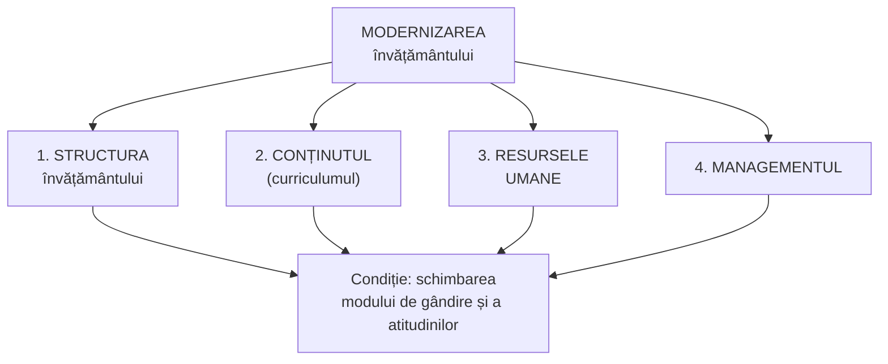

↑ [[Modulul 02 - Clasic, modern și postmodern în educație]] · ← [[2.1 Clasic, modern și postmodern - delimitări conceptuale]] · → [[2.3 Funcțiile generale ale educației]]

> [!abstract] Pe scurt
> - **Modernizarea învățământului** este un **obiectiv strategic** și vizează **patru direcții**: **structura** învățământului, **conținutul (curriculumul)**, **resursele umane**, **managementul**.
> - Documentul de politici de referință (în 2014): **Strategia „Educația-2020”** (HG nr. 944 din 14.11.2014), implementată prin CBTM, buget și planuri anuale; cadrul legislativ — **Codul Educației**.
> - **Condiția eficienței** oricărei modernizări: **schimbarea modului de gândire și a atitudinilor**.
> - În contextul **globalizării**, educația globală (T. Callo) devine o condiție a educației de calitate; principii: **elevocentrism, activizare, holism, integralitate**.

---

# PARTEA I — Ce spune manualul

## 1. Modernizarea ca obiectiv strategic (p. 61)

Modernizarea învățământului vizează, după **E. Macavei** [10, p. 16–17], patru direcții:

## 2. Strategia „Educația-2020” (p. 61–62)

- **Denumire**: *Strategia de dezvoltare a educației pentru anii 2014–2020 „Educația-2020”*, aprobată prin **Hotărârea Guvernului nr. 944 din 14 noiembrie 2014**.
- Este **principalul document de politici** în educație: stabilește **obiectivele și sarcinile pe termen mediu** și definește **orientările și direcțiile prioritare** ale sistemului de învățământ din R. Moldova.
- **Implementare**:
  - direcțiile și obiectivele sunt incluse în **programele de dezvoltare strategică** ale autorităților publice centrale;
  - se realizează prin documentele de planificare ale ministerelor: **Cadrul bugetar pe termen mediu (CBTM)**, **bugetul**, **planul anual de acțiuni**.
- **Cadrul legislativ**: asigurat prin (proiectul) **Codului Educației**, concordant cu Strategia.
- **Finanțare**: buget de stat, bugete locale, granturi, fonduri, sponsorizări și alte surse legale; accent pe **bugetarea bazată pe programe și performanță**.

## 3. Direcțiile modernizării — detaliere (p. 62–64)

### 3.1. Structura învățământului (p. 62–63)

1. consolidarea **învățământului particular** ca alternativă a celui public, de stat;
2. **retehnologizarea** și **informatizarea** învățământului;
3. extinderea noilor modalități de **perfecționare profesională**: studii aprofundate, **master**, programele **Socrates, Erasmus**, diplome și doctorate în **cotutelă**;
4. îmbunătățirea **formării continue a cadrelor didactice**;
5. extinderea **învățământului la distanță**;
6. adoptarea **sistemelor de instruire alternativă**: **Montessori, Waldorf**, sistemul **modular**, sistemul **proiectelor**, sistemul **creditelor transferabile**;
7. organizarea **centrelor de consiliere a carierei**;
8. **compatibilizarea** învățământului național cu sistemele **europene** avansate și din alte zone ale lumii.

### 3.2. Curriculumul (p. 63)

1. restructurarea și înnoirea **planurilor, programelor, manualelor** (prin corelații **interdisciplinare**), pe baza **ariilor curriculare**;
2. **reducerea orelor** la disciplinele obligatorii; creșterea ponderii disciplinelor **opționale și facultative**;
3. abordarea tematică din perspective **pluri-, inter-, transdisciplinare**, **multi- și interculturale**;
4. conceperea curriculumului din perspectiva **educației permanente**;
5. extinderea **bugetului de timp** al elevului/studentului pentru **studiu individual, odihnă și relaxare**;
6. reconceperea tematicii din perspectiva **problemelor lumii contemporane** (→ [[Modulul 07 - Noile educații]]).

### 3.3. Resursele umane (p. 63)

1. noi raporturi între **auto-învățare** și **inter-învățare**;
2. **performanțe înalte** de activitate didactică **creativă**;
3. folosirea cu precădere a **metodelor active, interactive**;
4. stimularea **creativității individuale și de grup**;
5. perfectarea **metodologiei de evaluare** (examinare și notare);
6. extinderea **schimburilor internaționale** de experiență;
7. **recompensarea performanțelor** de învățare ale elevilor/studenților;
8. **asistență socială** pentru categoriile **defavorizate**.

### 3.4. Managementul (p. 63–64)

1. administrarea resurselor financiare pe baza **autonomiei**;
2. **recrutarea personalului** pe criterii **valorice**, de performanță profesională;
3. abilitarea instituțiilor de a folosi **sistemul de credite transferabile**;
4. funcționalitatea procesului de **echivalare a certificatelor și diplomelor**;
5. afirmarea universităților prin **cercetare științifică și tehnologică**;
6. extinderea **colaborării internaționale**.

> [!tip] De reținut
> „Schimbarea modului de gândire și a atitudinilor este o condiție a eficienței modernizării” (p. 64). Reformele nu se reduc la documente și structuri: fără schimbarea **mentalităților** actorilor, ele rămân formale (vezi și rezistența tradiției, [[2.1 Clasic, modern și postmodern - delimitări conceptuale]]).

## 4. Scopul practic al educației în lumea mediatizată (p. 64)

- Educația, activitate fundamentală studiată de **pedagogie** (știință socială, analitică, umană, a comunicării), are un scop practic clar: **formarea/dezvoltarea permanentă a personalității** pentru **integrarea optimă** în societatea prezentă și viitoare.
- Omenirea este „**modelată**” de **mass-media la scară mondială**, dar nu trebuie văzută ca **uniformizată**, ci ca o **colectivitate diversificată**, de indivizi care își exprimă eul și personalitatea.

## 5. Globalizarea și educația globală (p. 64–65)

- Dinamica socială a adus în prim-plan **două probleme mari**:
  1. a conferi **globalizării** un caracter de **factor pozitiv pentru toți și pentru fiecare**;
  2. a forma un **viitor comun** în cadrul **educației planetare**.
- **Globalizarea** este un **proces obiectiv**: nu poate fi oprită, dar i se pot conferi **esențe favorabile**.
- **Tatiana Callo**, autoarea conceptului de **integralitate** [2, p. 34]:
  - educația globală **nu este un ideal**, ci **una dintre variantele posibile** de pregătire a elevului pentru viață în circumstanțele actuale;
  - elevul este el însuși o **„microlume” specifică**;
  - globalizarea educației devine o **condiție a oricărei educații de calitate** și o direcție de dezvoltare a teoriei și practicii pedagogice, axată pe formarea omului **pentru o lume în permanentă schimbare**.

**Principiile educației globale** (p. 64–65):

| Principiu | Conținut |
|---|---|
| **Elevocentrismul** | în centru — dezvoltarea personalității elevului pentru societatea de azi și de mâine |
| **Activizarea actului de cunoaștere** | prin **tehnologii eficiente** |
| **Caracterul holistic** | integrarea tuturor entităților într-o **rețea**; testarea uneia înseamnă testarea întregii rețele |
| **Integralitatea / totalitatea** | abordarea integrală a fenomenelor educaționale |

## 6. Concluzia manualului legată de 2.2 (p. 76)

- Direcțiile modernizării: **structura învățământului, dezvoltarea/proiectarea curriculară, resursele umane, managementul educației**.
- Pedagogia postmodernă cere formarea **„noului caracter social”** (nevoia de comunitate, de structură, de sens), exprimat prin: **receptivitate la nou, libertate și creativitate, toleranță, competitivitate, deontologie, mobilitate, maturitate afectivă, originalitate**.

---

# PARTEA II — Completări

## 7. Actualizare: de la „Educația-2020” la „Educația 2030”

| Document | Act de aprobare | Observații |
|---|---|---|
| **Strategia „Educația-2020”** (2014–2020) | HG nr. 944 din 14.11.2014 | documentul citat de manual |
| **Codul Educației** | **Legea nr. 152 din 17.07.2014**, MO nr. 319-324, art. 634, **24.10.2014** | în 2014 manualul îl numește încă „proiect” |
| **Strategia de dezvoltare „Educația 2030”** și Programul de implementare 2023–2025 | **HG nr. 114 din 07.03.2023** | preia pilonii Strategiei naționale „Moldova Europeană 2030”; obiective: calitatea educației, digitalizare, cadre didactice calificate, legătura cu piața muncii, integrarea europeană |

> [!note] Comentariu
> Pentru examen, reținerea strategiei din manual (2014–2020) e necesară, dar **ea nu mai este în vigoare**. Documentul de politici actual este **„Educația 2030”** (HG 114/2023).

## 8. Direcțiile manualului reflectate în Codul Educației (nr. 152/2014)

| Direcția din manual | Prevederea din Cod |
|---|---|
| sisteme de instruire **alternativă** (Montessori, Waldorf) | **Art. 38** — *Alternativele educaționale*: statul garantează educația diferențiată pe baza **pluralismului educațional**; alternativele (publice și private) au **autonomie organizațională** |
| creșterea ponderii **opționalelor** | **Art. 40 alin. (6)–(7)** — ponderea disciplinelor opționale în planul-cadru: **10–15%** (primar), **15–20%** (gimnazial), **20–25%** (liceal) |
| **credite transferabile** | **Art. 88** — *Sistemul de credite de studii transferabile* |
| **autonomie**, descentralizare | **Art. 7 lit. l)** — principiul descentralizării și autonomiei instituționale; **Art. 79** — *Autonomia universitară* |
| **centre de consiliere a carierei** | **Art. 130** — *Centrele de ghidare și consiliere în carieră* |
| **compatibilizare europeană** | **Art. 12** — structura sistemului pe niveluri **ISCED-2011**; participarea la Spațiul European al Învățământului Superior (**Procesul Bologna**) |
| **evaluarea** și calitatea | **Art. 7 lit. b)** — principiul calității; art. 43–47 (evaluarea curriculumului, rezultatelor, cadrelor, instituțiilor) |
| **formarea continuă** a cadrelor | **Art. 133** — *Formarea profesională continuă* |

## 9. Repere europene și internaționale

| Reper | An | Relevanță pentru direcțiile modernizării |
|---|---|---|
| **Programul Socrates** (UE) | 1995–2006 | cooperare în educație; include Erasmus (mobilitate universitară, din 1987) |
| **Procesul Bologna** | declarația 1999; **R. Moldova aderă în 2005** (Bergen) | trei cicluri (licență–master–doctorat), **ECTS**, recunoașterea diplomelor, mobilitate |
| **Raportul Delors** (UNESCO), *Învățarea — o comoară lăuntrică* | 1996 | cei **patru piloni**: a învăța să cunoști, să faci, să trăiești împreună, să fii |
| **Declarația de la Maastricht privind educația globală** | 2002 | educația globală deschide ochii spre **realitățile lumii**, pentru justiție, egalitate, drepturile omului |
| **Competențele-cheie** (Recomandarea UE) | 2006, revizuită 2018 | fundament al curriculumului pe competențe; în Cod — **art. 11 alin. (2)** |
| **Erasmus+** | din 2014 | succesorul programelor Socrates / Lifelong Learning / Tineret în acțiune |
| **ODD 4** (Agenda 2030 ONU), **ținta 4.7** | 2015 | educație pentru dezvoltare durabilă și **cetățenie globală** |

## 10. Teoria schimbării educaționale

- **Michael Fullan**, *The New Meaning of Educational Change* (1982; ed. a 4-a, 2007): schimbarea reală presupune modificarea simultană a **materialelor**, a **practicilor de predare** și a **convingerilor** profesorilor; „schimbarea este un proces, nu un eveniment”. Susține concluzia manualului despre **schimbarea mentalităților**.
- **Alternativele educaționale** — repere: **Maria Montessori** (prima *Casa dei Bambini*, Roma, 1907); **Rudolf Steiner** (prima școală **Waldorf**, Stuttgart, 1919); **William H. Kilpatrick**, *The Project Method* (1918) — metoda proiectelor.

## 11. Educația globală și pedagogia integralității

- **Tatiana Callo**, *O pedagogie a integralității: teorie și practică* (CEP USM, 2007): integralitatea ca principiu care cere abordarea educației **în totalitatea** dimensiunilor ei (cognitiv, afectiv, acțional; individ–comunitate–lume).
- **Holismul** în educație: educația vizează **persoana întreagă** și conexiunile ei cu comunitatea și natura (curent dezvoltat, între alții, de **Ron Miller** în anii 1990 — de verificat pentru detalii).

> [!note] Comentariu
> Principiile educației globale din manual (elevocentrism, activizare, holism, integralitate) nu sunt specifice doar „educației globale”: ele reiau principiile generale ale **pedagogiei moderne** (Dewey, Educația nouă) și se regăsesc în **art. 7 lit. d)** al Codului (centrarea educației pe beneficiari). → [[Modulul 07 - Noile educații]], [[Modulul 08 - Sistemul de educație și managementul educației]]

---

## 12. Comentariu critic

> [!warning] Probleme identificate în manual (p. 61–65)
> - **Surse amestecate**: direcțiile modernizării sunt atribuite lui **E. Macavei (2001)** [10, p. 16–17], o lucrare din **România**, dar sunt intercalate cu **Strategia „Educația-2020”** a R. Moldova (2014), fără a arăta legătura dintre ele. Lista nu este extrasă din Strategie.
> - **Informație datată deja la apariție**: textul despre Strategie (preluat aproape literal din documentul de politici) vorbește de „**proiectul** Codului Educației”, deși Codul fusese **adoptat** la 17.07.2014. Strategia „Educația-2020” a fost între timp înlocuită de **„Educația 2030”** (HG 114/2023).
> - **Programul Socrates** încetase în **2006**; în 2014 programul relevant era **Erasmus+**.
> - **Repetiție**: paragraful despre cele „două probleme mari” ale dinamicii sociale (globalizare pozitivă, viitor comun în educația planetară) apare **de două ori, identic** (p. 64 și p. 65).
> - **Enumerări fără ierarhizare și fără criterii**: unele măsuri se suprapun între direcții (formarea continuă a cadrelor apare la „structură”, nu la „resurse umane”; creditele transferabile apar și la „structură”, și la „management”).
> - **Lipsa analizei**: nu se discută **dificultățile** reformelor din R. Moldova (optimizarea rețelei școlare, deficitul de cadre, BAC), nici indicatori de rezultat.
> - **Greșeli de redactare**: „maşter”, „specfică”, „conceptului de integralitatea”.

## 13. Întrebări de autoverificare

1. Care sunt cele patru direcții ale modernizării învățământului?
2. Enumerați cinci măsuri de modernizare a **structurii** învățământului.
3. Cum se propune modernizarea **curriculumului**? Ce legătură are cu educația permanentă?
4. Ce măsuri vizează **resursele umane** și **managementul**?
5. Ce document de politici educaționale citează manualul și ce document este în vigoare astăzi?
6. De ce este schimbarea mentalităților o condiție a eficienței reformei? Argumentați (puteți folosi ideile lui M. Fullan).
7. Care sunt principiile educației globale? Cum definește T. Callo educația globală?
8. Identificați în Codul Educației trei prevederi care corespund direcțiilor de modernizare din manual.
9. Ce direcție de modernizare considerați prioritară pentru R. Moldova azi? De ce? (temă de reflecție din manual)

## Surse

- **Manual**: Cojocaru-Borozan, M., Sadovei, L., Papuc, L., Ovcerenco, S. (2014). *Fundamentele științelor educației*. Chișinău: UPS „Ion Creangă”, p. 61–65, 76.
- Macavei, E. (2001). *Pedagogie. Teoria educației*. București.
- Callo, T. (2007). *O pedagogie a integralității: teorie și practică*. Chișinău: CEP USM.
- Guvernul R. Moldova. HG nr. 944 din 14.11.2014 privind aprobarea Strategiei de dezvoltare a educației pentru anii 2014–2020 „Educația-2020”.
- Guvernul R. Moldova. HG nr. 114 din 07.03.2023 cu privire la aprobarea Strategiei de dezvoltare „Educația 2030” și a Programului de implementare 2023–2025. [MEC — anunțul aprobării](https://mecc.gov.md/ro/content/guvernul-aprobat-strategia-de-dezvoltare-educatia-2030)
- Codul Educației al Republicii Moldova nr. 152 din 17.07.2014, art. 7, 11, 12, 38, 40, 79, 88, 130, 133.
- Delors, J. (coord.) (1996). *Learning: The Treasure Within*. Paris: UNESCO.
- Fullan, M. (2007). *The New Meaning of Educational Change* (4th ed.). New York: Teachers College Press.
- Kilpatrick, W. H. (1918). „The Project Method”. *Teachers College Record*, 19.
- Maastricht Global Education Declaration (2002). Europe-wide Global Education Congress.
- ONU (2015). *Transforming our World: the 2030 Agenda for Sustainable Development* (ODD 4).
