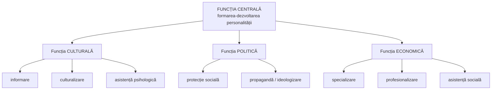

↑ [[Modulul 02 - Clasic, modern și postmodern în educație]] · ← [[2.2 Direcțiile modernizării sistemului educațional]] · → [[2.4 Caracteristicile educației]]

> [!abstract] Pe scurt
> - **Funcția fundamentală** a educației: **pregătirea omului pentru integrarea socială**, pe baza perspectivelor de dezvoltare **culturală, economică și axiologică**.
> - **I. Nicola**: 1) **selectarea și transmiterea valorilor** de la societate la individ; 2) **dezvoltarea potențialului biopsihic**; 3) **pregătirea pentru integrarea activă în viața socială**.
> - **M. Călin**: funcția **antropologic-culturală** (umanizare), **axiologică** (înălțarea valorilor), **de socializare**.
> - **S. Cristea**: **funcții derivate** (dependente de intenții și interese), subordonate funcțiilor generale **culturală, politică, economică**.
> - Sinteza: funcțiile educației vizează **integrarea economică, politică și culturală** a personalității în sistemul social global.

---

# PARTEA I — Ce spune manualul

## 1. Instrucție și educație: cele două mari scopuri (p. 65)

- **C. Cucoș** [7, p. 17], citându-l pe **Berger**: educația urmărește două mari scopuri:

| Scop | Denumire |
|---|---|
| a-i da copilului **cunoștințele generale** de care va avea nevoie | **instrucția** |
| a pregăti în copilul de azi **omul „de mâine”** | **educația** |

> [!quote] Funcția fundamentală (p. 65)
> Funcția fundamentală a educației este **pregătirea omului pentru integrarea socială**, având la bază perspectivele de dezvoltare **culturală, economică și axiologică**.

## 2. Funcțiile educației după Ioan Nicola (p. 65–66)

După **I. Nicola** [11, p. 38]:

### 2.1. Selectarea și transmiterea valorilor de la societate la individ

- Educația formează personalitatea pentru că **transmite individului valorile create de omenire**.
- Necesită o **selecție minuțioasă** a cunoștințelor:
  - potrivite **particularităților de vârstă** și **individuale**;
  - selecția e necesară pentru că **volumul de cunoștințe e foarte mare și în creștere**.
- Se selectează și **modalitățile, metodele și procedeele** de transmitere.

### 2.2. Dezvoltarea potențialului biopsihic al omului

- **Relație reciprocă**: eficiența educației **depinde** de particularitățile psihice ale omului, iar acestea **se dezvoltă** ca rezultat al educației.
- Rezultate bune apar **numai prin exersare** — educația trebuie să **antreneze în acțiune** potențialul psihic al elevului.
- Pașii pedagogului: 1) **descoperă posibilitățile** elevului; 2) **alege metodele și procedeele** potrivite situației concrete.

### 2.3. Pregătirea omului pentru integrarea activă în viața socială

- Omul este pregătit **conform comenzii sociale**.
- Educația formează însușirile necesare pentru ca omul să devină o **personalitate activă și utilă** societății.
- Funcția se realizează pornind de la **studierea cerințelor societății**, dictate de **progresul tehnico-științific**.

## 3. Funcțiile educației după Mariana Călin (p. 66)

După **M. Călin** [3, p. 37]:

| Funcție | Conținut |
|---|---|
| **Antropologic-culturală** | **umanizarea** copilului prin relațiile cu alți oameni; se realizează prin **transmiterea produselor culturii** și **reproducerea culturală** (repetarea acelorași valori) → formarea **comportamentului uman** |
| **Axiologică** | **înălțarea valorilor** culturii și civilizației umanității |
| **De socializare a copilului** | **adaptarea** și **integrarea socială** a copilului |

## 4. Funcții generale vs. funcții derivate — S. Cristea (p. 66–67)

- **Funcțiile generale** exprimă **trăsături intrinseci** ale educației.
- **Funcțiile derivate** desemnează caracteristici **dependente de realitatea formativă**, în raport cu anumite **intenții și interese** [14, p. 21–31].

**Funcțiile derivate după S. Cristea:**

| Funcție generală | Funcții derivate subordonate |
|---|---|
| **culturală** | informare · culturalizare · asistență psihologică |
| **politică** | protecție socială · propagandă/ideologizare |
| **economică** | specializare · profesionalizare · asistență socială |

> [!tip] De reținut
> Funcția **centrală** (formarea-dezvoltarea personalității, → [[2.5 Structura și funcționarea educației]]) se concretizează în trei funcții **generale** (culturală, politică, economică), iar acestea în funcții **derivate**, care depind de contextul și interesele unei societăți.

## 5. Funcțiile educației în R. Moldova — după manual (p. 67)

Manualul afirmă că, potrivit **Codului Educației** [4], educația în R. Moldova:
1. asigură realizarea **idealului educațional**;
2. realizează **dezvoltarea liberă, armonioasă** a copilului și formarea **personalității creative**;
3. garantează **dezvoltarea conștientă și progresivă a potențialului biopsihic** al copilului;
4. **selecționează, prelucrează și transmite valorile** de la societate la copil, **de la copil la copil** și **de la copil la societate**;
5. pregătește copiii pentru **integrarea activă în viața socială**.

> [!warning] Verificare
> Enumerarea **nu a fost identificată** în textul **Codului Educației nr. 152/2014** (consultat: art. 3–12). Codul formulează **misiunea** (art. 5), **idealul** (art. 6), **principiile** (art. 7) și **finalitățile** (art. 11). Lista din manual reia, practic, funcțiile lui **I. Nicola** (pct. 3–5), completate cu idealul și dezvoltarea armonioasă — provine probabil dintr-un document anterior de politici sau dintr-o altă sursă (de verificat). Vezi §9.

## 6. Concluzii (p. 67, 76)

- Funcțiile educației vizează **integrarea economică, politică și culturală** a personalității la nivelul **sistemului social global**.
- Concluzia generală (p. 76) enumeră: funcția **axiologică**, **de socializare** a copilului, **de culturalizare**, **de asistență psihopedagogică**, **de protecție socială**, **de profesionalizare**, **de valorizare personală** — exercitate atât **la nivel de sistem**, cât și **de proces**.

---

# PARTEA II — Completări

## 7. Sinteză comparativă a clasificărilor

| Dimensiune | I. Nicola | M. Călin | S. Cristea | Echivalent în Codul Educației |
|---|---|---|---|---|
| **Culturală / axiologică** | selectarea și transmiterea valorilor | antropologic-culturală; axiologică | funcția culturală (informare, culturalizare) | art. 5 lit. c) dezvoltarea culturii naționale |
| **Psihologică / individuală** | dezvoltarea potențialului biopsihic | (umanizare) | asistență psihologică | art. 6 personalitate capabilă de autodezvoltare |
| **Socială / civică** | integrarea activă în viața socială | socializare | funcția politică (protecție socială) | art. 5 lit. d) incluziune, toleranță |
| **Economică / profesională** | (comanda socială) | — | funcția economică (specializare, profesionalizare) | art. 5 lit. b) dezvoltarea potențialului uman, creșterea economică |

## 8. Perspective clasice și contemporane asupra funcțiilor educației

| Autor | Lucrare, an | Contribuție |
|---|---|---|
| **Émile Durkheim** | *Educație și sociologie* (1922) | funcția de **socializare metodică**; educația asigură **omogenitatea** și **diversitatea** necesare societății |
| **Robert K. Merton** | *Social Theory and Social Structure* (1949) | distincția **funcții manifeste** (declarate, intenționate) vs. **funcții latente** (neintenționate) — aplicabilă școlii (ex.: funcția latentă de „custodie” a copiilor, de formare a rețelelor sociale) |
| **Talcott Parsons** | „The School Class as a Social System” (1959) | funcțiile **de socializare** și **de selecție/alocare** a indivizilor pe poziții sociale |
| **Pierre Bourdieu, J.-C. Passeron** | *La Reproduction* (1970) | funcția (critică) de **reproducere a inegalităților** sociale |
| **Jacques Delors** (coord.) | *Învățarea — o comoară lăuntrică* (UNESCO, 1996) | cei patru piloni: a învăța **să cunoști, să faci, să trăiești împreună, să fii** — pot fi citiți ca funcții complementare |
| **Gert Biesta** | *Good Education in an Age of Measurement* (2010) | trei „domenii ale scopului” educației: **calificarea** (cunoștințe, competențe), **socializarea** (inserția în tradiții și practici), **subiectivarea** (devenirea subiectului autonom) |

> [!note] Comentariu — Biesta vs. Nicola
> Modelul lui **Biesta** se suprapune surprinzător de bine peste cel al lui **Nicola**: *calificarea* ≈ transmiterea valorilor/cunoștințelor; *socializarea* ≈ integrarea în viața socială; *subiectivarea* ≈ dezvoltarea potențialului propriu. Diferența: Biesta insistă că **subiectivarea** nu înseamnă doar adaptare, ci și capacitatea de a **rezista** sau de a **schimba** ordinea socială — o dimensiune absentă din formulările de tip „conform comenzii sociale”.

## 9. Codul Educației: misiune și finalități (în loc de „funcții”)

- **Art. 5 — Misiunea educației**: a) satisfacerea cerințelor educaționale ale **individului și societății**; b) dezvoltarea **potențialului uman** pentru calitatea vieții, creștere economică durabilă, bunăstare; c) dezvoltarea **culturii naționale**; d) **dialog intercultural**, toleranță, nediscriminare, incluziune socială; e) **învățarea pe tot parcursul vieții**; f) **reconcilierea vieții profesionale cu viața de familie**.
- **Art. 11 alin. (1) — Finalitatea principală**: formarea unui **caracter integru** și a unui **sistem de competențe** (cunoștințe, abilități, atitudini, valori) pentru **participarea activă** la viața socială și economică. Alin. (2) enumeră **nouă competențe-cheie** (comunicare în limba română, în limba maternă, în limbi străine; matematică, științe, tehnologie; digitale; a învăța să înveți; sociale și civice; antreprenoriale; exprimare culturală).

> [!note] Comentariu
> Misiunea din art. 5 corespunde celor trei funcții generale ale lui S. Cristea: **culturală** (lit. c, d), **economică** (lit. b), **politică/civică** (lit. d). Pentru un răspuns riguros la examen, citați **art. 5 și art. 11**, nu lista din manual. → [[Modulul 04 - Finalitățile educației]]

## 10. Clarificări terminologice

- **Instrucție / instruire** vs. **educație**: instrucția privește **cunoștințele și capacitățile intelectuale**; educația (în sens restrâns) — formarea **caracterului, atitudinilor, valorilor**. În sens larg, educația **include** instruirea. Distincția de la începutul subcapitolului e clasică în pedagogia franceză.
- **Funcție** vs. **finalitate**: funcția descrie **ce face** educația (rolul ei obiectiv în sistemul social); finalitatea descrie **ce urmărește** (ideal, scopuri, obiective).
- **Funcție** vs. **caracteristică**: funcțiile privesc **efectele** educației; caracteristicile — **trăsăturile** ei definitorii (→ [[2.4 Caracteristicile educației]]).

## 11. Precizare despre sursa „Berger”

- În tradiția pedagogică franceză, distincția instrucție/educație și ideea de a pregăti **omul de mâine** sunt asociate cu **Gaston Berger** (filosof, fondatorul **prospectivei**), autorul volumului *L'homme moderne et son éducation* (PUF, 1962) — identificarea exactă a sursei citate de Cucoș este **de verificat**.

---

## 12. Comentariu critic

> [!warning] Probleme identificate în manual (p. 65–67)
> - **Titlu inconsecvent**: în lista subiectelor modulului (p. 54) apare „2.3. Funcțiile educației”, iar în text „Funcțiile **generale** ale educației” — deși subcapitolul prezintă în bună parte **funcții derivate**.
> - **Lacună în prezentarea lui S. Cristea**: funcțiile derivate sunt date ca „subordonate funcției culturale / politice / economice”, dar **funcțiile generale propriu-zise** (culturală, politică, economică) și **funcția centrală** nu sunt prezentate aici (funcția centrală apare abia în §2.5). Structura clasificării trebuie reconstruită de cititor.
> - **Atribuire discutabilă la Codul Educației**: lista celor cinci funcții nu se regăsește în Codul Educației nr. 152/2014; mai mult, bibliografia modulului descrie Codul drept „**Hotărârea** ... nr. 498, 30 iunie 2014”, cu MO nr. 185-199 din 18.07.2014 — date **incorecte**: Codul este **Legea nr. 152 din 17.07.2014**, publicată în MO nr. 319-324 din **24.10.2014**.
> - **Trimitere bibliografică neclară**: distincția funcții generale/derivate este susținută cu [14, p. 21–31] = **J. R. Searle, *Realitatea ca proiect social*** — o lucrare de filosofie socială (Searle distinge trăsăturile **intrinseci** de cele **relative la observator**/funcțiile atribuite). Legătura e plauzibilă (S. Cristea folosește această distincție), dar manualul nu o explică.
> - **Concluzia de la p. 76** enumeră funcții diferite de cele din text („de valorizare personală”, „de asistență psihopedagogică”) — **inconsecvență** între conținut și concluzii.
> - **Perspectivă adaptativă**: formulări precum „conform comenzii sociale” și „cerințe dictate de progresul tehnico-științific” reflectă o viziune **sociocentristă** (vezi [[2.1 Clasic, modern și postmodern - delimitări conceptuale]]), în tensiune cu valorile postmoderne ale modulului (libertate, originalitate). Lipsește funcția **critică/emancipatoare** a educației (Freire, Biesta).
> - Funcția „**propagandă/ideologizare**” este menționată fără comentariu, deși **art. 7 lit. e)** al Codului consacră **independența educației față de ideologii** și doctrine politice.

## 13. Întrebări de autoverificare

1. Care este diferența dintre instrucție și educație, în sensul citat de C. Cucoș?
2. Formulați funcția fundamentală a educației.
3. Explicați cele trei funcții ale educației după I. Nicola și dați câte un exemplu din practica școlară.
4. Ce funcții ale educației distinge M. Călin? Ce înseamnă „umanizarea” copilului?
5. Prin ce se deosebesc funcțiile generale de cele derivate? Numiți funcțiile derivate subordonate fiecărei funcții generale (S. Cristea).
6. Comparați modelul lui G. Biesta (calificare, socializare, subiectivare) cu funcțiile după I. Nicola.
7. Ce stabilește Codul Educației la art. 5 (misiunea) și art. 11 (finalitățile)? Cum se raportează la funcțiile educației?
8. Care funcție a educației este cel mai dificil de realizat? Argumentați (temă de reflecție din manual).
9. Elaborați o listă de condiții instituționale necesare pentru realizarea funcțiilor educației (exercițiul de creativitate din manual).

## Surse

- **Manual**: Cojocaru-Borozan, M., Sadovei, L., Papuc, L., Ovcerenco, S. (2014). *Fundamentele științelor educației*. Chișinău: UPS „Ion Creangă”, p. 65–67, 76.
- Nicola, I. (2003). *Pedagogie generală*. București: EDP.
- Călin, M. (1996). *Fundamentarea epistemică și metodologică a acțiunii educative*. București: ALL.
- Cucoș, C. (2014). *Pedagogie*. Iași: Polirom.
- Cristea, S. (2003). *Fundamentele științelor educației*; (2000). *Dicționar de pedagogie*. Chișinău–București: Litera Internațional.
- Searle, J. R. (2000). *Realitatea ca proiect social*. Iași: Polirom.
- Codul Educației al Republicii Moldova nr. 152 din 17.07.2014 (MO nr. 319-324, art. 634, 24.10.2014), art. 5, 7, 11.
- Biesta, G. (2010). *Good Education in an Age of Measurement: Ethics, Politics, Democracy*. Boulder: Paradigm.
- Merton, R. K. (1949). *Social Theory and Social Structure*. Glencoe: Free Press.
- Parsons, T. (1959). „The School Class as a Social System”. *Harvard Educational Review*, 29(4).
- Bourdieu, P., Passeron, J.-C. (1970). *La Reproduction*. Paris: Minuit.
- Delors, J. (coord.) (1996). *Learning: The Treasure Within*. Paris: UNESCO.
- Durkheim, É. (1922). *Éducation et sociologie*. Paris: Alcan.
