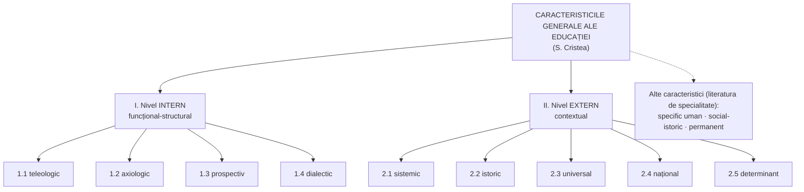

↑ [[Modulul 02 - Clasic, modern și postmodern în educație]] · ← [[2.3 Funcțiile generale ale educației]] · → [[2.5 Structura și funcționarea educației]]

> [!abstract] Pe scurt
> - După **S. Cristea**, educația are caracteristici generale la **două niveluri**: **intern (funcțional-structural)** și **extern (contextual)**.
> - **Nivel intern**: caracter **teleologic**, **axiologic**, **prospectiv**, **dialectic**.
> - **Nivel extern**: caracter **sistemic**, **istoric**, **universal**, **național**, **determinant**.
> - Alte caracteristici din literatură: caracterul **specific uman** (educația ≠ dresaj), **social-istoric**, **permanent**.
> - Ideea transversală: educația transformă treptat **obiectul** educației în **subiect al propriei formări**.

---

# PARTEA I — Ce spune manualul

## 1. Cele două niveluri de referință (p. 67)

**S. Cristea**: prin realizarea funcțiilor sale, educația dobândește caracteristici generale identificate la două niveluri:

## 2. Caracteristicile de la nivel intern (funcțional-structural) (p. 68)

| Caracter | Ce exprimă |
|---|---|
| **1.1. Teleologic** (gr. *telos* = scop) | orientarea spre **scopuri / finalități educaționale**, aflate la baza **proiectelor pedagogice de tip curricular** |
| **1.2. Axiologic** (gr. *axios* = valoros) | raporturile stabile dintre **valori** și **conținuturile generale** ale educației: formarea-dezvoltarea **morală, intelectuală/științifică, tehnologică, estetică, psihofizică** |
| **1.3. Prospectiv** | activitatea de formare este raportată **permanent la viitor**; capacitatea educației de a **depăși situația actuală** în termeni de **progres, eficiență, eficacitate** |
| **1.4. Dialectic** | complexitatea formării-dezvoltării permanente: **transformarea treptată a obiectului educației în subiect** al propriei (auto)formări și formări continue |

> [!tip] De reținut
> Caracterul **dialectic** este cheia trecerii de la **educație** la **autoeducație**: educatul devine, treptat, autorul propriului proiect de formare (→ [[3.6 Educația permanentă și autoeducația]]; modelul funcțional-structural în [[2.5 Structura și funcționarea educației]]).

## 3. Caracteristicile de la nivel extern (contextual) (p. 68–69)

### 2.1. Caracterul sistemic

Presupune realizarea funcțiilor generale ale formării permanente prin corelarea:
- **finalităților**;
- **organizațiilor sociale și comunitare**;
- **nivelurilor și treptelor** sistemului și procesului de învățământ;
- **resurselor pedagogice**;
- **proiectului pedagogic** (obiective, conținuturi, metodologie, evaluare);
- **conținuturilor și formelor** educației.

### 2.2. Caracterul istoric

- Reflectă **evoluțiile gândirii pedagogice**.
- Fiecare **etapă istorică** are o anumită **structură, conținuturi și metodologie** a educației.

### 2.3. Caracterul universal

- Reflectă formarea-dezvoltarea **socială** a personalității, promovată mai ales în **a doua jumătate a sec. XX**.
- Apare un nou model de aplicare a teoriei pedagogice, afirmat **la scară universală**: **paradigma curriculumului**, bazată pe **finalități** și pe o nouă modalitate de **proiectare pedagogică** (→ [[2.1 Clasic, modern și postmodern - delimitări conceptuale]]).
- **I. Bontaș** [1, p. 4]: educația **preia creator** realizările valoroase ale pedagogiei altor popoare și, în același timp, **oferă** altor popoare realizările pedagogiei proprii (în original, „românești”).

### 2.4. Caracterul național

- Reflectă **specificul valorilor culturale** implicate obiectiv și subiectiv în formarea personalității, în contextul sistemelor **(post)moderne** de educație.
- Educația are trăsături **specifice țării** în care se desfășoară: depinde de **condițiile sociale și naturale**, de **tradiții**, de **cultura poporului**.

### 2.5. Caracterul determinant

- Educația este un **factor important** al dezvoltării personalității.
- Este realizabil prin **corelația optimă** dintre educație și ceilalți doi factori ai dezvoltării: **ereditatea** și **mediul** (→ [[Modulul 09 - Agenții educației și factorii dezvoltării]]).

## 4. Alte caracteristici ale educației (p. 69–71)

### 4.1. Caracterul specific uman (p. 69–70)

- Procesul educativ este **organizat** de instituții specializate, se desfășoară **conștient**, are un **scop bine definit** și folosește **strategii** pentru rezultatele așteptate.
- Educația este exercitată **de oameni asupra oamenilor**.
- **I. Bontaș** [1, p. 4]: educația umană, în care are loc **învățarea**, se deosebește **calitativ** de evoluția animalelor prin **modificări profunde, selective și stabile** ale comportamentului, finalizate cu **noi achiziții cognitive** și cu perfecționarea răspunsurilor la solicitările mediului.
- Influența educativă **nu se bazează pe instinct** (ca la animale) și **nu este imitație mecanică**.

**Educație vs. dresaj:**

| Educația | Dresajul |
|---|---|
| exercitată **numai asupra oamenilor** | exercitată asupra **animalelor** |
| conștientă, cu scopuri asumate, formează **personalitatea** | a deprinde un animal să execute **la poruncă** anumite mișcări |
| achiziții **cognitive**, **selective**, **stabile**, transferabile | **scopuri artificiale**, nenaturale pentru animal |
| deschide spre **autonomie** și **autoformare** | **translare forțată** a unor comportamente „antropomorfe”, reproduse prin **automatism** (C. Cucoș [7, p. 7]) |

### 4.2. Caracterul social-istoric (p. 70)

- Educația **a apărut odată cu societatea**, se **dezvoltă** odată cu ea și **contribuie** la dezvoltarea ei.
- **Dezvoltarea societății determină sarcinile și conținutul** educației; fiecare nivel de dezvoltare socială înaintează **cerințe proprii**.
- Conținutul și strategiile educației se modifică în funcție de **problemele** și **orientările vieții sociale**; concepțiile despre educație s-au format în condiții **istorico-sociale** concrete.

### 4.3. Caracterul permanent (p. 70–71)

- **Nu există etapă istorică sau țară** în care să nu se fi organizat procesul educațional.
- **Transmiterea experienței** de la o generație la alta este un **proces continuu**, care contribuie la dezvoltarea omenirii.
- **Scopul final** este orientat **spre viitor**: formarea personalității care va activa „mâine”.
- Educația face legătura **dintre trecut și viitor**: noile generații se dezvoltă pe baza **moștenirii culturale** a înaintașilor.
- **Paradox**: educația produce și o anumită **distanțare între generații**; pentru ca ea să nu fie prea mare, e necesară **instruirea permanentă** a tuturor membrilor societății.
- După studiile organizate urmează obligatoriu **autoinstruirea**: orice oprire pe loc este **un pas înapoi** (p. 71).

---

# PARTEA II — Completări

## 5. Tabel-sinteză: caracteristică → întrebare-cheie → exemplu

| Caracteristică | Întrebarea la care răspunde | Exemplu |
|---|---|---|
| teleologic | **Pentru ce** educăm? | idealul educațional (Codul Educației, art. 6), obiectivele lecției |
| axiologic | **Ce valori** transmitem? | binele, adevărul, frumosul, sănătatea — în conținuturile educației |
| prospectiv | **Pentru ce viitor** educăm? | competențe digitale, a învăța să înveți |
| dialectic | Cum devine educatul **subiect**? | autoevaluarea, portofoliul, proiectul individual |
| sistemic | **Ce componente** trebuie corelate? | curriculum – resurse – evaluare – instituții – comunitate |
| istoric | Cum **se schimbă** educația în timp? | de la lecția herbartiană la învățarea centrată pe elev |
| universal | Ce e **comun** tuturor sistemelor? | paradigma curriculumului, ISCED, competențele-cheie |
| național | Ce e **specific** unui popor? | limba, istoria, tradițiile în curriculum |
| determinant | Cât **contează** educația față de ereditate și mediu? | recuperarea copiilor din medii defavorizate |
| specific uman | Prin ce **diferă** de dresaj? | conștiință, intenționalitate, transfer |
| permanent | **Când** se încheie educația? | niciodată — învățarea pe tot parcursul vieții |

## 6. Repere teoretice pentru caracteristicile educației

| Caracteristică | Autor | Lucrare, an | Contribuție |
|---|---|---|---|
| **specific uman** | **Immanuel Kant** | *Despre pedagogie* (1803) | omul este **singura făptură care trebuie educată**; omul nu devine om decât prin educație |
| **specific uman** | **Adolf Portmann** | *Biologische Fragmente zu einer Lehre vom Menschen* (1944) | omul se naște „prematur” biologic (**„nașterea fiziologică prematură”**) — de aici dependența lui de îngrijire și educație |
| **social-istoric** | **Émile Durkheim** | *Educație și sociologie* (1922) | fiecare societate își creează **idealul educativ** propriu; educația variază istoric |
| **permanent** | **Paul Lengrand** | *Introduction à l'éducation permanente* (UNESCO, 1970) | fundamentarea conceptului de **educație permanentă** |
| **permanent** | **Edgar Faure** (coord.) | *Learning to Be* / *A învăța să fii* (UNESCO, 1972) | **„cetatea educativă”**; educația ca proces pe tot parcursul vieții |
| **permanent / distanța dintre generații** | **Margaret Mead** | *Culture and Commitment* (1970) | culturi **postfigurative** (tinerii învață de la vârstnici), **cofigurative** (de la egali), **prefigurative** (vârstnicii învață de la tineri) — explică „distanțarea dintre generații” semnalată de manual |
| **prospectiv** | **Gaston Berger** | (anii 1950) | fondatorul **prospectivei** ca atitudine față de viitor (de verificat detaliile bibliografice) |
| **universal / național** | **UNESCO** | *ISCED* (1997, revizuită 2011) | clasificare internațională comună a nivelurilor de educație, preluată de Codul Educației (art. 12) |

> [!note] Comentariu — caracterul determinant
> Manualul formulează prudent „caracterul determinant” ca **corelație optimă** între educație, ereditate și mediu. În istoria pedagogiei s-au confruntat pozițiile **ereditaristă** (dezvoltarea e determinată genetic), **ambientalistă** (mediul decide; ex. behaviorismul lui J. B. Watson) și **teoria interacțiunii** factorilor — la care se raliază manualul. Educația are rol **conducător**, dar nu omnipotent. → [[Modulul 09 - Agenții educației și factorii dezvoltării]]

## 7. Legături cu Codul Educației al R. Moldova (nr. 152/2014)

| Caracteristică | Prevedere |
|---|---|
| **teleologic** | art. 6 (idealul educațional); art. 11 (finalitățile educaționale, competențele-cheie) |
| **axiologic** | art. 6 — valori **naționale și universale** asumate |
| **prospectiv / permanent** | art. 5 lit. e) — promovarea **învățării pe tot parcursul vieții**; art. 123–127 (cadrul învățării pe tot parcursul vieții) |
| **național** | art. 5 lit. c) — dezvoltarea **culturii naționale**; art. 7 lit. i) — drepturile persoanelor aparținând **minorităților naționale** (dimensiune **multiculturală** a caracterului național) |
| **universal** | art. 12 — structura sistemului conform **ISCED-2011**; art. 7 lit. b) — raportarea la **bune practici internaționale** |
| **sistemic** | art. 7 lit. j) — principiul **unității și integralității spațiului educațional** |

## 8. Clarificări terminologice

- **Teleologie** (gr. *telos* = scop + *logos*) — studiul scopurilor; în pedagogie → **teleologia educației** = teoria finalităților (→ [[Modulul 04 - Finalitățile educației]]).
- **Axiologie** (gr. *axios* = valoros) — teoria valorilor; în pedagogie — valorile care fundamentează conținuturile educației (→ [[Modulul 06 - Dimensiunile generale ale educației]]).
- **Prospectiv** ≠ **prognostic**: prospectiva nu doar **prezice**, ci **construiește** activ viitorul dorit.
- **Eficiență** (raport rezultate/resurse) vs. **eficacitate** (gradul de atingere a obiectivelor) — ambele termeni apar la caracterul prospectiv.

---

## 9. Comentariu critic

> [!warning] Probleme identificate în manual (p. 67–71)
> - **Clasificare hibridă**: după cele nouă caracteristici ale lui S. Cristea, manualul adaugă „alte caracteristici” (specific uman, social-istoric, permanent) care **se suprapun** cu cele deja prezentate: *social-istoric* ≈ *istoric*; *permanent* ≈ *prospectiv* + *dialectic*. Nu se precizează din ce surse provin (în afara lui Bontaș și Cucoș).
> - **Încadrare discutabilă**: caracterul **universal** este explicat prin „formarea-dezvoltarea **socială**” și prin paradigma curriculumului — aceasta ține mai degrabă de caracterul **istoric** al educației (o etapă a gândirii pedagogice).
> - **Citat nepotrivit contextului**: citatul din **I. Bontaș** vorbește despre „realizările educației și pedagogiei **românești**” oferite altor popoare — preluat fără adaptare într-un manual din R. Moldova; formularea finală („devenind prin aceasta caracterul lor universal”) este gramatical defectuoasă.
> - **Afirmație inexactă**: la caracterul specific uman, manualul spune că procesul educativ „este organizat de **instituții specializate**” — ceea ce e valabil doar pentru **educația formală** (și parțial nonformală), nu și pentru educația **informală**, care e tot educație (→ [[3.4 Educația informală]]).
> - **Idee repetată**: sintagma „după cum s-a menționat și anterior” și reluarea ideii educație ≠ instinct/imitație (p. 69–70) — redundanță.
> - **Paranteze și formulări greșite**: „(auto)formări)”, „personalităţii)” — paranteze neînchise/în plus; enumerarea de la caracterul sistemic („funcțiile generale ale formării permanente ale personalității: finalitățile; organizațiile...”) amestecă funcții cu componente.
> - **Lipsă**: nu este discutat caracterul **dual** (conservator și inovator) al educației, deși tema tradiție–modernitate este centrală în acest modul.

## 10. Întrebări de autoverificare

1. Care sunt cele două niveluri la care S. Cristea identifică caracteristicile educației?
2. Explicați caracterul teleologic, axiologic, prospectiv și dialectic al educației.
3. Ce înseamnă transformarea obiectului educației în subiect? Ce caracteristică exprimă?
4. Prin ce se deosebesc caracterul universal și caracterul național? Pot intra în conflict?
5. Explicați caracterul determinant al educației în raport cu ereditatea și mediul.
6. Care este diferența dintre educație și dresaj?
7. De ce educația produce o „distanțare între generații” și cum poate fi atenuată? (legați de M. Mead)
8. Identificați în Codul Educației câte o prevedere care ilustrează caracterul teleologic, național și permanent al educației.

## Surse

- **Manual**: Cojocaru-Borozan, M., Sadovei, L., Papuc, L., Ovcerenco, S. (2014). *Fundamentele științelor educației*. Chișinău: UPS „Ion Creangă”, p. 67–71.
- Cristea, S. (2003). *Fundamentele științelor educației. Teoria generală a educației*. Chișinău–București: Litera Internațional.
- Bontaș, I. (2008). *Tratat de pedagogie*. București: ALL.
- Cucoș, C. (2014). *Pedagogie*. Iași: Polirom.
- Kant, I. (1803). *Über Pädagogik*.
- Portmann, A. (1944). *Biologische Fragmente zu einer Lehre vom Menschen*. Basel: Schwabe.
- Lengrand, P. (1970). *Introduction à l'éducation permanente*. Paris: UNESCO.
- Faure, E. et al. (1972). *Learning to Be: The World of Education Today and Tomorrow*. Paris: UNESCO.
- Mead, M. (1970). *Culture and Commitment: A Study of the Generation Gap*. New York: Natural History Press / Doubleday.
- Durkheim, É. (1922). *Éducation et sociologie*. Paris: Alcan.
- UNESCO Institute for Statistics (2012). *International Standard Classification of Education: ISCED 2011*.
- Codul Educației al Republicii Moldova nr. 152 din 17.07.2014, art. 5, 6, 7, 11, 12, 123–127.
