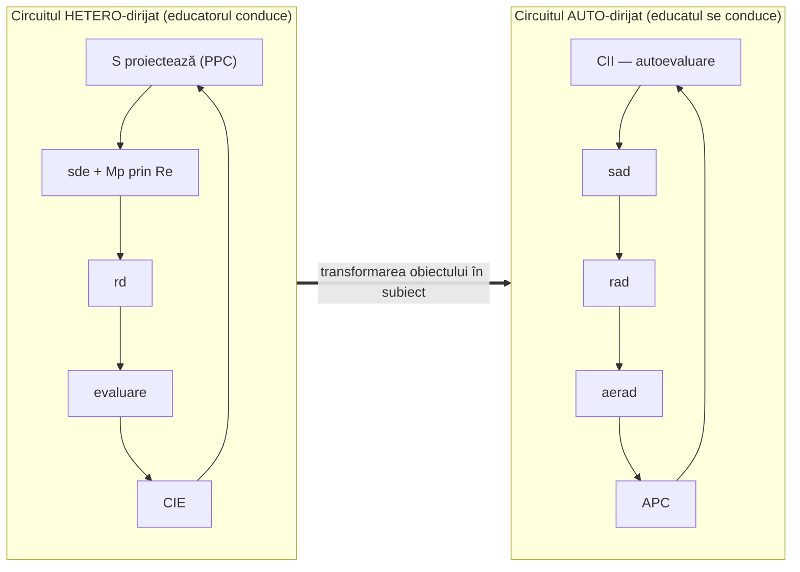
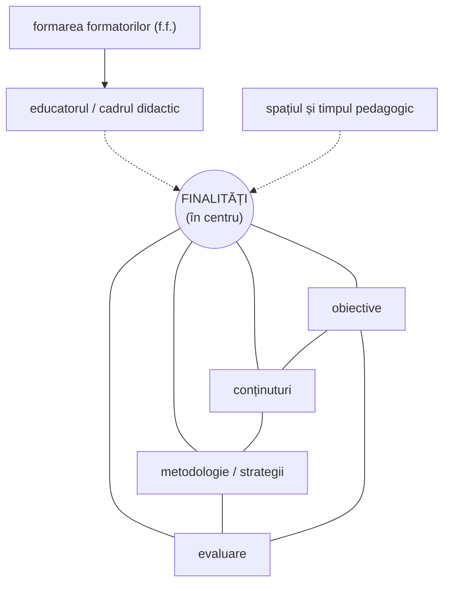

↑ [[Modulul 02 - Clasic, modern și postmodern în educație]] · ← [[2.4 Caracteristicile educației]] · → [[3.1 Formele generale ale educației - delimitări conceptuale]]

> [!abstract] Pe scurt
> - **Structura de bază** a educației: **subiectul** (educatorul, individual/colectiv) și **obiectul** (educatul, individual/colectiv), aflați într-o **corelație funcțională**.
> - **Modelul funcțional-structural (S. Cristea, 2003)**: subiect → **proiect pedagogic curricular** → **mesaj pedagogic** (prin **repertoriu comun**) → **răspuns dirijat** al educatului → **conexiune inversă externă**; apoi **conexiune inversă internă** → **autoproiect pedagogic** → educatul devine **subiect al propriei formări**. Totul într-un **context pedagogic intern și extern**.
> - **Funcția centrală**: formarea-dezvoltarea **permanentă** a personalității pentru integrarea psihosocială (culturală, civică, economică).
> - **Modelul structural circular al curriculumului (L. Papuc, 2005)**: **finalitățile în centru**; include **formatorul** (produs al formării formatorilor), **spațiul** și **timpul**; aplicabil **la toate nivelurile** sistemului și procesului de învățământ.

---

# PARTEA I — Ce spune manualul

## 1. Structura de bază a educației (p. 71)

- Componentele esențiale: **subiectul educației** (educatorul) și **obiectul educației** (educatul) — ambele **individuale sau colective**; cei doi factori **corelează funcțional**.
- Structura de bază = **nucleul funcțional-structural** al activității de educație permanentă a personalității.
- Cercetătorii au definit, pornind de aici, **componentele cele mai importante** ale educației → **Fig. 2** (S. Cristea, 2003).

## 2. Modelul de analiză a educației la nivel funcțional-structural — S. Cristea (2003) (p. 71–75)

> [!info] Despre figură
> **Fig. 2** din manual (p. 71) este o schemă grafică; ea nu apare în textul extras. Diagrama de mai jos este o **reconstituire după descrierea verbală** a componentelor (p. 72–74), nu o copie a figurii.

```mermaid
flowchart LR
    subgraph CPE["Context pedagogic EXTERN (Cpe): cultural, economic, politic, managerial, comunitar, tehnologic"]
    subgraph CPI["Context pedagogic INTERN (Cpi): forme de organizare, spațiu, timp, stiluri pedagogice"]
        FCE(["FCE — funcția centrală:<br/>formarea-dezvoltarea permanentă<br/>a personalității"])
        FME["FME — finalități macrostructurale<br/>(ideal, scopuri)"] --> OBJ["o — obiective"]
        S["S — subiectul<br/>(educatorul)"] --> PPC["PPC — proiect pedagogic curricular<br/>o · c · m · e"]
        OBJ --> PPC
        PPC --> SDE["sde — strategie<br/>de dirijare"]
        SDE --> MP["Mp — mesaj pedagogic<br/>(prin Re — repertoriu comun)"]
        MP --> SO["SO — subiectivitatea obiectului<br/>(receptare, interiorizare)"]
        SO --> O["O — obiectul<br/>(educatul)"]
        O --> RD["rd — răspuns dirijat"]
        RD -->|"evaluare"| CIE["CIE — conexiune inversă EXTERNĂ"]
        CIE -->|"corectare, reglare"| S
        RD --> CII["CII — conexiune inversă INTERNĂ<br/>(autoevaluare)"]
        CII --> SAD["sad — strategie<br/>de autodirijare"]
        SAD --> RAD["rad — răspuns autodirijat"]
        RAD --> AERAD["aerad — autoevaluarea<br/>răspunsului autodirijat"]
        AERAD --> APC["APC — autoproiect pedagogic curricular<br/>(obiectul devine SUBIECT)"]
    end
    end
```

### 2.1. Componentele modelului — tabel complet

| Simbol | Componentă | Definiție (parafrază după manual) |
|---|---|---|
| **S** | **Subiectul educației** | educatorul (individual/colectiv), **inițiatorul** activității: **autor al proiectului pedagogic** și **emițător al mesajului**. Statutul său e **ontologic, existențial**, probat prin **experiența de viață** (familia) sau prin **nivel profesional specializat** (cadrul didactic) |
| **O** | **Obiectul educației** | educatul (individual/colectiv), **beneficiarul** activității, **receptor** al mesajului. Statut **de moment**, datorat experienței sau pregătirii limitate (fiu, preșcolar, elev, student). **Ca potențial de cunoaștere, e subiect** (activ în cunoaștere); devine **subiect al educației** doar când devine **inițiator** și **autor al propriului proiect pedagogic** |
| **FCE** | **Funcția centrală a educației** | formarea-dezvoltarea **permanentă** a personalității pentru **integrarea psihosocială** a educatului (în sens **cultural, civic, economic**) |
| **FME** | **Finalitățile macrostructurale** | elaborate la nivel de **filosofie și politică a educației**, valabile pentru **sistem**: **idealul** (tipul de personalitate) și **scopurile** (direcțiile generale de evoluție) |
| **o** | **Finalitățile microstructurale — obiectivele** | derivate din cele macrostructurale; definesc, la nivel **general și particular**, orientările valorice ale formării |
| **c** | **Conținuturile generale** | educația **morală, intelectuală, tehnologică, estetică, psihofizică**, bazate pe valori fundamentale (vezi §2.2) |
| **m** | **Metodologia educației** | ansamblul metodelor în cadrul **strategiilor**, bazate pe: **comunicare**, **cercetarea realității**, **acțiune practică**, **instruire programată** (calculator); valorifică **modurile** (frontal, grupal, individual) și **formele** de organizare (curs, lecție, seminar, oră de dirigenție) |
| **e** | **Evaluarea educației** | acțiuni de **control și apreciere** a gradului de îndeplinire a obiectivelor |
| **PPC** | **Proiectul pedagogic de tip curricular** | **articulează** componentele: **obiective – conținuturi – metodologie – evaluare** |
| **Mp** | **Mesajul pedagogic** | o acțiune de **comunicare pedagogică** |
| **Re** | **Repertoriul comun** | **capacitatea empatică** a educatorului de a transpune mesajul într-un plan psihologic complex: **cognitiv, afectiv, motivațional, caracterial**. Calitatea lui asigură **receptivitatea**; **lipsa lui → blocaj pedagogic** |
| **SO** | **Subiectivitatea obiectului** | **receptarea și interiorizarea** mesajului, rezultat al repertoriului comun, în vederea unui **răspuns dirijat** |
| **sde** | **Strategia de dirijare** | set de **metode, procedee, mijloace** selectate **de educator** |
| **rd** | **Răspunsul dirijat** | reacția educatului (**cunoștințe, deprinderi, aptitudini, atitudini**) la strategia educatorului; **evaluarea** lui = **măsurare-apreciere** în vederea **deciziei** |
| **CIE** | **Conexiunea inversă externă** | **retroacțiunea educatorului** față de reacția educatului; permanentă, mijloc de **reglare-autoreglare**: corectare, ameliorare, ajustare, **restructurare a proiectului** |
| **CII** | **Conexiunea inversă internă** | retroacțiunea realizată **de educat** prin **autoevaluarea** propriului comportament |
| **sad** | **Strategia de autodirijare** | metode, procedee, mijloace selecționate **de educat** pentru un nou răspuns |
| **rad** | **Răspunsul autodirijat** | reacția complexă a educatului la propria strategie de autodirijare |
| **aerad** | **Autoevaluarea răspunsului autodirijat** | **automăsurare-autoapreciere** în vederea deciziei de autodirijare și a elaborării autoproiectului |
| **APC** | **Autoproiectul pedagogic curricular** | capacitatea de **autoevaluare, autoinstruire, autoeducație** → **transformarea obiectului în subiect** al educației |
| **Cpi** | **Contextul pedagogic intern** | **ambianța educațională** (didactică, extradidactică), rezultată din interacțiunea **formelor de organizare, spațiului și timpului pedagogic, stilurilor pedagogice** |
| **Cpe** | **Contextul pedagogic extern** | impactul **câmpului psihosocial** din medii **macro- și microstructurale**: cultural, economic, politic, managerial, comunitar, tehnologic |

### 2.2. Conținuturile generale și valorile fundamentale (p. 73)

| Conținut general (dimensiune) | Valoare fundamentală |
|---|---|
| educația **morală** | **binele** moral |
| educația **intelectuală** | **adevărul** științific |
| educația **tehnologică** | adevărul științific **aplicat** |
| educația **estetică** | **frumosul** |
| educația **psihofizică** | **sănătatea** |

Aceste conținuturi sunt deschise spre **problematica lumii contemporane** [15] (→ [[Modulul 06 - Dimensiunile generale ale educației]], [[Modulul 07 - Noile educații]]).

### 2.3. Cele două „circuite” ale modelului

> [!tip] De reținut
> Valoarea modelului (p. 75): conturează clar **obiectul de studiu al pedagogiei** — **nucleul funcțional-structural** al formării-dezvoltării permanente a personalității, care condiționează **calitatea educației** într-un **timp și spațiu pedagogic determinat**. Dinamica sugerată îi conferă statutul de **model teoretic**.

## 3. Modelul structural circular al curriculumului — L. Papuc (2005) (p. 75–76)

- Manualul îl apreciază ca **„de tip nou”** și **valoros** (Fig. 3; figura nu apare în textul extras).
- **Avantaje** față de modelele anterioare:
  - **poziționare mai exactă a finalităților**, care ocupă **locul central**;
  - imagine mai clară a **raporturilor dintre componentele curriculumului**, examinate **în dinamica lor** [6, p. 312].
- Pune în aplicare **ideea acțională** a curriculumului prin **cel puțin doi factori** ai acțiunii:
  1. **educatorul / cadrul didactic** — implicat direct, prezentat ca **produs al sistemului de formare a formatorilor (f.f.)**;
  2. **spațiul și timpul** — incluse **explicit** în modelul grafic.
- Se referă în principal la **obiectivele concrete**, dar reprezentarea grafică indică extinderi spre **obiectivele generale și specifice** și chiar spre **finalitățile macrostructurale** → modelul poate fi aplicat **la toate nivelurile** sistemului și procesului de învățământ:
  - strategia generală de **proiectare a curriculumului școlar**;
  - **planul de învățământ**;
  - **programele** și **manualele** școlare;
  - **proiectele** de activitate didactică și educativă.

> [!info] Precizare
> Schema de mai sus este o **reprezentare orientativă** construită după descrierea verbală din manual (finalități centrale, raporturi circulare între componente, formatorul și spațiu-timpul ca factori), **nu** o reproducere a Fig. 3.

## 4. Concluziile generale ale modulului (p. 76)

1. Prin educație se transmit **obiceiuri, credințe, practici, reprezentări sociale**, **sistemul național de valori** → **identitate și demnitate**.
2. Direcțiile modernizării: **structura, curriculumul, resursele umane, managementul**; pedagogia postmodernă cere **„noul caracter social”** (nevoia de comunitate, de structură, de sens), exprimat prin receptivitate, libertate, creativitate, toleranță, competitivitate, deontologie, mobilitate, maturitate afectivă, originalitate.
3. **Funcțiile educației** (axiologică, de socializare, de culturalizare, de asistență psihopedagogică, de protecție socială, de profesionalizare, de valorizare personală) se exercită **la nivel de sistem și de proces**.

## 5. Teme de reflecție și sarcini (p. 76–77)

- comentarea conceptelor de **clasic, modern, postmodern**;
- identificarea **direcțiilor modernizării** actuale și a celei **prioritare**;
- opinie despre **funcțiile educației** — care e cel mai greu de realizat;
- analiza **modelelor funcțional-structurale** din literatură;
- selectarea și comentarea a **10 maxime, proverbe, zicători** despre educație;
- demonstrarea valorii **funcției educative** în activitatea cadrului didactic;
- lectura **Codului Educației** privind **principiile generale** și aplicarea lor în R. Moldova;
- **exercițiu de creativitate**: condițiile instituționale pentru realizarea funcțiilor educației;
- **jurnal de modul**: ce am învățat / ce pot aplica și schimba.

---

# PARTEA II — Completări

## 6. Rădăcinile teoretice ale modelului lui S. Cristea

| Concept din model | Proveniență | Autor, lucrare, an |
|---|---|---|
| **conexiune inversă** (CIE, CII), reglare-autoreglare | **cibernetica** | **Norbert Wiener**, *Cybernetics: Or Control and Communication in the Animal and the Machine* (1948) — *feedback* ca mecanism de autoreglare a sistemelor |
| **emițător – mesaj – receptor**, **repertoriu** | **teoria informației și a comunicării** | **C. Shannon, W. Weaver**, *The Mathematical Theory of Communication* (1949); ideea de **repertoriu** comun de semne dintre emițător și receptor e dezvoltată în teoria informației aplicată comunicării (ex. **Abraham Moles** — de verificat detaliile) |
| **obiective – conținuturi – metodologie – evaluare** | **teoria curriculumului** | **Ralph Tyler**, *Basic Principles of Curriculum and Instruction* (1949) — cele patru întrebări: ce scopuri? ce experiențe de învățare? cum se organizează? cum se evaluează?; **Hilda Taba**, *Curriculum Development: Theory and Practice* (1962) |
| **finalități macro- și microstructurale** | **pedagogia prin obiective** | **B. Bloom** (1956); **L. D'Hainaut** (coord.), *Programe de învățământ și educație permanentă* (UNESCO; trad. rom. EDP, 1981) — ierarhia finalități → scopuri → obiective |
| **transformarea obiectului în subiect** | **pedagogia autonomiei**, autoeducație | **Paulo Freire**, *Pedagogia oprimaților* (1968): depășirea relației educator–educat prin **dialog** — ambii devin subiecți; **Carl Rogers**, *Freedom to Learn* (1969) |
| **context pedagogic extern** | **ecologia dezvoltării** | **Urie Bronfenbrenner**, *The Ecology of Human Development* (1979) — micro-, mezo-, exo-, macrosistem |

> [!note] Comentariu — ce aduce modelul
> Modelul lui Cristea este o **sinteză cibernetico-curriculară**: structura clasică **educator → educat** (magistrocentristă) este păstrată, dar e **completată** cu bucla autodirijată (psihocentristă) și cu **contextul** (sociocentrist), iar totul e organizat prin **proiectul curricular** (paradigma curriculumului). Este, în mic, **sinteza orientărilor** prezentate în [[2.1 Clasic, modern și postmodern - delimitări conceptuale]].

## 7. Subiect și obiect al educației — clarificări

- Terminologia **„obiect al educației”** este criticată în pedagogia contemporană pentru că sugerează **pasivitate**; manualul însuși precizează că educatul este **subiect al cunoașterii** și poate deveni **subiect al educației**. Termeni alternativi: **educat**, **beneficiar** (Codul Educației folosește „**beneficiarii** educației”, art. 7 lit. d), **cel care învață** (*learner*).
- **Louis Not**, *Les pédagogies de la connaissance* (1979): **heterostructurare** (educatorul structurează — circuitul dirijat), **autostructurare** (educatul se structurează singur — circuitul autodirijat), **interstructurare** (construcție comună) — oferă un cadru pentru cele două circuite ale modelului.
- **Relația cu autoeducația**: APC (autoproiectul) este traducerea operațională a **autoeducației** (→ [[3.6 Educația permanentă și autoeducația]]).

## 8. Repertoriul comun și blocajul pedagogic — aplicații

| Situație | Lipsa repertoriului comun | Soluție |
|---|---|---|
| **cognitivă** | profesorul folosește concepte pe care elevii nu le au | pornirea de la experiența și cunoștințele anterioare ale elevilor |
| **afectivă** | lipsa empatiei, climat tensionat | relație de încredere, feedback pozitiv |
| **motivațională** | conținutul nu are sens pentru elev | legarea de interesele și proiectele elevului |
| **lingvistică / culturală** | diferențe de limbă, cod cultural | pedagogie interculturală, diferențiere |

> [!note] Comentariu
> Ideea repertoriului comun anticipează conceptul de **zonă a proximei dezvoltări** (L. S. Vygotsky, anii 1930): învățarea eficientă se produce acolo unde mesajul educatorului se întâlnește cu ceea ce educatul poate înțelege **cu sprijin**.

## 9. Modele ale curriculumului (context pentru modelul lui L. Papuc)

| Model | Reprezentare | Idee |
|---|---|---|
| **Modelul liniar** (Tyler, 1949) | obiective → conținuturi → metode → evaluare | proiectare **secvențială**, pornind de la obiective |
| **Modelul ciclic / circular** | componentele se influențează reciproc, cu *feedback* | evaluarea retroactivează asupra obiectivelor |
| **Modelul circular (L. Papuc, 2005)** | finalități **în centru**, componente în jur, + formator, spațiu, timp | aplicabil la **toate nivelurile** (plan, programă, manual, proiect de lecție) |

- În R. Moldova, **art. 40** al Codului Educației definește curriculumul național (cadru de referință, plan-cadru, curricula disciplinelor, manuale, ghiduri) — adică exact **nivelurile** la care modelul lui Papuc se declară aplicabil. → [[Modulul 10 - Proiectarea, realizarea și evaluarea activității educative]]

---

## 10. Comentariu critic

> [!warning] Probleme identificate în manual (p. 71–78)
> - **Figurile nu sunt explicate integral**: Fig. 2 este inserată **înainte** de a fi anunțată în text; Fig. 3 este descrisă doar parțial — cititorul fără figură nu poate reconstitui modelul lui Papuc.
> - **Propoziție incompletă**: „Acest model este preluat L. Papuc **cu titlul** [12]” — lipsește titlul; în plus, figura datează modelul **2005**, iar sursa [12] este din **2006**.
> - **Trimitere anacronică**: descrierea modelului lui Papuc (2005) este susținută cu **[6, p. 312]** = S. Cristea, *Dicționar de pedagogie* (**2000**) — o lucrare anterioară modelului nu îl poate descrie.
> - **Referința la S. Cristea (2003)** apare în text fără număr bibliografic, deși lucrarea e listată ca [5].
> - **Erori în definiții**: la **aerad** se vorbește de elaborarea „proiectului pedagogic curricular (**APC**)” — dar APC = **auto**proiectul; definiția **SO** (subiectivitatea obiectului) este sintactic confuză (receptarea „realizată de subiect”...); răspunsul dirijat e „reacția la strategia **educator**” (lipsește un cuvânt).
> - **Greșeli de tipar**: „evalaure”, „organizare, organizare”, „integrării psihosociale celui educat”, „Model de analiza”.
> - **Numărul de componente** (peste 20 de simboluri) face modelul greu de memorat fără o schemă ordonată pe **circuite** (dirijat / autodirijat) — manualul nu oferă această grupare.
> - **Concluziile generale** (p. 76) nu rezumă **deloc** subcapitolele 2.4 și 2.5 (caracteristici, structură), iar lista funcțiilor diferă de cea din §2.3.
> - **Bibliografia modulului**: Codul Educației este descris greșit ca „Hotărâre ... nr. 498, 30 iunie 2014”; corect: **Legea nr. 152 din 17.07.2014** (MO nr. 319-324, 24.10.2014). Tema de reflecție trimite la „principiile generale” din Cod — corect: **principiile fundamentale** (art. 7).

## 11. Întrebări de autoverificare

1. Care sunt componentele structurii de bază a educației? Ce înseamnă că „corelează funcțional”?
2. Definiți subiectul și obiectul educației după S. Cristea. În ce condiții obiectul devine subiect?
3. Care este funcția centrală a educației?
4. Distingeți finalitățile macrostructurale de cele microstructurale.
5. Asociați fiecărui conținut general al educației valoarea sa fundamentală.
6. Ce este repertoriul comun și ce se întâmplă în lipsa lui? Dați un exemplu de blocaj pedagogic.
7. Explicați diferența dintre conexiunea inversă externă și cea internă.
8. Descrieți circuitul autodirijat (CII → sad → rad → aerad → APC). Cu ce formă a educației se leagă?
9. Ce aduce nou modelul structural circular al curriculumului (L. Papuc)? La ce niveluri se aplică?
10. Din ce discipline provin conceptele de *feedback*, *mesaj* și *repertoriu* folosite în modelul funcțional-structural?

## Surse

- **Manual**: Cojocaru-Borozan, M., Sadovei, L., Papuc, L., Ovcerenco, S. (2014). *Fundamentele științelor educației*. Chișinău: UPS „Ion Creangă”, p. 71–78.
- Cristea, S. (2003). *Fundamentele științelor educației. Teoria generală a educației*. Chișinău–București: Litera Internațional.
- Cristea, S. (2000). *Dicționar de pedagogie*. Chișinău–București: Litera Internațional.
- Papuc, L., Cojocaru, M., Sadovei, L., Rurac, A. (2006). *Teoria educației. Suport de curs. Ghid metodologic*. Chișinău: Reclama.
- Silistraru, N. (2006). *Valori ale educației moderne*. Chișinău.
- Wiener, N. (1948). *Cybernetics: Or Control and Communication in the Animal and the Machine*. Cambridge, MA: MIT Press.
- Shannon, C. E., Weaver, W. (1949). *The Mathematical Theory of Communication*. Urbana: University of Illinois Press.
- Tyler, R. W. (1949). *Basic Principles of Curriculum and Instruction*. Chicago: University of Chicago Press.
- Taba, H. (1962). *Curriculum Development: Theory and Practice*. New York: Harcourt, Brace & World.
- D'Hainaut, L. (coord.) (1981). *Programe de învățământ și educație permanentă*. București: EDP.
- Not, L. (1979). *Les pédagogies de la connaissance*. Toulouse: Privat.
- Freire, P. (1968/1970). *Pedagogia oprimaților*.
- Bronfenbrenner, U. (1979). *The Ecology of Human Development*. Cambridge, MA: Harvard University Press.
- Codul Educației al Republicii Moldova nr. 152 din 17.07.2014, art. 7, 40.
