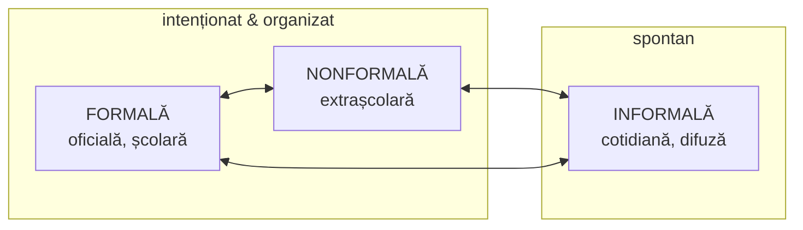

↑ [[Modulul 03 - Formele generale ale educației]] · → [[3.2 Educația formală]] · Serie: 3.1 · [[3.2 Educația formală|3.2]] · [[3.3 Educația nonformală|3.3]] · [[3.4 Educația informală|3.4]] · [[3.5 Relația dintre formele educației|3.5]] · [[3.6 Educația permanentă și autoeducația|3.6]]

> [!abstract] Pe scurt
> - Personalitatea primește permanent influențe **cu sau fără intenție pedagogică**, organizate sau spontane, simultane sau succesive. Pedagogia le grupează prin conceptul de **forme generale ale educației**.
> - Există **trei forme**: **formală** (oficială), **nonformală** (extrașcolară), **informală** (spontană).
> - Criteriile de clasificare din manual: **proiectarea** (instituțională sau nu) și **organizarea** (acțiuni explicite sau doar influențe implicite).
> - Triada vine din literatura UNESCO de la sfârșitul anilor '60 (**Ph. Coombs**). Astăzi e preluată și în **Codul Educației al R. Moldova** (art. 3, 123).

---

# PARTEA I — Ce spune manualul

## 1. Punctul de plecare (p. 80)

- Personalitatea e supusă unui **flux informațional** care poate avea sau nu intenție pedagogică.
- Influențele educative pot acționa **concomitent, succesiv sau complementar**, fie **spontan și incidental**, fie **organizat și sistematic**.
- Conceptul de „forme generale ale educației” desemnează **principalele ipostaze** în care se concretizează educația, în funcție de **varietatea situațiilor de învățare** și de **gradul de intenționalitate** (după C. Cucoș).

## 2. Definiții (p. 80)

1. **Definiție largă**: ansamblul acțiunilor și influențelor pedagogice desfășurate succesiv sau simultan în formarea-dezvoltarea personalității.
2. **Definiție funcțională** (după S. Cristea): **modalitățile de realizare** a formării-dezvoltării personalității prin acțiuni și/sau influențe pedagogice, în cadrul sistemului de educație/învățământ, prin exercitarea **funcțiilor generale ale educației**:
   - funcția de formare-dezvoltare a personalității (funcția centrală);
   - funcția economică;
   - funcția civică (politică);
   - funcția culturală.
   (→ legătură cu [[Modulul 02 - Clasic, modern și postmodern în educație]], §2.3)
3. **Definiție de sinteză** (p. 81): toate influențele și acțiunile educative din viața individului, fie **organizate și structurate** (după norme generale și pedagogice, într-un cadru instituționalizat), fie **spontane** (întâmplătoare, difuze, neoficiale).

## 3. Criteriile de clasificare (p. 80)

| Criteriu | Formal + nonformal | Informal |
|---|---|---|
| **Proiectarea** | educație **instituțională**, cu obiective specifice instituționalizate | educație **neinstituțională**, realizată implicit, fără obiective specifice instituționalizate |
| **Organizarea** | **acțiuni explicite** + influențe implicite | **doar influențe implicite** |

> [!tip] De reținut
> Formalul și nonformalul au în comun **intenția și organizarea**. Informalul se deosebește de ambele prin **lipsa unui proiect pedagogic**.

## 4. Clasificarea după gradul de organizare și oficializare (I. Jinga, 1998) (p. 81)

| Formă | Denumire alternativă | Idee-cheie |
|---|---|---|
| **Educația formală** | oficială | școlară/universitară, planificată, evaluată, certificată |
| **Educația nonformală** | extrașcolară | organizată, dar în afara sistemului școlar; flexibilă, opțională |
| **Educația informală** | spontană | influențe cotidiene, neintenționate, difuze |

---

# PARTEA II — Completări

## 5. Originea triadei formal / nonformal / informal

| Reper | Contribuție |
|---|---|
| **Philip H. Coombs**, *The World Educational Crisis* (1968) | pe fondul „crizei mondiale a educației”, propune ca soluție dezvoltarea educației **din afara școlii**. Introduce termenul *non-formal education* în politicile de dezvoltare |
| **Ph. Coombs, R. Prosser, M. Ahmed** (1973); **Coombs & Ahmed**, *Attacking Rural Poverty* (1974) | definițiile clasice: **formală** = sistem ierarhic, gradat cronologic, de la școala primară la universitate; **nonformală** = orice activitate educativă organizată în afara sistemului formal, pentru grupuri și obiective precise; **informală** = procesul de o viață prin care fiecare dobândește cunoștințe, deprinderi, atitudini și valori din experiența zilnică și din mediu |
| **Raportul Faure** (UNESCO, 1972) | toate formele trebuie integrate în perspectiva **educației permanente** |
| **Thomas J. La Belle** (1982), *International Review of Education* | propune o **perspectivă holistă**: fiecare formă conține **elemente** ale celorlalte (ex.: curriculum ascuns informal chiar în școală) |

## 6. Definiții oficiale actuale

### 6.1 Codul Educației al Republicii Moldova (Legea nr. 152/2014, art. 3)

| Termen | Definiția din Cod (rezumat fidel) |
|---|---|
| **Educație formală** | ansamblul acțiunilor didactice și pedagogice **proiectate instituțional** prin structuri organizate sistemic, **pe niveluri și cicluri de studii**, într-un proces de instruire realizat cu **rigurozitate în timp și spațiu** |
| **Educație nonformală** | ansamblul acțiunilor instructive proiectate și realizate într-un **cadru instituționalizat extrașcolar**, ca **punte** între cunoștințele de la lecții și cele acumulate informal |
| **Educație informală** | ansamblul influențelor instructive și pedagogice exercitate **spontan și continuu** în familie, localitate, cartier, stradă, grupuri sociale, mediu social, comunitate și prin mass-media |

> [!note] Comentariu
> Definițiile din Cod sunt **aproape identice** cu cele din manual. Ambele provin din sistemul conceptual al lui **Sorin Cristea** (*Dicționar de pedagogie*, 2000; *Fundamentele științelor educației*, 2002/2003). Pentru examen, formulările manualului sunt așadar și **formulări legale**.

### 6.2 Uniunea Europeană și UNESCO: accentul trece pe **învățare**

| Sursa | Formală | Nonformală | Informală |
|---|---|---|---|
| **Recomandarea Consiliului UE privind validarea** (2012) | într-un mediu **organizat și structurat**, dedicat învățării; duce de regulă la o **calificare** | activități **planificate**, cu o formă de **sprijin pentru învățare** (relație elev–formator), fără curriculum formal | din activitățile zilnice (**muncă, familie, timp liber**); **neorganizată** ca obiective, durată sau sprijin; poate fi **neintenționată** |
| **UNESCO – ISCED 2011** | instituționalizată, intenționată, planificată, recunoscută de autoritățile naționale | **adaos, alternativă sau complement** la educația formală; poate fi scurtă sau de lungă durată | **intenționată**, dar neinstituționalizată. ISCED o deosebește de **învățarea incidentală/aleatorie** (neintenționată) |
| **Codul Educației RM, art. 123** (alin. 6–9) | proces instituționalizat, structurat, cu **proiectare curriculară explicită** | activități planificate, cu obiective de învățare, **fără a urma explicit un curriculum** | rezultatul activităților zilnice (muncă, familie, timp liber), **neorganizat** ca obiective, durată, sprijin; nonformalul și informalul **depind de intenția celui care învață** și nu duc automat la certificare |

> [!note] Comentariu
> Art. 123 din Codul Educației **preia modelul european** (limbajul „învățării”), iar art. 3 păstrează **modelul pedagogic românesc** (limbajul „educației”). În același act normativ coexistă deci două tradiții conceptuale.

## 7. Alte clasificări utile (în afara manualului)

| Criteriu | Tipuri | Autori |
|---|---|---|
| **Agentul educației** | heteroeducație / autoeducație | tradiție românească (Nicola, Cristea) → [[3.6 Educația permanentă și autoeducația]] |
| **Intenționalitatea** | educație **explicită** (intenționată) / **implicită** (neintenționată) | S. Cristea |
| **Controlul asupra scopurilor și mijloacelor** | formală / nonformală / informală / **autoinstruire** | D. Mocker & G. Spear (1982) → [[3.5 Relația dintre formele educației#Matricea Mocker și Spear (1982)]] |
| **Intenționalitate × conștientizare** (doar pentru învățarea informală) | autodirijată / incidentală / prin socializare (tacită) | D. Schugurensky (2000) → [[3.4 Educația informală]] |
| **Continuum**, nu categorii separate | fiecare situație are **atribute** mai formale sau mai informale: proces, cadru, scopuri, conținut | H. Colley, P. Hodkinson, J. Malcolm (2003); A. Rogers (2004) |

## 8. Confuzii frecvente

> [!warning] Nu confunda
> - **Formele educației** (formală / nonformală / informală) ≠ **formele de organizare a instruirii** (frontală / pe grupe / individuală; lecție, seminar, curs).
> - **Formele educației** ≠ **dimensiunile (laturile) educației** (morală, intelectuală, tehnologică, estetică, psihofizică) → [[Modulul 06 - Dimensiunile generale ale educației]]. Formele arată **cum/unde** are loc educația, dimensiunile arată **ce** conținut formează.
> - **Nonformal ≠ needucativ**. **Informal ≠ negativ**: poate avea efecte pozitive sau negative.
> - **Educație informală** (influențe exterioare) ≠ **autoeducație** (activitate conștientă a subiectului asupra sa).

## 9. Comentariu critic

- Manualul folosește două criterii (proiectare, organizare) care **se suprapun** aproape total. Ambele despart doar formal+nonformal de informal; **niciunul nu explică diferența dintre formal și nonformal**. Criteriul care le separă este **gradul de oficializare/certificare** (Jinga) sau **apartenența la sistemul de învățământ**.
- Distincția tripartită e utilă didactic, dar cercetările recente (Colley et al., 2003) arată că în realitate avem un **continuum**: o lecție poate conține învățare informală (curriculum ascuns), iar un club poate fi foarte formalizat.

## 10. Întrebări de autoverificare

1. Ce desemnează conceptul de „forme generale ale educației”?
2. Prin ce funcții ale educației se realizează formele educației (după S. Cristea)?
3. Explicați criteriul proiectării și criteriul organizării. Ce limită au?
4. Cine a introdus distincția formal/nonformal/informal și în ce context?
5. Comparați definițiile din art. 3 și art. 123 ale Codului Educației.
6. De ce formele educației nu trebuie confundate cu dimensiunile educației?

## Surse
- Manual, p. 80–81; Cucoș, C. (2014). *Pedagogie*; Cristea, S. (2002). *Fundamentele științelor educației*; Jinga, I. (1998).
- Coombs, P. H. (1968). *The World Educational Crisis*. Oxford University Press.
- Coombs, P. H., Ahmed, M. (1974). *Attacking Rural Poverty: How Nonformal Education Can Help*. Johns Hopkins University Press.
- La Belle, T. J. (1982). Formal, nonformal and informal education: A holistic perspective on lifelong learning. *International Review of Education*, 28(2).
- Colley, H., Hodkinson, P., Malcolm, J. (2003). *Informality and Formality in Learning*. London: Learning and Skills Research Centre.
- Rogers, A. (2004). *Non-Formal Education: Flexible Schooling or Participatory Education?* Hong Kong: CERC / Kluwer.
- UNESCO Institute for Statistics (2012). *International Standard Classification of Education – ISCED 2011*.
- Consiliul UE (2012). *Recomandarea privind validarea învățării non-formale și informale* (2012/C 398/01).
- Codul Educației al Republicii Moldova nr. 152/2014, art. 3, 123. [legis.md](https://www.legis.md/cautare/getResults?doc_id=110112&lang=ro)
