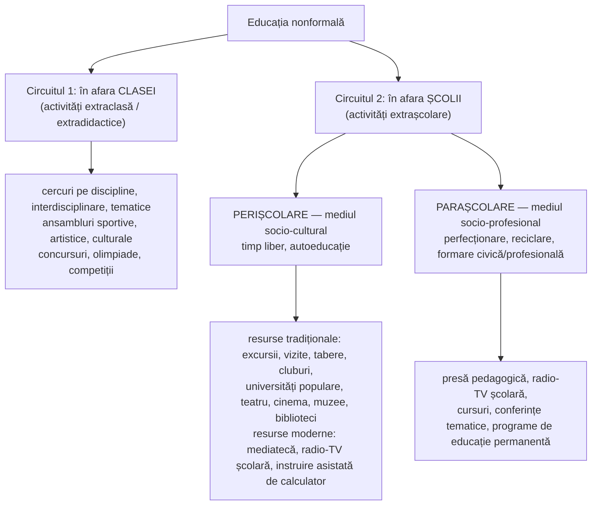

↑ [[Modulul 03 - Formele generale ale educației]] · ← [[3.2 Educația formală]] · → [[3.4 Educația informală]]

> [!abstract] Pe scurt
> - **Educația nonformală** cuprinde activitățile educative **organizate, intenționate, instituționalizate**, dar **în afara sistemului școlar** (sau la marginea lui: cercuri, cluburi, tabere). Este o **punte** între cunoștințele de la lecții și cele acumulate informal.
> - Trăsături: **flexibilitate, caracter opțional, centrare pe cel care învață**, curriculum „la alegere”, **evaluare facultativă, stimulativă, fără note**. Educatorul e **animator/moderator**.
> - Relația cu educația formală: **complementaritate** (conținut, forme, modalități).
> - **Riscuri**: programe prea flexibile, activism de suprafață, dependență de mijloacele tehnice, recunoaștere socială incertă a rezultatelor → tema **validării**.

---

# PARTEA I — Ce spune manualul

## 1. Etimologie și sens (p. 85)

- Lat. ***nonformalis*** = „în afara formelor special sau oficial organizate”.
- **Nonformal nu înseamnă needucativ**: e o realitate educațională **mai puțin formalizată**, dar **întotdeauna cu efecte formative**.

## 2. Istoria termenului și definiții (p. 85–86)

- După **R. Mijaică**, termenul a apărut la **începutul sec. XX în Germania**, odată cu mișcarea de tineret **Wandervogel** („păsările călătoare”) — reacție la caracterul **livresc** al școlii: drumeții, cunoașterea naturii și a țării.
- **Coombs, Prosser și Ahmed**: orice activitate educațională **organizată în afara sistemului formal** (separat sau ca parte a unei activități mai largi), menită să răspundă **nevoilor educaționale ale unui grup**, cu **obiective de învățare clare**.
- **C. Cucoș**: realitate mai puțin formalizată, cu efecte formative. Acțiunile sunt **foarte flexibile**, răspund intereselor **individuale** ale elevilor. Cuprinde influențele din **afara clasei** sau prin activități **opționale/facultative**:
  - cercuri, concursuri, olimpiade;
  - inițiate de școală, organizații de copii și tineret, organizații de părinți, organizații confesionale;
  - coordonate tot de **specialiști**, care își joacă rolul **„mai discret”** — **animatori, modelatori**;
  - emisiuni radio-TV, reviste și ziare **special concepute pentru elevi** de pedagogi.

> [!quote] Definiția de reținut (p. 86, după G. Văideanu)
> Educația nonformală cuprinde ansamblul activităților și acțiunilor care se desfășoară **într-un cadru instituționalizat, în mod organizat, dar în afara sistemului școlar**, constituindu-se ca **„o punte între cunoștințele asimilate la lecții și informațiile acumulate informal”**.

## 3. Funcționare (p. 86)

- Condusă de **profesori sau însoțitori** care supraveghează și dirijează activitatea.
- **Atractivă**: nu se ține evidență strictă, participanții **aleg** activitatea, au mai multe ocazii să se afirme.
- Poate fi orientată științific de **teoria pedagogică**; se poate **îmbina cu educația formală** pentru dezvoltarea integrală a personalității.

## 4. Deziderate / finalități (p. 86–87)

1. **lărgirea și completarea orizontului cultural**;
2. condiții pentru **desăvârșirea profesională** sau **inițierea într-o activitate nouă**;
3. sprijinirea **alfabetizării grupurilor defavorizate**;
4. **recreere, destindere**, petrecerea organizată a timpului liber;
5. cadru de exersare a **înclinațiilor, aptitudinilor, talentelor**.

Raportul cu educația formală: **complementaritate** — de conținut, de forme și de modalități de realizare.

## 5. Activitățile extracurriculare (p. 87–88)

- **L. Sadovei**: deși termenul e controversat, activitățile **extracurriculare** sunt tratate ca parte a educației nonformale. Conceptul e folosit mai ales **procedural** de manageri („activități în afara clasei”). Se desfășoară **în afara**, dar și **în interiorul** sistemului, prin „organisme școlare conexe” (**extradidactice, extrașcolare**).
- Literatura despre activitățile extracurriculare vine mai ales din **SUA** și studiază **impactul** asupra elevilor. Caracteristici (după D. Ionescu, R. Popescu):
  - a) **sursa**: organizate de școală, în incinta ei (Feldman & Matjasko, 2005);
  - b) **rol complementar** școlii, puternic formalizate — experiențe care susțin **dezvoltarea de ansamblu** (Holland & Andre, 1987);
  - c) depind de un **context mai larg**: sistemul **școală – familie – comunitate**;
  - d) oferă spațiu de **explorare a identității** și dezvoltă **capitalul social** al tinerilor.

## 6. Tipologia activităților nonformale (p. 88, 101–102)

> [!tip] De reținut
> **Perișcolar** = timp liber și cultură (mass-media e numită adesea „**școală paralelă**”). **Parașcolar** = mediul profesional (reciclare, perfecționare).

## 7. Educatorul nonformal (p. 88)

- Își joacă rolul **discret**: **animator, moderator**.
- I se cer **flexibilitate, entuziasm, adaptabilitate** și rapiditate în schimbarea **stilului de conducere** după nevoile celui educat.
- Educația nonformală realizează corelația educator–educat la niveluri de **flexibilitate complementare** resurselor formale, sub îndrumarea unor cadre specializate în proiectarea acțiunilor educaționale (după S. Cristea).

## 8. Conținut, organizare, evaluare (p. 89, 102)

| Aspect | Specific nonformal |
|---|---|
| **Proiectare** | documente speciale, **neformalizate**, foarte flexibile; programe deschise spre **interdisciplinaritate** și **educație permanentă** |
| **Diferențiere** | după vârstă, sex, categorie socioprofesională, interese, aptitudini |
| **Organizare** | **facultativă**, după opțiunile elevilor și ale comunităților; deschisă spre **experiment și inovație** |
| **Ambianță** | relaxată, plăcută; metodologie **atractivă**. Uneori cu **taxe** (formare profesională) |
| **Evaluare** | **facultativă, neformalizată**, cu accente psihologice, **stimulativă, fără note sau calificative oficiale**. Uneori se încheie cu **certificate sau diplome** |

## 9. Avantaje pedagogice (p. 89–90)

1. **centrată pe cel care învață** și pe procesul de învățare, nu pe predare;
2. **„demitizează funcția de predare”** și răspunde nevoilor concrete de acțiune (Cucoș);
3. **curriculum la alegere** („*cafeteria curriculum*”), flexibil și variat;
4. lărgește cultura generală și de specialitate: **reciclare, completarea studiilor, sprijin pentru defavorizați, exersare pentru supradotați**;
5. **timp liber organizat**, destindere, echilibru psihofizic;
6. **actualizare rapidă** a informațiilor, aplicabilitate imediată;
7. folosește **noile tehnologii** (internet, TV, calculatoare);
8. **nestresantă**: apreciere **formativă, stimulativă, continuă**.

## 10. Limite și riscuri (p. 90)

**Limite** (literatura de specialitate): programe **prea flexibile**, obiective doar **pe termen scurt**, **„libertate” metodologică excesivă** a educatorilor.

**Riscuri pedagogice majore** (S. Cristea, 2003):
1. **activism de suprafață**, dependent doar de obiective concrete, rupte de obiectivele educației formale;
2. proiecte dependente doar de **mijloacele tehnice** disponibile → dezechilibrarea relației subiect–obiect al educației;
3. problema **validării sociale reale** a rezultatelor, comparativ cu diplomele și certificatele formale.

## 11. Obiective „de vocație” și obiective specifice (p. 102–103)

**Două coordonate funcționale** („obiective generale de vocație”):
- sprijinirea elevilor și adulților cu **șanse reduse de acces la o școlaritate normală**;
- stimularea **dezvoltării socioeconomice și culturale** a persoanei și a **comunităților locale**.

**Obiective specifice**: dezvoltarea unor sectoare socioeconomice · valorificarea **resurselor locale** · **alfabetizarea funcțională** (mai ales a grupurilor defavorizate) · formarea și perfecționarea profesională · educația pentru o existență sănătoasă moral-intelectual-tehnologic-estetic-fizic.

**Prin „noile mass-media”** (presă, radio-TV, rețele video și de calculatoare):
- ridicarea nivelului educației prin **difuzarea programelor în școli izolate** sau cu cadre necorespunzătoare;
- creșterea pregătirii **cadrelor didactice** prin modele pedagogice exemplare;
- **programe universitare prin televiziune**;
- completarea cunoștințelor în domenii cu informație care se schimbă rapid (limbi străine, științe socioumane, matematică, biologie);
- **alfabetizare funcțională** și (re)calificare profesională continuă.

## 12. Tendința de expansiune (p. 90–91)

- Expansiunea nonformalului a devenit o **tendință generală a politicilor educaționale** în perspectiva educației permanente, pe fondul **„crizei mondiale a educației”** (Coombs, prin G. Văideanu).
- Poate oferi **soluții pentru „criza școlii”**. Se discută tot mai mult despre **acreditarea** activităților nonformale.

---

# PARTEA II — Completări

## 13. Mișcarea Wandervogel — precizări

- Grup inițiat în **1896** la **Berlin-Steglitz** (Hermann Hoffmann-Fölkersamb), organizat oficial în **1901** (Karl Fischer). A marcat **mișcarea germană de tineret** (*Jugendbewegung*).
- Alte rădăcini ale nonformalului: **universitățile populare** (Grundtvig, Danemarca, sec. XIX); **cercetășia** (Robert Baden-Powell, *Scouting for Boys*, 1908); **extensia universitară** și societățile culturale. În spațiul românesc: **ASTRA** (1861), **Ateneele populare**, școlile țărănești ale **Fundației Culturale Regale** și mișcarea lui **Spiru Haret** (cercuri culturale sătești, începutul sec. XX).

## 14. Educația nonformală în Codul Educației al R. Moldova

- **Art. 3**: acțiuni instructive proiectate și realizate într-un **cadru instituționalizat extrașcolar**, **punte** între lecții și educația informală.
- **Art. 123 (7)**: învățare integrată în **activități planificate**, cu **obiective de învățare**, **fără a urma explicit un curriculum**.
- **Art. 123 (9)**: depinde de **intenția celui care învață**; **nu duce automat la certificare**.
- **Art. 123 (10)**: certificarea se face de **structuri abilitate**, după un regulament al Ministerului Educației.
- **Art. 124 (2)** — unde se realizează: instituțiile de învățământ, **instituții extrașcolare**, centre de îngrijire și protecție a copilului, **întreprinderi**, **instituții culturale**, asociații profesionale, culturale, sindicale, **ONG-uri**, alte organizații.
- **Validarea în prezent** (după pagina Ministerului Educației și Cercetării): **Regulamentul privind certificarea competențelor profesionale** obținute în contexte nonformale și informale, aprobat prin **Ordinul nr. 885 din 01.09.2022**, pentru calificări de **nivelurile 3, 4, 5** din Cadrul Național al Calificărilor, prin **centre de validare** sectoriale (construcții, IT, transport, energie, agricultură, sănătate, arte, economie etc.).

> [!note] Comentariu
> În 2014 manualul semnala **lipsa cadrului de validare** (§3.6). Între timp problema a primit un **răspuns normativ** (2022). Riscul semnalat de S. Cristea — validarea socială incertă — este astfel parțial rezolvat, dar **doar pentru competențele profesionale**, nu și pentru cele civice, culturale sau personale.

## 15. Educația nonformală în politicile europene de tineret

- **Consiliul Europei** și **Uniunea Europeană** au făcut din educația nonformală **metodologia de bază a lucrului cu tinerii** (*youth work*).
- **Principii** larg acceptate (sinteză după documentele Consiliului Europei privind lucrul cu tinerii, de ex. manualul *Compass*, 2002):
  - **participare voluntară**;
  - **centrare pe cel care învață** și pe nevoile lui;
  - **învățare experiențială** („prin a face”, cu reflecție);
  - **abordare holistică** (cognitiv, afectiv, practic);
  - **participativă și democratică**; relație **egalitară** între facilitator și participanți;
  - bazată pe **valori**: drepturile omului, incluziune, cetățenie activă.
- **Instrumente de recunoaștere**: **Youthpass** (în programele *Tineret în acțiune* / *Erasmus+*, din 2007); **Europass**; **Recomandarea Consiliului UE privind validarea** (2012).

## 16. Fundamente teoretice ale metodologiei nonformale

| Teorie | Autor | Aplicație în nonformal |
|---|---|---|
| **Învățarea experiențială** — ciclul: experiență concretă → observare reflexivă → conceptualizare abstractă → experimentare activă | **David Kolb**, *Experiential Learning* (1984), după Dewey și Lewin | structura tipică a unui atelier: activitate → *debriefing* → concluzii → transfer |
| **Learning by doing**; educația ca experiență | **John Dewey** (1938) | proiecte, excursii, cluburi |
| **Pedagogia conscientizării**; educație populară | **Paulo Freire** | educația adulților, alfabetizare, dezvoltare comunitară |
| **Andragogia** | **Malcolm Knowles** | programe pentru adulți, motivație internă, orientare spre probleme |
| **Nonformal ca spectru** — de la „școlarizare flexibilă” la „educație participativă” | **Alan Rogers** (2004) | nonformalul poate fi o copie ieftină a școlii **sau** o educație cu adevărat participativă |
| **Învățarea situată**, comunitățile de practică | **J. Lave & E. Wenger** (1991) | cluburi, echipe, asociații profesionale ca spații de învățare |

## 17. Comentariu critic

- Manualul oferă o descriere **bogată**, dar **împrăștiată**: informația despre nonformal apare în **§3.3 și în §3.5** (p. 101–103), cu repetiții (definiția-punte apare de trei ori).
- **Terminologie instabilă**: *extraclasă / extradidactic / extracurricular / extrașcolar / perișcolar / parașcolar*. Propunere de sistematizare:
  - **extraclasă = extradidactic** (în școală, în afara lecției);
  - **extrașcolar** (în afara școlii), cu subtipurile **perișcolar** (timp liber/cultură) și **parașcolar** (profesional).
  - „**Extracurricular**” e un termen **ambiguu**: în perspectiva curriculumului larg (tot ce oferă școala), multe activități „extracurriculare” sunt de fapt **parte a curriculumului** (curriculum la decizia școlii, activități opționale).
- Exemplele de mass-media (TV școlară, rețele video) sunt **datate**. Azi nonformalul digital include **MOOC-uri** (Coursera, edX), platforme (Khan Academy, Duolingo), **bootcamp-uri**, **microcredențiale** — iar granița cu formalul se estompează (microcredențialele pot fi acreditate).
- Riscul „**activismului de suprafață**” (Cristea) rămâne actual: activități spectaculoase, dar fără obiective clare și fără reflecție.

## 18. Întrebări de autoverificare

1. Definiți educația nonformală. De ce e numită „punte”?
2. Care e originea istorică a termenului? Cine l-a impus în politicile educaționale?
3. Distingeți activitățile extraclasă, perișcolare și parașcolare, cu câte două exemple.
4. Enumerați cinci avantaje și trei riscuri ale educației nonformale.
5. Ce rol are educatorul nonformal și ce stil de conducere i se potrivește?
6. Cum se evaluează activitățile nonformale? Cum pot fi recunoscute rezultatele lor în R. Moldova azi?
7. Elaborați un plan de activități nonformale pentru colegii de grupă (tema de reflecție din manual) și precizați competențele vizate.

## Surse
- Manual, p. 85–91, 101–103; Cucoș, C. (2014). *Pedagogie*; Cristea, S. (2002/2003); Văideanu, G. (1988). *Educația la frontiera dintre milenii*; Sadovei, L. (2014); Mijaică, R. D. (2014).
- Coombs, P. H., Prosser, R. C., Ahmed, M. (1973). *New Paths to Learning for Rural Children and Youth*. New York: ICED.
- Rogers, A. (2004). *Non-Formal Education: Flexible Schooling or Participatory Education?* Hong Kong: CERC / Kluwer.
- Kolb, D. A. (1984). *Experiential Learning*. Englewood Cliffs: Prentice Hall.
- Lave, J., Wenger, E. (1991). *Situated Learning: Legitimate Peripheral Participation*. Cambridge University Press.
- Council of Europe (2002). *Compass: Manual on Human Rights Education with Young People*. Strasbourg.
- Consiliul UE (2012). *Recomandarea privind validarea învățării non-formale și informale*.
- Codul Educației al Republicii Moldova nr. 152/2014, art. 3, 123, 124.
- [MEC — Validarea educației nonformale și informale](https://mec.gov.md/ro/content/validarea-educatiei-nonformale-si-informale-1)
