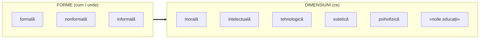
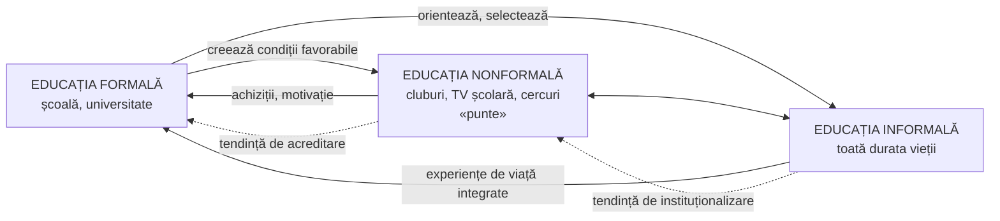

↑ [[Modulul 03 - Formele generale ale educației]] · ← [[3.4 Educația informală]] · → [[3.6 Educația permanentă și autoeducația]]

> [!abstract] Pe scurt
> - Educația formală, nonformală și informală sunt **interdependente** și **complementare**. Toate contribuie la formarea personalității, fiecare cu mijloace proprii.
> - **Educația formală** are **„rolul dirijor”** (I. Bontaș): oferă pregătirea de bază organizată și sistematică și le orientează pe celelalte. **Nu poate fi înlocuită.**
> - Relația e dinamică: școala se **deschide** spre experiențele nonformale și informale, iar nonformalul tinde să fie **acreditat**, informalul să fie **instituționalizat**.
> - Interpretări: **clasică** (primatul formalului), **modernă** (priorități preluate de nonformal), **postmodernă** (acreditarea nonformalului, instituționalizarea informalului).
> - Matricea **Mocker & Spear (1982)**: formele se deosebesc prin **cine controlează scopurile și mijloacele** învățării; a patra celulă este **autoinstruirea**.

---

# PARTEA I — Ce spune manualul

## 1. Interdependența formelor (p. 95)

- Între cele trei forme există o **interdependență evidentă**. Fiecare influențează omul **în felul său**; **comun** tuturor este că **formează personalitatea**.
- **Educația formală** este **cea mai importantă**, cu **„rol dirijor”** (după **Ioan Bontaș**):
  - legătura dintre forme trebuie **dirijată** de educația formală, pentru a evita **supraîncărcarea** cu informații;
  - superioritatea ei: oferă **pregătirea de bază** a tineretului în mod **organizat, programat, sistematic**.
- **Nonformalul** nu este needucativ — e o realitate mai puțin formalizată, dar cu efecte educative.
- **Informalul**, liber de orice formalizare, **completează tabloul**. Cele trei forme **se articulează și se întrepătrund** în lumina **finalităților educației**.

## 2. Limitele informalului ca bază a educației (p. 95–96)

- Informalul = **întreaga achiziție autonomă** a persoanei, dobândită întâmplător din experiențe de viață.
- Mijloacele lui (mass-media, internet, casete audio-video) transmit atractiv un conținut bogat, dar **dispersat, insuficient corelat, discontinuu**, cu efecte **necontrolabile** → **nu poate fi baza fundamentală** a educației.

> [!example] Exemplul manualului
> Poate cineva **învăța temeinic să citească și să scrie de la televizor**? — argument pentru necesitatea educației formale.

- **Avantaj** al informalului: stimulează **permanent și liber** nevoia de cunoaștere, fără responsabilități și standarde impuse.
- Informalul e determinat de **valorile și preocupările comunității** și de **aspirațiile și valorile proprii** ale persoanei.
- Informațiile din mediu pot **contrazice** educația formală → educatul trebuie să **selecteze, aleagă, cenzureze, reevalueze**.
- **Concluzia autoarelor**: influența nonformalului și a informalului crește, dar **nu vor putea niciodată înlocui educația formală**. Școala rămâne **instituția de bază** a instruirii și educației.

## 3. Formele și dimensiunile educației (p. 96)

Formele educației permit realizarea **conținuturilor generale** (dimensiunilor) ale educației — **morală, intelectuală, tehnologică, estetică, psihofizică** —, îmbogățite de toate disciplinele și de **„noile educații”** (ecologică, pentru democrație, sanitară, pentru schimbare și dezvoltare, pentru pace etc.).

→ [[Modulul 06 - Dimensiunile generale ale educației]] · [[Modulul 07 - Noile educații]]

## 4. Argumente pentru integrarea celor trei forme (C. Cucoș) (p. 97)

Integrarea formelor aduce:
1. capacitatea de a răspunde la **situații și nevoi complexe**;
2. conștientizarea unor **situații cu totul noi**;
3. o mai bună conștientizare a **nevoilor individuale și colective**;
4. **sensibilitate** la situațiile de blocaj care cer abordări noi;
5. **ameliorarea formării formatorilor**;
6. **facilitarea autonomizării** celor formați.

## 5. Ce asigură formalul și nonformalul împreună (p. 97)

Formalul și nonformalul se desfășoară **în cadru instituționalizat, structurat, organizat pedagogic** și se deosebesc prin **formele de realizare**. Informalul, **cu ponderea cea mai mare în timp și spațiu**, **nu poate susține singur** formarea personalității. Formalul și nonformalul asigură:

1. însușirea **cunoștințelor științifice** și a **valorilor culturii** naționale și universale;
2. formarea **capacităților intelectuale**, a **disponibilităților afective** și a **abilităților practice**;
3. asimilarea **tehnicilor de muncă intelectuală**, necesare **instruirii și autoinstruirii pe durata întregii vieți** (→ [[3.6 Educația permanentă și autoeducația]]);
4. **profesionalizarea** tinerei generații.

## 6. Modelul relației: complementaritate cu deschidere reciprocă (p. 98)

Relația (Figura 4 din manual) este de **complementaritate**, cu **deschidere în ambele sensuri**:
- **dinspre formal** spre integrarea informațiilor și experiențelor dobândite nonformal și informal;
- **dinspre informal**: tendința de **instituționalizare** a influențelor informale.

- Nonformalul se desfășoară **în afara școlii**, dar și **în școală** (cluburi, televiziune școlară) — o **punte** între formal și informal. Informalul **se extinde pe toată durata vieții**.
- În societatea modernă și postmodernă, **mass-media** atinge proporții **greu controlabile pedagogic**. În contextul **supraîncărcării informaționale**, profesorul, **împreună cu elevul/studentul**, coordonează **echilibrul dintre formativ, nonformativ și informativ**.
- **Formalul** asigură condiții pentru nonformal și informal. Acestea îi oferă formalului **achiziții** utile activității școlare și **integrează experiențele trăite**.

## 7. Trei interpretări ale relației (p. 99)

| Interpretare | Poziție |
|---|---|
| **Clasică** | educației **formale** i se acordă **rolul prioritar** în formarea personalității |
| **Modernă** (S. Cristea) | unele **priorități pot fi preluate de nonformal**: oferă un **câmp motivațional mai larg și mai deschis** și receptează rapid influențele informale, altfel greu de controlat |
| **Postmodernă** | tendința de **acreditare a nonformalului** și chiar de **instituționalizare a informalului** |

- **Toate cele trei forme oferă oportunități de învățare.** **Cel mai eficient profesor** este cel care permite și sprijină învățarea **la intersecția** formalului, nonformalului și informalului.

## 8. Stilurile educatorului (p. 99)

- Educatorul trebuie să fie **flexibil** și să schimbe **stilul de conducere** după situație:

| Situație | Stil potrivit |
|---|---|
| **Formală** | **directiv** |
| **Nonformală și informală** | **democratic** și **nondirectiv** (*laissez-faire*) |

- **Problemă frecventă**: mulți profesori sunt **eficienți la clasă**, dar **mai puțin eficienți ca educatori nonformali**, pentru că folosesc **stilul directiv** și **metodele formale** în ambele situații.

## 9. Matricea Mocker și Spear (1982) (p. 99–100)

În perspectiva **educației permanente**, cele trei tipuri de învățare trebuie corelate și cu **autoinstruirea**. Criteriul: **cine decide asupra finalităților** (ce se învață) și **asupra mijloacelor** (cum se învață).

| | **Instituția controlează mijloacele** | **Individul controlează mijloacele** |
|---|---|---|
| **Instituția controlează scopurile** | **Învățare FORMALĂ** | **Învățare INFORMALĂ**\* |
| **Individul controlează scopurile** | **Învățare NONFORMALĂ** | **AUTOINSTRUIRE** (învățare autodirijată) |

\* Formularea manualului pentru informal: individul poate decide **cum** are loc (ce ascultă, ce citește, unde merge, cu cine se întâlnește), dar **controlează mai puțin rezultatele**.

- **Formală**: instituția controlează și scopurile, și organizarea.
- **Nonformală**: educatul controlează **scopurile** (alege să participe), dar **nu** metodele și mijloacele (programul e organizat de instituție).
- **Informală**: individul decide **modul**, dar controlează puțin **rezultatele**.
- **Autoinstruire**: educatul controlează **ambele variabile**.

> [!tip] De reținut
> Matricea arată că **autonomia crește** de la formal la autoinstruire. De aceea [[3.6 Educația permanentă și autoeducația|educația permanentă]] urmărește **trecerea de la instruire la autoinstruire**.

## 10. Recapitulare a caracteristicilor formalului și nonformalului (p. 100–103)

Paginile 100–103 **reiau și detaliază** educația formală (definiție, obiective generale, coordonate funcționale) și nonformală (cele două circuite pedagogice, note specifice, obiective „de vocație”, rolul „noilor mass-media”). Conținutul este conspectat în:
- [[3.2 Educația formală#5. Obiective generale (p. 83–84; reluate la p. 100–101, după S. Cristea)|3.2 Educația formală — obiective și coordonate funcționale]]
- [[3.3 Educația nonformală#6. Tipologia activităților nonformale (p. 88, 101–102)|3.3 Educația nonformală — circuite, note specifice, obiective]]

---

# PARTEA II — Completări

## 11. Matricea Mocker & Spear — sursa și semnificația

- **Donald W. Mocker & George E. Spear**, *Lifelong Learning: Formal, Nonformal, Informal, and Self-Directed* (ERIC Clearinghouse on Adult, Career, and Vocational Education, Information Series nr. 241, **1982**).
- Contribuția: au înlocuit criteriul **locului** (școală / în afara școlii) cu criteriul **controlului** asupra **obiectivelor** și **mijloacelor**. Astfel **învățarea autodirijată** apare ca **a patra formă**, egală ca statut cu celelalte.

> [!warning] Observație asupra redării din manual
> Pentru informal, manualul spune că individul controlează mijloacele, dar puțin **rezultatele**. La Mocker & Spear variabila este **obiectivele**, nu rezultatele: cel care învață controlează **mijloacele**, dar **nu obiectivele**, fixate de ce oferă mediul (ex.: înveți din ce se întâmplă la locul de muncă). Rezultatele nu sunt controlate deplin în **niciuna** dintre forme, deci nu pot fi un criteriu distinctiv. Reține **logica celor două variabile — obiective și mijloace**.

## 12. Alte modele ale relației dintre forme

| Model | Autor | Ideea centrală |
|---|---|---|
| **Perspectiva holistă** | **Thomas J. La Belle** (1982) | fiecare formă are **„moduri”** și **„caracteristici”** ale celorlalte. Ex.: în școală există învățare informală (pauze, curriculum ascuns), iar un club poate avea trăsături formale (reguli, diplome). Rezultă o **matrice 3×3**, nu trei categorii separate |
| **Continuumul formalității** | **H. Colley, P. Hodkinson, J. Malcolm** (2003) | orice situație de învățare are **atribute de formalitate/informalitate** pe patru dimensiuni: **proces, locație/cadru, scopuri, conținut**. Nu există învățare „pur” formală sau informală |
| **Spectrul nonformal** | **Alan Rogers** (2004) | continuum de la **formal** (standardizat) prin **nonformal** (flexibil, contextualizat, participativ) la **informal** (necontrolat). Nonformalul poate aluneca spre „școlarizare flexibilă” sau spre „educație participativă” |
| **Învățare *lifelong* și *lifewide*** | **Comisia Europeană**, Memorandumul privind învățarea pe tot parcursul vieții (2000) | formele se combină pe **axa timpului** (lifelong) și pe **axa contextelor** (lifewide) |
| **Modelul ecologic** | **U. Bronfenbrenner** (1979) | **mezosistemul** — relațiile dintre microsisteme (familie–școală–grup de egali) — e decisiv pentru dezvoltare. Coerența sau conflictul dintre forme influențează direct copilul |
| **Parteneriatul școală–familie–comunitate** | **J. L. Epstein** (1995) | **șase tipuri de implicare**: parenting, comunicare, voluntariat, învățare acasă, participare la decizii, colaborare cu comunitatea — o operaționalizare practică a legăturii formal–informal |

## 13. Curriculumul ascuns — formalul conține informal

- **Ph. W. Jackson** (*Life in Classrooms*, 1968) și, critic, **S. Bowles & H. Gintis** (1976): școala transmite **implicit** norme și atitudini, prin **organizare**, nu prin **conținut**.
- **Consecință pentru 3.5**: „rolul dirijor” al formalului nu privește doar **dirijarea** influențelor externe, ci și **conștientizarea** propriilor influențe informale.

## 14. Stilurile de conducere — precizări

- Tipologia **autoritar / democratic / laissez-faire** vine din experimentele lui **Kurt Lewin, Ronald Lippitt și Ralph White** (1939) cu grupuri de copii: stilul **democratic** a produs cel mai bun climat și cea mai mare autonomie; *laissez-faire* a produs dezorganizare.

> [!warning] Confuzie terminologică în manual
> Manualul pune semn de egalitate între **nondirectiv** și **laissez-faire**. Nu sunt echivalente:
> - ***laissez-faire*** (Lewin) = **absența conducerii** — liderul nu intervine; rezultatele sunt de regulă slabe;
> - **nondirectivitatea** (**Carl Rogers**, *Client-Centered Therapy*, 1951; *Freedom to Learn*, 1969) = **o metodă activă și exigentă**: facilitatorul creează intenționat un climat de acceptare, empatie și autenticitate, în care cel care învață își asumă direcția.
> Pentru nonformal se potrivesc **stilul democratic** și **facilitarea nondirectivă**, nu *laissez-faire*-ul.

- Pentru adaptarea stilului la **gradul de autonomie** al celui care învață, vezi **modelul lui Gerald Grow** (1991) în [[3.6 Educația permanentă și autoeducația#10.4 Modelul lui Grow — util pentru profesor]].

## 15. Relația dintre forme în Codul Educației al R. Moldova

- **Art. 123 (5)**: învățarea pe tot parcursul vieții se realizează **în contexte de educație formală, nonformală și informală**.
- **Art. 123 (10)** și **art. 124 (3)**: învățarea nonformală și informală **poate conduce la competențe și calificări**, certificate de structuri abilitate. Aceasta e **„tendința postmodernă” de acreditare** descrisă de manual, devenită normă legală.

## 16. Comentariu critic

> [!warning] Probleme ale subcapitolului
> 1. **Tensiune internă**: manualul afirmă atât că formalul **nu va putea fi niciodată înlocuit** și are **rol dirijor** (interpretarea clasică), cât și că interpretările moderne și postmoderne mută prioritățile spre nonformal și informal. Autoarele **nu își precizează poziția** între cele trei interpretări. Soluția implicită pare **complementaritatea sub coordonarea școlii**.
> 2. **Trimitere bibliografică greșită**: argumentele pentru integrare sunt atribuite lui C. Cucoș cu trimiterea [7], dar în bibliografia modulului [7] este Matthews, Deary & Whiteman, *Psihologia personalității*. Cucoș este [3].
> 3. **Repetiții masive**: p. 100–103 reiau aproape integral informații despre formal și nonformal din §3.2 și §3.3.
> 4. **Exemple datate**: „casetele audio-video” (p. 96). Argumentul „nu poți învăța să citești de la televizor” se nuanțează azi (aplicațiile educaționale pentru citit-scris), deși **concluzia** — necesitatea unei educații sistematice și ghidate — rămâne valabilă.
> 5. **Simplificare**: formele sunt tratate ca **categorii distincte**. Cercetarea actuală (La Belle, Colley et al.) le vede ca **dimensiuni** prezente simultan în orice situație educativă.

## 17. Sinteză — tabel comparativ al celor trei forme

| Criteriu | Formală | Nonformală | Informală |
|---|---|---|---|
| **Intenționalitate** | explicită, maximă | explicită | absentă / difuză |
| **Cadru** | sistemul de învățământ | instituționalizat, în afara (sau la marginea) școlii | viața cotidiană |
| **Agenți** | cadre didactice specializate | profesori-animatori, formatori, lucrători de tineret | familie, prieteni, colegi, mass-media, comunitate |
| **Proiectare** | curriculum oficial (planuri, programe, manuale) | programe flexibile, opționale | inexistentă |
| **Participare** | obligatorie (până la un nivel) | voluntară | implicită |
| **Evaluare** | riguroasă: note, examene, diplome | facultativă, stimulativă; uneori certificate | socială, prin comportament și opinie |
| **Control** (Mocker & Spear) | instituția: scopuri + mijloace | individul: scopuri; instituția: mijloace | individul: mijloace; mediul: scopuri |
| **Avantaj major** | sistematicitate, bază solidă | flexibilitate, motivație, actualitate | acces liber, pondere uriașă, legătură cu viața |
| **Limită majoră** | rigiditate, formalism | superficialitate, validare incertă | caracter necontrolat, efecte negative posibile |
| **Stil al educatorului** | directiv → democratic | democratic, facilitator | model, conversație |
| **Rol în relație** | **dirijor**, fundament | **punte** | **context** permanent |
| **Codul Educației RM** | art. 3; 123(6); 124(1) | art. 3; 123(7),(9),(10); 124(2) | art. 3; 123(8),(9); 124(3) |

## 18. Întrebări de autoverificare

1. Ce înseamnă „rolul dirijor” al educației formale? Cine a formulat ideea?
2. De ce educația informală nu poate constitui baza educației? Dați un exemplu propriu.
3. Enumerați argumentele lui C. Cucoș pentru integrarea celor trei forme.
4. Comparați interpretările clasică, modernă și postmodernă ale relației dintre forme.
5. Explicați matricea Mocker & Spear și locul autoinstruirii în ea.
6. Ce stil de conducere se potrivește fiecărei forme? De ce *laissez-faire* ≠ nondirectivitate?
7. Dați exemple concrete de interdependență formal–nonformal–informal (tema de reflecție a manualului).
8. Cum ar putea fi combătut **traficul de ființe umane** prin fiecare formă a educației? (tema de reflecție a manualului)
   - *Sugestie*: **formal** — lecții de dezvoltare personală/educație civică despre drepturi și riscurile migrației ilegale; **nonformal** — ateliere ONG, teatru-forum, campanii în tabere; **informal** — discuții în familie, mesaje media, exemplul comunității, rețele de sprijin.

## Surse
- Manual, p. 95–103; Bontaș, I. *Pedagogie*; Cucoș, C. (2014). *Pedagogie*. Iași: Polirom; Cristea, S. (2002).
- Mocker, D. W., Spear, G. E. (1982). *Lifelong Learning: Formal, Nonformal, Informal, and Self-Directed*. Information Series No. 241. Columbus: ERIC Clearinghouse on Adult, Career, and Vocational Education.
- La Belle, T. J. (1982). Formal, nonformal and informal education: A holistic perspective on lifelong learning. *International Review of Education*, 28(2), 159–175.
- Colley, H., Hodkinson, P., Malcolm, J. (2003). *Informality and Formality in Learning*. London: LSRC.
- Rogers, A. (2004). *Non-Formal Education: Flexible Schooling or Participatory Education?* Hong Kong: CERC / Kluwer.
- Lewin, K., Lippitt, R., White, R. K. (1939). Patterns of aggressive behavior in experimentally created „social climates”. *Journal of Social Psychology*, 10, 271–299.
- Rogers, C. R. (1969). *Freedom to Learn*. Columbus: Merrill.
- Bronfenbrenner, U. (1979). *The Ecology of Human Development*. Harvard University Press.
- Epstein, J. L. (1995). School/family/community partnerships: Caring for the children we share. *Phi Delta Kappan*, 76(9), 701–712.
- Jackson, P. W. (1968). *Life in Classrooms*; Bowles, S., Gintis, H. (1976). *Schooling in Capitalist America*.
- Comisia Europeană (2000). *Memorandum on Lifelong Learning*. SEC(2000) 1832.
- Codul Educației al Republicii Moldova nr. 152/2014, art. 3, 123, 124.
