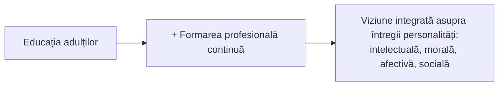
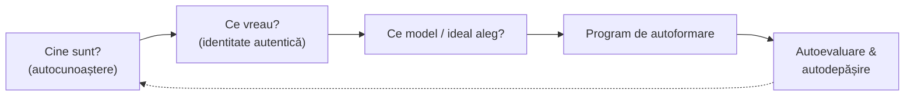
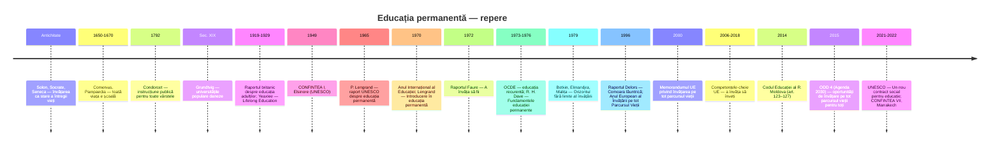
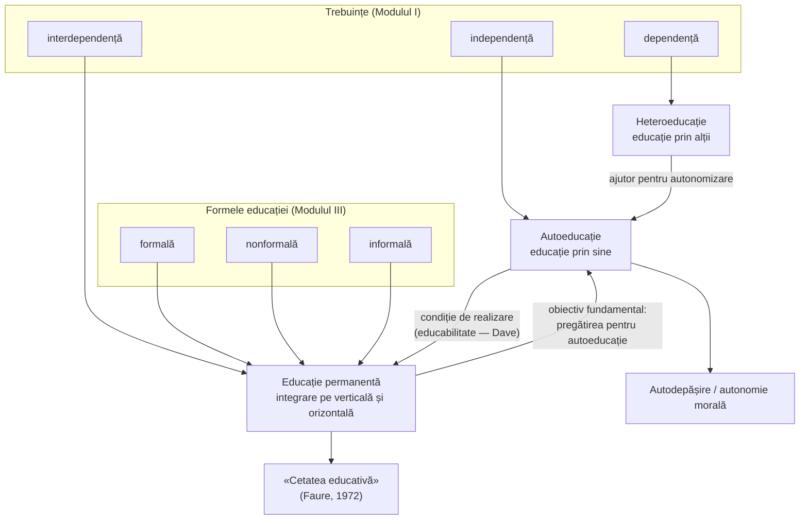

↑ [[Modulul 03 - Formele generale ale educației]] · ← [[3.5 Relația dintre formele educației]] · → [[4.1 Conceptul de finalitate educațională]] · Legat de: [[Modulul 01 - Statutul științelor educației]] (principiul corelației), [[Modulul 09 - Agenții educației și factorii dezvoltării]] · Aprofundare: [[Autoeducația - teorii, autori și corelări]]

> [!abstract] Pe scurt
> - **Educația permanentă** = direcție de evoluție a educației care **integrează** toate formele (formală, nonformală, informală) și toate dimensiunile educației, **pe tot parcursul vieții** (axa verticală) și **în toate contextele** vieții (axa orizontală). La nivel de politică educațională devine un **principiu organizator** al sistemelor de învățământ.
> - **Autoeducația** = activitate conștientă, sistematică și voluntară prin care persoana **devine subiect al propriei formări**, pornind de la un **ideal/model de viață** asumat, prin autocunoaștere, program de lucru cu sine și autoevaluare.
> - Relația: autoeducația este **premisă și, totodată, rezultat** al educației permanente. Scopul ultim al educației permanente = **pregătirea omului pentru autoeducație**.
> - Formula de reținut: *heteroeducație → autoeducație → educație permanentă* corespund trebuințelor de *dependență → independență → interdependență*.

---

## Cuprinsul notei

- **Partea I — Ce spune manualul** (conspectul sursei)
- **Partea II — Completări**: terminologie, istoria conceptelor, autori și cercetători, modele teoretice, cadrul european și moldovenesc
- **Partea III — Comentarii critice și sinteză**
- Întrebări de autoverificare · Bibliografie

---

# PARTEA I — Ce spune manualul

## 1. Locul temei în manual

Tema apare în **trei ipostaze**, ceea ce arată că manualul o tratează ca pe o idee transversală:

| Unde | Ipostaza | p. |
|---|---|---|
| Modulul I, §1.3 | **Principiu** general al educației: corelația educație – autoeducație – educație permanentă | 36–37 |
| Modulul III, §3.6 | **Direcție de evoluție** a educației (tratarea principală) | 103–121 |
| Modulul IX, §9.4 | **Resursă** a dezvoltării personalității, alături de ereditate, mediu, educație; teza „cetății educative” | 344, concluzii |

## 2. Cadrul general: paradigma postmodernă (p. 103–104)

- Evoluția educației în sec. XXI presupune o **paradigmă postmodernă** (afirmată în a doua jumătate a sec. XX), centrată pe **finalitățile pedagogice** și pe **proiectarea curriculară**.
- Această paradigmă urmărește integrarea socială optimă **în perspectiva educației permanente și a autoeducației**.
- Motto-ul secțiunii îi aparține lui **Constantin Noica**: o școală în care profesorul nu învață el însuși este o absurditate.

## 3. Educația permanentă

### 3.1 Definiție (p. 104)

Educația permanentă este o **direcție de evoluție** a activității de formare-dezvoltare a personalității. Ea **integrează funcțional și structural**:
- toate **conținuturile** (dimensiunile) educației: morală, intelectuală, tehnologică, estetică, psihofizică;
- toate **formele** educației: formală, nonformală, informală;
- **pe tot parcursul și în fiecare moment** al existenței;
- pe **coordonata verticală** (succesiunea nivelurilor/vârstelor) și **orizontală** (simultaneitatea contextelor) a sistemului și procesului de învățământ.

> [!tip] De reținut
> Educația formală realizează obiectivele **generale, obligatorii**; cea nonformală preia obiectivele **speciale**; educația permanentă **valorifică toate influențele pedagogice**. Ea este un „principiu integrator” (manualul îl citează pe G. Văideanu, *Educația la frontiera dintre milenii*, 1988).

### 3.2 Educația permanentă ca principiu de politică educațională (p. 104)

Se afirmă prin patru trăsături: **continuitate · globalitate · integralitate · participare**.

**Originile** — fenomene sociale care împing spre o civilizație globală:
1. explozia cunoștințelor științifice și tehnologice;
2. democratizarea societății;
3. dezvoltarea economică, politică, culturală;
4. expansiunea oportunităților → nevoia instruirii continue;
5. aspirația spre îmbunătățirea calității vieții.

### 3.3 Evoluția sensului conceptului (p. 105)

- Idee-suport: omul e o **ființă neterminată**, care se realizează doar printr-o „ucenicie permanentă” (citat din A. Barna).
- Filiații: **John Dewey** — *learning by doing* („a învăța făcând”); mai demult, **Giambattista Vico** — omul poate cunoaște doar ceea ce face (*verum ipsum factum*).

### 3.4 Principiile educației permanente (UNESCO, 1970) (p. 105)

| Principiu | Conținut |
|---|---|
| **Expansiunea** educației | folosirea tuturor mijloacelor de dezvoltare de care dispune societatea |
| **Inovația** în educație | deschiderea spre autoformare: învățare dirijată și individualizată, autoevaluare |
| **Integrarea** resurselor | interdisciplinaritate, continuitate între niveluri, trepte și discipline |

### 3.5 Cele patru obiective generale („a învăța să…”) (p. 105–106)

1. **a învăța să știi** → cunoaștere
2. **a învăța să faci** → acțiune
3. **a învăța să trăiești împreună cu alții** → participare
4. **a învăța să fii** → devenire continuă

> [!note] Comentariu
> Manualul nu precizează sursa. Cei patru piloni provin din **Raportul Delors** (*Learning: The Treasure Within*, UNESCO, 1996; în română *Comoara lăuntrică*, Polirom, 2000). Vezi [[#6.4 Raportul Delors (1996)]].

### 3.6 Obiectivul general și obiectivele specifice (p. 106)

**Obiectivul general**: refacerea echilibrului dintre cele trei forțe care construiesc civilizația — **omul, tehnologia, organizarea socială**. Omul trebuie să poată controla, adapta și crea tehnologia și organizarea socială pentru o nouă calitate a vieții.

**Obiective specifice**:
- a) creșterea participării la nivel **preșcolar**;
- b) consolidarea capacității de **învățare eficientă** în învățământul de bază, obligatoriu;
- c) deschiderea și diversificarea **învățământului secundar superior**;
- d) adaptarea **învățământului superior** la societatea informațională;
- e) consolidarea **educației adulților** într-un cadru organizat.

### 3.7 Structurile educației permanente (p. 106–107)

| Nivel | Structuri / măsuri |
|---|---|
| **Școlar** | integrarea resurselor nonformale în curriculumul oficial: cercuri, cluburi, tabere, mass-media școlară/universitară, programe profesionale |
| **Adulți** | universități la distanță, centre de perfecționare și reconversie profesională, cluburi de timp liber, centre de vacanță, asociații sportive, cercuri de dezbateri |
| **Proces** | valorificarea tuturor formelor educației după personalitatea fiecărui elev; acces mai ușor la „intrarea” pe o treaptă nouă; flexibilizarea obiectivelor formal–nonformal; **trecerea de la instruire la autoinstruire, de la educație la autoeducație** |
| **Pe tot parcursul vieții** | televiziune școlară/universitară, instruire prin rețele informatice, activități nonformale incluse în planul de învățământ, programe intensive de perfecționare |

### 3.8 Consecințe pentru școală și pentru profesor (p. 107–108)

- Educația permanentă presupune **reorientarea educației inițiale**: școala, limitată în timp, trebuie să formeze **competențe** și **autonomie intelectuală și spirituală**, nu doar să transmită cunoștințe.
- Baza educației permanente se pune în **învățământul preuniversitar**; educația instituțională este, în fond, **un ajutor pentru autonomizare**.
- **Autonomizarea** e un proces complex: respectarea normelor sociale *plus* schimbarea stereotipurilor cognitive.
- **Rolul profesorului** nu scade, ci se transformă: face demonstrații, gestionează timpul, animă și susține indivizii și grupul, îi pune pe elevi în situații de **autoevaluare**, îi conduce spre autonomie.

### 3.9 Distincție importantă (p. 108)

| Educație permanentă | Caracterul permanent al educației |
|---|---|
| intenționalitate **puternică**, orientată spre scop | intenționalitate **slabă** |
| „învăț ca să fac față unor situații noi” | „învăț tot timpul fără să știu pentru ce” |
| presupune **restructurarea** cunoștințelor, renunțarea la unele, noi standarde axiologice | acumulare difuză |
| cunoaștere trăită, aplicată, cu prevederea consecințelor și luarea deciziilor | influențe spontane |

Educația permanentă formează **comportamente deschise, flexibile, adaptabile** la schimbare și ridică persoana pe „axa împlinirilor” prin însușirea marilor valori: viața, libertatea, sănătatea fizică și morală.

### 3.10 Modelul lui P. N. Kirpal: expansiune – inovație – integrare (p. 108–109)

- **Expansiunea**: extinderea învățării în timp, în domenii și conținuturi, în numărul situațiilor de învățare.
- **Inovația**: structuri și modele alternative în învățământul general și profesional, pentru adaptarea la nevoi noi.
- **Integrarea**: organizarea și gestionarea învățării în diferite etape ale vieții; educația integrează experiențele anterioare ale individului.

### 3.11 Cele două obiective fundamentale (p. 109)

Educația permanentă conferă **responsabilitate pedagogică tuturor organizațiilor sociale și comunităților** și urmărește:
- a) crearea **structurilor și metodelor** favorabile formării pe tot parcursul vieții;
- b) **pregătirea personalității pentru autoinstruire și autoeducație**.

→ Aici se face trecerea logică spre autoeducație.

---

## 4. Autoeducația

### 4.1 Problema de fond (p. 109)

Sarcina educației este de a face din **obiectul** educației **subiectul** propriei educații: din omul care primește educație, omul care se educă singur (citat din N. Silistraru, *Valori ale educației moderne*, 2006).

- În paradigma postmodernă, autoeducația presupune conștientizarea importanței **idealului de viață**.
- Autoeducația este **consecință și premisă** a educației permanente.

### 4.2 Definiții date de manual

1. **Definiție de lucru** (p. 109): autodeclanșarea acțiunii de a învăța singur, pe toate laturile devenirii umane → **autoinstruire / autoformare** morală, estetică, intelectuală, tehnologică, psihofizică.
2. **Definiție principală** (p. 110): activitate **conștientă, constantă, organizată**, orientată spre **perfecționarea propriei personalități**, pe baza unei **decizii personale de autoangajare** și a **efortului propriu**.
3. **Definiție din concluzii** (p. 118): activitate **sistematică, stabilă**, cu scop de **autoperfecționare continuă**, asumată printr-o decizie socială și/sau personală, care mobilizează toate resursele de formare ale personalității.
4. **Definiție „de sistem”** (p. 113, repetată p. 115): **produsul unor cicluri de educație permanentă** proiectate la niveluri superioare, într-o perioadă psihosocial semnificativă, pentru valorificarea maximă a potențialului de autoformare – autodezvoltare.

> [!tip] Nu e doar modernă
> Autoeducația este „o preocupare a trecutului, o tendință a prezentului și o cerință a viitorului” (p. 110).

### 4.3 Factori interni vs. factori externi (p. 110)

- Pentru **educație** hotărâtori sunt **factorii sociali**.
- Pentru **autoeducație**, factorii externi **nu sunt suficienți**: e nevoie de **condiții interne** — un anumit nivel de dezvoltare morală și spirituală; viața psihică și spirituală „își are legile ei”.
- **Autoeducația = nivelul cel mai înalt al educației**: potențează rezultatele educației formale, nonformale și informale, iar acestea „cedează locul” educației permanente, care **nu se poate realiza fără autoeducație**.
- Manualul observă că **cercetările experimentale sunt puține** și că lipsesc o problematică și o metodologie proprii autoeducației (vezi comentariul critic din [[#11. Observații critice asupra textului manualului|Partea III]]).

### 4.4 Când apare autoeducația? (p. 110–111)

- Dorința de a schimba ceva în comportament există de la **preșcolaritate** și clasele mici, dar **nu** atinge încă aspectul **axiologic și caracterial** → nu e încă autoeducație propriu-zisă.
- Autoeducație autentică = **modelarea motivată a propriei personalități în raport cu valori autentice**.
- Preocuparea autoformativă apare la **sfârșitul preadolescenței – începutul adolescenței**, odată cu dorința de realizare de sine și autodepășire.

### 4.5 Motivația: modelul și idealul de viață (p. 111)

- **Componentele motivaționale** = **modelul** și **idealul de viață**, care devin **scopuri ale autoeducației**.
- Diferența față de educație: scopurile autoeducației sunt **alese de subiect** și trăite ca ale sale.
- Nu orice raportare la un model contează — doar **alegerea conștientă** a unui model, devenită preocupare fundamentală. Intențiile autoeducative cresc pe măsură ce subiectul își alege un model și formulează un **ideal propriu, realizabil**.

### 4.6 Autocunoașterea — condiție prealabilă (p. 111–112)

Lanțul logic al manualului:

- Autocunoașterea nu înseamnă doar a ști câte ceva despre aptitudini, temperament, caracter, inteligență; presupune **autoevaluări permanente la toate nivelurile** personalității.
- A-ți înțelege felul de a fi = a înțelege cum îți îmbini componentele personalității și experiența de viață.
- Autoeducația crește **conștiința de sine**, capacitatea de **autoreflecție și autoanaliză**; e o „muncă migăloasă”, o **luptă cu sine**.

### 4.7 Programul de autoformare: lupta pe două fronturi (p. 112)

După alegerea modelului urmează un **program ferm**, în care prioritară este dimensiunea **morală și spirituală**.

| Frontul interior (cu sine) | Frontul exterior (cu lumea) |
|---|---|
| inerția, rutina, slăbiciunile | imoralitatea vieții |
| obișnuințele negative, prejudecățile | modelele negative |
| complexele, superficialitatea | |

### 4.8 Capacitatea de autoeducație și gradele ei (p. 112)

- A fi **capabil** de autoeducație = a fi atins deja un nivel de **responsabilitate și autonomie morală**, **simț autocritic**, prioritate acordată cunoașterii de sine.
- Autoeducația are **grade de realizare**; devine **autodepășire** doar când persoana dovedește concret că și-a învins unele defecte, a respectat un program riguros și și-a schimbat pozitiv atitudinea.
- **Exemple de mari autodidacți** date de manual: Socrate, Mircea Eliade, Mihai Eminescu, W. A. Mozart, Constantin Brâncuși.

### 4.9 Condiții indispensabile (p. 112, după I. Nicola)

1. dezvoltarea **conștiinței de sine**;
2. saltul de la autoeducația **spontană** la cea **intenționată**;
3. **interiorizarea** nevoii de a-ți valorifica personalitatea și potențialul creator;
4. **eforturi voluntare autoimpuse**, orientate spre integrarea socială și satisfacerea trebuințelor personale.

**Premise psihologice** (p. 115): dorință puternică de schimbare · conștiința clară a propriilor insuficiențe · un program de lucru cu sine · aprecierea rezultatelor · decizia de a-ți schimba conduita spre bine.

### 4.10 Autoeducația ca principiu de politică educațională (p. 113)

- Devine principiu de acțiune care proiectează transformarea societății într-o **„cetate educativă”**.
- Anticipează „școala de mâine”, în care instituția școlară și educația adulților nu mai sunt două părți separate, ci **un singur proces continuu**.
- **Valorificarea autoeducației** = a **treia direcție fundamentală** de evoluție a educației.
- Concluzie-cheie: **a educa în perspectiva educației permanente înseamnă, în esență, a declanșa un proces autentic de autoeducație** (p. 115). Autoeducația stabilește un **nou echilibru între factorii externi și cei interni** ai formării.

### 4.11 Metodele autoeducației (p. 113–115)

Metodele nu se aplică „în general”: ele sunt **particularizate** și incluse într-un **program autoformativ**. Exemple generale: jurnalul intim, constrângerea, autocritica, autocontrolul, sugestia, participarea la conferințe, spectacole, seri literare, lectura, rugăciunea, munca, sportul.

> [!example] Exemplul manualului
> Excesul de TV/Internet, obiceiurile rele sau timiditatea pot fi corectate prin **stabilirea unui program și obligarea de a-l respecta** — etapă centrală a oricărui plan de autoeducație.

**Clasificarea 1 — după valorificarea timpului și spațiului educației** (școlar, extrașcolar, postșcolar):

| Grup | Metode |
|---|---|
| **Autocontrol** | autoobservația, autoanaliza, introspecția |
| **Autostimulare** | autoconvingerea, autocomanda, autocritica, autosugestia, comunicarea prin interacțiune, exemplul, jocul individual și colectiv, autoexersarea |
| **Autoconstrângere** | autodezaprobarea, autocunoașterea, autorenunțarea |
| **Stimularea creativității** | strategii creative didactice, lectura și scrierea creativă, asocierea de idei, planul rezumativ, autoevaluarea, autoaprobarea, autoavertismentul |

**Clasificarea 2 — după modelul psihologic** (A. Bârna, 1995):

| Procese stimulate | Integrare pedagogică |
|---|---|
| **Intelectuale** | autoconvingere, autosugestie |
| **Afective** | autostimulare, autoconsolare, autocondamnare, autopedepsire |
| **Volitive** | autointeriorizare, autocomandă, autoaprobare |

**Clasificarea 3 — psihologic + pedagogic** (I. Comănescu, 1996):
- a) **pentru cunoașterea de sine**: autoobservarea, meditația, rugăciunea;
- b) **pentru autoformare-autodezvoltare**: autopersuasiunea, autoexercițiul, autostimularea (după model, portret, maximă de viață; prin raționalizare, simulare și disimulare; transfigurarea imaginară a lumii și a Eului), autoconstrângerea, jurnalul intim, autoanaliza („metodă a educației prin sine însuși”), autoevaluarea rezultatelor.

---

## 5. Principiul corelației heteroeducație – autoeducație – educație permanentă (Modulul I, p. 36–37)

Devenirea omului din ființă biologică în ființă psiho-socio-culturală se sprijină pe **trei categorii de trebuințe**:

| Trebuință | Tip de educație | Sens |
|---|---|---|
| de **dependență** | **heteroeducație** | educație prin alții |
| de **independență** | **autoeducație** | educație prin sine însuși |
| de **interdependență** | **educație permanentă** | învățare continuă pentru adaptare și integrare socială |

Când maturizarea o permite, individul devine din **obiect exclusiv** al educației **obiect și subiect** al propriei formări — „artizanul” propriei formări. Educația permanentă **unifică** nivelurile formal, nonformal, informal.

**Cerințe derivate**:
- stimularea de timpuriu a preocupărilor de autocunoaștere, autoevaluare, autoformare;
- șanse de instruire individualizată;
- deschidere spre ceilalți și spre lume;
- mediu favorabil exprimării libere și responsabile;
- armonizarea **învățare – autoînvățare – interînvățare**;
- interes pentru propria formare continuă.

---

## 6. Contextul Republicii Moldova (p. 115–118)

- **Concepția de validare a educației nonformale și informale** (proiect, Ministerul Educației): în R. Moldova învățarea nonformală se face prin activități extracurriculare, formare la întreprinderi, programe de recalificare a șomerilor (ANOFM), programe ONG. Rezultatele acestora **nu sunt recunoscute** la certificarea calificărilor.
- Scopul concepției: un **sistem național de validare** a rezultatelor învățării pe tot parcursul vieții, pe baza **Cadrului European al Calificărilor** și a **Cadrului Național al Calificărilor**, cu accent pe **rezultatele învățării**.
- Beneficii: inserție profesională, mobilitate, motivație pentru învățare continuă, mai ales pentru persoanele dezavantajate, cu CES sau slab calificate.
- **Strategia Națională de Dezvoltare a Sectorului de Tineret 2014–2020**: șanse egale în educație și pe piața muncii; cetățenie activă, incluziune, solidaritate.
- Autoarele critică faptul că universitățile **nu valorifică suficient** activitățile nonformale ale studenților și propun programe nonformale ca instrument al cadrelor didactice universitare.

> [!note] Actualizare (după 2014)
> - **Codul Educației, Titlul VII**: **art. 123** — învățarea pe tot parcursul vieții = activitățile de învățare de-a lungul vieții pentru competențe personale, civice, sociale și profesionale. Cuprinde învățământul general, profesional-tehnic, superior și formarea continuă a adulților și se realizează în contexte **formale, nonformale și informale** (definite la alin. 6–8). Competențele nonformale și informale **pot fi certificate** de structuri abilitate (alin. 10). **Art. 124** — instituțiile și contextele de realizare. **Art. 125** — finanțarea (statul garantează accesul și susține financiar LLL). **Art. 126–127** — formarea continuă a adulților (educație generală + formare profesională continuă; cu frecvență, cu frecvență redusă, la distanță).
> - **Validarea** a fost reglementată prin **Regulamentul privind certificarea competențelor profesionale** (Ordinul MEC nr. 885 din 01.09.2022), pentru calificări de nivel 3–5 din Cadrul Național al Calificărilor, prin centre de validare sectoriale. Detalii: [[3.3 Educația nonformală#14. Educația nonformală în Codul Educației al R. Moldova]].

## 7. Concluziile manualului (p. 118–119)

- Autoeducația = activitate sistematică, stabilă, de autoperfecționare continuă, care mobilizează toate resursele personalității.
- Educația permanentă = principiu de acțiune care proiectează societatea ca „cetate educativă”; școala și educația adulților devin **un singur proces continuu**.
- **Prin educație permanentă și autoeducație, educația devine un factor intern stabil** — capacitatea proprie a personalității de (auto)perfecționare continuă.

---

# PARTEA II — Completări din alte surse

## 8. Clarificări terminologice

> [!info] De ce contează
> În literatura română și moldovenească termenii se folosesc adesea ca sinonime. În literatura internațională au sensuri și istorii diferite.

### 8.1 Familia „educație permanentă”

| Termen | Echivalent internațional | Sens | Reper |
|---|---|---|---|
| **Educație permanentă** | *éducation permanente* / *lifelong education* | proiect de **reorganizare a sistemului** educațional pe toată durata vieții; accent pe **ofertă, instituții, politici** | Lengrand 1965, Faure 1972, Dave 1976 |
| **Învățare pe tot parcursul vieții** | *lifelong learning* | accent pe **individ** și pe **activitatea de învățare** în orice context; termenul dominant după 1990 | Delors 1996, Memorandumul UE 2000 |
| **Învățare în toate contextele vieții** | *lifewide learning* | dimensiunea **orizontală**: familie, muncă, comunitate, timp liber | Memorandumul UE 2000 |
| **Educație recurentă** | *recurrent education* | **alternarea** perioadelor de studiu cu cele de muncă de-a lungul vieții | OCDE/CERI 1973 |
| **Educație / formare continuă** | *continuing education* | educația **de după** formarea inițială, mai ales profesională | — |
| **Educația adulților** | *adult education* | subdomeniu; nucleul istoric al educației permanente | CONFINTEA (din 1949) |
| **Andragogie** | *andragogy* | teoria și practica educației adulților | M. Knowles (1970, 1980) |

### 8.2 Familia „autoeducație”

| Termen | Sens | Diferența specifică |
|---|---|---|
| **Heteroeducație** | educație prin alții | agentul e extern |
| **Autoeducație** | formarea **întregii personalități** (valori, caracter, conduită) prin sine | dimensiune **axiologică și morală** |
| **Autoinstruire** | dobândirea independentă de **cunoștințe și competențe** | dimensiune predominant **cognitivă** |
| **Autoformare** | formare prin sine, adesea profesională; în literatura franceză (*autoformation*) — termen umbrelă | G. Pineau, P. Carré |
| **Autodidaxie** | învățare **complet independentă de instituții** | Candy 1991: una din cele 4 dimensiuni |
| **Învățare autodirijată** (*self-directed learning*, SDL) | individul își diagnostichează nevoile, stabilește scopuri, alege resurse și strategii, își evaluează rezultatele — cu sau fără ajutorul altora | M. Knowles 1975 |
| **Învățare autoreglată** (*self-regulated learning*) | procesele metacognitive, motivaționale și comportamentale prin care elevul își controlează învățarea | P. Pintrich, M. Boekaerts, D. Schunk |
| **Heutagogie** | învățare **autodeterminată**: cel care învață decide nu doar *cum*, ci și *ce* și *de ce* | S. Hase & C. Kenyon 2000 |

> [!note] Comentariu
> Manualul folosește *autoeducație* într-un sens **larg, axiologic** (tradiția româno-rusă: formarea caracterului, lupta cu sine, idealul de viață). Literatura anglo-saxonă despre *self-directed learning* e mai **cognitivă și procedurală** (proiecte de învățare, competențe, resurse). Cele două tradiții se completează: prima răspunde la *de ce* și *spre ce*, a doua la *cum*.

---

## 9. Istoria ideii de educație permanentă — cronologie

### 9.1 Precursori

- **Solon** (sec. VI î.Hr.) — celebra idee că îmbătrânește învățând mereu.
- **Socrate** — „Cunoaște-te pe tine însuți”; **maieutica** ca ajutor dat celuilalt să descopere singur adevărul → rădăcina autocunoașterii ca premisă a autoeducației (manualul îl dă ca exemplu de autodidact).
- **Seneca**, *Scrisori către Lucilius* — trebuie să înveți cât trăiești; filosofia ca exercițiu zilnic asupra propriei persoane (examenul de conștiință de seara — un „jurnal” avant la lettre).
- **Jan Amos Comenius** (1592–1670), *Pampaedia* — educația universală: **toți** oamenii (*omnes*), **toate** lucrurile (*omnia*), **în întregime** (*omnino*). Descrie „școli” pentru fiecare vârstă, de la naștere la moarte: *întreaga lume e o școală pentru întregul neam omenesc*. Este considerat **primul teoretician al educației permanente**.
- **Nicolas de Condorcet**, *Raport asupra instrucțiunii publice* (1792) — instrucțiunea nu trebuie să înceteze la ieșirea din școală, ci să însoțească toate vârstele.
- **N. F. S. Grundtvig** (1783–1872) — **universitățile populare** (*folkehøjskole*) pentru tineri și adulți; modelul educației adulților nordice.
- **Nicolae Iorga** — omul cult e cel care învață mereu și îi învață mereu pe alții (idee preluată frecvent în pedagogia românească).
- **John Dewey**, *Democracy and Education* (1916) — educația nu e pregătire pentru viață, ci **viața însăși**; educația ca **reconstrucție continuă a experienței**; *learning by doing*.
- **Basil Yeaxlee**, *Lifelong Education* (1929) — prima carte cu acest titlu; educația adulților ca dimensiune spirituală și civică a întregii vieți.

### 9.2 Paul Lengrand (1910–2003) — „părintele” educației permanente

- Șeful Diviziei de educație a adulților din **UNESCO**; în **decembrie 1965** prezintă raportul despre *éducation permanente* la Comitetul Internațional pentru Educația Adulților.
- *Introduction à l'éducation permanente* (UNESCO, 1970); în română: *Introducere în educația permanentă* (EDP, 1973).
- Idei centrale:
  - educația nu mai poate fi limitată la copilărie și tinerețe, într-o lume a **schimbării accelerate**;
  - provocările: accelerarea schimbării, explozia demografică, progresul științific, provocările politice, informația, timpul liber, criza modelelor de viață;
  - obiectivul: nu acumularea cunoștințelor, ci formarea capacității de **a învăța să înveți**;
  - necesitatea **integrării** — între vârste (verticală) și între contexte (orizontală).

### 9.3 Raportul Faure (1972) — *A învăța să fii*

- *Learning to Be: The World of Education Today and Tomorrow* (UNESCO, 1972), comisie condusă de **Edgar Faure** (fost prim-ministru al Franței); în română: *A învăța să fii* (EDP, 1974).
- Tezele principale:
  - **educația permanentă** trebuie să devină **„principiul director”** (*master concept*) al politicilor educaționale;
  - **„cetatea educativă”** (*la cité éducative*) — societatea întreagă devine educativă, nu doar școala;
  - învățarea continuă ca răspuns la criza educației și la schimbarea accelerată;
  - scopul educației: **omul complet**, capabil **să devină el însuși**.
- **Legătura cu manualul**: formula despre „cetatea educativă” și despre unificarea școlii cu educația adulților într-un singur proces continuu (p. 113, 119) provine din această tradiție; manualul îl citează explicit pe Faure abia la p. 344.

### 9.4 Ravindra H. Dave — fundamentarea teoretică

- Cercetător indian, director al Institutului UNESCO pentru Educație (Hamburg).
- *Lifelong Education and School Curriculum* (1973); coord. *Foundations of Lifelong Education* (1976); în română: *Fundamentele educației permanente* (EDP, 1991).
- **Definiția lui Dave**: educația permanentă este un proces de **dezvoltare personală, socială și profesională** pe toată durata vieții, pentru a crește **calitatea vieții** indivizilor și a colectivităților.
- A formulat un set de **caracteristici** ale educației permanente (în jur de 20). Cele mai des citate:
  - **totalitatea** — acoperă toată viața, nu doar școlaritatea;
  - **integrarea verticală** (între etape) și **orizontală** (între familie, școală, comunitate, muncă, mass-media);
  - **universalitatea / democratizarea** accesului;
  - include **formalul, nonformalul și informalul**;
  - **flexibilitate și diversitate** (conținuturi, instrumente, timp);
  - caracter **dinamic** (se adaptează la schimbare);
  - scop: **autorealizarea** și îmbunătățirea calității vieții;
  - familia ca prim agent, cu rol pe tot parcursul vieții.
- **Trei condiții de realizare**: **oportunitatea** (să existe ofertă), **motivația** (să vrei), **educabilitatea** (să poți; include „a învăța să înveți”).

> [!note] Comentariu
> Definiția manualului (integrare „pe coordonata verticală și orizontală”) este, practic, **modelul lui Dave**, preluat prin S. Cristea. Iar condiția *educabilității* la Dave este exact punctul unde educația permanentă are nevoie de autoeducație.

### 9.5 Alți autori internaționali

| Autor | Lucrare | Contribuție |
|---|---|---|
| **Philip H. Coombs** | *Criza mondială a educației* (1968); cu M. Ahmed, *Attacking Rural Poverty* (1974) | a pus în circulație distincția **formal / nonformal / informal** — baza Modulului III |
| **P. N. Kirpal** | lucrări UNESCO despre educația permanentă (anii '70) | triada **expansiune – inovație – integrare** (citată în manual) |
| **Ettore Gelpi** (1933–2002) | șef al unității UNESCO pentru educație permanentă (1972–1993); *Educația permanentă* | educația permanentă ca **proiect politic și democratic**, nu doar tehnic; critica folosirii ei ca simplă adaptare la piața muncii |
| **J. W. Botkin, M. Elmandjra, M. Malița** | *No Limits to Learning* (Raport către Clubul de la Roma, 1979); rom. *Orizontul fără limite al învățării* (1981) | opune **învățarea de menținere** și **învățarea prin șoc** unei **învățări inovatoare**, cu două trăsături: **anticipativă** și **participativă**. Mircea Malița e coautor român |
| **Jacques Delors** | *Learning: The Treasure Within* (1996); rom. *Comoara lăuntrică* (2000) | **cei 4 piloni** (a învăța să știi / să faci / să trăiești împreună / să fii); învățarea pe tot parcursul vieții ca „cheie de acces în secolul XXI” |
| **Malcolm Knowles** | *The Modern Practice of Adult Education* (1970/1980) | **andragogia**: adultul are nevoie să știe de ce învață, are un concept de sine autonom, aduce experiență, e orientat spre probleme, motivat intern |
| **Peter Jarvis** | *Adult and Continuing Education* (1983); trilogia despre *Lifelong Learning and the Learning Society* (2006–2008) | învățarea ca transformare a întregii persoane; sociologia societății învățării |
| **John Field** | *Lifelong Learning and the New Educational Order* (2000) | analiza trecerii de la „educație” la „învățare” în politicile publice |
| **Gert Biesta** | *What's the point of lifelong learning if lifelong learning has no point?* (2006) | **critică**: „învățarea” a devenit o datorie individuală de adaptare economică; se pierde dimensiunea democratică și de sens |

### 9.6 Autori români și moldoveni despre educația permanentă

| Autor | Lucrare / contribuție |
|---|---|
| **George Văideanu** (1924–2000) | *Educația la frontiera dintre milenii* (1988); *UNESCO-50-Educație* (1996); expert UNESCO; a introdus în spațiul românesc „noile educații” și educația permanentă ca **principiu integrator** (citat în manual) |
| **Stanciu Stoian** | a susținut că educația permanentă pornește de la ipoteza, deloc evidentă în trecut, că omul e **educabil toată viața** și are nevoie de asta |
| **Ioan Nicola** | *Tratat de pedagogie școlară* (1996/2003) — condițiile autoeducației, educația permanentă ca finalitate |
| **Sorin Cristea** | *Fundamentele științelor educației* (2002/2003), *Fundamentele pedagogiei* (2010) — educația permanentă și autoeducația ca **direcții de evoluție** ale educației (sursa directă a structurii din manual) |
| **Constantin Cucoș** | *Pedagogie* (Polirom, 1996/2014) — tratarea sintetică a educației permanente |
| **Ioan Jinga, Elena Istrate** | *Manual de pedagogie* (2006); I. Jinga și I. Negreț, *Învățarea eficientă* — **tehnici de muncă intelectuală** ca instrumente ale autoinstruirii |
| **Nicolae Silistraru** (R. Moldova) | *Valori ale educației moderne* (2006) — transformarea obiectului educației în subiect |
| **Codul Educației al R. Moldova** (nr. 152/2014) | **Titlul VII – Învățarea pe tot parcursul vieții**: art. 123 cadrul general, art. 124 modalități de realizare, art. 125 finanțare, art. 126–127 formarea continuă a adulților |

---

## 10. Autoeducația — autori, modele, cercetări

### 10.1 Precursori clasici

- **Socrate**, **stoicii** (Seneca, Epictet, Marc Aureliu — *Către sine*): grija de sine (*epimeleia heautou*), examenul zilnic de conștiință, exercițiul spiritual. **Michel Foucault** a reactualizat tema în *Hermeneutica subiectului* (curs 1981–1982).
- **J.-J. Rousseau**, *Emil* (1762) — educația negativă și naturală: copilul învață din experiență proprie; scopul — un om **autonom**.
- **Immanuel Kant**, *Despre pedagogie* (1803) și *Ce este luminarea?* (1784) — *sapere aude* („îndrăznește să gândești singur”); ieșirea omului din starea de minorat ca proiect de autoeducare.
- **J. H. Pestalozzi** — educația ca **dezvoltare a forțelor interioare** (cap, inimă, mână); omul ca „operă a sa însuși”.
- **Maria Montessori** (1870–1952) — a folosit explicit termenul **autoeducație** (*autoeducazione*): copilul se construiește singur într-un **mediu pregătit**, cu **materiale autocorective**; educatorul **observă și ghidează**. Deviza pusă pe seama copilului: *ajută-mă să fac singur*. (Sistemul Montessori apare în manual la Modulul VIII.)
- **Célestin Freinet** — tehnici de exprimare liberă, texte libere, autocorectare, „planul de muncă” individual.
- **Carl Rogers**, *Freedom to Learn* (1969) — **învățarea centrată pe elev**; singura învățare care schimbă cu adevărat comportamentul este cea **descoperită și asumată de sine**; profesorul ca **facilitator** (legat de §9.2 din manual).
- **Paulo Freire**, *Pedagogia oprimaților* (1968) — **conscientizarea**: omul devine subiect al propriei istorii prin reflecție critică. Nimeni nu educă pe nimeni și nimeni nu se educă singur; oamenii se educă împreună, mediați de lume → corectiv la o viziune prea individualistă a autoeducației.
- **Ivan Illich**, *Deschooling Society* (1971) — critica monopolului școlii; propune **„rețele de învățare”** (resurse, colegi, experți) — o anticipare a învățării autodirijate în era digitală.
- **Abraham Maslow** — **autoactualizarea** ca trebuință superioară; oferă baza motivațională a autoeducației (cf. „năzuința spre realizare de sine” din manual).

### 10.2 Tradiția anglo-saxonă: *self-directed learning* (SDL)

| Autor, an | Lucrare | Contribuție-cheie |
|---|---|---|
| **Cyril Houle**, 1961 | *The Inquiring Mind* | a intervievat adulți care învață continuu; trei orientări: **spre scop** (goal-oriented), **spre activitate** (activity-oriented), **spre învățare** (learning-oriented) |
| **Allen Tough**, 1971 | *The Adult's Learning Projects* | conceptul de **proiect de învățare** (efort deliberat de minimum 7 ore); a arătat că aproape toți adulții derulează anual mai multe proiecte, **majoritatea autoplanificate**, în afara instituțiilor — metafora „aisbergului” învățării ascunse |
| **Malcolm Knowles**, 1975 | *Self-Directed Learning: A Guide for Learners and Teachers* | definiția clasică a SDL: **diagnosticarea nevoilor → formularea scopurilor → identificarea resurselor → alegerea strategiilor → evaluarea rezultatelor**, cu sau fără ajutorul altora; **contractul de învățare** |
| **Lucy Guglielmino**, 1977 | *Self-Directed Learning Readiness Scale* (SDLRS) | primul instrument standardizat de măsurare a **disponibilității** pentru învățarea autodirijată — a generat sute de studii empirice |
| **Jack Mezirow**, 1978/1991 | *Transformative Dimensions of Adult Learning* | **învățarea transformativă**: o „dilemă dezorientantă” duce la reflecție critică și la schimbarea **perspectivelor de semnificație** (cf. manualul: schimbarea stereotipurilor cognitive, restructurarea cunoștințelor) |
| **Stephen Brookfield**, 1986 | *Understanding and Facilitating Adult Learning* | SDL autentic presupune **reflecție critică**, nu doar tehnici; critica versiunii „tehniciste” |
| **Ralph Brockett & Roger Hiemstra**, 1991 | *Self-Direction in Adult Learning* | **modelul PRO** (*Personal Responsibility Orientation*): distinge **învățarea autodirijată** (procesul, caracteristicile instrucționale) de **autodirijarea celui care învață** (trăsătura de personalitate) |
| **Philip Candy**, 1991 | *Self-Direction for Lifelong Learning* | **patru dimensiuni** ale autodirijării: **autonomie personală** (trăsătură), **autogestiune** (voința și capacitatea de a-ți conduce studiul), **controlul celui care învață** în instituții, **autodidaxie** (învățare independentă în afara instituțiilor); a arătat că autodirijarea **diferă de la un domeniu la altul** |
| **Gerald Grow**, 1991 | *Teaching Learners to Be Self-Directed* | **modelul SSDL** în 4 stadii; profesorul își adaptează stilul la stadiul elevului (vezi 10.4) |
| **D. Randy Garrison**, 1997 | *Self-directed learning: Toward a comprehensive model* | trei dimensiuni integrate: **autogestiune** (control contextual), **automonitorizare** (responsabilitate cognitivă și metacognitivă), **motivație** (a intra și a persista în sarcină) |
| **Stewart Hase & Chris Kenyon**, 2000 | *From Andragogy to Heutagogy* | **heutagogia**: învățare autodeterminată, capabilitate, învățare „în dublă buclă” |

### 10.3 Tradiția psihologică: învățarea autoreglată

- **Paul Pintrich**, **Monique Boekaerts**, **Dale Schunk**, **Barbara Zimmerman** — modele ale **autoreglării** (planificare → monitorizare → control → reflecție) și ale **autoeficacității**.
- **Relevanța pentru manual**: grupele de metode *autocontrol / autostimulare / autoconstrângere / autoevaluare* corespund aproape exact fazelor ciclului autoreglării (**planificare – executare/autocontrol – autoreflecție**, la Zimmerman). Tradiția românească le descrie **pedagogic și moral**, cea psihologică le **operaționalizează și le măsoară**.

### 10.4 Modelul lui Grow — util pentru profesor

| Stadiu | Elevul | Rolul profesorului | Exemple |
|---|---|---|---|
| **S1 — dependent** | are nevoie de o autoritate care să-i spună ce și cum | **autoritate, antrenor** | prelegere, exerciții cu feedback imediat |
| **S2 — interesat** | motivat, dar fără abilități de învățare independentă | **motivator, ghid** | discuție ghidată, stabilirea scopurilor |
| **S3 — implicat** | are cunoștințe și abilități, se vede ca participant | **facilitator** | proiecte în grup, seminar |
| **S4 — autodirijat** | își stabilește singur scopuri și standarde | **consultant, delegator** | proiect independent, studiu individual, stagiu |

> [!note] Comentariu
> Modelul arată concret ce spune manualul la p. 107–108 despre schimbarea rolului profesorului: educația instituțională e un „ajutor pentru autonomizare”. Profesorul **nu dispare**, ci trece de la *autoritate* la *consultant*. Nepotrivirea dintre stadiul elevului și stilul profesorului (ex.: libertate totală pentru un elev S1) duce la eșec.

### 10.5 Tradiția sovietică/rusă (context pentru bibliografia din R. Moldova)

- **A. G. Kovaliov**, *Самовоспитание школьников* („Autoeducația școlarilor”, 1967) și **A. I. Kocetov**, lucrări despre organizarea autoeducației școlarilor (anii '70–'80) — autoeducația ca **formare a calităților moral-volitive**, pe etape: **autocunoaștere → program → autoinfluențare → autocontrol**.
- **L. I. Ruvinski**, *Самовоспитание личности* („Autoeducația personalității”, 1984) — metodele autoinfluențării: autoconvingere, autoangajare, autocomandă, autosugestie, autoîntărire.
- **Relevanță**: terminologia metodelor din manual (*autocomandă, autoconvingere, autosugestie, autoconstrângere*) vine din această tradiție, preluată prin literatura românească (Toma, Bârna) și moldovenească.

### 10.6 Autori români și moldoveni despre autoeducație

| Autor | Lucrare | Idei-cheie |
|---|---|---|
| **Steliana Toma** | *Autoeducația. Sens și devenire* (EDP, 1983) | prima monografie românească importantă; autoeducația ca **direcție principală de evoluție a educației**, prin care **educatul devine educator** al său |
| **Andrei Bârna** | *În puterea noastră – autoeducația* (Albatros, 1989); *Autoeducația. Probleme teoretice și metodologice* (EDP, 1995) | autoeducația = activitatea omului pentru **perfecționarea propriei personalități**; clasificarea metodelor după **procesele psihice** (intelectuale, afective, volitive) — sursa [1] a manualului |
| **Ioan Comănescu** | *Autoeducația azi și mâine* (Imprimeria de Vest, Oradea, 1996) | în sens restrâns: munca individului cu sine pentru **automodelarea** capacităților intelectuale, a sentimentelor, atitudinilor și trăsăturilor de personalitate; clasificare **psiho-pedagogică** a metodelor (cunoaștere de sine vs. autoformare); **jurnalul intim** și **autoanaliza** ca metode centrale — sursa [2] a manualului |
| **Ioan Nicola** | *Tratat de pedagogie școlară* | **condițiile** autoeducației; trecerea de la autoeducația spontană la cea intenționată (citat în manual) |
| **Sorin Cristea** | *Fundamentele pedagogiei* (Polirom, 2010) | autoeducația ca **a treia direcție de evoluție**, produs al ciclurilor de educație permanentă (formula reluată în manual) |
| **Nicolae Silistraru** | *Valori ale educației moderne* (Chișinău, 2006) | obiectul educației devine subiect |
| **Vladimir Andrițchi** | *Formarea capacităților de autoeducație a personalității la diferite etape de vârstă*, *Didactica Pro*, nr. 1, 2007 | perspectiva **vârstelor** asupra autoeducației (citat în bibliografia Modulului X) |

### 10.7 Etapele de vârstă ale autoeducației (sinteză din literatura românească)

| Etapă | Specific |
|---|---|
| **Preșcolaritate – școlaritate mică** | **pregătire**: autocontrol comportamental elementar, imitarea modelelor; nu e încă autoeducație axiologică (cf. manual, p. 110) |
| **Preadolescență** | apar primele **proiecte de autoschimbare** comportamentală |
| **Adolescență** | **perioada principală**: identitate, ideal de viață, conștiință de sine (cf. Erikson: criza identității) |
| **Vârsta adultă** | autoperfecționare **profesională**, roluri familiale și civice |
| **Vârsta a treia** | menținerea sănătății fizice și psihice, sens, transmitere de experiență |

### 10.8 Etapele unui program de autoeducație (sinteză operațională)

1. **Autocunoaștere** — autoobservație, jurnal, feedback de la alții, instrumente psihologice.
2. **Alegerea modelului / idealului** și formularea unor **obiective concrete** (ideal tangibil).
3. **Elaborarea programului** — ce, când, cum, cu ce resurse; reguli personale.
4. **Execuție** — autostimulare (automotivare, recompense) și autoconstrângere (renunțare, disciplină).
5. **Autocontrol și automonitorizare** — jurnal, indicatori de progres.
6. **Autoevaluare** — comparație cu obiectivele; autoaprobare sau autodezaprobare.
7. **Reglare** — reformularea obiectivelor, noul ciclu.

> [!example] Aplicație la „Exercițiul de creativitate” din manual (plan de autoeducație pentru corectarea unui comportament adictiv, de ex. utilizarea excesivă a telefonului)
> 1. *Autocunoaștere*: o săptămână de monitorizare a timpului de ecran; identificarea declanșatorilor (plictis, anxietate, notificări).
> 2. *Ideal/obiectiv*: „max. 1 h/zi de rețele sociale, fără telefon după ora 22”.
> 3. *Program*: notificări dezactivate; telefonul în altă cameră la studiu; activități de înlocuire (sport, lectură).
> 4. *Autostimulare*: maxime personale, un model admirat, recompensă săptămânală. *Autoconstrângere*: limitare prin aplicație, regula „mai întâi sarcina”.
> 5. *Autocontrol*: jurnal zilnic (minute, context, stare emoțională).
> 6. *Autoevaluare* săptămânală; 7. *reglare* la 30 de zile.
> ⚠️ În adicțiile propriu-zise (substanțe, jocuri de noroc), autoeducația **nu înlocuiește** ajutorul de specialitate — este un **complement** al acestuia.

---

# PARTEA III — Comentarii critice și sinteză

## 11. Observații critice asupra textului manualului

> [!warning] Probleme de conținut și de redactare
> 1. **Surse neprecizate**. Cei 4 piloni sunt puși lângă „principiile UNESCO (1970)”, fără trimitere la **Delors (1996)**; formula despre „cetatea educativă” și unificarea școlii cu educația adulților vine din **Raportul Faure (1972)**, citat abia la p. 344.
> 2. **Repetiții**. Definiția autoeducației ca „produs al ciclurilor de educație permanentă” apare de două ori (p. 113 și p. 115). Pasajul despre cele două obiective fundamentale și „cetatea educativă” e atribuit **atât** educației permanente (p. 109, concluzii), **cât și** autoeducației (p. 113) — de fapt ține de **educația permanentă**.
> 3. **Afirmația că cercetările sunt puține** (p. 110) e valabilă pentru spațiul românesc și moldovenesc, dar **nu la nivel internațional**: cercetarea despre SDL (Tough, Guglielmino, Candy, Garrison) și despre învățarea autoreglată are o bază empirică foarte bogată.
> 4. **Dezechilibru de proporții**: aproape o treime din subcapitol (p. 115–118) tratează validarea învățării nonformale în R. Moldova — relevant, dar ține mai mult de §3.3 (educația nonformală) decât de autoeducație.
> 5. **Termen greșit**: „comportament *adectiv*” (p. 120) = **adictiv**.
> 6. **Datare**: documentele moldovenești citate (Strategia pentru tineret 2014–2020, proiectul Concepției de validare) trebuie **actualizate** — de verificat stadiul actual.

## 12. Tensiuni și dezbateri actuale

- **„Educație” vs. „învățare”**: trecerea de la *lifelong education* (UNESCO, anii '70, proiect umanist și democratic) la *lifelong learning* (UE/OCDE, anii '90–2000) a mutat **responsabilitatea de la stat la individ**. Critici precum **Biesta** și **Field** avertizează asupra **„învățării ca obligație”** de adaptare la piața muncii. Manualul păstrează accentul umanist-axiologic (idealul de viață, valori), ceea ce e o calitate.
- **Autoeducație individuală vs. socială**: accentul manualului pe „lupta cu sine” poate ascunde condițiile **sociale** ale autoeducației (acces, timp, capital cultural). **Freire** și **Vygotsky** (zona proximei dezvoltări) amintesc că autonomia se construiește **cu alții**. Manualul atinge ideea prin *interînvățare* (p. 37) și prin „decizia socială și/sau personală” (p. 118).
- **Dimensiunea spirituală și religioasă**: rugăciunea și meditația apar ca metode (după Comănescu). Sunt legitime ca tradiție culturală, dar într-o școală publică trebuie tratate în mod **opțional și nonconfesional**.
- **Era digitală**: MOOC-uri, tutoriale, IA, platforme — o **explozie a oportunităților de autodidaxie**, dar și a **distragerii** și a informației nesigure. Autoeducația azi presupune **alfabetizare informațională și digitală** și **autoreglare a atenției** — idei absente în manualul din 2014.
- **Validarea învățării nonformale și informale**: la nivel european, *Recomandarea Consiliului UE privind validarea* (2012) și *Europass*; în R. Moldova, cadrul e dat de **Codul Educației, Titlul VII**.

## 13. Sinteză vizuală — relația dintre concepte

## 14. Tabel de sinteză: educație permanentă vs. autoeducație

| Criteriu | Educație permanentă | Autoeducație |
|---|---|---|
| **Nivel** | sistem, politică educațională, societate | persoană |
| **Agent principal** | societatea, instituțiile, comunitățile + individul | subiectul însuși |
| **Scop** | formare pe tot parcursul vieții; echilibru om–tehnologie–societate | perfecționarea propriei personalități după un ideal asumat |
| **Motor** | schimbarea socială, explozia cunoașterii, democratizarea | idealul/modelul de viață, conștiința de sine |
| **Principii / trăsături** | continuitate, globalitate, integralitate, participare; expansiune, inovație, integrare | conștientă, sistematică, voluntară, autoangajare |
| **Instrumente** | structuri: școală, universități deschise, reconversie, cluburi, media | metode: autocunoaștere, autocontrol, autostimulare, autoconstrângere, autoevaluare |
| **Autori-reper** | Comenius, Lengrand, Faure, Dave, Delors, Gelpi, Văideanu | Montessori, Rogers, Knowles, Tough, Candy, Grow; Toma, Bârna, Comănescu |
| **Relație** | îi oferă autoeducației **structuri și oportunități** | îi oferă educației permanente **motivația și capacitatea** |

---

## 15. Întrebări de autoverificare

1. Definiți educația permanentă. Ce înseamnă integrarea „pe verticală” și „pe orizontală”? (Dave)
2. Enumerați patru trăsături ale educației permanente ca principiu de politică educațională.
3. Care sunt principiile UNESCO (1970) ale educației permanente? Dar triada lui Kirpal?
4. De unde provin cei 4 piloni ai educației? Explicați fiecare pilon.
5. Care e diferența dintre *educația permanentă* și *caracterul permanent al educației*?
6. Cum se schimbă rolul profesorului în perspectiva educației permanente? Ilustrați cu modelul lui Grow.
7. Definiți autoeducația și deosebiți-o de autoinstruire și de învățarea autodirijată (Knowles).
8. De ce factorii externi nu sunt suficienți pentru autoeducație? La ce vârstă apare autoeducația propriu-zisă și de ce?
9. Explicați rolul modelului și idealului de viață și al autocunoașterii.
10. Prezentați comparativ cele trei clasificări ale metodelor de autoeducație (manual, Bârna, Comănescu).
11. Explicați principiul corelației heteroeducație – autoeducație – educație permanentă prin cele trei tipuri de trebuințe.
12. Ce este „cetatea educativă” și cui îi aparține ideea?
13. Numiți trei autori internaționali și trei autori români/moldoveni pentru fiecare concept, cu o contribuție a fiecăruia.
14. Argumentați de ce „a educa în perspectiva educației permanente înseamnă a declanșa un proces autentic de autoeducație”.

---

## 16. Bibliografie

### Din manual (§3.6)
- Bârna, A. (1995). *Autoeducație. Probleme teoretice și metodologice*. București: EDP.
- Comănescu, I. (1996). *Autoeducația azi și mâine*. Oradea: Ed. Imprimeriei de Vest.
- Cristea, S. (2002). *Fundamentele științelor educației: teoria generală a educației*. București: Litera Internațional.
- Cucoș, C. (2014). *Pedagogie*. Iași: Polirom.
- Jinga, I., Istrate, E. (2006). *Manual de pedagogie*. București: ALL Educational.
- Nicola, I. (2003). *Tratat de pedagogie școlară*. București: Aramis.
- Silistraru, N. (2006). *Valori ale educației moderne*. Chișinău.
- Văideanu, G. (1988). *Educația la frontiera dintre milenii*. București: Ed. Politică.
- Toma, S. (1983). *Autoeducația. Sens și devenire*. București: EDP. *(bibliografia generală a manualului)*
- Dave, R. H. (1991). *Fundamentele educației permanente*. București: EDP. *(bibliografia generală)*
- Faure, E. (coord.) (1974). *A învăța să fii*. București: EDP. *(bibliografia generală)*

### Completări
- Biesta, G. (2006). What's the point of lifelong learning if lifelong learning has no point? *European Educational Research Journal*, 5(3–4).
- Botkin, J. W., Elmandjra, M., Malița, M. (1979). *No Limits to Learning: Bridging the Human Gap*. Oxford: Pergamon. (rom. *Orizontul fără limite al învățării*, 1981)
- Brockett, R. G., Hiemstra, R. (1991). *Self-Direction in Adult Learning*. London: Routledge.
- Candy, P. C. (1991). *Self-Direction for Lifelong Learning*. San Francisco: Jossey-Bass.
- Comenius, J. A. *Pampaedia* (scrisă cca 1650–1670, redescoperită în 1935 și publicată abia în sec. XX).
- Coombs, P. H. (1968). *The World Educational Crisis: A Systems Analysis*. Oxford University Press.
- Cristea, S. (2010). *Fundamentele pedagogiei*. Iași: Polirom.
- Dave, R. H. (ed.) (1976). *Foundations of Lifelong Education*. Oxford: Pergamon / UNESCO Institute for Education.
- Delors, J. et al. (1996). *Learning: The Treasure Within*. Paris: UNESCO. (rom. *Comoara lăuntrică*, Polirom, 2000)
- Dewey, J. (1916). *Democracy and Education*. New York: Macmillan.
- Faure, E. et al. (1972). *Learning to Be: The World of Education Today and Tomorrow*. Paris: UNESCO.
- Field, J. (2000). *Lifelong Learning and the New Educational Order*. Stoke-on-Trent: Trentham.
- Freire, P. (1968/1970). *Pedagogia oprimaților*.
- Garrison, D. R. (1997). Self-directed learning: Toward a comprehensive model. *Adult Education Quarterly*, 48(1), 18–33.
- Grow, G. O. (1991). Teaching learners to be self-directed. *Adult Education Quarterly*, 41(3), 125–149.
- Guglielmino, L. M. (1977). *Development of the Self-Directed Learning Readiness Scale* (teză de doctorat, University of Georgia).
- Hase, S., Kenyon, C. (2000). From andragogy to heutagogy. *ultiBASE*, RMIT.
- Houle, C. O. (1961). *The Inquiring Mind*. Madison: University of Wisconsin Press.
- Illich, I. (1971). *Deschooling Society*. New York: Harper & Row.
- Jarvis, P. (2006–2008). *Lifelong Learning and the Learning Society* (3 vol.). London: Routledge.
- Knowles, M. S. (1975). *Self-Directed Learning: A Guide for Learners and Teachers*. New York: Association Press.
- Lengrand, P. (1970). *Introduction à l'éducation permanente*. Paris: UNESCO. (rom. *Introducere în educația permanentă*, EDP, 1973)
- Mezirow, J. (1991). *Transformative Dimensions of Adult Learning*. San Francisco: Jossey-Bass.
- Rogers, C. (1969). *Freedom to Learn*. Columbus: Merrill.
- Tough, A. (1971). *The Adult's Learning Projects*. Toronto: OISE.
- Yeaxlee, B. A. (1929). *Lifelong Education*. London: Cassell.
- Comisia Europeană (2000). *Memorandum privind învățarea pe tot parcursul vieții*. SEC(2000) 1832.
- Consiliul UE (2018). *Recomandarea privind competențele-cheie pentru învățarea pe tot parcursul vieții*.
- UNESCO (2021). *Reimagining our futures together: A new social contract for education*.
- **Codul Educației al Republicii Moldova**, nr. 152 din 17.07.2014, Titlul VII (art. 123–127). [legis.md](https://www.legis.md/cautare/getResults?doc_id=110112&lang=ro)

### Surse online consultate
- [Codul Educației RM — Titlul VII (PDF, USCh)](https://www.usch.md/wp-content/uploads/2020/05/Codul-educatiei-titlul-7.pdf)
- [Autoeducația — competentepedagogice.wordpress.com](https://competentepedagogice.wordpress.com/2015/01/11/autoeducatia/) (definițiile Bârna, Comănescu, Toma; etapele de vârstă)
- [Educația permanentă – autoeducația, Institutul CINEXT](https://www.institutulcinext.org/revista-online-educatia-azi/educa%C8%9Bia-permanent%C4%83-autoeduca%C8%9Bia-autor-prof-barbu-florica)
- [Grow (1991), *Teaching Learners to Be Self-Directed* (text integral)](https://longleaf.net/wp/wp-content/uploads/2021/03/SSDL.pdf)
- [Garrison (1997), *Self-Directed Learning: Toward a Comprehensive Model*](https://www.researchgate.net/publication/249698827_Self-Directed_Learning_Toward_a_Comprehensive_Model)

> [!todo] De verificat / de extins
> - [x] Stadiul actual al validării învățării nonformale și informale în R. Moldova (Ordinul 885/2022)
> - [x] Art. 123–127 din Codul Educației (rezumat în §6)
> - [x] Aprofundarea teoriilor autoeducației → [[Autoeducația - teorii, autori și corelări]]
> - [ ] Note de autor separate: Paul Lengrand, R. H. Dave, Malcolm Knowles, Andrei Bârna, Ioan Comănescu
