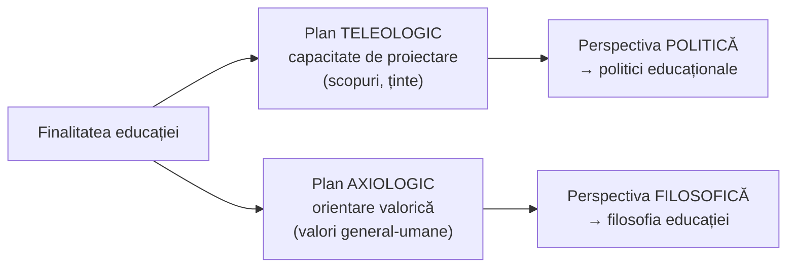

↑ [[Modulul 04 - Finalitățile educației]] · ← [[3.6 Educația permanentă și autoeducația]] · → [[4.2 Problematica și funcțiile finalităților]]

> [!abstract] Pe scurt
> - **Finalitatea educațională** (lat. *finalis* — „care indică scopul”) este **caracteristica esențială** a educației care exprimă **intenționalitatea** ei și **proiecția rezultatelor** în viitor.
> - Educația are un **caracter teleologic** (orientat spre scopuri) și **prospectiv**: orice acțiune educativă se justifică și se apreciază prin **raportare la scopurile** urmărite.
> - Finalitățile definesc **orientările valorice** asumate în formarea-dezvoltarea personalității, la **nivel de sistem** și **de proces**.
> - Două planuri de analiză (S. Cristea): **teleologic** (capacitatea de proiectare → politica educației) și **axiologic** (valorile → filosofia educației).
> - Valorile fundamentale sunt **istoric determinate**: premoderne (sacru, bine, adevăr, frumos) → moderne (libertate, egalitate, solidaritate…) → postmoderne (deschidere, creativitate, competitivitate).

---

# PARTEA I — Ce spune manualul

## 0. Deschiderea modulului (p. 122)

- **Motto-uri**: A. Diesterweg (învățătorul bun își aplică principiile educative cu fermitate) și Sofocle (omul învățat nu se umilește învățând mereu).
- **Competențe vizate**: definirea categoriilor de finalități; interpretarea problematicii și funcțiilor lor; explicarea corelației macro–microstructural; clasificarea obiectivelor; conștientizarea implicațiilor practice ale proiectării finalităților.
- **Concepte de bază**: finalitate educațională, nivel macro- și microstructural, funcțiile finalităților, clasificarea obiectivelor, proiectarea finalităților.

## 1. Definiția de bază (p. 123)

> [!quote] Definiție (după I. Bontaș)
> **Finalitatea educațională** (lat. *finalis*) este **caracteristica esențială a educației** care reflectă **tendințele, intenționalitatea și proiecțiile** privind rezultatele educației.

- **Orientarea spre viitor** și caracterul logic al stabilirii reperelor dau educației un **sens teleologic** (gr. *tele-* = distanță în spațiu și/sau timp), proiectat sistematic în viitor.
- Conceptul are statut de **concept pedagogic fundamental**, cu implicații **generale, specifice și concrete**, valabile:
  - la nivel de **sistem** (social, de educație, de învățământ);
  - la nivel de **proces** (de învățământ).

## 2. De ce contează scopurile (p. 123)

| Idee | Explicație |
|---|---|
| **Direcționare și justificare** | acțiunea educativă e orientată și legitimată de scopurile ei |
| **Claritate = eficiență** | cu cât scopurile sunt mai clare, cu atât activitatea e mai precis concepută și consumă **mai puține resurse** |
| **Caracter finalist** | orice educație este **evaluată prin raportare** la scopurile urmărite |
| **Caracter prospectiv** | rezultatele sunt proiectate în viitor; **rezultatele parțiale** sunt urmărite permanent ca **trepte/condiții** ale rezultatelor finale |

> [!quote] Definiție (p. 123)
> **Finalitățile educației (pedagogice)** definesc **orientările valorice** asumate în activitatea de formare-dezvoltare a personalității, **la nivel de sistem și de proces**.

- După **S. Cristea**, finalitatea educației desemnează trăsăturile fundamentale ale activității de formare-dezvoltare a personalității, concentrate la nivelul caracteristicilor ei **funcțional-structurale**, în **plan teleologic și axiologic**.
- **C. Cucoș**: nu se poate face educație fără a avea în vedere **finalitatea demersului** — **prototipul de personalitate** spre care se tinde (p. 123–124).

## 3. Planul teleologic — perspectiva politică (p. 124)

- În plan **teleologic**, finalitatea exprimă **capacitatea de proiectare** a educației după anumite „ținte” sau intenții — în limbaj comun, **scopuri** (S. Cristea).
- **Perspectiva politică** valorizează proiectarea și orientează consecințele pragmatice ale finalității într-un spațiu și timp pedagogic determinat, prin raportare la:
  - **normele specifice** domeniului;
  - **cerințele manageriale**: eficientizarea resurselor, perfecționarea continuă a rezultatelor.
- Această perspectivă este dezvoltată de științele educației la nivelul **politicilor educaționale**.
- Scopurile de la orice nivel (sistem de educație, sistem de învățământ, proces de învățământ, activitate concretă) se subsumează noțiunii de **finalitate**, care asigură **orientarea valorică** a acțiunii și **anticipează evoluții superioare** celor anterioare.

## 4. Planul axiologic — perspectiva filosofică (p. 124–125)

- În plan **axiologic**, perspectiva **filosofică** (dezvoltată de **filosofia educației**) se concentrează pe **valorile general-umane**, prezente **obiectiv** în orice activitate formativă.
- **Valorificarea subiectivă** a acestor valori depinde de **calitatea finalităților** propuse la diverse niveluri: sistem, proces, an de învățământ, treaptă, disciplină școlară, activitate formală–nonformală.

### Evoluția istorică a valorilor fundamentale (p. 124–125, după S. Cristea)

| Model cultural | Tip de valori | Exemple |
|---|---|---|
| **Societatea premodernă** | valori **individuale** | sacru, bine, adevăr, frumos |
| **Societatea modernă** (industrializată) | valori **sociale** | libertate, egalitate, solidaritate, legalitate, competitivitate |
| **Societatea postmodernă / informațională** | valori **psihosociale** | deschidere, creativitate inovatoare, competitivitate |

> [!tip] De reținut
> - **Teleologic** = *spre ce* tinde educația (proiectare). **Axiologic** = *în numele căror valori* (valorizare).
> - Aceste două planuri stau la baza celor **două funcții generale** ale finalităților — de **proiectare** și de **valorizare** (→ [[4.2 Problematica și funcțiile finalităților]]).

---

# PARTEA II — Completări

## 5. Clarificări terminologice

| Termen | Etimologie / sens | Observație |
|---|---|---|
| **Finalitate** | lat. *finis* „capăt, scop” → *finalis* | termen-**umbrelă** pentru toate intențiile educative (ideal, scopuri, obiective) |
| **Teleologie** | gr. *télos* „scop, țintă” + *lógos* | în manual, *tele-* e explicat ca „distanță” — aceasta e etimologia prefixului *tēle-* („departe”, ca în *telescop*), **nu** a lui *télos* („scop”). Cele două rădăcini grecești sunt diferite |
| **Axiologie** | gr. *áxios* „valoros” + *lógos* | teoria valorilor; în pedagogie — fundamentarea valorică a educației |
| **Intenționalitate** | caracterul conștient, orientat al educației | distinge educația (intenționată) de influențele spontane → [[3.4 Educația informală]] |

> [!note] Comentariu
> În literatura franceză, distincția *finalités – buts – objectifs* (finalități – scopuri – obiective) a fost sistematizată de **L. D'Hainaut**, *Des fins aux objectifs de l'éducation* (1977): finalitățile exprimă opțiuni de **filosofie și politică** a educației, scopurile orientează **instituțiile și programele**, obiectivele descriu **rezultate ale învățării**. Este aceeași logică pe care o preiau S. Cristea și manualul.

## 6. Repere filosofice ale ideii de finalitate

| Autor | Lucrare | Contribuție |
|---|---|---|
| **Aristotel** | *Etica nicomahică*; *Politica* (cărțile VII–VIII) | *télos*: orice activitate tinde spre un bine; educația cetățeanului servește **fericirea** (*eudaimonia*) și binele cetății |
| **I. Kant** | *Despre pedagogie* (1803, ed. F. T. Rink) | copiii trebuie educați **nu pentru starea prezentă, ci pentru o stare viitoare, mai bună**, a omenirii — expresie clasică a caracterului **prospectiv** |
| **É. Durkheim** | *Educație și sociologie* (1922) | finalitățile sunt **social determinate**: fiecare societate își formează un ideal de om |
| **J. Dewey** | *Democracy and Education* (1916), cap. „Aims in Education” | critică scopurile **impuse din exterior**; scopurile autentice apar **în interiorul activității** (*ends-in-view*) și sunt flexibile |
| **R. W. Tyler** | *Basic Principles of Curriculum and Instruction* (1949) | prima întrebare a proiectării curriculare: **ce scopuri educaționale** trebuie să urmărească școala? Scopurile se deduc din nevoile elevului, ale societății și din disciplinele de studiu, filtrate prin filosofia educației și psihologia învățării |

## 7. Finalitățile în documentele R. Moldova

- **Codul Educației** (Legea nr. 152/2014) formulează explicit:
  - **art. 5** — **misiunea educației** (satisfacerea cerințelor educaționale ale individului și societății, dezvoltarea potențialului uman, a culturii naționale, dialog intercultural, învățare pe tot parcursul vieții etc.);
  - **art. 6** — **idealul educațional** (→ [[4.4 Finalitățile macro- și microstructurale]]);
  - **art. 11** — **finalitățile educaționale**: finalitatea principală este formarea unui **caracter integru** și a unui **sistem de competențe** (cunoștințe, abilități, atitudini, valori) + **nouă competențe-cheie**.
- Astfel, nivelul teleologic (proiectare) are în R. Moldova **forma juridică** a legii, iar cel axiologic se vede în valorile invocate (valori naționale și universale, toleranță, incluziune).

## 8. Comentariu critic

> [!warning] Observații critice
> - **Etimologie discutabilă**: *teleologic* derivă din *télos* („scop”), nu din *tele-* („departe”) — manualul confundă cele două rădăcini (p. 123).
> - **Densitate terminologică** fără exemple: formulări precum „caracteristici funcțional-structurale în plan teleologic și axiologic” sunt preluate aproape literal din S. Cristea și rămân abstracte pentru un student începător.
> - Deși titlul anunță „definiri” (plural), manualul oferă de fapt **o definiție de dicționar** (Bontaș) și reformulări după Cristea și Cucoș; lipsesc perspectivele internaționale (D'Hainaut, Tyler).
> - Schema istorică a valorilor (premodern–modern–postmodern) este o **simplificare utilă**, dar valorile nu se înlocuiesc succesiv, ci **se suprapun** (de ex. adevărul și binele rămân valori și în societatea postmodernă); „competitivitatea” apare, fără explicație, atât la modern, cât și la postmodern.
> - Nu se precizează că planul teleologic și cel axiologic sunt **inseparabile**: orice scop implică o opțiune valorică.

## 9. Întrebări de autoverificare

1. Definiți finalitatea educațională și explicați etimologia termenului.
2. Ce înseamnă că educația are un caracter **teleologic**? Dar **prospectiv**?
3. De ce claritatea scopurilor duce la economie de resurse?
4. Comparați planul teleologic și planul axiologic al finalităților: ce disciplină pedagogică dezvoltă fiecare perspectivă?
5. Ce valori fundamentale corespund societăților premoderne, moderne și postmoderne?
6. Explicați ideea lui C. Cucoș despre „prototipul de personalitate”.
7. Cum argumentează Kant și Dewey, în moduri diferite, relația educației cu viitorul?
8. În ce articole ale Codului Educației al R. Moldova sunt formulate misiunea, idealul și finalitățile educației?

## Surse

- Manual, p. 122–125; Bontaș, I. (2008). *Tratat de pedagogie*. București: ALL; Cristea, S. (2010). *Fundamentele pedagogice. Teoria generală a educației*, vol. I. București: Litera Internațional; Cucoș, C. (2014). *Pedagogie*. Iași: Polirom.
- Codul Educației al Republicii Moldova nr. 152/2014, art. 5, 6, 11.
- D'Hainaut, L. (1977). *Des fins aux objectifs de l'éducation*. Bruxelles: Labor / Paris: Nathan.
- Tyler, R. W. (1949). *Basic Principles of Curriculum and Instruction*. Chicago: University of Chicago Press.
- Dewey, J. (1916). *Democracy and Education*. New York: Macmillan.
- Kant, I. (1803). *Über Pädagogik* (ed. F. T. Rink). Königsberg.
- Durkheim, É. (1922). *Éducation et sociologie*. Paris: Alcan.
