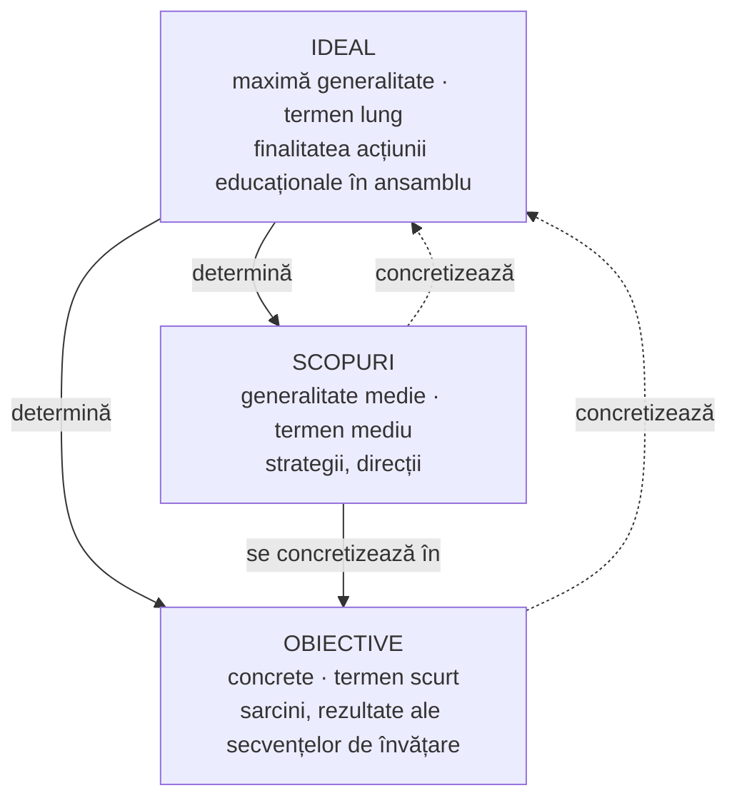

↑ [[Modulul 04 - Finalitățile educației]] · ← [[4.1 Conceptul de finalitate educațională]] · → [[4.3 Niveluri și categorii de finalități]]

> [!abstract] Pe scurt
> - **Nondirectivismul pedagogic** refuză educației dreptul de a impune finalități; manualul îl respinge: există vârste și situații în care educatul **are nevoie de ghidarea** unei persoane inițiate.
> - Sistemul finalităților are trei elemente: **idealul educațional → scopurile educației → obiectivele educaționale**, diferențiate după **gradul de generalitate** și de **durată** (lung – mediu – scurt).
> - Idealul este **istoric determinat**: de la dezvoltarea armonioasă (Antichitate) la omul adaptabil unei societăți în schimbare rapidă.
> - Multitudinea de formule („obiective-cadru”, „de referință”, „operaționale”…) face **necesară clasificarea** finalităților (S. Cristea); există taxonomii pentru domeniile **cognitiv, afectiv, psihomotor**.
> - Orice finalitate are **două funcții generale** (S. Cristea): **de proiectare** (teleologică) și **de valorizare** (axiologică).

---

# PARTEA I — Ce spune manualul

## 1. Nondirectivismul și necesitatea finalităților (p. 125)

- Cercetarea pedagogică recentă a clarificat **semnificațiile, funcțiile și modalitățile** de realizare a finalităților.
- **Nondirectivismul pedagogic**: orientare care **refuză** educației dreptul de a impune elevilor „direcții” (finalități), considerând că ar limita **autodeterminarea și libertatea** persoanei. Educatorul ar fi cel mult un **consilier**, care sprijină — la cerere — finalitățile fixate de individ.
- **Replica manualului**:
  - există **vârste și situații** în care persoana are nevoie de ajutorul unei persoane **inițiate**;
  - copiii nu pot aprecia singuri **prioritățile, ordinea și modul de realizare** a obiectivelor;
  - responsabilitatea educatorului este să **propună obiective provenite din societate**, prin **persuasiune**, în diverse sectoare socioculturale (economie, politică, religie, artă);
  - persoana **matură**, cu discernământ, poate apoi accepta și evalua direcționarea obiectivelor.
- Pedagogia nu există **în afara libertății**, dar orice acțiune umană **are un scop** → domeniul educației admite doar abordări **finaliste**, nu cauzale (p. 125).

## 2. Idealul actual și rolul Codului Educației (p. 125–126)

- Școala de azi urmărește o personalitate **liberă, armonioasă, creativă**, capabilă să se **adapteze la schimbare** — completând idealul uman al epocilor anterioare.
- Finalitățile școlii sunt structurate în **Codul educației** al R. Moldova și constituie **criteriul fundamental** de **proiectare, organizare și evaluare** a tuturor activităților educative, indiferent de subsistemul social și de formă (formal, nonformal, informal → [[Modulul 03 - Formele generale ale educației]]).
- Reușita depinde de **armonizarea cerințelor sociale** cu cele ale **fiecărei persoane**.

## 3. Elementele structurale ale sistemului de finalități (p. 126)

1. **idealul educației**;
2. **scopurile educației**;
3. **obiectivele educaționale**.

- Prin consens internațional (**UNESCO, 1979, 1981**), termenii „finalitate”, „scop”, „obiectiv” — adesea folosiți ca sinonime — desemnează **grade diferite de generalitate** ale intenționalității educaționale.

## 4. Idealul educațional (p. 126–128)

### 4.1. Natura idealului

- Idealul educațional exprimă **ce poate face educația pentru societate**.
- Este **parte a idealului social** (se referă doar la om și la contribuția lui la idealul social) și își construiește conținutul **în funcție de acesta**.
- Datorită idealului, acțiunea educativă devine **conștientă, dinamică** și contribuie la dezvoltarea intelectuală, morală, fizică etc.
- Idealul susține **progresul** și dă omului **optimism, dinamism, încredere** în puterea educației (după I. Bontaș) (p. 126–127).

### 4.2. Factori determinanți (p. 127)

| Factor | Conținut |
|---|---|
| **Social-economic** | dezvoltarea economiei și societății, exigențele și tendințele omenirii |
| **Individual** | interesele, năzuințele, motivațiile individului |
| **Pedagogic** | posibilitățile reale ale teoriei și acțiunii educaționale |

- Idealul **se modifică istoric**, dar are **caracter de continuitate**.

### 4.3. Evoluția istorică a idealului (p. 127)

| Epocă / autor | Idealul educațional |
|---|---|
| **Grecia Antică** — Socrate, Aristotel | **dezvoltare armonioasă**; omul capabil să-și **subordoneze dorințele rațiunii** |
| **Roma Antică** | **cetățeanul integru**, cu înalte virtuți morale |
| **Renașterea** | personalitate **dezvoltată multilateral** |
| **J. A. Comenius** (epoca modernă) | trei laturi: **erudiție, înțelepciune, virtute** (vezi corectura din §9) |
| **J. Locke** | **minte sănătoasă într-un corp sănătos** |
| **J.-J. Rousseau** | om **sănătos, activ**, dezvoltat intelectual, capabil să trăiască **liber** și să **muncească** |
| **J. H. Pestalozzi** | dezvoltare **intelectuală, morală și fizică** |
| **Societatea actuală** | omul capabil să se **integreze ușor** într-o societate cu dezvoltare accelerată și să se **adapteze schimbărilor** |

- Idealul este o **perspectivă îndepărtată, niciodată realizată total** — un **proiect** care arată **direcția** și **punctul cel mai înalt** de atins (p. 127–128).

> [!quote] Definiție (p. 128)
> **Idealul educațional** este **finalitatea de maximă generalitate** a educației, care exprimă **orientările strategice** ale unui sistem educativ într-o anumită etapă istorică de dezvoltare economico-socială, științifică și culturală a unei țări; se realizează **pe termen lung** și sintetizează **modelul de personalitate dezirabil social**.

## 5. Scopurile educației (p. 128)

- Idealul **nu indică metode** sau modalități de realizare → pentru aceasta se elaborează **strategii, tactici** → apar **scopurile**.
- Scopurile exprimă ce poate face **fiecare subiect** implicat în realizarea idealului.
- Sunt **elemente operaționale** ale strategiei, stabilite în funcție de condiții obiective și subiective; indică **drumul, etapele și modalitățile** apropierii individualității de modelul proiectat (după Sadovei, Papuc, Cojocaru).
- Scopul este un **reglator al acțiunii**: o orientează și o controlează. E determinat de **ideal** și de **condițiile istorico-sociale**; are și o **determinare psihologică**.
- **Relația ideal–scop**: idealul **determină** scopurile; scopurile **concretizează** prescripțiile generale ale idealului.

> [!quote] Definiție (p. 128)
> **Scopurile educaționale** sunt finalități **derivate din idealul educațional**, care desemnează „aspirații” și „intenționalități” **pe termen mediu**.

## 6. Obiectivele educaționale (p. 129)

- Fiecare acțiune educativă este **concretizată prin obiective**: proiectări anticipate, **relativ restrânse**, ale idealului, sub formă de **elemente sau sarcini** educaționale (după Bontaș).

> [!quote] Definiție (p. 129)
> **Obiectivele educaționale** sunt **sarcini particulare, analitice, concrete** ale procesului educațional, **derivate din scopuri**, cu diferite grade de generalitate — de la obiectivele **intermediare** (profilate, de nivel prospectiv mediu) până la cele **operaționale** (maximal concrete, specifice secvențelor instructiv-educative).

- **Scop vs. obiective**: două laturi **complementare** ale realizării idealului. Scopul vizează **finalitatea generală**; obiectivul — **rezultatul unei secvențe de învățare**. Un scop se concretizează prin **mai multe obiective**.

## 7. Interdependența ideal – scopuri – obiective (p. 129)

- Idealul confirmă finalitățile acțiunii educaționale **în ansamblu**; scopurile și obiectivele propun **acțiuni concrete** și detaliază cele mai mici elemente ale finalității pentru **o parte** a acțiunii educaționale.

## 8. Necesitatea clasificării finalităților (p. 129–131)

- **S. Cristea**: clasificarea este o **necesitate metodologică și practică**, dată fiind abundența formulelor din literatura de specialitate, documentele de politică școlară și limbajul comun.
- Formule inventariate de Cristea (selecție): *finalități și obiective, scopuri, ținte, deziderate, competențe specifice, obiective generale / intermediare / specifice, obiective-cadru, de referință, de evaluare, educaționale, instrucționale, operaționale, concrete, micro- și macro-obiective, terminale, de formare, obiective-țintă, tangibile / intangibile, aparente, funcționale, mono- și multidisciplinare*.
- Toate finalitățile sunt **complementare și interdependente**: realizarea unora depinde de a altora și de funcționalitatea întregului sistem.

### Taxonomii menționate de manual (p. 130)

| Domeniu | Autori și ani (așa cum apar în manual) |
|---|---|
| **Cognitiv** | B. S. Bloom (1951); De Blook [De Block] (1973); De Corte (1973); D'Hainaut (1977) |
| **Psihomotor** | J. E. Simpson (1967); H. Dave (1969); S. J. Bruner (1973); A. Harrow (1972) |
| **Afectiv** | D. R. Krathwohl (1964); N. E. Gronlund (1970); L. I. Smith (1970) |
| **Global** (toate domeniile) | R. Gagné; M. D. Merrill |

> [!warning] Atenție
> Mai mulți ani și nume din acest tabel sunt **eronați** în manual — vezi corecturile din [[4.5 Ierarhizarea și clasificarea obiectivelor]] §10 și comentariul critic de mai jos.

- Problematica obiectivelor este **esențială** în orice proiectare științifică a actului educativ.
- Societatea își **înnoiește permanent normele juridice** care orientează instituțiile educative → responsabilitatea deciziilor e obiectivată în documente de politică a educației: **Codul educației, Curriculumul Național** (plan de învățământ, manuale, planificări calendaristice, proiecte de lecții) (p. 130–131).
- În aceste acte, opțiunea socială privind educația apare la **niveluri diferite de abstractizare** → **finalitățile educației** = conceptualizarea a ceea ce **societatea așteaptă** de la instituțiile educative (p. 131).

## 9. Funcțiile generale ale finalităților (p. 131–132, după S. Cristea)

- Funcțiile generale definesc **consecințele cele mai importante**, semnificative social, ale activității de formare-dezvoltare a personalității, într-un context determinat (sistem, proces, activitate).
- Corespunzător celor **două planuri** (teleologic – axiologic), orice finalitate are **două funcții**; ambele intervin în **orice** activitate educativă, dar se realizează diferit în funcție de **„actorii educației”** și de context.

| Funcția | Plan | Ce presupune | Semnificație epistemologică |
|---|---|---|---|
| **1. De proiectare** | teleologic | vizează **toate nivelurile** sistemului și procesului: concepția **politicilor educaționale**; elaborarea **planului de învățământ, programelor, manualelor**; **planificarea** cadrului didactic (anuală, semestrială, pe capitole, grupuri de lecții, lecții) | asigură **explicarea/interpretarea teleologică** a oricărei activități educative |
| **2. De valorizare** | axiologic | se realizează prin **valorile pedagogice de maximă generalitate** concentrate în **ideal, scopuri, obiective** | asigură **interpretarea axiologică** specifică pedagogiei |

- Importanța funcțiilor este **epistemologică** (vezi tabelul) și **metodologică**: ele condiționează **modul de structurare** a finalităților (→ [[4.3 Niveluri și categorii de finalități]]).

> [!tip] De reținut
> **Ideal** (lung, maximă generalitate, *de epocă*) → **Scop** (mediu, direcții strategice) → **Obiectiv** (scurt, concret, observabil). **Funcțiile**: *proiectare* (spre ce?) + *valorizare* (de ce, în numele căror valori?).

---

# PARTEA II — Completări

## 10. Nondirectivismul — cine și ce a susținut

| Autor | Lucrare | Idee |
|---|---|---|
| **J.-J. Rousseau** | *Emil sau despre educație* (1762) | precursor: **educația negativă** — protejarea dezvoltării naturale, fără impunerea valorilor adulților în copilărie |
| **Carl R. Rogers** | *Client-Centered Therapy* (1951); *Freedom to Learn* (1969) | **învățarea centrată pe elev**; profesorul ca **facilitator**; învățarea semnificativă e autoinițiată |
| **A. S. Neill** | *Summerhill: A Radical Approach to Child Rearing* (1960) | școala **Summerhill** (fondată 1921): participare **liberă** la lecții, autoguvernare democratică |
| **Ivan Illich** | *Deschooling Society* (1971) | critică a finalităților impuse instituțional → [[3.2 Educația formală]] |

> [!note] Comentariu
> Manualul prezintă nondirectivismul fără a-i numi reprezentanții. Poziția sa (un **directivism moderat**, cu autonomie crescândă a educatului) este apropiată de ideea lui **Kant** din *Despre pedagogie*: problema educației este cum să **împaci constrângerea cu libertatea** — educatul trebuie condus astfel încât să ajungă să **se folosească singur** de libertate. Aceeași logică fundamentează trecerea spre **autoeducație** (→ [[3.6 Educația permanentă și autoeducația]]).

## 11. Idealul educațional în istoria pedagogiei — completări și nuanțe

| Reper | Precizare |
|---|---|
| **Sparta / Atena** | Sparta: ideal **militar**; Atena: **kalokagathia** (gr. *kalós kai agathós* — „frumos și bun”), armonia fizică și morală (detaliat în manual la p. 138 → [[4.4 Finalitățile macro- și microstructurale]]) |
| **Platon** | *Republica*: educația diferențiată pentru cele trei clase ale cetății; idealul **filosofului-conducător** — omis de manual, deși central în Antichitate |
| **Evul Mediu** | pe lângă idealul **cavaleresc**, idealul **religios-ascetic** (monahal) și cel **scolastic** |
| **Comenius** | *Didactica Magna* (1657): omul trebuie format prin **erudiție** (*eruditio*), **virtute/moravuri** (*virtus seu mores*) și **pietate/religie** (*pietas*) |
| **J. Locke** | *Some Thoughts Concerning Education* (1693) — deschide cu formula ***mens sana in corpore sano***, preluată din **Juvenal** (*Satire*, X); idealul lockean este **gentlemanul** (virtute, înțelepciune, bune maniere, cunoștințe) |
| **Pestalozzi** | formula **„cap, inimă, mână”** (dezvoltare intelectuală, morală, practică) |
| **Secolul XX** | **Raportul Faure** (UNESCO, 1972), *A învăța să fii*: idealul **omului complet**; **Raportul Delors** (UNESCO, 1996), *Comoara lăuntrică*: cei **patru piloni** — *a învăța să știi, să faci, să trăiești împreună cu ceilalți, să fii* |

## 12. Taxonomia termenilor: ideal – scop – obiectiv în literatura internațională

| Română | Engleză | Franceză | Nivel |
|---|---|---|---|
| ideal / finalitate | *aims* | *finalités* | filosofie și politică educațională |
| scop | *goals* | *buts* | instituții, cicluri, programe |
| obiectiv | *objectives* | *objectifs* | disciplină, lecție, secvență |

- Distincția *aims – goals – objectives* e larg folosită în literatura anglo-saxonă de curriculum (de ex. R. Zais, *Curriculum: Principles and Foundations*, 1976). Pentru nivelul francofon — **L. D'Hainaut** (1977).
- Consensul „UNESCO 1979, 1981” invocat de manual nu este documentat cu titlul documentului (de verificat).

## 13. Funcțiile finalităților — alte clasificări

- Literatura românească (de ex. **C. Cucoș**, *Pedagogie*) atribuie finalităților și obiectivelor funcții mai detaliate decât cele două ale lui Cristea. Sinteză uzuală (formularea variază de la autor la autor):
  - **de orientare valorică** a educației;
  - **de anticipare** a rezultatelor;
  - **evaluativă** (obiectivele devin **criterii de evaluare**);
  - **de organizare și reglare** a procesului;
  - **de comunicare** (obiectivele clarifică intențiile pentru elevi, părinți, colegi).
- Funcțiile obiectivului sunt reluate în manual la p. 142–143 (proiectare, anticipare, organizare/evaluare, axiologică) → [[4.5 Ierarhizarea și clasificarea obiectivelor]].

## 14. Legătura cu Codul Educației al R. Moldova

- **Art. 6** fixează **idealul**, **art. 11** — **finalitatea principală** și **competențele-cheie**; acestea devin **criterii** pentru curriculum (standarde, programe), evaluare și acreditare — exact **funcția de proiectare** descrisă de Cristea.
- Afirmația manualului că finalitățile sunt „structurate sistematic” în Cod este valabilă doar pentru **nivelul macro** (ideal, misiune, finalități, competențe-cheie); **obiectivele/competențele** pe cicluri și discipline se află în **documentele curriculare** (Cadrul de referință al Curriculumului Național, curricula disciplinare).

## 15. Comentariu critic

> [!warning] Observații critice
> - **Titlu vs. conținut**: subcapitolul „Problematica și funcțiile” conține în cea mai mare parte definirea **idealului, scopurilor și obiectivelor** — conținut **reluat** în §4.4 (p. 137–142). Funcțiile propriu-zise ocupă doar ultima pagină.
> - **Comenius** (p. 127): triada autentică din *Didactica Magna* este **erudiție – virtute (moravuri) – pietate (religie)**; manualul pune „înțelepciunea” în locul pietății, eliminând dimensiunea religioasă, esențială la Comenius.
> - **Locke**: formula „minte sănătoasă în corp sănătos” este un **citat din Juvenal** folosit de Locke, nu o creație proprie.
> - **Antichitatea greacă** redusă la Socrate și Aristotel — lipsește **Platon**; Socrate nu a lăsat o teorie scrisă a educației.
> - **Taxonomiile** (p. 130): **Bloom — 1956**, nu 1951 (*Handbook I*); **Simpson** este **Elizabeth J. Simpson** (1966/1972), nu „J. E.”; **R. H. Dave** (1970), nu „H. Dave, 1969”; „De Blook” = **A. De Block**. „S. J. Bruner, 1973” și „L. I. Smith, 1970” **nu au putut fi identificați** ca autori de taxonomii (probabil erori de preluare). **Gronlund** (1970) este mai curând autorul unui ghid de formulare a obiectivelor comportamentale decât al unei taxonomii afective proprii.
> - **Scopuri pe termen „mediu”** (p. 128) vs. „mediu și lung” (p. 140) — inconsecvență internă.
> - Afirmația că educația admite **„doar abordări finaliste, nu cauzale”** e excesivă: psihologia educației și cercetarea empirică studiază tocmai relațiile cauzale (ce metode produc ce efecte).
> - Trimiterea **[1, p. 3]** (Bontaș, *Tratat de pedagogie*) la pagina 3 pentru definiții de fond este improbabilă (de verificat).

## 16. Întrebări de autoverificare

1. Ce susține nondirectivismul pedagogic și cum îi răspunde manualul? Numiți doi reprezentanți ai acestei orientări.
2. Care sunt elementele structurale ale sistemului de finalități și prin ce se deosebesc?
3. Definiți idealul educațional și numiți factorii care îl determină.
4. Prezentați evoluția idealului educațional de la Antichitate la epoca modernă (minimum cinci repere).
5. Ce relație există între ideal și scopuri? Dar între scopuri și obiective?
6. De ce consideră S. Cristea necesară clasificarea finalităților?
7. Numiți câte o taxonomie pentru domeniile cognitiv, afectiv și psihomotor, cu autorul și anul corect.
8. Explicați funcția de proiectare și funcția de valorizare a finalităților, cu exemple din activitatea unui profesor.
9. Ce aduc rapoartele Faure (1972) și Delors (1996) la înțelegerea idealului educațional contemporan?

## Surse

- Manual, p. 125–132; Bontaș, I. (2008). *Tratat de pedagogie*; Cristea, S. (2010). *Fundamentele pedagogice. Teoria generală a educației*, vol. I; Sadovei, L., Papuc, L., Cojocaru, M. (2008). *Didactica generală*. Chișinău: UPS „Ion Creangă”.
- Codul Educației al Republicii Moldova nr. 152/2014, art. 6, 11.
- Comenius, J. A. (1657). *Didactica Magna*. Amsterdam.
- Locke, J. (1693). *Some Thoughts Concerning Education*. London.
- Rogers, C. R. (1969). *Freedom to Learn*. Columbus, OH: Merrill.
- Neill, A. S. (1960). *Summerhill: A Radical Approach to Child Rearing*. New York: Hart.
- Faure, E. et al. (1972). *Learning to Be*. Paris: UNESCO.
- Delors, J. et al. (1996). *Learning: The Treasure Within*. Paris: UNESCO.
- D'Hainaut, L. (1977). *Des fins aux objectifs de l'éducation*. Bruxelles: Labor / Paris: Nathan.
- Zais, R. S. (1976). *Curriculum: Principles and Foundations*. New York: Harper & Row.
