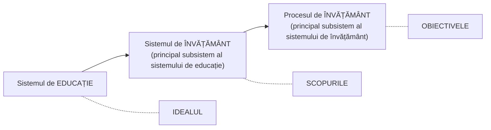
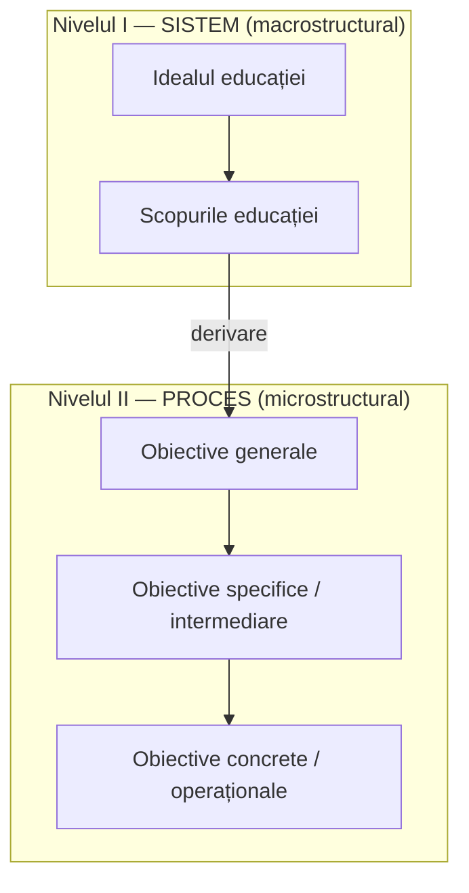
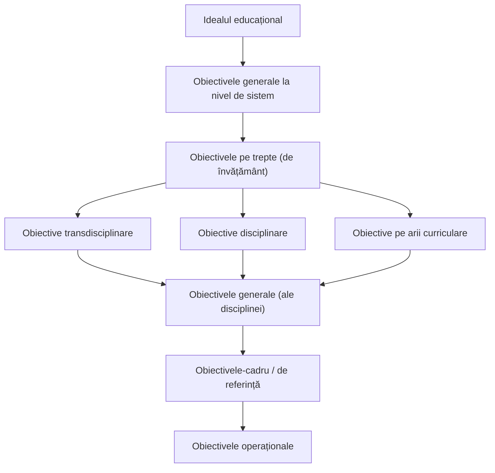

↑ [[Modulul 04 - Finalitățile educației]] · ← [[4.2 Problematica și funcțiile finalităților]] · → [[4.4 Finalitățile macro- și microstructurale]]

> [!abstract] Pe scurt
> - Triada **ideal – scopuri – obiective** se ordonează în două tipuri complementare: **finalități de sistem (macrostructurale)** = idealul și scopurile; **finalități de proces (microstructurale)** = obiectivele.
> - **S. Cristea** propune **patru criterii** de clasificare: forma de obiectivare (proiect / produs), ponderea teoretică sau practică, raportarea la sistem, gradul de generalitate–specificitate–operaționalitate.
> - **D. Potolea**: **3 niveluri** de generalitate și **5 categorii** de finalități (ideal → obiective generale ale învățământului → obiective ale ciclurilor/profilurilor → obiective ale disciplinelor → obiective operaționale).
> - **Modelul global** (S. Cristea): finalitățile macro sunt **indivizibile** (nu formează taxonomii), cele micro sunt **divizibile în taxonomii**; trecerea de la o categorie la alta se face prin **derivare**.
> - **Modelul liniar** (V. Guțu) ierarhizează obiectivele de la ideal la obiectivele operaționale, dar **nu poate coordona** proiectarea la nivelul lecției.

---

# PARTEA I — Ce spune manualul

## 1. Punctul de plecare (p. 132)

- Unele finalități au un **grad foarte mare de generalitate**: la realizarea lor contribuie **toate formele de educație** dintr-o societate.
- Analiza finalităților (S. Cristea) pornește de la triada **ideal – scopuri – obiective**. Ordonate după **domeniul de referință**, ele formează două tipuri **distincte, dar complementare**:

| Tip | Domeniu de referință | Categorii |
|---|---|---|
| **Finalități macrostructurale** (de sistem) | sistemul de educație / învățământ | **idealul** și **scopurile** educației |
| **Finalități microstructurale** (de proces) | procesul de învățământ | **obiectivele** educației |

## 2. Criteriile de clasificare propuse de S. Cristea (p. 132–134)

### I. După forma de obiectivare a orientărilor valorice (p. 132–133)

| Categorie | Include |
|---|---|
| **Finalități tip proiect** | idealul educației; scopurile educației; obiectivul general al educației |
| **Finalități tip produs** | obiectivele generale ale procesului de învățământ; obiectivele particulare (specifice, intermediare); obiectivele operaționale (concrete) |

### II. După ponderea teoretică sau practică (p. 133)

| Categorie | Include |
|---|---|
| **Teoretice, fundamentale** | idealul și scopurile educației |
| **Teoretice, angajate ca criterii de proiectare pedagogică** | obiectivele generale (la nivelul procesului de învățământ) |
| **Aplicative, operaționalizabile în taxonomii** | obiectivele specifice |
| **Concrete, realizabile în activități concrete** | obiectivele operaționale |

### III. După gradul de raportare la sistemul de educație/învățământ (p. 133)

### IV. După gradul de generalitate – specificitate – operaționalitate (spațial, temporal, acțional) (p. 133–134)

| Nivel | Finalitate |
|---|---|
| **maximă generalitate** | idealul educației |
| **direcții generale** de dezvoltare a educației | scopurile educației |
| valabile la nivelul **procesului de învățământ** | obiectivele generale |
| **particularizate** în procesul de învățământ | obiectivele specifice / intermediare |
| concretizate la nivelul **unui grup de lecții / unei lecții** | obiectivele operaționale |
| concretizate **în interiorul** unei lecții sau al unui obiectiv operațional | **„micro-obiectivul operațional”** |

## 3. Modelul lui D. Potolea: 3 niveluri, 5 categorii (p. 134)

| Nivel de generalitate | Categoria |
|---|---|
| **I. Maximă generalitate** | 1) **idealul educației**; 2) **obiectivele generale ale învățământului** |
| **II. Generalitate intermediară** | 3) obiectivele generale ale **ciclurilor de învățământ** și **profilurilor de școli**; 4) obiectivele generale ale **disciplinelor de învățământ** |
| **III. Finalități operaționale** | 5) **obiectivele operaționale** — pentru o unitate educațională (lecția sau ora educațională) |

## 4. Modelul global al finalităților (S. Cristea) (p. 134–135)

- Scop: **unificarea formulelor** folosite pentru finalități la nivelul unor concepte pedagogice fundamentale, fixate epistemologic în **teoria generală a educației**.
- Arhitectura are **două niveluri de bază**, fundamentate în **filosofia** și **politica educației**.
- Trecerea de la o categorie la alta se face prin **acțiunea de derivare** — atât **în interiorul** fiecărui nivel, cât și la **tranziția** de la un nivel la altul.

| | **Nivelul I — finalități de sistem (macrostructurale)** | **Nivelul II — finalități de proces (microstructurale)** |
|---|---|---|
| **Scară** | întregul sistem de educație și învățământ | procesul de învățământ |
| **Durată** | termen **lung** și **mediu** | termen **mediu** și **scurt** |
| **Structură** | **indivizibile** (nu formează taxonomii) | **divizibile** în **taxonomii** |
| **Categorii** | 1) idealul educației; 2) scopurile educației | 1) obiectivele generale; 2) obiectivele specifice / intermediare; 3) obiectivele concrete / operaționale |

- **Valorificarea modelului** e necesară pentru deciziile de **politică a educației și politică școlară** la toate nivelurile: proiectarea **reformelor**, a **curriculumului național**, a **planului de învățământ**, a **programelor și manualelor**, a **planului calendaristic** (anual, semestrial, săptămânal), a **proiectului de lecție**, orei de dirigenție, cursului și seminarului universitar, consultației, cercului, excursiei didactice, studiului individual dirijat/autodirijat (p. 135).

## 5. Modelul liniar de clasificare a obiectivelor (V. Guțu) (p. 135–136)

- Propus ca instrument practic pentru **concepătorii de curriculum** și **cadrele didactice** (Fig. 5).

- Modelul descrie **clasificarea ierarhică** a obiectivelor.
- **Limita** semnalată chiar de autor: nu poate coordona definirea și realizarea obiectivelor în **cadrul procesual** (lecție, grup de lecții), deoarece **niciun obiectiv disciplinar nu poate fi exclusiv** general, de referință sau operațional (p. 136).

> [!tip] De reținut
> - **Macro** = ideal + scopuri → *politica educației*, indivizibile, termen lung/mediu.
> - **Micro** = obiective generale → specifice → operaționale → *proces de învățământ*, taxonomizabile, termen mediu/scurt.
> - Legătura dintre niveluri: **derivarea** (de la general la concret).
> - Cristea (4 criterii) · Potolea (3 niveluri / 5 categorii) · Cristea (modelul global, 2 niveluri) · Guțu (modelul liniar).

---

# PARTEA II — Completări

## 6. Alte modele de ierarhizare a finalităților

| Autor | Lucrare | Niveluri |
|---|---|---|
| **D. R. Krathwohl & D. A. Payne** | „Defining and assessing educational objectives”, în R. L. Thorndike (ed.), *Educational Measurement* (1971) | trei niveluri de abstractizare: **obiective globale** (orientează politici și programe pe termen lung) → **obiective educaționale** (orientează curriculumul) → **obiective instrucționale** (lecția) |
| **L. D'Hainaut** | *Des fins aux objectifs de l'éducation* (1977) | **finalități** (opțiuni filosofico-politice) → **scopuri** (*buts*, ale instituțiilor și programelor) → **obiective** (generale, intermediare, operaționale); insistă pe **derivarea** riguroasă a obiectivelor din finalități |
| **G. De Landsheere & V. De Landsheere** | *Définir les objectifs de l'éducation* (1975) | ierarhie de la **obiective generale** la **obiective intermediare** și **operaționale** (de verificat denumirea exactă a nivelurilor); lucrarea e cunoscută mai ales pentru **criteriile de operaționalizare** → [[4.5 Ierarhizarea și clasificarea obiectivelor]] |
| **D. Potolea** | „Teoria și metodologia obiectivelor educaționale”, în I. Cerghit, L. Vlăsceanu (coord.), *Curs de pedagogie* (1988) | modelul cu 3 niveluri și 5 categorii (preluat în manual) — unul dintre cele mai citate modele din literatura românească |

> [!note] Comentariu
> Toate modelele au aceeași **logică de „pâlnie”**: de la opțiuni valorice abstracte și stabile la intenții concrete, verificabile. Ele diferă prin **numărul de trepte** și prin **punctul de tăiere** între macro și micro. Potolea pune „obiectivele generale ale învățământului” la nivelul maxim, alături de ideal, iar Cristea le consideră deja **micro** (de proces). Diferența ține de **criteriu**: *generalitate* (Potolea) vs. *domeniul de referință — sistem sau proces* (Cristea).

## 7. De la obiective la competențe în curriculumul R. Moldova

- Modelul liniar al lui Guțu (2001) reflectă curriculumul **pe obiective** (obiective-cadru și de referință, după modelul curriculumului românesc de la sfârșitul anilor '90).
- **Curriculumul modernizat** din R. Moldova (2010) a trecut la o arhitectură **centrată pe competențe**: **competențe-cheie / transversale** → **competențe transdisciplinare** (pe trepte) → **competențe specifice disciplinei** → **subcompetențe** (de verificat terminologia exactă pe ediții).
- **Cadrul de referință al Curriculumului Național** (2017) și **Codul Educației** (art. 11 — cele nouă competențe-cheie) consolidează această orientare.
- Logica ierarhică (derivarea) se păstrează; se schimbă **unitatea de proiectare**: nu mai este comportamentul observabil izolat, ci **competența** (cunoștințe + abilități + atitudini + valori).

| Model pe obiective (manual) | Model pe competențe (curriculum actual) |
|---|---|
| ideal educațional | ideal educațional (Codul Educației, art. 6) |
| obiective generale la nivel de sistem | competențe-cheie (art. 11) |
| obiective pe trepte / transdisciplinare | competențe transversale / transdisciplinare pe trepte |
| obiective-cadru | competențe specifice disciplinei |
| obiective de referință | subcompetențe / unități de competență |
| obiective operaționale | obiective ale lecției (operaționale) |

## 8. Legătura cu alte module

- Proiectarea pe niveluri (plan de învățământ → programă → planificare → proiect de lecție) → [[Modulul 10 - Proiectarea, realizarea și evaluarea activității educative]].
- Sistemul de educație și de învățământ ca domeniu de referință al finalităților macro → [[Modulul 08 - Sistemul de educație și managementul educației]].
- Finalitățile pe laturile (dimensiunile) educației → [[Modulul 06 - Dimensiunile generale ale educației]].

## 9. Comentariu critic

> [!warning] Observații critice
> - **Trimitere bibliografică greșită**: „Modelul global propus de S. Cristea **[3, p. 120–122]**” — sursa [3] din listă este **C. Cucoș, *Pedagogie***; lucrarea lui Cristea este [2].
> - **Suprapuneri între criterii**: criteriile I–IV ale lui Cristea duc practic la **aceeași ordonare** (ideal → scopuri → obiective generale → specifice → operaționale), doar etichetată diferit; manualul nu arată ce aduce nou fiecare criteriu.
> - **Inconsecvență internă**: la criteriul I, „obiectivul general al educației” este finalitate **tip proiect**, dar „obiectivele generale ale procesului de învățământ” sunt **tip produs** — distincție subtilă, neexplicată.
> - **Fig. 5 (Guțu)** e redată ca listă neclară în textul manualului: nu se explică relația dintre obiectivele transdisciplinare, disciplinare și pe arii curriculare (sunt paralele? succesive?) și nici de ce „obiectivele generale” apar din nou sub nivelul disciplinar.
> - Modelul liniar folosește termenii **„obiective-cadru / de referință”**, deja **depășiți** în curriculumul R. Moldova în 2014 (trecerea la competențe din 2010) — informație **datată** la data apariției manualului.
> - Greșeli de redactare: „imicrostructurale”, „operaținale”, „specifcitate”.

## 10. Întrebări de autoverificare

1. Care este diferența dintre finalitățile macrostructurale și cele microstructurale? Dați exemple din fiecare categorie.
2. Enumerați cele patru criterii de clasificare a finalităților propuse de S. Cristea.
3. Ce înseamnă finalități „tip proiect” și „tip produs”?
4. Prezentați modelul lui D. Potolea (niveluri și categorii).
5. De ce finalitățile macro sunt „indivizibile”, iar cele micro „divizibile în taxonomii”?
6. Ce este acțiunea de derivare și unde intervine?
7. Descrieți modelul liniar al lui V. Guțu și explicați limita lui.
8. Comparați ierarhia pe obiective din manual cu ierarhia pe competențe din curriculumul actual al R. Moldova.

## Surse

- Manual, p. 132–136; Cristea, S. (2010). *Fundamentele pedagogice. Teoria generală a educației*, vol. I. București: Litera Internațional.
- Potolea, D. (1988). „Teoria și metodologia obiectivelor educaționale”. În: Cerghit, I., Vlăsceanu, L. (coord.), *Curs de pedagogie*. București: Universitatea din București.
- Guțu, V. (2001). „Obiectivele educaționale: clarificări conceptuale și metodologice”. *Didactica Pro*, nr. 6 (10). Chișinău.
- Guțu, Vl. (2014). *Curriculum educațional*. Chișinău: CEP USM.
- Krathwohl, D. R., Payne, D. A. (1971). „Defining and assessing educational objectives”. În: Thorndike, R. L. (ed.), *Educational Measurement* (ed. a 2-a). Washington, DC: American Council on Education.
- D'Hainaut, L. (1977). *Des fins aux objectifs de l'éducation*. Bruxelles: Labor / Paris: Nathan.
- De Landsheere, V., De Landsheere, G. (1975). *Définir les objectifs de l'éducation*. Paris: PUF.
- Codul Educației al Republicii Moldova nr. 152/2014, art. 6, 11.
