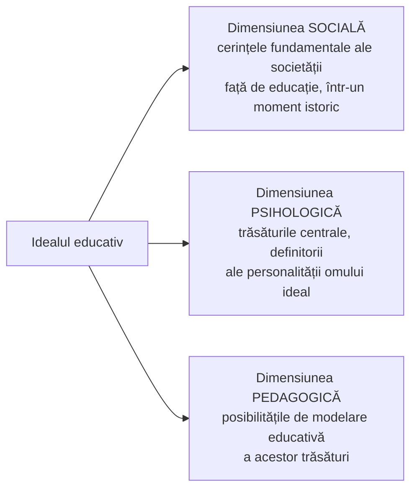

↑ [[Modulul 04 - Finalitățile educației]] · ← [[4.3 Niveluri și categorii de finalități]] · → [[4.5 Ierarhizarea și clasificarea obiectivelor]]

> [!abstract] Pe scurt
> - **Finalitățile macrostructurale** (idealul și scopurile) sunt fixate în **documente politice** și de **politică a educației** (Codul educației, curriculumul național); sunt **globale, indivizibile**, pe **termen lung și mediu**.
> - **Idealul educațional** = modelul de personalitate spre care tind educația și societatea într-o etapă istorică; are caracter **istoric, abstract, prospectiv, politic** și trei dimensiuni (I. Nicola): **socială, psihologică, pedagogică**.
> - **Scopurile** derivă din ideal, sunt **multiple și mai concrete**; idealul e „**de epocă**”, scopul aparține **acțiunii educaționale concrete** (cicluri, tipuri de școli, laturi ale educației).
> - **Finalitățile microstructurale** = **obiectivele procesului de învățământ**: enunțuri anticipative care descriu **schimbări observabile** în comportamentul elevilor (I. Jinga).
> - **Tabloul sinoptic** al lui I. Jinga leagă fiecare finalitate (ideal – scop – obiectiv) de **conținutul** și de **domeniul** ei de aplicare.

---

# PARTEA I — Ce spune manualul

## 1. Unde se află finalitățile macrostructurale (p. 136)

- În **documentele politice**: proiecte de dezvoltare națională (parlamentare, guvernamentale, prezidențiale, comunitare), programe ale partidelor, ale organizațiilor guvernamentale și neguvernamentale.
- În **documentele de politică a educației**: **Codul educației**, statutul personalului didactic, **curriculumul național** etc.

> [!quote] Definiție (p. 137, după S. Cristea)
> **Finalitățile pedagogice macrostructurale** sunt **orientări valorice fundamentale**, elaborate **la nivel de politică a educației**, pentru proiectarea și realizarea optimă a formării personalității prin mobilizarea **tuturor resurselor** sistemului de educație — pe termen **lung** (**idealul pedagogic**) și **mediu** (**scopurile pedagogice**).

**Trăsăturile finalităților de sistem** (după Vl. Guțu, p. 137):
- definesc orientările valorice valabile **pentru întregul sistem** de educație și învățământ, pe termen **lung și mediu**;
- concentrează orientări fundamentale într-un **demers proiectiv global, indivizibil**, cu **grad de comparație absolut**;
- includ **două categorii**: **idealul** și **scopul** educației.

## 2. Idealul educației (p. 137–139)

### 2.1. Definiții

| Autor | Idealul educațional este… |
|---|---|
| **manualul** (p. 137) | un **model ideal de personalitate** spre care tind educația și **întreaga societate** într-un anumit moment istoric |
| **E. Macavei** | o **imagine construită a perfecțiunii umane** |
| **E. Surdu** | **proiectul social de formare a omului**, în acord cu nevoile și exigențele de perspectivă îndepărtată, medie și apropiată |
| **Vl. Guțu** (*Ghid metodologic al curriculumului gimnazial*, 2000) | rezultatul **esențializării idealurilor sociale**; **conștiința educativă a societății** |
| **C. Cucoș** (1996) | **paradigma de personalitate** (oarecum abstractă), **proiectul devenirii umane** la un moment dat |

- Idealul e **determinat obiectiv** de tendințele evoluției sociale; este **impregnat valoric** și **generează norme, principii, strategii** educaționale. Funcționalitatea lui vine din **caracterul dinamic** (p. 137–138).
- **I. Jinga**: idealul este un model abstract, dar **fiecare categorie socioprofesională** are un **model propriu**, aproape realizabil: modelul de educator, medic, militar, funcționar, muncitor, manager etc. (p. 138).

### 2.2. Caracteristicile idealului (p. 138)

Manualul enumeră, ca finalitate cu valențe filosofice: caracter **abstract, istoric, prospectiv, strategic, politic**, cu dimensiune **psihologică și pedagogică**. Detaliat:

| Caracter | Explicație | Exemple / precizări |
|---|---|---|
| **Istoric** | evoluează cu societatea, reflectă aspirațiile ei într-un moment dat | Sparta — **idealul militar**; Atena — **kalokagathia** (*kalos* „frumos” + *agathos* „bun”); Evul Mediu — **idealul cavaleresc**; Renașterea — **idealul umanist**; capitalismul — **idealul profesional** |
| **Abstract** | nu e tangibil concret, dar ridică nivelul activității | modelul trebuie totuși să corespundă **posibilităților reale** ale științelor educației și ale practicii de a se apropia de el |
| **Prospectiv** | previziune de **1–3 decenii** | premisă a **planificării** (≈ un deceniu) și a **programării** (1–5 ani) |
| **Politic** | exprimă **interese sociale de maximă generalitate** | anticipează acțiuni de anvergură la nivelul **scopurilor** |

### 2.3. Cele trei dimensiuni ale idealului (I. Nicola) (p. 138–139)

### 2.4. Idealul educațional al R. Moldova (în formularea manualului) (p. 139)

Manualul afirmă că idealul e stipulat în **Codul educației** și explicat prin **Curriculumul de bază** astfel:
- **dezvoltarea complexă, globală, totală** a personalității din perspectiva exigențelor culturale și politice ale societății; **valorizarea maximă** a personalității individuale și colective pentru o solicitare liberă și democratică;
- **dezvoltarea liberă, armonioasă** a omului și formarea **personalității creative**, capabile să se **adapteze la condițiile de continuă schimbare** a vieții.

> [!warning] Atenție
> Formularea de mai sus **nu** este textul idealului din Codul Educației (2014), ci provine în esență din **Legea învățământului nr. 547/1995, art. 5**. Textul în vigoare este în **art. 6** al Codului — vezi §7.

- **Noutatea modelului uman** poate fi apreciată prin raportare la **trei modele umane contemporane „în conflict”**: **individual, sociocratic, creativ** (manualul doar le numește; vezi §8).

## 3. Scopul educației (p. 139–140)

- Idealul (modelul abstract) se realizează prin **instituții de învățământ** de diferite tipuri și grade, ale căror finalități se numesc **scopuri**.
- Scopurile = **a doua categorie a finalităților de sistem**, determinate **teleologic și axiologic** de ideal.
- Sunt **puncte de pornire ale strategiilor** educaționale concrete: **orientează, stimulează, reglează, proiectează și evaluează** procesele educaționale.

### Ideal vs. scop (p. 140)

| Criteriu | Idealul | Scopul |
|---|---|---|
| Număr | **unitar** | **multiple, variate** |
| Generalitate | **general, abstract** | mai redus ca generalitate și abstractizare, **mai concret** |
| Orientare temporală | prospectiv, anticipativ, proiectiv — **„de epocă”** | termen **mediu** (un ciclu de educație ≈ **10–15 ani**) |
| Ce vizează | finalitatea acțiunii educaționale **în ansamblu**, ca parte a sistemului social global | finalitatea **unei acțiuni educaționale** determinate; traduce **„în fapt”** cerințele idealului |
| Relevanță | socială, strategică | **„relevante social, la nivel de politică a educației”** (S. Cristea) |

- Relația ideal–scopuri reflectă **raportul general–particular** și **logica acțiunii educaționale**: proiectată **social**, realizată **psihopedagogic** prin politici educaționale.
- **Laturile scopului**: **anticipativă**, **intențională** și **acțională (practică)**.
- Ca finalități macro, scopurile definesc **direcțiile generale de dezvoltare** a sistemului pe termen **mediu și lung**, **instituționalizate** la nivel de politică a educației.
- Scopurile pedagogice **„asigură orientarea activității de educație în mod real”**; sunt **rezultatele așteptate de la fiecare tip și nivel de școlarizare**.
- **Tendința actuală**: scopuri proiectate din perspectiva **democratizării** și a **educației permanente** (→ [[3.6 Educația permanentă și autoeducația]]).

## 4. Finalitățile microstructurale (p. 140–141)

- Orientează valoric activitățile de instruire/educație la nivelul **procesului de învățământ**, pe termen **mediu și scurt**, în acord cu dimensiunea teleologică și axiologică a idealului și scopurilor.

> [!quote] Definiție (p. 141, după S. Cristea)
> **Finalitățile microstructurale** sunt orientările valorice care asigură proiectarea și realizarea formării-dezvoltării personalității **la nivelul procesului de învățământ** — **obiectivele procesului de învățământ** — și vizează mai ales proiectarea activităților de instruire/educație **școlare și extrașcolare**.

- **I. Jinga**: obiectivele didactice (pedagogice, educaționale) sunt **enunțuri cu caracter finalist, anticipativ**, care descriu o **intenție pedagogică**, un **rezultat așteptat** la finalul instruirii, concretizat într-o **schimbare a elevilor/studenților**.
- Obiectivele **concretizează scopul**, descriind **comportamentul de modificare** al educatului.

## 5. Implicații practice: Tabloul sinoptic al lui I. Jinga (Tab. 2, p. 141–142)

| Finalitatea | Conținutul finalității | Domeniul la care se referă |
|---|---|---|
| **IDEAL** | **model de personalitate** care polarizează aspirațiile unei colectivități sau ale unui grup socioprofesional într-o etapă istorică; **orientările strategice** ale unui sistem educativ | **sistemul educativ în ansamblu** sau un subsistem destinat formării unor categorii socioprofesionale |
| **SCOP** | vizează **finalitatea unei acțiuni educative determinate**, prefigurând rezultatele așteptate de la fiecare **tip și nivel de școlarizare** sau de la **laturile educației** (intelectuală, morală etc.) | **tipuri de școli, profiluri de pregătire, cicluri de învățământ, laturi ale educației** |
| **OBIECTIVE** | **enunț anticipativ** care descrie, în termeni de **schimbare comportamentală observabilă și (eventual) măsurabilă**, rezultatele așteptate de la o activitate concretă, menită să realizeze un scop | subsisteme educative (obiectivele generale ale unei instituții); **școli** de diferite tipuri și grade; **discipline**; **lecții și secvențe de instruire**; domeniile **cognitiv, afectiv, psihomotor** |

**Aplicare la nivelul unui subsistem** (I. Jinga, p. 142):
- **ideal** → finalitatea cea mai generală a formării și perfecționării: **modelul de profil uman și de specialist** într-un domeniu;
- **scop** → finalitățile unui **tip de școală** sau ale unui **program de perfecționare**;
- **obiective** → precizarea scopurilor la nivelul unei **discipline, teme/capitol, sistem de lecții, lecții, secvențe de instruire**.

> [!tip] De reținut
> **Exemplu de derivare** (construit pentru învățare, nu din manual):
> - *Ideal*: personalitate cu spirit de inițiativă, capabilă de autodezvoltare, deschisă dialogului intercultural (Codul Educației, art. 6).
> - *Scop* (învățământ gimnazial): formarea competențelor de comunicare în limba română la nivelul necesar continuării studiilor.
> - *Obiectiv* (disciplina Limba și literatura română, cl. a VI-a): elevii vor fi capabili să redacteze o scrisoare personală respectând structura textului.
> - *Obiectiv operațional* (lecție): la finalul lecției, elevii vor identifica, într-o scrisoare dată, cel puțin 4 din cele 5 părți componente.

---

# PARTEA II — Completări

## 6. Surse citate de manual — identificare

*Edițiile și anii de mai jos sunt orientativi (de verificat pentru citare exactă).*

| Autor | Lucrare (ediție reprezentativă) |
|---|---|
| **Elena Macavei** | *Pedagogie. Propedeutica. Didactica* (București: EDP, 1997) |
| **Emil Surdu** | *Prelegeri de pedagogie generală* (București: EDP, 1995) |
| **Ioan Nicola** | *Tratat de pedagogie școlară* (București: EDP, 1996; reed. Aramis, 2003) |
| **Ioan Jinga, Elena Istrate** (coord.) | *Manual de pedagogie* (București: ALL, 1998; reed. 2006, 2008) |
| **Constantin Cucoș** | *Pedagogie* (Iași: Polirom, 1996; ed. a 2-a 2002; ed. a 3-a 2014) |
| **Vladimir Guțu** | *Ghid metodologic al curriculumului gimnazial* (Chișinău, 2000); *Curriculum educațional* (CEP USM, 2014) |

## 7. Idealul educațional în legislație — texte comparate

| Document | Formularea (parafrazată) |
|---|---|
| **Legea învățământului R. Moldova nr. 547/1995, art. 5** | **dezvoltarea liberă și armonioasă** a omului și formarea **personalității creatoare**, capabile să se **adapteze la condițiile în schimbare** ale vieții; urmată de o listă de obiective (dezvoltarea capacităților intelectuale, respectarea drepturilor omului, pregătirea pentru viața într-o societate liberă, respectul pentru identitatea națională și pentru mediu etc.) |
| **Codul Educației R. Moldova nr. 152/2014, art. 6** (în vigoare) | formarea unei **personalități cu spirit de inițiativă, capabile de autodezvoltare**, care are nu doar **cunoștințele și competențele** necesare **angajării pe piața muncii**, ci și **independență de opinie și acțiune**, **deschisă dialogului intercultural** în contextul **valorilor naționale și universale** asumate |
| **Codul Educației, art. 5** | **misiunea** educației: satisfacerea cerințelor educaționale ale individului și societății; dezvoltarea potențialului uman; dezvoltarea culturii naționale; dialog intercultural, toleranță, nediscriminare, incluziune; învățare pe tot parcursul vieții; reconcilierea vieții profesionale cu cea de familie |
| **Codul Educației, art. 11** | **finalitatea principală**: caracter **integru** + **sistem de competențe** (cunoștințe, abilități, atitudini, valori) pentru participare activă la viața socială și economică; **9 competențe-cheie**: comunicare în limba română; în limba maternă; în limbi străine; matematică, științe și tehnologie; digitale; a învăța să înveți; sociale și civice; antreprenoriale și spirit de inițiativă; exprimare culturală și conștientizarea valorilor culturale |
| **România — Legea nr. 84/1995, art. 3** | dezvoltarea **liberă, integrală și armonioasă** a individualității umane; formarea **personalității autonome și creative** |
| **România — Legea educației naționale nr. 1/2011, art. 2 (3)** | aceeași bază, extinsă cu asumarea unui **sistem de valori** necesar împlinirii personale, **spiritului antreprenorial**, **participării cetățenești active**, **incluziunii sociale** și **angajării pe piața muncii** |

> [!note] Comentariu
> Comparând 1995 cu 2014 se vede exact **caracterul istoric** al idealului, discutat de manual: accentul se mută de la **armonie și creativitate** (limbaj umanist-pedagogic) la **inițiativă, autodezvoltare, angajabilitate și dialog intercultural** (limbaj al competențelor și al pieței muncii, influențat de **Recomandarea Parlamentului European și a Consiliului privind competențele-cheie**, 2006). Lista celor 9 competențe-cheie din art. 11 urmează îndeaproape cele **8 competențe-cheie europene** (2006), cu comunicarea separată pe limba română și limba maternă.

## 8. Cele trei modele umane contemporane — explicitare

Manualul le numește fără să le explice. O interpretare plauzibilă, în acord cu literatura pedagogică românească a anilor '90 (sursa exactă a tipologiei — de verificat):

| Model | Accent | Risc |
|---|---|---|
| **Individual** (individualist) | autonomie, autorealizare, dezvoltarea potențialului propriu | izolare, egoism, relativism al valorilor |
| **Sociocratic** | integrarea în societate, conformarea la cerințele și nevoile colectivității | uniformizare, subordonarea persoanei (cf. idealul „omului nou” din educația totalitară) |
| **Creativ** | inovație, adaptare la schimbare, gândire divergentă | poate neglija stabilitatea valorilor și responsabilitatea socială |

- Idealurile legislative citate în §7 încearcă o **sinteză**: personalitate **autonomă** (individual), **integrată social/civic** (sociocratic) și **creativă/cu inițiativă** (creativ).

## 9. Scopurile educației în documentele internaționale

| Document | Scopuri propuse |
|---|---|
| **Raportul Faure**, *A învăța să fii* (UNESCO, 1972) | **educația permanentă** și **societatea educativă**; dezvoltarea **omului complet** |
| **Raportul Delors**, *Comoara lăuntrică* (UNESCO, 1996) | **patru piloni**: a învăța **să cunoști**, **să faci**, **să trăiești împreună**, **să fii** |
| **Recomandarea UE privind competențele-cheie** (2006; revizuită în 2018) | 8 competențe-cheie pentru învățarea pe tot parcursul vieții |
| **Agenda 2030 ONU — ODD 4** (2015) | educație de calitate, **incluzivă și echitabilă**, oportunități de învățare pe tot parcursul vieții; ținta 4.7 — educație pentru **dezvoltare durabilă** și **cetățenie globală** |

## 10. Tabloul lui Jinga — o lectură critică

- Tabelul are valoarea de a lega **nivelul finalității** de **documentul/unitatea** în care apare: ideal → legi, strategii; scop → planuri de învățământ, programe pe cicluri; obiectiv → programe disciplinare, proiecte de lecție. Aceasta este implicația practică reală a distincției macro–micro (→ [[Modulul 10 - Proiectarea, realizarea și evaluarea activității educative]]).
- Definiția obiectivului ca **„schimbare comportamentală observabilă și (eventual) măsurabilă”** ține de tradiția **behavioristă** (R. Mager, 1962 → [[4.5 Ierarhizarea și clasificarea obiectivelor]]); paranteza „(eventual)” recunoaște că obiectivele afective nu sunt întotdeauna măsurabile.

## 11. Comentariu critic

> [!warning] Observații critice
> - **Idealul R. Moldova atribuit greșit** (p. 139): textul prezentat drept prevedere a Codului educației reproduce în esență **Legea învățământului 547/1995 (art. 5)**; idealul din **Codul Educației 2014 (art. 6)** este formulat diferit (inițiativă, autodezvoltare, piața muncii, dialog intercultural). Pentru un manual publicat în 2014, acesta e un **anacronism normativ** important.
> - **Repetiție literală**: definiția idealului ca „model ideal de personalitate spre care tinde educația și întreaga societate…” apare **de două ori** la p. 137; definiția idealului e deja dată și în §4.2 (p. 128).
> - **Citat fără sursă**: definiția finalităților macrostructurale se încheie cu „p. 144”, **fără număr de referință** (probabil Cristea, [2]).
> - **Paragraf plasat greșit** (p. 140–141): „Aceste finalități microstructurale…” urmează imediat după discuția despre **scopuri** (macro), creând impresia că scopurile ar fi microstructurale.
> - **Inconsecvențe temporale**: scopurile sunt „pe termen mediu” (p. 128, 140 — 10–15 ani), dar și „pe termen mediu și lung” (p. 140); idealul are orizont de „1–3 decenii”, ceea ce se suprapune parțial cu „ciclul de educație” al scopurilor.
> - **Modelele umane** (individual, sociocratic, creativ) sunt doar numite, fără explicație și fără sursă.
> - **Simplificări istorice**: „idealul profesional” pentru „capitalism” și „idealul cavaleresc” pentru întreg Evul Mediu ignoră idealul **religios-monahal** și pe cel **scolastic**; Renașterea — „umanist”, dar fără autori (Vittorino da Feltre, Erasmus, Rabelais, Montaigne).
> - **Bibliografia modulului** (p. 147) indică „Nicola, I., *Tratat de pedagogie generală*, Ed. Idactică și Pedagogică, 2003”; titlul cunoscut al lucrării este ***Tratat de pedagogie școlară*** (EDP, 1996; Aramis, 2003), iar editura e scrisă greșit.
> - **Laturile scopului** sunt introduse cu elipse („...”), semn al unui citat trunchiat, fără sursă.
> - Formularea „valorizarea maximă a personalității … pentru o **solicitare** liberă și democratică” este **neclară** (probabil „societate” liberă și democratică — de verificat în sursa originală).

## 12. Întrebări de autoverificare

1. Ce sunt finalitățile macrostructurale și în ce documente sunt formulate?
2. Prezentați trei definiții ale idealului educațional (autor + idee).
3. Explicați caracterul istoric, abstract, prospectiv și politic al idealului, cu exemple.
4. Care sunt cele trei dimensiuni ale idealului după I. Nicola?
5. Formulați idealul educațional din Codul Educației al R. Moldova (art. 6) și comparați-l cu cel din Legea învățământului din 1995.
6. Comparați idealul și scopul după cel puțin patru criterii.
7. Ce sunt finalitățile microstructurale? Cum definește I. Jinga obiectivele didactice?
8. Explicați „Tabloul sinoptic” al lui I. Jinga și dați câte un exemplu pentru fiecare nivel.
9. Derivați, pornind de la idealul din Codul Educației, un scop, un obiectiv disciplinar și un obiectiv operațional.
10. Ce competențe-cheie prevede art. 11 al Codului Educației și ce document european îl inspiră?

## Surse

- Manual, p. 136–142; Cristea, S. (2010). *Fundamentele pedagogice. Teoria generală a educației*, vol. I; Guțu, Vl. (2014). *Curriculum educațional*. Chișinău: CEP USM; Jinga, I., Istrate, E. (2006). *Manual de pedagogie*. București: ALL; Nicola, I. (2003). *Tratat de pedagogie școlară*. București: Aramis.
- Cucoș, C. (1996). *Pedagogie*. Iași: Polirom; Macavei, E. (1997). *Pedagogie. Propedeutica. Didactica*. București: EDP; Surdu, E. (1995). *Prelegeri de pedagogie generală*. București: EDP.
- Codul Educației al Republicii Moldova nr. 152/2014, art. 5, 6, 11.
- Legea învățământului a Republicii Moldova nr. 547-XIII din 21.07.1995, art. 5 (abrogată prin Codul Educației).
- Legea învățământului (România) nr. 84/1995, art. 3; Legea educației naționale (România) nr. 1/2011, art. 2.
- Recomandarea Parlamentului European și a Consiliului din 18.12.2006 privind competențele-cheie pentru învățarea pe tot parcursul vieții; Recomandarea Consiliului din 22.05.2018.
- Faure, E. et al. (1972). *Learning to Be*. Paris: UNESCO; Delors, J. et al. (1996). *Learning: The Treasure Within*. Paris: UNESCO.
- ONU (2015). *Transforming our world: the 2030 Agenda for Sustainable Development* (ODD 4).
