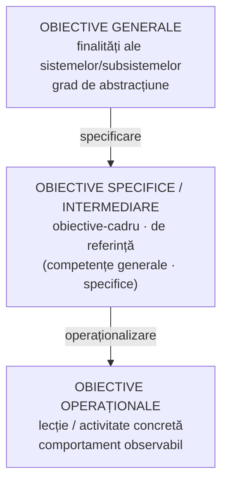

↑ [[Modulul 04 - Finalitățile educației]] · ← [[4.4 Finalitățile macro- și microstructurale]] · → [[5.1 Noțiunea de paradigmă]]

> [!abstract] Pe scurt
> - **Obiectivul educațional** este o **categorie pedagogică fundamentală**, cu funcții de **proiectare, anticipare, organizare/evaluare** și **axiologică**.
> - Obiectivele se ierarhizează pe **trei niveluri**: **generale → specifice (intermediare) → operaționale**.
> - Obiectivele specifice sunt elaborate **pe domenii psihologice** (cognitiv, afectiv, psihomotor), **pe niveluri/cicluri** și **pe discipline/module**; în reformele curriculare au devenit **obiective-cadru / competențe generale** și **obiective de referință / competențe specifice**.
> - **Obiectivele operaționale** sunt formulate de profesor pentru o activitate limitată (lecție) și descriu **comportamentul observabil** al elevilor la final — **ce vor putea face elevii**, nu ce face profesorul.
> - **Operaționalizarea** = derivarea scopurilor în obiective specifice și a acestora în obiective concrete, **observabile și măsurabile** — un act de **creație pedagogică**.

---

# PARTEA I — Ce spune manualul

## 1. Obiectivul — categorie pedagogică fundamentală (p. 142–143)

- Statutul de **categorie fundamentală** e susținut de **funcțiile** obiectivului (după I. Nicola):

| Funcția | Sens (explicitare) |
|---|---|
| **de proiectare** | stă la baza planificării activității |
| **de anticipare** | prefigurează rezultatele așteptate |
| **de organizare / evaluare** | orientează desfășurarea activității și devine criteriu de evaluare |
| **axiologică** | exprimă valorile promovate |

- Obiectivele procesului de învățământ, ca **finalități microstructurale**, sunt **divizibile în taxonomii**, după criterii semnificative pedagogic și social (p. 143).
- Modelele din literatură au o **arhitectură comparabilă**, pe câteva niveluri de generalitate; de obicei se lucrează pe **trei niveluri**: **general, specific, operațional**.

## 2. Obiectivele generale (p. 143)

> [!quote] Definiție (p. 143)
> **Obiectivele generale** sunt finalitățile **sistemelor și subsistemelor** care definesc orientările valorice specifice ale **procesului de învățământ**, în acord cu **particularitățile psihoindividuale** și **nevoile de educație** ale elevilor la diferite vârste.

- Au un anumit **grad de abstracțiune**.
- Sunt **sursa**:
  - obiectivelor **de referință** ale disciplinei;
  - obiectivelor **de evaluare** și **operaționale** elaborate de educator.
- De aici, obiectivele specifice/particulare se numesc și **intermediare** (S. Cristea).

## 3. Obiectivele specifice / intermediare (p. 143–144)

> [!quote] Definiție (p. 143)
> **Obiectivele specifice** sunt finalitățile microstructurale care definesc orientările valorice **intermediare** între obiectivele **generale** și obiectivele **concrete** ale procesului de învățământ.

- Denumiri: **obiective psihologice, obiective-cadru, obiective de referință**.
- Se elaborează:
  - **pe domenii psihologice** (**cognitiv – afectiv – psihomotor**), aplicabile la toate nivelurile, treptele, disciplinele;
  - **pe niveluri, trepte, cicluri, ani** de învățământ;
  - **pe grupuri de discipline, discipline, module, submodule, capitole, subcapitole**.
- Se obțin prin **specificarea** obiectivelor generale; au **sferă largă** de aplicare; proiectează formarea **competențelor de învățare**; descriu **competențele elevilor** după studierea unei discipline (p. 144).

### Categoriile din reformele curriculare (p. 144)

| Categoria | Ce vizează | Durată |
|---|---|---|
| **Obiective-cadru / competențe generale** | capacități și atitudini **specifice unei discipline** | **mai mulți ani** de studiu |
| **Obiective de referință / competențe specifice** | **rezultatele așteptate** ale învățării **pe fiecare an**; urmăresc **progresia** în achiziția de competențe și cunoștințe de la un an la altul | **un an** de studiu |

## 4. Obiectivele operaționale (p. 144–145)

- Obiectivul operațional exprimă **intenția de a schimba comportamentul** elevului.

> [!quote] Definiție (p. 144)
> **Obiectivele operaționale** sunt finalități microstructurale elaborate de **educator** pentru activități desfășurate într-un **context spațio-temporal limitat** (lecție, curs, seminar, laborator, cerc, oră de dirigenție, excursie didactică etc.), exprimând **ce vor fi capabili să realizeze elevii la sfârșitul lecției în plus față de început** (**comportamentul observabil**).

- **Pedagogia contemporană** optează strategic pentru **conducerea prin obiective operaționale** a activităților din lecții.

> [!quote] Operaționalizarea (p. 144)
> **Operaționalizarea** înseamnă transpunerea (derivarea) **scopurilor** procesului didactic în **obiective specifice**, iar a acestora în **obiective concrete**, prin precizarea unor componente **cognitive și/sau psihomotorii observabile și măsurabile**.

- Operaționalizarea este **opera de creație pedagogică** a fiecărui profesor (S. Cristea) (p. 145).
- **Regula de formulare**: obiectivul se referă la **ce vor putea face elevii**, **nu** la ce va face profesorul.

| ❌ Formulare greșită (activitatea profesorului) | ✅ Formulare corectă (performanța elevului) |
|---|---|
| „Obiectivul lecției mele este **să le demonstrez** elevilor relația dintre X și Y.” | „Obiectivul lecției mele este ca **elevii să devină capabili să demonstreze** relația dintre X și Y.” |

- Taxonomia obiectivelor va fi aprofundată la cursul **„Didactica generală”** (p. 145).

## 5. Concluziile modulului (p. 145)

1. Caracterul **finalist-teleologic** al acțiunii educaționale permite formatorului să **urmărească evoluția** personalității educatului.
2. Finalitățile educaționale ale R. Moldova sunt structurate în **Codul educației**.
3. **Teleologic**, finalitatea exprimă **capacitatea de proiectare** a educației.
4. **Axiologic**, finalitățile **orientează valoric** activitățile de instruire/educație.
5. Valorile fundamentale reflectă **modele culturale istoric determinate**.
6. Proiectarea **reformelor școlare** și a **pieselor curriculare** presupune valorificarea modelului finalităților microstructurale (generale – specifice/intermediare – concrete/operaționale).

## 6. Teme de reflecție și exerciții propuse de manual (p. 146–147)

- evoluția istorică a idealului; modelele umane contemporane; relațiile ideal–scopuri–obiective;
- „inventarul” marilor probleme ale lumii contemporane și locul educației în rezolvarea lor (→ [[Modulul 07 - Noile educații]]);
- rolul democrației autentice; ce ar face societatea **educativă** (program de acțiune);
- de ce depinde formularea scopurilor; utilitatea obiectivelor;
- **corectarea unor obiective operaționale greșite** (vezi rezolvarea în §12);
- niveluri și categorii de finalități; interacțiunea macro–micro;
- **exercițiu de creativitate**: obiectivele operaționale ale unei **ore de dirigenție** (gimnaziu/liceu);
- **jurnal de modul**: ce am învățat / ce pot aplica și schimba.

> [!tip] De reținut
> - **General** (sistem, cicluri) → **specific** (disciplină, an; cadru/referință; competențe) → **operațional** (lecție; comportament observabil).
> - Obiectivul operațional = **elevul** + **verb de acțiune observabil** + (condiții) + (criteriu de reușită).
> - Verbele „a cunoaște”, „a înțelege”, „a familiariza”, „a aprecia” **nu sunt operaționale** (nu descriu un comportament observabil).

---

# PARTEA II — Completări

## 7. Pedagogia prin obiective — repere istorice

| Autor | Lucrare | Contribuție |
|---|---|---|
| **Franklin Bobbitt** | *The Curriculum* (1918); *How to Make a Curriculum* (1924) | primele liste de obiective derivate din **analiza activităților** adulților — model de eficiență „industrială” |
| **Ralph W. Tyler** | *Basic Principles of Curriculum and Instruction* (1949) | „**raționamentul Tyler**”: 4 întrebări (scopuri → experiențe de învățare → organizare → evaluare); obiectivele au două dimensiuni — **comportament** și **conținut**; evaluarea verifică atingerea obiectivelor |
| **Benjamin S. Bloom** (coord.) | *Taxonomy of Educational Objectives. Handbook I: Cognitive Domain* (1956) | prima taxonomie sistematică (domeniul **cognitiv**), creată pentru a standardiza itemii de examen |
| **Robert F. Mager** | *Preparing Objectives for Programmed Instruction* (1962; ulterior *Preparing Instructional Objectives*) | modelul **operaționalizării** în 3 componente: **performanță, condiții, criteriu** |
| **D. R. Krathwohl, B. S. Bloom, B. B. Masia** | *Handbook II: Affective Domain* (1964) | taxonomia domeniului **afectiv** |
| **Robert M. Gagné** | *The Conditions of Learning* (1965; ed. revizuite) | **tipuri de rezultate ale învățării** (capacități învățate), valabile transversal pe domenii |
| **W. James Popham** | de ex. Popham & Baker, *Establishing Instructional Goals* (1970) | susținător al obiectivelor **comportamentale** clare în dezbaterile anilor '60–'70, cu legătură directă cu evaluarea |
| **G. și V. De Landsheere** | *Définir les objectifs de l'éducation* (1975) | 5 criterii de operaționalizare; sinteza taxonomiilor pentru spațiul francofon |
| **L. W. Anderson, D. R. Krathwohl** (ed.) | *A Taxonomy for Learning, Teaching, and Assessing* (2001) | **taxonomia Bloom revizuită** |

## 8. Taxonomiile pe domenii — niveluri

### 8.1. Domeniul cognitiv

| Bloom (1956) | Anderson & Krathwohl (2001) | Verbe operaționale tipice |
|---|---|---|
| 1. **Cunoaștere** | 1. **A-și aminti** | a enumera, a defini, a numi, a recunoaște |
| 2. **Înțelegere** (comprehensiune) | 2. **A înțelege** | a explica, a exemplifica, a clasifica, a rezuma, a compara |
| 3. **Aplicare** | 3. **A aplica** | a rezolva, a calcula, a utiliza, a executa |
| 4. **Analiză** | 4. **A analiza** | a distinge, a descompune, a identifica relații |
| 5. **Sinteză** | 6. **A crea** (nivelul cel mai înalt) | a elabora, a proiecta, a compune, a genera |
| 6. **Evaluare** | 5. **A evalua** | a argumenta, a judeca, a critica, a verifica |

> [!note] Comentariu
> Revizuirea din 2001 aduce trei schimbări: (1) categoriile devin **verbe** (procese), nu substantive; (2) **sinteza** devine **creare** și trece **deasupra evaluării**; (3) apare a doua dimensiune — **tipurile de cunoștințe**: **factuale, conceptuale, procedurale, metacognitive**. Rezultă un **tabel bidimensional** (4 × 6) util pentru alinierea obiectivelor, activităților și evaluării.

### 8.2. Domeniul afectiv — Krathwohl, Bloom, Masia (1964)

1. **Receptare** (atenție la stimuli, valori) → 2. **Reacție / răspuns** (participare activă) → 3. **Valorizare** (atribuirea de valoare, angajament) → 4. **Organizare** (integrarea valorilor într-un sistem) → 5. **Caracterizare** printr-o valoare sau un complex de valori (valoarea devine trăsătură de personalitate, stil de viață).

### 8.3. Domeniul psihomotor

| E. J. Simpson (1966/1972) | A. J. Harrow (1972) | R. H. Dave (1970) |
|---|---|---|
| 1. Percepție | 1. Mișcări reflexe | 1. Imitație |
| 2. Dispoziție (pregătire) | 2. Mișcări fundamentale (de bază) | 2. Manipulare |
| 3. Reacție dirijată | 3. Abilități perceptive | 3. Precizie |
| 4. Automatism (mecanism) | 4. Abilități (calități) fizice | 4. Articulare (coordonare) |
| 5. Reacție complexă | 5. Mișcări de îndemânare | 5. Naturalizare |
| 6. Adaptare | 6. Comunicare nonverbală | |
| 7. Creare | | |

### 8.4. Taxonomii „globale”

| Autor | Categorii |
|---|---|
| **R. M. Gagné** | **informații verbale**, **deprinderi intelectuale** (discriminări, concepte, reguli, reguli de ordin superior), **strategii cognitive**, **deprinderi motorii**, **atitudini** |
| **M. D. Merrill** — *Component Display Theory* (1983) | matrice **performanță** (a-și aminti, a utiliza, a descoperi) × **tip de conținut** (fapte, concepte, proceduri, principii) |
| **L. D'Hainaut** (1977) | taxonomie a **operațiilor intelectuale** (reproducere, conceptualizare, aplicare, explorare, mobilizare, rezolvare de probleme) (de verificat denumirile exacte) |
| **J. Biggs & K. Collis** — taxonomia **SOLO** (1982) | calitatea înțelegerii: prestructural → unistructural → multistructural → relațional → abstract extins |

## 9. Tehnici de operaționalizare

### 9.1. R. F. Mager (1962) — trei componente

| Componentă | Întrebare | Exemplu |
|---|---|---|
| **Performanța** (comportamentul) | Ce va face elevul? | *să rezolve ecuații de gradul I* |
| **Condițiile** | În ce condiții? | *fără calculator, pe fișa de lucru* |
| **Criteriul** | Cât de bine? | *cel puțin 4 din 5 corect, în 10 minute* |

### 9.2. G. De Landsheere (1975) — cinci elemente

1. **Cine** produce comportamentul (elevul, grupul);
2. **ce comportament observabil** (verb de acțiune);
3. **ce produs / performanță** rezultă;
4. **în ce condiții** se manifestă comportamentul;
5. **pe baza căror criterii** se apreciază reușita.

### 9.3. Procedura uzuală în literatura română (I. Jinga, I. T. Radu ș.a.)

- Enunțul începe cu **„Elevii vor fi capabili să…”** (sau „La sfârșitul lecției, elevii vor…”);
- **un singur verb de acțiune** observabil per obiectiv;
- **conținutul** asupra căruia se acționează;
- **condițiile** (resurse, timp) și **nivelul minim de reușită** (criteriul).

> [!note] Comentariu — obiective operaționale și competențe
> În curriculumul actual al R. Moldova (centrat pe **competențe**, conform Codului Educației, art. 11), proiectarea lecției pleacă de la **competențele specifice / unitățile de competență** ale curriculumului disciplinar, din care profesorul **derivă** obiectivele operaționale ale lecției. Obiectivul operațional nu dispare, ci devine **pasul concret** spre formarea unei competențe (→ [[Modulul 10 - Proiectarea, realizarea și evaluarea activității educative]]).

## 10. Corecturi la lista de taxonomii din manual (p. 130)

| În manual | Corect / precizare |
|---|---|
| S. B. Bloom, **1951** | **Benjamin S. Bloom** (coord.), **1956** (*Handbook I*) |
| De **Blook**, 1973 | **A. De Block** (taxonomie a obiectivelor, spațiul flamand; anul — de verificat) |
| J. E. Simpson, **1967** | **Elizabeth J. Simpson**, 1966 (raport) / 1972 (publicare) |
| H. Dave, **1969** | **R. H. Dave**, **1970** (în R. J. Armstrong ed., *Developing and Writing Behavioral Objectives*) |
| S. J. Bruner, 1973; L. I. Smith, 1970 | **neidentificate** ca autori de taxonomii (probabil erori de transcriere) |
| R. D. Krathwohl, 1964 | **David R. Krathwohl**, B. S. Bloom, B. B. Masia, 1964 |
| E. N. Gronlund, 1970 | **Norman E. Gronlund**, *Stating Behavioral Objectives for Classroom Instruction* (1970) — ghid de formulare, nu taxonomie afectivă proprie |

## 11. Critici ale pedagogiei prin obiective

| Autor | Lucrare | Critica |
|---|---|---|
| **Elliot W. Eisner** | „Instructional and expressive educational objectives” (1969) | în artă și în educația creativă, rezultatele nu pot fi prestabilite; propune **obiective expresive** (situații de învățare cu rezultat deschis) |
| **Lawrence Stenhouse** | *An Introduction to Curriculum Research and Development* (1975) | modelul pe obiective **fragmentează** cunoașterea și reduce educația la **instruire**; propune **modelul procesual** (profesorul-cercetător) |
| **John Dewey** (antecedent) | *Democracy and Education* (1916) | scopurile impuse din exterior **rigidizează** activitatea; scopurile apar din experiență |
| critici generale | — | **atomizarea** învățării în sute de micro-obiective; privilegierea a ceea ce e **ușor de măsurat**; dificultatea operaționalizării domeniului **afectiv**; riscul de „a preda pentru test” |

- Răspunsul pedagogiei contemporane: **competențele** (integrare cunoștințe–abilități–atitudini), **alinierea constructivă** (J. Biggs: obiective – activități – evaluare coerente) și combinarea obiectivelor **operaționale** cu cele **expresive/deschise**.

## 12. Rezolvarea exercițiului din manual (p. 146)

| Obiectiv propus în manual | Greșeala | Variantă corectată |
|---|---|---|
| *familiarizarea elevilor cu opera literară a lui M. Eminescu* | formulat ca **activitate a profesorului**; verb neobservabil; prea general (nivel de scop) | *Elevii vor fi capabili să numească cel puțin trei poezii eminesciene studiate și să indice tema fiecăreia.* |
| *să demonstreze înțelegere a conceptului de atom* | „înțelegere” nu e observabilă; nu se precizează cum se manifestă | *Elevii vor fi capabili să descrie, pe baza unui desen, structura atomului (nucleu, electroni), fără greșeli de terminologie.* |
| *respectarea normelor literare în vorbire* | substantiv (nu comportament); fără condiții și criteriu; nivel de obiectiv general/afectiv | *În discuția pe tema lecției, elevii vor formula cel puțin trei enunțuri fără abateri de la normele literare de acord.* |
| *să comenteze poezia* | lipsesc conținutul concret, condițiile, criteriul | *Elevii vor fi capabili să comenteze, în 5–7 enunțuri, două figuri de stil din poezia „…”, precizând rolul lor expresiv.* |
| *să verific cunoștințele* | **acțiunea profesorului**, nu a elevului | *Elevii vor rezolva corect cel puțin 7 din cei 10 itemi ai testului de verificare.* |
| *să motivez elevii pentru activitate* | **acțiunea profesorului**; ține de strategie, nu de obiectiv | *(se transformă în obiectiv afectiv observabil)* *Elevii vor participa voluntar la activitatea de grup, prezentând fiecare o idee proprie.* |
| *să valorifice cunoștințele teoretice în practică* | prea general; nu precizează **ce** cunoștințe, **ce** practică | *Elevii vor fi capabili să calculeze aria unei camere reale folosind formula ariei dreptunghiului, cu măsurători efectuate de ei.* |

## 13. Comentariu critic

> [!warning] Observații critice
> - **Tratare sumară**: manualul definește cele trei niveluri, dar **nu prezintă nicio taxonomie** concretă (niveluri Bloom, Krathwohl etc.) și nici **tehnica operaționalizării** (Mager, De Landsheere), trimițând la cursul de *Didactica generală* — deși propune la final un exercițiu care le presupune.
> - **Confuzie terminologică obiective / competențe**: formulele „obiective-cadru / **competențe generale**” și „obiective de referință / **competențe specifice**” le tratează ca **sinonime**. În realitate, trecerea de la obiective la competențe (curriculumul R. Moldova 2010) înseamnă o **schimbare de paradigmă** (de la comportamente observabile izolate la capacități integrate de a acționa în situații).
> - **Citat fără sursă** (p. 144): definiția obiectivelor de referință apare între ghilimele, **fără trimitere** (provine din documentele curriculare românești de la sfârșitul anilor '90 — de verificat).
> - **Operaționalizarea** e limitată la componente „cognitive și/sau psihomotorii” — domeniul **afectiv** e omis, deși dirigenția (tema exercițiului de creativitate) vizează tocmai obiective **afective**.
> - Concluzia „în plan axiologic fundamentale ce reflectă modele culturale…” (p. 145) este **gramatical defectă** (lipsește subiectul — „valorile”).
> - Concluzia 2 (finalitățile R. Moldova „structurate în Codul educației”) contrastează cu faptul că manualul **nu citează** textul efectiv al art. 6 și art. 11 (vezi [[4.4 Finalitățile macro- și microstructurale]] §11).
> - Funcțiile obiectivului (p. 142–143) sunt doar enumerate, fără explicații; trimiterea [7] (Nicola) nu indică pagina.

## 14. Întrebări de autoverificare

1. De ce obiectivul educațional este considerat o categorie pedagogică fundamentală? Numiți funcțiile lui.
2. Definiți și comparați obiectivele generale, specifice și operaționale.
3. Pe ce criterii se elaborează obiectivele specifice/intermediare?
4. Ce deosebește obiectivele-cadru de obiectivele de referință? Ce le-a luat locul în curriculumul actual?
5. Ce este operaționalizarea? Care sunt cele trei componente ale unui obiectiv după R. Mager?
6. Enumerați cele cinci criterii de operaționalizare ale lui G. De Landsheere.
7. Prezentați nivelurile taxonomiei lui Bloom și modificările aduse de Anderson & Krathwohl (2001).
8. Care sunt nivelurile domeniului afectiv (Krathwohl) și ale domeniului psihomotor (Simpson sau Harrow)?
9. Formulați trei obiective operaționale corecte pentru o oră de dirigenție pe tema „Toleranța” (unul cognitiv, unul afectiv, unul comportamental).
10. Ce critici au adus Eisner și Stenhouse pedagogiei prin obiective?

## Surse

- Manual, p. 142–147; Cristea, S. (2010). *Fundamentele pedagogice. Teoria generală a educației*, vol. I; Nicola, I. (2003). *Tratat de pedagogie școlară*; Guțu, V. (2001). „Obiectivele educaționale: clarificări conceptuale și metodologice”, *Didactica Pro*, nr. 6 (10).
- Bloom, B. S. (ed.) (1956). *Taxonomy of Educational Objectives. Handbook I: Cognitive Domain*. New York: David McKay.
- Krathwohl, D. R., Bloom, B. S., Masia, B. B. (1964). *Taxonomy of Educational Objectives. Handbook II: Affective Domain*. New York: David McKay.
- Anderson, L. W., Krathwohl, D. R. (eds.) (2001). *A Taxonomy for Learning, Teaching, and Assessing: A Revision of Bloom's Taxonomy of Educational Objectives*. New York: Longman.
- Simpson, E. J. (1972). *The Classification of Educational Objectives in the Psychomotor Domain*. Washington, DC: Gryphon House.
- Harrow, A. J. (1972). *A Taxonomy of the Psychomotor Domain*. New York: David McKay.
- Dave, R. H. (1970). „Psychomotor levels”. În: Armstrong, R. J. (ed.), *Developing and Writing Behavioral Objectives*. Tucson: Educational Innovators Press.
- Mager, R. F. (1962). *Preparing Objectives for Programmed Instruction*. San Francisco: Fearon.
- Tyler, R. W. (1949). *Basic Principles of Curriculum and Instruction*. Chicago: University of Chicago Press.
- Gagné, R. M. (1965). *The Conditions of Learning*. New York: Holt, Rinehart & Winston.
- Merrill, M. D. (1983). „Component Display Theory”. În: Reigeluth, C. M. (ed.), *Instructional-Design Theories and Models*. Hillsdale, NJ: Erlbaum.
- De Landsheere, V., De Landsheere, G. (1975). *Définir les objectifs de l'éducation*. Paris: PUF.
- Gronlund, N. E. (1970). *Stating Behavioral Objectives for Classroom Instruction*. New York: Macmillan.
- Biggs, J. B., Collis, K. F. (1982). *Evaluating the Quality of Learning: The SOLO Taxonomy*. New York: Academic Press.
- Eisner, E. W. (1969). „Instructional and expressive educational objectives: their formulation and use in curriculum”. În: Popham, W. J. et al., *Instructional Objectives* (AERA Monograph Series on Curriculum Evaluation, 3). Chicago: Rand McNally.
- Stenhouse, L. (1975). *An Introduction to Curriculum Research and Development*. London: Heinemann.
- Codul Educației al Republicii Moldova nr. 152/2014, art. 11.
