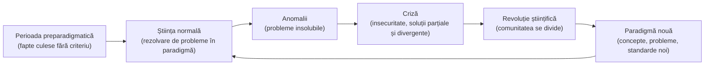

↑ [[Modulul 05 - Paradigmele pedagogiei și cercetarea pedagogică]] · ← [[4.5 Ierarhizarea și clasificarea obiectivelor]] · → [[5.2 Tipologia paradigmelor educaționale]]

> [!abstract] Pe scurt
> - După **Thomas Kuhn**, știința **nu progresează pur cumulativ**, ci prin **alternanța** dintre perioade de **știință normală** (cercetare în interiorul unei paradigme acceptate) și **revoluții științifice** (înlocuirea paradigmei).
> - **Paradigma** = realizare științifică recunoscută care, **pentru o perioadă**, oferă unei **comunități științifice** modele de probleme și de soluții, într-un cadru de **reguli și standarde**.
> - Paradigma **selectează faptele relevante**, definește domeniul, dă criteriul de alegere a problemelor „rezolvabile” și **orientează** cercetarea fără a o reglementa strict.
> - Mecanismul schimbării: **anomalie → criză** (multe soluții parțiale și divergente) → **paradigmă nouă**; o paradigmă e declarată depășită **doar când alta e gata să-i ia locul**.
> - Schimbarea de paradigmă modifică **sensul conceptelor**, **tipul de probleme** acceptate și chiar **percepția despre lume** a cercetătorilor; noua paradigmă nu e „neapărat mai bună”, ci evaluată după **alte criterii**.

---

# PARTEA I — Ce spune manualul

## 0. Deschiderea modulului (p. 148)

- **Motto-uri**: o maximă atribuită lui **A. Gide** despre dorința de a ști care se naște din îndoială și una atribuită lui **A. Manole** despre dreptul fundamental de a căuta.
- **Competențe vizate**: definirea conceptelor de bază; explicarea condițiilor în care **paradigmele preexistente sunt distruse** și apar teorii noi; identificarea **motivelor** pentru care oamenii se implică în cercetare; aprecierea **impactului revoluționar** al schimbării de paradigmă; **studiu comparativ** al clasificărilor paradigmelor; analiza conceptului, tipologiei, structurii și metodologiei **cercetării pedagogice**.
- **Concepte de bază**: paradigmă, paradigmă educațională, paradigmă clasică, paradigmă contemporană, cercetare pedagogică, tipologia cercetării, metodă de cercetare pedagogică, metodologia cercetării pedagogice.

## 1. Punctul de plecare: știința nu evoluează strict cumulativ (p. 149)

- **Th. Kuhn** (trimitere: *The Structure of Scientific Revolutions*, ed. 2012, p. 24), preocupat de modul în care evoluează cunoașterea științifică, constată că dezvoltarea științei **nu poate fi descrisă strict ca acumulare**.
- Cunoașterea pare să se sprijine pe **moduri foarte diferite de a vedea lumea**, aflate **în competiție**.
- Observația și experiența reduc treptat diferențele dintre aceste „crezuri științifice”, dar în orice mod de gândire științific rămâne un **element arbitrar**, un fel de **„accident istoric”** (factori personali și istorici).

## 2. Știința normală și apariția paradigmelor (p. 149)

- **Știința normală** = cercetare **solid întemeiată** pe realizări științifice pe care o comunitate le consideră **fundamentale** pentru practica ei ulterioară.
- Aceste realizări devin paradigme dacă îndeplinesc **două condiții**:
  1. sunt **suficient de importante** încât să atragă **adepți** dinspre alte direcții de studiu concurente;
  2. sunt **suficient de „deschise”**, lăsând **destule probleme de rezolvat** în aceeași direcție.

> [!quote] Definiție (p. 149; reluată în concluzii, p. 171)
> **Paradigmele** sunt **realizări științifice** care, **pentru o perioadă de timp**, devin **modele de soluții pentru o comunitate științifică**, permițând desfășurarea activității științifice într-un **cadru de reguli și standarde bine stabilite**.

## 3. Trăsăturile paradigmei (p. 149–150)

| Trăsătură | Explicație |
|---|---|
| **Concepție despre lume** | fiecare paradigmă structurează o viziune despre lume și viață, diferită de a altor paradigme asupra aceleiași probleme |
| **Putere de regenerare** | o face mai mult sau mai puțin **adaptabilă** la realitatea științifică → îi asigură **viabilitate** în comunitate |
| **Relativitatea „progresului”** | paradigma nouă **nu e neapărat mai bună** decât cea veche: criteriile de apreciere diferă și țin de **cadrul conceptual** propriu fiecăreia |
| **Semn de maturitate** | existența paradigmelor într-un domeniu arată **maturizarea** științei respective |
| **Model de evoluție** | științele evoluează prin **trecerea de la o paradigmă la alta**, prin **revoluții** |

## 4. Funcțiile paradigmei (p. 150)

- **Fără paradigmă**, toate faptele observate par **la fel de relevante** → culegere dezordonată de date, specifică **începuturilor** oricărei științe; dificultatea stă în **interpretare**.
- Paradigma oferă **criterii de selecție, evaluare și judecare a faptelor**.
- Pentru a fi acceptată ca paradigmă, o teorie trebuie să fie **mai bună decât alternativele**, deși **nicio teorie nu explică toate faptele** unui domeniu.
- Orice paradigmă nouă aduce o **definire mai bună a domeniului de studiu**; cercetătorii lucrează cu **concepte deja definite**.
- În știința normală, descoperirile înseamnă **articularea fenomenelor** în cadrele trasate de paradigmă. Paradigma **forțează aprofundarea** domeniului până la detalii altfel de neimaginat.

## 5. Cele trei direcții ale cercetării în știința normală (p. 150–151)

| Direcția | Conținut |
|---|---|
| **1. Faptele relevante** | studiul clasei de fapte pe care paradigma le consideră semnificative pentru natura lucrurilor, cu mijloace tot mai perfecționate |
| **2. Legi cantitative** | căutarea legilor cantitative care leagă faptele între ele |
| **3. Regularități calitative** | căutarea regularităților calitative; paradigma se **extinde** la alte realități și generează **noi arii de interes** |

- O mare parte din activitatea teoretică constă în **folosirea teoriei existente pentru a prezice fapte** cu valoare reală — lucru, în realitate, dificil.

## 6. Știința normală ca rezolvare de probleme (p. 151)

- Rezolvarea problemelor cere **ingeniozitate**, dar aceasta presupune ca problema **să aibă soluție** — soluția stă în **aplicarea paradigmei**.
- Paradigma oferă comunității un **criteriu de alegere a problemelor**: problemele care nu au soluție în paradigma acceptată sunt **descurajate și respinse**.
- O problemă e **științifică** dacă nu doar are soluție, ci soluția e **acceptabilă conceptual și teoretic**. Cercetătorul trebuie să satisfacă cerințele **conceptuale, teoretice, instrumentale și metodologice** ale științei sale.

> [!tip] De reținut — motivele cercetării după Kuhn (p. 151; reluate la p. 171)
> 1. **dorința de a fi util**;
> 2. **pasiunea de a explora** zone noi ale cunoașterii;
> 3. **speranța de a găsi o ordine** în lucruri;
> 4. **tendința de a testa** cunoașterea existentă.
>
> Odată intrat în cercetare, omul e motivat mai ales de dorința de a arăta că poate rezolva o problemă **cum nimeni n-a mai făcut-o**.

## 7. Paradigma ca ghid, nu ca regulament (p. 151–152)

- Paradigmele împărtășite **ghidează** cercetarea **fără a conține reguli stricte**.
- Toți învață aceeași teorie, dar **nu toți o aplică la fel**: specialiștii se deosebesc prin **experiența** dobândită în modul de utilizare a paradigmei.

## 8. Anomalia, criza și apariția noilor teorii (p. 152)

- **Anomalia**: probleme **insolubile** în paradigmă → e ca și cum natura ar fi „încălcat” așteptările paradigmei.
- Cercetătorii adună **date noi** și încearcă să vadă natura **din altă perspectivă**. Faptul anormal **nu are inițial statut științific**; descoperirea cere o **conceptualizare** care să permită asimilarea teoretică.
- Noutatea întâmpină **rezistența paradigmei** existente, deoarece contrazice așteptările practicii curente.
- Teoriile noi presupun **distrugerea paradigmelor preexistente** și schimbări majore în **tipul de probleme** și în **tehnici**. Sunt precedate de **insecuritate** și de un **sentiment al eșecului** în rezolvarea problemelor → **criza**. Noua teorie apare ca **rezolvare a crizei**.
- **Principiul substituției**: o paradigmă e declarată depășită **doar dacă alta e pregătită să-i ia locul**.
- **Condiția suplimentară** pentru ca anomalia să producă criză: apariția unui **număr mare de soluții parțiale și divergente** la aceeași problemă. Noua paradigmă construiește teoria **pe fundamente noi** care să **integreze** aceste soluții.

## 9. Revoluția științifică și impactul ei (p. 152–153)

- Revoluția începe prin **divizarea comunității** cu privire la validitatea paradigmei; alegerea între paradigme concurente separă cercetătorii asemenea celor care au **moduri diferite de a înțelege viața**.
- Paradigma nouă aduce un **tip nou de predicție**, imposibil în cea veche.
- **Impactul revoluționar**:
  - se schimbă **semnificația conceptelor centrale**;
  - se schimbă **problemele acceptate** ca legitime;
  - cercetătorul își însușește **teoria, metodele și standardele** noii paradigme **„într-o mixtură inextricabilă”**.
- La schimbarea paradigmei, **percepția despre lume** a oamenilor de știință se schimbă radical. Paradigmele determină **experiențele prioritare** ale specialiștilor → schimbarea lor duce la schimbări **în practica vieții**. După revoluție, cercetătorii **„trăiesc într-o nouă realitate”**.

> [!tip] De reținut (concluziile modulului, p. 171–172)
> - Paradigma = model de soluții pentru o comunitate științifică, pe o perioadă; aduce o **definire mai bună a domeniului**.
> - Noile teorii presupun **distrugerea** paradigmelor vechi și schimbarea problemelor și tehnicilor științei normale.
> - Paradigma veche cade **doar când există o alternativă**; noua teorie se construiește pe **fundamente noi**.

---

# PARTEA II — Completări

## 10. Thomas S. Kuhn și lucrarea sa

- **Thomas S. Kuhn** (1922–1996), fizician devenit istoric și filosof al științei. *The Structure of Scientific Revolutions* apare în **1962** (în seria *International Encyclopedia of Unified Science*, University of Chicago Press); ediția a II-a, **1970**, adaugă o **Postfață** esențială; ediția aniversară **2012** (a IV-a, cu introducere de **Ian Hacking**) e cea citată de manual.
- **Traducere românească**: *Structura revoluțiilor științifice*, trad. **Radu J. Bogdan**, prefață de **Mircea Flonta**, Humanitas, București, **2008** (ediția a II-a; o ediție anterioară a apărut la Editura Științifică și Enciclopedică — anul de verificat).
- Kuhn povestește în prefață că ideea de paradigmă i s-a conturat în 1958–1959, la Center for Advanced Study in the Behavioral Sciences (Stanford), observând că **cercetătorii din științele sociale** dispută **fundamentele** disciplinei mult mai mult decât fizicienii — adică sunt, în bună parte, într-o stare **preparadigmatică**.

> [!note] Comentariu
> Detaliul de mai sus e important pentru acest modul: **Kuhn însuși nu era convins că științele sociale (deci și pedagogia) au paradigme în sensul strict**. Aplicarea termenului la educație (§5.2) e o **extindere metaforică**, foarte productivă, dar trebuie asumată ca atare.

## 11. Ambiguitatea termenului „paradigmă” și precizările lui Kuhn

- **Margaret Masterman**, „The Nature of a Paradigm” (în Lakatos & Musgrave, eds., *Criticism and the Growth of Knowledge*, 1970), a identificat **21 de sensuri** ale termenului în cartea lui Kuhn, grupate în sensuri **metafizice**, **sociologice** și **artefactuale/construcționale**.
- Ca răspuns, în **Postfața din 1970** Kuhn distinge:
  - **matricea disciplinară** (*disciplinary matrix*) — ansamblul împărtășit de o comunitate: **generalizări simbolice**, **modele/angajamente metafizice**, **valori** (precizie, simplitate, coerență), **exemplare**;
  - **exemplarele** (*exemplars*) — soluțiile concrete, model, învățate de studenți (problemele-tip din manuale).
- **Incomensurabilitatea**: paradigmele succesive folosesc concepte cu sens diferit și standarde diferite, deci nu pot fi comparate „punct cu punct” pe o scală comună — de aici afirmația manualului că paradigma nouă „nu e neapărat mai bună”.

> [!note] Comentariu
> Termenul „**matrice disciplinară**” reapare la **Elena Joița** (paradigma identității, [[5.2 Tipologia paradigmelor educaționale]]) — legătura directă cu Postfața lui Kuhn nu e explicitată în manual.

## 12. Etimologie și istoria cuvântului

- Gr. ***parádeigma*** = „model, exemplu, tipar” (de la *paradeiknynai* = „a arăta alături”). La **Platon**, ideile sunt paradigmele (modelele) lucrurilor sensibile.
- În **gramatică**, „paradigmă” = modelul de flexiune (ex. declinarea unui substantiv) — sens de la care pleacă și Kuhn (exemplarul care se „conjugă” pe alte cazuri).
- După 1962, termenul a intrat în limbajul comun („schimbare de paradigmă” / *paradigm shift*), adesea **banalizat** (orice schimbare importantă).

## 13. Alte modele ale dezvoltării științei (pentru comparație)

| Autor | Lucrarea | Idee centrală | Diferența față de Kuhn |
|---|---|---|---|
| **Karl R. Popper** | *Logik der Forschung* (1934; engl. *The Logic of Scientific Discovery*, 1959) | **falsificabilitatea** ca criteriu de demarcație; știința avansează prin **conjecturi și infirmări** | normativ, logic; pentru Popper, „știința normală” e un pericol (dogmatism), nu starea firească |
| **Imre Lakatos** | „Falsification and the Methodology of Scientific Research Programmes” (1970) | **programe de cercetare**: **nucleu dur** protejat de o **centură de ipoteze auxiliare**; programe **progresive** vs **degenerative** | admite **coexistența** programelor rivale și criterii raționale de alegere |
| **Paul Feyerabend** | *Against Method* (1975) | **anarhism metodologic** („anything goes”) | respinge existența unei metode unice |
| **Larry Laudan** | *Progress and Its Problems* (1977) | **tradiții de cercetare**; progresul = capacitate sporită de **rezolvare a problemelor** | tradițiile pot coexista și se pot schimba gradual |
| **Gaston Bachelard** | *La formation de l'esprit scientifique* (1938) | **ruptura epistemologică**, **obstacolele epistemologice** | precursor al ideii de discontinuitate |

> [!note] Comentariu
> Pentru pedagogie, modelul **Lakatos** (programe concurente care coexistă) descrie probabil mai bine situația reală decât cel kuhnian (o paradigmă dominantă): în educație coexistă mereu behaviorism, cognitivism, constructivism, pedagogii critice etc. De aici și ideea unei **pedagogii „postparadigmatice”** (O. Dandara, în [[5.2 Tipologia paradigmelor educaționale]]).

## 14. „Războiul paradigmelor” în cercetarea educațională

- **N. L. Gage**, „The Paradigm Wars and Their Aftermath” (*Educational Researcher*, 1989) — descrie confruntarea din anii 1970–1980 dintre cercetarea **cantitativă** (pozitivistă) și cea **calitativă** (interpretativă, critică) în educație.
- **E. Guba** (ed.), *The Paradigm Dialog* (1990) și **Guba & Lincoln**, „Competing Paradigms in Qualitative Research” (în Denzin & Lincoln, eds., *Handbook of Qualitative Research*, 1994) definesc paradigma de cercetare prin trei întrebări:
  - **ontologică** — ce este realitatea?
  - **epistemologică** — ce relație există între cercetător și ceea ce cunoaște?
  - **metodologică** — cum putem cunoaște?
- Detalii despre paradigmele de cercetare (pozitivistă, interpretativă, critică, pragmatică): [[5.2 Tipologia paradigmelor educaționale]] și [[5.3 Cercetarea pedagogică - noțiune și tipologie]].

## 15. Exemple istorice de schimbări de paradigmă

| În științele naturii (exemplele lui Kuhn) | Analogii propuse în educație (de discutat) |
|---|---|
| astronomia ptolemeică → **copernicană** | școala centrată pe profesor → **pedagogia centrată pe copil** (Educația nouă, sec. XX) |
| teoria flogisticului → chimia lui **Lavoisier** (oxigenul) | **behaviorismul** (învățarea ca asociere stimul–răspuns) → **cognitivismul** (anii 1960, „revoluția cognitivă”) |
| mecanica newtoniană → **relativitatea einsteiniană** | **transmiterea** de cunoștințe → **construcția** cunoașterii (constructivism, Piaget, Vîgotski) |
|  | **pedagogia obiectivelor** → **pedagogia competențelor** (anii 1990–2000) |

> [!warning] Comentariu critic
> - **Fidelitate față de Kuhn**: conspectul manualului e în general **corect**, dar este o **parafrază compactă** a capitolelor II–XII ale cărții, **fără trimiteri de pagină** (în afară de „p. 24”) și fără a semnala că e un rezumat al lui Kuhn, nu o elaborare proprie.
> - **Simplificare — cele trei direcții ale științei normale** (p. 150–151): la Kuhn (cap. III) cele trei clase de probleme sunt: **determinarea faptelor semnificative**, **potrivirea faptelor cu teoria** și **articularea teoriei** (constante, legi cantitative, reformulări). Manualul transformă a doua și a treia în „legi cantitative” și „regularități calitative”, ceea ce **deformează** distincția.
> - **Lipsesc conceptele-cheie** ale lui Kuhn: **incomensurabilitate**, **matrice disciplinară**, **exemplar**, **perioadă preparadigmatică**, **„puzzle-solving”** (rezolvarea de „enigme”), comparația cu **schimbarea de gestalt**.
> - **Nu se discută** dacă pedagogia are paradigme în sens kuhnian (Kuhn însuși se îndoia pentru științele sociale) — omisiune importantă pentru un modul care aplică termenul la educație.
> - **Nicio perspectivă critică** asupra lui Kuhn: acuzația de **relativism** și **iraționalism** (Popper, Lakatos), ambiguitatea termenului (Masterman).
> - **Bibliografie**: numele e scris „Kuhn, **S. Thomas**” (corect: **Thomas S. Kuhn**) și titlul „*scietific*” (corect: *scientific*).
> - **Motto-urile** (A. Gide, A. Manole) sunt date fără sursă; atribuirea lor e **de verificat**.
> - Ortografie veche („sînt”, „rîn”) și diacritice cu sedilă (ş, ţ), specifice textului.

## 16. Întrebări de autoverificare

1. Definiți paradigma în sensul lui Th. Kuhn. Ce două condiții trebuie să îndeplinească o realizare științifică pentru a deveni paradigmă?
2. Ce este „știința normală” și de ce Kuhn o descrie ca activitate de rezolvare de probleme?
3. Ce funcții îndeplinește paradigma în raport cu faptele și cu problemele de cercetare?
4. Numiți motivele pentru care oamenii se implică în cercetare, după Kuhn.
5. Descrieți succesiunea anomalie → criză → revoluție → paradigmă nouă. Ce condiție face ca o anomalie să ducă la criză?
6. De ce o paradigmă nouă „nu este neapărat mai bună” decât cea veche? Explicați prin conceptul de incomensurabilitate.
7. Comparați modelul lui Kuhn cu cel al lui Popper și cu cel al lui Lakatos.
8. Poate fi vorba de paradigme în pedagogie în sensul strict kuhnian? Argumentați pro și contra.
9. Dați un exemplu de „schimbare de paradigmă” în educație și arătați ce concepte și ce probleme s-au schimbat.

## Surse

- Manual, p. 148–153, 171–172.
- Kuhn, T. S. (1962/1970/2012). *The Structure of Scientific Revolutions*. Chicago: University of Chicago Press. Trad. rom.: *Structura revoluțiilor științifice*, trad. R. J. Bogdan, pref. M. Flonta. București: Humanitas, 2008.
- Masterman, M. (1970). The Nature of a Paradigm. În I. Lakatos, A. Musgrave (eds.), *Criticism and the Growth of Knowledge*. Cambridge University Press.
- Lakatos, I. (1970). Falsification and the Methodology of Scientific Research Programmes. În Lakatos & Musgrave (eds.), op. cit.
- Popper, K. R. (1934/1959). *The Logic of Scientific Discovery*. London: Hutchinson.
- Feyerabend, P. (1975). *Against Method*. London: NLB.
- Laudan, L. (1977). *Progress and Its Problems*. Berkeley: University of California Press.
- Gage, N. L. (1989). The Paradigm Wars and Their Aftermath. *Educational Researcher*, 18(7), 4–10.
- Guba, E. G., Lincoln, Y. S. (1994). Competing Paradigms in Qualitative Research. În N. K. Denzin, Y. S. Lincoln (eds.), *Handbook of Qualitative Research*. Thousand Oaks: Sage.
- Joița, E. (2009). *Știința educației prin paradigme*. Iași: Institutul European.
