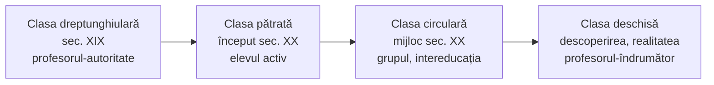

↑ [[Modulul 05 - Paradigmele pedagogiei și cercetarea pedagogică]] · ← [[5.1 Noțiunea de paradigmă]] · → [[5.3 Cercetarea pedagogică - noțiune și tipologie]]

> [!abstract] Pe scurt
> - **Paradigmele educaționale** = realizări ale științelor educației care funcționează ca **modele** după care se ghidează cadrele didactice, într-un cadru de **reguli și standarde**.
> - Numărul mare de paradigme se explică prin **complexitatea educației** și prin legăturile ei **inter- și transdisciplinare**; de aici și ideea unei **pedagogii „postparadigmatice”** (O. Dandara).
> - **Clasificări prezentate**: **C. Bârzea** — patru paradigme ale clasei (**dreptunghiulară, pătrată, circulară, deschisă**); **B. Wurtz** — paradigma **clasică vs modernă** (tabelul 3); **E. Joița** — **zece paradigme** ale pedagogiei ca știință; **S. Cristea** — trei criterii (**polar, multinivelar, istoric**); **M. Cojocaru-Borozan** — paradigma **culturii emoționale** a profesorului (model constructivist).
> - **Concluziile** modulului adaugă tripleta **clasică**: **tehnologică/rațională, interpretativ-simbolică, socio-critică**, și paradigmele **constructiviste** ca paradigme **contemporane** — clasificare **neprezentată în corpul textului**.
> - A adopta o paradigmă înseamnă a adopta un **tip de cercetare**, un **mod de a concepe natura umană** și un **mod de a face educație**.

---

# PARTEA I — Ce spune manualul

## 1. Contextul și definiția (p. 153)

- Epoca actuală pune pe primul plan **resursele umane** — **inteligența, creativitatea, adaptabilitatea** — ca resurse-cheie ale unei dezvoltări care integrează **pacea, economia, mediul, justiția socială și democrația** (UNESCO, *Stratégie à moyen terme 1996–2001*).
- Proiectarea și realizarea educației actuale se întemeiază pe **paradigma educațională contemporană**, definită prin **contrast** cu cea **tradițională**.

> [!quote] Definiție (p. 153; reluată la p. 172)
> **Paradigmele educaționale** sunt **realizările din domeniul științelor educației** care se prezintă drept **modele educaționale** după care se ghidează **cadrele didactice** în activitatea educativă, într-un **cadru de reguli și standarde** bine stabilite.

> [!tip] De reținut
> Definiția **transpune** definiția lui Kuhn ([[5.1 Noțiunea de paradigmă]]) din planul **comunității științifice** în planul **practicii didactice**: „comunitatea” devine corpul profesoral, iar „modelul de soluții” devine **model educațional**.

## 2. Abordarea transdisciplinară și pedagogia „postparadigmatică” (p. 154)

- Deschiderea științelor educației spre **transdisciplinaritate** duce la un **model sintetic**, construit din elementele **compatibile** ale diverselor teorii, pentru a asigura **prospectivitatea** domeniului.
- **O. Dandara** (2014, p. 17):
  - științele educației rămân **o știință a modelelor**, datorită rolului **normativității** în educație;
  - dar, în condițiile **diversității** teoriilor și practicilor, modelul **nu mai e dedus dintr-o singură teorie dominantă**;
  - există argumente pentru o **pedagogie postparadigmatică**;
  - normativitatea îi păstrează paradigmei **rolul tradițional** de concept-cheie, dar îi **schimbă conotația**.
- **Criterii multiple** de clasificare. Numărul mare de paradigme se explică prin:
  1. **complexitatea** deosebită a fenomenului educațional;
  2. **conexiunile** multiple — **interdisciplinare și transdisciplinare** — ale educației.

## 3. Clasificarea lui Cezar Bârzea: paradigmele spațiului clasei (p. 154–155)

Bârzea (*Arta și știința educației*, p. 11) distinge **patru paradigme fundamentale** ale contextului educațional școlar, numite după **forma/organizarea spațiului clasei**:

| Paradigma | Perioada | Organizarea spațiului | Accent / relații | Repere |
|---|---|---|---|---|
| **1. Clasa dreptunghiulară** | sec. XIX | catedra **în fața** șirurilor de bănci | **autoritatea absolută** a profesorului; elevii **dependenți** de cunoașterea, sarcinile și indicațiile lui; predarea **supralicitată** în defavoarea învățării; **ierarhie rigidă** | pedagogia tradițională |
| **2. Clasa pătrată** | început de sec. XX | catedra **la nivelul** mobilierului elevilor; bănci **mobile** | accentul trece **de la profesor la elev** și **de la predare la învățare**; grupări variate, **mai multă libertate** | **pedagogiile active**, centrate pe copil: **Montessori, Decroly, Claparède** |
| **3. Clasa circulară** | mijlocul sec. XX | așezare în cerc | elevul nu mai e nici entitate **pasivă** de „umplut” cu informații, nici organism **activ** de stimulat, ci **persoană într-un câmp de influențe reciproce** → **învățare socială** și **intereducație** (p. 102 la Bârzea) | dinamica grupurilor |
| **4. Clasa deschisă** | nedatată în manual (implicit: după mijlocul sec. XX) | **mobilier modular**; învățare dincolo de spațiul clasei | valorificarea **curiozității** și a dorinței naturale de a explora; profesorul = **colaborator și îndrumător**; **apropierea școlii de realitate**, eliberarea învățării de **constrângeri spațiale** | **învățarea prin acțiune și descoperire** — **J. Bruner** |

## 4. Paradigma clasică vs paradigma modernă, după B. Wurtz (p. 156–158, tabelul 3)

B. Wurtz surprinde **trăsăturile definitorii ale actualei paradigme** prin contrast cu cea clasică:

| Nr. | Paradigma educațională **clasică** | Paradigma educațională **modernă** |
|---|---|---|
| 1 | accent pe **conținut**, pe informații corecte și punctuale, însușite **definitiv** | accent pe **conexiunile** dintre informații, receptivitate la concepte noi → **învățare permanentă** |
| 2 | a învăța = **rezultat** | a învăța = **proces** |
| 3 | structură **autoritară**; **conformismul** e recompensat, gândirea diferită e descurajată | principii **antiierarhice**; profesorii și elevii se văd reciproc **ca oameni**, nu ca roluri |
| 4 | structură **rigidă**, programe analitice **obligatorii** | structură **flexibilă**, **discipline opționale**, **metode alternative** |
| 5 | **ritm obligatoriu** pentru toți | elevii sunt diferiți → **ritmuri diferite** de înaintare |
| 6 | accent pe **randament, reușită** | accent pe **dezvoltarea personalității** |
| 7 | importanță acordată **lumii exterioare** | activarea **imaginației, creativității**, a **experienței lăuntrice** |
| 8 | gândire **liniară, analitică**, emisfera **stângă** | educație care solicită **întregul creier**: raționalitatea emisferei stângi + strategii **neliniare, intuitive** ale emisferei drepte |
| 9 | aprecierea prin **etichetări stricte** → risc de **stigmatizare** și **plafonare** | etichetarea are rol **auxiliar, descriptiv**, nu devine **sentință definitivă** |
| 10 | preocupare pentru **norme și standarde exterioare** elevului | raportarea performanțelor la **posibilitățile** și **nivelul de aspirație** ale elevului |
| 11 | accent pe cunoștințe **teoretice** | completarea teoriei cu **experiențe practice**, în clasă și în afara ei |
| 12 | **birocrație**, rezistență față de propunerile colectivității | propunerile comunității sunt **luate în calcul și sprijinite** |
| 13 | săli proiectate după criterii **strict funcționale** | săli după criterii **ergonomice** (lumină, cromatică, aerisire, confort) |
| 14 | învățare pentru **prezent**; reciclarea informațională **urmează** progresul științific | educație **prospectivă**, pentru viitor; reciclarea **anticipează** progresul |
| 15 | flux informațional **unidirecțional**, profesor → elevi | **reciprocitatea învățării** în relația profesor–elevi |

> [!tip] De reținut
> Axa comparației: **conținut → proces**, **autoritate → parteneriat**, **uniformitate → diferențiere**, **normă exterioară → potențial individual**, **prezent → viitor**. Se leagă de [[Modulul 02 - Clasic, modern și postmodern în educație]].

## 5. Paradigmele pedagogiei după Elena Joița (p. 158–160)

- Manualul anunță mai întâi o clasificare în **perspectivă sociologică** a lui **M. Petrescu** [13], dar **trece imediat** la Joița (vezi comentariul critic).
- **E. Joița** (*Știința educației prin paradigme*, 2009) consolidează statutul de **știință** al pedagogiei prin **criterii paradigmatice** și caracterizează **zece paradigme reprezentative**:

| Nr. | Paradigma | Esența (după manual) |
|---|---|---|
| 1 | **Complexității** | raportare la **teoria sistemelor**: multitudinea componentelor sistemului educațional, relațiile dintre ele, contextul, influențele mediului intern și extern |
| 2 | **Integrativității** | integrarea componentelor într-un **tot unitar**, pentru „corelare multiplă și sinteză epistemică”; pedagogia ca știință **„integrală și integrativă”** a complexității educației |
| 3 | **Construcției cunoașterii pedagogice** | pedagogia ca **construcție teoretică**, prin **metodologie constructivistă**; explică natura cunoașterii pedagogice prin raportare la **istoria** ei și la **contexte reale** (p. 141 la Joița) |
| 4 | **Modernității** | importantă pentru fundamentarea pedagogiei ca **știință normală**; două etape: **modernă clasică, paradigmatică** (sec. XVII – prima jumătate a sec. XIX) și **modernă post-clasică** (sec. XIX – a doua jumătate a sec. XX) |
| 5 | **Postmodernității** | **critică și deconstrucție** a curentelor de gândire revoluționară ale sec. XX, pe fondul revoluției științifice teoretizate de **Kuhn** (p. 177 la Joița); presupune **reconstrucția** pedagogiei, în acord cu **paradigma curriculumului** |
| 6 | **Reflecției, reflexivității și interpretării** | găsirea de **soluții specifice** la problemele critice ale pedagogiei. **Reflecția** = activitate mentală de formulare a unor interpretări; **reflexivitatea** = intenția **explicită** de a analiza problema + implicare **metacognitivă** |
| 7 | **Cercetării calitative** | afirmată în a doua jumătate a sec. XX, ca **reacție la excesul cantitativ, pozitivist** din științele socioumane; autoarea pledează pentru **îmbinarea armonioasă** a cercetării **calitative și cantitative** |
| 8 | **Discursului științific pedagogic** | trecerea de la discursul științific la cel **metateoretic** (p. 82 la Joița); discurs întemeiat pe **criterii epistemologice** clare și unanim recunoscute, **eliminând abordările empirice** |
| 9 | **Profesionalizării educatorului** | bazată pe relația **biunivocă teorie–practică** și pe **asigurarea calității**; formarea profesorului trebuie să coreleze pregătirea teoretică inițială cu **situațiile educaționale concrete**, problematice, diversificate (p. 275 la Joița) |
| 10 | **Identității** | paradigmă **de sinteză**, care poate contura **„matricea disciplinară”** a pedagogiei ca știință **unitară**, generând prioritar **cercetări calitative** (**cercetare-acțiune-formare**, **acțiune-cercetare**) (p. 298 la Joița) |

## 6. Clasificarea lui Sorin Cristea: trei criterii (p. 160)

Sursa: *Fundamentele pedagogiei* (2010), p. 39–44.

| Criteriul | Ce opune / identifică | Paradigme |
|---|---|---|
| **I. Polar** | două paradigme în **permanentă contradicție** | **pedagogia esenței** vs **pedagogia existenței** |
| **II. Multinivelar** | **predominanța unui element** al structurii de bază a educației față de celelalte | **magistrocentrism** (profesorul), **psihocentrism** (elevul), **sociocentrism** (societatea), **tehnocentrism** (tehnologia/mijloacele) |
| **III. Istoric** | evoluția **pedagogiei moderne și postmoderne** | **paradigma psihocentristă**, **paradigma sociocentristă**, **paradigma curriculumului** |

- Observație a autorilor (p. 160–161): fără a renunța la caracterul **intenționat, direcționat și organizat** al educației, se constată că **modificarea spontană**, prin influența **modelelor**, capătă un rol **important**, alături de modificarea organizată în cadrul direcțiilor de cercetare.

## 7. Paradigma culturii emoționale a profesorului (M. Cojocaru-Borozan) (p. 161–164)

### 7.1. Contextul

- Tema: **sporirea profesionalismului pedagogic prin creșterea motivației cadrelor didactice**. **M. Cojocaru-Borozan** analizează tendințele de **reconstrucție a paradigmei formării cadrelor didactice** din perspectiva **pedagogiei culturii emoționale** în R. Moldova — prezentată ca **model de paradigmă constructivistă**.
- **Teza centrală**: **cultura profesională** se dezvoltă **grație culturii emoționale**, care **activează** componentele culturii profesionale — **filosofică, generală, de specialitate** — și cere **autoformare continuă**, începând cu studiile universitare.
- Cultura emoțională e văzută ca **mijlocul** prin care reforma educațională își poate atinge potențialul la toate nivelurile; **învățământul superior** = instituție socială de **reproducere și creare a culturii**.
- La nivel paradigmatic, **formarea formatorilor** (inițială și continuă) valorifică resursele **teoretice, ideologice și pragmatice** ale culturii emoționale.

### 7.2. Conceptul și modelul teoretic (p. 161–162)

> [!quote] Definiție — cultura emoțională a profesorului
> Entitate **integrată** în cultura profesională și **integratoare** a sistemului de **competențe profesionale**, subordonate rolurilor didactice și funcțiilor postmoderne ale învățământului; profesorul e perceput ca **„om de cultură”** care promovează și creează valori ale culturii emoționale.

- **Modelul teoretic**: o **formațiune dinamică a personalității**, cu două dimensiuni — **intrapersonală** și **comunicativ-relațională** —, alcătuită din **variabile afective** elaborate/adoptate de profesori pentru eficiență profesională și socială; se exprimă prin **competențe emoționale** integrate într-un **stil charismatic de comunicare pedagogică**.

**Criteriile de evaluare** a culturii emoționale (p. 162):

| | | |
|---|---|---|
| respectul de sine și de alții | orientarea emoțională | creativitatea emoțional-pedagogică |
| cunoștințe sistematizate despre viața emoțională | gestionarea stresului și implicare comunicativă optimă | comunicarea clară a emoțiilor |
| toleranța comunicativă | comportamentul prosocial | optimismul existențial |
| responsabilitatea pedagogică | | |

### 7.3. Concluziile autoarei (p. 162)

- Formarea cadrelor didactice presupune **exigențe afective** care anticipează ideea culturii emoționale.
- **Competențele emoționale** sunt recunoscute în spațiul european ca **standarde profesionale** ale cadrelor didactice.

### 7.4. Pedagogia culturii emoționale ca direcție de cercetare (p. 162–163)

- Lansarea direcției în R. Moldova = punct de plecare pentru un **sistem epistemologic de referință** al educației pentru **dezvoltare emoțională** și **sănătate mentală** în mediul educațional.

> [!quote] Definiție
> **Pedagogia culturii emoționale** = știința pedagogică ce analizează **conceptele operaționale** necesare studierii **fenomenelor afective**, prin abordări **inter-, multi- și transdisciplinare** ale formării educatorilor implicați în educația pentru dezvoltare emoțională a educaților, conform unor **valori afective** raportate la **idealul educațional**.

**Nucleul epistemic** (p. 163):

| | Componentă |
|---|---|
| a | **cadrul conceptual unitar** și paradigmele consacrate axiomatic |
| b | **modelul teoretic structural-funcțional** |
| c | **obiectul de studiu**: educația emoționalității umane |
| d | **legitățile și mecanismele** dezvoltării culturii emoționale |
| e | **criterii, indicatori, descriptori** de performanță |
| f | **metodologia** intra-, inter-, trans- și pluridisciplinară |
| g | **normativitatea**: principii ale exprimării afective, reguli de conduită **deontologică** |
| h | **tehnologii educaționale** specifice, validate experimental |
| i | integrarea valorilor culturii emoționale în **standardele de formare profesională** |

### 7.5. Eficiența profesorului și coeficientul emoțional (p. 163–164)

- Noua paradigmă a educației sporește exigențele privind **calitatea cadrelor didactice**. Eficiența profesorului depinde nu doar de **cunoașterea specialității**, ci mai ales de **sfera emoțională**: pasiunea și talentul de a înțelege elevul, **echilibrul, toleranța, tactul, asertivitatea**.
- Aceste calități trebuie dezvoltate **din formarea inițială**.
- Concepțiile (post)moderne propun ca **model de identificare profesională** personalitatea integră a pedagogului cu **coeficient emoțional (QE) înalt**.
- **Indicatorul calității** cadrelor didactice devine **gradul de dezvoltare a culturii emoționale**.

## 8. Concluzia secțiunii (p. 164)

- Paradigmele arată cum teoriile pedagogice **au influențat și influențează** realizarea educației.
- **Asumarea unei paradigme** = transpunerea în practică a unui **anumit tip de cercetare experimentală** + un **anumit mod de a concepe natura umană** + un anumit mod de a realiza **acțiunea educațională**.

## 9. Clasificarea din concluziile modulului (p. 172)

> [!tip] De reținut (concluzii, p. 172)
> | Tip | Paradigme |
> |---|---|
> | **Clasice** | 1. **tehnologică / rațională**; 2. **interpretativ-simbolică**; 3. **socio-critică** |
> | **Contemporane** | **constructiviste** — după manual, nu au încă o influență suficient de mare încât să-și pună amprenta asupra profesorilor și elevilor |

---

# PARTEA II — Completări

## 10. Tripleta tehnologic – interpretativ – socio-critic: de unde vine

Clasificarea din concluzii (nedezvoltată în manual) are o sursă filosofică precisă:

- **Jürgen Habermas**, *Erkenntnis und Interesse* (1968; engl. *Knowledge and Human Interests*, 1971): cunoașterea e ghidată de trei **interese constitutive**:
  - **tehnic** — control și predicție (științele empiric-analitice);
  - **practic** — înțelegere și comunicare (științele istorico-hermeneutice);
  - **emancipator** — eliberarea de constrângeri și dominație (științele critice).
- **Wilfred Carr & Stephen Kemmis**, *Becoming Critical: Education, Knowledge and Action Research* (1986): transpun tripleta în cercetarea educațională — abordarea **pozitivistă**, **interpretativă** și **critică** — și pledează pentru **cercetarea-acțiune emancipatoare**.
- **Shirley Grundy**, *Curriculum: Product or Praxis?* (1987): trei paradigme curriculare — **tehnică**, **practică**, **emancipatoare**.
- Denumirile „tehnologic/rațional”, „interpretativ-simbolic”, „socio-critic” circulă mai ales în literatura pedagogică **de limbă spaniolă** (teoria curriculumului și metodologia cercetării educaționale) — sursa exactă preluată de manual e **de verificat**.

| | **Tehnologică / rațională** | **Interpretativ-simbolică** | **Socio-critică** |
|---|---|---|---|
| **Interes (Habermas)** | tehnic | practic | emancipator |
| **Fundament** | pozitivism, behaviorism, taxonomii ale obiectivelor | fenomenologie, hermeneutică, interacționism simbolic | Școala de la Frankfurt, pedagogia critică |
| **Educația este** | tehnologie eficientă, măsurabilă | construcție de **semnificații** în interacțiune | **praxis** de transformare socială |
| **Profesorul** | tehnician, executant al programei | practician **reflexiv**, interpret | intelectual **transformator**, agent al schimbării |
| **Elevul** | receptor, obiect al formării | subiect care dă sens | subiect **conștient** și activ social |
| **Curriculumul** | produs, obiective operaționale (R. Tyler, 1949; R. Mager, 1962) | proces (L. Stenhouse, 1975) | praxis (Freire, Grundy) |
| **Cercetarea** | cantitativă, experimentală | calitativă, etnografică, studiu de caz | cercetare-acțiune participativă |

## 11. Paradigme ale cercetării educaționale (sinteză internațională)

După **Guba & Lincoln** (1994), **Creswell** (*Research Design*, ed. 1994 → 2018, cu J. D. Creswell) și **Cohen, Manion & Morrison** (*Research Methods in Education*, 1980 → ed. 8, 2018):

| Paradigma | Ontologie | Epistemologie | Metodologie tipică | Autori reprezentativi |
|---|---|---|---|---|
| **Pozitivistă / postpozitivistă** | realitate obiectivă (postpozitivism: cognoscibilă doar aproximativ) | cercetătorul e **neutru**; se caută legi și cauze | experiment, anchetă cu chestionar, statistică | A. Comte; K. Popper; D. Campbell & J. Stanley (1963) |
| **Interpretativă / constructivistă** | realități **multiple**, construite social | cunoașterea e **co-construită** cu participanții | observație participativă, interviu, studiu de caz | M. Weber (*Verstehen*); A. Schutz; Lincoln & Guba, *Naturalistic Inquiry* (1985) |
| **Critică / transformativă** | realitate modelată de **putere**, clasă, gen, etnie | cunoașterea e **angajată valoric** | cercetare-acțiune participativă, analiză critică de discurs | Habermas; P. Freire (1968); Carr & Kemmis (1986); D. Mertens |
| **Pragmatică** | ce „funcționează” în rezolvarea problemei | întrebarea de cercetare alege metoda | **metode mixte** | J. Dewey; A. Tashakkori & C. Teddlie (1998); R. B. Johnson & A. Onwuegbuzie (2004); D. Morgan (2007) |

> [!note] Comentariu
> Paradigma **cercetării calitative** a Elenei Joița și pledoaria ei pentru îmbinarea calitativ–cantitativ corespund exact **„războiului paradigmelor”** (N. L. Gage, 1989) și soluției **pragmatice** a metodelor mixte, formalizată de J. W. Creswell & V. Plano Clark (*Designing and Conducting Mixed Methods Research*, 2007). Vezi [[5.3 Cercetarea pedagogică - noțiune și tipologie]].

## 12. Paradigmele învățării (psihologie educațională)

| Paradigma | Autori-reper | Învățarea este… | Legătură cu clasificările manualului |
|---|---|---|---|
| **Behavioristă** | E. Thorndike, B. F. Skinner (instruirea programată, 1954–1958) | modificare de comportament prin **întărire** | paradigma **tehnologică**; clasa **dreptunghiulară** |
| **Cognitivistă** | R. Gagné (*The Conditions of Learning*, 1965), procesarea informației | procesare și organizare a informației | tehnologic → interpretativ |
| **Constructivistă** | J. Piaget; J. Bruner (*The Process of Education*, 1960) | **construcție activă** a cunoașterii | clasa **deschisă**; paradigma **contemporană** |
| **Socio-constructivistă** | L. S. Vîgotski (zona proximei dezvoltări) | co-construcție în interacțiune socială | clasa **circulară**; intereducația |
| **Conectivistă** (propunere, discutată) | G. Siemens (2005), S. Downes | formarea de conexiuni în rețele (inclusiv digitale) | paradigmă digitală, disputată ca teorie a învățării |

- **Paradigma „de la predare la învățare”**: R. B. **Barr** & J. **Tagg**, „From Teaching to Learning — A New Paradigm for Undergraduate Education” (*Change*, 1995) — opune **paradigma instruirii** (instituția există pentru a oferi predare) **paradigmei învățării** (instituția există pentru a produce învățare). Se suprapune în mare cu tabelul lui Wurtz.
- **L. S. Shulman**, „Paradigms and Research Programs in the Study of Teaching” (în M. C. Wittrock, ed., *Handbook of Research on Teaching*, ed. a III-a, 1986) — analizează programele de cercetare asupra predării (proces–produs, cogniția elevului, ecologia clasei, cogniția profesorului) cu instrumentele lui Kuhn și Lakatos.

## 13. Precizări despre autorii și conceptele citate

- **Cezar Bârzea**, pedagog român; *Arta și știința educației* (EDP, 1995; ed. 1998, citată de manual). Clasificarea spațiilor clasei ilustrează ideea că **arhitectura** și **amenajarea** spațiului exprimă o concepție pedagogică.
- **Pedagogiile active / Educația nouă**: **Maria Montessori** (*Casa dei Bambini*, 1907), **Ovide Decroly** (centrele de interes, școala de l'Ermitage, Bruxelles, 1907), **Édouard Claparède** (*educația funcțională*; Institutul J.-J. Rousseau, Geneva, 1912), la care se adaugă **J. Dewey** (școala-laborator, Chicago, 1896).
- **Pedagogia esenței vs pedagogia existenței** (criteriul polar la Cristea) provine de la **Bogdan Suchodolski**, *La pédagogie et les grands courants philosophiques. Pédagogie de l'essence et pédagogie de l'existence* (1960; trad. rom. *Pedagogia și marile curente filosofice*, EDP). **Esența**: educația pornește de la un **ideal** a ceea ce trebuie să fie omul (Platon, creștinism, Comenius, Kant). **Existența**: educația pornește de la **viața concretă**, de la nevoile și experiența copilului (Rousseau, Kierkegaard, Nietzsche, Dewey, Educația nouă). Suchodolski propunea **depășirea** antinomiei printr-o pedagogie orientată spre **viitor**.
- **Paradigma curriculumului** (criteriul istoric la Cristea): conturată prin **R. W. Tyler**, *Basic Principles of Curriculum and Instruction* (1949) — cele patru întrebări (obiective, experiențe de învățare, organizare, evaluare) — și dezvoltată în a doua jumătate a sec. XX; **integrează** psihocentrismul și sociocentrismul, pornind de la **finalități**. Legătură cu [[Modulul 04 - Finalitățile educației]] și [[Modulul 10 - Proiectarea, realizarea și evaluarea activității educative]].
- **Reflecție / reflexivitate** (Joița): se sprijină pe **D. Schön**, *The Reflective Practitioner* (1983) — *reflection-in-action* și *reflection-on-action* — și pe **J. Dewey**, *How We Think* (1910).
- **Teoria sistemelor / complexității** (Joița): L. von **Bertalanffy**, *General System Theory* (1968); **E. Morin**, *Introduction à la pensée complexe* (1990) și *Les sept savoirs nécessaires à l'éducation du futur* (UNESCO, 1999).
- **Inteligența emoțională** (fundalul paradigmei culturii emoționale): **P. Salovey & J. D. Mayer**, „Emotional Intelligence” (*Imagination, Cognition and Personality*, 1990) — primul model științific; **D. Goleman**, *Emotional Intelligence* (1995) — popularizarea; **R. Bar-On** — *EQ-i* (1997), inventar de coeficient emoțional. **CASEL** (SUA, 1994) — învățarea socio-emoțională (SEL) în școli.

## 14. Tabelul lui Wurtz — filiație și reevaluare

- În literatura românească, tabelul e preluat prin **C. Cucoș** (*Pedagogie*, 1996), cu trimitere la **B. Wurtz**, în legătură cu ideea de **educație transpersonală**.
- Conținutul coincide aproape rând cu rând cu tabelul „presupozițiile vechii paradigme a educației / ale noii paradigme a învățării” din **Marilyn Ferguson**, *The Aquarian Conspiracy* (1980), capitolul despre învățare — lucrare-manifest a mișcării *New Age*. Filiația exactă (Ferguson → Wurtz → Cucoș) este **de verificat**, dar similitudinea este evidentă.

> [!note] Comentariu
> Originea contează: tabelul nu e rezultatul unei cercetări empirice, ci o **opoziție programatică**, cu termeni polarizați („rigid” vs „flexibil”). Util didactic, dar **idealizează** paradigma „modernă” și **caricaturizează** școala tradițională.

## 15. Tradiția românească și moldovenească despre paradigme

- **S. Cristea**, *Fundamentele pedagogiei* (Polirom, 2010) și *Dicționar de pedagogie* (2000) — paradigma curriculumului ca paradigmă a pedagogiei postmoderne.
- **E. Joița**, *Știința educației prin paradigme* (Institutul European, 2009); de aceeași autoare, *Metodologia educației. Schimbări de paradigme* (Institutul European).
- **C. Cucoș**, *Pedagogie* (Polirom, 1996; ed. a III-a 2014) — capitolele despre modelele educației și paradigma postmodernă.
- **Vl. Pâslaru** (R. Moldova) — lucrări despre **principiul pozitiv** al educației și paradigma educației centrate pe persoană (titluri exacte de verificat).
- **O. Dandara** (USM) — paradigma ca concept-cheie; **M. Cojocaru-Borozan** (UPS „Ion Creangă”) — *Teoria culturii emoționale* (monografie, Chișinău, 2010 — de verificat).

> [!warning] Comentariu critic
> - **Inconsecvență majoră**: clasificarea din **concluzii** (p. 172) — paradigmele **clasice** tehnologică/rațională, interpretativ-simbolică, socio-critică și paradigmele **constructiviste** contemporane — **nu este prezentată nicăieri în corpul subcapitolului**. Probabil provenea din clasificarea sociologică a lui **Petrescu**, anunțată la p. 158 și apoi **omisă**: textul trece direct la Joița.
> - **Trimitere greșită**: în text „**M. Petrescu** [13]”, în bibliografie „**Petrescu A.**”, cu titlul „*sociologia **aducaţiei***” (corect: educației).
> - **Lipsa unei sinteze comparative**: deși competența vizată e „studiul comparativ al clasificărilor”, manualul **juxtapune** cinci clasificări fără a le corela (ex. clasa dreptunghiulară ↔ magistrocentrism ↔ paradigma clasică ↔ tehnologic; clasa pătrată ↔ psihocentrism).
> - **Neuromit**: rândul 8 al tabelului lui Wurtz (emisfera **stângă** analitică vs emisfera **dreaptă** intuitivă, „educația întregului creier”) reia o **simplificare** respinsă de neuroștiințe. OECD (*Understanding the Brain*, 2002; *…The Birth of a Learning Science*, 2007) și P. Howard-Jones („Neuroscience and Education: Myths and Messages”, *Nature Reviews Neuroscience*, 2014) o listează printre **neuromituri**: funcțiile cognitive complexe implică rețele din **ambele** emisfere.
> - **Greșeli de date**: la Joița, paradigma modernității e datată „**sec. VII–XIX**” — evident **sec. XVII–XIX**. Suprapunerea etapelor („prima jumătate a sec. XIX” / „sec. XIX – a doua jumătate a sec. XX”) e neclară; posibil ca a doua etapă să fie „post-paradigmatică” sau „postclasică” în original (**de verificat** la Joița).
> - **Dezechilibru și autocitare**: aproape **patru pagini** (p. 161–164) sunt dedicate paradigmei culturii emoționale, elaborată de **una dintre autoarele manualului**, față de o frază pentru clasificarea lui Cristea. Trimiterea „[3, **p. 21–22**]” nu corespunde paginilor din bibliografie („**p. 42–47**”). Citatul de la p. 161 („Prin paradigmă culturii emoţionale…”) e **gramatical incomplet** și are ghilimele nedeschise/neînchise corect.
> - **„Coeficient emoțional (QE)”**: noțiunea de „coeficient” sugerează o măsură standardizată de tip IQ; în realitate instrumentele de inteligență emoțională (autoraportare vs teste de abilitate) sunt **controversate** psihometric. În engleză abrevierea uzuală e **EQ**.
> - **Afirmație discutabilă**: că paradigmele constructiviste „nu au o influență suficient de mare” asupra profesorilor și elevilor (p. 172) — nesusținută cu date; în R. Moldova și România curriculumul pe competențe (după 2010) se declară explicit constructivist.
> - **Ortografie/redactare**: „educationale”, „dupa”, „inflenţele”, „caracterizareaa”, „imporantă”, „ditribuie”, „calitatativ”; forma **Bârzea** în text vs **Bîrzea** în bibliografie; **Claparède** scris fără accent.

## 16. Întrebări de autoverificare

1. Definiți paradigma educațională și arătați cum derivă din definiția lui Kuhn.
2. De ce în științele educației există atât de multe paradigme? Ce înțelege O. Dandara prin pedagogie „postparadigmatică”?
3. Caracterizați cele patru paradigme ale clasei după C. Bârzea și asociați fiecăreia un autor sau un curent pedagogic.
4. Alegeți cinci perechi din tabelul lui Wurtz și ilustrați-le cu exemple din experiența voastră școlară.
5. Explicați distincția reflecție–reflexivitate la E. Joița și legătura ei cu practicianul reflexiv (D. Schön).
6. Care sunt cele trei criterii de clasificare ale lui S. Cristea? Ce înseamnă pedagogia esenței și pedagogia existenței?
7. Ce este cultura emoțională a profesorului și care sunt criteriile ei de evaluare?
8. Comparați paradigmele tehnologică, interpretativ-simbolică și socio-critică: concepția despre profesor, elev, curriculum și cercetare.
9. Realizați un tabel care corelează clasificările lui Bârzea, Cristea (criteriul multinivelar) și paradigmele clasice/contemporane.
10. Argumentați pro sau contra ideii că „educația întregului creier” este o bază științifică pentru paradigma modernă.

## Surse

- Manual, p. 153–164, 172, 174 (bibliografie).
- Bârzea, C. (1995/1998). *Arta și știința educației*. București: EDP.
- Cristea, S. (2010). *Fundamentele pedagogiei*. Iași: Polirom.
- Joița, E. (2009). *Știința educației prin paradigme*. Iași: Institutul European.
- Dandara, O. (2014). Paradigma, concept-cheie al teoriei și practicii educaționale. În: *Învățământul postmodern: eficiență și funcționalitate*. Chișinău: CEP USM, p. 17–22.
- Cojocaru-Borozan, M. (2013). Tendințe de reconstrucție a paradigmei de formare a cadrelor didactice din perspectiva pedagogiei culturii emoționale în R. Moldova. În: *Cultura profesională a cadrelor didactice. Exigențe actuale*. Chișinău.
- Cucoș, C. (1996). *Pedagogie*. Iași: Polirom.
- Ferguson, M. (1980). *The Aquarian Conspiracy: Personal and Social Transformation in the 1980s*. Los Angeles: J. P. Tarcher.
- Habermas, J. (1968). *Erkenntnis und Interesse*. Frankfurt am Main: Suhrkamp.
- Carr, W., Kemmis, S. (1986). *Becoming Critical: Education, Knowledge and Action Research*. London: Falmer Press.
- Grundy, S. (1987). *Curriculum: Product or Praxis?* London: Falmer Press.
- Suchodolski, B. (1960). *La pédagogie et les grands courants philosophiques. Pédagogie de l'essence et pédagogie de l'existence*. Paris. Trad. rom.: *Pedagogia și marile curente filosofice*. București: EDP.
- Barr, R. B., Tagg, J. (1995). From Teaching to Learning — A New Paradigm for Undergraduate Education. *Change*, 27(6).
- Shulman, L. S. (1986). Paradigms and Research Programs in the Study of Teaching. În M. C. Wittrock (ed.), *Handbook of Research on Teaching* (3rd ed.). New York: Macmillan.
- Guba, E. G., Lincoln, Y. S. (1994). Competing Paradigms in Qualitative Research. În Denzin & Lincoln (eds.), *Handbook of Qualitative Research*. Sage.
- Cohen, L., Manion, L., Morrison, K. (2018). *Research Methods in Education* (8th ed.). London: Routledge.
- Schön, D. A. (1983). *The Reflective Practitioner*. New York: Basic Books.
- Salovey, P., Mayer, J. D. (1990). Emotional Intelligence. *Imagination, Cognition and Personality*, 9(3), 185–211.
- Howard-Jones, P. (2014). Neuroscience and Education: Myths and Messages. *Nature Reviews Neuroscience*, 15, 817–824.
- OECD (2002). *Understanding the Brain: Towards a New Learning Science*. Paris: OECD.
