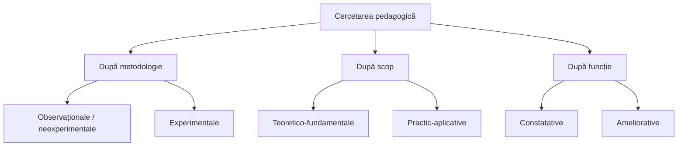
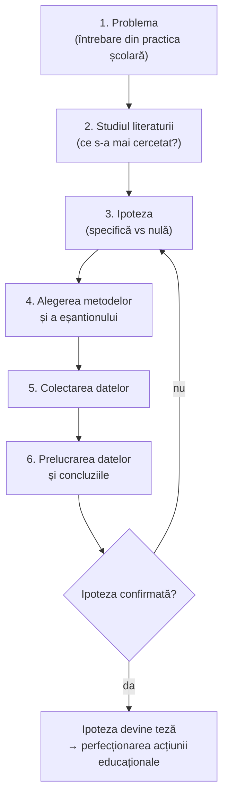

↑ [[Modulul 05 - Paradigmele pedagogiei și cercetarea pedagogică]] · ← [[5.2 Tipologia paradigmelor educaționale]] · → [[5.4 Metode de cercetare în pedagogie]]

> [!abstract] Pe scurt
> - **Cercetarea pedagogică** = acțiune complexă care urmărește **descoperirea legităților educației**, explicarea lor și găsirea modalităților de **aplicare** în educație și învățământ.
> - **Tipologie** (trei criterii): după **metodologie** — observaționale (neexperimentale) / experimentale; după **scop** — teoretico-fundamentale / practic-aplicative; după **funcție** — constatative / ameliorative.
> - **Etape**: problema → studiul literaturii → **ipoteza** → alegerea metodelor → colectarea și prelucrarea datelor → concluzii → confirmarea (ipoteza devine **teză**) sau reformularea ipotezei.
> - **Ipoteza specifică vs ipoteza nulă** (I. Nicola): efectul se datorează factorului experimental / factorilor întâmplători; decizia se ia **statistic**.
> - **Eșantionul** trebuie să fie **reprezentativ** (aleator simplu, stratificat, fix); în experiment se folosesc **eșantion experimental** și **eșantion de control**, **omogenizate** (eșantioane corelate, subeșantioane, control statistic).

---

# PARTEA I — Ce spune manualul

## 1. Noțiunea de cercetare în pedagogie (p. 164–165)

> [!quote] Definiție (p. 164; reluată la p. 172)
> **Cercetarea în pedagogie** este o **acțiune complexă** care are ca scop **descoperirea legităților educației**, pentru a le **explica** și a găsi **modalități potrivite de implementare** a acestor legi în educație și învățământ.

- **Teoriile pedagogice s-au format pe baza practicii educaționale**. Cercetarea practicii a oferit pedagogiei **metode de influență** valoroase, din care s-au construit **strategii pedagogice**.
- Creșterea rapidă a „**cunoștințelor despre om**” obligă la reflecție asupra **viitorului științelor umane**. Acestea s-au impus în planul gândirii prin **tematică și metodologie proprii**, un „**fond de idei**” și o **evoluție istorică specifică** (după **C. Enăchescu**, *Tratat de teoria cercetării științifice*, p. 42).

## 2. Tipologia cercetării pedagogice (p. 165–166)

| Criteriul | Tipuri | Caracterizare |
|---|---|---|
| **I. Metodologia utilizată** | **Observaționale (neexperimentale)** | caracter **descriptiv**; observă procese și acțiuni și trag concluzii din observații; concluziile sunt **subiective**, depind de atitudinea, însușirile și concepțiile cercetătorului |
|  | **Experimentale** | realizate prin **experiment**; rezultatele sunt înregistrate și prelucrate pentru a demonstra **eficiența educativă**; duc la descoperirea de **legi** specifice și la apariția **teoriilor pedagogice** |
| **II. Scopul cercetării** | **Teoretico-fundamentale** | caracter teoretic; scop: a **cunoaște**, a **lărgi** domeniul cunoașterii, a **elabora legi noi**; rezultatele și legile **pot fi verificate** |
|  | **Practic-aplicative** | probleme **mai restrânse**, cu **aplicare practică imediată**; scop: **ameliorarea** situațiilor respective |
| **III. Funcțiile cercetării** | **Constatative** | doar **cunosc și analizează** fenomene, fapte, situații |
|  | **Ameliorative** | introduc **modificări** și verifică dacă acestea **ameliorează** situația pentru care au fost propuse |

## 3. Etapele cercetării. Structura proiectului de cercetare (p. 166–167)

### 3.1. Formularea problemei

- Cercetarea **începe cu problema**, care trebuie să conțină o **întrebare pentru activitatea practică**, capabilă să aducă o **îmbunătățire** a activității școlare.
- Cercetătorul **studiază literatura** pentru a verifica dacă problema **nu a fost deja abordată** sau rezolvată și ce **aspecte** au fost cercetate de alții.
- **Nu există cercetare științifică fără o problemă de rezolvat** (după **L. Antonesei**, *Ghid pentru cercetarea educației*, p. 12):
  - problemă **de cunoaștere** → cercetare **teoretică/fundamentală**;
  - problemă **practică, concretă** → cercetare **aplicativă**.
- Problema, născută dintr-o **situație educativă**, se formulează ca **ipoteză**, verificată pe tot parcursul cercetării.

### 3.2. Ipoteza (p. 166–167)

> [!quote] Definiție
> **Ipoteza** este un **enunț** — o modalitate de descoperire a unor **raporturi noi, interdependente** între fenomenele pedagogice, între fenomenele pedagogice și cele **psihice**, între fenomenele pedagogice și cele **sociologice** —, care conține o **presupunere** al cărei **adevăr sau fals** urmează să fie dovedit prin **verificare în practică**.

După **I. Nicola** (*Tratat de pedagogie generală*), în cercetarea pedagogică se confruntă **două ipoteze**:

| | **Ipoteza specifică** | **Ipoteza nulă** |
|---|---|---|
| **Ce susține** | modificările produse și diferențele de la final se datorează **factorului experimental** controlat de cercetător | modificările și diferențele se datorează unor **factori întâmplători**, necontrolați |
| **Natura** | ipoteza de lucru a cercetătorului | ipoteză **statistică**, admisă sau respinsă **pe bază de calcule** |
| **Relația** | admiterea ipotezei nule = **respingerea** ipotezei specifice | respingerea ipotezei nule = **admiterea** ipotezei specifice |

### 3.3. Etapele următoare (p. 167)

1. **stabilirea metodelor** de cercetare;
2. **colectarea datelor**, constatarea cauzelor și efectelor, **compararea** datelor înregistrate;
3. **prelucrarea** rezultatelor, formularea **concluziilor** și aprecierea **modificărilor** produse;
4. **confirmarea ipotezei** → ipoteza **se transformă în teză**; dacă ipoteza e **respinsă**, se formulează **alte ipoteze**.

- **Finalitatea** cercetării pedagogice: descoperirea unor **noi modalități de perfecționare a acțiunii educaționale**.

## 4. Tipuri de eșantioane (p. 167–168)

- Pentru a decide admiterea sau respingerea ipotezei se calculează **indici statistici**, obținuți prin investigarea unor **categorii de populație** cărora li se adresează întrebări legate de problemă.

> [!quote] Definiție (p. 167)
> **Eșantionul** = **numărul de cazuri alese dintr-o populație** pentru a fi supuse investigației. Pentru a oferi date semnificative, eșantionul trebuie să fie **reprezentativ**.

| Tip de eșantionare | Descriere | Exemple / utilizare |
|---|---|---|
| **Simplă aleatoare (probabilistă)** | **fiecare caz** din populație poate fi selectat | **loteria**, alegerea după un anumit număr dintr-o **listă** |
| **Stratificată** | populația e împărțită în **straturi** după criterii (**sex, vârstă, studii**); din fiecare strat se extrage aleator un eșantion → **lotul** investigat | cercetări pe populații eterogene |
| **Fixă** | datele se culeg **de mai multe ori de la același eșantion** | urmărirea **evoluției** unor fenomene într-o perioadă |

## 5. Eșantionul experimental și eșantionul de control (p. 168)

- **Eșantionul experimental** — supus **intervenției experimentale** (legate de problemă și ipoteză), pentru a produce modificări în procesul instructiv-educativ.
- **Eșantionul de control** — servește ca **termen de comparație**; diferența dintre rezultatele lui și cele obținute după experiment **se pot datora experimentului**.
- Cele două eșantioane trebuie **omogenizate** — egalizate pe cât posibil în privința factorilor implicați.

## 6. Procedee de omogenizare a eșantioanelor (p. 168–169)

| Procedeu | Descriere | Observație din manual |
|---|---|---|
| **Eșantioane corelate** | fiecărui subiect dintr-un eșantion îi corespunde un subiect **cu caracteristici foarte asemănătoare** din celălalt | egalarea **nu e perfectă** — ex.: două **clase paralele** din aceeași școală au trăsături comune de vârstă, dar și **individuale** |
| **Subeșantioane și compararea lor** | un **test** grupează subiecții din fiecare eșantion; după cercetare, rezultatele se compară pe **subgrupe** (foarte buni, buni etc.) | comparație la nivel de subgrup |
| **Controlul statistic** | **testare prealabilă** a ambelor eșantioane; se calculează indicii de **tendință centrală** și de **variabilitate** | omogenitatea depinde de **diferența** dintre acești indici în cele două eșantioane |

> [!tip] De reținut
> **Tipologia** = 3 criterii × 2 tipuri. **Ipoteza nulă** = „diferența e întâmplătoare”. **Eșantion reprezentativ** = condiția generalizării. **Grup de control + omogenizare** = condiția ca efectul să poată fi atribuit experimentului.

---

# PARTEA II — Completări

## 7. Definiții ale cercetării educaționale

- **F. N. Kerlinger**, *Foundations of Behavioral Research* (1964): cercetarea științifică = investigație **sistematică, controlată, empirică și critică** a unor propoziții ipotetice despre relațiile dintre fenomene.
- **L. Stenhouse** (1981): cercetarea = **investigație sistematică făcută publică** (*systematic enquiry made public*).
- În tradiția românească: **I. Drăgan & I. Nicola**, *Cercetarea psihopedagogică* (Tipomur, Târgu-Mureș, 1993; ed. a II-a 1995) — ghid clasic pentru lucrările de **grad didactic I**; **M. Bocoș**, *Teoria și practica cercetării pedagogice* (Casa Cărții de Știință, Cluj-Napoca, 2003) — tratare sistematică a tipologiei, designului și metodelor; **L. Antonesei** (coord.), *Ghid pentru cercetarea educației* (Polirom, 2009).

> [!note] Comentariu
> Definiția manualului („descoperirea **legităților** educației”) este tributară modelului **pozitivist-nomotetic** (căutarea de legi). Cercetarea **interpretativă** nu caută legi, ci **înțelegerea semnificațiilor** în contexte particulare; cercetarea **critică** urmărește **transformarea** practicii. Vezi paradigmele de cercetare în [[5.2 Tipologia paradigmelor educaționale]].

## 8. Tipologii suplimentare (lipsă din manual)

| Criteriul | Tipuri | Precizări |
|---|---|---|
| **Natura datelor** | **cantitativă** / **calitativă** / **mixtă** | Creswell & Plano Clark (2007); Johnson & Onwuegbuzie (2004) |
| **Dimensiunea temporală** | **transversală** (un moment) / **longitudinală** (panel, cohortă, tendință) | „eșantionarea fixă” din manual = design **longitudinal de tip panel** |
| **Scopul logic** | **exploratorie** / **descriptivă** / **explicativă** (cauzală) / **predictivă** | |
| **Locul** | de **laborator** / de **teren** (naturală) | experimentul pedagogic e de obicei **natural** |
| **Controlul variabilelor** | **preexperimentală** / **cvasiexperimentală** / **experimentală propriu-zisă** | D. T. Campbell & J. C. Stanley (1963) |
| **Relația cercetător–practică** | cercetare **despre** educație / cercetare **pentru și în** educație (**cercetare-acțiune**) | Stenhouse (1975); Carr & Kemmis (1986) |
| **Tradiția moldovenească** | experiment de **constatare** → de **formare** → de **control** | structura uzuală a tezelor de doctorat în științele educației din R. Moldova |

### 8.1. Dincolo de dihotomia fundamental–aplicativ

- **Manualul Frascati** al OCDE (prima ediție 1963; ed. 2015) distinge **cercetarea fundamentală**, **cercetarea aplicativă** și **dezvoltarea experimentală** — tipologie folosită în statisticile oficiale ale cercetării.
- **Donald E. Stokes**, *Pasteur's Quadrant* (1997): cele două dimensiuni sunt **independente**. „**Cadranul Pasteur**” = cercetare care urmărește **simultan** înțelegerea fundamentală și utilitatea practică — situație frecventă în educație.

| | Nu urmărește utilitatea | Urmărește utilitatea |
|---|---|---|
| **Urmărește înțelegerea fundamentală** | cadranul **Bohr** (cercetare fundamentală pură) | cadranul **Pasteur** (fundamentală inspirată de utilizare) |
| **Nu urmărește înțelegerea fundamentală** | — | cadranul **Edison** (aplicativă pură) |

## 9. Cercetarea-acțiune

| Autor | Lucrarea | Contribuția |
|---|---|---|
| **Kurt Lewin** | „Action Research and Minority Problems” (*Journal of Social Issues*, 1946) | introduce termenul; **spirala**: planificare → acțiune → observare (*fact-finding*) → reflecție → replanificare |
| **Lawrence Stenhouse** | *An Introduction to Curriculum Research and Development* (1975) | **„profesorul ca cercetător”** (*teacher as researcher*) |
| **John Elliott** | *Action Research for Educational Change* (1991) | cercetarea-acțiune în școli, Ford Teaching Project |
| **Wilfred Carr & Stephen Kemmis** | *Becoming Critical* (1986) | cercetare-acțiune **emancipatoare**, fundamentată pe Habermas |
| **S. Kemmis & R. McTaggart** | *The Action Research Planner* (1988) | ghid practic, cicluri plan–act–observe–reflect |
| **Adriana Nedelcu** | *Cercetare-acțiune în educație* (2011, citată în bibliografia manualului) | aplicare în context românesc (mentorat urban) |

> [!note] Comentariu
> Bibliografia modulului include lucrarea lui Nedelcu, iar paradigma identității (Joița) vorbește de „**cercetare-acțiune-formare**”, dar **textul subcapitolului nu definește cercetarea-acțiune** — tipul de cercetare cel mai accesibil unui viitor profesor. Categoria „cercetări **ameliorative**” e cea mai apropiată de ea.

## 10. Design-based research și educația bazată pe dovezi

- **Design-based research (DBR)** — lucrările fondatoare:
  - **Allan Collins** (1992), „Toward a Design Science of Education” (în E. Scanlon & T. O'Shea, eds., *New Directions in Educational Technology*);
  - **Ann Brown** (1992), „Design Experiments: Theoretical and Methodological Challenges in Creating Complex Interventions in Classroom Settings” (*Journal of the Learning Sciences*, 2(2));
  - **Design-Based Research Collective** (2003), *Educational Researcher*, 32(1);
  - **S. McKenney & T. Reeves**, *Conducting Educational Design Research* (2012).
  - Ideea: intervenții proiectate și **rafinate iterativ** în clase reale, care produc simultan **soluții practice** și **teorie**.
- **Educația bazată pe dovezi (evidence-based education)**:
  - **David Hargreaves**, prelegerea TTA „Teaching as a Research-Based Profession” (1996) — critică utilitatea redusă a cercetării educaționale;
  - **Robert Slavin**, „Evidence-Based Education Policies: Transforming Educational Practice and Research” (*Educational Researcher*, 2002) — pledoarie pentru **experimente randomizate**; *Best Evidence Encyclopedia*;
  - **What Works Clearinghouse** (SUA, 2002) și **Education Endowment Foundation** (Marea Britanie, 2011);
  - **John Hattie**, *Visible Learning* (2009) — sinteză a peste **800 de meta-analize**, cu ierarhizarea factorilor după **mărimea efectului** (*effect size*, pragul **d = 0,40** ca „zonă a efectelor dorite”);
  - **Critici**: **Gert Biesta**, „Why ‚What Works' Won't Work” (*Educational Theory*, 2007) — educația e o practică **morală**, nu doar tehnică; critici metodologice la adresa agregării meta-analizelor din *Visible Learning* (combinarea unor studii foarte diferite).

## 11. Ipoteze, variabile și inferență statistică — precizări

- **Variabila independentă** (factorul experimental, manipulat: ex. o metodă nouă) → **variabila dependentă** (efectul măsurat: ex. rezultatele la test); **variabile parazite/confundate** (controlate prin design).
- **Ipoteza nulă (H₀)** — introdusă de **R. A. Fisher**, *The Design of Experiments* (1935); cadrul **ipoteză nulă vs ipoteză alternativă (H₁)**, cu erori de **tip I** (respingerea unei H₀ adevărate, α) și **tip II** (nerespingerea unei H₀ false, β), aparține lui **J. Neyman & E. S. Pearson** (1933).
- „**Ipoteza specifică**” din manual = **ipoteza alternativă / de cercetare (H₁)**.
- **Pragul de semnificație** uzual: **p < 0,05**. Semnificația statistică **nu spune cât de mare** e efectul → se raportează și **mărimea efectului** (J. Cohen, *Statistical Power Analysis for the Behavioral Sciences*, 1988: d ≈ 0,2 mic, 0,5 mediu, 0,8 mare).
- **Declarația ASA** privind valorile p (Wasserstein & Lazar, *The American Statistician*, 2016): valoarea p **nu** măsoară probabilitatea ca ipoteza să fie adevărată.

## 12. Eșantionarea — tablou complet

| Probabilistă (fiecare element are o șansă cunoscută) | Neprobabilistă |
|---|---|
| **aleatoare simplă** | **de conveniență** (clasele disponibile — cea mai frecventă în cercetarea pedagogică) |
| **sistematică** (fiecare al k-lea din listă) | **pe cote** (proporții fixate după criterii) |
| **stratificată** | **intenționată / teoretică** (cazuri tipice sau extreme — în cercetarea calitativă) |
| **pe grupuri / cuiburi** (*cluster*: se extrag școli sau clase întregi) | **„bulgăre de zăpadă”** (participanții recomandă alți participanți) |
| **multistadială** | |

> [!note] Comentariu — două „aleatorii” diferite
> - **Selecția aleatoare** a eșantionului din populație asigură **validitatea externă** (generalizarea).
> - **Repartizarea aleatoare** (*random assignment*) a subiecților în grupul experimental și de control asigură **validitatea internă** (atribuirea cauzală). Aceasta este cea mai puternică metodă de **omogenizare** și **lipsește** din lista manualului. Când se lucrează cu **clase întregi**, deja constituite, designul este **cvasiexperimental**.

## 13. Validitatea experimentului pedagogic

După **Campbell & Stanley** (1963) și **Shadish, Cook & Campbell**, *Experimental and Quasi-Experimental Designs for Generalized Causal Inference* (2002), **amenințări la validitatea internă**:

| Amenințare | Exemplu în școală |
|---|---|
| **istoria** | în timpul experimentului are loc un eveniment (o olimpiadă, pandemia) |
| **maturizarea** | elevii se dezvoltă oricum în cele câteva luni |
| **testarea** | pretestul îi „antrenează” pentru posttest |
| **instrumentarea** | se schimbă testul sau evaluatorii |
| **regresia spre medie** | grupurile cu scoruri extreme tind spre medie la retestare |
| **selecția** | clasa experimentală era deja mai bună |
| **mortalitatea experimentală** | abandonul diferit în cele două grupuri |
| **efecte de așteptare** | **efectul Hawthorne** (studiile de la Western Electric, anii 1920–1930); **efectul Pygmalion** — R. Rosenthal & L. Jacobson, *Pygmalion in the Classroom* (1968) |

## 14. Etica cercetării educaționale

- Principii: **consimțământ informat** (pentru minori — al părinților și acordul copilului), **confidențialitate și anonimat**, **evitarea prejudiciilor**, **dreptul de retragere**, **echitate** (grupul de control nu trebuie privat definitiv de o intervenție benefică).
- Documente de referință: **BERA**, *Ethical Guidelines for Educational Research* (ed. a IV-a, 2018); **AERA**, *Code of Ethics* (2011).

## 15. Structura unui proiect de cercetare (model uzual)

1. **Titlul** și **actualitatea** temei; 2. **problema** și **întrebările** de cercetare; 3. **scopul** și **obiectivele**; 4. **ipoteza** (variabile); 5. **cadrul teoretic** (sinteza literaturii); 6. **designul** (tipul de cercetare, eșantion, etape); 7. **metode și instrumente**; 8. **plan de analiză a datelor**; 9. **aspecte etice**; 10. **calendar** și **resurse**; 11. **rezultate așteptate** și **valorificare**; 12. **bibliografie**.

> [!warning] Comentariu critic
> - **Titlu promis, conținut absent**: secțiunea se numește „Etapele cercetării. **Structura proiectului de cercetare**”, dar **structura proiectului nu e prezentată**; etapele sunt descrise sumar și amestecat.
> - **Preluări neadaptate** (probabil textuale): la p. 164–165 apare formula „**aşa cum am arătat la începutul lucrării noastre**” — care nu se referă la acest manual, ci la sursa citată (Enăchescu); la p. 166 „ceea ce **numeam** o cercetare teoretică” — persoana I din *Ghidul* lui Antonesei. Indică **copierea** unor fragmente.
> - **Simplificare/eroare — cercetările neexperimentale**: a spune că concluziile lor „sunt subiective” e **inexact**. Cercetările **corelaționale**, anchetele pe eșantioane reprezentative sau studiile longitudinale sunt riguroase; ele nu permit inferențe cauzale la fel de ferme ca experimentul, dar **nu sunt subiective prin natura lor**.
> - **Eroare statistică — ipoteza nulă**: „**admiterea** ipotezei nule” nu este formularea corectă. Testul statistic **nu dovedește** H₀; se spune că **nu o putem respinge** (lipsă de dovezi, nu dovadă a absenței efectului). De asemenea, respingerea H₀ **nu dovedește** că *toate* diferențele se datorează factorului experimental, cum sugerează definiția ipotezei specifice.
> - **Eroare — eșantionul de control** (p. 168): manualul spune că eșantionul de control permite compararea rezultatelor finale „cu cele de la **începutul** experimentului”. Corect: grupul de control permite compararea, **la final**, a rezultatelor **grupului experimental** cu cele ale **grupului de control** (care n-a primit intervenția). Comparația început–sfârșit se face prin **pretest–posttest**, în fiecare grup.
> - **Confuzie terminologică**: „indicii… se pot obține prin aflarea **opiniei populației**” — confundă **populația statistică** (mulțimea de referință) cu **sondajul de opinie**. Eșantionarea se aplică oricărei măsurători, nu doar întrebărilor.
> - **„Ipoteza se transformă în teză”**: formulare **simplificatoare**; în logica științei (Popper), o ipoteză **coroborată** rămâne revizuibilă.
> - **Omisiuni**: variabile, design experimental, **repartizarea aleatoare**, validitate și fidelitate, **etica**, cercetarea **calitativă** și **cercetarea-acțiune** (deși aceasta apare în bibliografie).
> - **Trimitere suspectă**: „I. Nicola [11, **p. 5**]” — p. 5 a unui tratat de pedagogie corespunde de regulă prefeței/cuprinsului; pagina e **de verificat**.
> - **Ortografie**: „Drept oportun a considera” (formulare incorectă), „se compară datele care se înregistrează”, „aprecieri a modificărilor”.

## 16. Întrebări de autoverificare

1. Definiți cercetarea pedagogică. Ce limită are o definiție centrată pe „descoperirea legităților”?
2. Caracterizați tipologia cercetării după metodologie, scop și funcție, cu câte un exemplu de temă pentru fiecare tip.
3. Ce este „cadranul Pasteur” și de ce e relevant pentru cercetarea educațională?
4. Descrieți etapele unei cercetări pedagogice, de la problemă la concluzii.
5. Formulați, pentru o temă aleasă, o ipoteză specifică și ipoteza nulă corespunzătoare. Ce înseamnă „a respinge ipoteza nulă”?
6. Ce este un eșantion reprezentativ? Comparați eșantionarea aleatoare simplă, stratificată și pe grupuri.
7. Care e rolul eșantionului de control? Ce eroare conține formularea manualului despre el?
8. Prin ce procedee se omogenizează eșantioanele? De ce repartizarea aleatoare este cea mai puternică?
9. Numiți patru amenințări la validitatea internă a unui experiment pedagogic și modul de control al fiecăreia.
10. Descrieți ciclul cercetării-acțiune și arătați cum îl poate folosi un profesor la clasă.

## Surse

- Manual, p. 164–169, 172, 174 (bibliografie).
- Antonesei, L. (coord.) (2009). *Ghid pentru cercetarea educației*. Iași: Polirom.
- Enăchescu, C. (2005). *Tratat de teoria cercetării științifice*. Iași: Polirom.
- Nicola, I. (2006). *Tratat de pedagogie generală*. București: EDP.
- Drăgan, I., Nicola, I. (1993; ed. a II-a 1995). *Cercetarea psihopedagogică*. Târgu-Mureș: Tipomur.
- Bocoș, M. (2003). *Teoria și practica cercetării pedagogice*. Cluj-Napoca: Casa Cărții de Știință.
- Radu, I., Miclea, M., Albu, M., Moldovan, O., Nemeș, S., Szamoskozi, Ș. (1993). *Metodologie psihologică și analiza datelor*. Cluj-Napoca: Sincron.
- Pătrașcu, D., Pătrașcu, L., Mocrac, A. (2003). *Metodologia cercetării și creativității psihopedagogice*. Chișinău: Știința.
- Nedelcu, A. (2011). *Cercetare-acțiune în educație*. București.
- Kerlinger, F. N. (1964). *Foundations of Behavioral Research*. New York: Holt, Rinehart & Winston.
- Campbell, D. T., Stanley, J. C. (1963). Experimental and Quasi-Experimental Designs for Research on Teaching. În N. L. Gage (ed.), *Handbook of Research on Teaching*. Chicago: Rand McNally.
- Shadish, W. R., Cook, T. D., Campbell, D. T. (2002). *Experimental and Quasi-Experimental Designs for Generalized Causal Inference*. Boston: Houghton Mifflin.
- Fisher, R. A. (1935). *The Design of Experiments*. Edinburgh: Oliver & Boyd.
- Cohen, J. (1988). *Statistical Power Analysis for the Behavioral Sciences* (2nd ed.). Hillsdale: Erlbaum.
- Stokes, D. E. (1997). *Pasteur's Quadrant: Basic Science and Technological Innovation*. Washington: Brookings Institution Press.
- OECD (2015). *Frascati Manual 2015*. Paris: OECD.
- Lewin, K. (1946). Action Research and Minority Problems. *Journal of Social Issues*, 2(4), 34–46.
- Stenhouse, L. (1975). *An Introduction to Curriculum Research and Development*. London: Heinemann.
- Carr, W., Kemmis, S. (1986). *Becoming Critical*. London: Falmer Press.
- Elliott, J. (1991). *Action Research for Educational Change*. Milton Keynes: Open University Press.
- Brown, A. (1992). Design Experiments. *Journal of the Learning Sciences*, 2(2), 141–178.
- Design-Based Research Collective (2003). Design-Based Research: An Emerging Paradigm for Educational Inquiry. *Educational Researcher*, 32(1), 5–8.
- Slavin, R. E. (2002). Evidence-Based Education Policies. *Educational Researcher*, 31(7), 15–21.
- Hattie, J. (2009). *Visible Learning: A Synthesis of Over 800 Meta-Analyses Relating to Achievement*. London: Routledge.
- Biesta, G. (2007). Why "What Works" Won't Work. *Educational Theory*, 57(1), 1–22.
- Creswell, J. W., Plano Clark, V. L. (2007). *Designing and Conducting Mixed Methods Research*. Thousand Oaks: Sage.
- BERA (2018). *Ethical Guidelines for Educational Research* (4th ed.). London: BERA.
