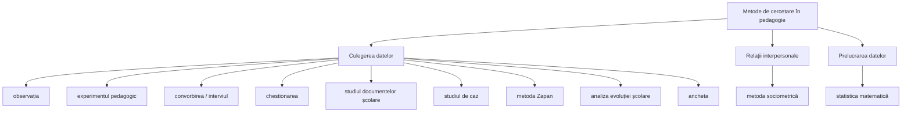

↑ [[Modulul 05 - Paradigmele pedagogiei și cercetarea pedagogică]] · ← [[5.3 Cercetarea pedagogică - noțiune și tipologie]] · → [[6.1 Conținuturile generale ale educației]]

> [!abstract] Pe scurt
> - Terminologia **metodologiei cercetării** nu este suficient clarificată; **puține metode sunt specifice pedagogiei** — cele mai multe sunt **comune științelor socioumane** (sociologie, psihologie).
> - **Metodele enumerate**: observația, experimentul pedagogic, convorbirea (interviul), chestionarea, studiul documentelor școlare, studiul de caz, **metoda Zapan**, analiza evoluției școlare, ancheta; **sociometria** pentru relațiile interpersonale; **statistica matematică** pentru prelucrarea datelor.
> - **Observația** = urmărire **intenționată, sistematică**, în condiții obișnuite. **Experimentul pedagogic** = **natural** (în condiții normale de lucru).
> - **Metoda Zapan** = **aprecierea elevilor de către elevi** (G. Zapan, metoda aprecierii obiective a personalității).
> - **Ancheta** folosește întrebări **închise** sau **deschise**, de obicei cu răspuns scris și **anonim**.

---

# PARTEA I — Ce spune manualul

## 1. Problema terminologică (p. 169–170)

- Autorii *Ghidului pentru cercetarea educației* (L. Antonesei, coord., p. 43) consideră că terminologia **metodologiei cercetării** **nu e îndeajuns clarificată** și **nici operațională**.
- Manualul își propune **fără soluții definitive** o „radiografiere” a punctelor de vedere și **definiții și clasificări de lucru**.
- **Premisă**: **puține** metode sunt demersuri **specifice** investigației educaționale; **cele mai multe** sunt **comune științelor socioumane**, folosite mai ales în cercetarea **sociologică** și **psihologică**.

## 2. Inventarul metodelor (p. 170; reluat în concluzii, p. 172)

## 3. Metodele, pe rând (p. 170–171)

| Metoda | Ce spune manualul | Pagina |
|---|---|---|
| **Observarea** | **urmărirea intenționată și sistematică** a unui fenomen sau complex de fenomene educaționale **în condiții obișnuite**; are **scop**, e **planificată**, duce la explicarea unor aspecte. Datele se **înregistrează**, se **explică și analizează**, apoi se formulează o **ipoteză** de cercetat ulterior | p. 170 |
| **Experimentul pedagogic** | numit **experiment pedagogic sau natural**, pentru că se face **în condiții normale de lucru** | p. 170 |
| **Convorbirea / interviul** | poate lua forma unei **discuții libere**; contează **formularea întrebărilor** și **modul de obținere a răspunsurilor** | p. 170 |
| **Chestionarea** | pentru **sondarea nivelului de cunoștințe** sau cunoașterea unor **însușiri de personalitate**; **nu trebuie folosită abuziv**; tipuri: de **atitudini**, **stabilitate emotivă**, **interese**, **opinii** | p. 170 |
| **Studiul documentelor școlare** | furnizează date importante despre **activitatea elevilor** | p. 171 |
| **Studiul de caz** | presupune **participarea activă a clasei**; folosit mai ales pentru probleme de **educație morală**; trebuie să se bazeze pe **date autentice și suficiente** și să ofere **soluții generale** | p. 171 |
| **Metoda Zapan** | folosită **în clasele mari**; constă în **aprecierea elevilor făcută de elevi** | p. 171 |
| **Ancheta** | stabilește **elementele comune** pentru problema cercetată; o serie de **întrebări adresate elevilor**, cu răspuns de obicei **scris și nesemnat** (pentru sinceritate) | p. 171 |
| **Analiza evoluției școlare** | doar **enumerată** | p. 170 |
| **Metoda sociometrică** | doar **enumerată** — pentru **relațiile interpersonale** | p. 170 |
| **Statistica matematică** | doar **enumerată** — pentru **prelucrarea datelor** | p. 170 |

### 3.1. Clasificarea experimentelor (p. 170)

| Criteriul | Tipuri |
|---|---|
| **Numărul subiecților** | **individuale** / **colective** |
| **Durata** | de **lungă** durată / de **scurtă** durată |
| **Conținutul** | cu probleme de **educație** / cu probleme de **didactică** |
| **Scopul** | de **constatare** / de **verificare** |

### 3.2. Tipuri de întrebări în anchetă (p. 171)

| **Deschise** | **Închise** |
|---|---|
| răspunsul **nu e reglementat** de nicio condiție; respondentul îl **construiește** după propria imaginație, judecată și înțelegere a întrebării | respondentul **alege** un răspuns dintre **variantele propuse** |

## 4. Concluziile generale ale modulului (p. 171–172)

1. **Paradigmele** = realizări științifice care, pentru o perioadă, devin **modele de soluții** pentru o comunitate științifică; aduc o **definire mai bună** a domeniului → [[5.1 Noțiunea de paradigmă]].
2. **Motivele cercetării** după Kuhn: dorința de a fi util, pasiunea explorării, speranța de a găsi ordinea, tendința de a testa cunoașterea existentă.
3. **Noile teorii** presupun **distrugerea** paradigmelor preexistente; paradigma veche cade **doar când alta e pregătită** să-i ia locul.
4. **Paradigmele educaționale** = modele după care se ghidează cadrele didactice → [[5.2 Tipologia paradigmelor educaționale]].
5. **Clasice**: tehnologică/rațională, interpretativ-simbolică, socio-critică; **contemporane**: constructiviste (cu influență încă insuficientă).
6. **Cercetarea pedagogică** = descoperirea **legităților** educației și a modalităților de implementare → [[5.3 Cercetarea pedagogică - noțiune și tipologie]].
7. **Metodele** de cercetare (lista de mai sus), sociometria și statistica.

## 5. Teme de reflecție, exercițiu, jurnal (p. 172–173)

- **Teme de reflecție**: cum are loc schimbarea de paradigmă educațională; ce factori contribuie la ea; potențialul paradigmelor **clasice** și modul de valorificare; **avantajele și dezavantajele** paradigmelor contemporane; **specificul** cercetării pedagogice; **tipologia** cercetării; **etapele** cercetării; **eșantionul** și felurile lui; caracterizarea **metodelor**; comentarea afirmației lui **J. Thomas**, care leagă reciproc **cercetarea** de **experiența pedagogică** și **creativitatea profesorului** de **rezultatele cercetării**.
- **Exercițiu de creativitate**: studierea **grupei academice** cu metodele de cercetare și întocmirea **caracteristicii psihopedagogice** a grupei.
- **Jurnal de modul**: „Ce am învățat” / „Ce pot să aplic și să schimb”.

## 6. Bibliografia modulului (p. 174)

13 titluri: Antonesei (2009), Bârzea (1998), Cojocaru-Borozan (2013), Cristea (2010), Dandara (2014), Enăchescu (2005), Joița (2009), Jupp (2010), Kuhn (2012), Nedelcu (2011), Nicola (2006), Pătrașcu, Pătrașcu & Mocrac (2003), Petrescu (2013).

> [!tip] De reținut
> **Metodă de culegere** (observație, experiment, interviu, chestionar/anchetă, documente, studiu de caz, Zapan) → **metodă pentru relații** (sociometrie) → **metodă de prelucrare** (statistică). Observația **generează** ipoteze; experimentul le **verifică**.

---

# PARTEA II — Completări

## 7. Clarificări terminologice: metodologie – metodă – tehnică – instrument

| Termen | Sens | Exemplu |
|---|---|---|
| **Metodologie** | teoria metodelor + **strategia** de ansamblu a cercetării (design, logica demonstrației) | design cvasiexperimental pretest–posttest |
| **Metodă** | calea generală de obținere a datelor | **ancheta**, observația, experimentul |
| **Tehnică** | modul concret de aplicare a metodei | ancheta **prin chestionar** sau **prin interviu** |
| **Instrument** | suportul material al tehnicii | **chestionarul**, grila de observație, testul, ghidul de interviu |
| **Procedeu** | operație componentă | codificarea răspunsurilor, scalarea |

> [!note] Comentariu
> Distincția aparține tradiției metodologice sociologice (în română: **S. Chelcea**, *Metodologia cercetării sociologice. Metode cantitative și calitative*, Economica, 2001/2004; **T. Rotariu & P. Iluț**, *Ancheta sociologică și sondajul de opinie*, Polirom, 1997). Aplicată manualului, ea arată că **„chestionarea” și „ancheta” nu sunt metode diferite**: chestionarul e **instrumentul** anchetei.

## 8. Metodele manualului, dezvoltate

### 8.1. Observația

- **Tipuri**: **participativă / neparticipativă**; **structurată** (cu grilă) / **nestructurată**; **deschisă / ascunsă**; **directă / mediată** (înregistrare video); **continuă / eșantionată în timp**.
- **Instrumente**: fișa de observație, **grila de categorii**, jurnalul de cercetare, protocolul de observație.
- **Sistem clasic**: **Ned A. Flanders**, *Analyzing Teaching Behavior* (1970) — **FIAC** (*Flanders Interaction Analysis Categories*): 10 categorii ale interacțiunii verbale (7 ale profesorului, 2 ale elevilor, 1 tăcere/confuzie), codificate la fiecare **3 secunde**.
- **Riscuri**: **efectul observatorului** (subiecții se schimbă când se știu observați), **efectul de halo**, selectivitatea percepției.

### 8.2. Experimentul pedagogic

- **Esență**: **manipularea deliberată** a unei **variabile independente** (metodă, mijloc, strategie) și **măsurarea efectului** asupra unei **variabile dependente** (rezultate, atitudini), **controlând** celelalte variabile. Vezi designul, validitatea și eșantioanele în [[5.3 Cercetarea pedagogică - noțiune și tipologie]].
- **Experiment natural vs de laborator**: cel pedagogic e natural (**validitate ecologică** mare, **control** mai redus).
- **Etape uzuale** (mai ales în tradiția moldovenească): **experiment de constatare** (pretest, diagnostic) → **experiment formativ** (intervenția) → **experiment de control** (posttest, comparație).
- **Designuri** (Campbell & Stanley, 1963): **preexperimentale** (un singur grup, doar posttest), **cvasiexperimentale** (grupuri neechivalente — clase existente, cu pretest), **experimentale propriu-zise** (repartizare aleatoare; ex. designul **Solomon** cu patru grupuri).

### 8.3. Interviul (convorbirea)

- **Grade de structurare**: **structurat** (întrebări fixe, în ordine fixă) / **semistructurat** (ghid de interviu, flexibil) / **nestructurat** (în profunzime).
- **Forme**: individual / de **grup** — **focus-grupul** (R. K. Merton, *The Focused Interview*, 1956, cu M. Fiske și P. Kendall).
- **Referință**: **S. Kvale**, *InterViews: An Introduction to Qualitative Research Interviewing* (1996).

### 8.4. Ancheta pe bază de chestionar

- **Etape**: definirea conceptelor → **operaționalizare** (dimensiuni, indicatori) → redactarea itemilor → **pretestare** (studiu-pilot) → aplicare → codificare → analiză.
- **Tipuri de întrebări**: închise (dihotomice, cu alegere multiplă), **deschise**, **mixte**, **scale** — **scala Likert** (R. Likert, „A Technique for the Measurement of Attitudes”, *Archives of Psychology*, 1932), **diferențiala semantică** (C. Osgood, 1957).
- **Reguli de formulare**: fără întrebări **duble**, **sugestive** sau **tendențioase**; limbaj adaptat vârstei; ordonare de la general la particular.
- **Riscuri**: **dezirabilitatea socială**, rata scăzută de răspuns, eroarea de acord (*acquiescence*).

> [!note] Comentariu — chestionar vs test
> Manualul spune că **chestionarul** servește la „sondarea **nivelului de cunoștințe**” și a **însușirilor de personalitate**. Pentru acestea se folosesc de fapt **testele**: **testele docimologice** (de cunoștințe) și **testele psihologice standardizate** (de personalitate, aptitudini) — metodă **omisă** în manual. Chestionarul colectează **opinii, atitudini, interese, fapte declarate**.

### 8.5. Analiza documentelor și analiza produselor activității

- **Documente școlare**: cataloage, foi matricole, planificări, portofolii, rapoarte, caiete, lucrări scrise, fișe psihopedagogice.
- **Analiza de conținut**: **B. Berelson**, *Content Analysis in Communication Research* (1952); **L. Bardin**, *L'analyse de contenu* (1977) — descriere **sistematică și obiectivă** a conținutului comunicării, cu categorii și unități de analiză.
- **Analiza produselor activității** (desene, compuneri, proiecte) — adesea tratată separat în manualele românești.

### 8.6. Studiul de caz ca metodă de cercetare

- **R. K. Yin**, *Case Study Research: Design and Methods* (1984): investigarea **în profunzime** a unui fenomen contemporan **în contextul său real**, când granițele fenomen–context nu sunt clare; folosește **surse multiple** de date.
- **R. E. Stake**, *The Art of Case Study Research* (1995): studiu de caz **intrinsec**, **instrumental**, **colectiv**.
- **Generalizarea** este **analitică** (spre teorie), nu **statistică** (spre populație).

### 8.7. Metoda Zapan (metoda aprecierii obiective a personalității)

- **Gheorghe Zapan** (1897–1976), psiholog român (psihologie experimentală, psihotehnică, psihologie școlară); lucrarea de sinteză, *Cunoașterea și aprecierea obiectivă a personalității* (București, 1984, postumă).
- **Procedura** (sinteză după literatura românească de psihologie școlară):
  1. elevii sunt rugați să numească, pentru o **însușire** sau o **performanță** dată (ex. rezultatele la o disciplină, sârguința, spiritul de colaborare), colegii pe care îi consideră **cei mai buni** și **cei mai slabi** — **nu** e necesară ierarhizarea tuturor, ci a **extremelor** (circa o treime la fiecare capăt);
  2. fiecare **își justifică** alegerile și se poate include pe sine;
  3. aprecierile se compară cu **rezultatele efective** (notele, testele) și cu **aprecierea profesorului** → se calculează **gradul de obiectivitate** al fiecărui evaluator.
- **Scopuri**: **cunoașterea** elevilor prin **evaluarea colegială**; **exersarea** și **educarea** capacității de **apreciere obiectivă** (a altora și a propriei persoane) → **autoevaluare** mai realistă.
- **Legături**: evaluarea **colegială** (*peer assessment*) și **autoevaluarea** din [[Modulul 10 - Proiectarea, realizarea și evaluarea activității educative]]; formarea capacității de **autocunoaștere** din [[3.6 Educația permanentă și autoeducația]].

### 8.8. Analiza evoluției școlare

- Urmărirea **longitudinală** a traseului unui elev: rezultate, frecvență, transferuri, repetenție, abandon, orientare școlară și profesională.
- **Instrumente**: **fișa psihopedagogică** (de caracterizare), **portofoliul**, **catalogul**, dosarul personal.
- Se sprijină pe analiza documentelor; răspunde întrebării **„cum a evoluat?”**, nu doar „unde se află acum?”.

### 8.9. Metoda sociometrică

- **Jacob Levy Moreno**, *Who Shall Survive?* (1934) — fondatorul **sociometriei**.
- **Testul sociometric**: fiecare membru al grupului indică, după un **criteriu** precis (cu cine ai vrea să lucrezi la un proiect / să stai în bancă / să mergi în excursie), **alegeri** și, eventual, **respingeri**.
- **Prelucrare**: **matricea sociometrică**; **sociograma** (reprezentare grafică a rețelei); **indicele statutului preferențial** = numărul alegerilor primite / (N − 1); indici de **coeziune** a grupului.
- **Rezultate**: identificarea **liderilor informali** („vedetele”), a elevilor **izolați** sau **respinși**, a **subgrupurilor** (clici, perechi, lanțuri).
- **Etică**: confidențialitate strictă; rezultatele **nu se comunică** grupului în forma „cine pe cine a respins”.

### 8.10. Statistica în cercetarea pedagogică

| Nivel | Indicatori / proceduri | Utilizare |
|---|---|---|
| **Descriptiv** | **tendința centrală** (media, mediana, modul); **variabilitatea** (amplitudinea, abaterea standard, coeficientul de variație); distribuții, histograme | descrierea eșantionului; **controlul statistic** al omogenității (vezi [[5.3 Cercetarea pedagogică - noțiune și tipologie]]) |
| **Corelațional** | coeficientul **Pearson** (r), **Spearman** (ρ) | relația dintre două variabile (ex. timpul de lectură – rezultatele) |
| **Inferențial** | testul **t** (Student), **ANOVA**, **χ²**, teste neparametrice (Mann–Whitney, Wilcoxon) | compararea grupului experimental cu cel de control; testarea ipotezei nule |
| **Mărimea efectului** | **d Cohen**, η² | cât de mare este diferența, nu doar dacă e semnificativă |
| **Instrumente software** | SPSS, R, JASP, Excel | |

- **Referințe românești**: **I. Radu** și colab., *Metodologie psihologică și analiza datelor* (Sincron, 1993); **T. Rotariu** (coord.), *Metode statistice aplicate în științele sociale* (Polirom, 1999).

## 9. Metode calitative (lipsă din manual)

| Metoda | Autori-reper | Pe scurt |
|---|---|---|
| **Etnografia școlii** | P. Woods, *Inside Schools* (1986) | imersiune de durată în viața unei școli/clase |
| **Teoria întemeiată** (*grounded theory*) | B. Glaser & A. Strauss, *The Discovery of Grounded Theory* (1967) | teoria se construiește inductiv din date, prin codificare |
| **Cercetarea narativă** | D. J. Clandinin & F. M. Connelly, *Narrative Inquiry* (2000) | poveștile de viață și profesionale ale profesorilor |
| **Focus-grupul** | R. K. Merton (1956); R. Krueger | discuție de grup ghidată |
| **Analiza tematică** | V. Braun & V. Clarke, „Using Thematic Analysis in Psychology” (2006) | identificarea temelor recurente în date calitative |

- **Triangularea** (N. K. Denzin, *The Research Act*, 1970): combinarea mai multor **surse de date**, **metode**, **cercetători** sau **teorii** pentru a crește credibilitatea concluziilor.
- **Criterii de calitate**: în cercetarea cantitativă — **validitate** și **fidelitate**; în cea calitativă — **credibilitate, transferabilitate, dependabilitate, confirmabilitate** (Y. Lincoln & E. Guba, *Naturalistic Inquiry*, 1985).

## 10. Sinteză: potrivirea metodei cu întrebarea de cercetare

| Întrebarea | Metode potrivite |
|---|---|
| **Ce se întâmplă** în clasă? | observația, analiza documentelor, etnografia |
| **Ce cred / simt** elevii, părinții, profesorii? | ancheta pe bază de chestionar, interviul, focus-grupul |
| **Ce știu / pot** elevii? | teste docimologice, analiza produselor activității |
| **Funcționează** o metodă nouă? | experimentul / cvasiexperimentul |
| **Cum sunt relațiile** în grup? | sociometria, observația |
| **Cum se apreciază reciproc** elevii? | metoda Zapan, evaluarea colegială |
| **De ce** un elev are dificultăți? | studiul de caz, analiza evoluției școlare |
| **Cum îmi îmbunătățesc** propria practică? | cercetarea-acțiune |

> [!warning] Comentariu critic
> - **Inventar fără descriere**: din cele **11 metode** enumerate, **trei** — **analiza evoluției școlare**, **sociometria** și **statistica** — **nu sunt descrise deloc**; celelalte primesc 1–5 rânduri. Pentru un subcapitol intitulat „Metode de cercetare științifică în pedagogie” (p. 169–171), tratarea e **foarte sumară**, iar exercițiul final (caracterizarea psihopedagogică a grupei) nu poate fi realizat doar pe baza textului.
> - **Suprapuneri**: **convorbirea**, **chestionarea** și **ancheta** sunt tratate ca metode distincte, fără a preciza că **ancheta** e metoda, iar **chestionarul** și **interviul** sunt **tehnicile/instrumentele** ei.
> - **Confuzie — chestionar/test**: sondarea **cunoștințelor** și a **personalității** se face cu **teste**, nu cu chestionare; **testul** lipsește din listă.
> - **Confuzie — studiul de caz**: descrierea („participarea activă a clasei”, probleme de **educație morală**, „să ofere **soluții generale**”) corespunde **metodei didactice** a studiului de caz (analiza unui caz de către elevi la lecție), **nu** studiului de caz ca **metodă de cercetare** (Yin, Stake), care urmărește înțelegerea în profunzime a unui caz, fără pretenția de soluții generale.
> - **Simplificare — metoda Zapan**: redusă la „aprecierea elevilor de către elevi” și limitată „la clasele mari”. Omite **scopul formativ** (educarea obiectivității aprecierii), **procedura** (numirea extremelor, justificarea, confruntarea cu rezultatele reale) și **autorul** — care nu e numit deloc. Nu e o metodă limitată strict la clasele mari; restricția de vârstă ține de capacitatea elevilor de a formula aprecieri motivate.
> - **Tipologia experimentului** („de constatare, de verificare”) e **incompletă** față de tradiția locală (constatare – **formare** – control) și nu menționează **variabilele**, **grupul de control** în acest context sau designul.
> - **Observația** e prezentată doar ca sursă de ipoteze; lipsesc **tipurile** și **instrumentele** (grila de observație).
> - **Ancheta**: fraza „Deschise sînt **răspunsurile cărora** nu sînt reglementate…” e **agramată**; se confundă întrebările cu răspunsurile. În plus, anchetele se adresează nu doar **elevilor**, ci și profesorilor, părinților, managerilor.
> - **Concluziile modulului** repetă aproape **cuvânt cu cuvânt** definițiile din text și includ o clasificare a paradigmelor **absentă din corpul textului** (vezi [[5.2 Tipologia paradigmelor educaționale]]); formula „să integreze **aceste** soluții” (p. 172) rămâne **fără antecedent**.
> - **Citatul lui „J. Thomas”** din temele de reflecție e dat **fără sursă**; autorul ar putea fi **Jean Thomas**, autorul raportului UNESCO *Les grands problèmes de l'éducation dans le monde* (1975) — **de verificat**.
> - **Bibliografia**: lucrarea lui **V. Jupp** (*Dicționar al metodelor de cercetare socială*, 2010) nu e citată în text; Kuhn apare ca „Kuhn, **S. Thomas**”; **Petrescu** apare cu inițiala „A.” (în text „M.”) și cu greșeala „aducaţiei”; la Nedelcu se dă un site în loc de editură.

## 11. Întrebări de autoverificare

1. De ce spun autorii că puține metode de cercetare sunt specifice pedagogiei?
2. Distingeți metodologia, metoda, tehnica și instrumentul de cercetare, cu exemple.
3. Definiți observația pedagogică și numiți trei tipuri de observație și două riscuri ale ei.
4. De ce experimentul pedagogic este numit „natural”? Care sunt etapele unui experiment formativ?
5. Care este diferența dintre anchetă, chestionar și interviu? Formulați o întrebare închisă și una deschisă pe aceeași temă.
6. De ce studiul de caz ca metodă de cercetare diferă de studiul de caz ca metodă didactică?
7. Descrieți metoda Zapan: autor, procedură, scopuri. Cum contribuie la formarea autoevaluării?
8. Ce este testul sociometric? Ce informații oferă sociograma și indicele statutului preferențial?
9. Ce indicatori statistici folosiți pentru a verifica omogenitatea a două clase înainte de un experiment?
10. Propuneți un plan de metode pentru caracterizarea psihopedagogică a grupei voastre academice (exercițiul din manual).

## Surse

- Manual, p. 169–174.
- Antonesei, L. (coord.) (2009). *Ghid pentru cercetarea educației*. Iași: Polirom.
- Jupp, V. (2010). *Dicționar al metodelor de cercetare socială*. Iași: Polirom.
- Bocoș, M. (2003). *Teoria și practica cercetării pedagogice*. Cluj-Napoca: Casa Cărții de Știință.
- Drăgan, I., Nicola, I. (1993). *Cercetarea psihopedagogică*. Târgu-Mureș: Tipomur.
- Chelcea, S. (2001). *Metodologia cercetării sociologice. Metode cantitative și calitative*. București: Economica.
- Rotariu, T., Iluț, P. (1997). *Ancheta sociologică și sondajul de opinie*. Iași: Polirom.
- Radu, I. et al. (1993). *Metodologie psihologică și analiza datelor*. Cluj-Napoca: Sincron.
- Zapan, G. (1984). *Cunoașterea și aprecierea obiectivă a personalității*. București.
- Moreno, J. L. (1934). *Who Shall Survive? A New Approach to the Problem of Human Interrelations*. Washington: Nervous and Mental Disease Publishing.
- Flanders, N. A. (1970). *Analyzing Teaching Behavior*. Reading, MA: Addison-Wesley.
- Likert, R. (1932). A Technique for the Measurement of Attitudes. *Archives of Psychology*, 140.
- Yin, R. K. (1984). *Case Study Research: Design and Methods*. Beverly Hills: Sage.
- Stake, R. E. (1995). *The Art of Case Study Research*. Thousand Oaks: Sage.
- Bardin, L. (1977). *L'analyse de contenu*. Paris: PUF.
- Kvale, S. (1996). *InterViews*. Thousand Oaks: Sage.
- Glaser, B., Strauss, A. (1967). *The Discovery of Grounded Theory*. Chicago: Aldine.
- Denzin, N. K. (1970). *The Research Act*. Chicago: Aldine.
- Lincoln, Y. S., Guba, E. G. (1985). *Naturalistic Inquiry*. Beverly Hills: Sage.
- Braun, V., Clarke, V. (2006). Using Thematic Analysis in Psychology. *Qualitative Research in Psychology*, 3(2), 77–101.
- Campbell, D. T., Stanley, J. C. (1963). *Experimental and Quasi-Experimental Designs for Research*. Chicago: Rand McNally.
- Cohen, L., Manion, L., Morrison, K. (2018). *Research Methods in Education* (8th ed.). London: Routledge.
- Gheorghe Zapan — [Wikipedia (ro)](https://ro.wikipedia.org/wiki/Gheorghe_Zapan).
