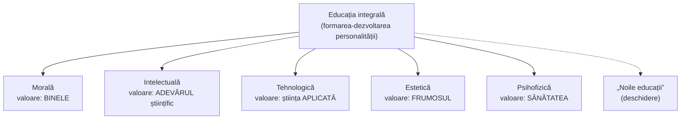

↑ [[Modulul 06 - Dimensiunile generale ale educației]] · ← [[5.4 Metode de cercetare în pedagogie]] · → [[6.2.1 Educația morală]]

> [!note] Organizarea conspectului
> Subcapitolul **6.2** are în manual doar o introducere de circa o jumătate de pagină (p. 179–180), urmată direct de cele cinci dimensiuni. Introducerea a fost **integrată aici** (§7–8), iar fiecare dimensiune are conspectul ei: [[6.2.1 Educația morală]] · [[6.2.2 Educația intelectuală]] · [[6.2.3 Educația tehnologică]] · [[6.2.4 Educația estetică]] · [[6.2.5 Educația psihofizică]].

> [!abstract] Pe scurt
> - **Conținuturile generale ale educației** sunt direcțiile relativ stabile ale formării personalității, fiecare ancorată într-o **valoare fundamentală**: binele moral, adevărul științific, frumosul, sănătatea (și credința religioasă).
> - Manualul preia opțiunea lui **S. Cristea** pentru termenul **„dimensiuni ale educației”**, în locul „laturilor” sau „disciplinelor”, considerate prea restrictive.
> - Modelul clasic are **cinci dimensiuni** („structura pentagonală”): **morală – intelectuală – tehnologică – estetică – psihofizică**.
> - Două modificări față de tradiție: **educația morală e analizată prima**; educația profesională devine **tehnologică**, iar educația fizică devine **psihofizică**.
> - Sistemul e **deschis**: periodic apar **„noile educații”** (ecologică, demografică, pentru democrație etc.).

---

# PARTEA I — Ce spune manualul

## 1. Deschiderea modulului (p. 175)

- **Motto**: Gabriela Mistral — ideea că nevoile copilului nu pot fi amânate, fiindcă formarea lui are loc **acum**.
- **Competențe vizate**: definirea conceptelor de bază; analiza conținuturilor generale ale educației integrale; caracterizarea fiecărei dimensiuni; aplicarea metodelor specifice fiecărei dimensiuni.
- **Concepte de bază**: educație integrală, conținuturile generale ale educației integrale, dimensiunile educației, educație morală / intelectuală / tehnologică / estetică / psihofizică, metodele educației integrale.

## 2. Terminologie: „laturi”, „discipline” sau „dimensiuni”? (p. 176)

S. Cristea analizează conținuturile generale ale educației din perspectivă **axiomatică**. În literatura de specialitate circulă patru formule:

| Formula | Observație |
|---|---|
| „discipline educative” | sugerează materii școlare — prea restrictivă |
| „laturile educației” | formula tradițională; sugerează părți separate |
| **„dimensiunile educației”** | **preferată de S. Cristea** |
| „componentele educației” | formulă neutră |

**Argumentul** pentru „dimensiuni”: structura activității de educație este influențată de **câmpul psihosocial** și reglată prin mijloace pedagogice adaptate situației, deci nu poate fi redusă la niște „laturi” sau „discipline” (după Cristea [7, p. 125]).

> [!tip] De reținut
> Conținutul general al educației presupune proiectarea unor **dimensiuni relativ stabile** ale formării personalității, pe baza unor **valori umane fundamentale** — binele moral, credința religioasă, adevărul științific, frumosul artistic, sănătatea fizică — realizate **la nivel de sistem și de proces** (p. 176).

## 3. Funcția conținuturilor generale (p. 176)

- Ele **fixează cadrul** în care se realizează formarea-dezvoltarea personalității pe planurile **intelectual – moral – tehnologic – estetic – fizic**.
- Funcționează ca **variabile abstracte**, aplicabile în contexte pedagogice diferite.
- După S. Cristea, formează o **structură valorică relativ stabilă**, cu caracteristici funcționale proprii, dar **deschisă** spre **„noile educații”**, generate periodic de cerințe sociale noi (→ [[Modulul 07 - Noile educații]]).

## 4. Conținuturile educației în perspectivă curriculară (p. 176–177)

- **C. Cucoș**: în pedagogia contemporană, sensul conținuturilor instructiv-educative se reconstruiește prin conceptul de **curriculum**. Conținuturile devin **o componentă a curriculumului**, în interdependență cu celelalte componente:
  - obiectivele educaționale;
  - principiile predării și învățării;
  - metodologiile de predare și de evaluare;
  - modalitățile de organizare a experiențelor de învățare.
- Se subliniază **funcțiile informative și formative** ale conținuturilor, iar conținuturile sunt situate atât **în sistemul de proiectare didactică**, cât și **în dinamica societății** (p. 177).

> [!quote] Definiție (p. 177, după G. Văideanu)
> Conținuturile educației sunt un **corp de cunoștințe, know-how, valori și atitudini**, concretizat în **programe de învățământ** și diferențiat după **scopurile și obiectivele** stabilite de societate prin intermediul școlii.

- Folosirea conceptului de curriculum nu înseamnă doar adoptarea terminologiei internaționale, ci o **nouă concepție asupra actului educativ** („paideutic”): o regândire a legăturilor dintre conținuturi și a proiectării experiențelor de învățare (după Vl. Guțu [9, p. 77]).
- **Vl. Guțu**: ceea ce se învață este, în fond, **cultura** — un ansamblu de informații, bunuri culturale, tehnici, atitudini, valori (p. 177).

## 5. Modelul de analiză a dimensiunilor și cele două modificări ale lui S. Cristea (p. 177–178)

**Criteriile modelului** folosit de autori:
1. **valoarea pedagogică** a dimensiunii (rolul funcției axiologice);
2. **obiectivele** dimensiunii — generale, specifice, concrete;
3. **conținuturile specifice** — variabile contextuale și acționale, raportate la sistemul și procesul de învățământ, organizația școlară, formele de educație, disciplinele de studiu;
4. **metodologia specifică** recomandată — metode, procedee, forme de acțiune.

**Cele două modificări propuse de S. Cristea** [7, p. 125]:

| Modificare | Conținut | Justificare |
|---|---|---|
| **1. Ordinea analizei** | se începe cu **educația morală** | e **prioritară** în proiectarea curriculară |
| **2. Redenumirea** | educația profesională → **educație tehnologică**; educația fizică/corporală → **educație psihofizică** | valorile **societății postindustriale**: educația profesională devine subordonată celei tehnologice (știință aplicată); se accentuează **corelația dintre formarea psihică și cea fizică** la granița secolelor XX–XXI |

## 6. Caracterul deschis și cele cinci dimensiuni (p. 178–179)

- **Caracterul deschis** al conținuturilor: apar periodic conținuturi noi, promovate de **UNESCO** în ultimele decenii — **educația ecologică, demografică, pentru democrație** [14, p. 65–68] — sau lansate recent: **educația civică, multiculturală, interculturală**.

**Definițiile scurte ale dimensiunilor** (p. 178–179):

| Dimensiune | Ce urmărește |
|---|---|
| **Morală** | dezvoltarea **conștiinței morale** (noțiuni, judecăți, sentimente, reprezentări morale) și formarea **deprinderilor și obișnuințelor de conduită** morală, a trăsăturilor pozitive de caracter |
| **Intelectuală** | asimilarea de cunoștințe și valori (**informare intelectuală**); dezvoltarea **capacităților intelectuale**; **motivația** pentru învățare; tehnici de învățare („**a învăța cum să înveți**”); o **concepție personală și unitară despre lume** |
| **Tehnologică** | o **cultură profesională**, interes pentru diverse profesii, **deprinderi practice** de largă utilizare |
| **Estetică** | o **atitudine estetică** față de lume (gust, sentimente, convingeri estetice) și încurajarea **capacităților de creație** |
| **Psihofizică** | **dezvoltare corporală armonioasă**, întreținerea **sănătății**, practicarea sportului în spirit de **„fair play”**, un **stil de viață sportiv** |

- **Evoluția istorică** a conținuturilor generale — patru etape (p. 179; după ghidul *Teoria generală a educației*):
  1. pedagogia **tradiționalistă, magistrocentristă**;
  2. **debutul** pedagogiei moderne;
  3. **afirmarea** pedagogiei moderne;
  4. pedagogia **postmodernă** (→ [[Modulul 02 - Clasic, modern și postmodern în educație]]).

## 7. Introducerea la 6.2: cum au fost descrise tradițional dimensiunile (p. 179)

Modelele conceptuale obișnuite prezintă **definiția** și caracterizarea generală, apoi **obiectivele** dimensiunii. Surse principale:

| Autor | Contribuție indicată de manual |
|---|---|
| **I. Bontaș** | definire + obiective pentru fiecare latură [2, p. 71–86] |
| **I. Nicola** | **studiu amplu** pentru fiecare dimensiune [13, p. 178–328] |
| **I. Jinga, E. Istrate** | adaugă și **metodologia** fiecărei dimensiuni [10, p. 119–149] |
| **S. Cristea** | modelul cu **5 componente** — **„structura pentagonală clasică”** [7, p. 125] |
| **E. Macavei** | dezvoltă conceptele în **două volume** de *Teoria educației* [11] |

## 8. Modelul de analiză folosit în manual (p. 180)

Pornind de la rolul **funcției axiologice** și de la importanța obiectivelor, fiecare dimensiune e analizată după schema:
1. **valoarea pedagogică generală** a conținutului;
2. **obiectivele** (la nivel de integrare și aplicare a cunoștințelor);
3. **conținuturile particulare**;
4. **metodologia specifică** recomandată.

> [!tip] De reținut — structura fiecărui conspect 6.2.x
> **Valoare → definiție → obiective (general / specifice / concrete) → conținuturi → metode.** Obiectivul general are aproape mereu forma „**formarea-dezvoltarea conștiinței ...**” (morale, științifice, tehnologice, psihofizice).

## 9. Concluziile generale ale modulului (p. 215)

- „Dimensiunile educației” sunt preferate „laturilor” sau „disciplinelor”, fiindcă activitatea educativă nu poate fi redusă la acestea.
- Dimensiunile fixează cadrul formării personalității pe planurile intelectual–moral–tehnologic–estetic–fizic, pe baza valorilor fundamentale, la nivel de sistem și proces.
- Redefinirile: educația profesională → **tehnologică**; educația fizică → **psihofizică**.
- **Metoda** este modalitatea de concepere și programare a acțiunii educative (→ [[6.3 Metodele educației]]).
- Dimensiunile formează o **structură valorică relativ stabilă**, generată de condiții și cerințe sociale.

**Teme de reflecție** (p. 215–216): etapele evoluției conținuturilor și factorii schimbării; analiza și numirea dimensiunilor; relația dintre dimensiuni; clasificarea metodelor de învățământ după sursa informației; tipologia metodelor după funcții; factorii obiectivi în alegerea unei metode; tipologia strategiilor după tipul de raționament. **Exercițiu de creativitate**: obiective operaționale pentru o oră de dirigenție pe o dimensiune la alegere.

---

# PARTEA II — Completări

## 10. Istoria ideii de „educație integrală”

| Reper | Contribuție |
|---|---|
| **Paideia** grecească | idealul formării complete a omului: gimnastică pentru corp, muzică pentru suflet (Platon, *Republica*) |
| **J. A. Comenius**, *Didactica Magna* (1657) | omul trebuie format în cunoaștere (*eruditio*), virtute (*mores*) și pietate (*pietas*) |
| **J. H. Pestalozzi** (sfârșitul sec. XVIII – începutul sec. XIX) | formarea echilibrată a **„minții, inimii și mâinii”** (*Kopf, Herz und Hand*) |
| **Herbert Spencer**, *Education: Intellectual, Moral, and Physical* (1861) | chiar titlul lucrării fixează **trei „laturi”** clasice |
| **Pedagogia sovietică și cea din țările socialiste** (sec. XX) | modelul „laturilor”: intelectuală, morală, fizică, estetică, **prin muncă / politehnică** — din aceasta provin „educația profesională” și „laturile” pe care Cristea le reformulează |
| **Raportul Delors**, *Learning: The Treasure Within* (UNESCO, 1996) | **patru piloni**: a învăța să știi, să faci, să trăiești împreună, să fii — o altă împărțire a educației integrale |

> [!note] Comentariu
> Critica lui Cristea față de „laturi” e mai ușor de înțeles pe fondul istoric: în manualele de pedagogie din perioada sovietică, „laturile” erau adesea tratate ca **compartimente separate**, fiecare cu „disciplina” ei. Termenul „dimensiuni” insistă asupra faptului că **orice activitate educativă le angajează simultan pe toate** (o oră de sport are și efecte morale, estetice, intelectuale).

## 11. Corespondențe cu alte modele

| Dimensiune (Cristea) | Domeniu (taxonomia lui B. Bloom et al., 1956+) | Pilon Delors (1996) | Competență-cheie (Codul Educației RM, art. 11) |
|---|---|---|---|
| Morală | afectiv | a învăța să trăiești împreună; a învăța să fii | sociale și civice |
| Intelectuală | cognitiv | a învăța să știi | a învăța să înveți; matematică și științe |
| Tehnologică | cognitiv + psihomotor | a învăța să faci | științe și tehnologie; **digitale**; antreprenoriale |
| Estetică | afectiv + psihomotor | a învăța să fii | exprimare culturală și conștientizarea valorilor culturale |
| Psihofizică | psihomotor | a învăța să fii | (implicit — nu apare ca competență-cheie distinctă) |

> [!warning] Atenție
> Tabelul este o **corespondență orientativă** propusă în acest conspect, nu o echivalență stabilită de autori.

## 12. Legături cu Codul Educației al R. Moldova (Legea nr. 152/2014)

- **Art. 6 — idealul educațional**: personalitate cu spirit de inițiativă, capabilă de autodezvoltare, cu cunoștințe și competențe pentru piața muncii, dar și cu **independență de opinie și acțiune**, deschisă dialogului intercultural. Dimensiunile educației sunt căile prin care se realizează idealul (→ [[Modulul 04 - Finalitățile educației]]).
- **Art. 11 (1)**: finalitatea principală este **formarea unui caracter integru** și a unui **sistem de competențe** (cunoștințe, abilități, atitudini, valori).
- **Art. 11 (2)** — nouă **competențe-cheie**: comunicare în limba română; în limba maternă; în limbi străine; matematică, științe și tehnologie; digitale; a învăța să înveți; sociale și civice; antreprenoriale și spirit de inițiativă; exprimare culturală și conștientizarea valorilor culturale.
- **Art. 7 lit. e)**: principiul **libertății de gândire** și al **independenței față de ideologii, dogme religioase și doctrine politice**.

> [!note] Comentariu
> Codul **nu folosește** vocabularul „dimensiunilor” (moral, intelectual etc.), ci pe cel al **competențelor-cheie** (după Recomandarea europeană din 2006). Conceptul curricular s-a mutat de la „conținuturi / laturi” la **competențe** — ceea ce confirmă, de fapt, argumentul lui Cristea că educația nu poate fi împărțită în „discipline”.

## 13. Dimensiunile în curriculumul național al R. Moldova

În **Planul-cadru** pentru învățământul general (ex. anul 2019–2020), disciplinele sunt grupate pe **arii curriculare** care reflectă dimensiunile:

| Arie curriculară | Discipline (exemple) | Dimensiune |
|---|---|---|
| Educație socioumanistică | Educație moral-spirituală (cl. I–IV), **Educație pentru societate** (a înlocuit treptat Educația civică din 2019) | morală |
| Matematică și științe | matematică, științe, fizică, chimie, biologie, informatică | intelectuală |
| **Tehnologii** | **Educație tehnologică** (cl. I–IX; include modulul **Educație digitală** în cl. a II-a) | tehnologică |
| **Arte** | Educație muzicală, Educație plastică | estetică |
| **Sport** | Educație fizică (2 ore/săptămână) | psihofizică |
| **Consiliere și dezvoltare personală** | **Dezvoltare personală** (obligatorie) | transversală (morală, tehnologică — orientarea carierei, psihofizică — stil de viață sănătos) |

**Religia** apare ca **disciplină opțională**, fără notă.

> [!note] Comentariu
> Valoarea „**credința religioasă**” e menționată de manual printre valorile fundamentale (p. 176, 215), dar **nu primește o dimensiune proprie**: educația religioasă este plasată în interiorul educației morale, la „educația moral-individuală” (→ [[6.2.1 Educația morală]]). Aceasta corespunde statutului **opțional** al religiei în școala laică din R. Moldova.

## 14. Comentariu critic

> [!warning] Probleme ale textului
> - **Trimiteri bibliografice greșite**: C. Cucoș este citat ca [6] (p. 176–177), deși *Pedagogie* (2014) este nr. **[8]**; [6] este ghidul Cojocaru, Papuc, Sadovei. Citatul atribuit lui **Vl. Guțu** are trimiterea [1, p. 10], dar [1] este **L. Antonesei**, *Paideia* — fie autorul, fie trimiterea e greșită.
> - **Repetiție**: modelul de analiză e prezentat de două ori (p. 177 cu patru criterii și p. 180 cu patru puncte ușor diferite).
> - **Inconsecvență în ordinea dimensiunilor**: deși se afirmă că educația morală trebuie analizată prima, pe p. 176 și 215 apare ordinea „intelectual–moral–...”.
> - **Etapele istorice** ale conținuturilor sunt doar enumerate, fără nicio caracterizare, deși prima temă de reflecție cere tocmai analiza lor.
> - **Credința religioasă** e listată ca valoare fundamentală fără dimensiune corespunzătoare (vezi §13).
> - Unele teme de reflecție (clasificarea **metodelor de învățământ** după sursa informației, **strategiile** după tipul de raționament) **nu sunt tratate în modul** — țin de didactică (→ [[Modulul 10 - Proiectarea, realizarea și evaluarea activității educative]]).
> - Textul e dens și abstract („variabile abstracte”, „mijloace pedagogice funcțional situative”), cu puține exemple concrete.

## 15. Întrebări de autoverificare

1. Ce formule sunt folosite pentru conținuturile generale ale educației? De ce preferă S. Cristea termenul „dimensiuni”?
2. Numiți valoarea fundamentală a fiecărei dimensiuni.
3. Care sunt cele două modificări propuse de S. Cristea și cum sunt justificate?
4. Cum redefinește perspectiva curriculară (C. Cucoș) conceptul de conținut al educației?
5. Definiți conținuturile educației după G. Văideanu.
6. Ce înseamnă caracterul „deschis” al conținuturilor generale? Dați exemple.
7. Care sunt criteriile modelului de analiză folosit pentru fiecare dimensiune?
8. Argumentați relația dintre dimensiuni pe exemplul unei activități școlare concrete (ex. o excursie).
9. Cum apar dimensiunile educației în ariile curriculare și în competențele-cheie din R. Moldova?

## Surse
- Manual, p. 175–180, 215–217; Cristea, S. (2003). *Fundamentele pedagogice. Teoria generală a educației*, vol. I; Cucoș, C. (2014). *Pedagogie*; Guțu, Vl. (2014). *Curriculum educațional*; Văideanu, G. (1996). *UNESCO-50-Educație*; Bontaș, I. (2008); Nicola, I. (2003); Jinga, I., Istrate, E. (2006); Macavei, E. (2001).
- Codul Educației al Republicii Moldova nr. 152/2014, art. 6, 7, 11.
- Ministerul Educației, Culturii și Cercetării (2019). *Planul-cadru pentru învățământul primar, gimnazial și liceal, anul de studii 2019–2020*. Chișinău.
- Spencer, H. (1861). *Education: Intellectual, Moral, and Physical*. London: Williams & Norgate.
- Delors, J. et al. (1996). *Learning: The Treasure Within*. Paris: UNESCO.
- Bloom, B. S. (ed.) (1956). *Taxonomy of Educational Objectives. Handbook I: Cognitive Domain*. New York: McKay.
