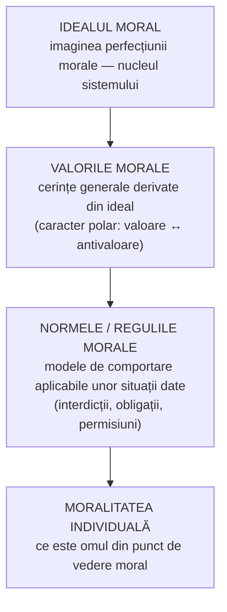
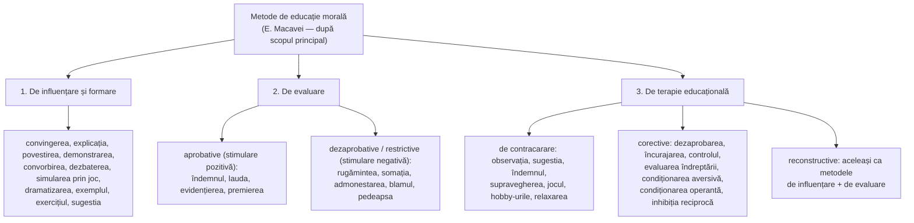

↑ [[Modulul 06 - Dimensiunile generale ale educației]] · ← [[6.1 Conținuturile generale ale educației]] · → [[6.2.2 Educația intelectuală]]

> [!abstract] Pe scurt
> - **Educația morală** formează **conștiința morală** și **conduita morală** prin interiorizarea și aplicarea valorilor **binelui moral**. S. Cristea o numește dimensiunea „cea mai profundă și mai extinsă” a educației.
> - **Conținutul moralei**: **idealul moral** (nucleul) → **valorile morale** (polare: valoare/antivaloare) → **normele și regulile** morale.
> - **Obiective**: general — conștiința morală; specifice — componenta **cognitivă** (noțiuni, judecăți, deprinderi), **afectiv-motivațional-volitivă** (sentimente, obișnuințe) și **interiorizarea** normelor și convingerilor.
> - **Conținuturi**: **moral-civice** (raportarea la societate) și **moral-individuale** (raportarea la sine).
> - **Metode** (după E. Macavei): de **influențare și formare**, de **evaluare** (aprobative/dezaprobative), de **terapie educațională** (contracarare, corective, reconstructive); S. Cristea: model **strategic** și model **instrumental**.

---

# PARTEA I — Ce spune manualul

## 1. Importanța educației morale (p. 180)

- **S. Cristea**: educația morală este **dimensiunea cea mai profundă și mai extinsă** a formării personalității, proiectată pe baza **valorilor etice**.
- **I. Jinga**: specificul educației morale depinde de două lucruri:
  1. particularitățile **moralei ca fenomen social** (care îi dau conținutul);
  2. **condițiile sociopsihice** în care se realizează.
  Jinga consideră că personalitatea nu poate fi formată fără aspectul moral, care ar trebui să domine întreaga viață spirituală.
- Multă vreme educația morală a fost **subestimată în favoarea celei intelectuale**; redresarea cere un efort general.

> [!quote] Definiție (p. 180)
> Educația morală este dimensiunea educației care vizează **formarea-dezvoltarea conștiinței morale** a personalității, pentru **optimizarea raporturilor cu lumea și cu sine**, prin **interiorizarea și aplicarea valorilor generale ale binelui moral**.

## 2. Morala — noțiune de referință (p. 180–181)

- **Morala** = formă a **conștiinței sociale** care reflectă ansamblul concepțiilor, ideilor, principiilor și normelor ce **reglementează conduita** oamenilor în relațiile personale, în familie, la muncă și în societate (după I. Bontaș [2, p. 74]).
- Etimologie: lat. ***mos, moris*** = lege, regulă, obicei. Morala este un **fenomen social obiectiv** care reglementează relațiile om–comunitate și relațiile interpersonale.

**Caracteristicile moralei** (după E. Macavei [11, p. 238]):

| Caracter | Explicație |
|---|---|
| **Reflectoriu** | idealuri, valori, norme, principii, reguli exprimate în **tradiții, obiceiuri, moravuri**, manifestate în conduită |
| **Axiologic** | faptele sunt apreciate pe axa **Bine – Rău** |
| **Normativ** | norme și reguli care impun conduite, susținute de **forța opiniei publice** |
| **Istoric și de clasă** | morala variază cu nivelul de dezvoltare socială, economică, culturală și cu structura de clasă |
| **General-uman și specific** (național, etnic) | fapte de demnitate, eroism, cinste etc. |

## 3. Structura conținutului moralei (p. 181–182)

- **Idealul moral**: imaginea **perfecțiunii morale**, **nucleul** oricărui sistem moral; reflectă ce e definitoriu pentru opțiunile de comportament ale membrilor unei comunități (p. 181).
- **Valorile morale**: cerințe generale impuse comportamentului în virtutea idealului. Autorii le stabilesc diferit:
  - **S. Cristea**: valoarea de maximă generalitate este **binele moral**;
  - **I. Nicola**: patriotismul, atitudinea față de democrație, libertatea, onestitatea, cinstea, responsabilitatea, eroismul, cooperarea, modestia (p. 182).
  - Valorile au **caracter polar** — fiecărei valori îi corespunde o **antivaloare**: necinste, egoism, individualism, nesinceritate, indisciplină.
- **Moralitatea individuală**: componentă a structurii personalității; arată **ce este omul din punct de vedere moral**; are un profil distinct (p. 182).

**Convingeri, obișnuințe, atitudini** (după S. Cristea, p. 182): acțiunea morală valorifică **convingerile morale** la nivelul:

| Concept | Definiție |
|---|---|
| **Obișnuințe morale** | comportamente **automatizate**, formate prin **exercițiu moral**, pentru adaptarea la **anumite situații** psihosociale concrete |
| **Atitudini morale** | comportamente **stabile, interiorizate** afectiv, motivațional și caracterial, care asigură adaptarea **în orice context** psihosocial |

- **Normele, preceptele, regulile morale** (după I. Nicola): **modele sau prototipuri** de comportare, elaborate de societate sau de o comunitate mai restrânsă, aplicabile unei situații date. Ca formă, sunt propoziții de tip **interdicție (obligație)** și **permisiune** (p. 182).

## 4. Obiectivele educației morale (p. 182–183)

- Obiectivele fundamentale vizează **conștiința morală** și **conduita morală** [11, 13]. **I. Bontaș** adaugă **formarea trăsăturilor de voință și caracter**.

**Clasificarea după gradul de generalitate** (după S. Cristea [7, p. 128]):

| Nivel | Conținut |
|---|---|
| **1. Obiectivul general** | **formarea-dezvoltarea conștiinței morale** |
| **2. Obiective specifice** | a) capacități **cognitive** morale (percepții, reprezentări, noțiuni, judecăți, raționamente) și **deprinderi morale** — răspunsuri automatizate la cerințe care se repetă în condiții relativ identice (după Nicola); |
| | b) capacități **afectiv-motivațional-volitive** (sentimente, interese, trăsături volitive) și **obișnuințe morale** — automatisme întărite de **motivația internă**, stabile în timp; |
| | c) capacitatea de **interiorizare a normelor** și a **convingerilor morale** |
| **3. Obiective concrete** | rezultă din **operaționalizarea** celor specifice, în activități didactice și extradidactice, formale sau nonformale |

> [!tip] De reținut
> **Deprinderea morală** = automatism format prin repetarea unei cerințe în condiții asemănătoare. **Obișnuința morală** = deprindere întărită de **motivația internă** (copilul nu doar știe că trebuie să salute, ci simte nevoia s-o facă).

## 5. Conținutul educației morale (p. 183–184)

- **E. Macavei**: conținutul este un ansamblu structurat de **cunoștințe** (reprezentări, noțiuni, idei, teorii), **trăiri afective** (emoții, sentimente), **atitudini și convingeri** și **fapte de conduită**, toate raportate la valorile morale.
- Literatura conturează **două coordonate**:

| Coordonată | Raportare | Conținuturi (după manual) |
|---|---|---|
| **Educația moral-civică** | omul ↔ **societatea** | conținut preponderent social (democratic); **educație economică** (prin și pentru muncă); **educație juridică** (prin și pentru colectivitate) |
| **Educația moral-individuală** | omul ↔ **sine** | **educație filozofică**, **educație religioasă** |

- Evoluția acestor conținuturi pe **„grade ale educației morale”** produce achiziții de tipul:
  - **virtuți personale**: sinceritate, punctualitate, curaj;
  - **virtuți sociale**: atitudini civice — politice, naționale, umaniste, juridice (p. 184).

## 6. Metodologia educației morale după E. Macavei (p. 184–185)

**Definiție**: modalitatea de concepere și realizare a acțiunii de **influențare, formare și corectare** a conștiinței și conduitei morale; calea spre **înțelegerea și acceptarea faptei morale** și spre formarea **atitudinilor și convingerilor**.

1. **Metode de influențare și formare** — direcționează și stimulează asimilarea cognitivă a valorilor, formarea atitudinilor și deprinderilor, structurarea afectiv-motivațională a personalității morale.
2. **Metode de evaluare** — constată, apreciază, diagnostichează și prognozează conduita morală:
   - **aprobative** — întăresc și recompensează faptele morale;
   - **dezaprobative (restrictive)** — impun restricții și interdicții, condamnă abaterile, corectează defectele de conduită.
3. **Metode de terapie educațională** (p. 185) — intervenții pentru **corectarea defectelor comportamentale** și integrarea noilor achiziții în structuri stabile:
   - **de contracarare** — previn stabilizarea defectelor;
   - **corective**;
   - în **cazurile grave** intervin **psihoterapeuții**: proceduri sugestive, inductive, persuasive, relaxare, proceduri cognitive, psihanalitice;
   - **terapia comportamentală sau ocupațională** (individuală și de grup) eliberează de tensiuni negative și valorifică capacitatea de muncă;
   - **ergoterapia** (prin muncă), **artterapia** (prin artă), **grupurile de întrajutorare**, **psihodrama și sociodrama** — descrise ca foarte eficiente;
   - **reconstructive** — aceleași ca metodele de influențare și de evaluare.

> Descrierea detaliată a acestor metode este dată la sfârșitul modulului → [[6.3 Metodele educației]].

## 7. Metodele morale după S. Cristea (p. 186)

| Model | Structură |
|---|---|
| **Modelul strategic** | **a) coordonata instruirii morale** („teoria” morală): metode **verbale** — expunerea morală (povestirea, explicația, prelegerea), conversația morală (dialogul, dezbaterea); metode **intuitiv-active** — exercițiul moral, exemplul moral; **studiul de caz**. **b) coordonata conduitei morale**: metode de evaluare a acțiunii morale — **aprobarea–dezaprobarea** |
| **Modelul instrumental** | listă de metode raportate la obiective globale (instruire morală – acțiune morală): explicația, prelegerea, convorbirea, dialogul, dezbaterea, povestirea, comentariul, exemplul, analiza de caz, exercițiul, aprobarea, dezaprobarea — **toate „morale”** |

---

# PARTEA II — Completări

## 7a. Modelul complet al lui S. Cristea (sursa din care preia manualul)

În articolul de dicționar „Educația morală” (S. Cristea, publicat și în R. Moldova — vezi Surse), structura este **mai bogată** decât în manual:

**Educația moral-civică** se exprimă la nivel de:
- a) **educație politică** — patriotică, democratică, umanistă etc. (**omisă în manual**, redusă la „conținut preponderent social (democratic)”);
- b) **educație economică** — prin și pentru muncă, prin și pentru valorile muncii;
- c) **educație juridică** — prin și pentru colectivitate, pentru cunoașterea și respectarea legislației, educație comunitară, familială, **rutieră** etc.

Cristea adaugă **educația civică** ca un conținut „în ascensiune”, legat de educația pentru **democrație** și pentru **drepturile omului** (Declarația Universală a Drepturilor Omului).

**Obiectivele specifice** sunt ordonate pe **două niveluri** — *teoretic* (capacități cognitive, afectiv-motivațional-volitive, interiorizarea normelor, convingeri) și *practic* (deprinderi, obișnuințe, atitudini afectiv-motivaționale, atitudini caracteriale).

**Metodele** sunt grupate în **trei modele** (manualul le prezintă doar pe primele două):
1. **strategic** — instruire morală / conduită morală;
2. **instrumental** — preluat după **I. Nicola** (*Tratat de pedagogie școlară*, 1992, p. 118–134): fiecare metodă are **procedee** proprii. De exemplu, exercițiul moral are procedee **externe** (ordine, dispoziție, îndemn, avertisment, apel, sugestie, încurajare, recompense) și **interne** (autoevaluare), iar dezaprobarea include observația, avertismentul, **ironia**, reproșul, sancțiunea;
3. **sintetic** — după trei criterii:
   - **scopul**: metode de **receptare și înțelegere** a valorilor (narațiunea, convorbirea, explicația, demonstrația morală, analiza de caz, reflecția morală); de **generare și consolidare a conduitei** (exemplul, exercițiul, sancțiunea pozitivă/negativă); de **autoconducere** (autoobservarea, autodirijarea, autoevaluarea morală);
   - **tipul de intervenție**: directă / indirectă;
   - **raportul educat–educator**: metode bazate pe **autonomia morală** a educatului / metode dependente de adult.

**Principiile educației morale** (Cristea): corespondența dintre **teoria și practica morală**; valorificarea resurselor **pozitive** ale personalității pentru eliminarea celor negative; **unitatea și continuitatea** axiologică între formele educației; **diferențierea** după vârstă și individualitate — unde Cristea trimite explicit la **Piaget** și **Kohlberg**.

> [!note] Comentariu
> Cristea leagă convingerile morale de unitatea **a ști binele – a iubi binele – a vrea binele**. Este aceeași triadă pe care o formulează, independent, Th. Lickona („knowing, desiring, doing the good”; vezi §9).

## 8. Teorii psihologice ale dezvoltării morale

| Autor | Lucrare | Idee centrală | Implicație pedagogică |
|---|---|---|---|
| **Émile Durkheim** | *L'éducation morale* (curs, publicat postum 1925) | trei elemente ale moralității: **spiritul de disciplină**, **atașamentul față de grupuri**, **autonomia voinței** | școala ca instituție de socializare morală laică |
| **Jean Piaget** | *Le jugement moral chez l'enfant* (1932) | trecere de la **morala heteronomă** (regula impusă de adult, judecata după consecințe) la **morala autonomă** (regula ca acord reciproc, judecata după intenție) | cooperarea între egali dezvoltă autonomia morală |
| **Lawrence Kohlberg** | teza de doctorat (1958); *Essays on Moral Development*, vol. I (1981) | **3 niveluri, 6 stadii**: preconvențional (pedeapsă/ascultare; interes instrumental), convențional („băiat bun/fată bună”; lege și ordine), postconvențional (contract social; principii etice universale) | **discutarea dilemelor morale** (efectul Blatt–Kohlberg, 1975); **„comunitatea justă”** (*Just Community*) în școli |
| **Carol Gilligan** | *In a Different Voice* (1982) | critică a lui Kohlberg: pe lângă **etica dreptății** există o **etică a grijii** (*ethics of care*), subevaluată de scala lui Kohlberg | relațiile și responsabilitatea față de ceilalți ca sursă a moralității |
| **Nel Noddings** | *Caring: A Feminine Approach to Ethics and Moral Education* (1984) | educația morală prin **relația de grijă**: modelare, dialog, practică, confirmare | școala ca spațiu al grijii |
| **Elliot Turiel** | *The Development of Social Knowledge* (1983) | copiii disting de timpuriu **normele morale** (rău în sine: a lovi) de **convențiile sociale** (uniforma) | nu toate regulile școlare au același statut moral |
| **James Rest** | *Moral Development: Advances in Research and Theory* (1986) | **modelul celor 4 componente**: sensibilitate morală, judecată morală, motivație morală, caracter (tărie) moral | a ști ce e bine nu garantează fapta |
| **Jonathan Haidt** | „The emotional dog and its rational tail” (2001); *The Righteous Mind* (2012) | **modelul intuiționist social**: judecata morală e în primul rând **intuitivă**, raționamentul vine apoi ca justificare; **teoria fundamentelor morale** (grijă, corectitudine, loialitate, autoritate, sacralitate, libertate) | educația morală trebuie să lucreze și cu **emoțiile și intuițiile**, nu doar cu raționamentul |

> [!note] Comentariu
> Manualul prezintă educația morală mai ales ca **transmitere de valori și norme** și formare de deprinderi. Teoriile lui Piaget și Kohlberg adaugă dimensiunea **dezvoltării judecății morale autonome** — ideea că elevul trebuie să **înțeleagă și să construiască** principii, nu doar să le preia. Obiectivul specific al „**interiorizării normelor**” din manual (§4) poate fi înțeles prin trecerea de la heteronomie la autonomie.

## 9. Abordări pedagogice contemporane

| Abordare | Autori / repere | Esență |
|---|---|---|
| **Educația caracterului** (*character education*) | **Thomas Lickona**, *Educating for Character* (1991) | caracterul are trei componente: **cunoașterea binelui**, **dorința binelui**, **facerea binelui** (*knowing, desiring, doing the good*); școala promovează explicit valori precum respectul și responsabilitatea |
| **Clarificarea valorilor** | L. Raths, M. Harmin, S. Simon, *Values and Teaching* (1966) | elevul e ajutat să-și **descopere și examineze propriile valori**, fără ca profesorul să impună; criticată pentru **relativism** |
| **Dilemele morale și comunitatea justă** | Kohlberg și colaboratorii (anii '70) | discuții pe dileme, democrație școlară, reguli stabilite împreună |
| **Etica grijii** | Gilligan, Noddings | relația profesor–elev ca model moral |
| **Învățarea socio-emoțională** (SEL) | CASEL (fondat în 1994) | cinci competențe: autocunoaștere, autocontrol, conștiință socială, abilități relaționale, luarea deciziilor responsabile |

> [!warning] O cercetare clasică de reținut
> **H. Hartshorne și M. A. May**, *Studies in the Nature of Character* (1928–1930): în testele lor, copiii care **cunoșteau** regulile morale nu erau în mod necesar mai **cinstiți** în situații reale, iar comportamentul varia mult de la o situație la alta. Aceasta relativizează încrederea în metodele **exclusiv verbale** (explicație, prelegere morală) și susține rolul **exercițiului, exemplului și climatului** școlar.

## 10. Autori din spațiul românesc și moldovenesc

- **I. Nicola**, *Tratat de pedagogie școlară* — sistematizarea clasică a **conștiinței morale** (latura cognitivă, afectivă, volitivă) și a **conduitei morale** (deprinderi, obișnuințe, trăsături de caracter).
- **E. Macavei**, *Pedagogie. Teoria educației* (2001) — clasificarea metodelor preluată de manual.
- **Maia Cojocaru-Borozan** (coautoare a manualului) — cercetări despre **cultura emoțională** a cadrelor didactice (*Teoria culturii emoționale*, Chișinău, UPS „Ion Creangă”, 2010 — de verificat), relevante pentru dimensiunea afectivă a educației morale.
- **Nicolae Silistraru**, *Etnopedagogie* (Chișinău — de verificat anul) — valorificarea tradițiilor populare în educația morală.

## 11. Legături cu legislația și curriculumul R. Moldova

- **Codul Educației, art. 11 (1)**: finalitatea principală a educației este **„formarea unui caracter integru”** — deci dimensiunea morală e explicit prioritară.
- **Art. 135 (1) lit. e)**: cadrele didactice sunt obligate **să promoveze valorile morale** de dreptate, echitate, umanism, patriotism și alte valori.
- **Art. 7 lit. e)**: educația e independentă față de **dogme religioase** și doctrine politice; **art. 135 lit. n)** interzice propaganda șovină, naționalistă, politică, religioasă sau militaristă în educație.
- **Curriculum**: **Educație moral-spirituală** (cl. I–IV), **Educație pentru societate** (gimnaziu și liceu, din 2019; module de educație pentru cetățenie democratică, drepturile omului, **integritate**, educație patriotică, interculturală), **Dezvoltare personală**, **Religia** (opțională), plus **orele de dirigenție**.

> [!note] Comentariu
> „Educația moral-civică” din manual corespunde azi, în curriculum, disciplinei **Educație pentru societate**, iar „educația moral-individuală” (inclusiv religioasă) se regăsește în **Educația moral-spirituală** și în opționalul **Religie**.

## 12. Comentariu critic

> [!warning] Probleme ale textului
> - **Trimiteri greșite**: S. Cristea este citat ca [6, p. 127], dar lucrarea lui este nr. **[7]** în bibliografie; [6] este ghidul Cojocaru, Papuc, Sadovei.
> - **Formulare confuză la norme** (p. 182): normele sunt „interdicții (obligații)” și „permisiuni (imperative)”. De fapt **obligațiile** sunt imperative, iar permisiunile nu sunt. Clasificarea logică obișnuită este: **obligații** („trebuie”), **interdicții** („nu trebuie”), **permisiuni** („este permis”).
> - **Structura educației moral-civice** (p. 184) e **incompletă**: față de sursa (Cristea), lipsește **educația politică** (patriotică, democratică, umanistă), înlocuită cu formula confuză „conținut preponderent social (democratic)”. Metodele sunt preluate doar din două din cele **trei modele** ale lui Cristea (lipsește modelul **sintetic**, singurul care include metodele de **autoeducație morală**) — vezi §7a.
> - **Caracterul „de clasă” al moralei** (după Macavei) este o moștenire a pedagogiei marxiste. Nu e discutat critic și intră în tensiune cu **caracterul general-uman** enumerat imediat după.
> - **Metodele terapeutice** (condiționare aversivă, inhibiție reciprocă, psihanaliză) depășesc competența profesorului. Manualul precizează că se folosesc „în cazuri grave” de către psihoterapeuți, dar le include totuși printre metodele educației morale. Detalii critice → [[6.3 Metodele educației]].
> - **Lipsesc** teoriile dezvoltării morale (Piaget, Kohlberg), care sunt standard în orice curs de teoria educației.
> - **Repetiție**: modelul instrumental al lui Cristea reia aproape integral lista din modelul strategic.

## 13. Întrebări de autoverificare

1. Definiți educația morală și precizați valoarea ei fundamentală.
2. Numiți și explicați cele cinci caracteristici ale moralei după E. Macavei.
3. Care este relația dintre idealul moral, valorile morale și normele morale?
4. Care e diferența dintre **deprinderea**, **obișnuința** și **atitudinea** morală?
5. Formulați obiectivul general și obiectivele specifice ale educației morale (S. Cristea).
6. Distingeți educația moral-civică de cea moral-individuală și dați exemple de conținuturi.
7. Clasificați metodele educației morale după E. Macavei.
8. Comparați morala heteronomă și autonomă (Piaget). Ce metode din manual favorizează autonomia morală?
9. Descrieți stadiile lui Kohlberg și critica lui C. Gilligan.
10. Propuneți o dilemă morală potrivită pentru o oră de dirigenție în clasa a VIII-a și obiectivele ei operaționale.

## Surse
- Manual, p. 180–186; Cristea, S. (2003), vol. I, p. 125–130; Macavei, E. (2001). *Pedagogie. Teoria educației*; Nicola, I. (2003). *Tratat de pedagogie școlară*; Jinga, I., Istrate, E. (2006); Bontaș, I. (2008).
- Cristea, S. „Educația morală” (rubrica *Dicționar*). [IBN — text integral](https://ibn.idsi.md/sites/default/files/imag_file/Educatia%20morala.pdf)
- Codul Educației al Republicii Moldova nr. 152/2014, art. 7, 11, 135.
- Durkheim, É. (1925). *L'éducation morale*. Paris: Alcan.
- Piaget, J. (1932). *Le jugement moral chez l'enfant*. Paris: Alcan.
- Kohlberg, L. (1981). *Essays on Moral Development. Vol. I: The Philosophy of Moral Development*. San Francisco: Harper & Row.
- Blatt, M., Kohlberg, L. (1975). The effects of classroom moral discussion upon children's level of moral judgment. *Journal of Moral Education*, 4(2).
- Gilligan, C. (1982). *In a Different Voice*. Cambridge, MA: Harvard University Press.
- Noddings, N. (1984). *Caring: A Feminine Approach to Ethics and Moral Education*. Berkeley: University of California Press.
- Turiel, E. (1983). *The Development of Social Knowledge: Morality and Convention*. Cambridge University Press.
- Rest, J. (1986). *Moral Development: Advances in Research and Theory*. New York: Praeger.
- Lickona, T. (1991). *Educating for Character*. New York: Bantam.
- Raths, L., Harmin, M., Simon, S. (1966). *Values and Teaching*. Columbus: Merrill.
- Haidt, J. (2001). The emotional dog and its rational tail. *Psychological Review*, 108(4); Haidt, J. (2012). *The Righteous Mind*. New York: Pantheon.
- Hartshorne, H., May, M. A. (1928–1930). *Studies in the Nature of Character*. New York: Macmillan.
