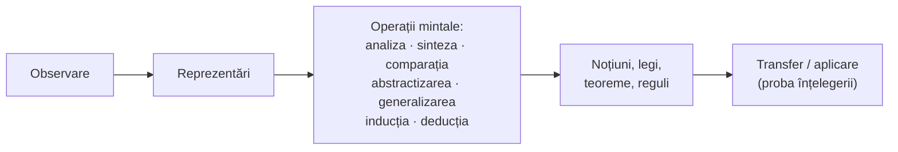

↑ [[Modulul 06 - Dimensiunile generale ale educației]] · ← [[6.2.1 Educația morală]] · → [[6.2.3 Educația tehnologică]]

> [!abstract] Pe scurt
> - **Educația intelectuală** este dimensiunea **cognitivă** a formării personalității, realizată prin valorile **adevărului științific**. S. Cristea propune chiar ipoteza echivalării ei cu **educația științifică**.
> - Scopul principal: **transformarea predispozițiilor în capacități**.
> - **Obiectiv general**: formarea-dezvoltarea **conștiinței științifice**, adică unitatea dintre latura **informativă** (cunoștințe) și cea **formativă** (capacități, strategii, atitudini).
> - **Metodele** sunt în esență **active**: exercițiul, descoperirea, problematizarea, jocul didactic.
> - **Munca intelectuală** presupune trei competențe: **informațională**, **operatorie** și **de comunicare**. Profesorul este **mediator** și **model de viață intelectuală**.

---

# PARTEA I — Ce spune manualul

## 1. Intelectul — etimologie și definiții (p. 186–187)

- Lat. ***intellectus*** = cunoaștere, înțelegere, derivat din ***intellego***, care însemna, între altele, „**a judeca bine**”. Intelectul era deci capacitatea de a judeca bine pe baza cunoașterii și înțelegerii profunde a lumii.
- **Paul Popescu-Neveanu**: intelectul este totalitatea **funcțiilor mentale centrate în jurul gândirii abstracte și logice**, capacitatea de a gândi și de a opera cu noțiuni.
- **E. Macavei** [11, p. 166–167]: intelectul include **capacități, funcții și calități** (inclusiv senzorial-perceptive) — ansamblul facultăților mentale care mijlocesc **raportarea cognitivă** la lumea exterioară și interioară.
- **Raportarea cognitivă** = receptarea, prelucrarea, asimilarea și integrarea în structurile proprii a cunoștințelor, deprinderilor, regulilor și instrumentelor de cunoaștere (p. 187).

## 2. Sensul educației intelectuale (p. 187)

- Este prezentă în **toate orientările și teoriile pedagogice**, universale și naționale.
- **Scopul principal**: **transformarea predispozițiilor în capacități**.
- Este procesul de **activare a predispozițiilor** biologice și a capacităților latente, de valorificare a experienței de cunoaștere și de construire a **comportamentului intelectiv**.

> [!quote] Definiție (p. 187, după S. Cristea [7, p. 131])
> Educația intelectuală este **dimensiunea cognitivă** a formării-dezvoltării personalității, **deschisă** psihologic și metodologic, proiectată și realizată la un **nivel logic superior**, pe baza **valorilor adevărului științific**.

- **Resursele formative** ale valorilor științei: **rigurozitate, esențialitate, obiectivitate, legitate, stabilitate epistemică, deschidere metodologică**. Ele fac din educația intelectuală o educație **prin știință și pentru știință**.
- De aici **ipoteza lui Cristea**: termenul „educație intelectuală” ar putea fi **echivalat cu „educație științifică”** (p. 187).

## 3. Dimensiunea intelectuală a personalității (p. 188)

- După **I. Nicola** [13, p. 178], ea depinde de:
  - **cantitatea și calitatea experienței** de cunoaștere și de acțiune acumulate;
  - **posibilitatea de a opera mental** cu aceste conținuturi, pentru a răspunde cerințelor mediului natural și social.
- **Avertisment**: educației intelectuale nu trebuie să i se dea un **rol exclusiv** în școală. Ponderea ei **informativă** este responsabilă adesea de **supraîncărcarea programelor și a manualelor**.
- **Definiția extinsă** (după Cristea [7, p. 132]): formarea-dezvoltarea **permanentă** a personalității prin valorile științei, reflectate în **cunoștințe – capacități – atitudini științifice**, integrate **intra-, inter- și transdisciplinar**, dobândite prin strategii **graduale**, didactice și extradidactice, pentru **adaptarea omului la realitatea obiectivă**.

## 4. Obiectivele educației intelectuale (p. 188–189)

Obiectivele creează cadrul pentru performanțele intelectuale. Pregătirea elevilor pentru cunoaștere cere competențe atât **cognitive**, cât și **aplicativ-integrative**.

| Nivel | Conținut |
|---|---|
| **1. Obiectivul general** | **formarea-dezvoltarea conștiinței științifice** — interdependența dintre latura **informativă** (concepte, judecăți, raționamente, principii, teorii, paradigme) și latura **formativă** (deprinderi, strategii, atitudini științifice) |
| **2. Obiective specifice** | • dobândirea **cunoștințelor științifice**, a deprinderilor și strategiilor intelectuale fundamentale; |
| | • formarea **capacităților intelectuale** aplicabile pedagogic și social: competențe de **cunoaștere, comunicare, creație**; |
| | • formarea **capacităților cognitive** de maximă eficiență pedagogică și socială; |
| | • capacitatea de **integrare** a cunoștințelor, deprinderilor, strategiilor și atitudinilor dobândite anterior |
| **3. Obiective concrete** | realizabile în activități didactice și extradidactice, formale sau nonformale |

> [!tip] De reținut — informativ vs. formativ
> **Latura informativă** = *ce știe* elevul (cunoștințe). **Latura formativă** = *ce poate face* cu ele (capacități de operare, strategii, atitudini). Educația intelectuală le cere pe amândouă; **obiectivul general le unește** în „conștiința științifică”.

## 5. Conținutul educației intelectuale (p. 189–190)

- După S. Cristea, se realizează **mai ales prin activitățile didactice** din procesul de învățământ, dar proiectate în perspectiva **educației permanente**, cu sprijinul educației nonformale și informale. Scopul este ca elevul să învețe să-și **dezvolte inteligența cât timp e capabil de progres**, și după terminarea școlii (→ [[3.6 Educația permanentă și autoeducația]]).
- **Transferul** informației este considerat **proba înțelegerii depline** a unui conținut (p. 189).
- **I. Jinga** [10, p. 123]: odată cu asimilarea informațiilor, ideilor și generalizărilor se formează și **capacitatea de a opera cu ele**.

**Capacitatea de cunoaștere** (p. 189–190):
- **observarea, gândirea, atenția, memoria, imaginația** sunt în același timp **premise** ale învățării și **produse** ale ei;
- **observarea și imaginația** condiționează dezvoltarea gândirii: elevul ordonează faptele observate în **reprezentări**, le **generalizează** și ajunge la **noțiuni, legi, teoreme, reguli**.

**Operațiile mintale** (p. 190): implicarea elevilor în cunoaștere formează procedeele intelectuale de prelucrare a informației:

## 6. Metodologia educației intelectuale (p. 190)

**Contrastul tradițional – modern**:

| Pedagogia tradițională | Pedagogia modernă / postmodernă |
|---|---|
| raționamentul elevului este **aproape identic** cu cel al educatorului (reproducere) | **demersul practic** al elevului este **prioritar** față de cel teoretic |

- **Metodele bazate pe acțiune** — **exercițiul** (algoritmic și euristic), **instruirea dirijată**, **jocul didactic** — sprijină conținuturile intelectuale și pe plan moral și tehnologic, precum și **socializarea** (orientare școlară și profesională, integrare socială).
- Metodele educației intelectuale sunt, în esență, **metode active**. Ele formează nu doar capacitatea de a acumula cunoștințe, ci mai ales **obișnuința de a gândi sănătos**, susținută de **dorința de a ști mereu mai mult și mai bine** (după René Hubert).
- Aceste metode sunt grupate în **strategii de învățare** care vizează [3]:
  - **deprinderile intelectuale** → prin **exercițiu**;
  - **capacitățile de rezolvare a problemelor** → prin **demonstrație** și **descoperire**;
  - **situațiile-problemă** → prin **problematizare**;
  - toate în condiții de **comunicare – cercetare – acțiune practică**.

## 7. Metodele și tehnicile de muncă intelectuală (p. 190–191)

Stăpânirea lor presupune **trei tipuri de competențe**:

| Competență | Ce presupune | Tehnici și metode |
|---|---|---|
| **Informațională** | **obținerea, consemnarea și stocarea** informațiilor | **lectură**: împărțirea textului în unități, ideile principale, lectura rapidă și eficientă (liceu); **consemnare**: plan, rezumat, conspect, fișă de lectură; **stocare**: tehnici **mnemice** |
| **Operatorie** | priceperi și deprinderi intelectuale: sistematizare, sintetizare, restructurare, alcătuirea unui plan, **rezolvarea problemelor** | scheme sintetice, planuri; **problematizarea**, **învățarea prin descoperire**, **brainstorming**, **sinectica**, **Delphi**, **Philips 6-6**, **studiul de caz**, observațiile dirijate și independente, **metoda experimentală**, **învățarea prin cercetare**, studiul bibliografic |
| **De comunicare** (orală și scrisă) | de la un răspuns bine structurat până la **referate și comunicări științifice** | organizarea răspunsului, redactarea referatelor. Comunicarea eficientă a devenit un **obiectiv fundamental al școlii actuale** [3, p. 76] |

> [!tip] De reținut
> **Informațională** = *a găsi și a păstra* informația · **Operatorie** = *a prelucra și a folosi* informația · **De comunicare** = *a transmite* informația.

## 8. Stilul de muncă intelectuală și rolul profesorului (p. 191–192)

- **Stilul de muncă intelectuală**: **atitudine pozitivă** față de studiu și capacitatea de a **alterna activitatea cu odihna**.
- **M. Momanu** [12, p. 59], perspectivă epistemologică:
  - **a cunoaște** înseamnă, înainte de toate, a-ți determina **posibilitățile și limitele** de cunoaștere;
  - **a învăța** înseamnă a ști **cum să înveți eficient**.
- **Profesorul** nu mai e doar „transmițător”, ci **mediator și organizator** al comunicării cunoașterii. El este și un **model de viață intelectuală**: un simbol personal al învățării, cu care elevii se pot compara și identifica (p. 192).

---

# PARTEA II — Completări

## 9. Teorii ale dezvoltării cognitive

| Autor | Lucrare | Idee centrală | Relevanță pentru educația intelectuală |
|---|---|---|---|
| **Jean Piaget** | *La psychologie de l'intelligence* (1947) și alte lucrări | **stadii**: senzorio-motor (0–2 ani), preoperațional (2–7), operații concrete (7–11/12), operații formale (de la 11/12 ani) | operațiile mintale enumerate de manual (analiză, generalizare, deducție) apar treptat. Conținuturile trebuie adaptate stadiului |
| **Lev S. Vygotsky** | *Gândire și limbaj* (1934); *Mind in Society* (antologie, 1978) | **zona proximei dezvoltări**: distanța dintre ce poate copilul singur și ce poate cu ajutorul adultului. Funcțiile psihice superioare au **origine socială** | profesorul ca **mediator** (idee prezentă și la Momanu); sprijin temporar (*scaffolding* — termen introdus de Wood, Bruner și Ross, 1976) |
| **Jerome S. Bruner** | *The Process of Education* (1960) | **curriculum în spirală**; orice disciplină poate fi predată într-o formă adecvată la orice vârstă; **învățarea prin descoperire** | fundamentul „descoperirii” din manual |
| **J. P. Guilford** | discursul „Creativity” (1950); *The Nature of Human Intelligence* (1967) | distincția **gândire convergentă / divergentă**; modelul structurii intelectului | competențele „de creație” din obiectivele specifice |
| **J. H. Flavell** | studiile despre **metacogniție** (1976) | cunoașterea și reglarea propriilor procese de gândire | „a învăța cum să înveți”; ideea lui Momanu despre cunoașterea propriilor limite |

## 10. Taxonomii ale obiectivelor cognitive

- **B. S. Bloom et al.**, *Taxonomy of Educational Objectives. Handbook I: Cognitive Domain* (1956): **cunoaștere – înțelegere – aplicare – analiză – sinteză – evaluare**.
- **L. W. Anderson, D. R. Krathwohl** (ed.), *A Taxonomy for Learning, Teaching, and Assessing* (2001) — **taxonomia revizuită**: **a-și aminti – a înțelege – a aplica – a analiza – a evalua – a crea**, combinate cu patru tipuri de cunoștințe: factuale, conceptuale, procedurale, **metacognitive**.

> [!note] Comentariu
> Distincția din manual dintre latura **informativă** și cea **formativă** corespunde, în taxonomia revizuită, trecerii de la nivelurile inferioare (a-și aminti, a înțelege) la cele superioare (a analiza, a evalua, a crea). Obiectivele concrete ale educației intelectuale se formulează de obicei cu verbele acestei taxonomii (→ [[Modulul 04 - Finalitățile educației]]).

## 11. Concepții despre inteligență

| Autor | Lucrare | Model |
|---|---|---|
| **Charles Spearman** | 1904 | **factorul g** (inteligența generală) |
| **Howard Gardner** | *Frames of Mind* (1983) | **inteligențe multiple**: lingvistică, logico-matematică, spațială, muzicală, corporal-kinestezică, interpersonală, intrapersonală (+ naturalistă, 1999) |
| **Robert J. Sternberg** | *Beyond IQ* (1985); *Successful Intelligence* (1996) | **teoria triarhică**: inteligență **analitică, creativă, practică** |
| **Carol S. Dweck** | *Mindset* (2006) | **mentalitatea de dezvoltare** (*growth mindset*) vs. **mentalitatea fixă**: convingerea că inteligența poate fi dezvoltată influențează efortul și rezultatele (efectele intervențiilor sunt discutate în cercetările recente) |

> [!note] Comentariu
> Echivalarea propusă de Cristea între educația intelectuală și cea **științifică** se potrivește cu modelul **factorului g** și cu inteligența logico-matematică. Modelele lui **Gardner** și **Sternberg** arată însă că intelectul include și dimensiuni **practice, creative, lingvistice, interpersonale**, pe care o „educație științifică” le-ar putea neglija.

## 12. Gândirea critică

- **Robert H. Ennis** (1987): gândirea critică este **gândirea rațională și reflexivă, orientată spre a decide ce să crezi sau ce să faci** (*reasonable reflective thinking focused on deciding what to believe or do*).
- **P. A. Facione** (coord.), *Critical Thinking: A Statement of Expert Consensus* („Raportul Delphi”, American Philosophical Association, 1990): abilitățile de bază sunt **interpretarea, analiza, evaluarea, inferența, explicarea, autoreglarea**, plus **dispoziții** precum curiozitatea și deschiderea la minte.
- **Richard Paul și Linda Elder** (Foundation for Critical Thinking): **standarde intelectuale** (claritate, acuratețe, precizie, relevanță, profunzime, logică) și **elementele gândirii**.
- **În R. Moldova**: programul **„Lectură și scriere pentru dezvoltarea gândirii critice”** (RWCT), promovat de **Centrul Educațional „Pro Didactica”**, a răspândit cadrul **Evocare – Realizarea sensului – Reflecție (ERR)** și tehnici precum SINELG, cubul, mozaicul, Știu/Vreau să știu/Am învățat.

## 13. Legături cu legislația și curriculumul R. Moldova

- **Codul Educației, art. 11 (2)**: competențele-cheie **„a învăța să înveți”** (lit. f) și **„matematică, științe și tehnologie”** (lit. d) sunt forma actuală a obiectivelor educației intelectuale; **„competențele de comunicare”** (lit. a–c) corespund competenței de comunicare din manual.
- **Art. 6**: idealul cere **independență de opinie și acțiune** — un rezultat direct al gândirii critice.
- **Curriculumul pe competențe** (Curriculumul național, ediția 2018–2019) cere ca fiecare disciplină să urmărească și **competențe transversale** de muncă intelectuală, nu doar acumularea de cunoștințe.

## 14. Comentariu critic

> [!warning] Probleme ale textului
> - **Reducerea intelectului la științific**: ipoteza „educație intelectuală = educație științifică” lasă în afară **gândirea umanistă**, interpretativă, filosofică și **creativitatea** (vezi §11).
> - **Citat fără sursă**: fraza despre inteligența pe care elevul învață „s-o dezvolte cât timp e capabil de progres” (p. 190) e între ghilimele, dar fără autor și fără trimitere.
> - **René Hubert (1965)** este citat fără să apară în bibliografie. Lucrarea principală a lui R. Hubert, *Traité de pédagogie générale*, a apărut la PUF în **1946**. Data 1965 apare și la S. Cristea, probabil pentru **traducerea românească** (*Tratat de pedagogie generală*, EDP — de verificat). Trimiterea e preluată de la Cristea fără a fi adăugată în bibliografie.
> - **Formulare deteriorată**: „prin intermediul activităților de informală și nonformală” (p. 190) — lipsesc cuvinte („educație”).
> - **Obiective specifice redundante**: „capacități intelectuale cu valoare de aplicabilitate pedagogică și socială” și „capacități cognitive de maximă eficiență pedagogică și socială” spun practic același lucru.
> - **Lipsesc** teoriile dezvoltării cognitive (Piaget, Vygotsky), taxonomia lui Bloom, gândirea critică și metacogniția — deși manualul vorbește despre „a învăța cum să înveți”. Inteligențele multiple sunt pomenite doar în Modulul 3 (→ [[3.2 Educația formală]]).
> - Metodele de creativitate în grup (brainstorming, sinectica, Delphi, Philips 6-6) sunt doar enumerate aici. Descrierea lor apare la [[6.3 Metodele educației]], dar **Delphi** și **Philips 6-6** nu sunt explicate nicăieri.

## 15. Întrebări de autoverificare

1. Explicați etimologia termenului „intelect” și definiția lui P. Popescu-Neveanu.
2. Definiți educația intelectuală după S. Cristea. Ce argumente și ce obiecții există pentru echivalarea ei cu „educația științifică”?
3. Ce înseamnă „transformarea predispozițiilor în capacități”?
4. Formulați obiectivul general și obiectivele specifice ale educației intelectuale.
5. Distingeți latura informativă de cea formativă a educației intelectuale.
6. De ce este transferul considerat proba înțelegerii? Dați un exemplu.
7. Caracterizați cele trei competențe ale muncii intelectuale și dați câte două tehnici pentru fiecare.
8. Cum diferă rolul profesorului în pedagogia tradițională și în cea modernă, conform manualului și lui Vygotsky?
9. Explicați zona proximei dezvoltări și implicațiile ei pentru metodologia educației intelectuale.
10. Construiți trei obiective operaționale pe niveluri diferite ale taxonomiei revizuite a lui Bloom.

## Surse
- Manual, p. 186–192; Cristea, S. (2003), vol. I, p. 131–132; Macavei, E. (2001); Nicola, I. (2003); Jinga, I., Istrate, E. (2006); Cerghit, I. (2006). *Metode de învățământ*. Iași: Polirom; Momanu, M. (2002). *Introducere în teoria educației*. Iași: Polirom; Popescu-Neveanu, P. (1978). *Dicționar de psihologie*. București: Albatros.
- Codul Educației al Republicii Moldova nr. 152/2014, art. 6, 11.
- Hubert, R. (1946). *Traité de pédagogie générale*. Paris: PUF.
- Piaget, J. (1947). *La psychologie de l'intelligence*. Paris: Armand Colin.
- Vygotsky, L. S. (1934). *Myshlenie i rech'* (*Gândire și limbaj*); (1978). *Mind in Society*. Harvard University Press.
- Wood, D., Bruner, J. S., Ross, G. (1976). The role of tutoring in problem solving. *Journal of Child Psychology and Psychiatry*, 17(2).
- Bruner, J. S. (1960). *The Process of Education*. Cambridge, MA: Harvard University Press.
- Bloom, B. S. (ed.) (1956). *Taxonomy of Educational Objectives. Handbook I: Cognitive Domain*; Anderson, L. W., Krathwohl, D. R. (ed.) (2001). *A Taxonomy for Learning, Teaching, and Assessing*. New York: Longman.
- Guilford, J. P. (1950). Creativity. *American Psychologist*, 5(9).
- Gardner, H. (1983). *Frames of Mind*; Sternberg, R. J. (1985). *Beyond IQ*. Cambridge University Press.
- Dweck, C. S. (2006). *Mindset: The New Psychology of Success*. New York: Random House.
- Ennis, R. H. (1987). A taxonomy of critical thinking dispositions and abilities. În J. Baron, R. Sternberg (ed.), *Teaching Thinking Skills*. New York: Freeman.
- Facione, P. A. (1990). *Critical Thinking: A Statement of Expert Consensus for Purposes of Educational Assessment and Instruction* (The Delphi Report). American Philosophical Association.
- Paul, R., Elder, L. (2006). *Critical Thinking: Tools for Taking Charge of Your Learning and Your Life*. Upper Saddle River: Pearson.
