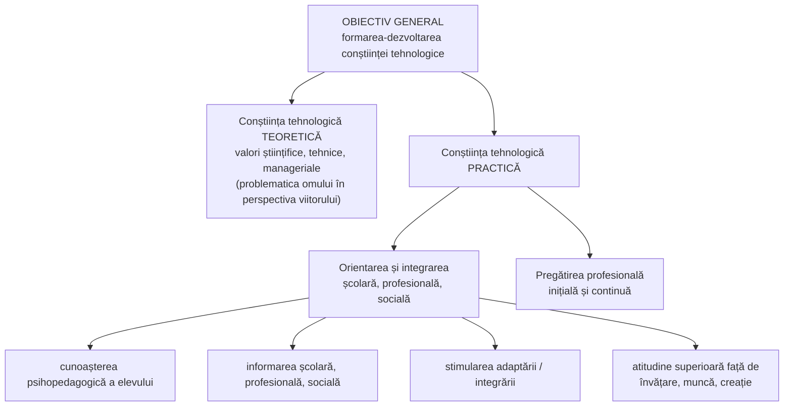

↑ [[Modulul 06 - Dimensiunile generale ale educației]] · ← [[6.2.2 Educația intelectuală]] · → [[6.2.4 Educația estetică]]

> [!abstract] Pe scurt
> - **Educația tehnologică** formează personalitatea prin **valorile științei aplicate**, cu implicații directe în **orientarea și integrarea școlară, profesională și socială**. Ea înlocuiește, ca termen mai larg, vechea „**educație profesională**”.
> - S. Cristea o numește **„educație intelectuală aplicată”**, motiv pentru care a intrat în planul de învățământ ca **disciplină de cultură generală**.
> - **Patru argumente** pentru necesitatea ei (după M. Momanu): **ontic, etic, intelectual, pragmatic**.
> - **Obiectiv general**: formarea-dezvoltarea **conștiinței tehnologice**, **teoretice** și **practice** (orientare și integrare; pregătire profesională inițială și continuă).
> - G. Văideanu: tehnologia face parte din **cultura generală**; după alfabetizarea clasică urmează **„a doua alfabetizare” — cea computațională**.

---

# PARTEA I — Ce spune manualul

## 1. Contextul: omul într-un univers tehnologic (p. 192)

- Viața omului contemporan — familia, profesia, afirmarea spirituală, stilul de viață — este **determinată esențial de progresul tehnologic**. Cultura și civilizația contemporană și-au asumat **definitiv dimensiunea tehnologică**.
- A fi format pentru o profesie și pentru viață înseamnă azi a fi pregătit să te integrezi într-un **univers tehnologic în expansiune**, care dă impresia că „totul devine posibil”.
- Această impresie ridică problema unei **analize etice a progresului tehnologic** — încă un argument pentru educația tehnologică.

## 2. Argumentele necesității educației tehnologice (p. 192–193, după M. Momanu [12, p. 127–128])

| Argument | Conținut |
|---|---|
| **Ontic** | tehnica **face parte din viața noastră**; stilul de viață se definește și în raport cu tehnica și valorile ei |
| **Etic** | e nevoie de o **valorizare etică** a progresului tehnologic și de o **conștiință a progresului tehnic**, pentru a preveni consecințele aplicării **premature sau fără discernământ** a rezultatelor cercetării |
| **Intelectual** | cultura tehnică este **parte a culturii generale**. Sensul formării intelectuale și chiar al **alfabetizării** s-a schimbat din cauza tehnologiei, atât în conținuturi, cât și în **metodologia predării și evaluării**. A fi format intelectual înseamnă și a avea **cultură tehnologică** și priceperi tehnice |
| **Pragmatic** | școala, care își asumă **orientarea și formarea profesională**, nu poate ignora **revoluția din lumea profesiilor** produsă de progresul tehnic |

> [!quote] Definiție (p. 193)
> Educația tehnologică este dimensiunea educației care vizează formarea-dezvoltarea personalității prin **valorile științei aplicate** în toate domeniile vieții sociale, cu **implicații directe în orientarea și integrarea școlară, profesională și socială**.

## 3. Educația tehnologică — „educație intelectuală aplicată” (p. 193)

- **S. Cristea**: educația tehnologică poate fi interpretată ca **„educație intelectuală aplicată”** (educație științifică aplicată). Aceasta explică includerea ei în planul de învățământ ca **disciplină de cultură generală** (nu doar profesională).
- În **societatea postindustrială**, dimensiunea ei aplicativă vizează **capacitatea generală de a aplica cunoștințele științifice** în contexte **economice, politice și culturale** [7, p. 139].

> [!tip] De reținut — de ce „tehnologică” și nu „profesională”
> **Educația profesională** pregătește pentru *o anumită meserie*. **Educația tehnologică** este **mai largă**: cultura științei aplicate necesară **oricui**, în orice profesie și în viața de zi cu zi. Educația profesională devine **o parte** a ei, subordonată funcțional (→ [[6.1 Conținuturile generale ale educației]]).

## 4. Obiectivele educației tehnologice (p. 193–194)

| Nivel | Conținut |
|---|---|
| **1. Obiectivul general** | **formarea-dezvoltarea conștiinței tehnologice** |
| **2. Obiective specifice** | **a) conștiința tehnologică teoretică** — ansamblul valorilor **științifice, tehnice și manageriale** necesare pentru a regândi problematica omului în perspectiva viitorului; |
| | **b) conștiința tehnologică practică** — două tipuri de acțiuni: **orientarea și integrarea** școlară, profesională, socială; **pregătirea profesională inițială și continuă** |
| **Obiective specifice ale orientării și integrării** | • **cunoașterea psihopedagogică** a elevului/studentului, cu accent pe **trăsăturile pozitive**; |
| | • **informarea** școlară, profesională și socială, cu accent pe potrivirea dintre **ofertă** și **potențialul real** al elevului; |
| | • stimularea **adaptării/integrării**, cu accent pe valorificarea trăsăturilor pozitive; |
| | • o **atitudine superioară** față de activitățile umane fundamentale: **învățarea, munca, creația** |
| **3. Obiective concrete** | realizabile în activități didactice și extradidactice, formale sau nonformale |

## 5. Conținutul educației tehnologice (p. 194–195)

**A. Din perspectiva orientării** — **patru acțiuni fundamentale**:
1. **cunoașterea elevului**;
2. **educarea elevului** pentru **alegerea carierei**;
3. **informarea** școlară și profesională;
4. **consilierea și îndrumarea** efectivă a elevului.

**B. Din perspectiva pregătirii profesionale inițiale și continue** — conținuturile au simultan caracter:

| Caracter | Conținut |
|---|---|
| **Cognitiv** | **gândirea tehnologică**; cunoașterea **fundamentelor științifice ale producției** postindustriale |
| **Afectiv** | **atitudinea superioară** față de activitățile practice |
| **Psihomotoriu** | **abilități de acțiune practică** în diferite situații educaționale |

## 6. Metode și cultură tehnologică (p. 195)

- Metodele și tehnicile educației tehnologice arată **legătura strânsă cu educația intelectuală** (→ [[6.2.2 Educația intelectuală]]).
- **Includerea culturii tehnologice în cultura generală** este un argument în plus pentru necesitatea acestei dimensiuni.
- **G. Văideanu** [14, p. 88–89]:
  - tehnologia face parte din **cultura generală** și trebuie să intre în **învățământul obligatoriu** ca disciplină cu funcție **culturală, formativă și orientativă**;
  - o sarcină fundamentală a educației generale este să ofere elevilor **cunoștințele științifice și tehnologice** necesare diverselor profesii — nu doar priceperi de muncă, ci o **cultură tehnologică și științifică**;
  - dacă **alfabetizarea tradițională** înseamnă scris-cititul (încă un deziderat), **a doua alfabetizare** este cea **computațională**: învățarea **comunicării cu ajutorul computerului**.

---

# PARTEA II — Completări

## 7. De la „educația prin muncă” la educația tehnologică

| Reper | Contribuție |
|---|---|
| **J. J. Rousseau**, *Emil* (1762) | Emil învață o **meserie manuală** (tâmplăria) — munca ca parte a educației generale |
| **J. H. Pestalozzi** | educația **„mâinii”**, alături de minte și inimă |
| **Georg Kerschensteiner** (Germania, începutul sec. XX) | **„școala muncii”** (*Arbeitsschule*): activitatea practică drept cale a educației civice și a formării caracterului |
| **John Dewey**, *Democracy and Education* (1916) | **learning by doing**; ocupațiile practice ca surse de cunoaștere (→ [[3.3 Educația nonformală]]) |
| **Pedagogia sovietică** (sec. XX) | **educația politehnică și prin muncă**, legată de producție — sursa termenului „educație profesională” din vechile manuale |
| **Hans Jonas**, *Das Prinzip Verantwortung* (1979) | **etica responsabilității** în civilizația tehnologică — fundamentul filosofic al „argumentului etic” din manual |

## 8. Educația STEM / STEAM și gândirea computațională

- **STEM** (*Science, Technology, Engineering, Mathematics*): acronim răspândit de **National Science Foundation** (SUA) la începutul anilor 2000. Vizează **integrarea** disciplinelor științifice și tehnice prin **proiecte și rezolvare de probleme reale**.
- **STEAM**: adăugarea **Artelor** (*Arts*), propusă de **Georgette Yakman** (2006–2008). Leagă dimensiunea tehnologică de cea estetică și creativă (→ [[6.2.4 Educația estetică]]).
- **Seymour Papert**, *Mindstorms* (1980): **constructionismul** — copilul învață construind artefacte (limbajul **Logo**). E strămoșul roboticii educaționale și al mișcării *maker*.
- **Jeannette Wing**, „Computational Thinking” (*Communications of the ACM*, 2006): **gândirea computațională** (descompunere, abstractizare, algoritmi, recunoașterea tiparelor) este o competență **pentru toți**, nu doar pentru informaticieni.

> [!note] Comentariu
> „A doua alfabetizare” a lui Văideanu („comunicarea cu ajutorul computerului”) a fost înlocuită azi de concepte mai complexe: **competență digitală**, **gândire computațională**, **alfabetizare mediatică și informațională** și, recent, **alfabetizare în domeniul inteligenței artificiale**.

## 9. Competența digitală — cadrul european DigComp

- **Recomandarea Consiliului UE privind competențele-cheie** (2006, revizuită în **2018**): **competența digitală** este una dintre cele **8 competențe-cheie**.
- **DigComp** (Joint Research Centre, Comisia Europeană): versiuni în **2013**, **2016 (2.0)**, **2017 (2.1)**, **2022 (2.2)** și **DigComp 3.0** (noiembrie 2025). Cinci **arii de competență**:
  1. **informare și date** — căutarea, evaluarea critică și gestionarea informației;
  2. **comunicare și colaborare** online;
  3. **crearea de conținut digital** (inclusiv programare, drepturi de autor);
  4. **siguranță** — protecția datelor, a sănătății și a **stării de bine**, a mediului;
  5. **rezolvarea problemelor** cu instrumente digitale.
- Versiunea **3.0** integrează explicit **inteligența artificială**, **dezinformarea**, **securitatea cibernetică**, drepturile și **sustenabilitatea**, cu peste 500 de rezultate ale învățării.
- Cadrul pentru profesori: **DigCompEdu** (2017).

## 10. Orientarea școlară și profesională — teorii

| Autor | Lucrare | Idee |
|---|---|---|
| **Frank Parsons** | *Choosing a Vocation* (1909) | modelul **trăsături–factori**: cunoașterea de sine + cunoașterea profesiilor + potrivirea lor — exact cele trei acțiuni din manual (cunoașterea elevului, informarea, consilierea) |
| **John L. Holland** | *Making Vocational Choices* (1973) | tipologia **RIASEC**: realist, investigativ, artistic, social, întreprinzător, convențional; potrivirea personalitate–mediu de muncă |
| **Donald E. Super** | *The Psychology of Careers* (1957); modelul „curcubeului carierei” (1980) | cariera ca **proces de dezvoltare pe toată durata vieții**, cu stadii și roluri multiple |

> [!note] Comentariu
> Manualul prezintă orientarea mai ales ca **potrivire** între elev și ofertă (modelul Parsons). Teoriile moderne (Super, *career construction*, *career management skills*) pun accentul pe **capacitatea elevului de a-și gestiona singur cariera** într-o lume în care profesiile se schimbă rapid. Aceasta corespunde „pregătirii profesionale **continue**” din obiectivele specifice.

## 11. Legături cu legislația și curriculumul R. Moldova

- **Codul Educației, art. 11 (2)**: competențele-cheie **„în matematică, științe și tehnologie”** (lit. d), **„digitale”** (lit. e) și **„antreprenoriale și spirit de inițiativă”** (lit. h).
- **Art. 28** (misiunea învățământului gimnazial): gimnaziul asigură **consilierea și orientarea** elevilor în alegerea **traseului individual optim** — liceu, învățământ profesional tehnic secundar sau postsecundar.
- **Art. 123–124**: învățarea pe tot parcursul vieții și formarea profesională continuă (→ [[3.6 Educația permanentă și autoeducația]]).
- **Curriculum** (Planul-cadru 2019–2020): aria curriculară **„Tehnologii”** cu disciplina **Educație tehnologică** (cl. I–IX), care include în clasa a II-a modulul obligatoriu **Educație digitală**; **Informatica**; disciplina obligatorie **Dezvoltare personală** (cl. I–XII), care conține și teme de **proiectare a carierei**.

## 12. Comentariu critic

> [!warning] Probleme ale textului
> - **Metodele lipsesc**: secțiunea „Metodele și tehnicile educației tehnologice” (p. 195) **nu numește nicio metodă**. Spune doar că există o legătură cu educația intelectuală și repetă argumentul culturii generale. Se puteau menționa: **proiectul**, **lucrările practice**, **studiul de caz**, **modelarea**, **simularea**, **vizitele la întreprinderi**, **învățarea bazată pe probleme**.
> - **Repetiție**: argumentul „cultura tehnologică face parte din cultura generală” apare de trei ori (p. 193, 195 de două ori).
> - **Ghilimele fără deschidere** la finalul listei celor patru acțiuni (p. 195): semn al unui **citat nemarcat** din altă sursă.
> - **Informații datate**: „a doua alfabetizare — comunicarea cu ajutorul computerului” (Văideanu, 1996) reflectă anii '90. Lipsesc competența digitală, internetul, rețelele sociale, inteligența artificială, securitatea online.
> - **Confuzie conceptuală**: obiectivele specifice ale orientării școlare și profesionale (cunoașterea elevului, informarea, consilierea) țin mai degrabă de **consilierea carierei** decât de o „conștiință tehnologică”. Legătura cu **știința aplicată** din definiție nu este explicată.
> - **Etica tehnologiei** e anunțată ca argument (p. 192), dar nu se regăsește în obiective sau conținuturi.
> - Formulări greu inteligibile: „reactualizarea problematicii omului în context viitorologic”.

## 13. Întrebări de autoverificare

1. De ce a înlocuit S. Cristea termenul „educație profesională” cu „educație tehnologică”?
2. Explicați cele patru argumente pentru necesitatea educației tehnologice.
3. Definiți educația tehnologică. Ce înseamnă că ea este o „educație intelectuală aplicată”?
4. Distingeți conștiința tehnologică teoretică de cea practică.
5. Care sunt cele patru acțiuni fundamentale ale orientării școlare și profesionale?
6. Ce caracter (cognitiv, afectiv, psihomotoriu) au conținuturile pregătirii profesionale? Dați câte un exemplu.
7. Ce înțelegea G. Văideanu prin „a doua alfabetizare”? Cum ar trebui reformulat conceptul azi?
8. Numiți ariile de competență din DigComp și legătura lor cu art. 11 al Codului Educației.
9. Propuneți trei metode potrivite pentru educația tehnologică în gimnaziu și argumentați alegerea.

## Surse
- Manual, p. 192–195; Momanu, M. (2002). *Introducere în teoria educației*. Iași: Polirom, p. 127–128; Cristea, S. (2003), vol. I, p. 139; Văideanu, G. (1996). *UNESCO-50-Educație*, p. 88–89.
- Codul Educației al Republicii Moldova nr. 152/2014, art. 11, 28, 123–124.
- MECC (2019). *Planul-cadru pentru învățământul primar, gimnazial și liceal, 2019–2020*. Chișinău.
- Recomandarea Consiliului UE din 22 mai 2018 privind competențele-cheie pentru învățarea pe tot parcursul vieții.
- Joint Research Centre (2022). *DigComp 2.2*; Joint Research Centre (2025). *DigComp 3.0: European Digital Competence Framework*. [JRC — DigComp 3.0](https://joint-research-centre.ec.europa.eu/projects-and-activities/education-and-training/digital-transformation-education/digital-competence-framework-digcomp/digcomp-30_en)
- Redecker, C. (2017). *European Framework for the Digital Competence of Educators: DigCompEdu*. Luxembourg: Publications Office of the EU.
- Papert, S. (1980). *Mindstorms: Children, Computers, and Powerful Ideas*. New York: Basic Books.
- Wing, J. M. (2006). Computational thinking. *Communications of the ACM*, 49(3), 33–35.
- Parsons, F. (1909). *Choosing a Vocation*. Boston: Houghton Mifflin.
- Holland, J. L. (1973). *Making Vocational Choices*. Englewood Cliffs: Prentice-Hall.
- Super, D. E. (1957). *The Psychology of Careers*. New York: Harper & Row.
- Jonas, H. (1979). *Das Prinzip Verantwortung*. Frankfurt am Main: Insel.
- Dewey, J. (1916). *Democracy and Education*. New York: Macmillan.
