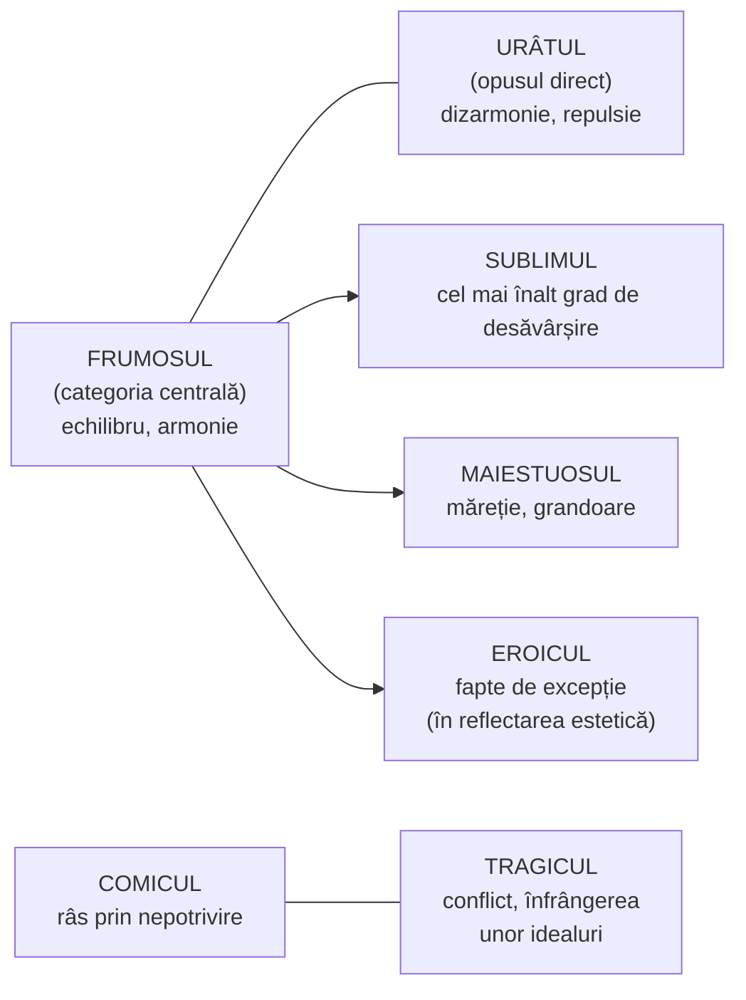

↑ [[Modulul 06 - Dimensiunile generale ale educației]] · ← [[6.2.3 Educația tehnologică]] · → [[6.2.5 Educația psihofizică]]

> [!abstract] Pe scurt
> - **Educația estetică** formează personalitatea prin **receptarea, evaluarea, trăirea și crearea** valorilor **frumosului** din **natură, societate și artă**.
> - Are un dublu scop: pregătirea pentru **valorificarea** (receptarea) și pentru **crearea** valorilor estetice.
> - **Categoriile educației estetice**: **idealul estetic, gustul estetic, sentimentele și convingerile estetice, judecata estetică, spiritul de creație**. Categoriile **esteticii** (după I. Bontaș) sunt: frumos, sublim, eroic, maiestuos, comic, tragic, urât.
> - **Obiective**: dezvoltarea **atitudinilor estetice** (receptare) și a **capacității de creație**. Pe planul proceselor psihice: **cognitiv-afectiv, afectiv-aptitudinal, formativ-praxiologic**.
> - Accentul trebuie mutat de la **reproducere** la **cultivarea potențialului creativ**.

---

# PARTEA I — Ce spune manualul

## 1. Specificul estetic (p. 195–196)

- Educația estetică urmărește **cunoașterea valorilor estetice**, formarea **atitudinilor** de receptare și apreciere a frumosului și a **aptitudinilor creatoare**.
- Preocuparea pentru frumos și pentru **reflectarea expresivă** a realității a existat dintotdeauna și a contribuit la **umanizarea** omului.

| Știința | Arta |
|---|---|
| reflectă lumea prin **concepte și legi** | exprimă realitatea prin **imaginea estetică** |

- Domeniul frumosului are totuși **regularități, categorii și legi**, studiate de **estetică** (p. 196).
- Valorile estetice **nu modelează personalitatea de la sine**, doar prin contactul cu arta. De aceea s-a dezvoltat educația estetică, o componentă a educației cu **obiective estetice explicite**.
- Ea pregătește subiectul pentru **valorificare** (receptare, asimilare) și pentru **crearea** valorilor estetice.

> [!quote] Definiție (p. 196)
> Educația estetică este dimensiunea educației care vizează formarea-dezvoltarea personalității prin **receptarea, evaluarea, trăirea și crearea valorilor frumosului** din **natură, societate și artă**.

## 2. Caracterul obiectiv al valorilor frumosului (p. 196; după [7, p. 144; 2, p. 78])

| Domeniu | Valori ale frumosului |
|---|---|
| **Natura** | armonie, echilibru, proporționalitate |
| **Societatea** | organizare, interrelație, funcționalitate |
| **Arta** | valori exemplare — concepute **clasic** (prin **imitarea naturii**) sau **modern** (prin **recrearea, reconstrucția** frumosului) |

Aceste valori sunt sintetizate în **categorii**: **idealul estetic** (modelul de frumos); **simțul** estetic (capacitatea de a *percepe și reprezenta* frumosul) și **gustul** estetic (capacitatea de a *explica și înțelege* frumosul) — care împreună permit **evaluarea și trăirea** frumosului; **spiritul de creație estetică** (aptitudinea de a *crea* frumosul).

## 3. Categoriile educației estetice (p. 197)

| Categorie | Definiție |
|---|---|
| **Idealul estetic** | **modelul estetic** spre care tinde un individ, o comunitate sau un artist, în acord cu **idealul social al epocii**. E format din teze, principii, norme care orientează atitudinea estetică într-o epocă |
| **Gustul estetic** | capacitatea de a **percepe și trăi frumosul**, de a reacționa **spontan** prin satisfacție sau insatisfacție |
| **Sentimentele estetice** | configurații de **emoții** rezultate din trăirea **profundă și durabilă** a frumosului |
| **Convingerile estetice** | **idei despre frumos** cu puternice mobiluri interne, care îl îndeamnă pe om să introducă frumosul în **modul său de viață** și în relațiile cu ceilalți |
| **Judecata estetică** | categorie **predominant intelectuală**: capacitatea de **apreciere pe baza unor criterii** de evaluare |
| **Spiritul de creație estetică** | capacitatea și abilitatea de a **imagina și crea** frumosul |

> [!tip] De reținut
> Educația în general, și cea estetică în special, trebuie să treacă de la **ipoteza reproductivă** a învățământului la **cultivarea potențialului creativ** al personalității (p. 197).

## 4. Categoriile esteticii (p. 197–198, după I. Bontaș [2, p. 78])

| Categorie | Explicație (după manual) | Exemplu dat de manual |
|---|---|---|
| **Frumosul** | **categoria centrală**: echilibru și armonie în obiecte, fenomene, procese din natură, societate, gândire | un peisaj, o relație interumană, o judecată morală corectă |
| **Sublimul** | cel mai înalt grad de **desăvârșire** | iubirea |
| **Eroicul** | fapte eroice, de excepție, care țin de **reflectarea estetică**, nu de realitate | — |
| **Maiestuosul** | **măreția, grandoarea** | Catedrala Notre-Dame, Turnul Eiffel, podul Alexandre III (Paris) |
| **Comicul** | provoacă **râsul**, de obicei prin **nepotrivirea** elementelor și situațiilor | o piesă de teatru, o situație cotidiană |
| **Tragicul** | **gravitatea** unei situații, determinată de un **conflict** care se încheie cu **înfrângerea unor idealuri** și valori | — |
| **Urâtul** | **opusul direct al frumosului**: dizarmonie, neplăcere, repulsie | — |

## 5. Obiectivele educației estetice (p. 198–199)

**Clasificarea după finalitate**:

| Categoria de obiective | Obiective |
|---|---|
| **I. Dezvoltarea atitudinilor estetice** — capacitatea de a **percepe, înțelege și folosi** adecvat valorile estetice | • **sensibilizarea** față de fenomenul estetic; • formarea **gustului** și a **judecăților** estetice |
| **II. Dezvoltarea capacității de a crea** valori estetice noi | • **descoperirea aptitudinilor speciale** pentru diferite genuri de artă și dezvoltarea lor; • formarea **deprinderilor și abilităților** cerute de creația artistică: **reproducere, interpretare, creație** |

**Clasificarea după interacțiunea proceselor psihice** („Școala de la Chicago”, după Bontaș [2]):

| Obiectiv | Conținut |
|---|---|
| **Cognitiv-afectiv** | însușirea valorilor estetice; capacitatea de a **percepe, înțelege și aprecia** frumosul |
| **Afectiv-aptitudinal** | modelarea **sentimentelor și convingerilor**, a **simțului și gustului** estetic |
| **Formativ-praxiologic** | capacitatea de a **păstra și promova** valorile frumosului și de a dezvolta **spiritul de creație** |

## 6. Conținuturile specifice (p. 199)

- Angajează **toate valorile frumosului**, existente și potențiale, din **artă, societate și natură** [7, p. 145].
- **Contexte**:
  - **formal și nonformal**: valorile din **literatură, muzică, pictură, sculptură, arhitectură, teatru, cinema** etc., transmise direct sau indirect prin programele școlare și universitare;
  - **informal**: **mass-media**.

## 7. Metodologia educației estetice (p. 199)

- **Metode și tehnici**: **lectura** (dirijată, explicativă), **narațiunea**, **introspecția**, **observarea**, **studiul de caz**, **descoperirea**, **exercițiul**, **jocul didactic**, **dramatizarea**, **studiul documentelor**, **instruirea programată** de tip estetic.
- Legătura cu disciplinele artistice le dă **varietate și flexibilitate** și permite folosirea lor în **mediul extrașcolar**: **cercuri și cluburi artistice**, **excursii tematice**, **spectacole, filme**, mass-media, precum și în spațiul **comunității locale** (→ [[3.3 Educația nonformală]]).

---

# PARTEA II — Completări

## 8. Repere filosofice ale educației estetice

| Autor | Lucrare | Contribuție |
|---|---|---|
| **Platon** | *Republica* (cărțile II–III) | **muzica** (în sens larg: poezie, melodie, ritm) formează sufletul. Arta trebuie **controlată** pentru efectul ei moral |
| **Aristotel** | *Poetica*; *Politica*, cartea VIII | **catharsis** (purificarea prin tragedie); muzica în educația cetățeanului |
| **A. G. Baumgarten** | *Aesthetica* (1750) | fondează **estetica** ca disciplină (știința cunoașterii sensibile) |
| **I. Kant** | *Critica facultății de judecare* (1790) | **judecata de gust**: plăcerea estetică este **dezinteresată** și totuși pretinde **universalitate**. Distinge **frumosul** de **sublim** (matematic și dinamic) |
| **Friedrich Schiller** | *Scrisori despre educația estetică a omului* (1795) | educația estetică **împacă** în om **impulsul sensibil** și **impulsul formal** prin **impulsul de joc** (*Spieltrieb*). Omul estetic este condiția omului **liber** și a unei societăți armonioase: prin frumusețe se ajunge la libertate |
| **Tudor Vianu** | *Estetica* (1934–1936) | sistematizarea românească clasică a valorilor și categoriilor estetice |

> [!note] Comentariu
> Schiller dă educației estetice un rol mult mai ambițios decât manualul: nu doar formarea gustului, ci **formarea omului întreg** și chiar **pregătirea pentru libertatea politică**. Relația frumos–bine (vezi exemplul manualului: „o judecată morală corectă e frumoasă”) are rădăcini în idealul grecesc al **kalokagathiei** (frumos și bun).

## 9. Teorii pedagogice moderne ale educației prin artă

| Autor | Lucrare | Idee centrală |
|---|---|---|
| **John Dewey** | *Art as Experience* (1934) | experiența estetică nu e separată de viață: este forma **deplină, unificată** a oricărei experiențe obișnuite. Arta nu trebuie închisă în muzee („concepția de muzeu” a artei) |
| **Herbert Read** | *Education Through Art* (1943) | reluând o teză a lui Platon, susține că **arta trebuie să fie baza educației**. Clasifică tipurile de expresie artistică a copiilor după tipuri psihologice |
| **Viktor Lowenfeld** | *Creative and Mental Growth* (1947) | **stadiile dezvoltării desenului** copilului (mâzgăleală, preschematic, schematic etc.). Profesorul **nu impune modele**, ci încurajează expresia proprie |
| **Elliot W. Eisner** | *The Educational Imagination* (1979); *The Arts and the Creation of Mind* (2002) | artele dezvoltă forme specifice de gândire: **judecata calitativă**, toleranța la ambiguitate, faptul că **problemele pot avea mai multe soluții**. Propune **obiective expresive** (rezultate deschise, neprevăzute) alături de obiectivele comportamentale |
| **Proiectul Zero**, Harvard | fondat în 1967 de **Nelson Goodman** (ulterior condus de H. Gardner, D. Perkins) | cercetarea cogniției artistice; **Studio Thinking** (L. Hetland, E. Winner et al., 2007): 8 „**obișnuințe mentale de atelier**” (a dezvolta meșteșugul, a persevera, a exprima, a observa, a imagina, a explora, a reflecta, a înțelege lumea artei) |
| **Discipline-Based Art Education** (Getty Center, anii '80) | — | educația artistică integrează patru domenii: **creația**, **istoria artei**, **critica de artă**, **estetica** — corespund aproximativ categoriilor din manual (creație; ideal; judecată) |

> [!warning] Transferul — ce spune cercetarea
> Afirmația frecventă că artele „îmbunătățesc rezultatele la matematică și citire” are **dovezi slabe**. Metaanalizele **REAP** (E. Winner, L. Hetland, 2000) și raportul OCDE ***Art for Art's Sake?*** (Winner, Goldstein, Vincent-Lancrin, 2013) au găsit efecte de transfer **limitate** (unele pentru teatru → abilități verbale, muzică → abilități spațiale/IQ, în mică măsură). Concluzia lor: educația artistică se justifică în primul rând **prin valoarea ei proprie** — gândire artistică, sensibilitate, creativitate, înțelegere culturală.

## 10. Documente internaționale și autori din R. Moldova

- **UNESCO**: *Road Map for Arts Education* (Conferința de la **Lisabona, 2006**); *Seoul Agenda: Goals for the Development of Arts Education* (**2010**); *UNESCO Framework for Culture and Arts Education* (Conferința mondială de la **Abu Dhabi, 2024**).
- **Ion Gagim** (Bălți) — fondatorul unei școli științifice de **educație muzical-artistică**; *Dimensiunea psihologică a muzicii* (Iași, Timpul, 2003).
- **Vlad Pâslaru** — fondatorul unei școli de **educație literar-artistică**; *Introducere în teoria educației literar-artistice* (Chișinău, Sigma, 2013).

## 11. Legături cu legislația și curriculumul R. Moldova

- **Codul Educației, art. 11 (2) lit. i)**: competența-cheie **„de exprimare culturală și de conștientizare a valorilor culturale”** — forma actuală a obiectivelor educației estetice.
- **Art. 15 (1) lit. m)** și **art. 36–37**: **învățământul extrașcolar** — școli de **arte plastice, muzică, teatru**, centre și **case de creație**; activitățile sunt **benevole** și dezvoltă potențialul **cognitiv, afectiv și acțional**. Acestea sunt cadrul nonformal indicat de manual.
- **Art. 31**: liceele cu **filieră vocațională, profil de arte**.
- **Curriculum** (Planul-cadru 2019–2020): aria curriculară **„Arte”** — **Educație muzicală** (cl. I–VIII) și **Educație plastică** (cl. I–VII). Educația estetică trece și prin **Limba și literatura română** (educația literar-artistică).

## 12. Comentariu critic

> [!warning] Probleme ale textului
> - **Categoriile sunt prezentate de două ori**, în liste parțial diferite (p. 196: ideal, simț/gust, spirit de creație; p. 197: ideal, gust, sentimente și convingeri, judecată, spirit de creație). Nu e clar dacă **simțul estetic** este o categorie separată.
> - **Confuzie între două tipuri de categorii**: categoriile **educației estetice** (capacități ale persoanei: gust, judecată) și categoriile **esteticii** (calități ale obiectelor: frumos, sublim, tragic) sunt puse una după alta, fără a explica diferența.
> - **Definiții discutabile**:
>   - **sublimul** ca „cel mai înalt grad de desăvârșire”, cu exemplul **iubirii**, nu corespunde tradiției lui E. Burke (1757) și Kant (1790). Pentru ei sublimul este ceea ce **depășește măsura** imaginației prin **mărime sau forță** (oceanul în furtună, cerul înstelat), trezind un amestec de teamă și admirație;
>   - **eroicul** „nu ține de realitate, ci de reflectarea ei estetică” — dar faptele eroice reale există; categoria estetică privește **reprezentarea** lor;
>   - **urâtul** e tratat doar ca antivaloare. Arta modernă folosește urâtul ca **valoare expresivă** (K. Rosenkranz, *Estetica urâtului*, 1853; U. Eco, *Istoria urâtului*, 2007).
> - **Exemple exclusiv pariziene** pentru maiestuos (Notre-Dame, Eiffel, podul Alexandre III): lipsesc exemple din **patrimoniul local** (ex. mănăstirile Căpriana, Curchi, Saharna; Orheiul Vechi), mai apropiate de elevi.
> - **„Școala de la Chicago”** (p. 198) — trimitere neexplicată. Probabil se referă la grupul lui **B. S. Bloom** de la Universitatea din Chicago, autorii taxonomiilor domeniului **cognitiv** (1956) și **afectiv** (Krathwohl, Bloom, Masia, 1964) (de verificat în Bontaș).
> - **Erori de redactare**: „judecata estetică — aprecierea **rolurilor** estetice” (probabil „valorilor”); în definiția de pe p. 196 apare „valorilor/rumosu/ui” (= „frumosului”); „a percepe însuşi” (= „însuși” → probabil „a percepe, a înțelege”).
> - **Informații datate**: „instruirea programată de tip estetic” e o metodă a anilor '60–'70. Mass-media e prezentată doar ca sursă de valori estetice, fără riscul **kitsch-ului** și fără **educația pentru media**.

## 13. Întrebări de autoverificare

1. Definiți educația estetică și precizați cele trei domenii ale frumosului.
2. Prin ce se deosebește reflectarea artistică a realității de cea științifică?
3. Distingeți gustul estetic de judecata estetică și de idealul estetic.
4. Care e diferența dintre categoriile educației estetice și categoriile esteticii?
5. Caracterizați frumosul, sublimul, comicul și tragicul, cu exemple proprii (inclusiv din cultura națională).
6. Clasificați obiectivele educației estetice după cele două criterii din manual.
7. Ce înseamnă trecerea de la „ipoteza reproductivă” la „cultivarea potențialului creativ”?
8. Explicați ideea lui Schiller despre educația estetică drept cale spre libertate.
9. Ce spune cercetarea despre efectele de transfer ale educației artistice?
10. Proiectați o activitate extrașcolară de educație estetică și precizați obiectivele cognitiv-afective, afectiv-aptitudinale și formativ-praxiologice.

## Surse
- Manual, p. 195–199; Cristea, S. (2003), vol. I, p. 144–145; Bontaș, I. (2008). *Tratat de pedagogie*, p. 78.
- Codul Educației al Republicii Moldova nr. 152/2014, art. 11, 15, 31, 36–37.
- MECC (2019). *Planul-cadru pentru învățământul primar, gimnazial și liceal, 2019–2020*.
- Baumgarten, A. G. (1750). *Aesthetica*; Kant, I. (1790). *Kritik der Urteilskraft*; Burke, E. (1757). *A Philosophical Enquiry into the Origin of Our Ideas of the Sublime and Beautiful*.
- Schiller, F. (1795). *Über die ästhetische Erziehung des Menschen in einer Reihe von Briefen*.
- Dewey, J. (1934). *Art as Experience*. New York: Minton, Balch & Co.
- Read, H. (1943). *Education Through Art*. London: Faber & Faber.
- Lowenfeld, V. (1947). *Creative and Mental Growth*. New York: Macmillan.
- Eisner, E. W. (2002). *The Arts and the Creation of Mind*. New Haven: Yale University Press.
- Hetland, L., Winner, E., Veenema, S., Sheridan, K. (2007). *Studio Thinking*. New York: Teachers College Press.
- Winner, E., Goldstein, T., Vincent-Lancrin, S. (2013). *Art for Art's Sake? The Impact of Arts Education*. Paris: OECD Publishing.
- Rosenkranz, K. (1853). *Ästhetik des Häßlichen*; Eco, U. (2007). *Storia della bruttezza*. Milano: Bompiani.
- Vianu, T. (1934–1936). *Estetica*. București.
- Gagim, I. (2003). *Dimensiunea psihologică a muzicii*. Iași: Timpul; Pâslaru, Vl. (2013). *Introducere în teoria educației literar-artistice*. Chișinău: Sigma.
- UNESCO (2006). *Road Map for Arts Education*; UNESCO (2010). *Seoul Agenda*; UNESCO (2024). *Framework for Culture and Arts Education*.
