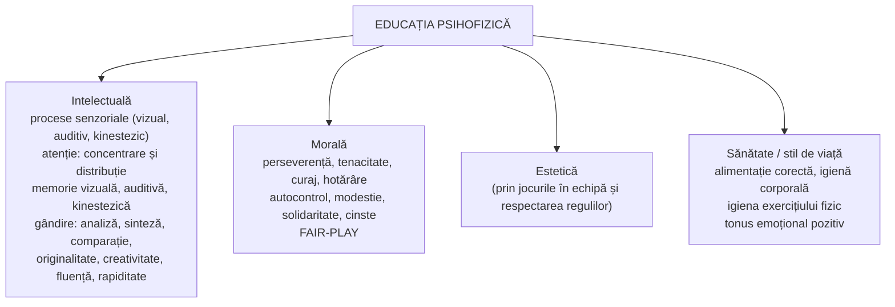

↑ [[Modulul 06 - Dimensiunile generale ale educației]] · ← [[6.2.4 Educația estetică]] · → [[6.3 Metodele educației]]

> [!abstract] Pe scurt
> - **Educația psihofizică** formează personalitatea prin valorile care **cultivă și întrețin sănătatea generală** a organismului — **fizică și psihică**.
> - Termenul lui **S. Cristea** înlocuiește „educația fizică / corporală”: în societatea postindustrială, foarte solicitantă, sănătatea nu mai poate fi redusă la **latura corporală** sau la educația sanitară, igienică, sportivă.
> - **Obiectiv general**: formarea-dezvoltarea **conștiinței psihofizice**, printr-o cultură psihică, fizică, medicală, igienico-sanitară și sportivă.
> - **Metodele** sunt bazate pe **acțiune**: exercițiul, jocul, activitățile practice, demonstrația.
> - Este strâns legată de **toate celelalte dimensiuni**: intelectuală (atenție, memorie, gândire), morală și estetică (**fair-play**, perseverență, autocontrol).

---

# PARTEA I — Ce spune manualul

## 1. Repere istorice (p. 199–200)

- Preocuparea pentru **sănătate, îngrijirea corpului, rezistență și forță** a existat de la începuturile omenirii, fiind necesară **supraviețuirii**.
- Primele reflecții despre educația fizică apar în **Antichitate**, la **Xenofon, Platon și Aristotel**: exercițiile fizice erau o **condiție a dezvoltării omului** și se practicau în școală.
- Lumea antică urmărea **dezvoltarea armonioasă a trupului și a sufletului** — formula **„minte sănătoasă în trup sănătos”**.
- **Grecii** au inițiat **Jocurile Olimpice**, prezentate de manual ca manifestare a **curajului și onestității** (p. 200).

## 2. Educația fizică în sens pedagogic extins (p. 200)

- Azi **educația fizică este disciplină obligatorie** în toate ciclurile de învățământ.
- În sens larg, este o dimensiune situată pe axa **acelorași valori fundamentale** și integrată în ansamblul celorlalte dimensiuni (morală, intelectuală, tehnologică, estetică).
- **Scopuri**:
  - dezvoltarea **armonioasă a organismului**;
  - **întărirea, menținerea și redobândirea sănătății**; **călirea** organismului;
  - formarea și perfecționarea **priceperilor și deprinderilor motrice**;
  - cultivarea **calităților psihofizice** necesare oricărei activități: muncă, profesie, sport.

## 3. De la „fizică” la „psihofizică” (p. 200–201)

- **S. Cristea** pune în centru o valoare fundamentală a existenței umane: **sănătatea fizică și psihică**. De aici numele de **dimensiune psihofizică**.
- **Argumentul**: mediul natural, economic, politic, cultural și comunitar al societăților industriale și postindustriale este **extrem de solicitant**. Activitatea nu mai poate fi redusă la:
  - latura **„corporală”**;
  - conținuturi specifice izolate: educația **sanitară, igienică, sportivă, medicală**.
- **Pedagogia postmodernă** cere un **salt**: corelarea obiectivelor **dezvoltării fizice** cu cele ale **dezvoltării psihice integrale**.

> [!quote] Definiție (p. 201)
> Educația psihofizică este dimensiunea educației integrale axată pe formarea-dezvoltarea personalității prin acele **valori pedagogice fundamentale care cultivă și întrețin sănătatea generală a organismului uman**.

- Ea valorifică deplin **potențialul anatomo-fiziologic și psihologic** al omului, în **„condiții igienico-sanitare”** specifice societății moderne și postmoderne, care cere **„o minte sănătoasă într-un corp sănătos”** (p. 201).

> [!tip] De reținut — fizic vs. psihofizic
> **Educația fizică** = corpul: mișcare, forță, rezistență, deprinderi motrice. **Educația psihofizică** = **corp + psihic** ca unitate: sănătate generală, echilibru emoțional, voință, atenție, stil de viață. Educația fizică devine **o componentă** a celei psihofizice.

## 4. Obiectivele educației psihofizice (p. 201–202)

| Nivel | Conținut |
|---|---|
| **1. Obiectivul general** | **formarea-dezvoltarea conștiinței psihofizice**, printr-o **cultură** adecvată: psihică și fizică, medicală, igienico-sanitară, sportivă |
| **2. Obiective specifice** | • formarea-dezvoltarea **capacităților și deprinderilor motrice**; |
| | • definitivarea **conduitei igienico-sanitare**; |
| | • corelarea **dezvoltării biologice** echilibrate cu **dezvoltarea psihică** echilibrată; |
| | • dezvoltarea **atenției concentrate**, a **spiritului de observație** și a **gândirii flexibile**, prin exerciții care stimulează **independența și creativitatea**; |
| | • educarea **voinței** în condiții de **competitivitate**, cu obstacole interne și externe; |
| | • valorificarea potențialului **temperamental, aptitudinal și caracterial** în activitățile sportive orientate spre **(auto)perfecționarea** resurselor fizice și psihice |
| **3. Obiective concrete** | trebuie să asigure **deschiderea spre problematica sănătății psihofizice**, cultivată **permanent** printr-o existență **activă, rațională, eficientă** |

## 5. Conținuturile specifice (p. 202)

Conținuturile variază în funcție de:
- **vârsta** elevului (biologică și/sau psihologică);
- **forma** activității: **formală** (lecția de educație fizică) sau **nonformală** — activități extrașcolare, **cercuri sportive**, aprofundate după **talentul și interesele** elevilor;
- **module sau teme de studiu** pentru obiectivele proprii educației psihofizice.

## 6. Metodologia educației psihofizice (p. 202)

| Tip | Metode și tehnici |
|---|---|
| **Metode bazate pe acțiune** | **exercițiul**, **jocul** (didactic, cu roluri, de creație), **activitățile practice**, **studiul de caz** |
| **Tehnici didactice** | **observarea**, **demonstrația**, **exercițiul algoritmizat sau problematizat**, **instruirea programată** |

## 7. Relațiile cu celelalte dimensiuni (p. 202–203)

- **Relația cu educația intelectuală**: contribuie la dezvoltarea **proceselor senzoriale**, a **atenției** (concentrare și distribuție), a **memoriei** (vizuale, auditive, kinestezice), a **operațiilor și calităților gândirii**.
- **Relația cu educația morală și estetică**: prin **jocurile în echipă**, **respectarea regulilor**, **finalizarea activităților** începute se dezvoltă:
  - **calități etico-morale**: perseverența, tenacitatea, curajul, hotărârea;
  - **trăsături pozitive de caracter**: autocontrol, modestie, solidaritate, competitivitate, cinste;
  - **spiritul fair-play**: spirit de echipă, spirit de luptă, dorința de a învinge, **respectarea adversarului**, **acceptarea înfrângerii** și respectarea învingătorului.
- **Stil de viață sănătos**: deprinderi de **alimentație corectă**, de **igienă corporală** și **igienă a exercițiului fizic**. Evitarea exceselor alimentare și exercițiul fizic **cu măsură** mențin un **tonus emoțional pozitiv**, important pentru **sănătatea psihică** (p. 202–203).

---

# PARTEA II — Completări

## 8. Istoria educației fizice — precizări și repere

| Reper | Contribuție |
|---|---|
| **Grecia antică** | **gimnastica** (în gimnazii și palestre) și **muzica** stăteau la baza educației; idealul **kalokagathia** (frumos și bun). **Jocurile Olimpice** — după tradiție, din **776 î.Hr.**, la Olympia, ca **festival religios** închinat lui Zeus |
| **Platon**, *Republica* (cartea III) | gimnastica și muzica trebuie **echilibrate**: numai gimnastica face omul aspru, numai muzica îl face moale |
| **Juvenal**, *Satira a X-a* (sec. I–II d.Hr.) | autorul **roman** al formulei ***mens sana in corpore sano***. În original este o **rugăciune** — să ceri zeilor o minte sănătoasă într-un corp sănătos — nu un program pedagogic |
| **Vittorino da Feltre** (sec. XV) | școala *La Casa Giocosa* (Mantova): exerciții fizice în educația umanistă |
| **John Locke**, *Some Thoughts Concerning Education* (1693) | își deschide tratatul cu formula lui Juvenal; **călirea** corpului copilului |
| **J. J. Rousseau**, *Emil* (1762) | educația **naturală**, corpul întărit prin mișcare liberă |
| **J. C. F. GutsMuths**, *Gymnastik für die Jugend* (1793) | primul manual sistematic de gimnastică școlară |
| **F. L. Jahn** (Germania, 1811) și **P. H. Ling** (Suedia, Institutul Central de Gimnastică, 1813) | sistemele **german** (*Turnen*) și **suedez** de gimnastică |
| **Pierre de Coubertin** | congresul de la **Sorbona (1894)** — înființarea **Comitetului Olimpic Internațional**; primele **Jocuri Olimpice moderne, Atena 1896**. **Olimpismul** ca filosofie educativă: sportul în serviciul **dezvoltării armonioase** a omului, al păcii și al înțelegerii între popoare |

> [!note] Comentariu
> Manualul pune formula „minte sănătoasă în trup sănătos” lângă greci. Formula este **latină** (Juvenal), deși ideea echilibrului corp–suflet vine din **paideia** grecească. Sensul ei pedagogic modern („educăm corpul pentru a sprijini mintea”) s-a impus abia prin autori precum **Locke**.

## 9. Sănătatea — definiții și recomandări ale OMS

- **Constituția Organizației Mondiale a Sănătății** (adoptată în **1946**, în vigoare din **1948**): sănătatea este **o stare de complet bine fizic, mental și social**, nu doar absența bolii sau a infirmității.
  → Definiția OMS susține direct termenul **„psihofizic”** al lui Cristea și chiar îl depășește, prin dimensiunea **socială**.
- **Ghidul OMS privind activitatea fizică și comportamentul sedentar** (**2020**):
  - **copii și adolescenți (5–17 ani)**: **în medie cel puțin 60 de minute pe zi** de activitate fizică **moderată până la viguroasă**, mai ales aerobică; activități **viguroase** și de **întărire musculară și osoasă** de cel puțin **3 ori pe săptămână**; **limitarea timpului sedentar**, mai ales în fața ecranelor;
  - **adulți**: **150–300 de minute** pe săptămână de activitate moderată sau **75–150 de minute** de activitate viguroasă, plus exerciții de forță de cel puțin 2 ori pe săptămână.
- **Planul global de acțiune al OMS privind activitatea fizică 2018–2030**: reducerea relativă a inactivității fizice cu **15% până în 2030**.
- **Școlile care promovează sănătatea** — inițiativă OMS lansată în anii '90.

## 10. Concepte contemporane

| Concept | Autori / documente | Esență |
|---|---|---|
| **Alfabetizarea fizică** (*physical literacy*) | **Margaret Whitehead** (2001; *Physical Literacy: Throughout the Lifecourse*, 2010) | **motivația, încrederea, competența fizică, cunoștințele și înțelegerea** necesare pentru a rămâne activ **toată viața**. Scopul educației fizice nu e performanța, ci **angajarea pe termen lung** |
| **Educația fizică de calitate** | **UNESCO**, *Quality Physical Education: Guidelines for Policy-Makers* (2015); *Carta internațională a educației fizice, activității fizice și sportului* (1978, revizuită în **2015**) | accesul la educație fizică este un **drept fundamental**; incluziune, egalitate de gen, siguranță |
| **Exercițiu și cogniție** | ex. C. Hillman, K. Erickson, A. Kramer, „Be smart, exercise your heart” (*Nature Reviews Neuroscience*, 2008) | activitatea fizică aerobică are **efecte pozitive** asupra funcțiilor executive, atenției și sănătății creierului — sprijin empiric pentru relația cu educația intelectuală din manual |
| **Educația fizică adaptată** | — | participarea elevilor cu **dizabilități** și cerințe educaționale speciale (→ incluziune) |

## 11. Legături cu legislația și curriculumul R. Moldova

- **Codul Educației, art. 135 (1) lit. h)**: cadrele didactice trebuie **să asigure securitatea vieții și ocrotirea sănătății** elevilor în procesul de învățământ; **art. 20 (3)**: instituțiile de învățământ general răspund pentru **securitatea vieții și sănătății** copiilor.
- **Art. 15 (1) lit. m)** și **art. 36–37**: **școli sportive și cluburi sportive** în învățământul extrașcolar; **art. 31 (2)**: **filieră vocațională, profil de sport** în liceu.
- **Legea cu privire la cultura fizică și sport** nr. 330/1999 (de verificat dacă e încă în vigoare sau a fost înlocuită).
- **Curriculum** (Planul-cadru 2019–2020): aria curriculară **„Sport”** — **Educație fizică**, **2 ore pe săptămână** în clasele I–IX; teme de **mod de viață sănătos** în disciplina **Dezvoltare personală**.

> [!note] Comentariu
> Planul-cadru prevede 2 ore pe săptămână (circa **90 de minute**). Recomandarea OMS pentru copii este de **60 de minute pe zi**, adică circa 420 de minute pe săptămână. Lecția de educație fizică **nu poate acoperi singură** nevoia de mișcare, ceea ce confirmă rolul **nonformalului și al familiei** (→ [[3.4 Educația informală]], [[Modulul 09 - Agenții educației și factorii dezvoltării]]).

## 12. Comentariu critic

> [!warning] Probleme ale textului
> - **Eroare de copiere** (p. 201): subtitlul „obiectivele specifice **educației estetice**” apare în secțiunea despre educația **psihofizică**.
> - **Lista valorilor** (p. 200): „binele moral, adevărul științific, **adevărul științific**, adevărul științific aplicat, frumosul” — **dublare** și **omisiunea tocmai a sănătății**, valoarea dimensiunii psihofizice.
> - **Trimitere greșită**: S. Cristea citat ca [6, p. 147] în loc de **[7]**.
> - **Inconsecvență terminologică**: după ce justifică trecerea la „psihofizic”, textul revine la „conținuturile specifice **educației fizice**” (p. 202).
> - **„Mens sana in corpore sano”** este atribuită vag „lumii antice” și apare lângă greci. Formula îi aparține poetului roman **Juvenal** și avea alt sens (§8).
> - **Idealizare**: Jocurile Olimpice antice erau și **festival religios**, cu participare restrânsă (bărbați liberi, greci), nu doar „manifestare a curajului și onestității”.
> - **Conținuturile sunt aproape absente**: nu sunt numite **calitățile motrice** (viteză, forță, rezistență, îndemânare, mobilitate), **deprinderile motrice de bază** (mers, alergare, săritură, aruncare), ramurile sportive, educația pentru **sănătate**, nutriție, **prevenirea consumului de substanțe**, **educația sexuală**, **igiena somnului**.
> - **Dimensiunea „psiho”** e anunțată, dar slab dezvoltată: lipsesc **sănătatea mintală**, managementul **stresului**, starea de bine (*well-being*), **timpul petrecut în fața ecranelor** — teme centrale azi.
> - **„Competitivitatea”** e trecută printre trăsăturile pozitive de caracter fără nicio nuanță, deși excesul de competiție poate contrazice fair-play-ul.
> - Nu se menționează **incluziunea** elevilor cu dizabilități la educația fizică.

## 13. Întrebări de autoverificare

1. De ce propune S. Cristea termenul „educație psihofizică” în locul „educației fizice”?
2. Definiți educația psihofizică și precizați valoarea ei fundamentală.
3. Formulați obiectivul general și patru obiective specifice ale educației psihofizice.
4. Cum contribuie educația psihofizică la educația intelectuală? Dar la cea morală?
5. Ce înseamnă spiritul „fair-play”? Dați exemple din sport și din viața școlară.
6. Cine este autorul formulei „mens sana in corpore sano” și care era sensul ei original?
7. Comparați definiția sănătății dată de OMS cu concepția psihofizică a lui S. Cristea.
8. Ce recomandă OMS (2020) privind activitatea fizică a copiilor și adolescenților? Cum se raportează la planul-cadru din R. Moldova?
9. Explicați conceptul de „alfabetizare fizică” (M. Whitehead).
10. Proiectați o activitate nonformală de educație psihofizică pentru clasele gimnaziale, cu obiective din cel puțin trei dimensiuni ale educației.

## Surse
- Manual, p. 199–203; Cristea, S. (2003), vol. I, p. 147–148.
- Codul Educației al Republicii Moldova nr. 152/2014, art. 15, 20, 31, 36–37, 135.
- MECC (2019). *Planul-cadru pentru învățământul primar, gimnazial și liceal, 2019–2020*.
- Juvenal, *Satirae*, X, v. 356; Platon, *Republica*, cartea III; Locke, J. (1693). *Some Thoughts Concerning Education*.
- GutsMuths, J. C. F. (1793). *Gymnastik für die Jugend*. Schnepfenthal.
- Coubertin, P. de (2000). *Olympism: Selected Writings* (ed. N. Müller). Lausanne: IOC.
- World Health Organization (1946). *Constitution of the World Health Organization*.
- World Health Organization (2020). *WHO Guidelines on Physical Activity and Sedentary Behaviour*. Geneva: WHO.
- World Health Organization (2018). *Global Action Plan on Physical Activity 2018–2030: More Active People for a Healthier World*. Geneva: WHO.
- Whitehead, M. (ed.) (2010). *Physical Literacy: Throughout the Lifecourse*. London: Routledge.
- UNESCO (2015). *Quality Physical Education (QPE): Guidelines for Policy-Makers*; UNESCO (2015). *International Charter of Physical Education, Physical Activity and Sport*.
- Hillman, C. H., Erickson, K. I., Kramer, A. F. (2008). Be smart, exercise your heart: exercise effects on brain and cognition. *Nature Reviews Neuroscience*, 9, 58–65.
