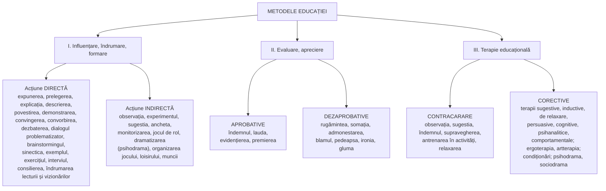
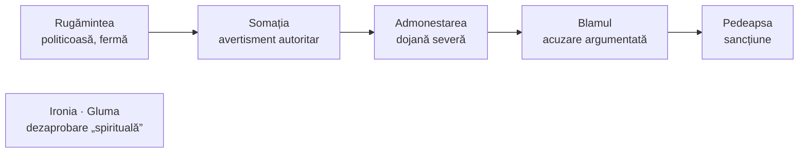

↑ [[Modulul 06 - Dimensiunile generale ale educației]] · ← [[6.2.5 Educația psihofizică]] · → [[7.1 Noile educații - delimitări conceptuale]]

> [!abstract] Pe scurt
> - **Metoda de educație** este modalitatea de **concepere și programare a acțiunii educative**, subordonată scopurilor și obiectivelor formării personalității. Eficiența depinde de **personalizarea** actului metodologic.
> - **Tipologia** din manual (după E. Macavei) are **trei grupe**: **I. influențare, îndrumare și formare** (acțiune **directă** / **indirectă**); **II. evaluare și apreciere** (**aprobative** / **dezaprobative**); **III. terapie educațională** (**contracarare** / **corective**).
> - Pentru fiecare metodă, manualul dă **etimologia**, **esența** și **cerințele** de aplicare.
> - Metodele „dure” — **pedeapsa, ironia, condiționarea aversivă** — cer multă prudență. Pedepsele corporale sunt excluse, iar **Codul Educației interzice pedepsele degradante și orice violență fizică sau psihică**.

---

# PARTEA I — Ce spune manualul

## 1. Conceptul de metodă (p. 203)

- Eficiența acțiunii educaționale depinde de **personalizarea actului metodologic**: o practică raționalizată, esențializată prin intervenție și acțiune.
- Etimologie (după manual): gr. „*metha*” = spre + „*octos*” = cale (formă greșită — vezi §12) → metoda este **calea spre cunoaștere, adevăr, acțiune**.

> [!quote] Definiție (p. 203)
> **Metoda de educație** este **modalitatea de concepere și programare a acțiunii educative**, subordonată **scopurilor și obiectivelor** de orientare și formare a personalității.

- Cunoașterea principalelor metode [9, p. 24–33] este un **sprijin metodologic real** în **proiectarea și organizarea** activității educative (→ [[Modulul 10 - Proiectarea, realizarea și evaluarea activității educative]]).

## 2. Tipologia metodelor — vedere de ansamblu

## 3. I. Metode de influențare, îndrumare și formare

### 3.1. Metode de acțiune directă (p. 203–207)

| Metodă | Etimologie (după manual) | Esență | Cerințe |
|---|---|---|---|
| **Expunerea** | lat. *expono, -ere* = a face cunoscut, a trata | **transmiterea** informațiilor și opiniilor, structurată după obiective și nivelul auditoriului; poate fi completată cu **ilustrări audio-vizuale** | conținut **organizat și articulat**, accesibil, clar; să trezească și să mențină **interesul**; să invite la **reflecție** |
| **Prelegerea** | lat. *praelego, -ere* = a citi și comenta în public | prezentarea **preelaborată** a unui volum mare de informații unui auditoriu **matur**, în circa **1–2 ore**. Variante: **clasică (ex cathedra)**, **prelegere-dezbatere**, **cu oponent**, **în echipă** (*team-teaching*) | conținut bine **selectat și structurat**; prezentare accesibilă, **convingătoare**, interesantă |
| **Explicația** | lat. *explicatio* = desfășurare, lămurire | **lămurirea** conexiunilor, pe înțelesul auditoriului | **claritate**, putere de convingere, accesibilitate |
| **Descrierea** | lat. *describo* = a înfățișa; *descriptio* = reproducere | prezentarea **analitică** a obiectelor, faptelor, acțiunilor | corectitudine, **fidelitate**, accesibilitate, **concizie** |
| **Povestirea** | sl. (după manual „*pavasti*”) = istorisire | prezentarea **narativă și evocatoare** a faptelor și evenimentelor | coerență logică, substanță informațională, stil **evocator, plastic, sugestiv** |
| **Demonstrarea** | lat. *demonstro* = a arăta, a dovedi | enunțarea unei **teze** urmată de **argumente**, prin cuvânt, imagine, grafic, schemă, experiment | coerență logică, forță de convingere, claritate |
| **Convingerea** | lat. *convinco* = a dovedi, a arăta clar | obținerea **adeziunii** interlocutorului pentru a forma, consolida sau schimba gândirea și **atitudinile** (intelectuale, morale, estetice, religioase). E un demers **mental-afectiv probator**. Termenul are două sensuri: **mod de acțiune** (a convinge) și **structură atitudinală** (a avea convingeri) | **directă, fără echivoc**; să sugereze, să îndemne; să apeleze la toate componentele psihice — **intelectuale, afective, volitive** |
| **Convorbirea** | sl. (după manual „*dvoriba*”) = vorbă | abordarea unei persoane într-un **cadru intim**, prin schimb de idei, impresii, opinii | **discreție, confidențialitate**, tact, întrebări clare, **capacitatea de a asculta** |
| **Dezbaterea** | lat. *battuo, -ere* = a bate, a insista | analiza unei teme **în grup**; prin schimb de opinii se construiesc **soluții**; intercomunicare propunător–grup și între membri | temă **interesantă**; climat **permisiv**, libertate de exprimare; prevenirea ostilităților; rezolvarea **cu tact** a contradicțiilor |
| **Dialogul problematizator** (*problem solving*) | — | **crearea și rezolvarea problemelor** printr-un demers **euristic**: căutare, alternative, susținere sau critică. Stimulează gândirea, imaginația, intuiția | probleme **incitante**; mediu permisiv polemicii; **moderarea** construirii soluțiilor |
| **Brainstormingul** („asaltul de idei”) | engl. *brain* = creier, *storm* = furtună | **colectarea și înregistrarea** ideilor exprimate liber în grup, apoi **evaluarea** lor și construirea soluțiilor; eliminarea oricărei **cenzuri** | climat permisiv pentru spontaneitate; eliminarea surselor **inhibitive**; **nu se admite polemica** |
| **Sinectica** | gr. *synecticos* = reunirea unor elemente fără legătură aparentă | stimularea **creativității în grup**; **spre deosebire de brainstorming, se practică polemica**. Alte metode de dezbatere în grup: **Delphi**, **Philips 6-6** | ca la brainstorming, dar **polemica e acceptată și încurajată** |
| **Exemplul** | lat. *exemplum* = probă, model | ilustrarea prin **modele** reale sau fictive, istorice sau contemporane. **Exemplul personal al educatorului** (părinte, profesor) are un efect formator **decisiv**. Exemplele pot fi **pozitive sau negative** (moral, estetic, intelectual) | exemple **concludente, convingătoare**, cu forță sugestivă |
| **Exercițiul** | lat. *exercitium* = practică | executarea **repetată** a unor acțiuni pentru formarea corectă a **deprinderilor** (senzoriale, motrice, intelectuale, morale). Educatorul oferă modele, îndrumă și **supraveghează**, ca să evite formarea greșită | climat **stimulativ**; modele corespunzătoare; **evitarea oboselii și a suprasaturării**; integrarea deprinderilor noi |
| **Interviul** | engl. (după manual „*intervieva*”) = întrevedere | investigare prin **dialog** cu un respondent, cu întrebări **deschise** (de opinie) și **închise** (răspuns codificat), în scop clinic, educativ, de selecție, de informare; spontan sau pregătit | scop clar, întrebări **pertinente**; atmosferă propice; **respectarea opiniilor**; **să nu se inducă răspunsuri** |
| **Consilierea** | lat. *consilium* = sfat, deliberare | intercomunicare încheiată cu **sugestii, recomandări, sfaturi** argumentate, pe baza evaluării situației. **Consilierul nu decide în locul clientului**, ci îl ajută să-și **clarifice opțiunile** | **detașarea** consilierului; stimularea **inițiativei** și a **încrederii în sine**; respectarea **libertății de alegere** |
| **Îndrumarea lecturii și a vizionării** (filme, radio-TV) | — | orientarea spre activități cu valoare formativă; obișnuirea tânărului să **selecteze după criterii valorice**; **protecția față de agresiunea informațională**, necesară sănătății fizice, mentale și spirituale | adaptare la **vârstă**, maturitate, interese; raportare la obiectivele educative |

> [!tip] De reținut — brainstorming vs. sinectică
> **Brainstorming** = idei multe, **fără critică** în faza de generare. **Sinectică** = **cu polemică** și prin asocierea unor elemente aparent fără legătură (analogii).

### 3.2. Metode de acțiune indirectă (p. 207–210)

| Metodă | Etimologie (după manual) | Esență | Cerințe |
|---|---|---|---|
| **Observația** | lat. *observatio* = grijă, observare | **percepere activă**: urmărirea comportamentului educatului și stimularea **autoobservării** | corectitudine, finețe, **obiectivitate** |
| **Experimentul** (ca metodă educativă) | lat. *experimentum* = încercare, probă | **provocarea** unor manifestări comportamentale în situații **special alese**: se propun variabile (reguli de învățare, disciplină alimentară, mentală, afectivă), se culeg și se evaluează rezultatele | variabile **posibil de respectat**; încurajarea efortului; susținerea **încrederii în sine** |
| **Sugestia** | lat. *suggestio* = adăugare treptată | provocarea unor reacții pe care individul **nu le-ar realiza prin voință proprie**; activarea resurselor **subconștiente**, inducerea unei stări sau atitudini. Funcții **persuasive** (îndemn) și **inductive** | putere de **concentrare**, comenzi stimulative |
| **Ancheta** | fr. *enquête* = cercetare | **colectarea informațiilor** despre comportamentul educatului (interviuri, convorbiri, documente) → evaluare → **diagnostic** → **plan de intervenție** → control | selectarea persoanelor și documentelor; **obiectivitate** |
| **Monitorizarea** | lat. *monitor* = cel care amintește; asistent al unui orator | **supravegherea** directă sau indirectă (prin alte persoane) pentru formarea deprinderilor, **decondiționarea** celor greșite, depășirea timidității și a eșecurilor, îmbunătățirea situației la învățătură, corectarea indisciplinei | încredințarea sarcinii unor **persoane competente**; îndrumare **sistematică** |
| **Jocul de rol** | — | situații **fictive** care simulează comportamente dorite; educatul se **identifică** cu un rol social. Ex.: atitudinile greșite față de școală se corectează jucând rolul de **profesor, director**; confruntarea cu roluri de **judecător, polițist, victimă** | ambianță **antrenantă**; încurajarea spontaneității; **evaluarea** modurilor de exprimare |
| **Dramatizarea** | gr. *dramos* (după manual) = acțiune | **improvizarea** unor situații prin dialog, gest, mimică, pantomimă, pentru schimbarea modului greșit de a gândi, simți, acționa. Pentru comportamente noi se recomandă **psihodrama și sociodrama** (**Jacob L. Moreno**). Concepte: **spontaneitate, creativitate, fenomenul „tele”** (capacitatea de transpunere în rol), **teoria rolului** | — |
| **Psihodrama** | — | etape: **pregătire → reprezentare → evaluare**. Tehnici: reprezentarea de sine, realizarea de sine, **solilocviul**, **dedublarea**, **inversarea rolurilor**, **proiectarea în viitor**, improvizarea spontană | scopuri **clare**; atmosferă de **comunicare empatică**; integrarea achizițiilor în structurile proprii |
| **Organizarea activităților de joc, loisir și muncă** | fr. *loisir* = timp liber petrecut agreabil | crearea condițiilor pentru joc, timp liber și muncă, ca **modele de acțiune** care stimulează capacitățile și atitudinile | motivație **stenică** (energizantă); stimularea și evaluarea **performanțelor proprii**; **inteligență socială** |

## 4. II. Metode de evaluare și apreciere

### 4.1. Metode aprobative (p. 210–211)

| Metodă | Esență | Cerințe |
|---|---|---|
| **Îndemnul** | **stimularea acțiunii** educatului, cu tact, prin cuvânt, gest, mimică; declanșează inițiativa. Scopul este ca **îndemnul să devină autoîndemn** | fermitate, convingere, putere de sugestie |
| **Lauda** (lat. *laudatio*) | exprimarea **prețuirii** faptelor educatului, personal sau public — **răsplată morală**. O parte din **prestigiul educatorului** se transferă asupra educatului → **siguranță de sine, stimă de sine**, prestigiu în grup | **să nu fie gratuită**; să nu creeze **suficiență**; să nu mascheze **ipocrizia** |
| **Evidențierea** (lat. *evidentia*) | **recunoașterea publică** a reușitei prin aprecieri orale, **diplome**, gazete, albume | aprecieri **obiective, pe criterii**; să consolideze sau să creeze **statutul pozitiv** în grup |
| **Premierea** (lat. *praemium* = răsplată) | acordarea de **recompense materiale** (jucării, cărți, dulciuri, haine, bani, excursii, tabere) și **morale** (facilități, favoruri, **investirea cu încredere**) | să urmeze **aprecierii obiective** a performanțelor; **nici formală, nici gratuită** |

### 4.2. Metode dezaprobative (p. 211–212)

Metodele sunt ordonate aproximativ după **intensitatea** dezaprobării:

| Metodă | Etimologie (după manual) | Esență | Cerințe |
|---|---|---|---|
| **Rugămintea** | lat. *rogamentum* = cerere stăruitoare | solicitare **politicoasă, dar fermă**: recomandare, prevenire | exprimare politicoasă, **ton potrivit** |
| **Somația** | fr. *sommation* = ordin, invitație fermă | **avertizare autoritară** asupra încălcării obligațiilor și regulilor | **fermă**, exprimată **calm**, **fără injurii**; să prevină pedeapsa |
| **Admonestarea** | lat. *admoneo* = a avertiza, a dojeni | **dojenirea severă** a individului sau a grupului pentru fapte reprobabile; previne pedeapsa și **recidiva** | fermă, calmă, **nu sub impulsul nervilor**; numai când **gravitatea faptelor e confirmată** |
| **Blamul** | fr. *blâme* = dezaprobare | **respingerea prin acuzare** a faptelor, **cu dovezi**, într-un limbaj decent | exprimare categorică; acuzații **fondate pe fapte reale, argumentate, dovedite** |
| **Pedeapsa** | gr. (după manual „*pedepsis*”) = sancțiune | **sancțiuni** sub formă de restricții, interdicții, represiuni. Efecte: **jenă, vinovăție, regret, dorința îndreptării**. Manualul avertizează că cel pedepsit poate răspunde prin **revoltă, răzbunare, ură** | pedeapsă **bine gândită**, **proporțională** cu gravitatea faptei, care **oferă șansa îndreptării**; **se exclud corecțiile corporale**, care doar umilesc |
| **Ironia** | fr. *l'ironie* = ridiculizare | exprimarea unor **sensuri ascunse**, cu efect de ridiculizare. Manualul o descrie ambivalent: **joc periculos** pentru ambele părți, dar și **descărcare de tensiuni**, „surâs amar al spiritului”; poate distra, invita la reflecție, dar și **ataca și distruge** | **folosită cu tact**, avertizează și invită la reflecție |
| **Gluma** | sl. (după manual „*glumu*”) = vorbă de haz | construcție mentală care surprinde **contradicția dintre real și aparent** și provoacă râsul. Tratarea greșelilor cu **seriozitate simulată** arată **simțul umorului**; **deconectează, relaxează**, reduce barierele | **momentul potrivit**, persoane **receptive**; se exclud glumele **deocheate** |

## 5. III. Metode de terapie educațională

### 5.1. Metode de contracarare (p. 212–213)

Se folosesc **la primele semne de deviere** comportamentală, pentru a **preveni stabilizarea** ei.

| Metodă | Rol |
|---|---|
| **Observația** | urmărirea **tendințelor de deviere**: absenteism, lipsa dorinței de a învăța, indisciplină, minciună, fraudă, violență |
| **Sugestia** | **decondiționarea** tendințelor de deviere; inducerea unor atitudini contrare impulsurilor negative |
| **Îndemnul** | avertizarea, cu tact, a celui în pericol de a greși și îndrumarea lui |
| **Supravegherea** | directă sau prin persoane apropiate — previne **perseverarea în greșeală** |
| **Antrenarea în activități** | joc, loisir, învățare, muncă → **canalizarea pozitivă a energiilor**, autocorectare |
| **Tehnicile de relaxare fizică și psihică** | **detensionare**; eliberare de anxietăți, fobii, obsesii |

### 5.2. Metode corective (p. 213–215)

- În timpul și după aplicarea **sancțiunilor** (blam, admonestare, pedeapsă) trebuie exercitat un **control discret și eficient**, pentru a constata **progresele îndreptării** și, eventual, a schimba sancțiunea.
- **Psihoterapeuții** și **educatorii inițiați în tehnici terapeutice** pot folosi metode corective speciale:

| Terapie | Descriere (după manual) |
|---|---|
| **Prin proceduri sugestive** | desensibilizare, încredere în sine, eliberare de inhibiții și anxietate; sugestia **în stare de veghe** sau **hipnoză** |
| **Prin proceduri inductive** | transferul unor comportamente care duc la performanță în învățare, profesie, rezolvarea conflictelor; renunțarea la **vicii** (fumat, alcool, stupefiante) |
| **Prin proceduri de relaxare** | **training autogen**, relaxarea (în manual „Schultz-Jakobson”), **autosugestia Coué**, tehnici hinduiste și taoiste — eficiente împotriva **stresului** |
| **Prin proceduri persuasive** | **consilierea** în situații de cumpănă și indecizie; acționează asupra componentelor cognitiv-afective și volitive |
| **Prin proceduri cognitive** | **analiza, evaluarea, destructurarea** conduitelor greșite și **reconstruirea** celor benefice |
| **Prin proceduri psihanalitice** | explorarea trăirilor **subconștiente și inconștiente**, rezolvarea conflictelor interioare prin **identificare, sublimare, compensare** |
| **Comportamentală / ocupațională** (individuală și de grup) | reconsiderarea resurselor adaptative; eliberare de **depresii, obsesii, violență și autoviolență**, vicii |
| **Ergoterapia și artterapia** | terapie prin **muncă** și prin **artă** — foarte eficiente; **grupurile de întrajutorare**: confruntare, susținere și autosusținere morală |
| **Condiționarea aversivă** | (după manual) **supraexersarea unui defect** până la **suprasaturare și dezgust** |
| **Condiționarea operantă** | **întărirea pozitivă** (recompense materiale și morale) a progreselor |
| **Inhibiția reciprocă** | (după manual) antrenarea **în condițiile care generează** anxietăți și obsesii |
| **Psihodrama și sociodrama** | efecte „spectaculoase” în **decondiționarea** conduitelor deviante și reconstruirea fondului cognitiv-afectiv; subiecții își exprimă modul de a gândi prin dialog, gest, mimică, pantomimă |

## 6. Concluzii și sarcini (p. 215–217)

- **Metoda** este modalitatea de concepere și programare a acțiunii educative. Cunoașterea metodelor e un **sprijin metodologic real** în proiectarea activității (vezi și [[6.1 Conținuturile generale ale educației]] §9).
- **Teme de reflecție** legate de metode: clasificarea **metodelor de învățământ** după sursa informațională; tipologia metodelor după **funcții**; **factorii obiectivi** în alegerea unei metode; tipologia **strategiilor** după tipul de raționament (→ răspunsuri orientative în §8–9).
- **Bibliografia modulului** (p. 217): 14 titluri — Antonesei, Bontaș, Cerghit (2), Cojocaru et al. (2), Cristea, Cucoș, Guțu, Jinga & Istrate, Macavei, Momanu, Nicola, Văideanu.

---

# PARTEA II — Completări

## 7. Precizări conceptuale

| Concept | Sens |
|---|---|
| **Metodă de educație** | calea de realizare a obiectivelor **formative** (morale, estetice etc.), mai ales în activitățile educative (dirigenție, extrașcolare) |
| **Metodă de învățământ (didactică)** | calea de organizare a **predării–învățării** în lecție (→ [[Modulul 10 - Proiectarea, realizarea și evaluarea activității educative]]) |
| **Procedeu** | o **operație** din componența unei metode (ex. întrebarea retorică într-o expunere). O metodă poate deveni procedeu în altă metodă și invers |
| **Tehnică** | combinație de procedeu și mijloc (ex. ciorchinele pe tablă) |
| **Strategie** | combinarea **metodelor, mijloacelor și formelor de organizare** pentru un obiectiv, după un anumit tip de raționament (inductiv, deductiv, analogic, transductiv) |

> [!note] Comentariu
> Multe metode din listă sunt **comune** educației și instruirii (expunerea, explicația, demonstrația, exercițiul). Specificul lor „educativ” apare prin **scop**: ele țintesc atitudini, convingeri și conduite, nu doar cunoștințe.

## 8. Clasificarea metodelor de învățământ după sursa informației (I. Cerghit)

Răspuns orientativ la tema de reflecție. **Ioan Cerghit** (*Metode de învățământ*, ed. a IV-a, Polirom, 2006) grupează metodele după **sursa** și modul de organizare a învățării:

| Grupă | Subgrupe și exemple |
|---|---|
| **1. Metode de comunicare orală** | **expozitive** (povestirea, descrierea, explicația, prelegerea); **interogative / conversative** (conversația euristică, dezbaterea, discuția); **problematizarea** |
| **2. Metode de comunicare scrisă** | **lectura** (munca cu manualul, cu cartea) |
| **3. Metode de explorare a realității** | **directă**: observația, experimentul, studiul de caz; **indirectă**: demonstrația, modelarea |
| **4. Metode bazate pe acțiune** | **reală**: exercițiul, lucrările practice, proiectul; **simulată**: jocurile didactice, jocul de rol, dramatizarea, învățarea pe simulatoare |
| **5. Instruirea programată / asistată de calculator** | secvențe mici de învățare, cu feedback imediat |

**Factori în alegerea unei metode** (sinteză din literatura didactică): **finalitățile și obiectivele** activității; **natura conținutului**; **particularitățile de vârstă și individuale** ale elevilor; experiența lor anterioară; **timpul** disponibil; **resursele materiale**; **forma de organizare** (frontal, grupe, individual); **competența și stilul** cadrului didactic.

## 9. Originea unor metode descrise în manual

| Metodă | Autor și an | Precizare |
|---|---|---|
| **Brainstorming** | **Alex F. Osborn**, *Applied Imagination* (1953) | reguli: **amânarea judecății**, cantitate de idei, idei neobișnuite, combinarea ideilor. Cercetările (ex. **Diehl și Stroebe, 1987**) arată că grupurile nominale (indivizi care generează idei separat) produc adesea **mai multe idei** decât grupurile de brainstorming, din cauza **blocajului producției** |
| **Sinectica** | **William J. J. Gordon**, *Synectics* (1961) | folosirea **analogiilor** (directă, personală, simbolică, fantastică) pentru a „face straniul familiar și familiarul straniu” |
| **Phillips 6-6** | **J. Donald Phillips** (1948) | grupe de **6 persoane** discută **6 minute**, apoi raportează |
| **Delphi** | **RAND Corporation**, anii '50 (N. Dalkey, O. Helmer) | consultarea **anonimă** a experților, în mai multe runde, cu feedback, până la consens |
| **Psihodrama / sociodrama** | **Jacob L. Moreno** (teatrul spontaneității, Viena, anii '20; ulterior SUA) | etapele consacrate: **încălzire** (*warm-up*), **acțiune**, **împărtășire** (*sharing*) |
| **Inhibiția reciprocă** | **Joseph Wolpe**, *Psychotherapy by Reciprocal Inhibition* (1958) | asocierea treptată a stimulilor anxiogeni cu un **răspuns incompatibil cu anxietatea** (ex. relaxarea) — **desensibilizare sistematică** |
| **Condiționarea operantă** | **B. F. Skinner** (anii '30–'50) | comportamentul e modelat de **consecințe**: întărire pozitivă, negativă, pedeapsă, extincție |
| **Trainingul autogen** | **Johannes H. Schultz**, *Das autogene Training* (1932) | autosugestii de greutate, căldură etc. |
| **Relaxarea progresivă** | **Edmund Jacobson**, *Progressive Relaxation* (1929) | alternarea contracției și relaxării grupelor musculare — **metodă distinctă** de cea a lui Schultz |
| **Autosugestia conștientă** | **Émile Coué** (anii '20) | repetarea unor formule pozitive |

## 10. Ce spune cercetarea despre recompense, laudă și pedeapsă

> [!warning] Lauda și premierea — nuanțe importante
> - **Efectul de suprajustificare**: **M. Lepper, D. Greene, R. Nisbett** (1973) au arătat că recompensarea **așteptată** a unei activități deja plăcute (desenul la preșcolari) poate **reduce motivația intrinsecă**. Metaanaliza **Deci, Koestner, Ryan** (1999) confirmă efectul pentru recompensele **tangibile și anticipate**. Recompensele verbale (**feedbackul informativ**) îl afectează mai puțin. → **Premierea cu bani sau dulciuri** (p. 211) trebuie folosită cu mare prudență.
> - **Tipul laudei**: **C. Mueller și C. Dweck** (1998) — copiii lăudați pentru **inteligență** („ești deștept”) evitau apoi sarcinile dificile și cedau după eșec, spre deosebire de cei lăudați pentru **efort și strategie**.
> - **J. Brophy** (1981): lauda e eficientă când este **specifică, contingentă** (legată de o performanță reală), **credibilă** și orientată spre **progres**. Aceasta confirmă cerințele din manual („să nu fie gratuită”).

> [!warning] Pedeapsa și ironia
> - **Pedeapsa corporală**: metaanaliza **E. T. Gershoff** (2002) a asociat-o cu **mai multă agresivitate**, probleme de comportament și relații mai slabe cu părinții; singurul efect „pozitiv” a fost **supunerea imediată**. **Convenția ONU cu privire la drepturile copilului** (1989), **art. 19** (protecția contra oricărei forme de violență) și **art. 28 alin. (2)** (disciplina școlară compatibilă cu **demnitatea** copilului); **Comentariul general nr. 8** al Comitetului ONU (2006) cere interzicerea **tuturor** pedepselor corporale.
> - **Ironia și sarcasmul** față de elevi sunt considerate azi forme de **abuz emoțional** în multe coduri de etică profesională, pentru că umilesc și distrug relația pedagogică. Manualul însuși recunoaște că ironia poate „ataca și distruge”.

**Alternative moderne la metodele dezaprobative**:

| Abordare | Autori / repere | Esență |
|---|---|---|
| **Disciplina pozitivă** | **Jane Nelsen**, *Positive Discipline* (1981), după Adler și Dreikurs | fermitate **și** blândețe; **consecințe logice** în loc de pedepse; implicarea elevului în găsirea soluțiilor |
| **Practicile restaurative** | derivate din **justiția restaurativă** (H. Zehr, *Changing Lenses*, 1990) | după o abatere: *ce s-a întâmplat? pe cine a afectat? cum repari?* — **repararea relației**, nu doar sancțiunea |
| **Sprijinul comportamental pozitiv** (PBIS) | SUA, anii '90–2000 | reguli clare, **predate explicit**, întărirea comportamentelor dorite la nivelul **întregii școli** |

## 11. Legături cu legislația R. Moldova

- **Codul Educației, art. 135 (1)**, obligațiile cadrelor didactice:
  - **lit. i)** — **să nu admită tratamente și pedepse degradante**, discriminarea și **orice formă de violență fizică sau psihică**;
  - **lit. j–l)** — să informeze elevii despre formele de violență, să discute cu ei despre **siguranța și bunăstarea** lor și **să intervină** în cazurile de abuz;
  - **lit. c)** — să respecte **drepturile copiilor**.
- **Consecință**: dintre metodele dezaprobative ale manualului, **ironia umilitoare**, **blamul public degradant** și orice pedeapsă care umilește intră în conflict cu legea. Metodele **terapeutice** (hipnoză, condiționare aversivă, psihanaliză) sunt rezervate **psihologilor și psihoterapeuților** calificați. În sistemul de învățământ din R. Moldova există **psihologi școlari** și **servicii de asistență psihopedagogică** (art. 53).

## 12. Comentariu critic

> [!warning] Erori și probleme ale textului
> **Etimologii greșite sau deformate**:
> - **metodă**: nu „*metha* = spre; *octos* = cale”, ci gr. ***méthodos***, din ***metá*** („după, dincolo”) + ***hodós*** („drum, cale”);
> - **interviu**: nu engl. „*intervieva*”, ci engl. ***interview***, la rândul său din fr. *entrevue*;
> - **blam**: fr. ***blâme*** (textul are „blîme”);
> - **pedeapsă**: nu gr. „*pedepsis*”. Cuvântul românesc vine din verbul *a pedepsi*, de origine neogreacă (legat de *paidevo* = a educa, a pedepsi) — de verificat în DEX;
> - formele slave „*pavasti*”, „*dvoriba*”, „*glumu*” sunt transcrieri aproximative (în DEX: v. sl. *povĕstĭ*, *dvorĭba*, *glumŭ* — de verificat).
>
> **Erori de structură și redactare**:
> - numerotarea **„1.2”** e folosită **de două ori** (acțiune directă și indirectă; prima ar trebui să fie 1.1); apar și „2.I”, „3.I” în loc de 2.1, 3.1;
> - **„Schultz-Jakobson”** unește doi autori și două metode diferite (**J. H. Schultz** — training autogen; **E. Jacobson** — relaxare progresivă);
> - „Se **demontează** prin cuvânt, imagine...” (la demonstrare) — în loc de „se demonstrează”;
> - trimiterea **[9, p. 24–33]** indică lucrarea lui Vl. Guțu, *Curriculum educațional*, puțin probabilă ca sursă pentru metodele educației (de verificat).
>
> **Erori de conținut**:
> - **Condiționarea aversivă** e definită greșit: supraexersarea unui comportament până la dezgust este **practica negativă** (*negative practice*) sau **saturația**. Condiționarea aversivă asociază comportamentul nedorit cu un **stimul neplăcut**;
> - **Inhibiția reciprocă** e descrisă incomplet: la Wolpe, expunerea la stimulii anxiogeni se face **treptat** și **asociat cu relaxarea**, nu prin simpla „antrenare în condițiile generatoare de anxietate”;
> - **hipnoza** nu este o „stare de somn” — este o stare de atenție focalizată și sugestibilitate crescută;
> - **pedeapsa**: textul spune că produce regret și dorința îndreptării, apoi că provoacă **întotdeauna** revoltă și ură, chiar și când e aplicată corect — **contradicție** și generalizare excesivă.
>
> **Probleme de fond**:
> - **Clasificarea amestecă metode de natură diferită**: metode de **cercetare/diagnostic** (interviul, ancheta, experimentul, observația), metode **didactice** (prelegerea, brainstormingul), metode **disciplinare** (somația, pedeapsa) și **psihoterapii** (psihanaliză, hipnoză). Pentru un profesor, ultimele depășesc competența profesională și ridică probleme de **etică**.
> - **Repetiție**: metodele de terapie educațională sunt descrise aproape identic la [[6.2.1 Educația morală]] (p. 185) și aici (p. 213–214).
> - **Ironia** e prezentată ca metodă de dezaprobare legitimă — incompatibil cu etica profesională actuală și cu art. 135 al Codului Educației.
> - **Premierea cu dulciuri și bani** — fără nicio mențiune despre **motivația intrinsecă** sau despre alimentația sănătoasă.
> - **Lipsesc metodele de autoeducație** (autoobservarea, autoevaluarea, autocontrolul), deși manualul insistă în alte module pe autoeducație (→ [[3.6 Educația permanentă și autoeducația]]). Cristea le include în modelul sintetic (vezi [[6.2.1 Educația morală]] §7a).
> - **Temele de reflecție** (metode de învățământ după sursa informației, strategii după tipul de raționament) **nu au suport în text**.
>
> **Bibliografia (p. 217)**:
> - **I. Nicola**, *„Tratat de pedagogie generală”* — titlul corect al lucrării lui Ioan Nicola este ***Tratat de pedagogie școlară*** (EDP, 1992/1996; Aramis, 2003);
> - lipsesc lucrări citate în text: **René Hubert**, **P. Popescu-Neveanu**, **J. Moreno**;
> - **C. Cucoș** [8] și **S. Cristea** [7] sunt citați în text cu numere greșite ([6]).

## 13. Întrebări de autoverificare

1. Definiți metoda de educație. Care este etimologia corectă a termenului „metodă”?
2. Prezentați tipologia metodelor educației din manual (grupe și subgrupe).
3. Distingeți metodele de acțiune directă de cele de acțiune indirectă, cu câte trei exemple.
4. Comparați brainstormingul și sinectica.
5. Care sunt cerințele pentru o laudă eficientă, conform manualului și cercetării (Brophy, Dweck)?
6. Ce este efectul de suprajustificare și ce implicații are pentru premiere?
7. Ordonați metodele dezaprobative după intensitate. Care sunt compatibile cu art. 135 al Codului Educației?
8. Ce este psihodrama? Numiți etapele și trei tehnici.
9. Care metode de terapie educațională pot fi folosite de profesor și care sunt rezervate specialiștilor? Argumentați.
10. Clasificați metodele de învățământ după sursa informației (I. Cerghit) și precizați factorii care influențează alegerea unei metode.

## Surse
- Manual, p. 203–217; Macavei, E. (2001). *Pedagogie. Teoria educației*, vol. I–II. București: Aramis; Cristea, S. (2003); Nicola, I. (1992/2003). *Tratat de pedagogie școlară*.
- Cerghit, I. (2006). *Metode de învățământ*, ed. a IV-a. Iași: Polirom.
- Codul Educației al Republicii Moldova nr. 152/2014, art. 53, 135.
- Convenția ONU cu privire la drepturile copilului (1989), art. 19, 28; UN Committee on the Rights of the Child (2006). *General Comment No. 8*.
- Osborn, A. F. (1953). *Applied Imagination*. New York: Scribner's.
- Diehl, M., Stroebe, W. (1987). Productivity loss in brainstorming groups. *Journal of Personality and Social Psychology*, 53(3).
- Gordon, W. J. J. (1961). *Synectics: The Development of Creative Capacity*. New York: Harper & Row.
- Dalkey, N., Helmer, O. (1963). An experimental application of the Delphi method to the use of experts. *Management Science*, 9(3).
- Moreno, J. L. (1946). *Psychodrama*, vol. I. New York: Beacon House.
- Wolpe, J. (1958). *Psychotherapy by Reciprocal Inhibition*. Stanford University Press.
- Schultz, J. H. (1932). *Das autogene Training*. Leipzig: Thieme; Jacobson, E. (1929). *Progressive Relaxation*. University of Chicago Press.
- Lepper, M. R., Greene, D., Nisbett, R. E. (1973). Undermining children's intrinsic interest with extrinsic reward. *Journal of Personality and Social Psychology*, 28(1).
- Deci, E. L., Koestner, R., Ryan, R. M. (1999). A meta-analytic review of experiments examining the effects of extrinsic rewards on intrinsic motivation. *Psychological Bulletin*, 125(6).
- Mueller, C. M., Dweck, C. S. (1998). Praise for intelligence can undermine children's motivation and performance. *Journal of Personality and Social Psychology*, 75(1).
- Brophy, J. (1981). Teacher praise: A functional analysis. *Review of Educational Research*, 51(1).
- Gershoff, E. T. (2002). Corporal punishment by parents and associated child behaviors and experiences. *Psychological Bulletin*, 128(4).
- Nelsen, J. (1981). *Positive Discipline*. Fair Oaks: Sunrise Press; Zehr, H. (1990). *Changing Lenses*. Scottdale: Herald Press.
