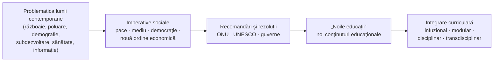

↑ [[Modulul 07 - Noile educații]] · ← [[6.3 Metodele educației]] · → [[7.2.1 Educația pentru participare și democrație]]

> [!info] Notă de organizare
> Subcapitolul **7.2 „Conținutul valoric al «Noilor educații»”** are în manual doar câteva paragrafe introductive (p. 221–222), după care trece direct la 7.2.1. De aceea este **integrat în acest conspect** (§6). Fiecare „nouă educație” are conspect separat (7.2.1–7.2.9).

> [!abstract] Pe scurt
> - **„Noile educații”** sunt **noi tipuri de conținuturi** educaționale, apărute ca **răspuns al sistemelor de educație** la **problematica lumii contemporane** (PLC): probleme **grave, emergente, de anvergură planetară**.
> - Au fost formulate în **anii 1980**, în **programele și recomandările UNESCO**; imperativele la care răspund sunt de natură **politică, economică, ecologică, demografică, sanitară**.
> - Conceptul de **„problematică a lumii contemporane”** este legat de **Aurelio Peccei**, fondatorul **Clubului de la Roma**. Trăsăturile PLC: **universalitate, globalitate, complexitate (pluridisciplinaritate), evoluție rapidă și greu previzibilă, caracter prioritar**.
> - Noile educații pot fi realizate ca **modul sau disciplină**, dar mai ales **inter-, pluri- și transdisciplinar**. Ele marchează o **schimbare de paradigmă**: educația devine **globală, holistă**.
> - **Caracterul deschis**: lista lor (propusă în spațiul românesc de **G. Văideanu**) se **modifică** mereu, prin apariția sau dispariția unor educații (C. Cucoș).

---

# PARTEA I — Ce spune manualul

## 1. Deschiderea modulului (p. 218)

- **Motto**: un vers atribuit lui **Voltaire**, potrivit căruia prejudecățile țin loc de rațiune celor needucați (vezi §8 pentru sursă).
- **Competențe vizate**: definirea conceptelor de bază; analiza conținuturilor generale ale noilor educații; caracterizarea fiecărui domeniu nou; aplicarea metodelor specifice.
- **Concepte de bază** enumerate: noile educații; educația pentru pace (și cooperare), pentru participare și democrație, pentru comunicare și mass-media, pentru schimbare și dezvoltare, pentru timpul liber; educația economică și casnică; educația nutrițională; educația relativă la mediu; educația pentru parentalitate.

## 2. Originea noilor educații (p. 219)

- Au apărut ca **răspuns la problematica lumii contemporane** — provocări descrise ca **„emergente, grave și de anvergură planetară”**, reunite din **anii 1980** sub acest generic.
- Specialiștii le consideră **cel mai pertinent și util răspuns** al sistemelor educative la imperativele PLC.
- S-au **impus foarte repede**, pentru că răspund unor **trebuințe sociopedagogice** tot mai clar conturate.
- Fiecare nouă educație își ia **denumirea de la obiectivele** pe care le propune (educația *pentru pace*, *pentru democrație* etc.).
- Poate fi realizată ca **modul** sau **disciplină de studiu**, concepută **disciplinar**, dar mai ales **interdisciplinar, pluridisciplinar și chiar transdisciplinar** (→ [[7.3 Proiectarea curriculară a noilor educații]]).
- Educația propune astfel un **demers global, holist**, care corespunde unei **schimbări paradigmatice** a actului educativ (după El. Macavei).

> [!quote] Definiție (p. 219; reluată în concluzii, p. 268)
> „Noile educații” sunt definite în **anii 1980**, la nivelul **programelor și recomandărilor UNESCO**, ca **răspunsuri ale sistemelor educaționale la imperativele lumii contemporane** de natură politică, economică, ecologică, demografică, sanitară etc.

## 3. Calitatea vieții ca nou criteriu al progresului (p. 219–220)

- Manualul citează publicația anuală **UNICEF „Progresul națiunilor”** (*The Progress of Nations*): progresul unei națiuni va fi judecat nu după puterea economică sau militară, ci după **prosperarea populației**.
- **Criteriile calității vieții** enumerate:
  - nivelul de **sănătate, nutriție și educație**;
  - **remunerarea echitabilă** a muncii;
  - respectarea **drepturilor civile și a libertăților politice**;
  - grija pentru **categoriile vulnerabile**;
  - **ocrotirea și dezvoltarea fizică și intelectuală** a noii generații.
- Ritmul rapid al schimbărilor a creat o problematică educațională complexă, centrată pe **valorile democrației** și pe **drepturile fundamentale ale omului**.

## 4. Problematica lumii contemporane (PLC) (p. 220–221)

- Conceptul a fost introdus de **Aurelio Peccei**, fondatorul **Clubului de la Roma**.
- PLC = un **sistem de probleme corelate și interdependente**, care se impun prin **caracterul presant** și prin **dimensiunea regională sau universală**.

| Caracteristică | Explicație (p. 220) |
|---|---|
| **Universalitate** | nicio țară sau regiune nu rămâne în afara acestor probleme; soluțiile cer **cooperare și solidaritate** |
| **Globalitate** | afectează **toate domeniile** vieții sociale |
| **Complexitate, pluridisciplinaritate** | fiecare problemă e legată de altele; cere **strategii complexe**, cu perspective multiple |
| **Evoluție rapidă, greu de prevăzut** | apar situații pentru care nu suntem pregătiți și **nu avem metode adecvate** |
| **Caracter prioritar** | gravitatea le leagă de **viitorul planetei** și de **supraviețuirea speciei** |

- PLC a generat în politică, cultură și educație o serie de **imperative**: **apărarea păcii**, **salvarea mediului**, **o nouă ordine economică** etc. Ele apar în **recomandări și rezoluții** ale ONU, UNESCO, guvernelor și organizațiilor guvernamentale (p. 220–221).
- A apărut un număr mare de **lucrări pedagogice** consacrate PLC (p. 221).

## 5. Educația, știința și producția; noul model de specialist (p. 221)

- Dezvoltarea societății și a individului, stimulată de **progresul științei și tehnicii**, e legată de **educație și producție**: producția și productivitatea depind de știință, iar ambele depind de **educație**.
- Educația trebuie să formeze o personalitate capabilă **„să prevadă pentru a preveni”** și să declanșeze **schimbarea pozitivă** în sine și în jur. Ea poate fi înțeleasă ca o **reconstrucție permanentă** a existenței și a experienței viitoare.
- **Modelul de specialist** se schimbă: de la **utilizator** de cunoștințe și tehnici la **inovator**, creator de tehnici noi (după **V. M. Cojocaru**, *Educație pentru schimbare și creativitate*, 2003).
- **Concluzia** subcapitolului: problemele grave actuale **nu pot fi rezolvate temeinic și durabil fără contribuția sistemelor educaționale**.

> [!tip] De reținut
> Logica manualului: **problemele globale → imperative → noi conținuturi educaționale**. Noile educații nu înlocuiesc dimensiunile clasice ale educației, ci le **actualizează** (vezi [[7.3 Proiectarea curriculară a noilor educații]] și [[Modulul 06 - Dimensiunile generale ale educației]]).

## 6. Subcapitolul 7.2 — Conținutul valoric al „Noilor educații” (p. 221–222)

- Denumirile folosite sunt cele din **programele UNESCO**, adoptate de **peste 160 de state membre**, și din **dicționarele și glosarele internaționale**.
- Dezvoltarea lumii contemporane e strâns legată de dezvoltarea educației. De aceea **lista noilor educații propusă de G. Văideanu** se va modifica: unele educații pot **dispărea**, altele pot **apărea**, pot apărea și **noi tipuri de conținuturi** (după **C. Cucoș**, *Pedagogie*, 2014).
- **Opțiunea autorilor**: analizează PLC în jurul **temelor mari** din programele UNESCO, dar le **completează** cu conținuturi și direcții noi, proprii etapei actuale. Așa se explică includerea unor domenii care nu apar în listele clasice: **dezvoltare emoțională și sănătate mintală**, **toleranță comunicativă**, **familie**, **parentalitate**.

| Nr. | „Nouă educație” tratată în manual | Pagini | Conspect |
|---|---|---|---|
| 7.2.1 | pentru participare și democrație (+ voluntariat) | 222–229 | [[7.2.1 Educația pentru participare și democrație]] |
| 7.2.2 | pentru comunicare și mass-media | 229–234 | [[7.2.2 Educația pentru comunicare și mass-media]] |
| 7.2.3 | pentru dezvoltare emoțională (+ sănătate mintală) | 234–243 | [[7.2.3 Educația pentru dezvoltare emoțională]] |
| 7.2.4 | pentru pace și cooperare (+ toleranță) | 243–247 | [[7.2.4 Educația pentru pace și cooperare]] |
| 7.2.5 | pentru schimbare și dezvoltare | 247–251 | [[7.2.5 Educația pentru schimbare și dezvoltare]] |
| 7.2.6 | pentru timpul liber | 251–254 | [[7.2.6 Educația pentru timpul liber]] |
| 7.2.7 | relativă la mediu / ecologică | 254–258 | [[7.2.7 Educația relativă la mediu]] |
| 7.2.8 | pentru familie | 258–261 | [[7.2.8 Educația pentru familie]] |
| 7.2.9 | pentru parentalitate | 261–266 | [[7.2.9 Educația pentru parentalitate]] |

> [!tip] De reținut — „caracterul deschis”
> Lista noilor educații **nu este închisă**. Noi conținuturi apar **periodic**, instituite la nivelul **UNESCO** (concluzii, p. 268). Chiar manualul ilustrează asta: adaugă domenii noi și lasă netratate unele educații „clasice” pe care le enumeră (economică și casnică, nutrițională).

---

# PARTEA II — Completări

## 7. Clubul de la Roma și „problematica mondială”

| Reper | Contribuție |
|---|---|
| **Clubul de la Roma** (1968) | fondat de **Aurelio Peccei** (industriaș italian) și **Alexander King** (om de știință britanic). Peccei a numit ansamblul problemelor globale interdependente ***„la problématique mondiale”*** |
| **D. H. Meadows et al.**, *The Limits to Growth* (*Limitele creșterii*, 1972) | primul raport al Clubului: modelarea pe calculator a interacțiunii dintre populație, industrializare, poluare, hrană și resurse. Concluzie: creșterea nelimitată e **nesustenabilă** |
| **J. W. Botkin, M. Elmandjra, M. Malița**, *No Limits to Learning: Bridging the Human Gap* (1979) | raport al Clubului **despre învățare**. Critică învățarea **„de menținere”** și pe cea **„prin șoc”**. Propune **învățarea inovatoare**, cu două trăsături: **anticipare** și **participare**. Coautor român: **Mircea Malița** |

> [!note] Comentariu
> Raportul *No Limits to Learning* (1979) este **fundamentul teoretic direct** al noilor educații. „Anticiparea” corespunde educației pentru schimbare și dezvoltare, iar „participarea” educației pentru participare și democrație. Formula manualului „să prevadă pentru a preveni” exprimă aceeași idee de **învățare anticipativă**.

## 8. Noile educații în pedagogia românească

- **George Văideanu** (1924–2003), pedagog la Iași și expert UNESCO, a introdus conceptul în spațiul românesc, mai ales prin ***Educația la frontiera dintre milenii*** (București, Editura Politică, **1988**) și ***UNESCO-50-Educație*** (București, EDP, **1996**; în bibliografia manualului, poz. 30).
- **Lista „clasică”** a noilor educații, preluată de manualele românești (Cucoș, Cristea) din programele UNESCO:
  1. educația **relativă la mediu**;
  2. educația pentru **înțelegere și pace**;
  3. educația pentru **participare și democrație**;
  4. educația **în materie de populație** (demografică);
  5. educația pentru **o nouă ordine economică internațională**;
  6. educația pentru **comunicare și mass-media**;
  7. educația pentru **schimbare și dezvoltare**;
  8. educația **nutrițională**;
  9. educația **economică și casnică modernă**.
- **Adăugate ulterior** în literatură: educația pentru **timpul liber**, pentru **sănătate**, **interculturală**, pentru **drepturile omului**, pentru **carieră**, pentru **egalitatea de gen**, pentru **tehnologie și progres** etc.
- O lucrare colectivă intitulată *Noile educații*, coordonată de **G. Văideanu și A. Neculau**, e citată pe unele site-uri educaționale, dar **nu am putut confirma** anul și editura (de verificat). Sursele sigure sunt cele două titluri de mai sus.
- **S. Cristea** (*Fundamentele pedagogice*, 2010, citat în manual) tratează noile educații ca **noi conținuturi**, raportabile la cele **cinci dimensiuni** ale educației (morală, intelectuală, tehnologică, estetică, psihofizică).

## 9. De la „noile educații” la agenda globală actuală

| Document | An | Legătura cu noile educații |
|---|---|---|
| **E. Faure et al.**, *Learning to Be* (UNESCO) | 1972 | educația permanentă, „cetatea educativă” (→ [[3.6 Educația permanentă și autoeducația]]) |
| **Recomandarea UNESCO** privind educația pentru înțelegere, cooperare și pace internațională și educația privind drepturile omului | 1974 | primul instrument global pentru mai multe „noi educații” |
| **J. Delors et al.**, *Learning: The Treasure Within* (UNESCO) | 1996 | cei **patru piloni**: a învăța să știi, să faci, **să trăiești împreună cu ceilalți**, să fii |
| **Deceniul ONU al Educației pentru Dezvoltare Durabilă** | 2005–2014 | ESD — umbrelă pentru educația ecologică, pentru pace, pentru dezvoltare |
| **Agenda 2030, ODD 4, ținta 4.7** | 2015 | cere ca până în 2030 toți cei care învață să dobândească competențe pentru **dezvoltare durabilă**, **drepturile omului**, **egalitate de gen**, **cultura păcii și nonviolenței**, **cetățenie globală**, **diversitate culturală** |
| **UNESCO, Recomandarea privind educația pentru pace, drepturile omului și dezvoltare durabilă** | 20 nov. 2023 | adoptată de cele **194** de state membre; **actualizează Recomandarea din 1974**; are 14 principii directoare |

> [!note] Comentariu
> Ținta **ODD 4.7** este practic o **listă actualizată a noilor educații**, formulată ca obiectiv de politică globală. Terminologia s-a mutat de la „noile educații” spre **ESD** (educație pentru dezvoltare durabilă) și **GCED** (educație pentru cetățenie globală). Acestea sunt „umbrele” care reunesc mai multe educații tradiționale.

## 10. Legături cu R. Moldova

- **Codul Educației** nr. 152/2014 fixează idealul educațional și finalitățile (→ [[Modulul 04 - Finalitățile educației]]). În **curriculumul național** mai multe noi educații au devenit discipline sau cursuri opționale:
  - **Educație pentru societate** (clasele V–XII, introdusă din **septembrie 2018** în clasele a V-a și a X-a; bazată pe **Carta Consiliului Europei EDC/HRE** și pe **Cadrul de competențe pentru cultură democratică**) → [[7.2.1 Educația pentru participare și democrație]];
  - **Dezvoltare personală** (clasele I–XII, curriculum 2018) → dezvoltare emoțională, sănătate, familie, carieră;
  - cursul opțional **Educație pentru media** (predat din **2017**, elaborat de **Centrul pentru Jurnalism Independent**) → [[7.2.2 Educația pentru comunicare și mass-media]].

## 11. Comentariu critic

> [!warning] Probleme în text
> - **Cuprinsul modulului** (p. 218) numerotează ultimul subcapitol **„7.4”**, dar în text este **7.3** (p. 266). Nu există 7.3 în cuprins.
> - **Datare**: „peste **160** de state membre” UNESCO (p. 221) e o cifră **veche**. UNESCO are azi **194** de state membre.
> - **Cronologie simplificată**: manualul spune că noile educații au fost „definite în anii 1980”. Rădăcinile sunt însă în **anii 1970**: Recomandarea UNESCO din 1974, Carta de la Belgrad (1975), Tbilisi (1977), raportul Clubului de la Roma din 1979. Anii 1980 sunt perioada **sistematizării** (Văideanu, 1988).
> - **Trimitere lipsă**: lucrarea lui G. Văideanu, autorul listei discutate, **nu apare în bibliografia modulului** (apare doar *UNESCO-50-Educație*).
> - **Motto**: versul provine din ***Poème sur la loi naturelle*** al lui Voltaire (1756): „Les préjugés sont la raison des sots”. Atribuirea e corectă, dar sursa nu e indicată.
> - Subcapitolul 7.2 **nu își respectă titlul**: nu prezintă „conținutul valoric” al noilor educații ca ansamblu (valori comune, criterii de clasificare). Face doar o scurtă tranziție spre enumerare.
> - Terminologie: în original apare „*sînt*” (ortografie veche). Pasajul despre știință–producție–educație (p. 221) are un **accent economicist** și nu e legat explicit de noile educații.

## 12. Întrebări de autoverificare

1. Definiți „noile educații” și precizați contextul apariției lor.
2. Cine a introdus conceptul de „problematică a lumii contemporane”? Ce este Clubul de la Roma?
3. Enumerați și explicați cele cinci caracteristici ale problematicii lumii contemporane.
4. Ce criterii ale calității vieții propune UNICEF în *Progresul națiunilor*?
5. De ce se vorbește despre **„caracterul deschis”** al noilor educații? Dați exemple de educații adăugate recent.
6. Ce legătură există între raportul *No Limits to Learning* (1979) și noile educații?
7. Ce transformare a modelului de specialist descrie V. M. Cojocaru?
8. Comparați lista clasică a noilor educații (UNESCO/Văideanu) cu cea tratată în manual. Ce lipsește și ce e nou?
9. Arătați cum ținta **ODD 4.7** reia tema noilor educații.

## Surse

- Manual, p. 218–222, 268; Macavei, El. (2001). *Pedagogie. Teoria educației*; Cojocaru, V. M. (2003). *Educație pentru schimbare și creativitate*. București: EDP; Cucoș, C. (2014). *Pedagogie*. Iași: Polirom; Cristea, S. (2010). *Fundamentele pedagogice*.
- Văideanu, G. (1988). *Educația la frontiera dintre milenii*. București: Editura Politică.
- Văideanu, G. (1996). *UNESCO-50-Educație*. București: EDP.
- Meadows, D. H., Meadows, D. L., Randers, J., Behrens, W. W. (1972). *The Limits to Growth*. New York: Universe Books.
- Botkin, J. W., Elmandjra, M., Malitza, M. (1979). *No Limits to Learning: Bridging the Human Gap*. Oxford: Pergamon Press.
- Faure, E. et al. (1972). *Learning to Be*. Paris: UNESCO; Delors, J. et al. (1996). *Learning: The Treasure Within*. Paris: UNESCO.
- ONU (2015). *Transforming our world: the 2030 Agenda for Sustainable Development*, ODD 4.7.
- UNESCO (2023). [*Recommendation on Education for Peace, Human Rights and Sustainable Development*](https://www.unesco.org/en/global-citizenship-peace-education/recommendation).
- Voltaire (1756). *Poème sur la loi naturelle*, partea a IV-a.
- [Consiliul Europei — Educație pentru democrație în R. Moldova](https://www.coe.int/ro/web/chisinau/education-for-democracy); [Educația Mediatică — CJI](https://educatia.mediacritica.md/ro/).
