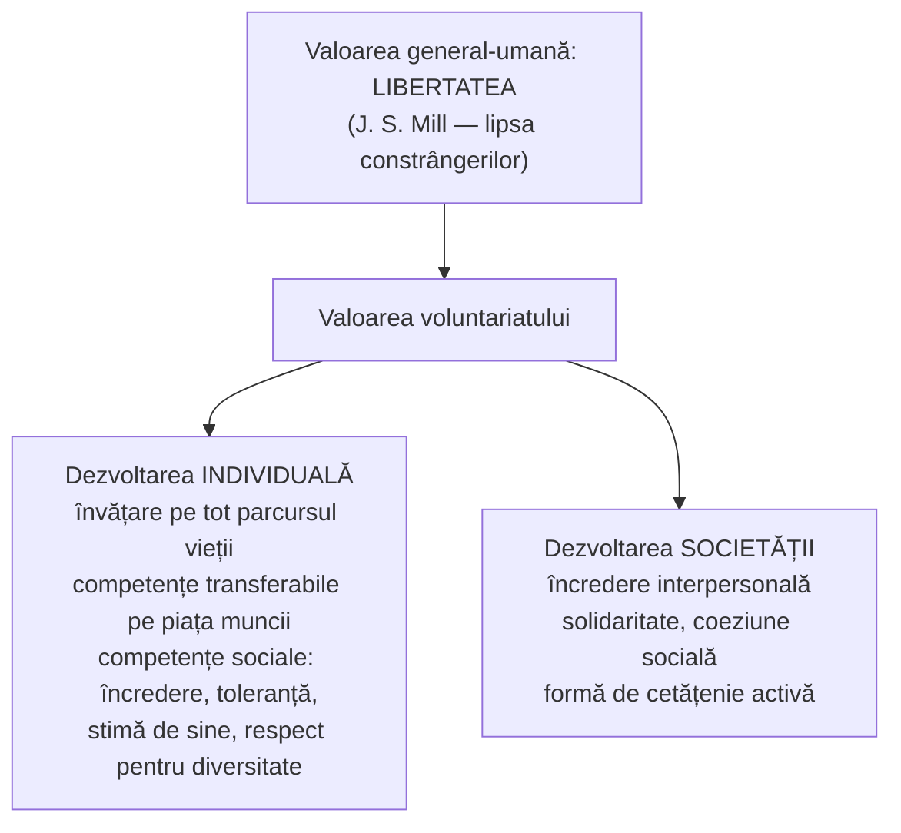
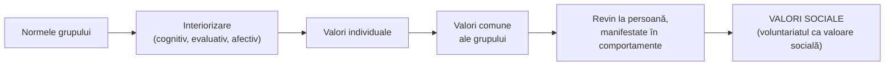

↑ [[Modulul 07 - Noile educații]] · ← [[7.1 Noile educații - delimitări conceptuale]] · → [[7.2.2 Educația pentru comunicare și mass-media]]

> [!abstract] Pe scurt
> - **Educația pentru participare și democrație** formează capacitatea de a **înțelege și aplica democrația**: principiile ei (**reprezentare, separarea puterilor, legitimitate**) și instituțiile care promovează **drepturile omului**.
> - **Participarea** înseamnă mai mult decât activitate utilă: tânărul devine **coparticipant la propria formare**, **subiect activ** și integrator social. Învățarea participativă formează **atitudini și comportamente**, nu doar cunoștințe.
> - **Voluntariatul** este forma actuală principală de educație pentru participare. Mișcarea modernă începe cu **Pierre Cérésole** (1920, lângă Verdun). În R. Moldova manualul citează **Legea nr. 121/2010**.
> - Valoarea voluntariatului are **două dimensiuni**: **dezvoltare individuală** (competențe transferabile, sociale, funcționale) și **dezvoltarea societății** (încredere, solidaritate, coeziune, **cetățenie activă**).
> - Motivația voluntarilor e explicată prin nevoile de **realizare, putere și afiliere**. Atitudinile formate au componente **cognitivă, afectivă, comportamentală**.

---

# PARTEA I — Ce spune manualul

## 1. Sensul educației pentru participare (p. 222)

- Nu înseamnă doar posibilitatea unei **activități creatoare**, care mobilizează toate capacitățile individului și e **socialmente utilă**.
- Înseamnă și **șansa oferită tinerilor** să-și **precizeze aspirațiile**, să-și exprime nevoia de **a inova** și să dobândească **capacitatea de autogestiune**.

> [!quote] Definiție (p. 222)
> Educația pentru participare și democrație urmărește **formarea capacităților de înțelegere și aplicare a democrației**: la nivelul **principiilor** sale de conducere socială eficientă (**reprezentarea, separarea puterilor, legitimitatea**) și al **instituțiilor** recunoscute universal care promovează **drepturile omului**. Conținuturile sunt incluse în programele școlare și universitare ca **module sau discipline**.

## 2. Tânărul ca subiect activ al participării (p. 222–223)

- Prin participare tinerii își exprimă **opțiunile** în educație, cultură, producție, timp liber, sport. Devin **coparticipanți la propria formare**.
- Tineretul **nu e doar receptor de informații și consumator**, ci participant activ la „opera comună” și la istoria națiunii.
- Tânărul **se integrează** în societate și, în același timp, **acționează ca subiect integrator**. Este factor și **resursă de progres spiritual și moral**.
- Implicarea în propria formare nu înseamnă doar **interiorizarea normelor**, ci **angajare conștientă și afectivă**: dorință de autoperfecționare, contact activ cu **modele de acțiune dezirabile social**.
- Participarea se manifestă prin **cooperare**, **dialog**, apropiere moral-afectivă. Creează **solidaritate** și dorința de a deveni **partener**.

> [!tip] De reținut — învățarea participativă (p. 223)
> - Nu înseamnă doar **cunoștințe**, ci mai ales **atitudini, comportamente și modele de acțiune** în situații sociale.
> - Presupune **acceptare și solidaritate**, **coeziune**, **încredere reciprocă**, respect față de om.
> - A solicita participarea înseamnă a aplica **principiile democrației în comportamentul cotidian**, în muncă și în viață.

## 3. Voluntariatul — istoric (7.2.1.1, p. 223–224)

- Voluntariatul e o formă actuală, frecvent folosită pentru **dezvoltarea atitudinilor**. E un element important al tuturor societăților.
- La început a fost văzut ca o **modalitate de a lega prietenii între tineri din țări diferite**. S-a răspândit în lume în **anii 1920–1930**.
- **Pierre Cérésole** (pacifist elvețian), motivat de **solidaritate și ajutor reciproc**, a organizat în **1920** un proiect cu participanți din mai multe țări europene pentru a **reconstrui un sat de lângă Verdun**, distrus în Primul Război Mondial.
- Organizații internaționale ca **SCI** (Service Civil International), **YAP** (Youth Action for Peace), **CCIVS** (Coordinating Committee for International Voluntary Service) consideră această inițiativă **începutul mișcării moderne de voluntariat internațional**.
- **După 1990** au crescut oportunitățile de voluntariat: programe pentru tineri și **traininguri pentru voluntari** (Germania, Austria, Spania, Olanda).
- **Vârsta voluntarilor**: mulți tineri, puțini vârstnici. Manualul prezintă **Olanda** ca excepție, unde vârstnicii sunt cei mai implicați, iar societatea civilă e o „piatră de temelie” a voluntariatului.

## 4. Definiții legale (p. 224–225)

| Țara | Act normativ | Definiția (parafrazată) |
|---|---|---|
| **România** | **Legea nr. 339 din 17 iulie 2006** | activitate de **interes public**, desfășurată **din proprie inițiativă**, **în folosul altora**, **fără contraprestație materială**. Domenii: asistență și servicii sociale, drepturile omului, medico-sanitar, cultural-artistic, educativ, științific, umanitar, religios, filantropic, sportiv, protecția mediului, social și comunitar |
| **R. Moldova** | **Legea nr. 121 din 18.06.2010** | **participare benevolă**, din **proprie inițiativă**, la oferirea de **servicii, cunoștințe și abilități** sau la activități de **utilitate publică**; **cu sau fără contract** de voluntariat |
| R. Moldova (aceeași lege) | — | **voluntariat internațional** = activitate **neremunerată**, pe termen scurt sau lung, **într-o altă țară** decât cea de reședință |

- **Nu există restricții** privind cine poate face voluntariat: tineri sau vârstnici, copii, persoane cu dizabilități, angajați sau șomeri, femei sau bărbați, indiferent de religie, stare materială sau apartenență la minorități (p. 225).
- Voluntariatul a ocupat un **loc semnificativ în politicile publice** europene și naționale și e o **valoare modernă** în educația tinerilor. Manualul observă însă că **scopul** implicării tinerilor e **uneori incert**.

## 5. Valoarea voluntariatului: două dimensiuni (p. 225–226)

- **Libertatea** e înțeleasă filozofic ca **„lipsa constrângerilor”**. Manualul enumeră, după **J. S. Mill** (*Despre libertate*), sferele libertății umane (p. 225):
  1. **libertatea lăuntrică** (de conștiință);
  2. **libertatea de exprimare**;
  3. **libertatea de a-ți alege stilul de viață**;
  4. **libertatea de asociere** liber consimțită.
- **Fundația pentru Dezvoltarea Societății Civile** (ONG înființat în **1994** la inițiativa **Comisiei Europene**) estimează valoarea voluntariatului la **0,5–5% din PIB** în statele europene (p. 226).
- **Profilul voluntarului european**: activism mai mare la persoanele cu **nivel socioeconomic ridicat**, cu **circa 20 de ani de școală**, **active pe piața muncii** și interesate de **viața publică**.

## 6. Voluntariatul ca educație nonformală (p. 226–227)

- Curriculumul școlar și universitar urmărește **integrarea socială**, dar **educația nonformală** e argumentată ca parte a **educației pe tot parcursul vieții** (→ [[3.3 Educația nonformală]], [[3.6 Educația permanentă și autoeducația]]).
- Funcțiile nonformalului sunt **fundamentale și reparatorii** în învățarea permanentă, realizată în **parteneriat** între **instituțiile statului și societatea civilă**.
- **Decizia de implicare e individuală**. Prin lucru în echipă și individual, în situații-problemă, voluntariatul devine un **mijloc eficient de învățare**: capacități, cunoștințe, atitudini → **competențe noi**.
- **Competențe funcționale** dezvoltate (p. 227):
  - organizatorice, de **autogestiune**;
  - **managementul timpului**;
  - **gândire critică**, **luarea deciziilor**;
  - prelucrarea și utilizarea contextuală a informațiilor;
  - **identificarea și rezolvarea problemelor**.
- Voluntariatul permite valorificarea **experienței de viață** într-un cadru **flexibil și deschis** și diversifică **mediile de învățare**.

## 7. De la norma grupului la valoarea socială (p. 227)

- Statutul de membru-voluntar se câștigă prin **conformarea la normele grupului**.
- Atitudinile grupului sunt **interiorizate** în timp și schimbă **ierarhia orientărilor valorice** ale persoanei.
- Valorile individuale pot deveni **valori comune** ale grupurilor de apartenență, apoi se întorc la persoană. Manifestate în comportamente, ele devin **valori sociale**.
- Pe această traiectorie, **voluntariatul devine valoare socială**.

## 8. Dimensiunea „conativă” și atitudinile (p. 227–228)

- Construirea în timp a valorii voluntariatului are o **dimensiune conativă (comportamentală)**, cu două sensuri:
  - **în sens larg**: afectivitate, expresivitate, sensibilitate, **voință**. Legat de **viziunea asupra lumii** și de identificarea și satisfacerea **nevoilor umane** (**A. Maslow**, 1954, 1971). **W. Huitt** (1999) include aici: o **viziune pentru viață**, **stabilirea obiectivelor**, **planuri de acțiune**, **reflecția** asupra propriilor acțiuni;
  - **în sens restrâns**: procesarea mentală și **intențiile** prin care încercăm să controlăm conștient opiniile, prin **autoreglare**. Rezultatul este un ansamblu de reacții față de un obiect, adică **atitudinile**.
- Definiția atitudinii propusă de **G. W. Allport** (după **S. Chelcea**, *Psihosociologie*, 2010): **orientări personale sau de grup** care combină elemente **cognitive, afective și comportamentale** și care **direcționează, motivează sau evaluează** comportamentul (p. 228).

| Componenta atitudinii | Descriere (p. 228) |
|---|---|
| **Cognitivă** | variază cantitativ și calitativ: percepții, opinii, convingeri. Unii se bazează doar pe **experiența proprie**, alții **se documentează**, alții adoptă atitudinea **prin imitație** |
| **Afectivă** | **dominantă**: reacții neurovegetative, stări emoționale; intensitate variabilă; orientare **pozitivă, negativă sau neutră** |
| **Comportamentală** | **acțiuni deschise**, rezultat al componentelor cognitivă și afectivă |

## 9. Motivația voluntarilor (p. 228–229)

Voluntariatul răspunde dorinței tinerilor de **reușită socială și profesională** și nevoii de **autorealizare**. Manualul grupează motivele (fără a numi teoria) astfel:

| Nevoia | Manifestări (p. 228–229) |
|---|---|
| **De realizare** (motivație extrinsecă, în formularea manualului) | să fie cât mai buni și recunoscuți; să înțeleagă ce înseamnă „succes”; să-și asume **responsabilități**; nevoie de **instrucțiuni precise**; să atingă **obiective concrete** |
| **De putere** | dorința de **impact** și influență pozitivă; de a produce **schimbarea**; preocuparea pentru **reputație și statut**; plăcerea de a da sfaturi; forța discursului; viziunea de ansamblu |
| **De afiliere** | dorința de a fi **acceptat și plăcut**; compararea succeselor cu ale altora; **ajutorarea celor în nevoie**; **lucrul în echipă**; cunoașterea bună a colegilor |

> [!quote] Definiție (p. 229)
> **Voluntariatul studențesc** desemnează categoria de **studenți** care acceptă să contribuie **benevol** la identificarea și rezolvarea problemelor **instituției în care învață** sau să se implice în **activități comunitare** în țară și în străinătate.

---

# PARTEA II — Completări

## 10. Cadrul european: EDC/HRE și competențele pentru cultură democratică

| Document | An | Contribuție |
|---|---|---|
| **Convenția ONU cu privire la drepturile copilului**, art. 12 | 1989 | dreptul copilului de a-și **exprima liber opinia** în problemele care îl privesc — baza juridică a participării copiilor |
| **Carta Consiliului Europei privind educația pentru cetățenie democratică și educația pentru drepturile omului** (EDC/HRE), Recomandarea CM/Rec(2010)7 | 2010 | distinge **EDC** (drepturi și responsabilități democratice, participare) de **HRE** (drepturile omului și libertățile fundamentale). Le leagă de învățarea **formală, nonformală și informală** |
| **Cadrul de referință al competențelor pentru cultură democratică** (RFCDC) | 2018 | modelul „fluture” cu **20 de competențe** în **4 grupuri**: **valori** (3), **atitudini** (6), **abilități** (8), **cunoaștere și înțelegere critică** (3) |
| **UNESCO — Global Citizenship Education** (GCED) | 2015 | dimensiuni **cognitivă, socio-emoțională, comportamentală**, adică aceeași triadă ca în modelul atitudinii din manual |

- **Scara participării** a lui **Roger Hart** (*Children's Participation: From Tokenism to Citizenship*, UNICEF, 1992): **8 trepte**. Primele trei sunt **non-participare** (**manipulare, decor, tokenism**, adică participare de fațadă). Urmează treptele participării reale, până la **inițiative ale copiilor, cu decizii luate împreună cu adulții**. E un instrument util pentru a evalua dacă participarea elevilor (consilii școlare, proiecte) e **autentică**.

> [!note] Comentariu — R. Moldova
> Disciplina **Educație pentru societate** (clasele V–XII, introdusă din **2018**) are la bază **Carta EDC/HRE** și **RFCDC** și a fost elaborată cu experți ai Consiliului Europei. Este forma **disciplinară** actuală a educației pentru participare și democrație (→ [[7.3 Proiectarea curriculară a noilor educații]]). A înlocuit vechea „Educație civică”.

## 11. Voluntariatul — completări și actualizări

- **Pierre Cérésole și Esnes (1920)** — precizări după arhivele **SCI**: primul **„workcamp”** a avut loc la **Esnes-en-Argonne**, lângă Verdun, începând din **noiembrie 1920**. Echipa inițială: **trei germani, un austriac și un olandez**, la care s-au adăugat voluntari englezi, olandezi și elvețieni. Au construit **case de lemn**, au curățat câmpurile și au reparat un drum, până în **aprilie 1921**. Participarea germanilor, încă văzuți ca dușmani, avea un sens explicit de **reconciliere și pace** (→ [[7.2.4 Educația pentru pace și cooperare]]). SCI e considerat primul ONG internațional de voluntariat.
- **Repere ONU/UE**: **Ziua Internațională a Voluntarilor** — **5 decembrie** (instituită de ONU în 1985); **Anul Internațional al Voluntarilor** — **2001**; **Anul European al Voluntariatului** — **2011**; **Corpul European de Solidaritate** (din **2018**).
- **Legislație actualizată**:
  - **România**: Legea nr. 339/2006, citată în manual, a fost **înlocuită** de **Legea voluntariatului nr. 78/2014**.
  - **R. Moldova**: Legea nr. 121/2010 a fost **abrogată** prin **noua Lege a voluntariatului nr. 326/2025**, adoptată de Parlament în **decembrie 2025**. Noutăți: recunoaște voluntariatul **formal, informal, corporativ și internațional**; tinerii pot participa la programe certificate **de la 14 ani** (sub 16 ani cu acordul scris al părinților); **competențele** dobândite sunt **certificate electronic**; voluntarii care lucrează cu grupuri vulnerabile trebuie să prezinte **cazier**. Principii: echitate, incluziune, egalitate de șanse, **participare benevolă**, respectul demnității beneficiarilor.

> [!note] Comentariu
> Noua lege din R. Moldova răspunde exact problemei semnalate în [[3.3 Educația nonformală]]: **validarea socială** a rezultatelor învățării nonformale. Certificatul de voluntariat, cu **competențele dobândite**, transformă voluntariatul într-o **experiență de învățare recunoscută**.

## 12. Fundamente teoretice ale secțiunii despre motivație și atitudini

| Idee din manual | Sursa teoretică (nenumită sau incomplet citată în manual) |
|---|---|
| Nevoile de **realizare, putere, afiliere** (p. 228–229) | **David C. McClelland**, teoria nevoilor dobândite (*The Achieving Society*, 1961) |
| Atitudinea ca stare de **pregătire** care orientează comportamentul | **G. W. Allport** (1935), capitol despre atitudini în *Handbook of Social Psychology* |
| Modelul **tripartit** al atitudinii (cognitiv–afectiv–comportamental) | **M. J. Rosenberg & C. I. Hovland** (1960) — modelul e asociat mai ales cu ei, nu cu Allport |
| **Conația** (voință, efort, intenție) ca a treia facultate a minții | **W. Huitt** (1999), *Conation as an important factor of mind* |
| Motivele voluntariatului | **E. G. Clary, M. Snyder et al.** (1998), *Volunteer Functions Inventory*: funcțiile **valori, înțelegere, social, carieră, protecție, stimă de sine** |

## 13. Comentariu critic

> [!warning] Erori și probleme
> - **Confuzie terminologică majoră (p. 227–228)**: manualul amestecă **conația** (dimensiunea *conativă*, adică volitiv-comportamentală) cu **conotația** (sens secundar, „adaos, subtext”). Textul pornește de la „dimensiunea conativă”, dar vorbește apoi de „conotație în sens larg/restrâns”. Huitt (1999) scrie despre ***conation***, nu despre conotație.
> - **Trimiteri bibliografice greșite**: definiția legii române și voluntariatul studențesc sunt atribuite sursei **[29]** (Ursu, educație ecologică). Sursa corectă e **[23]** (Sadovei, *Voluntariatul ecologic*, p. 168–171). *Despre libertate* e trecută la **„Stuart J.”** în loc de **Mill, J. S.**
> - **Eroare factuală**: bătălia de la Verdun (1916) nu a „luat viața a mai mult de un milion de oameni”. Estimările curente sunt de circa **300.000 de morți** și **aproximativ 700.000–800.000 de victime** în total (morți, răniți, dispăruți).
> - **Generalizare neargumentată**: afirmația că **Olanda** ar fi „singura țară” în care vârstnicii fac voluntariat nu are sursă și e contrazisă de datele europene (de ex. țările nordice).
> - **Motivație „extrinsecă”**: nevoia de realizare e prezentată ca motivație extrinsecă. În teoria lui McClelland, nevoia de realizare e în primul rând un **motiv intern**.
> - **Mill**: *On Liberty* (1859) descrie **trei** sfere ale libertății: conștiință (inclusiv gândire, sentimente, exprimare), gusturi și planuri de viață, asociere. Manualul le transformă în patru.
> - **Legislație depășită**: ambele legi citate au fost înlocuite (RO — 2014; RM — 2025).
> - **Dezechilibru**: educația pentru **democrație** ocupă o pagină, iar voluntariatul șase. Nu sunt tratate **instituțiile democratice**, **drepturile omului** sau **participarea școlară** (consilii ale elevilor), deși definiția le anunță. Nu există obiective, conținuturi sau metode structurate, ca la alte educații.

## 14. Întrebări de autoverificare

1. Definiți educația pentru participare și democrație. Care sunt cele trei principii ale democrației menționate?
2. Ce înseamnă că tânărul e „coparticipant la propria formare” și „subiect integrator”?
3. Prin ce se deosebește învățarea participativă de simpla transmitere de cunoștințe?
4. Cine este Pierre Cérésole și ce semnificație are proiectul de la Esnes (1920)?
5. Comparați definițiile legale ale voluntariatului din România și R. Moldova. Ce aduce nou legea moldovenească din 2025?
6. Explicați cele două dimensiuni ale valorii voluntariatului și dați câte trei exemple de competențe dezvoltate.
7. Descrieți componentele atitudinii. Cum se transformă normele grupului în valori sociale?
8. Ce nevoi motivează implicarea tinerilor în voluntariat? Căror teorii psihologice le corespund?
9. Ce este scara participării a lui R. Hart? Aplicați-o unui consiliu al elevilor.
10. Ce competențe din modelul RFCDC (2018) pot fi formate prin voluntariat?

## Surse

- Manual, p. 222–229; Sadovei, L. (2014). *Voluntariatul ecologic — formă de educație modernă în perpetuarea valorilor clasice*. Chișinău: CEP USM, p. 168–171; Chelcea, S. (2010). *Psihosociologie*. Iași: Polirom; Mill, J. S. (2005). *Despre libertate*. București: Humanitas.
- Legea R. Moldova nr. 121/2010 cu privire la voluntariat (abrogată); [Parlamentul RM — noua lege a voluntariatului](https://parlament.md/ns-newsarticle-Activitatea-de-voluntariat-reglementat-de-o-lege-nou-armonizat-cu-legislaia-UE.nspx); [Moldova 1 — Voluntariatul, reglementat printr-o lege nouă](https://moldova1.md/p/65462/voluntariatul-reglementat-printr-o-lege-noua-tinerii-pot-face-voluntariat-de-la-14-ani-iar-competentele-vor-fi-recunoscute-oficial).
- Legea României nr. 339/2006 (abrogată) și Legea nr. 78/2014 privind reglementarea activității de voluntariat.
- [Archives of Service Civil International — Pierre Ceresole and the first workcamps](https://archives.sci.ngo/ceresole-first-workcamps).
- Council of Europe (2010). *Charter on Education for Democratic Citizenship and Human Rights Education*, CM/Rec(2010)7.
- Council of Europe (2018). *Reference Framework of Competences for Democratic Culture*, vol. 1–3. Strasbourg.
- Hart, R. A. (1992). *Children's Participation: From Tokenism to Citizenship*. Innocenti Essays no. 4. Florența: UNICEF.
- McClelland, D. C. (1961). *The Achieving Society*. Princeton: Van Nostrand.
- Huitt, W. (1999). *Conation as an important factor of mind*. Educational Psychology Interactive, Valdosta State University.
- Clary, E. G., Snyder, M. et al. (1998). Understanding and assessing the motivations of volunteers. *Journal of Personality and Social Psychology*, 74(6).
- [Consiliul Europei — Educație pentru democrație în R. Moldova](https://www.coe.int/ro/web/chisinau/education-for-democracy).
