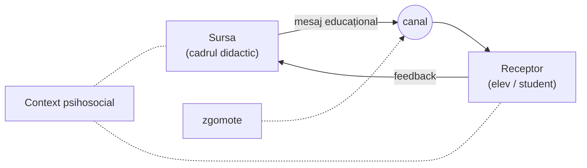

↑ [[Modulul 07 - Noile educații]] · ← [[7.2.1 Educația pentru participare și democrație]] · → [[7.2.3 Educația pentru dezvoltare emoțională]]

> [!abstract] Pe scurt
> - **Scopul**: o **atitudine selectivă și responsabilă față de informație**, **competență comunicativă** și **capacitate de dialog**. Informația din presă, radio și TV trebuie **valorificată cultural** și **evaluată pedagogic**, prin raportare la valorile sociale.
> - **Trăsăturile comunicării** (după E. Tărnă): e intențională, are **trei dimensiuni** (comunicare exteriorizată, **metacomunicare**, **intracomunicare**), are **context**, e **dinamică** și **ireversibilă**, iar mesajul are conținut **manifest și latent**.
> - **Competența de comunicare didactică** (L. Sadovei): comportamente de **elaborare, transmitere și evaluare** a discursului didactic și de construire a unor **rețele comunicaționale productive**. Are o componentă de **comunicare relațională**.
> - **M. Cojocaru-Borozan**: comunicarea autentică se bazează pe **cultură emoțională**; comunicarea e **„factorul coagulant” al relaționării** în educație.
> - **Asertivitatea** (E. Bîrsan; criteriile lui Lazarus) înseamnă a exprima adecvat sentimente, nevoi și opinii, a spune **„nu”**, a respecta nevoile celorlalți.

---

# PARTEA I — Ce spune manualul

## 1. Definiție și obiective (p. 229–230)

> [!quote] Definiție (p. 229–230)
> Educația pentru comunicare și mass-media urmărește formarea unei **atitudini selective și responsabile față de informație**, a **competenței comunicative** și a **capacității de a dialoga**. Vizează capacitatea de **valorificare culturală a informației** furnizate de **presă, radio, televiziune** etc. Informația e tot mai **diversificată și individualizată**, de aceea cere o **evaluare pedagogică responsabilă**, raportată la **valorile sociale**.

- Comunicarea **îi pune pe oameni în legătură** unii cu alții, în mediul în care trăiesc (p. 230).

## 2. Specificul comunicării — după E. Tărnă (p. 230)

| Trăsătură | Explicație |
|---|---|
| **Intenționalitate** | prin conținutul mesajului se urmăresc **scopuri** și se transmit **semnificații** |
| **Triplă dimensiune** | **comunicare exteriorizată** (acțiuni verbale și nonverbale observabile) · **metacomunicare** (ce se înțelege dincolo de cuvinte) · **intracomunicare** (dialogul interior, la nivelul sinelui) |
| **Contextualitate** | are loc într-un spațiu **psihologic, social, cultural, fizic, temporal**, cu care e interdependentă |
| **Dinamism** | odată inițiată, comunicarea **evoluează**, se schimbă și **îi schimbă pe participanți** |
| **Ireversibilitate** | un mesaj transmis **nu mai poate fi oprit** |
| **Accelerare în criză** | în situații de criză ritmul crește și sfera se lărgește |
| **Relativitatea semnificației** | același mesaj poate fi înțeles **diferit** de parteneri și de receptori diferiți |
| **Conținut manifest și latent** | adesea **conținutul latent** e mai important |

## 3. Comunicarea ca știință și ca instrument didactic (p. 230–231)

- Comunicarea e obiectul unei **științe integrative**. Specificul ei: studiul **circuitelor profesionale și instituționale ale informației**, destinate publicului larg sau celui specializat (L. Sadovei, cu trimitere la „Dafinoiu J.”).
- **L. Sadovei** se concentrează pe **comunicarea cu funcție didactică**: **sursa** (cadrul didactic) transmite un **mesaj** **receptorului** (elevul/studentul) cu intenția de a-i **forma un comportament comunicativ**.
- Actul de comunicare e privit ca **cadru structurat instrumental**: trimitere și receptare de mesaje **într-un context**, cu **efecte**, afectate de **zgomote**, cu posibilitate de **feedback** (p. 231).

## 4. Competența de comunicare didactică — L. Sadovei (p. 231–232)

- Participă direct la procesul educațional, conform unor **legități specifice**. Reprezintă **măiestria** profesorului de a construi **mesaje educaționale** adaptate **câmpului psihosocial**, astfel încât să producă **reacții formative**. Condiția esențială este **compatibilizarea educațională** (p. 231).
- L. Sadovei a promovat conceptul de **„competență de comunicare didactică a studenților pedagogi”**. Formarea acestei competențe a devenit un obiectiv al cercetărilor din **R. Moldova**.

> [!quote] Definiție (p. 232, după L. Sadovei)
> **Competența de comunicare didactică** este ansamblul **comportamentelor comunicative** de **elaborare / transmitere / evaluare a discursului didactic** și de asigurare a unor **rețele comunicaționale productive** în context educațional.

- Se formează prin predarea, învățarea și evaluarea **disciplinelor modulului pedagogic**. Presupune:
  - **capacități, deprinderi, atitudini profesionale** la nivelul **discursului didactic**;
  - **comportamente relaționale**, care facilitează integrarea viitorilor profesori în școala modernă (p. 232).

## 5. Comunicarea relațională (p. 232–233)

> [!quote] Definiție (p. 232, după L. Sadovei)
> **Comunicarea relațională** este ansamblul variabilelor care permit profesorului să-și organizeze comunicarea ca **interacțiune didactică și socială**, prin **reguli conversaționale, norme de politețe, principii de cooperare și interferență**.

- **M. Cojocaru-Borozan** (*Comunicare relațională*, 2009) integrează conceptul în cercetări moderne, cu termeni ca: **arhitectură comunicațională**, **ecologie relațională**, **management și marketing relațional**, **creativitate comunicațională**, **flexibilitate relațională**.
- Toți desemnează **comunicarea autentică bazată pe cultură emoțională**. Ipoteza: **comunicarea este factorul coagulant al relaționării** în educație.

> [!quote] Definiție (p. 232, după M. Cojocaru-Borozan)
> **Comunicarea relațională** este un proces de **interacțiune verbală, paraverbală și nonverbală**, prin **expresii emoționale**, cu scopul de a **influența** și de a **stabili relații sociale**, de a face schimb de **impresii (stări afective)** despre experiențele emoționale trăite.

- **Mediul educațional e „saturat de emoții”**, care determină **climatul psihopedagogic**. Profesorii trebuie să conștientizeze **valoarea emoțiilor** și să aibă concepte și competențe pentru a-și înțelege comportamentul afectiv și pe al elevilor (p. 233) → [[7.2.3 Educația pentru dezvoltare emoțională]].
- **Noua paradigmă**: **comunicarea prin relație și în relație**. Relațiile școlare sunt văzute ca **„laborator”** al dezvoltării elevilor.

## 6. Comunicarea asertivă (p. 233–234)

- Societatea și învățământul au nevoie de **comunicare profesională asertivă**. Asertivitatea e **strategia optimă** de rezolvare a problemelor interpersonale și de **formare continuă**. Învățământul superior trebuie să dezvolte profesional cadrele didactice pentru comunicarea asertivă (**E. Bîrsan**, *Comunicarea asertivă*, 2013).
- **A fi asertiv** înseamnă, înainte de toate, a fi în **acord profund cu propriile valori și obiective**. De aici vine puterea de a **„spune lucrurilor pe nume”**.

> [!tip] De reținut — persoana matură/asertivă, după Lazarus (p. 233)
> 1. își **exprimă deschis și sincer** dorințele și trebuințele;
> 2. e capabilă **să spună NU**;
> 3. vorbește deschis despre **sentimentele pozitive și negative**;
> 4. știe **să stabilească contacte**, să **inițieze și să încheie** o discuție.

- Asertivitatea e o **însușire psihică importantă**: menține **echilibrul interior**, permite exprimarea dorințelor și cultivarea **relațiilor interpersonale** plăcute.
- **Școala și familia** trebuie să creeze **ocazii de succes**, în care elevul să-și descopere **punctele tari** (p. 234).
- **Asertivitatea presupune** (p. 234):
  - exprimarea adecvată a **sentimentelor, nevoilor, opiniilor**, ținând cont de ale celorlalți;
  - comunicarea **clară** a dorințelor;
  - **refuzul politicos, dar ferm** al lucrurilor nedorite;
  - **recunoașterea meritelor** altora, **fără a te minimaliza**.

| Stil | Caracteristică |
|---|---|
| **Pasiv** | accepți tot ce spune celălalt, îți sacrifici nevoile |
| **Agresiv** | contracarezi orice, vrei să te impui |
| **Asertiv** | **compromisul echilibrat**: îți afirmi drepturile fără să le lezezi pe ale altora (formularea apare la p. 248, în [[7.2.5 Educația pentru schimbare și dezvoltare]]) |

---

# PARTEA II — Completări

## 7. Educația pentru media: repere internaționale

| Document / autor | An | Contribuție |
|---|---|---|
| **Declarația de la Grünwald** privind educația pentru media (UNESCO) | 1982 | primul document internațional: sistemele educaționale trebuie să formeze **înțelegerea critică** a fenomenului mediatic și **participarea** |
| **Len Masterman**, *Teaching the Media* | 1985 | educația media ca **„demistificare”**: mesajele media sunt **construcții**, nu reflectări ale realității |
| **UNESCO, *Media and Information Literacy Curriculum for Teachers*** (MIL) | 2011 | unește **alfabetizarea media**, **informațională** și **digitală**: acces, evaluare critică, creare etică de conținut |
| **Consiliul Europei — Digital Citizenship Education** | din 2016 | cetățenia în mediul digital: siguranță, participare, drepturi online |
| **Comisia Europeană — DigComp** (cadrul competenței digitale) | 2013; v. 2.2 în 2022 | 5 domenii: **informație și date**, **comunicare și colaborare**, **creare de conținut**, **siguranță**, **rezolvarea problemelor** |

- **Cinci concepte-cheie** folosite frecvent în educația media (formulate de *Center for Media Literacy*, SUA): (1) toate mesajele media sunt **construite**; (2) folosesc un **limbaj creativ** cu reguli proprii; (3) oameni diferiți înțeleg **diferit** același mesaj; (4) media conțin **valori și puncte de vedere**; (5) majoritatea mesajelor urmăresc **profit și/sau putere**.
- **Provocări actuale** netratate în manual: **dezinformarea** și **știrile false**, **camerele de ecou** și **algoritmii** rețelelor sociale, **deepfake**-urile și conținutul generat de **inteligența artificială**, **dependența de ecrane**, **cyberbullying**-ul.

> [!note] Comentariu — R. Moldova
> Din **2017** se predă cursul opțional **„Educație pentru media”**, elaborat de **Centrul pentru Jurnalism Independent** (CJI), cu manuale pentru clasele III–IV, VII–VIII și X–XI. Curriculumul pentru liceu a fost aprobat în **2018–2019**. Aceasta este forma **disciplinară** (opțională) a educației pentru mass-media, în sensul demersurilor din [[7.3 Proiectarea curriculară a noilor educații]].

## 8. Teorii ale comunicării în spatele listei lui E. Tărnă

| Idee din manual | Sursă teoretică |
|---|---|
| Sursă → mesaj → canal → receptor, **zgomot**, **feedback** | **C. Shannon & W. Weaver**, *The Mathematical Theory of Communication* (1949); feedback-ul vine din **cibernetică** (N. Wiener) |
| Mesajul are **conținut** și **relație**; **metacomunicare**; comunicarea e inevitabilă | **P. Watzlawick, J. Beavin, D. Jackson**, *Pragmatics of Human Communication* (1967), **școala de la Palo Alto**: „nu putem să nu comunicăm” |
| Comunicarea ca **tranzacție** dinamică, ireversibilă | modelele **tranzacționale** ale comunicării (anii 1970) |
| Comunicarea nonverbală și paraverbală | **A. Mehrabian**, *Silent Messages* (1971). Celebrul raport „7%–38%–55%” e valabil **doar** pentru mesaje despre sentimente și atitudini, nu pentru orice comunicare |

## 9. Asertivitatea — precizări

- Criteriile de la p. 233 aparțin lui **Arnold A. Lazarus**, psihoterapeut comportamentalist (anii 1970), **nu** lui Richard S. Lazarus, teoreticianul stresului (confuzie posibilă, fiindcă manualul scrie doar „Lazarus”).
- Alte repere: **Andrew Salter**, *Conditioned Reflex Therapy* (1949), precursor; **J. Wolpe** a introdus termenul „comportament asertiv” (1958); **R. Alberti & M. Emmons**, *Your Perfect Right* (1970), lucrare clasică despre drepturile asertive.
- **Comunicarea nonviolentă** (**M. B. Rosenberg**, *Nonviolent Communication*, 1999–2003): patru pași — **observație, sentiment, nevoie, cerere**. E un instrument practic apropiat de asertivitate, folosit mult în școli.

## 10. Comentariu critic

> [!warning] Probleme
> - **Titlul promite mass-media, textul nu tratează mass-media.** După definiție (p. 229–230), subcapitolul vorbește despre **comunicarea didactică**, **comunicarea relațională** și **asertivitate**, adică teme de pedagogia comunicării și de formare a profesorilor. Lipsesc complet **alfabetizarea media**, analiza critică a mesajelor, publicitatea, propaganda, siguranța online.
> - **Accent pe cercetările autorilor**: secțiunea prezintă mai ales lucrări proprii (Sadovei, 2008; Cojocaru-Borozan, 2009; Bîrsan, 2013), fără cadrul internațional al domeniului (UNESCO, Grünwald, MIL).
> - **Trimitere greșită**: lista lui **E. Tărnă** e atribuită sursei **[27]** (Mill, *Despre libertate*). Tărnă e poziția **[28]**.
> - „**Dafinoiu J.**” — probabil **I. Dafinoiu** (psiholog român) sau o altă sursă. Citatul despre „circuitele profesionale și instituționale ale informației” nu poate fi verificat (de verificat).
> - „**Lazarus**” fără prenume și fără sursă (vezi §9).
> - **Repetiție**: asertivitatea e tratată din nou, aproape identic, în 7.2.5 (p. 248–249, după M. Ianioglo).
> - Scăpări de redactare: „marcheting”, „promăvării”, fraze neterminate („Ținînd cont de faptul că mediul educațional este contextul…”, p. 233).

## 11. Întrebări de autoverificare

1. Definiți educația pentru comunicare și mass-media. Ce înseamnă „atitudine selectivă și responsabilă față de informație”?
2. Explicați cele trei dimensiuni ale comunicării: exteriorizată, metacomunicare, intracomunicare.
3. De ce e comunicarea „ireversibilă” și „dinamică”? Dați un exemplu din clasă.
4. Definiți competența de comunicare didactică și comunicarea relațională (L. Sadovei).
5. Ce înseamnă că „comunicarea este factorul coagulant al relaționării” (M. Cojocaru-Borozan)?
6. Care sunt criteriile asertivității după Lazarus? Comparați stilurile pasiv, agresiv și asertiv.
7. Ce este alfabetizarea media și informațională (UNESCO MIL)? De ce e necesară azi?
8. Formulați trei obiective pentru o lecție de educație media despre știrile false.

## Surse

- Manual, p. 229–234; Tărnă, E. (2011). *Bazele comunicării*. Chișinău: Prut Internațional; Sadovei, L. (2008). *Competența de comunicare didactică*. Chișinău: UPS „I. Creangă”; Cojocaru-Borozan, M. (2009). *Comunicare relațională*. Chișinău: UPS „I. Creangă”; Bîrsan, E. (2013). *Comunicarea asertivă: ghid metodologic*. Chișinău: UPS „I. Creangă”.
- UNESCO (1982). *Grünwald Declaration on Media Education*.
- Wilson, C., Grizzle, A. et al. (2011). *Media and Information Literacy Curriculum for Teachers*. Paris: UNESCO.
- Masterman, L. (1985). *Teaching the Media*. London: Comedia/Routledge.
- Watzlawick, P., Beavin, J. H., Jackson, D. D. (1967). *Pragmatics of Human Communication*. New York: Norton.
- Shannon, C. E., Weaver, W. (1949). *The Mathematical Theory of Communication*. Urbana: University of Illinois Press.
- Alberti, R. E., Emmons, M. L. (1970). *Your Perfect Right*. San Luis Obispo: Impact.
- Rosenberg, M. B. (2003). *Nonviolent Communication: A Language of Life*. Encinitas: PuddleDancer Press.
- Comisia Europeană, JRC (2022). *DigComp 2.2: The Digital Competence Framework for Citizens*.
- [Educația Mediatică — proiect al Centrului pentru Jurnalism Independent](https://educatia.mediacritica.md/ro/); [Curriculumul opționalului Educație pentru media, liceu](https://educatia.mediacritica.md/ro/2019/08/20/curriculumul-pentru-disciplina-optionala-educatie-pentru-media-treapta-liceala-a-fost-aprobat-de-minister/).
