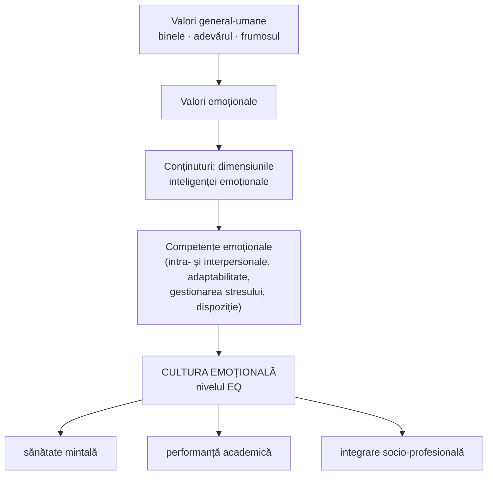

↑ [[Modulul 07 - Noile educații]] · ← [[7.2.2 Educația pentru comunicare și mass-media]] · → [[7.2.4 Educația pentru pace și cooperare]]

> [!abstract] Pe scurt
> - **Educația pentru dezvoltare emoțională** e o nouă dimensiune a educației, dezvoltată în pedagogia din R. Moldova de **M. Cojocaru-Borozan**. E un răspuns la **efectele negative ale emoțiilor distructive** asupra rațiunii și sănătății.
> - **Ținta**: dezvoltarea **coeficientului de emoționalitate (EQ)**, vizibilă în **competențe emoționale**. Acestea susțin **performanța academică**, **sănătatea mintală** și **integrarea socio-profesională**. **Finalitatea** este **cultura emoțională**.
> - **Cinci obiective specifice**: **intrapersonal** (autocunoaștere, autocontrol), **interpersonal** (empatie, responsabilitate socială), **adaptabilitate**, **gestionarea stresului**, **dispoziție generală** (optimism, fericire).
> - **Metodologie**: metode **activ-participative**, mai ales **expozitiv-euristice** (conversația, discuția, dezbaterea și variantele lor).
> - **Sănătatea mintală** (7.2.3.1): e un **drept al omului** (Pactul european, Bruxelles, 2008). Până la **50%** din tulburările mintale **debutează în adolescență**. Pentru profesori e necesară **competența de management al stresului ocupațional** (T. Șova, M. Cojocaru-Borozan).

---

# PARTEA I — Ce spune manualul

## 1. Context și fundament (p. 234–235)

- Educația pentru dezvoltare emoțională e un **conținut pedagogic** care răspunde **problematicii afective** a lumii contemporane. Conceptul a fost valorificat în pedagogie de **M. Cojocaru-Borozan**.
- Apare ca **soluție socială** în fața înmulțirii **efectelor negative ale emoțiilor distructive** asupra rațiunii și sănătății.
- **Emoțiile** sunt o **sursă viabilă de informații**: ajută persoana **să înțeleagă și să exploreze mediul social** (*Teoria culturii emoționale*, 2010).
- **Din anii '90**, dezbaterea despre **coeficientul de emoționalitate** a avut două direcții:
  1. **inteligența emoțională**;
  2. **cultura emoțională**, concept mai larg.
- Întâlnirea acestor viziuni cu teoriile educației a consolidat conceptele folosite în cercetarea **culturii emoționale a cadrelor didactice** (p. 234).
- **Emoțiile**, după M. Cojocaru-Borozan, sunt **reflectarea psihică a atitudinii subiectului față de lume**. Calitățile **motivațional-reglatorii** exprimă **stările subiectului** și îl împing la acțiune.
- Realitatea psihică e **polivalentă**: procesele emoționale conțin **componente cognitive**, iar procesele reglatorii și volitive conțin componente **cognitive și emoționale** (p. 235).

## 2. Definiție și scop (p. 235)

> [!quote] Definiție (p. 235)
> **Educația pentru dezvoltare emoțională** este o **nouă dimensiune a educației**. Urmărește formarea și dezvoltarea optimă a **coeficientului de emoționalitate (EQ)**, exprimat prin **atitudini responsabile față de propriile stări afective**. Acestea se reflectă în **comportamente comunicative rezonante**, derivate din **sistemul individual de valori al inteligenței emoționale**, și sunt **măsurabile** la nivelul **competențelor emoționale**. Rezultatul: **performanță academică (IQ)**, **sănătate mintală** și **integrare socio-profesională**.

- **Scopul**: formarea și dezvoltarea **permanentă** a **conștiinței psihosociale** a personalității, la nivelul **inteligenței emoționale**, prin **competențe afective** care reflectă **cultura comunicării sociale**.

## 3. Obiective (p. 235–236)

**Obiective generale (nivel teoretic)**, orientate spre dezvoltarea inteligenței emoționale:
- **cunoștințe științifice**, adică nucleul epistemic al conceptului de inteligență emoțională;
- **competențe emoționale** cu **aplicabilitate socială**.

**Obiective specifice (nivel practic)**, orientate spre **conștiința emoțională practică**:

| Domeniu | Obiectiv specific | Componente |
|---|---|---|
| **Relații intrapersonale** | competențe de **autocunoaștere și autocontrol** | conștiința emoțională de sine, asertivitate, independență, respect de sine, împlinire de sine |
| **Relații interpersonale** | capacitatea de a **interacționa pozitiv** și de a **colabora** | empatie, responsabilitate socială |
| **Adaptabilitate** | capacitatea de a fi **flexibil și realist** | testarea realității, flexibilitate emoțională, luarea deciziilor, rezolvarea problemelor |
| **Gestionarea stresului** | rezistența la **stres**, controlul **impulsurilor** | echilibru și stabilitate emoțională |
| **Dispoziție generală** | atitudine **optimistă și entuziastă** față de viață | optimism, fericire |

- **Obiectivele concrete** rezultă din **operaționalizarea** celor specifice și se realizează în activități **formale sau nonformale**, în sistemul și procesul de învățământ (p. 236).

## 4. Conținuturi (p. 236–237)

- Corespund obiectivelor specifice și se operaționalizează după **mediul pedagogic** și după **particularitățile de vârstă și individuale** ale elevului.
- Sunt un **ansamblu structurat al dimensiunilor inteligenței emoționale**. Se raportează la **valori emoționale** derivate din valorile general-umane — **binele, adevărul, frumosul** (legătura cu **educația morală**).
- Se realizează prin activități didactice și educative proiectate **în perspectiva educației permanente**.
- **Finalitatea**: **cultura emoțională**, care reflectă **nivelul EQ** și susține **sănătatea mintală** și **disciplinarea emoțională** (echilibru, funcționare armonioasă — legătura cu **educația intelectuală și psihofizică**).
- Conținutul confirmă **convergența** dintre (p. 237):
  - **dimensiunile clasice** ale educației (morală, intelectuală, psihofizică, estetică, tehnologică → [[Modulul 06 - Dimensiunile generale ale educației]]);
  - **noile educații** (pentru sănătate, comunicare, pace și cooperare, schimbare și dezvoltare, carieră).
- Se poate realiza **atât prin activități educative, cât și prin disciplinele școlare**.

## 5. Metodologie (p. 237–238)

- Metodologia recomandată de **C. Zagaevschi și M. Cojocaru-Borozan** cuprinde **metodele de educație** orientate spre **conștiința emoțională** și spre **competențe emoționale** (atitudini, capacități, cunoștințe).
- Elevul e pus într-o **situație de învățare socială**. **Metoda** este **elementul esențial al strategiei didactice** (modelul de interacțiune dintre metode, procedee, mijloace și forme de instruire), fiindcă reprezintă **latura ei executorie**. Pentru profesor, metoda e un **plan de acțiune** (p. 237).
- **Clasificare** după cine e solicitat:
  - metode **clasice** → mai ales activitatea **profesorului**;
  - metode **moderne** → mai ales activitatea **elevului**;
  - metode care îi solicită **pe amândoi**.
- Învățământul actual preferă **metodele activ-participative**. **Activ** e elevul care face un **efort de reflecție personală**, caută, cercetează și redescoperă adevăruri. Suportul științific: copilul se dezvoltă **prin acțiune** (p. 237–238).

> [!tip] De reținut — metodele recomandate (p. 238)
> Educația are la bază **comunicarea interpersonală**. De aceea sunt eficiente **metodele expozitiv-euristice**, aflate între învățarea prin receptare și învățarea prin descoperire:
> - **conversația**, **discuția**, **dezbaterea** și variantele lor: discuția-dialog, consultația în grup, discuția de grup, discuția de tip seminar, **masa rotundă**, **brainstormingul**, discuția dirijată (pe teme anunțate), dezbaterea cu întrebări colectate dinainte, discuția liberă, **colocviul**.
> - Ele implică **deopotrivă profesorul și elevul** și arată **calitatea raporturilor de comunicare**.

- **Relațiile** necesare dezvoltării inteligenței emoționale: **educator–educat**, **educat–educat**, **educat–părinte**, **educat–comunitate** (p. 238).
- **Adolescenții**: vor să fie **implicați în acțiune**, dar sunt **fragili emoțional**. **Eșecul îi demobilizează**. Implicarea insuficientă a părinților, școlii și societății îi lasă în **incertitudine**. Sub presiunea celor din jur, pot alege **modele nepotrivite** vârstei.

## 6. Educația pentru dezvoltare emoțională și sănătatea mintală (7.2.3.1, p. 239–243)

### 6.1. Nevoia și caracteristicile sănătății mintale (p. 239)

- Educația emoționalității e o **reacție la provocările lumii contemporane**. Există **conflicte** în afara noastră, dar și **în noi**: între emoții și gânduri, între aspirații, potențial și acțiuni, între sine și factorii de influență.
- **Caracteristicile principale ale sănătății mintale**:
  1. capacitatea de a **produce, tolera și reduce tensiunile** într-un mod satisfăcător;
  2. capacitatea de a-și **adapta aspirațiile** la cele ale partenerului sau grupului;
  3. capacitatea de a se **compatibiliza** atât cu **forțele conservatoare**, cât și cu cele **novatoare** ale societății.

### 6.2. Pactul european pentru sănătate mintală și bunăstare (Bruxelles, 2008) (p. 239–241)

- Conferința europeană **„Împreună pentru sănătate mintală și bunăstare”** (Bruxelles, **iunie 2008**) a declarat sănătatea mintală **un drept al omului**, indispensabil pentru **sănătate, bunăstare, calitatea vieții**, favorabil **învățării, muncii și participării sociale**.

| Date citate (p. 239–240) | Valoare |
|---|---|
| Persoane cu tulburări mintale în UE | **≈ 50 de milioane** (≈ **11%** din populație) |
| Cea mai răspândită problemă de sănătate | **depresia** |
| Sinucideri anuale în UE | **≈ 58.000**, **trei sferturi** comise de bărbați |
| Tulburări cu debut în adolescență | **până la 50%** |
| Tineri cu probleme de sănătate mintală | **10–20%**, mai mulți în grupurile dezavantajate |

- **Acțiuni recomandate** pentru tineri și educație (p. 240):
  1. **mecanisme de intervenție rapidă** în tot sistemul educațional;
  2. programe care **întăresc abilitățile parentale** (→ [[7.2.9 Educația pentru parentalitate]]);
  3. **formarea profesioniștilor** din sănătate, educație, organizații de tineret în domeniul sănătății mintale;
  4. promovarea **aspectelor socio-emoționale** în activitățile **curriculare și extracurriculare** și în **cultura școlară și preșcolară**;
  5. programe de **prevenire a abuzului, intimidării (bullying) și violenței** și a **excluderii sociale**;
  6. promovarea **participării tinerilor** la educație, sport și muncă.
- Sănătatea mintală a populației e o **resursă esențială** pentru **economia bazată pe cunoaștere** și pentru **Strategia de la Lisabona** (creștere, piața muncii, coeziune socială, dezvoltare durabilă) (p. 241).
- **Finalitatea** pe plan afectiv: **competențe emoționale** reunite în **inteligența emoțională** (echilibru, empatie, toleranță), care permit **disciplinarea emoțiilor** și folosirea eficientă a **energiei emoționale**.

### 6.3. Stresul și stresul ocupațional al profesorilor (p. 241–243)

- **Stresul** e studiat și ca **fenomen de viață** (ontic), și ca **obiect de cunoaștere** (gnoseologic), în psihologie, pedagogie, management (**T. Șova, M. Cojocaru-Borozan**).
- Azi stresul e **difuz și greu de sesizat**. **Acumularea** lui produce probleme psihice și sociale. Omul modern are **resurse slabe** de gestionare. Intensitatea, cauzele și reacțiile **diferă de la o persoană la alta** (p. 241).
- Autoarele definesc, pentru **profesorii debutanți**, **competența de management al stresului ocupațional (SO)**. Pornesc de la componentele **competenței manageriale** după **M. Pînzariu și A. Enoiu-Pînzariu** (2010): managementul **învățării, timpului, stresului, proiectelor, schimbării, grupei de elevi, conflictelor** (p. 241–242).

> [!quote] Competența de management al stresului ocupațional (p. 242, sinteză)
> Constă în **actualizarea convingerilor și atitudinilor** privind: **echilibrul efort–recompensă**; **compatibilizarea așteptărilor sociale cu aspirațiile individuale**; **satisfacția profesională** (autoritate, stimă de sine, rezistență la presiunile de timp, spațiu, resurse și ritm al schimbării). Scopul: **sănătatea mentală** și **starea de bine**.

**Capacitățile** implicate (p. 242):
- aprecierea obiectivă a **nevoilor personale** și a **resurselor**;
- autoevaluarea **limitelor** în gestionarea energiei afective; **autocontrolul**;
- identificarea condițiilor interne și externe care amenință **relația cu ceilalți**;
- **reevaluarea permanentă** a valorilor și aspirațiilor profesionale;
- analiza avantaje–dezavantaje și **decizii prompte**, după propriile priorități;
- **acceptarea de sine** și **actualizarea de sine** în condiții schimbătoare;
- cunoștințe despre **semnificația, cauzele și mecanismele de prevenire** a stresului ocupațional → inhibarea reacțiilor distructive, **stabilitate emoțională**.

- **M. Dumitrescu și C. Dumitrescu** (2010), ghidul metodologic *Educație pentru sănătatea mentală și emoțională*: un **curs de formare a profesorilor** din preuniversitar, organizat **din 2000**. Propun un **program de diagnosticare** a pregătirii profesorilor în domeniul sănătății mintale și al dezvoltării emoționale (p. 242–243). Punct de plecare: **sănătatea înseamnă mai mult decât bunăstare fizică**; are și coordonate **mentale și sociale**.
- **Instrumente practice** (exerciții, instrumente de măsurare a stresului, teme de cercetare, maxime): ghidul **„Metodologia diminuării stresului ocupațional”** (T. Șova, M. Cojocaru-Borozan, 2014) (p. 243).

---

# PARTEA II — Completări

## 7. Inteligența emoțională: modelele de bază

| Model | Autori, an | Esență |
|---|---|---|
| **Model al abilităților** | **P. Salovey & J. D. Mayer** (1990, articolul „Emotional Intelligence”); revizuit în **1997** | 4 ramuri: **perceperea** emoțiilor, **folosirea** emoțiilor în gândire, **înțelegerea** emoțiilor, **gestionarea** emoțiilor. Test: **MSCEIT** |
| **Model mixt (al competențelor)** | **D. Goleman**, *Emotional Intelligence* (1995; trad. rom. *Inteligența emoțională*, Curtea Veche, citată în manual) | **conștiința de sine, autocontrol, motivație, empatie, abilități sociale** |
| **Model mixt (inteligența emoțional-socială)** | **R. Bar-On**, inventarul **EQ-i** (1997) | 5 scale: **intrapersonal, interpersonal, adaptabilitate, gestionarea stresului, dispoziție generală**, cu 15 subscale |

> [!note] Comentariu — sursa nenumită a obiectivelor specifice
> Cele **cinci obiective specifice** din manual (p. 235–236) și componentele lor (**conștiința emoțională de sine, asertivitate, independență, respect de sine, autoactualizare / empatie, responsabilitate socială / testarea realității, flexibilitate, rezolvarea problemelor / toleranța la stres, controlul impulsurilor / optimism, fericire**) reproduc aproape exact **structura modelului lui Reuven Bar-On** (EQ-i, 1997). Manualul **nu îl citează**. De reținut: termenul **„EQ”** e asociat cu Bar-On, nu cu Salovey și Mayer (care evită ideea de „coeficient”).

## 8. Învățarea socio-emoțională (SEL) — CASEL

- **CASEL** (*Collaborative for Academic, Social, and Emotional Learning*, SUA, fondat în **1994**, cu D. Goleman printre fondatori) a impus termenul **SEL** (*social and emotional learning*).
- **Modelul CASEL — 5 competențe**: **conștiința de sine**, **autogestiunea**, **conștiința socială**, **abilitățile relaționale**, **luarea responsabilă a deciziilor**.
- **Dovezi**: meta-analiza **J. A. Durlak et al.** (2011, *Child Development*), pe **213** programe școlare SEL, arată **îmbunătățirea comportamentului social** și o **creștere de circa 11 puncte percentile** a rezultatelor școlare. E un argument empiric pentru legătura dintre EQ și performanța academică afirmată în manual.

## 9. Sănătatea mintală: definiții și repere

- **OMS, Constituția** (1946, în vigoare din 1948): sănătatea este **o stare de complet bine fizic, mintal și social**, nu doar absența bolii sau infirmității. Este sursa ideii din manual că „sănătatea e mai mult decât bunăstare fizică”.
- **OMS** (2004, *Promoting Mental Health*): **sănătatea mintală** este o **stare de bine** în care individul își **realizează potențialul**, **face față stresului obișnuit**, **muncește productiv** și **contribuie la comunitate**.
- **Pactul european** (2008) avea **cinci domenii prioritare**: prevenirea **depresiei și sinuciderii**; sănătatea mintală a **tinerilor și în educație**; sănătatea mintală **la locul de muncă**; sănătatea mintală a **vârstnicilor**; **combaterea stigmatizării și excluziunii sociale**. Manualul preia mai ales al doilea domeniu.
- **Actualizare**: Comisia Europeană a lansat în **iunie 2023** o **abordare cuprinzătoare a sănătății mintale**, cu atenție specială pentru **copii și tineri** și pentru efectele pandemiei și ale mediului digital.

## 10. Stresul și epuizarea profesională

| Concept | Autor, an | Contribuție |
|---|---|---|
| **Sindromul general de adaptare** | **Hans Selye** (1936; *The Stress of Life*, 1956) | 3 faze: **alarmă → rezistență → epuizare**; distincția **eustres / distres** |
| **Modelul tranzacțional al stresului** | **R. S. Lazarus & S. Folkman**, *Stress, Appraisal, and Coping* (1984) | stresul depinde de **evaluarea** situației și a resurselor de **coping** |
| **Burnout** (epuizare profesională) | **C. Maslach & S. Jackson** (1981, **MBI**) | 3 dimensiuni: **epuizare emoțională**, **depersonalizare**, **realizare personală redusă**. Profesorii sunt o categorie cu risc ridicat |
| **Dezechilibrul efort–recompensă** | **J. Siegrist** (1996) | stresul apare când **efortul** depășește **recompensele** — idee reluată în competența descrisă la p. 242 |

## 11. Legături cu R. Moldova și cu alte module

- În curriculumul național din R. Moldova, disciplina **Dezvoltare personală** (clasele I–XII, curriculum 2018, aria „Consiliere și dezvoltare personală”) preia multe obiective ale educației pentru dezvoltare emoțională: **autocunoaștere**, **relații armonioase**, **sănătate și bunăstare**, **carieră**.
- Legături: [[Modulul 06 - Dimensiunile generale ale educației]] (educația morală și psihofizică); [[Modulul 09 - Agenții educației și factorii dezvoltării]] (familia, adolescența); [[7.2.4 Educația pentru pace și cooperare]] (toleranța la frustrare).

## 12. Comentariu critic

> [!warning] Probleme
> - **Model necitat**: structura obiectivelor specifice e cea a lui **Bar-On (EQ-i)**, fără trimitere (vezi §7).
> - **Inconsecvență terminologică**: „coeficient de emoționalitate (**QE**)” (p. 234) și „(**EQ**)” (p. 235). Pasajul „performanța academică (**IQ**)” pune semn de egalitate între performanța școlară și coeficientul de inteligență, ceea ce e o **confuzie**.
> - **Definiții foarte încărcate**: definiția de la p. 235 are peste 50 de cuvinte, cu termeni greu de operaționalizat („comportamente comunicative rezonante”). Pentru studenți, modelele Salovey–Mayer sau CASEL sunt mai clare.
> - **Trimitere discutabilă**: afirmația că dezvoltarea copilului se produce prin acțiune e atribuită lui **Goleman [12]**. Ideea aparține de fapt tradiției **Piaget, Dewey**, a școlii active.
> - **Salt de nivel**: 7.2.3.1 începe cu sănătatea mintală a **elevilor** și trece brusc la **stresul ocupațional al profesorilor debutanți**, cu o singură frază-definiție foarte lungă (p. 242).
> - **Afirmație confuză** (p. 240): „Manifestarea acestor stări de sănătate mintală demonstrează judecată și viziune realist-logică…”. Pare să continue lista caracteristicilor sănătății mintale, dar e plasată după datele despre tulburări.
> - **Date datate**: cifrele UE (2008) și **Strategia de la Lisabona** (2000–2010, înlocuită de **Europa 2020**) erau deja depășite în 2014.
> - **Scăpări**: „strsului”, „modem” în loc de „modern”, bibliografia dă „12–13 iunie” iar textul „13 iunie”. Numele e scris când „Zagaevschi”, când „Zagaievschi”.

## 13. Întrebări de autoverificare

1. Definiți educația pentru dezvoltare emoțională și precizați scopul ei.
2. Care sunt cele cinci obiective specifice? Asociați fiecăruia două competențe.
3. Ce este cultura emoțională și prin ce diferă de inteligența emoțională?
4. Comparați modelele inteligenței emoționale ale lui Salovey & Mayer, Goleman și Bar-On.
5. De ce sunt recomandate metodele expozitiv-euristice? Numiți cinci variante ale discuției.
6. Care sunt caracteristicile sănătății mintale după manual? Comparați-le cu definiția OMS (2004).
7. Ce acțiuni recomandă Pactul european (2008) pentru sănătatea mintală în educație?
8. Definiți competența de management al stresului ocupațional și numiți patru capacități implicate.
9. Explicați fazele stresului (Selye) și dimensiunile burnout-ului (Maslach).
10. Proiectați o activitate de dirigenție pentru adolescenți despre gestionarea emoțiilor, folosind o metodă expozitiv-euristică.

## Surse

- Manual, p. 234–243; Cojocaru-Borozan, M. (2010). *Teoria culturii emoționale*; Zagaievschi, C., Cojocaru-Borozan, M. (2014). *Educație pentru dezvoltare emoțională și sănătate mintală*; Șova, T., Cojocaru-Borozan, M. (2014). *Metodologia diminuării stresului ocupațional* și *Stresul ocupațional al cadrelor didactice*. Bălți; Dumitrescu, M., Dumitrescu, C. (2010). *Educație pentru dezvoltare emoțională și sănătate mentală*. București.
- *Pactul european pentru sănătate mintală și bunăstare*, Conferința UE „Împreună pentru sănătate mintală și bunăstare”, Bruxelles, 12–13 iunie 2008.
- Salovey, P., Mayer, J. D. (1990). Emotional Intelligence. *Imagination, Cognition and Personality*, 9(3), 185–211.
- Goleman, D. (1995). *Emotional Intelligence*. New York: Bantam (trad. rom. *Inteligența emoțională*, București: Curtea Veche, 2008).
- Bar-On, R. (1997). *The Emotional Quotient Inventory (EQ-i): Technical Manual*. Toronto: Multi-Health Systems.
- Durlak, J. A., Weissberg, R. P. et al. (2011). The impact of enhancing students' social and emotional learning. *Child Development*, 82(1), 405–432.
- CASEL. *What Is the CASEL Framework?* (casel.org).
- World Health Organization (2004). *Promoting Mental Health: Concepts, Emerging Evidence, Practice*. Geneva: WHO.
- Selye, H. (1956). *The Stress of Life*. New York: McGraw-Hill.
- Lazarus, R. S., Folkman, S. (1984). *Stress, Appraisal, and Coping*. New York: Springer.
- Maslach, C., Jackson, S. E. (1981). The measurement of experienced burnout. *Journal of Occupational Behaviour*, 2, 99–113.
- Comisia Europeană (2023). *Comunicare privind o abordare cuprinzătoare a sănătății mintale*, COM(2023) 298.
