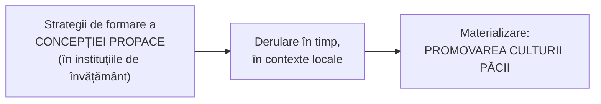

↑ [[Modulul 07 - Noile educații]] · ← [[7.2.3 Educația pentru dezvoltare emoțională]] · → [[7.2.5 Educația pentru schimbare și dezvoltare]]

> [!abstract] Pe scurt
> - **Educația pentru pace și cooperare** cultivă atitudini și aptitudini civice pentru **evitarea conflictelor** și pentru rezolvarea contradicțiilor **prin dialog și participare**, de la microgrup la comunitate. În școală promovează **cultura păcii**.
> - **Factori care o fac necesară**: conflictele mondiale și **amenințarea nucleară**, **poluarea**, **explozia demografică**, încălcarea **drepturilor omului**, **războaiele**, **lipsa hranei și a resurselor**.
> - **Trei tipuri de obiective**: **concepția propace** (concepte-valori), **capacități** (dialog, decizii responsabile, gestionarea schimbării), **atitudini pozitive** (receptivitate, solidaritate, toleranță). E o **acțiune convergentă** a tuturor factorilor educativi.
> - **Toleranța** (7.2.4.1): **pasivă** (prin scăderea sensibilității) sau **activă** (prin strategii de rezolvare). **Intoleranța** duce la **epuizare emoțională**, agresivitate, conflicte.
> - **Toleranța comunicativă** (L. Țurcan, V. Boiko) se vede în comportamentul comunicativ. Toleranța indică nivelul **culturii emoționale**.

---

# PARTEA I — Ce spune manualul

## 1. Definiție (p. 243)

> [!quote] Definiție (p. 243)
> **Educația pentru pace (și cooperare)** înseamnă cultivarea unor **atitudini superioare**: formarea oamenilor pentru **evitarea conflictelor**, **receptivitate și flexibilitate**, **respect pentru valori**. Presupune formarea **aptitudinilor și atitudinilor civice** de a aborda problemele sociale **prin dialog** și prin **participare efectivă** la rezolvarea **contradicțiilor obiective și subiective** din **microgrup** sau din **comunitate** (profesională, economică, politică, culturală, religioasă), la nivel național.

- Presupune **absența violenței**, **dispariția cauzelor conflictelor morale** și **prezența condițiilor** care asigură respectarea **dreptului la viață** al oamenilor de orice etnie.
- În instituțiile de învățământ e o modalitate de **promovare a culturii păcii**. Implică un **lanț de acțiuni** (p. 243–244):

## 2. Necesitate — factori determinanți (p. 244)

1. **conflictele la scară mondială** și **amenințarea nucleară**;
2. **poluarea și distrugerea mediului** (în text, greșit, „popularea”);
3. **explozia demografică**;
4. problemele **drepturilor omului**;
5. **cauzele și consecințele războaielor**;
6. **lipsa alimentelor și a resurselor**.

## 3. Obiective (p. 244)

| Tip | Conținut |
|---|---|
| **Concepția propace** (cognitiv) | un sistem de **concepte-valori**: **pace, drepturile omului, cooperare, participare, toleranță, respect, democrație, umanism** |
| **Capacități** | **exprimare și dialog**; **inițierea și controlul schimbărilor**; **decizii responsabile**; conștientizarea **pericolelor** războiului, violenței și opresiunii pentru persoană și societate |
| **Atitudini pozitive** | **receptivitate** față de celălalt; **responsabilitate** față de sine și comunitate; **solidaritate și încredere**; **respect** pentru propria cultură și pentru a altora; **toleranță** ca acceptare a **diversității**; **generozitate, modestie**, recunoașterea meritelor altora; **strategii de abordare a conflictelor** |

- O cale de realizare a educației pentru **libertate, dreptate, egalitate** este formarea **concepției propace**, prin întrebări de cercetare de tipul: *ce este acest proces în instituțiile de învățământ?* și *cum contribuie la calitatea instruirii?* (p. 244).

## 4. Educația pentru pace ca educație a atitudinilor (p. 245)

- E o **educație a atitudinilor și mentalităților**, a **conduitei** în societate, școală și familie.
- Urmărește: **evitarea conflictelor**, **dialogul constructiv**, **receptivitatea și flexibilitatea**, **respectul** față de valori, aspirații, sine și ceilalți, **găsirea punctelor comune**, **respectarea diversității** situațiilor și stilurilor de viață.
- Aceste obiective sunt **„piatra de încercare”** a formării fiecărei personalități.

> [!tip] De reținut (p. 245)
> Educația pentru pace e o **acțiune convergentă a tuturor factorilor educativi**: **familie, școală, comunitate, instituții de cultură, mass-media**. Scopul este consolidarea unor **atitudini colaborative**, materializate în **acțiuni concrete** (→ [[Modulul 09 - Agenții educației și factorii dezvoltării]]).

## 5. Educația pentru toleranță / toleranță comunicativă (7.2.4.1, p. 245–247)

### 5.1. Necesitate (p. 245)

- Problemele **socioeconomice** amplifică de la o generație la alta **intoleranța și agresivitatea** (**T. Șova, L. Țurcan**).
- Educarea toleranței e **esențială într-un sistem democratic**: toleranța permite **acceptarea** celor care gândesc și acționează altfel.
- E necesară educația cetățenilor pentru **coexistență interpersonală, internațională, multiculturală și interreligioasă**.

### 5.2. Tipuri de toleranță (p. 245–246)

| Tip | Explicație |
|---|---|
| **Toleranța psihosocială** | toleranța înțeleasă ca **răbdare** |
| **Toleranța psihologică pasivă** | rezultă din **scăderea sensibilității** |
| **Toleranța psihologică activă** | se exprimă prin **strategii** pentru situațiile-problemă. Presupune capacitatea de **relaxare** și de **mutare a atenției** la momentul potrivit de la situația care provoacă disconfort la alte activități. **Reduce tensiunile sociale** |

- **Rezistența la stres** crescută e o soluție optimă pentru **sănătatea mintală** (→ [[7.2.3 Educația pentru dezvoltare emoțională]]).
- **Scăderea toleranței la frustrare** mărește riscul de **comportament agresiv** (p. 246).

### 5.3. Valorile toleranței (p. 246)

Pentru **conștiința și conduita tolerantă**, manualul enumeră circa 40 de valori. Principalele, grupate:

| Grup | Valori |
|---|---|
| **Stabilitate interioară** | stabilitate psihologică, **rezistență psihofiziologică și socială la stres**, răbdare înțeleaptă, perseverență, **autoevaluare obiectivă** |
| **Moral-afective** | spiritul dreptății, omenie, bunătate și exigență, **îngăduință**, compasiune, **altruism**, generozitate, **simțul iertării**, ideal moral |
| **Relaționale** | tact, spirit de observație, apropiere de ceilalți, **receptivitate**, **autenticitate** în comunicarea cu elevii, respect, ajutor, deschidere, **cooperare**, sociabilitate, **compromis civilizat**, simțul umorului |
| **Civice** | libertate, **nonviolență**, imparțialitate, responsabilitate, **curaj social**, loialitate, **conștiință și gândire tolerantă** |

### 5.4. Consecințele intoleranței — după L. Țurcan (p. 246)

- **Netoleranța** creează **probleme în carieră**.
- **Intoleranța psihologică** produce **epuizare emoțională** („ardere”) și probleme **somatice, neurologice, psihice**.
- **Intoleranța socială** duce la **deformarea personalității** și se exprimă în **dezacorduri** care provoacă **neînțelegere, nemulțumire, agresiune**.
- **Toleranța** e un **element structural al competenței de rezolvare a conflictelor** și facilitează **comunicarea interpersonală**.

### 5.5. Toleranța comunicativă (p. 246–247)

- **L. Țurcan** promovează conceptul de **„toleranță comunicativă”**. Perspectiva de dezvoltare: **conștientizarea toleranței și intoleranței proprii**, prin **competențe de interacțiune pozitivă** în comunicarea interpersonală.
- Comunicarea influențează puternic **starea de spirit**, **performanța** individului și **rezultatele colective** (p. 247).
- După **V. Boiko** (**В. Бойко**, 1996), toleranța comunicativă apare în **caracteristicile comportamentului comunicativ**. **Nivelul scăzut** se vede prin:

| | Manifestare a toleranței comunicative scăzute (p. 247) |
|---|---|
| a | **refuzul de a înțelege individualitatea** celuilalt |
| b | **supraestimarea de sine**: te consideri **„etalonul corectitudinii”** |
| c | **conduită categorică** |
| d | **conservatorism** în evaluarea altora |
| e | **incapacitatea de a inhiba** stările emoționale distructive |
| f | tendința de a **„reeduca”** interlocutorul |
| g | **refuzul de a ierta** greșelile altuia |
| k | **nerăbdare** la disconfort fizic sau psihic |
| l | **adaptare dificilă** la comportamentul celorlalți |

> [!tip] Concluzie (p. 247)
> **Toleranța** înseamnă **orientarea pozitivă a comportamentului afectiv**. Este un **indicator** al nivelului de **cultură emoțională**, pe dimensiunea **intrapersonală** și pe cea **interpersonală**.

---

# PARTEA II — Completări

## 6. Concepte fundamentale ale educației pentru pace

| Autor | Lucrare | Contribuție |
|---|---|---|
| **Maria Montessori** | conferințe din anii 1930, reunite în *Educazione e pace* / *Education and Peace* (1949) | pacea e **sarcina educației**, iar politica doar poate evita războiul. Educația trebuie să construiască pacea prin **dezvoltarea copilului** |
| **Johan Galtung** | „Violence, Peace, and Peace Research”, *Journal of Peace Research* (1969) | distinge **pacea negativă** (absența violenței directe) de **pacea pozitivă** (absența **violenței structurale**: inegalitate, excluziune, sărăcie). Adaugă ulterior **violența culturală** (1990) |
| **Paulo Freire** | *Pedagogia oprimaților* (1968/1970) | **conscientizarea** și dialogul ca bază a educației emancipatoare, sursă pentru educația critică pentru pace |
| **Betty A. Reardon** | *Comprehensive Peace Education: Educating for Global Responsibility* (1988) | educația pentru pace ca **umbrelă** pentru drepturile omului, dezarmare, dezvoltare, mediu, gen |
| **Morton Deutsch** | *The Resolution of Conflict* (1973) | conflictul **cooperativ** (constructiv) vs **competitiv** (distructiv) — baza programelor școlare de **rezolvare a conflictelor** și **mediere între egali** |

> [!note] Comentariu
> Definiția din manual („**absența violenței** și prezența condițiilor” pentru respectarea drepturilor) corespunde, fără să-l numească, **dublei definiții a lui Galtung**: **pace negativă** + **pace pozitivă**.

## 7. Documente internaționale

| Document | An | Idee-cheie |
|---|---|---|
| **Constituția UNESCO** (preambul) | 1945 | războaiele încep **în mintea oamenilor**, deci tot acolo trebuie construită apărarea păcii |
| **Recomandarea UNESCO** privind educația pentru înțelegere, cooperare și pace internațională | 1974 | primul instrument normativ global. **Actualizată în 2023** (Recomandarea privind educația pentru pace, drepturile omului și dezvoltare durabilă) |
| **Declarația principiilor toleranței** (UNESCO) | **16 noiembrie 1995** | toleranța e **„respectul, acceptarea și aprecierea bogatei diversități”** a culturilor. **Nu** înseamnă concesie, indulgență sau renunțare la propriile convingeri. E o **datorie morală, politică și juridică**. **Educația** e **cel mai eficient mijloc de prevenire a intoleranței**. **16 noiembrie** = **Ziua Internațională a Toleranței** |
| **Declarația și Programul de acțiune privind o cultură a păcii** (ONU, rez. 53/243) | 1999 | cultura păcii = valori, atitudini și comportamente care resping violența și rezolvă conflictele prin **dialog**; **8 domenii de acțiune**, primul fiind **educația** |
| **Deceniul internațional pentru o cultură a păcii și nonviolenței pentru copiii lumii** | 2001–2010 | programul ONU/UNESCO |
| **Agenda 2030, ODD 4.7 și ODD 16** | 2015 | cultura păcii și nonviolenței; **societăți pașnice și incluzive** |

## 8. Toleranța — precizări conceptuale și educația interculturală

- **Distincția pasiv/activ** din manual reflectă o dezbatere filozofică mai veche: **toleranța ca îngăduință** (a suporta ce dezaprobi) vs **toleranța ca recunoaștere** (a respecta diferența). Declarația UNESCO (1995) alege a doua variantă.
- **Paradoxul toleranței** (**K. Popper**, *Societatea deschisă și dușmanii ei*, 1945): toleranța nelimitată față de intoleranți poate duce la **dispariția toleranței**. Toleranța are deci **limite** (discursul instigator la ură, violența).
- **Toleranța la frustrare**: conceptul vine de la **S. Rosenzweig** (anii 1930–1940). **Ipoteza frustrare–agresivitate** aparține lui **J. Dollard et al.** (*Frustration and Aggression*, 1939), la care trimite indirect afirmația de la p. 246.
- **Prejudecățile** (legătură cu motto-ul lui Voltaire din modul): **G. W. Allport**, *The Nature of Prejudice* (1954), **ipoteza contactului**. Contactul dintre grupuri reduce prejudecățile în anumite condiții: **statut egal**, **obiective comune**, **cooperare**, **sprijin instituțional**.
- **Educația interculturală** — dezvoltarea firească a educației pentru toleranță:
  - **Consiliul Europei**, *Carta Albă privind dialogul intercultural* „Living Together as Equals in Dignity” (**2008**);
  - **UNESCO**, *Guidelines on Intercultural Education* (**2006**): trei principii — respectul pentru **identitatea culturală** a celui care învață; cunoștințe și competențe pentru **participarea activă** în societate; **respect, înțelegere și solidaritate** între grupuri;
  - **M. Byram** (1997): modelul **competenței comunicative interculturale** (*savoirs*: atitudini, cunoștințe, abilități de interpretare și relaționare, de descoperire și interacțiune, **conștiință culturală critică**).

> [!note] Comentariu — R. Moldova
> R. Moldova e o societate **multietnică și plurilingvă** (români/moldoveni, ucraineni, ruși, găgăuzi, bulgari, romi etc.). Educația pentru toleranță și interculturalitate are aici o **relevanță directă**. Disciplina **Educație pentru societate** (din 2018, bazată pe RFCDC) include explicit **respectul pentru diversitate** și **rezolvarea conflictelor** printre competențele urmărite (→ [[7.2.1 Educația pentru participare și democrație]]).

## 9. Metode practice (netratate în manual)

- **Medierea între egali** (*peer mediation*) și **justiția restaurativă** în școală;
- **Jocul de rol** și **simularea** negocierilor; **dezbaterea** pe teme controversate, cu reguli;
- **Învățarea prin cooperare**, de ex. **Mozaicul** (*Jigsaw*, **E. Aronson**, 1971), creat pentru reducerea tensiunilor interetnice din școlile desegregate din Austin, Texas;
- **Programe anti-bullying** (de ex. **D. Olweus**, Norvegia, anii 1980–1990);
- Manualul *Compass* al Consiliului Europei (2002) pentru educația pentru drepturile omului.

## 10. Comentariu critic

> [!warning] Probleme
> - **Greșeală de tipar cu schimbare de sens** (p. 244): „**popularea** și distrugerea mediului” — corect **poluarea**.
> - **Citare incompletă** (p. 245): trimiterea „[,,p.8]” e **goală**. În text apare un **„8” izolat** („coexistenței 8”), rest de paginare. Pasajul e atribuit lui **T. Șova, L. Țurcan**, dar în bibliografie sursa [26] e **T. Șova, L. Balțat**, *Toleranța la stres*. Autorii nu corespund.
> - **Enumerare cu litere lipsă** (p. 247): lista lui Boiko sare de la **(g)** la **(k)**. Lipsesc h, i, j, probabil pierdute la preluarea din rusă. Sursa („Бойко, 1996”) **nu apare în bibliografie**.
> - **Lipsă de structură**: educația pentru pace are obiective, dar **nu are conținuturi și metode**, spre deosebire de 7.2.3.
> - **Formulare discutabilă** (p. 243–244): educația pentru pace „presupune **absența violenței**… și **dispariția cauzelor conflictelor morale**”. Aici sunt amestecate **starea de pace** (scopul) și **educația pentru pace** (procesul). În plus, conflictele **nu pot și nici nu trebuie să dispară**. Educația urmărește **gestionarea lor constructivă** (Deutsch).
> - **Lista valorilor toleranței** (p. 246) e **neierarhizată și cu repetiții** („receptivitate” de două ori). Amestecă trăsături de personalitate, virtuți morale și competențe.
> - **Omisiuni majore**: Galtung, Montessori, Declarația UNESCO din 1995, educația **interculturală**, **drepturile omului**, **dezarmarea**, conflictele actuale din vecinătatea R. Moldova.

## 11. Întrebări de autoverificare

1. Definiți educația pentru pace și cooperare. Ce înseamnă „cultura păcii”?
2. Enumerați factorii care fac necesară educația pentru pace.
3. Prezentați cele trei categorii de obiective, cu câte două exemple.
4. De ce este educația pentru pace o „acțiune convergentă” a factorilor educativi?
5. Explicați distincția **pace negativă / pace pozitivă** (Galtung). Ce este violența structurală?
6. Diferențiați toleranța psihologică **pasivă** de cea **activă**.
7. Ce consecințe are intoleranța, după L. Țurcan? Ce înseamnă toleranță comunicativă?
8. Numiți cinci manifestări ale toleranței comunicative scăzute (Boiko). Cum ar putea lucra un profesor cu un elev care are „tendința de a-l reeduca pe interlocutor”?
9. Ce spune Declarația UNESCO din 1995 despre natura toleranței? Ce este paradoxul toleranței?
10. Propuneți o activitate interculturală pentru o clasă multietnică.

## Surse

- Manual, p. 243–247; Șova, T., Balțat, L. (2014). *Toleranța la stres*. Chișinău: UPS „I. Creangă”; Бойко, В. В. (1996), citat indirect.
- Montessori, M. (1949). *Educazione e pace*. Milano: Garzanti (engl. *Education and Peace*, 1972).
- Galtung, J. (1969). Violence, Peace, and Peace Research. *Journal of Peace Research*, 6(3), 167–191.
- Reardon, B. A. (1988). *Comprehensive Peace Education: Educating for Global Responsibility*. New York: Teachers College Press.
- Deutsch, M. (1973). *The Resolution of Conflict*. New Haven: Yale University Press.
- UNESCO (1995). *Declaration of Principles on Tolerance*, 16 noiembrie 1995.
- ONU (1999). *Declaration and Programme of Action on a Culture of Peace*, A/RES/53/243.
- UNESCO (1974). *Recommendation concerning Education for International Understanding, Co-operation and Peace*; UNESCO (2023). [*Recommendation on Education for Peace, Human Rights and Sustainable Development*](https://www.unesco.org/en/legal-affairs/recommendation-education-peace-and-human-rights-international-understanding-cooperation-fundamental).
- Allport, G. W. (1954). *The Nature of Prejudice*. Cambridge, MA: Addison-Wesley.
- Popper, K. R. (1945). *The Open Society and Its Enemies*. London: Routledge.
- Council of Europe (2008). *White Paper on Intercultural Dialogue: „Living Together as Equals in Dignity”*; UNESCO (2006). *Guidelines on Intercultural Education*.
- Byram, M. (1997). *Teaching and Assessing Intercultural Communicative Competence*. Clevedon: Multilingual Matters.
- Aronson, E., Patnoe, S. (1997). *The Jigsaw Classroom*. New York: Longman.
