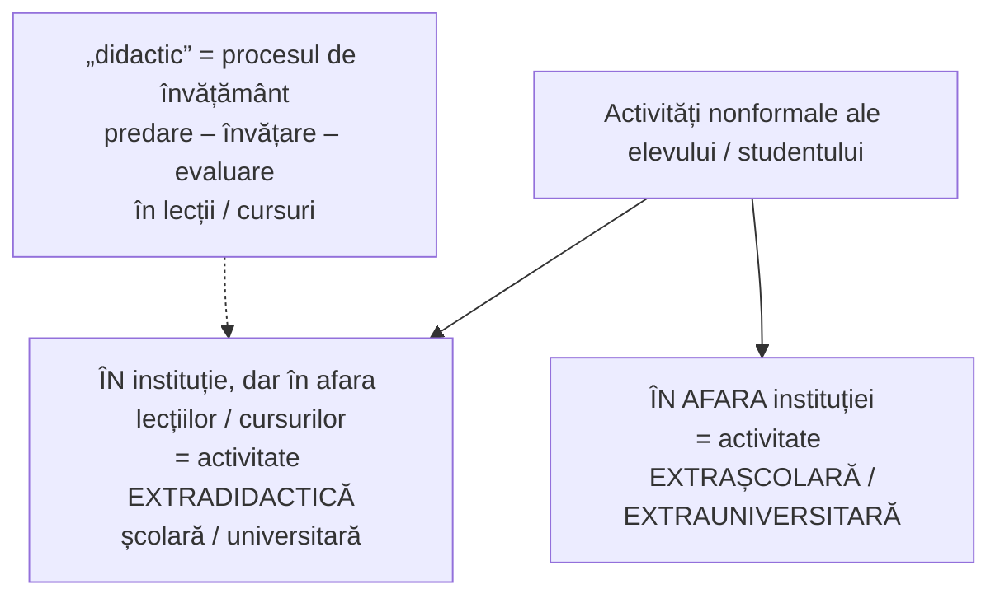

↑ [[Modulul 07 - Noile educații]] · ← [[7.2.5 Educația pentru schimbare și dezvoltare]] · → [[7.2.7 Educația relativă la mediu]]

> [!abstract] Pe scurt
> - **Educația pentru timpul liber** are componente **culturale, artistice, turistice, sociale, sportive**. Timpul liber **tinde să crească** (weekendul, tehnologiile), iar **folosirea lui productivă** depinde de educație.
> - **Riscul principal**: timpul liber să devină **decădere, povară, plictiseală**. **Patru direcții**: gestionarea regimului de viață, **proiectarea** timpului liber, **alternanța** activităților, **corelarea** cu practicile formale.
> - **Distincție**: **educația *pentru* timpul liber** (a învăța să-l folosești) vs **educația *prin* timpul liber** (timpul liber ca mijloc de formare). Activitățile se proiectează ca forme ale **educației permanente**.
> - În școală se realizează prin **activități extracurriculare**, parte a **educației nonformale** (L. Sadovei). Caracteristici: sursă, rol complementar, contextul școală–familie–comunitate, explorarea identității și **capitalul social**.
> - **Terminologie propusă**: **activitate extradidactică** școlară/universitară (în instituție, în afara lecțiilor) vs **activitate extrașcolară/extrauniversitară** (în afara instituției).

---

# PARTEA I — Ce spune manualul

## 1. Conținutul și dinamica timpului liber (p. 251)

- Educația pentru timpul liber include componente **culturale, artistice, turistice, sociale, sportive** etc.
- **Durata timpului liber tinde să crească**:
  - prin cele **două zile libere** de la sfârșitul săptămânii;
  - prin folosirea **tehnicilor electronice** în toate domeniile, mai ales în munca intelectuală, care **reduce timpul** necesar pentru obligațiile școlare, profesionale și casnice.
- Timpul liber depinde de **contextul social, aptitudini, vârstă, mediu de locuire, situația familială, nivelul de pregătire**. Valoarea lui („fructivitatea”) crește **cu cât omul are educație în acest sens**.
- **Planificarea și gestionarea productivă** a timpului liber sunt **necesare**, nu doar oportune.
- **Prima temă**: formarea unei **concepții** despre întrebarea *ce obiective îmi propun pentru timpul liber?* (p. 251).

> [!tip] De reținut (p. 252)
> Din punct de vedere educațional, cel mai important este ca timpul liber **să nu devină un motiv de decădere, o povară sau un prilej de plictiseală**.

## 2. Direcțiile folosirii timpului liber (p. 252)

1. **gestionarea cât mai bună a regimului de viață și de muncă**, pentru a avea **mai mult timp liber**;
2. **proiectarea timpului liber**, cu **activități recreative variate**, cu valențe **informative, formative și de divertisment**, care aduc **satisfacții și bucurii**;
3. asigurarea **alternanței și complementarității** activităților (fizice, spirituale, de plăcere, de întreținere, necesare, obligatorii);
4. **corelarea** activităților din timpul liber cu **practicile formale** (instituționalizate), pentru **valorificarea lor socială**.

## 3. Educația *pentru* și *prin* timpul liber (p. 252)

- Timpul liber este o **valoare** care **nu trebuie risipită**, ci **investită** în dezvoltarea ființei umane.

| Educația **pentru** timpul liber | Educația **prin** timpul liber |
|---|---|
| timpul liber = **scop**. Omul învață să-l **folosească** și să-l **proiecteze** | timpul liber = **mijloc**. Activitățile din timpul liber **formează** personalitatea |

- Activitățile se proiectează ca **forme ale educației permanente**, pentru **toate vârstele** (→ [[3.6 Educația permanentă și autoeducația]]).

## 4. Activitățile extracurriculare (p. 252–253)

- **Organizarea dirijată** a timpului în mediul educațional se face prin **„activități extracurriculare”**: activități din **timpul liber al elevului**, care **nu repetă manualele și programele**. Elevii participă **după aptitudini, interese, dorințe, sex, situație concretă**, ceea ce favorizează **individualizarea**.
- **L. Sadovei**: termen **controversat**. Activitățile extracurriculare sunt tratate ca parte a **educației nonformale**. Conceptul e folosit mai ales **procedural**, de manageri, pentru „activitățile din afara clasei”. Au loc într-un cadru instituționalizat **în afara**, dar și **în interiorul** sistemului de învățământ, prin **„organisme școlare conexe”** (numite **extradidactice** sau **extrașcolare**) (p. 252–253).
- Literatura despre ele vine mai ales din **SUA** și studiază **impactul** asupra elevilor. Caracteristici (după **D. Ionescu, R. Popescu**, p. 253):

| | Caracteristică | Sursa citată |
|---|---|---|
| a) | **după sursă**: organizate de **școli**, în **incinta școlii** | Feldman & Matjasko, 2005 |
| b) | **rol complementar** școlii (sistem puternic formalizat), din nevoia ca școala să ofere experiențe pentru **dezvoltarea de ansamblu** a elevilor | Holland & Andre, 1987 |
| c) | **depind de contextul larg**: fac parte din sistemul **școală – familie – comunitate** | — |
| d) | permit **exprimarea și explorarea identității** și dezvoltă **capitalul social** al tinerilor | — |

- Dezvoltarea personalității depinde de un **sistem de fenomene și relații**. Activitățile extracurriculare sunt un **element fundamental** al rețelei **școală–familie–comunitate**: fac parte din școli și comunități și sunt influențate de **familii și colegi** (p. 253).

## 5. Propunerea terminologică a autoarelor (p. 253–254)

- Fiecare instituție își construiește identitatea pe un **curriculum** în toate formele lui (formal, la decizia școlii, explicit etc.). Autoarele adaptează discursul la **nonformalul din învățământul superior** și introduc termenii **„activitate extracurs”** / **„activitate extradidactică universitară”** și **„activitate extrauniversitară”**. Apoi îi transferă în **sistemul școlar**.

- **Sensul comun**: termenul **„didactic”** desemnează procesul de învățământ, cu cele **trei acțiuni** (predare–învățare–evaluare) realizate în lecții și cursuri. **Extradidactic** = în școală/universitate, dar în afara acestui proces. **Extrașcolar** = în afara instituției (p. 254).

## 6. Oportunitățile oferite de voluntariat studenților (p. 254)

Activitatea de voluntariat oferă:
- petrecerea **organizată și plăcută** a timpului liber, mai ales în **weekend și vacanțe**;
- frecventarea unor **cercuri tematice** după interese și aptitudini → **dezvoltarea personalității**;
- **ocazii multiple de socializare**;
- accent pe **latura practică, aplicativă** → un **traseu de formare individualizat**.

(→ [[7.2.1 Educația pentru participare și democrație]], §6)

---

# PARTEA II — Completări

## 7. Sociologia timpului liber

| Autor | Lucrare | Contribuție |
|---|---|---|
| **Joffre Dumazedier** | *Vers une civilisation du loisir?* (1962) | teoria **„celor 3 D”**: funcțiile timpului liber sunt ***délassement*** (**odihnă**, refacere după oboseală), ***divertissement*** (**distracție**, evadare din plictiseală) și ***développement*** (**dezvoltarea personalității**). Educația pentru timpul liber urmărește mai ales al treilea D |
| **Thorstein Veblen** | *The Theory of the Leisure Class* (1899) | timpul liber ca **semn de statut** („consum ostentativ”) |
| **Josef Pieper** | *Leisure, the Basis of Culture* (1948) | timpul liber (*scholé* grecesc, de unde vine **„școală”**) ca spațiu al **contemplației și culturii**, nu doar pauză de la muncă |
| **Robert A. Stebbins** | *serious leisure* (din 1982) | distincția **timp liber „serios”** (hobby-uri, voluntariat, amatorism, cu efort și dezvoltare) vs **timp liber ocazional** (*casual leisure*) |

> [!note] Comentariu — etimologie utilă
> Grecescul ***scholé*** („răgaz, timp liber”) a dat latinescul ***schola*** și românescul **„școală”**. Pentru greci, timpul liber era **timpul învățării și al reflecției**. Educația *prin* timpul liber reia, într-un sens, această idee.

## 8. Documente de referință

- **Convenția ONU cu privire la drepturile copilului** (1989), **art. 31**: dreptul copilului la **odihnă și timp liber**, la **joacă** și la activități **recreative**, la participare liberă la **viața culturală și artistică**. Comentariul general nr. 17 (2013) al Comitetului ONU pentru drepturile copilului detaliază acest articol.
- **Carta pentru timpul liber** a *World Leisure Organization* (revizuită în **2000**): timpul liber ca **drept uman**. Educația pentru timpul liber e o **responsabilitate comună** a familiei, școlii și comunității.
- **Declarația Universală a Drepturilor Omului** (1948), **art. 24**: dreptul la **odihnă și timp liber**.

## 9. Cercetări despre activitățile extracurriculare

- **J. L. Mahoney, R. W. Larson, J. S. Eccles** (coord.), *Organized Activities as Contexts of Development* (2005): activitățile **structurate** (sport, arte, cluburi) sunt asociate cu **rezultate școlare mai bune**, **mai puține comportamente de risc** și **dezvoltare pozitivă a tinerilor**. Activitățile **nestructurate** (ex. „statul pe afară” fără scop) sunt asociate cu riscuri mai mari.
- **A. F. Feldman & J. L. Matjasko** (2005), *Review of Educational Research*: sinteză a efectelor activităților extrașcolare. E sursa citată de manual, prin intermediar.
- **Timpul liber digital**: tema centrală azi e **timpul petrecut în fața ecranelor** și echilibrul **online–offline**. OMS a publicat în **2019** recomandări privind activitatea fizică, comportamentul sedentar și somnul la copiii sub 5 ani. Alte teme: **dependența de jocuri video** (*gaming disorder*, inclus în **ICD-11**) și **alfabetizarea digitală** (→ [[7.2.2 Educația pentru comunicare și mass-media]]).

## 10. Legături

- Tipologia activităților nonformale (**extraclasă, perișcolare, parașcolare**) și definiția extracurricularului sunt tratate pe larg în [[3.3 Educația nonformală]] (p. 87–88).
- Educația permanentă și autoeducația: [[3.6 Educația permanentă și autoeducația]].
- Planificarea activităților educative (dirigenție, extrașcolar): [[Modulul 10 - Proiectarea, realizarea și evaluarea activității educative]].

## 11. Comentariu critic

> [!warning] Probleme
> - **Repetiție aproape literală**: pasajul despre activitățile extracurriculare (Sadovei; Ionescu & Popescu; Feldman & Matjasko; Holland & Andre; caracteristicile a–d) reia **aproape cuvânt cu cuvânt** textul din modulul III, **p. 87–88** (→ [[3.3 Educația nonformală]]).
> - **Trimitere greșită**: citatul Sadovei e atribuit sursei **[29, p. 132]** (Ursu, educație ecologică). Probabil e altă lucrare a L. Sadovei.
> - **Salt nemarcat**: finalul (p. 254) vorbește despre **voluntariatul studenților**, dar ultima propoziție spune „oferindu-li-se **elevilor**” — urmă de preluare dintr-un alt text. Legătura cu timpul liber nu e explicată.
> - **Afirmație discutabilă** (p. 251): că tehnologiile electronice **reduc** timpul necesar obligațiilor și **măresc** timpul liber. Cercetările (paradoxul **„timpului accelerat”**, H. Rosa, *Accelerare*, 2005) arată și efectul invers: **conectarea permanentă** estompează granița dintre muncă și timp liber.
> - **Lipsesc** obiectivele, conținuturile și metodele specifice. Nu apar clasicii domeniului (**Dumazedier**). Nu se discută **inegalitatea accesului** la activități de timp liber (familii sărace, mediul rural) sau **timpul liber digital**.
> - Scăpări: „fructivitatea”, „cat”, „superiorizarea ființei umane”, „L, Sadovei”.

## 12. Întrebări de autoverificare

1. Ce componente are educația pentru timpul liber? De ce tinde să crească durata timpului liber?
2. Enumerați cele patru direcții ale folosirii timpului liber.
3. Explicați diferența dintre educația **pentru** timpul liber și educația **prin** timpul liber.
4. Care sunt funcțiile timpului liber după J. Dumazedier („cei 3 D”)?
5. Care sunt caracteristicile activităților extracurriculare (după Ionescu & Popescu)?
6. Diferențiați **activitatea extradidactică** de **activitatea extrașcolară**, după terminologia propusă în manual. Dați câte două exemple.
7. Ce prevede art. 31 din Convenția ONU cu privire la drepturile copilului?
8. Elaborați un plan de timp liber echilibrat pentru o săptămână a unui elev de gimnaziu, respectând principiul alternanței.

## Surse

- Manual, p. 251–254 (cf. p. 87–88); Sadovei, L.; Ionescu, D., Popescu, R. (citați în manual).
- Dumazedier, J. (1962). *Vers une civilisation du loisir?* Paris: Seuil.
- Pieper, J. (1948). *Muße und Kult* (engl. *Leisure, the Basis of Culture*, 1952).
- Veblen, T. (1899). *The Theory of the Leisure Class*. New York: Macmillan.
- Stebbins, R. A. (1982). Serious leisure: A conceptual statement. *Pacific Sociological Review*, 25(2), 251–272.
- Feldman, A. F., Matjasko, J. L. (2005). The role of school-based extracurricular activities in adolescent development. *Review of Educational Research*, 75(2), 159–210.
- Mahoney, J. L., Larson, R. W., Eccles, J. S. (coord.) (2005). *Organized Activities as Contexts of Development*. Mahwah: Lawrence Erlbaum.
- ONU (1989). *Convenția cu privire la drepturile copilului*, art. 31; Comitetul ONU pentru drepturile copilului (2013). *Comentariul general nr. 17*.
- World Leisure Organization (2000). *Charter for Leisure*.
- Rosa, H. (2005). *Beschleunigung: Die Veränderung der Zeitstrukturen in der Moderne*. Frankfurt: Suhrkamp.
