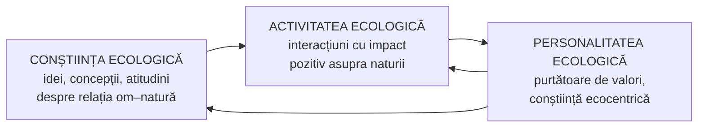

↑ [[Modulul 07 - Noile educații]] · ← [[7.2.6 Educația pentru timpul liber]] · → [[7.2.8 Educația pentru familie]]

> [!abstract] Pe scurt
> - **Educația relativă la mediu / ecologică** dezvoltă **conștiința și responsabilitatea** omului față de **mediu** și capacitatea de a rezolva problemele create de **tehnologiile industriale și postindustriale**.
> - **Obiectivele** vizează **cunoștințe, atitudini, clarificarea valorilor**. Elevul trebuie să înțeleagă că **omul e inseparabil de mediu**, să identifice **responsabilitățile individuale și colective**, să **coopereze** și să aibă instrumente de **analiză, reflecție, acțiune**.
> - Manualul o tratează **nu ca disciplină**, ci ca **modalitate pedagogică** și **mijloc de sporire a eficacității învățământului**. S. Cristea include printre noile educații și **„educația pentru valori”**.
> - Educația ecologică e declarată **obligatorie și permanentă**, dar societatea rămâne **pasivă**. **Treapta primară** are rol fundamental.
> - **L. Ursu, L. Saranciuc-Gordea**: **competența de educație ecologică** a învățătorului, cu categoriile **personalitate ecologică**, **activitate ecologică**, **conștiință ecologică** (după Deriabo & Iasvin).

---

# PARTEA I — Ce spune manualul

## 1. Definiție și scop (p. 254–255)

> [!quote] Definiție (p. 254)
> **Educația relativă la mediu / Educația ecologică** urmărește dezvoltarea **conștiinței** și a **simțului responsabilității** ființei umane față de **mediu și problemele lui** și cultivarea **capacităților de rezolvare a problemelor** apărute prin aplicarea la scară socială a **tehnologiilor industriale și postindustriale**.

- **Scopul**: să-l conducă pe elev, **viitor cetățean**, spre un **punct de vedere mai obiectiv** asupra realității; să-l **incite la participare**; să devină **conștient de viitor**. Viața și calitatea vieții **generațiilor viitoare** depind în mare măsură și de **opțiunile lui** (p. 254–255).

## 2. Obiective (p. 255)

Obiectivele vizează **cunoștințele**, **achiziția de atitudini** și **clarificarea valorilor**. În școală, elevul trebuie ajutat:

1. să înțeleagă că **omul este inseparabil de mediul său** și că efectele negative ale acțiunilor lui **se întorc asupra lui însuși**;
2. să obțină **cunoștințele de bază** pentru rezolvarea problemelor **mediului său imediat**;
3. să identifice **responsabilitățile individuale și colective**, să **colaboreze** și să se angajeze în **cooperare** pentru rezolvarea problemelor;
4. să dezvolte **instrumente de analiză, reflecție și acțiune** pentru a **înțelege, preveni și corecta** daunele aduse mediului.

> [!tip] De reținut — statutul educației ecologice (p. 255)
> Educația relativă la mediu are o **unitate proprie**, bazată pe **convergența finalităților** și pe **coerența demersurilor metodologice**. Manualul o tratează **nu ca pe o disciplină**, ci ca pe o **modalitate pedagogică** de atingere a unor scopuri precise și ca pe un **mijloc de sporire a eficacității învățământului**.

## 3. „Educația pentru valori” (după S. Cristea) (p. 255)

- **S. Cristea** constată că în categoria noilor educații pot fi incluse și tendințele promovate **după 1990** sub genericul **„educația pentru valori”**. Aceasta privește **problematica umană**, domeniul **moral și civic**, **natura** și **mediul cultural și tehnologic**.
- Include:
  - **educația pentru cetățenia democratică** (→ [[7.2.1 Educația pentru participare și democrație]]);
  - **educația pentru munca de calitate**;
  - **educația pentru viața privată** (→ [[7.2.8 Educația pentru familie]]).

## 4. Starea educației ecologice (p. 255–256)

- Deși educația ecologică e declarată **obligatorie și permanentă**, studiile **nu arată o dinamică pozitivă** a stării mediului.
- **Societatea civilă e pasivă**. Mentalitatea și comportamentul cetățenilor sunt dominate de **indiferență față de mediu**, care poate fi depășită **doar prin educație**.
- **Principiul**: cu cât educația ecologică **începe mai devreme** și e mai **complexă, judicioasă și continuă**, cu atât cresc șansele unei generații orientate spre un **mediu sănătos**.
- **Treapta primară** are un **rol fundamental** în educația ecologică permanentă (după monografia *Formarea competenței de educație ecologică în cadrul pregătirii inițiale a cadrelor didactice pentru învățământul primar și preșcolar*, coord. L. Ursu, 2014) (p. 256).

## 5. Competența de educație ecologică — L. Ursu, L. Saranciuc-Gordea (p. 256–258)

- Studiul se află la **intersecția** a două direcții de cercetare: **educația ecologică** și **pregătirea profesională**.
- Contextul sociocultural și ecologic **mărește responsabilitatea învățătorilor**. De aici nevoia unei **noi competențe profesionale**: **competența de educație ecologică a elevilor de vârstă școlară mică** (p. 256).
- Formarea ei la studenți e un proces **integru și complex**, cu o importantă **dimensiune psihologică**. Studentul se caracterizează sub trei aspecte: **psihologic, social, biologic**. Cunoașterea lor ajută la identificarea **potențialului** și a particularităților de vârstă și individuale (p. 256).
- **Vârsta de 18–20 de ani**: se dezvoltă mai ales **sentimentele morale și estetice**, se **definitivează trăsăturile de caracter**, iar studentul poate îndeplini **funcții sociale ale adultului** (civice, profesionale) (p. 256–257).

### Categoriile fundamentale (ecologie psihologică și pedagogie) (p. 257)

| Categorie | Conținut |
|---|---|
| **Personalitatea ecologică** | **purtător de valori ecologice**; are **gândire și cultură ecologică**; conștiință de tip **ecocentric**; percepe **subiectiv** obiectele naturii; tinde spre o interacțiune **nepragmatică** cu natura |
| **Activitatea ecologică** | interacțiunile subiectului cu mediul (**naturale, sociale, juridice, politice, economice, psihologice**) cu **impact pozitiv** asupra naturii. Doar omul are un caracter **creativ-transformator** de influență asupra mediului |
| **Conștiința ecologică** | sistem de **idei, concepții, teorii** despre interacțiunile din sistemul **„om – natură”** și din natură, despre **atitudinea față de natură** și despre **strategiile și tehnologiile** de interacțiune. Ea **determină activitatea ecologică** (după **S. D. Deriabo, V. A. Iasvin**, 1996) |

### Determinanții unei competențe (după același autor) (p. 257–258)

- **a)** **capacitatea de activitate** a persoanei, bazată pe **cunoștințe, experiență, valori, predispoziții** dobândite prin învățare. Presupune un **sistem personal de idei** și un **mod personal de gândire** pentru **rezolvarea promptă a problemelor**;
- **b)** **gradul de angajare**, adică mobilizarea **motivațională**;
- **c)** **independența și poziția** persoanei față de activitate.

## 6. Educația ecologică și criza paradigmei tradiționale (p. 258)

- Pregătirea profesorilor pentru educația ecologică se înscrie în **tendințele mondiale** de **depășire a paradigmei educaționale tradiționale**. Aceasta s-a format în epoca **revoluțiilor industriale și științifice** și **nu mai satisface**, din a doua jumătate a sec. XX, nevoile unei societăți dinamice.
- Orientarea spre însușirea unui **volum de cunoștințe în creștere vertiginoasă** intră în **contradicție** cu posibilitățile și interesele elevilor. Nu asigură **adaptarea socială și profesională**, care e scopul principal al educației ca instituție socială (p. 258) (→ [[Modulul 02 - Clasic, modern și postmodern în educație]]).

---

# PARTEA II — Completări

## 7. Documentele fondatoare ale educației ecologice

| Document | An | Contribuție |
|---|---|---|
| **Conferința ONU privind mediul uman**, Stockholm | **1972** | **Principiul 19**: educația în problemele mediului, pentru tineri și adulți, e esențială. Tot atunci se înființează **UNEP** (Programul ONU pentru Mediu) |
| **Programul Internațional de Educație privind Mediul** (IEEP, UNESCO–UNEP) | 1975–1995 | primul program global în domeniu |
| **Carta de la Belgrad** (Atelierul internațional de educație relativă la mediu) | **octombrie 1975** | **scopul**: o populație **conștientă și preocupată** de mediu, cu **cunoștințe, atitudini, motivație, angajament și competențe** pentru rezolvarea problemelor actuale și prevenirea celor noi |
| **Declarația de la Tbilisi** (prima Conferință intergovernamentală privind educația relativă la mediu, UNESCO–UNEP) | **octombrie 1977** | **5 categorii de obiective**: **conștientizare**, **cunoștințe**, **atitudini**, **competențe**, **participare**. Educația ecologică trebuie să fie **interdisciplinară**, **permanentă**, orientată spre **probleme reale** și **locale**, dar cu **perspectivă globală** |
| **Raportul Brundtland**, *Our Common Future* | 1987 | conceptul de **dezvoltare durabilă** |
| **Summitul Pământului**, Rio de Janeiro — **Agenda 21, cap. 36** | 1992 | **reorientarea educației spre dezvoltare durabilă** |
| **Deceniul ONU al ESD** → **ESD for 2030** | 2005–2014 → 2020–2030 | educația ecologică devine parte a **educației pentru dezvoltare durabilă** |
| **Acordul de la Paris** (art. 12) | 2015 | **educația** privind **schimbările climatice** ca obligație a statelor |

> [!note] Comentariu
> Obiectivele din manual (cunoștințe, atitudini, clarificarea valorilor, responsabilitate, cooperare, acțiune) corespund, fără trimitere, **categoriilor Tbilisi** (1977). Lipsește explicit doar **participarea**, deși scopul o menționează („să-l incite la participare”).

## 8. Modele teoretice

- **Trei dimensiuni** clasice (**A. M. Lucas**, 1972/1979), valabile azi:
  - educație **despre** mediu (cunoștințe);
  - educație **în** mediu (învățare în natură, pe teren);
  - educație **pentru** mediu (valori, acțiune, schimbarea comportamentului).
- **H. R. Hungerford & T. L. Volk** (1990), „Changing learner behavior through environmental education”: **cunoștințele singure nu schimbă comportamentul**. Contează **sensibilitatea față de mediu**, **locul controlului** (*locus of control*) și **simțul responsabilității personale**. Confirmă observația din manual că educația „declarată” nu produce automat schimbări.
- **Ecocentrism vs antropocentrism**: tipologia conștiinței ecologice a lui Deriabo & Iasvin (conștiință **antropocentrică** vs **ecocentrică**) e înrudită cu **ecologia profundă** a lui **Arne Næss** (1973).
- **Pedagogia locului** (*place-based education*, **D. Sobel**, 2004) și **„tulburarea de deficit de natură”** (*nature-deficit disorder*, **R. Louv**, *Last Child in the Woods*, 2005) susțin rolul **treptelor mici** (preșcolar, primar), în acord cu manualul.

## 9. Educația ecologică în R. Moldova și în școală azi

- Aria curriculară „**Matematică și științe**” din R. Moldova (Științe, Biologie, Geografie) include conținuturi ecologice în **demers infuzional** (→ [[7.3 Proiectarea curriculară a noilor educații]]). La ciclul primar, disciplina **Științe** vizează explicit atitudinea responsabilă față de natură.
- **Programe internaționale** frecvente în școli: **Eco-Școala** (*Eco-Schools*, Foundation for Environmental Education, din 1994), **Tinerii reporteri pentru mediu**, **LEAF**.
- **Teme actuale**: **schimbările climatice** și anxietatea climatică („eco-anxietatea”), **economia circulară**, **reciclarea**, **biodiversitatea**, **amprenta ecologică**.

## 10. Comentariu critic

> [!warning] Probleme
> - **Trimiteri greșite**: „**S. Cristea [4]**” — sursa [4] este Cojocaru-Borozan. Cristea este **[7]**. Trimiterea **„[64, pp. 19–20]”** nu există (bibliografia are 32 de poziții): e o **urmă a preluării din monografia** Ursu et al., unde numerotarea era alta.
> - **Sursă rusă necitată corect**: „Дерябо, Ясвин, 1996” (S. D. Deriabo, V. A. Iasvin, *Pedagogie și psihologie ecologică*) apare doar în text, nu și în bibliografie. Atribuirea determinanților competenței („același autor”) e **neclară**.
> - **Repetiție**: propoziția despre cunoașterea aspectelor psihologic–social–biologic apare **de două ori la rând** (p. 256).
> - **Pasaj deplasat**: „educația pentru valori” (Cristea) nu are legătură directă cu educația ecologică. Ar fi fost potrivit în [[7.1 Noile educații - delimitări conceptuale]].
> - **Afirmație neargumentată**: „educația ecologică e declarată **obligatorie și permanentă**” — nu se precizează **de cine** (ce act normativ).
> - **Dezechilibru**: mare parte din subcapitol vorbește despre **formarea învățătorilor** (competență profesională), nu despre **educația ecologică a elevilor**: conținuturi, metode, activități pe teren, proiecte.
> - **Omisiuni**: Stockholm 1972, Belgrad 1975, Tbilisi 1977, Rio 1992, **dezvoltarea durabilă** (menționată doar în trecere), **schimbările climatice**.
> - Scăpări: „indepentente”, „natura înseși”, „achiziția” în loc de „achiziționarea”, afirmația despre vârsta de 18–20 de ani fără sursă primară.

## 11. Întrebări de autoverificare

1. Definiți educația relativă la mediu și precizați scopul ei.
2. Enumerați cele patru obiective ale educației ecologice în perspectivă școlară.
3. De ce tratează manualul educația ecologică „nu ca disciplină, ci ca modalitate pedagogică”? Sunteți de acord?
4. Ce include „educația pentru valori” după S. Cristea?
5. Explicați categoriile **personalitate ecologică**, **activitate ecologică**, **conștiință ecologică**.
6. Care sunt cele cinci categorii de obiective din **Declarația de la Tbilisi** (1977)?
7. Diferențiați educația **despre**, **în** și **pentru** mediu. Dați câte un exemplu de activitate.
8. De ce cunoștințele ecologice nu duc automat la comportamente ecologice (Hungerford & Volk)?
9. Propuneți un proiect de educație ecologică pentru clasa a III-a, integrat la Științe, Limba română și Educație plastică.

## Surse

- Manual, p. 254–258; Ursu, L. (coord.), Saranciuc-Gordea, L. et al. (2014). *Formarea competenței de educație ecologică în cadrul pregătirii inițiale a cadrelor didactice pentru învățământul primar și preșcolar*. Chișinău: UPS „I. Creangă”; Cristea, S. (2010). *Fundamentele pedagogice*; Дерябо, С. Д., Ясвин, В. А. (1996). *Экологическая педагогика и психология*. Ростов-на-Дону: Феникс.
- UNESCO–UNEP (1975). *The Belgrade Charter: A Global Framework for Environmental Education*.
- UNESCO (1978). *Intergovernmental Conference on Environmental Education, Tbilisi, 14–26 October 1977: Final Report*. Paris.
- ONU (1972). *Declaration of the United Nations Conference on the Human Environment*, Stockholm.
- ONU (1992). *Agenda 21*, cap. 36.
- Lucas, A. M. (1979). *Environment and Environmental Education: Conceptual Issues and Curriculum Implications*. Melbourne: Australian International Press.
- Hungerford, H. R., Volk, T. L. (1990). Changing learner behavior through environmental education. *Journal of Environmental Education*, 21(3), 8–21.
- Louv, R. (2005). *Last Child in the Woods*. Chapel Hill: Algonquin Books.
- Sobel, D. (2004). *Place-Based Education: Connecting Classrooms & Communities*. Great Barrington: Orion Society.
- Næss, A. (1973). The shallow and the deep, long-range ecology movement. *Inquiry*, 16, 95–100.
