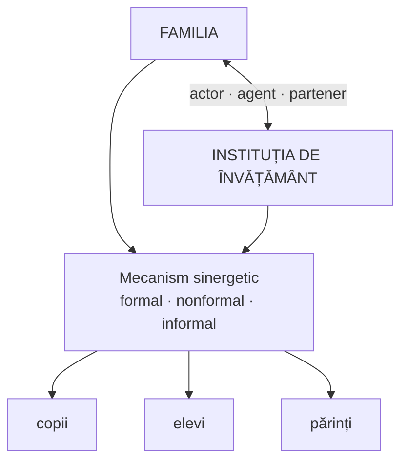

↑ [[Modulul 07 - Noile educații]] · ← [[7.2.7 Educația relativă la mediu]] · → [[7.2.9 Educația pentru parentalitate]]

> [!abstract] Pe scurt
> - **Educația pentru familie** este un **domeniu distinct al pedagogiei familiei**, fundamentat teoretic și metodologic în R. Moldova de **Larisa Cuznețov** (*Tratat de educație pentru familie. Pedagogia familiei*, 2008).
> - **Repere**: din **1984** disciplina **„Etica și psihologia vieții de familie”** în școala medie; conferința **UPS „Ion Creangă”** (2012) *Familia — factor existențial de promovare a valorilor etern-umane*.
> - **Sistemul** propus e **teoretico-aplicativ**: redefinește conceptele (**familie, educație familială, educație pentru familie, ethos pedagogic familial, cultura toleranței**), tratează familia și școala ca **actor, agent și partener educativ** și construiește **curriculum, strategii, modele, principii, metodologie**.
> - **Schema duală a ethosului pedagogic familial**: axa **subiectivă** și axa **obiectivă** a culturii familiale, pentru formarea **„familistului eficient”** (unitatea **conștiință–conduită**).
> - **Valorile** sunt nucleul ethosului familial („**valorizarea valorilor**”, P. Andrei). Normele familiei sunt corelate azi cu **drepturile omului și ale copilului** și cu **Codul familiei** al R. Moldova.

---

# PARTEA I — Ce spune manualul

## 1. Context și repere (p. 258–259)

- **Importanța familiei** în educația tinerei generații și **conținutul, principiile, metodele și mijloacele** educației familiale au fost cercetate de **Larisa Cuznețov**.
- Pregătirea tinerilor pentru viața de familie apare pe agenda unor organisme europene și internaționale (**UNESCO, UNICEF, SOROS** etc.).

| An | Reper (după manual) |
|---|---|
| **1984** | disciplina **„Etica și psihologia vieții de familie”** e inclusă în planurile de învățământ ale **școlii medii de cultură generală** din Republica Moldova |
| „**2004**” | declarat de ONU **An Internațional al Familiei** (în manual; vezi corectura din §8) |
| **2012** | **Conferința Internațională** *Familia — factor existențial de promovare a valorilor etern-umane*, **UPS „Ion Creangă”**, cu două secțiuni: **1. Familia ca model de promovare a valorilor etern-umane**; **2. Cultura promovării valorilor în educația familială** |

- Problema a devenit **prioritară și constantă** pentru sistemul educațional național (p. 258).

## 2. Sistemul educației pentru familie — L. Cuznețov (p. 259)

Elaborarea sistemului, în contextul **problematicii lumii contemporane**, ca **domeniu distinct al pedagogiei familiei**, are un **caracter teoretico-aplicativ** și presupune:

1. analiza abordărilor **filosofice, pedagogice și antropologice** ale educației pentru familie;
2. **redefinirea** conceptelor **familie** și **educație familială** și **definirea** conceptelor **educație pentru familie**, **ethos pedagogic familial**, **cultura toleranței**;
3. analiza educației pentru familie din perspectivă **politică și religioasă**;
4. determinarea **particularităților familiei autohtone**, ale educației familiale și ale **tendințelor de reconfigurare** a modelelor, prin **democratizarea relațiilor familiale**;
5. abordarea **familiei și a instituției de învățământ** în **tripla ipostază** de **actor, agent și partener educativ**. Activitățile **formale–nonformale–informale** au la bază un **mecanism sinergetic** de educație a **copiilor, elevilor și părinților**;
6. **structurarea** sistemului educației pentru familie;
7. elaborarea **curriculumului, strategiilor, modelelor pedagogice, principiilor, metodologiei și tehnologiei** educației pentru familie.

## 3. Schema duală a ethosului pedagogic familial (p. 259–260)

- Pe baza unui **material experimental amplu**, cules din localități **urbane și rurale** ale R. Moldova, L. Cuznețov a elaborat **schema duală a ethosului pedagogic familial**, destinată formării **„familistului eficient”**.
- **Caracterul dual**: două **axe** ale culturii familiale, **subiectivă** și **obiectivă**. Permite:
  - analiza fiecărui element al celor două dimensiuni;
  - înțelegerea **integră și conștientă** a proceselor de **interiorizare și exteriorizare** a cunoștințelor și competențelor de **organizare și armonizare a vieții de familie**;
  - **cunoașterea și dirijarea** formării familistului, adică formarea **conștiinței și conduitei** și a **unității** lor.

> [!tip] De reținut
> **Ethosul pedagogic familial** = ansamblul de **valori, norme, atitudini și practici** educative ale unei familii (formulare de sinteză). **„Familistul eficient”** = persoana pregătită să **organizeze și să armonizeze** viața de familie, la care **conștiința** (axa subiectivă) și **conduita** (axa obiectivă) formează o **unitate**.

## 4. Încrederea în sine și autocunoașterea (p. 260)

- Din punct de vedere psihopedagogic, e importantă **credința în forțele proprii**, care dă **încredere în sine și în propriile capacități**.
- De aici sarcina de a orienta **educația copilului** și **autoeducația adultului** spre:
  - **cunoașterea de sine**;
  - cunoașterea **particularităților de gen**;
  - cunoașterea regulilor de **conviețuire în familie**;
  - **cunoașterea lui Dumnezeu** (în formularea manualului).

## 5. Valorile — nucleul ethosului familial (p. 260)

- **Valorile** sunt un element foarte important al ethosului pedagogic familial: **condiționează și dinamizează** acțiunile omului.
- **Sensul curent** al valorii: o **calitate** a lucrurilor, persoanelor sau conduitelor care, prin **conformitatea cu o normă** sau **apropierea de un ideal**, le face **demne de stimă**.
- **L. Cuznețov** subliniază **relația valoare–educație**. **„Valorizarea valorilor”** (**Petre Andrei**) este un **reper fundamental** al **umanizării copilului** și al dezvoltării **potențialului creativ, psihologic și social**.

## 6. Normele familiei (p. 260)

Pentru ethosul pedagogic familial e important ca familia:
- să **cunoască și să respecte normele moral-etice**, corelate azi în primul rând cu **drepturile omului și ale copilului**;
- să țină cont de normele din **Codul familiei al Republicii Moldova**;
- să respecte normele și principiile bazate pe **dragoste și respect reciproc**, stabilite în **familia concretă**.

## 7. Strategia programului de educație pentru familie (p. 261)

- **Strategia de formare a competențelor** și de **schimbare a comportamentelor** **cadrelor didactice și părinților** din program presupune:
  - nu doar **constatarea faptelor** explicabile cauzal, ci și **înțelegerea mecanismelor lor interne**, raportate la **finalitățile proiectate**;
  - îmbinarea **abordării filosofice** cu **perspectiva vieții cotidiene**.

---

# PARTEA II — Completări

## 8. Corecturi și precizări factuale

> [!warning] Anul Internațional al Familiei
> Manualul afirmă că **anul 2004** a fost declarat de ONU An Internațional al Familiei. **Corect: 1994** (rezoluția Adunării Generale ONU **44/82** din 1989), cu tema *„Familia: resurse și responsabilități într-o lume în schimbare”*. **2004** a fost **aniversarea a 10 ani** a Anului Internațional al Familiei. **Ziua Internațională a Familiei** se sărbătorește la **15 mai** (instituită în 1993).

- **„Etica și psihologia vieții de familie”** (**1984**) a fost o disciplină introdusă **în toată URSS** (rus. *Этика и психология семейной жизни*), deci și în RSS Moldovenească, în clasele superioare. În 1984 nu exista încă „Republica Moldova” ca stat independent; formularea manualului e **anacronică**.
- **Codul familiei al R. Moldova**: **Legea nr. 1316 din 26.10.2000**. Principii: **egalitatea în drepturi a soților**, **prioritatea educației copiilor în familie**, **ocrotirea drepturilor și intereselor copiilor**.

## 9. Teorii despre familie ca mediu educativ

| Autor | Lucrare | Contribuție |
|---|---|---|
| **Urie Bronfenbrenner** | *The Ecology of Human Development* (1979) | **modelul ecologic**: copilul se dezvoltă în sisteme concentrice: **microsistem** (familia, școala), **mezosistem** (relațiile dintre ele, de ex. **școală–familie**), **exosistem** (de ex. locul de muncă al părinților), **macrosistem** (cultura, valorile), **cronosistem** (timpul). Fundamentează teoretic „mecanismul sinergetic” familie–școală |
| **Anne T. Henderson & Nancy Berla** | *A New Generation of Evidence* (1994) | implicarea familiei e asociată cu **rezultate școlare mai bune**, indiferent de statutul socioeconomic |
| **Nel Noddings** | *Starting at Home: Caring and Social Policy* (2002) | **etica grijii** (*care*) are ca model primar relația familială |
| **Talcott Parsons & R. F. Bales** | *Family, Socialization and Interaction Process* (1955) | funcțiile familiei nucleare moderne: **socializarea primară** a copiilor și **stabilizarea personalității** adulților |
| **Evelyn M. Duvall** | *Family Development* (1957) | **ciclul de viață al familiei** (8 etape), cu **sarcini de dezvoltare** specifice fiecărei etape |

- **Educația pentru viața de familie** (*Family Life Education*) — în tradiția americană (**National Council on Family Relations**) cuprinde: relații interpersonale, sexualitate umană, managementul resurselor familiei, **educația parentală**, etică, politici familiale, dezvoltarea pe parcursul vieții.

## 10. Parteneriatul școală–familie–comunitate

- **Joan Epstein** (Johns Hopkins University), teoria **„sferelor de influență suprapuse”** (*overlapping spheres of influence*). Articolul „School/Family/Community Partnerships: Caring for the Children We Share” (*Phi Delta Kappan*, **1995**) propune **șase tipuri de implicare**:
  1. **parenting** (sprijinirea familiilor în rolul parental);
  2. **comunicare** școală ↔ familie;
  3. **voluntariat** al părinților;
  4. **învățare acasă**;
  5. **luarea deciziilor** (părinții în organisme de conducere);
  6. **colaborarea cu comunitatea**.
- **În R. Moldova**, **Codul Educației** (2014) consacră **părinții** ca **parteneri educaționali** (drepturi și obligații ale părinților, reprezentarea lor în **consiliile de administrație** și **asociații**) (→ [[Modulul 09 - Agenții educației și factorii dezvoltării]], [[Modulul 08 - Sistemul de educație și managementul educației]]).

> [!note] Comentariu
> Ideea lui L. Cuznețov de a trata familia și școala ca **„actor, agent și partener educativ”** e apropiată de modelul lui **Epstein**. Diferența: Epstein pune accent pe **tipuri concrete de colaborare**, măsurabile, iar Cuznețov pe **ethosul și valorile** familiei.

## 11. Comentariu critic

> [!warning] Probleme
> - **Eroare factuală**: **Anul Internațional al Familiei = 1994**, nu 2004 (vezi §8).
> - **Anacronism**: „din 1984… în Republica Moldova” — atunci era RSS Moldovenească, iar disciplina era unională.
> - **Lipsa unei definiții**: subcapitolul **nu definește** „educația pentru familie” (spre deosebire de alte educații), deși anunță că L. Cuznețov a definit-o. Nu sunt date **obiectivele**, **conținuturile** sau **metodele**, doar etapele unei cercetări.
> - **Conținut confesional** într-un manual al unei universități de stat: „**cunoașterea lui Dumnezeu**” printre sarcinile educației familiale (p. 260). Principiul **laicității** învățământului public (Codul Educației) cere o formulare **neutră** (de ex. dimensiunea spirituală și religioasă a familiei, după opțiunea ei).
> - **„SOROS”** apare alături de UNESCO și UNICEF ca „organism de talie internațională”. Denumirea corectă: **Fundația Soros** (*Open Society Foundations*), o fundație privată.
> - **Trimitere lipsă**: „Codul familiei al Republicii Moldova **[41]**” — bibliografia modulului are doar 32 de poziții.
> - **Jargon neexplicat**: „ethos pedagogic familial”, „familist eficient”, „schema duală” nu sunt definite clar. Studentul nu află **ce conțin** cele două axe.
> - **Omisiuni**: **diversitatea formelor familiale** (monoparentale, reconstituite, **familii cu părinți plecați la muncă în străinătate** — problemă majoră în R. Moldova), **violența domestică**, **egalitatea de gen în familie**.
> - Scăpări: „proximitatea unuiideal”, „importanță relației”.

## 12. Întrebări de autoverificare

1. Ce este educația pentru familie și cine a fundamentat-o ca domeniu distinct în R. Moldova?
2. Enumerați cinci direcții ale sistemului educației pentru familie propus de L. Cuznețov.
3. Ce înseamnă că familia și școala au o „triplă ipostază” (actor, agent, partener)?
4. Explicați schema duală a ethosului pedagogic familial și noțiunea de „familist eficient”.
5. De ce sunt valorile nucleul ethosului familial? Ce înseamnă „valorizarea valorilor” (P. Andrei)?
6. Corectați eroarea din manual privind Anul Internațional al Familiei.
7. Explicați modelul ecologic al lui Bronfenbrenner, cu exemple din viața unui elev.
8. Care sunt cele șase tipuri de implicare a familiei după J. Epstein? Propuneți câte o activitate pentru fiecare.
9. Cum ar trebui adaptată educația pentru familie la situația copiilor cu părinți plecați peste hotare?

## Surse

- Manual, p. 258–261; Cuznețov, L. (2008). *Tratat de educație pentru familie. Pedagogia familiei*. Chișinău: CEP UPS „I. Creangă”; Cuznețov, L. (coord.) (2012). *Familia — factor existențial de promovare a valorilor etern-umane*. Materialele conferinței internaționale. Chișinău: UPS „I. Creangă”; Andrei, P. (1945). *Filosofia valorii*.
- Codul familiei al Republicii Moldova nr. 1316 din 26.10.2000.
- Codul Educației al Republicii Moldova nr. 152/2014.
- ONU, Adunarea Generală, rezoluția 44/82 (1989) — *International Year of the Family* (1994); rezoluția 47/237 (1993) — *International Day of Families* (15 mai).
- Bronfenbrenner, U. (1979). *The Ecology of Human Development*. Cambridge, MA: Harvard University Press.
- Epstein, J. (1995). School/family/community partnerships: Caring for the children we share. *Phi Delta Kappan*, 76(9), 701–712.
- Henderson, A. T., Berla, N. (1994). *A New Generation of Evidence: The Family Is Critical to Student Achievement*. Washington, DC.
- Parsons, T., Bales, R. F. (1955). *Family, Socialization and Interaction Process*. Glencoe: Free Press.
- Duvall, E. M. (1957). *Family Development*. Philadelphia: Lippincott.
