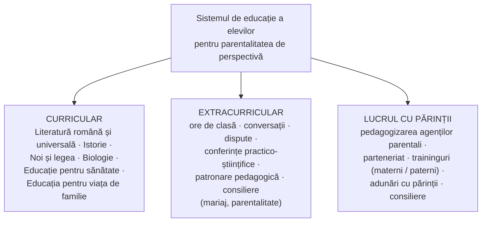

↑ [[Modulul 07 - Noile educații]] · ← [[7.2.8 Educația pentru familie]] · → [[7.3 Proiectarea curriculară a noilor educații]]

> [!abstract] Pe scurt
> - **Educația pentru parentalitatea de perspectivă** e un **domeniu nou** al educației integrale, realizat în instituțiile educaționale (după N. Ovcerenco). Formează la tineri **atitudinea responsabilă față de parentalitate**, **motivația** de a deveni părinte și **calitățile** necesare unui rol parental eficient.
> - **Argumentul**: **criza familiei contemporane**. Predomină familiile cu **un singur copil**, crește **orientarea spre nonparentalitate**, iar copilul nu mai e „valoare supremă” a căsătoriei.
> - **Șapte obiective**: parentalitate **planificată și responsabilă**; importanța parentalității; **motivație intrinsecă**; **trăsături de caracter**; **abilități** parentale; **profilaxia rigidității parentale**; sensibilizare față de **deficitul de dragoste parentală**.
> - **Realizare**: prin discipline școlare (**Literatură, Istorie, Noi și legea, Biologie, Educație pentru sănătate, Educația pentru viața de familie**) și prin **activități extracurriculare** (ore de dirigenție, dispute, **studiu de caz, discuția Panel, joc de rol, brainstorming, traininguri**, patronarea creșelor).
> - **Condiții**: **dirigintele competent**, cunoașterea elevilor, **parteneriat**, **climat afectiv sanogen**, valorificarea **experienței elevilor**.

---

# PARTEA I — Ce spune manualul

## 1. Definiție și finalități (p. 261)

> [!quote] Definiție (p. 261)
> **Educația pentru parentalitatea de perspectivă** este concepută ca **domeniu nou de educație**. Urmărește formarea capacității de **valorificare culturală a informației despre parentalitate**, furnizată de mulți **factori sociali** (inclusiv presă, radio, televiziune), în condiții de **diversificare și individualizare**. Aceste condiții le cer specialiștilor din educație **luare de atitudine** și **evaluare responsabilă** la scara valorilor sociale.

- Este o **dimensiune importantă a educației integrale**, realizată în **instituțiile educaționale**. Urmărește la tânăra generație:
  1. **atitudinea responsabilă** față de fenomenul parentalității;
  2. **motivația** de a se realiza în viitor ca **părinte**;
  3. dezvoltarea **calităților** necesare pentru **eficiența rolului parental** (p. 261).
- **Conceptualizarea parentalității** trebuie făcută **cu mult timp înainte** ca aceasta să devină realitate, prin educarea **viitoarelor mame și viitorilor tați**.
- Pentru ca elevul să devină un **părinte eficient**, e necesară **pregătirea pentru parentalitatea de perspectivă**. Ea se raportează la **mediul familial natural**, la **psihologia elevului**, la **nivelul lui de cunoaștere** și la **cerințele societății** (după N. Ovcerenco et al., *Pedagogie*, 2007) (p. 261).

## 2. Argumentul: criza familiei contemporane (p. 261–262)

- **Criza familiei** cere **restabilirea prestigiului parentalității** în societate.
- Manualul consideră parentalitatea **„cea mai sacră manifestare a naturii umane”** și constată că ea e **„în dizgrație”**. De aici nevoia de a-i ajuta pe tineri să-i **conștientizeze valoarea**.
- **Constatări** (p. 262):
  - predomină familia **cu un singur copil**;
  - crește numărul tinerilor orientați spre **nonparentalitate**, sub influența unor idei **consumiste și egocentriste**;
  - **copilul nu mai e valoarea supremă a căsătoriei**, mai ales în familiile cu **„capitaluri negative”** (lipsuri **materiale și spirituale**).

## 3. Obiective (p. 262)

1. orientarea elevilor spre **parentalitatea planificată și responsabilă**;
2. înțelegerea **importanței parentalității pentru destinul uman**;
3. formarea **motivației intrinseci** și a **interesului constant** pentru parentalitatea eficientă;
4. dezvoltarea **trăsăturilor de caracter** necesare: **toleranță, afecțiune, altruism, compasiune, sârguință, rezistență la stres, optimism, dorință de autoperfecționare, dorința de a îngriji și de a consola**;
5. formarea **abilităților** necesare parentalității;
6. **profilaxia rigidității parentale**;
7. **sensibilizarea** elevilor față de efectele **deficitului de dragoste parentală**.

> [!tip] De reținut — când e formată atitudinea responsabilă (p. 262)
> Formarea pentru parentalitate e văzută ca **premisă a unui destin fericit**. Atitudinea se manifestă în sfera **intelectuală, emoțională și volitivă** a viitorului părinte, ca **proces psihic unitar**. **Atitudinea responsabilă e formată** atunci când fenomenul parentalității este **interiorizat** și a devenit **necesitate organică**, **convingere morală constantă** și **comportament firesc**.

## 4. Valorificarea procesului didactic (p. 263–264)

- **Posibilitățile educative** ale procesului didactic sunt **„enorme”**. **Orele de curs** sunt o **componentă esențială** (p. 263).
- **Cerințe** pentru valorificarea disciplinelor școlare:
  - să fie **identificate capitolele și temele** potrivite;
  - să fie evidențiate **problemele etico-morale**, prin exersarea **evaluării și autoevaluării** fenomenului parentalității;
  - formarea **atitudinii responsabile** față de obligațiile de **membru al familiei**;
  - selectarea unui **material factologic concret** despre **normele comportamentale parentale**, **drepturile și obligațiile parentale**, **criteriile de apreciere și autoapreciere** a conduitei;
  - stabilirea celor mai bune modalități de **corelare interdisciplinară** în activitatea **curriculară și extrașcolară** (p. 263).

### Conținutul special elaborat (p. 263–264)

| Direcție | Conținut |
|---|---|
| **Cognitivă** | familiarizarea viitoarelor mame și viitorilor tați cu **cunoștințe și reprezentări** despre parentalitate, **drepturi și obligații parentale**, **valoarea socială și personală** a parentalității |
| **Morală** | formarea **calităților morale** pentru îndeplinirea **datoriei parentale** |
| **Competențe** | dezvoltarea **competențelor** pentru realizarea cu succes a **rolului parental** |
| **Practică** | antrenarea elevilor în **activități și obligații sociale și familiale**, pentru o atitudine **conștiincioasă** față de angajamentele de membru al **colectivului de clasă** și al **familiei de origine** |

## 5. Elementele structurale ale sistemului (p. 264)

- Fiecare componentă are **obiective, conținut și specific** propriu. **Folosirea lor complexă** favorizează la maximum procesul.
- **Aspectele de bază** ale activității (p. 264):
  1. organizarea **cunoașterii fenomenului parentalității** la ore și în afara orelor;
  2. activitatea **în familie** (**casnic-menajeră** și **îngrijirea fraților/surorilor mai mici**) și activitatea **socială**;
  3. **colaborarea cu părinții** și **pedagogizarea** lor.
- **Activitatea extrașcolară** e **indispensabilă**: doar în limitele activității curriculare nu se poate forma la **fiecare elev** o atitudine responsabilă față de parentalitate (p. 264).

## 6. Forme și metode extracurriculare (p. 265)

| Categorie | Forme / metode |
|---|---|
| **Dialogice** | **conversațiile**; **discuția Panel**; **disputele** |
| **Analitice** | **metoda studiului de caz**; **metoda situațiilor de impas** |
| **De creativitate** | **brainstormingul** (oral, scris, cu schițe); **asociațiile libere**; **ședințele de creație**; **metoda proiectelor** |
| **Experiențiale** | **jocul de rol**; **ore de dirigenție aplicative, cu ieșiri pe teren**; **traininguri** despre parentalitate; **patronarea creșelor**, pentru formarea abilităților de îngrijire a copiilor mici |

### Teme de dispută propuse (p. 265)

Manualul propune dispute pornind de la **biografii celebre**:
- **Socrate** și căsătoria cu **Xantipa**;
- **J.-J. Rousseau**, teoreticianul **educației libere**, care și-a dat copiii (avuți cu **Thérèse Levasseur**) la **orfelinat**;
- **G. Călinescu** și ideea că **geniul pune creația înaintea procreației**;
- de ce **celebritatea** e asociată adesea cu **abandonul fericirii casnice**;
- contrastul dintre **L. N. Tolstoi, N. Iorga** (mulți copii, dar neîmpliniți în familie) și **Darwin, Strauss** (fericire familială și generații de creatori).

## 7. Condiții de eficiență (p. 265–266)

1. **dirigintele** să aibă **competențe teoretice și practice** suficiente pentru educarea viitorilor părinți;
2. să cunoască **particularitățile de vârstă, psihofiziologice și individuale** ale elevilor și **nivelul lor real de pregătire** pentru parentalitate;
3. să realizeze un **parteneriat eficient** cu toți **agenții școlari**;
4. să stimuleze un **climat psihologic afectiv-sanogen**, cu **stimă și respect reciproc** (profesor–elev, elev–elevă);
5. să valorifice **experiența proprie a elevilor**, îmbogățită prin **confruntarea** cu multiple experiențe parentale din **viața cotidiană și din mass-media** (p. 266).

## 8. Teme de reflecție ale modulului legate de parentalitate (p. 269)

- Cât de justificate sunt **stereotipuri** ca: **„atotputernicia” mamei** în educația fiicei; **destinul greu** al copiilor abandonați sau crescuți de mame rigide; **lipsa de responsabilitate** a mamelor care își aleg o **altă carieră** decât cea maternă?
- Comentarea remarcii atribuite lui **Thales din Milet** despre căsătorie: regreți dacă nu te căsătorești, dar ai motive de regret și dacă te căsătorești.

---

# PARTEA II — Completări

## 9. Stilurile parentale

| Autor | Contribuție |
|---|---|
| **Diana Baumrind** (1966, 1967, 1971) | trei stiluri, după **controlul/exigența** și **căldura/receptivitatea** părinților: **autoritar** (exigent, puțin afectuos), **permisiv** (afectuos, puțin exigent), **autoritativ** (exigent **și** afectuos, explică regulile) |
| **E. E. Maccoby & J. A. Martin** (1983) | modelul bidimensional (**exigență × receptivitate**) adaugă al patrulea stil: **neglijent / neimplicat** |

| | **Receptivitate ridicată** | **Receptivitate scăzută** |
|---|---|---|
| **Exigență ridicată** | **autoritativ** — cele mai bune rezultate (autonomie, competență socială, reușită școlară) | **autoritar** — conformism, anxietate, stimă de sine scăzută |
| **Exigență scăzută** | **permisiv** — impulsivitate, autocontrol slab | **neglijent** — cele mai multe riscuri |

> [!note] Comentariu
> Obiectivul manualului **„profilaxia rigidității parentale”** corespunde, în termenii lui Baumrind, **prevenirii stilului autoritar**. Obiectivul privind **„deficitul de dragoste parentală”** corespunde riscurilor stilurilor **neglijent** și **autoritar** (receptivitate scăzută).

## 10. Atașamentul și modelul ecologic

- **John Bowlby**, *Attachment and Loss*, vol. I: *Attachment* (1969): nevoia copilului de o **relație de atașament** stabilă, sursă a **„bazei de siguranță”**. **Mary Ainsworth** (*Situația străină*, 1978): atașament **securizant**, **anxios-evitant**, **anxios-ambivalent**; M. Main adaugă ulterior tipul **dezorganizat**.
- **Urie Bronfenbrenner** (1979): parentalitatea depinde de **exosistem** (munca părinților, serviciile sociale) și **macrosistem** (valori culturale, politici), nu doar de calitățile individuale ale părintelui.
- **Donald Winnicott**: conceptul de **„mamă suficient de bună”** (*good enough mother*, 1953). E un antidot util la **perfecționismul parental** și la idealizarea maternității.

## 11. Parentalitatea pozitivă — cadrul european și R. Moldova

- **Consiliul Europei, Recomandarea Rec(2006)19** privind politicile de **sprijin al parentalității pozitive**. **Parentalitatea pozitivă** = comportament parental bazat pe **interesul superior al copilului**, care îl **îngrijește**, îl **responsabilizează**, e **nonviolent** și oferă **recunoaștere și îndrumare**, cu **stabilirea unor limite** pentru dezvoltarea deplină a copilului.
- **Convenția ONU cu privire la drepturile copilului** (1989): **art. 18** — ambii părinți au **responsabilități comune**; statul îi **sprijină**; **art. 19** — protecția împotriva **oricărei forme de violență**.
- **Programe validate** de educație parentală: **Triple P — Positive Parenting Program** (M. Sanders, Australia); **The Incredible Years** (C. Webster-Stratton, SUA).
- **R. Moldova**: **Codul familiei** (nr. 1316/2000) stabilește **drepturile și obligațiile părintești** (egalitatea părinților; educația copilului **fără tratamente abuzive**). **Legea nr. 140/2013** privind **protecția specială a copiilor aflați în situație de risc și a copiilor separați de părinți** reglementează intervenția statului. Un fenomen specific este **migrația de muncă**: mulți copii sunt crescuți **fără unul sau ambii părinți**.

## 12. Comentariu critic

> [!warning] Probleme
> - **Definiție copiată**: definiția (p. 261) reproduce **aproape exact formula educației pentru mass-media** (p. 229–230): „valorificare culturală a informației… furnizată de presă, radio, televiziune… în condiții de diversificare și de individualizare… evaluare responsabilă la scara valorilor sociale”. S-a înlocuit doar obiectul („parentalitate”). Definiția **nu surprinde specificul** domeniului.
> - **Confuzie terminologică**: textul folosește alternativ **„parentalitate”** și **„paternitate”** („educația elevilor pentru **paternitatea** de perspectivă”, p. 264). Paternitatea = calitatea de **tată**. Mai mult, activitatea „**elevelor**” e orientată „spre formarea pentru **paternitate**” — o **contradicție**.
> - **Ton moralizator și judecăți de valoare**: parentalitatea ca „cea mai sacră manifestare”, **nonparentalitatea** pusă pe seama unor idei „**consumiste, egocentriste**”, familiile cu „**capitaluri negative**”. Alegerea de a nu avea copii e o **decizie legitimă**. Pedagogia trebuie să formeze **responsabilitate**, nu să **stigmatizeze** alegeri personale sau familii sărace.
> - **Stereotipuri de gen**: accentul pe **activitatea casnic-menajeră a elevelor** și pe mamă ca principal agent (vezi și tema de reflecție despre mamele care își aleg „alt tip de carieră”). Nu se discută **implicarea taților** și **egalitatea de gen** în îngrijire.
> - **Teme de dispută problematice**: anecdotele despre Socrate/Xantipa, Călinescu („celebru misogin”) și Rousseau sunt **speculative și biografice**, greu de verificat, cu risc de **clișee** („Xantipa răutăcioasă”). Afirmația despre Tolstoi, Iorga, Darwin și „Strauss” (neprecizat care Strauss) **nu are sursă**.
> - **Lipsesc fundamentele științifice**: **stiluri parentale** (Baumrind), **atașament** (Bowlby), **parentalitate pozitivă** (Rec(2006)19), **drepturile copilului**, **prevenirea violenței** asupra copilului.
> - **Discipline datate**: „**Noi și legea**”, „**Educație pentru sănătate**”, „**Educația pentru viața de familie**” erau cursuri **opționale** în R. Moldova. Azi temele sunt preluate în mare parte de **Dezvoltare personală** (clasele I–XII, din 2018) și **Educație pentru societate**.
> - Scăpări: „obținera”, „de a obținerii”, „Teresse Levasseur” (corect **Thérèse**), „vis-a-vis”, „subiectele :”.

## 13. Întrebări de autoverificare

1. Definiți educația pentru parentalitatea de perspectivă. Ce trei finalități urmărește?
2. Ce argumente aduce manualul pentru necesitatea acestei educații? Analizați-le critic.
3. Enumerați cele șapte obiective ale educației pentru parentalitate.
4. Când se consideră formată atitudinea responsabilă față de parentalitate?
5. Prin ce discipline și activități extracurriculare se poate realiza? Dați exemple concrete de teme.
6. Numiți cinci metode extracurriculare și descrieți una aplicată la tema parentalității.
7. Care sunt condițiile de eficiență pentru diriginte?
8. Prezentați stilurile parentale după Baumrind și Maccoby & Martin. Ce legătură au cu „rigiditatea parentală”?
9. Ce înseamnă **parentalitatea pozitivă** (Consiliul Europei, 2006)?
10. Reformulați definiția din manual astfel încât să surprindă specificul educației pentru parentalitate.

## Surse

- Manual, p. 261–266, 269; Ovcerenco, N. et al. (2007). *Pedagogie*. Chișinău: Reclama.
- Baumrind, D. (1966). Effects of authoritative parental control on child behavior. *Child Development*, 37(4), 887–907; Baumrind, D. (1971). Current patterns of parental authority. *Developmental Psychology Monographs*, 4(1, Pt. 2).
- Maccoby, E. E., Martin, J. A. (1983). Socialization in the context of the family: Parent–child interaction. În P. H. Mussen (ed.), *Handbook of Child Psychology*, vol. 4. New York: Wiley.
- Bowlby, J. (1969). *Attachment and Loss*, vol. 1: *Attachment*. London: Hogarth Press.
- Ainsworth, M. D. S., Blehar, M. C., Waters, E., Wall, S. (1978). *Patterns of Attachment*. Hillsdale: Erlbaum.
- Bronfenbrenner, U. (1979). *The Ecology of Human Development*. Harvard University Press.
- Winnicott, D. W. (1953). Transitional objects and transitional phenomena. *International Journal of Psycho-Analysis*, 34, 89–97.
- Council of Europe (2006). *Recommendation Rec(2006)19 of the Committee of Ministers to member states on policy to support positive parenting*.
- ONU (1989). *Convenția cu privire la drepturile copilului*, art. 18, 19.
- Codul familiei al Republicii Moldova nr. 1316/2000; Legea nr. 140/2013 privind protecția specială a copiilor aflați în situație de risc și a copiilor separați de părinți.
