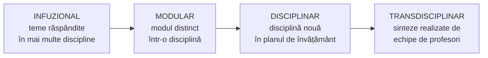

↑ [[Modulul 07 - Noile educații]] · ← [[7.2.9 Educația pentru parentalitate]] · → [[8.1 Sistemul de educație și sistemul de învățământ]]

> [!abstract] Pe scurt
> - Noile educații pot fi integrate în programele școlare prin **patru demersuri**: **infuzional** (teme răspândite în mai multe discipline), **modular** (modul distinct într-o disciplină), **disciplinar** (disciplină nouă în planul de învățământ), **transdisciplinar** („sinteze științifice” realizate de **echipe de profesori**).
> - **Metodologia** valorificării lor privește **toate dimensiunile** (morală, intelectuală, tehnologică, estetică, psihofizică) și **toate formele** educației (formală, nonformală, informală).
> - **Trei strategii de implementare**: intrarea în programe ca **recomandări sau module**, inclusiv prin **mass-media**; programe **alternative** (module formal–nonformale, ghiduri, lucrări fundamentale); **regândirea selecției și organizării informației** în curriculum (module/discipline distincte **sau** abordare infuzională).
> - Tinerii trebuie educați nu doar pentru a se **adapta la nou**, ci pentru a **construi viitorul**. Învățământul devine **formare a personalității** centrată pe **valori** (Vl. Pâslaru).
> - Noile educații sunt **noi conținuturi specifice**, raportabile la **oricare dintre cele cinci conținuturi generale** ale educației (S. Cristea).

---

# PARTEA I — Ce spune manualul

## 1. Cele patru demersuri de proiectare (p. 266–267)

Integrarea noilor educații în programele școlare se face prin **patru demersuri** de proiectare a conținutului instruirii (după **S. Cristea**):

| Demers | Esență | Exemplul din manual |
|---|---|---|
| **Infuzional** | problematica noii educații e abordată **în cadrul mai multor discipline** existente și la nivelul **dimensiunilor educației** | educația ecologică tratată **simultan** la **biologie, chimie, fizică** etc. și în educația intelectuală, morală, tehnologică, estetică, psihofizică (igienico-sanitară) |
| **Modular** | noua educație e abordată **în cadrul unor discipline**, integrată la nivelul unor **trepte școlare** și al unor **dimensiuni** | educația ecologică ca **„modul” în cadrul biologiei** |
| **Disciplinar** | noua educație devine **disciplină școlară** în **planul de învățământ** | **educația ecologică** ca disciplină distinctă |
| **Transdisciplinar** | abordare prin **„sinteze științifice”** propuse **anual, trimestrial sau semestrial** de **„echipe de profesori”** | problemele globale ale mediului analizate de profesori de **biologie, chimie, geografie, economie, sociologie, filozofie**, în **lecții de sinteză, seminarii etice, dezbateri tematice** |

> [!tip] De reținut — un criteriu simplu de diferențiere
> - **Infuzional** → noua educație **nu are loc propriu**; e „dizolvată” în **mai multe** discipline.
> - **Modular** → are un **loc propriu**, dar **în interiorul unei** discipline.
> - **Disciplinar** → are **disciplina ei**, cu ore în planul de învățământ.
> - **Transdisciplinar** → **depășește** disciplinele: o **problemă** e studiată de o **echipă** de profesori, în activități de sinteză.

## 2. Metodologia valorificării noilor educații (p. 267)

- Privește **toate dimensiunile generale** ale educației (**morală, intelectuală, tehnologică, estetică, psihofizică** → [[Modulul 06 - Dimensiunile generale ale educației]]) și **toate formele** ei (**formală, nonformală, informală** → [[3.1 Formele generale ale educației - delimitări conceptuale]]).
- **Strategii de „implementare”**:
  1. **pătrunderea în programele școlare și universitare** ca **recomandări** sau **module de studiu independente**, difuzate și prin **sistemele moderne de comunicare**: televiziune, radio, rețele de calculatoare;
  2. **includerea în programele educaționale ca alternative**, în diferite formule: **module de instruire complementară (formal–nonformal)**, **ghiduri metodologice**, **lucrări fundamentale** despre problemele mari ale lumii contemporane (dezvoltarea economică, tehnologia societății informatizate, **educația permanentă**, **democratizarea școlii**, **reforma educației**);
  3. **regândirea sistemelor de selectare și organizare a informației** într-un curriculum care fie **„introduce module specifice”**, integrate ca **discipline distincte** în planul de învățământ (educația ecologică, educația pentru o nouă ordine economică internațională), fie **„introduce conținuturile unei noi educații în sfera mai multor discipline”**, prin **abordare infuzională**.

## 3. Finalitatea: construcția viitorului (p. 267–268)

- Tânăra generație trebuie educată **nu doar pentru a se adapta la nou**, ci pentru a **contribui la construcția viitorului**. De aici nevoia de a include noile educații și în **curriculumul universitar**.
- Dezvoltarea lumii contemporane depinde mult de **capacitatea educației** de a răspunde cerințelor acestei dezvoltări.
- Învățământul trebuie să formeze și să consolideze **conștiința identității** fiecărei persoane, grup social sau comunități naționale, aplicând **principiul libertății**: **fiecare om e unic și irepetabil** (**Vl. Pâslaru**, *Principiul pozitiv al educației*, 2003) (p. 267).
- Învățământul **nu mai este doar transmitere** a achizițiilor omenirii. Devine un **proces de formare a personalității**, centrat pe acțiunea de a **achiziționa valori**, de a **opta** pentru valori, de a **produce** valori, de a **se conștientiza pe sine ca valoare** (p. 268).

> [!quote] Concluzia de fond (p. 268, după S. Cristea)
> „Noile educații” sunt, de fapt, **noi conținuturi specifice**, angajate la **diferite niveluri strategice** și raportabile la **oricare dintre cele cinci conținuturi generale** ale formării-dezvoltării personalității: **morală, intelectuală, tehnologică, estetică, psihofizică**.

## 4. Concluziile generale ale modulului (p. 268)

1. „Noile educații” sunt definite în **anii 1980**, în **programele și recomandările UNESCO**, ca **răspunsuri ale sistemelor educaționale la imperativele lumii contemporane** (politice, economice, ecologice, demografice, sanitare).
2. **Caracterul deschis** e dat de **apariția periodică a noilor conținuturi** instituite de UNESCO. Denumirile sunt cele din programele UNESCO: educația pentru **pace (și cooperare)**, pentru **participare și democrație**, pentru **comunicare și mass-media**, pentru **schimbare și dezvoltare**, pentru **timpul liber**, **economică și casnică**, **nutrițională**, **relativă la mediu**.
3. Integrarea în programele școlare se face prin **patru demersuri**: **infuzional, modular, disciplinar, transdisciplinar**.

## 5. Sarcinile de la sfârșitul modulului (p. 269–270)

**Teme de reflecție** (p. 269):
- identificarea **modelelor optime** pentru realizarea noilor educații în instituțiile de învățământ;
- o discuție despre **valorile democratice** în procesul educațional și despre întrebarea **de ce nu e corect să impui elevului un sistem strict de valori**;
- elaborarea unui **set de roluri** ale profesorului modern, cu **competențele** și **capacitățile** corespunzătoare, și schițarea **profilului de competență al profesorului ideal**;
- ce dimensiuni ale noilor educații pot face ca **alteritatea** să devină **motiv de bucurie** și de **colaborare**;
- cum poate fi întărită **rezistența elevului** la tentația de a **nega valoarea educației pentru participare și democrație**;
- analiza unor **stereotipuri** despre mame și copii și a remarcii lui **Thales** despre căsătorie (→ [[7.2.9 Educația pentru parentalitate]]).

**Exercițiu de creativitate** (p. 270): un **referat** despre noile educații, prezentat **în 3 minute**, cu **autoevaluare** după cerințe. **Jurnal de modul**: *Ce am învățat* / *Ce pot să aplic și să schimb*.

---

# PARTEA II — Completări

## 6. Sursa modelului: G. Văideanu și S. Cristea

- Tipologia demersurilor vine de la **G. Văideanu** (*Educația la frontiera dintre milenii*, 1988), expert UNESCO pentru **conținuturile educației**. Autorii români ulteriori (C. Cucoș, S. Cristea) o preiau sub forma **infuzional – modular – disciplinar**, uneori cu o a patra variantă (**transdisciplinar** / „sinteze” / „module interdisciplinare”).
- Formulările manualului („sinteze științifice” propuse de „echipe de profesori”, „introduce module specifice”, „abordare infuzională”) corespund celor din **S. Cristea**, *Fundamentele pedagogice* (2010) și *Dicționar de pedagogie* (2000).

## 7. Niveluri de integrare curriculară

| Nivel | Definiție | Exemplu cu o nouă educație |
|---|---|---|
| **Monodisciplinaritate** | fiecare disciplină separat | ecologie doar la biologie |
| **Multidisciplinaritate / pluridisciplinaritate** | aceeași temă e studiată **în paralel** de mai multe discipline, **fără integrare** | „Apa” la biologie, chimie, geografie — fiecare cu metoda sa |
| **Interdisciplinaritate** | **transfer de concepte și metode** între discipline, integrare reală | un proiect despre calitatea apei din localitate, cu măsurători (chimie), bioindicatori (biologie), hărți (geografie), costuri (economie) |
| **Transdisciplinaritate** | **dincolo de discipline**: organizare în jurul **problemelor vieții reale**, cu unitatea cunoașterii ca scop | o săptămână tematică „Schimbările climatice și comunitatea noastră”, cu activități definite de probleme, nu de materii |

- **B. Nicolescu**, *Transdisciplinaritatea. Manifest* (1996; trad. rom. Polirom, 1999): **trei piloni** — **nivelurile de realitate**, **logica terțului inclus**, **complexitatea**. **Carta transdisciplinarității** (Convento da Arrábida, Portugalia, **1994**).
- **J. Piaget** a folosit printre primii termenul „transdisciplinaritate” (seminarul OCDE de la Nisa, **1970**).
- **Heidi Hayes Jacobs** (*Interdisciplinary Curriculum: Design and Implementation*, 1989) și **Robin Fogarty** (*10 Ways to Integrate the Curriculum*, 1991) oferă modele practice de integrare a curriculumului, de la **fragmentat** la **integrat** și **„în rețea”**.
- **Temele transversale / cross-curriculare** (*cross-curricular themes*): termenul folosit azi în multe curricule europene pentru demersul **infuzional**.

## 8. Avantaje și dezavantaje ale fiecărui demers

| Demers | Avantaje | Dezavantaje / riscuri |
|---|---|---|
| **Infuzional** | nu încarcă planul de învățământ; arată **legăturile** cu toate disciplinele | **diluare**: tema „a tuturor” devine tema **nimănui**; greu de **evaluat** și de **monitorizat** |
| **Modular** | vizibilitate; conținut structurat; flexibilitate | depinde de profesorul disciplinei-gazdă; perspectivă **îngustă** (ecologie doar la biologie) |
| **Disciplinar** | **ore, profesori, manuale, evaluare** proprii; statut clar | **supraîncărcarea** planului; riscul de **„școlarizare”** a unei teme care cere acțiune și atitudini |
| **Transdisciplinar** | abordare **holistă**, apropiată de problemele reale; **cooperare** între profesori | cere **timp**, **coordonare**, **formare** a profesorilor; greu de integrat în orar și în evaluarea tradițională |

## 9. Exemple din curriculumul R. Moldova

| Demers | Exemplu actual (R. Moldova) |
|---|---|
| **Disciplinar** | **Educație pentru societate** (V–XII, din 2018; educație pentru democrație și cetățenie); **Dezvoltare personală** (I–XII; dezvoltare emoțională, sănătate, carieră) |
| **Disciplinar opțional** | **Educație pentru media** (din 2017, curriculum CJI) |
| **Infuzional** | conținuturile ecologice la **Științe, Biologie, Geografie, Chimie**; toleranța și interculturalitatea la **Limba și literatura română, Istorie** |
| **Modular** | module tematice în cadrul **Dezvoltării personale** (de ex. modulele despre **modul de viață sănătos** sau despre **siguranța personală**) |
| **Transdisciplinar / nonformal** | **proiecte școlare**, **săptămâni tematice**, **Eco-Școala**, activități de **voluntariat** și de **dirigenție** (→ [[3.3 Educația nonformală]]) |

- **Cadrul de referință al Curriculumului Național** (R. Moldova, **2017**) introduce **competențele transversale / transdisciplinare** și **integrarea curriculară** ca principiu, oferind baza normativă a demersurilor descrise în manual (→ [[Modulul 10 - Proiectarea, realizarea și evaluarea activității educative]]).

> [!note] Comentariu
> Evoluția din R. Moldova după 2014 arată o **trecere de la infuzional/opțional la disciplinar**: educația pentru democrație, educația media, dezvoltarea personală au primit **discipline proprii**. Fiecare demers are însă **limitele** lui (§8). Tendința internațională (UNESCO, OCDE *Learning Compass 2030*) combină **disciplinele** cu **competențele transversale** și **învățarea prin proiecte**.

## 10. Comentariu critic

> [!warning] Probleme
> - **Numerotare**: în cuprinsul modulului (p. 218) acest subcapitol apare ca **„7.4”**, în text ca **7.3**.
> - **Trimiteri greșite**: „[4, p. 154]” pentru cele patru demersuri. **[4]** este M. Cojocaru-Borozan, *Comunicare relațională*. Sursa reală e **S. Cristea [7]** (vezi și „[7, p. 152]” la sfârșitul subcapitolului). Strategiile de implementare sunt atribuite sursei **„[13, p. 109–110]”** (teza lui M. Ianioglo), probabil tot o eroare; sursa plauzibilă este **Cristea** sau **Macavei [14]** (de verificat).
> - **Definiții care se suprapun**: **infuzionalul** e definit ca abordare „în cadrul unor discipline școlare”, iar **modularul** tot „în cadrul unor discipline școlare”. Diferența (mai multe discipline vs un modul distinct într-o disciplină) reiese **doar din exemple**. Și **disciplinarul** e formulat „în cadrul unor discipline”, deși înseamnă o **disciplină nouă**.
> - **Contradicție internă**: în 7.2.7 (p. 255) educația ecologică e tratată „**nu ca pe o disciplină**”, iar aici e dată ca exemplu tipic de **demers disciplinar**.
> - **Exemple datate**: „educația pentru **o nouă ordine economică internațională**” (concept ONU din **1974**, abandonat practic după anii 1980); difuzarea prin „televiziune, radio, rețele de calculatoare”.
> - **Lista din concluzii** include **educația economică și casnică** și **educația nutrițională**, care **nu au fost tratate** în modul. Nu apar în schimb educațiile efectiv tratate: **dezvoltare emoțională, familie, parentalitate**. Concluziile par preluate dintr-o versiune anterioară a textului.
> - **Lipsesc exemplele** din curriculumul R. Moldova, deși manualul se adresează studenților de acolo.

## 11. Întrebări de autoverificare

1. Numiți și explicați cele patru demersuri de integrare curriculară a noilor educații. Dați câte un exemplu propriu, altul decât educația ecologică.
2. Care e diferența dintre demersul **infuzional** și cel **modular**?
3. Prin ce se deosebește **transdisciplinaritatea** de **interdisciplinaritate** și de **pluridisciplinaritate**?
4. Enumerați cele trei strategii de implementare a noilor educații.
5. Ce înseamnă că noile educații sunt „raportabile la oricare dintre cele cinci conținuturi generale ale educației”? Ilustrați cu educația pentru pace.
6. Analizați avantajele și riscurile introducerii unei noi educații ca **disciplină** separată.
7. Clasificați disciplinele **Educație pentru societate**, **Dezvoltare personală** și **Educație pentru media** după demersul de integrare.
8. Proiectați o **„sinteză transdisciplinară”** de o săptămână pe o temă la alegere: echipa de profesori, obiectivele, activitățile, produsul final.
9. De ce este greșit, după Vl. Pâslaru, să reduci învățământul la transmiterea achizițiilor omenirii?

## Surse

- Manual, p. 266–270; Cristea, S. (2010). *Fundamentele pedagogice. Teoria generală a educației*, vol. I. București: Litera Internațional; Pâslaru, Vl. (2003). *Principiul pozitiv al educației*. Chișinău: Museum.
- Văideanu, G. (1988). *Educația la frontiera dintre milenii*. București: Editura Politică.
- Cristea, S. (2000). *Dicționar de pedagogie*. Chișinău–București: Litera Internațional.
- Nicolescu, B. (1999). *Transdisciplinaritatea. Manifest*. Iași: Polirom (ed. orig. *La transdisciplinarité. Manifeste*, Paris: Rocher, 1996).
- Jacobs, H. H. (coord.) (1989). *Interdisciplinary Curriculum: Design and Implementation*. Alexandria, VA: ASCD.
- Fogarty, R. (1991). *The Mindful School: How to Integrate the Curricula*. Palatine, IL: Skylight Publishing.
- OCDE (2019). *OECD Learning Compass 2030*. Paris: OECD.
- Ministerul Educației, Culturii și Cercetării al R. Moldova (2017). *Cadrul de referință al Curriculumului Național*. Chișinău.
- [MEC — Curriculumul național](https://mec.gov.md/ro/content/curriculumul-national).
