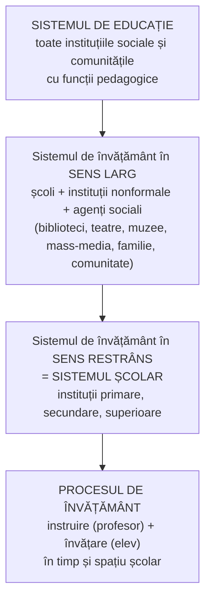

↑ [[Modulul 08 - Sistemul de educație și managementul educației]] · ← [[7.3 Proiectarea curriculară a noilor educații]] · → [[8.2 Tendințele de organizare a sistemului de învățământ]]

> [!abstract] Pe scurt
> - Trei concepte incluse unul în altul: **sistemul de educație** (toate instituțiile sociale și comunitățile umane cu funcții pedagogice) ⊃ **sistemul de învățământ** (instituțiile specializate în educație și instruire) ⊃ **procesul de învățământ** (activitatea concretă de instruire–învățare, în timp și spațiu școlar).
> - Structura sistemului de învățământ se analizează pe **patru niveluri**: de **organizare** (niveluri, trepte, cicluri), **materială** (resurse), de **conducere** și de **relație/deschidere** (școală–societate).
> - **S. Cristea**: sistemul de învățământ **în sens larg** (include biblioteci, muzee, mass-media, familia, comunitatea) și **în sens restrâns** (sistemul școlar).
> - Sistemul de învățământ are **caracter istoric și național**; baza lui teoretică modernă e pusă de **Comenius** (clase, lecții, an școlar).
> - **Funcția fundamentală**: socializarea prin culturalizare; funcții principale: naturală, economică, politică, culturală, comunitară.

---

# PARTEA I — Ce spune manualul

## 0. Deschiderea modulului (p. 273)

- **Motto-uri**: managementul ca proces de punere în practică a programului și obiectivelor unei organizații (atribuit lui **John C. Maxwell**); sistemul de învățământ ca **„factorul esențial al educației”** (**Ioan Nicola**).
- **Competențe vizate**: definirea conceptelor de bază; cunoașterea tendințelor de organizare și perfecționare a sistemului de învățământ; determinarea specificului sistemului din țară și al sistemelor alternative; caracterizarea managementului educației.
- **Concepte de bază**: sistem de educație, sistem de învățământ, proces de învățământ, managementul educației, reforma învățământului.

> [!warning] Cuprinsul modulului nu corespunde textului
> Lista „Subiecte” de la p. 273 are **cinci** puncte (8.5 = Managementul educației), dar în text apar **șase** subcapitole: **8.5** „Sistemul de educație în învățământul simultan” și **8.6** „Managementul educației”. Conspectele urmează numerotarea **din text**.

## 1. Noțiunea de sistem (p. 274)

- Din gr. ***systema*** = întreg alcătuit din părți corelate. Sistem = **ansamblu de elemente aflate în legătură strânsă, care formează un tot unitar**.
- **Instituțiile de învățământ** sunt factorul esențial al educației, dar **nu singurul**: la politicile educaționale participă și **familia, comunitatea, mass-media, televiziunea, internetul** — împreună, acestea formează **sistemul de educație**.

## 2. Sistemul de educație (p. 274–275)

> [!quote] Definiție (după S. Cristea, *Dicționar de pedagogie*, 2000, p. 337)
> Sistemul de educație este ansamblul **organizațiilor/instituțiilor sociale** (economice, politice, culturale) și al **comunităților umane** (familie, popor, națiune, grupuri profesionale și etnice, sat, oraș, cartier etc.) dintr-o societate care, **direct sau indirect, explicit sau implicit**, îndeplinesc **funcții și roluri pedagogice** ce activează și influențează formarea-dezvoltarea personalității.

**Ce include** (p. 274):
- toate **conținuturile generale** ale educației — intelectuală, morală, tehnologică, estetică, psihofizică (→ [[Modulul 06 - Dimensiunile generale ale educației]]) —, realizate prin acțiuni bazate pe diverse tipuri de relații **subiect–obiect** al educației; conținuturile sunt alimentate de **mediul psihosocial deschis**;
- conținuturile **„noilor educații”** (→ [[Modulul 07 - Noile educații]]);
- **formele** educației: formală, nonformală, informală (→ [[3.1 Formele generale ale educației - delimitări conceptuale]]).
- **Fundamentul** sistemului: **cercetarea fundamentală** care elaborează și implementează conținuturile necesare politicilor educaționale.

**Valoarea metodologică** a conceptului (p. 275, după I. Nicola):

| Perspectivă | Explicație |
|---|---|
| **Educația permanentă** | proiectează o configurație socială numită **„cetatea educativă”** (→ [[3.6 Educația permanentă și autoeducația]]) |
| **Responsabilizare** | toate instituțiile și comunitățile răspund de educație |
| **Relații structurale** | clarificarea raporturilor **macrosistem – microsistem** |
| **Funcționare** | perfecționarea mecanismelor educației în termeni de **autoorganizare–autoreglare** |

## 3. Sistemul de învățământ — definiții (p. 275)

- Dezvoltarea educației a dus, în fiecare țară, la apariția treptată a unui **ansamblu de instituții de învățământ** de diferite forme și profiluri = **sistemul de învățământ** al țării.
- În literatura de specialitate (Negură, Papuc, Pâslaru), noțiunea vizează **componentele** sistemului, reflectate la nivelul **procesului de învățământ** și al **relațiilor de interdependență** dintre ele, care asigură funcțiile generale ale educației și instruirii.

> [!quote] Definiție
> Sistemul de învățământ este **principalul subsistem al sistemului de educație**: ansamblul **instituțiilor specializate** în proiectarea și realizarea funcțiilor educației prin conținuturi și metodologii specifice, organizate **formal și nonformal**, în variante diverse — **de stat, publice, particulare, la distanță, fără frecvență** etc.

- Denumire cuprinzătoare pentru totalitatea instituțiilor care instruiesc și educă **copii, tineri și adulți**: preșcolar, școli generale, licee, școli profesionale, universități, școli postliceale, instituții de perfecționare.

## 4. Cele patru niveluri ale structurii (p. 276–277)

| Nivel | Conținut (p. 276) | Explicație (p. 277) |
|---|---|---|
| 1. **Structura de organizare** | niveluri, trepte, cicluri, ani de învățământ (primar, secundar, superior) | adaptarea instituțiilor pe niveluri/trepte/cicluri; condiționează **calitatea curriculumului** |
| 2. **Structura materială** | resurse pedagogice: **informaționale, umane, didactico-materiale, financiare** | resurse existente sau potențiale |
| 3. **Structura de conducere** | managerială (de concepție) – administrativă (de execuție) | optimizarea raporturilor **management – administrație** (→ [[8.6 Managementul educației și reforma]]) |
| 4. **Structura de relație (deschiderea)** | raporturi **contractuale și consensuale** școală–societate | reglementarea relațiilor școlii cu mediul social |

> [!tip] De reținut
> **Calitatea** sistemului de învățământ depinde de **concordanța dintre funcțiile și structura** lui, stabilite prin politici reformatoare orientate spre perfecționarea structurii de organizare (p. 277).

## 5. Comenius și caracterul istoric-național al sistemului (p. 276)

- **J. A. Comenius**, *Didactica Magna*, a pus **baza teoretică** a sistemului de învățământ: a introdus **anul școlar** împărțit în **trimestre**, a stabilit **regimul zilei** școlare, a teoretizat sistemul **pe clase și lecții** și l-a aplicat practic.
- Sistemul s-a perfecționat odată cu dezvoltarea economico-socială și după tradițiile fiecărei țări → are **caracter istoric** (evoluează cu societatea) și **național** (reflectă tradițiile culturale și școlare și progresele unui popor).
- **Analiza comparativă** a sistemelor permite preluarea **creatoare** a ideilor valoroase din alte țări.

## 6. Structura sistemului de învățământ (p. 277)

- Ansamblul componentelor care privesc **organizarea, susținerea materială, conducerea și deschiderea** sistemului; împreună asigură funcționalitatea instituțiilor specializate.

## 7. Abordarea lui S. Cristea: sens larg și sens restrâns (p. 277–281)

### 7.1. Sensul larg (p. 277–280)

- Include și **bibliotecile, teatrele, muzeele, mass-media**, într-un **„constructivism social”** care valorifică raporturile reciproce școală ↔ societate.
- Vizează ansamblul instituțiilor care participă la **„arhitectura școlară”** (cicluri, orientări, filiere):
  - **instituții școlare**: grădinițe, școli primare și gimnaziale, licee, școli profesionale și postliceale, grupuri școlare, unități conexe (case ale copiilor, centre logopedice, centre de asistență psihopedagogică), colegii universitare, universități, institute de formare inițială și continuă;
  - **instituții nonformale**: cluburi, tabere, centre de pregătire profesională, radio-TV școlară/universitară (→ [[3.3 Educația nonformală]]);
  - **agenți sociali** cu care școala are relații **contractuale** (economici, politici, culturali, religioși, comunitari) sau **consensuale** (familia, comunitatea locală).

**Structuri instituționale apărute recent** (p. 278):

| Structură | Specific | Țara-exemplu |
|---|---|---|
| **Școlile duale** | formare profesională în școală **și** întreprindere, pe bază de contract cu agenții economici | Germania |
| **Școlile alternative** | opțiunea și responsabilitatea comunității locale (familie, biserică, agenți sociali) | Olanda, Danemarca |
| **Centrele interșcolare/teritoriale** | formare profesională, instruire nonformală | SUA |
| **Centrele de vacanță** | programe de „educație activă” | Franța |
| **Rețele școlare/universitare de TV și informatizare** | instruire formală–nonformală | Japonia |

**Agenții sociali care colaborează cu școala** (p. 278–280):

| Agent | Ce spune manualul |
|---|---|
| **Familia modernă** | intră în sistem printr-un **„contract natural”**: părinți în consilii de conducere, comitete, grupuri de inițiativă și de finanțare. Nucleul familial s-a **restrâns** (un părinte, un copil), s-au slăbit legăturile între generații și s-a limitat autoritatea reală. **Funcții educative**: îndrumarea copilului, responsabilizarea civică a părinților ca **modele comportamentale** (stil de viață, relații autoritate–permisivitate–colaborare democratică, roluri socio-afective) |
| **Organizațiile de copii și tineret** | potențial formativ mai ales **moral-civic**: spirit comunitar, patriotism autentic, respect pentru valori |
| **Mass-media specializată** | potențial pedagogic prin informare, culturalizare, socializare, formare socioprofesională, divertisment, propagandă |
| **Comunitatea locală** | autorități locale, reprezentanții partidelor, factori culturali, economici, religioși dintr-o zonă școlară; mediu educativ ce poate fi dezvoltat |

→ Tema agenților educației e dezvoltată în [[Modulul 09 - Agenții educației și factorii dezvoltării]].

### 7.2. Sensul restrâns (p. 280)

- Ansamblul **instituțiilor școlare** de nivel primar, secundar, superior, pe trepte și cicluri = **sistemul școlar** (după Vl. Guțu).

**Funcțiile sistemului de învățământ** (raportul educație instituționalizată – societate):

| Tip | Funcția | Conținut |
|---|---|---|
| **Fundamentală** | socializarea prin culturalizare | formarea personalității elevului/studentului în procesul de învățământ |
| Principale | **naturală** | valorificarea integrală a condițiilor mediului natural |
| | **economică** | „producerea” forței de muncă |
| | **politică** | reproducție și **mobilitate socială** |
| | **culturală** | promovarea unei **„culturi dominante”** |
| | **comunitară** | integrarea optimă în familie, grup de prieteni, grup socioprofesional |

## 8. Procesul de învățământ (p. 280–281)

- **Dimensiunea practică** a sistemului: **instruirea** proiectată de profesor + **învățarea** realizată de elev.

> [!quote] Definiție
> Procesul de învățământ este **principalul subsistem al sistemului de învățământ**: activități proiectate după programe de instruire/învățare **formale și nonformale**, realizate de **cadre didactice specializate**, în circumstanțe de **timp** (an, trimestru, semestru, săptămână, zi școlară) și **spațiu** (școală, clasă, laborator, bibliotecă, mediatecă).

- Studiat de **didactica generală** (teoria generală a instruirii).
- **Ce asigură** procesul de învățământ (p. 281):
  1. **organizarea conținuturilor** pentru scopuri de predare-învățare evaluabile periodic;
  2. **realizarea metodologică** a obiectivelor — fie în concepția **tradițională**, centrată pe profesor, fie în concepții **reformatoare**, în care elevul **învață liber** (H. Schaub, K. G. Zenke, 2000).

## 9. Structura de funcționare a sistemului de învățământ (p. 281)

> [!quote] Definiție
> Ansamblul **componentelor** sistemului de învățământ și al **relațiilor de interdependență** dintre ele, care asigură realizarea finalităților în contextul construcției sociale impuse de **paradigma proiectării curriculare**.

- **Eficiența procesului** de învățământ depinde de **structura de funcționare** a sistemului.

---

# PARTEA II — Completări

## 10. Teoria generală a sistemelor

| Autor | Lucrare | Contribuție |
|---|---|---|
| **Ludwig von Bertalanffy** | *General System Theory* (1968; ideile din anii 1930–1950) | sistemul **deschis** schimbă permanent materie, energie, informație cu mediul; întregul are proprietăți pe care părțile nu le au; **echifinalitate** (același rezultat pe căi diferite) |
| **Norbert Wiener** | *Cybernetics* (1948) | **feedback** și autoreglare — noțiune preluată de manual („autoorganizare–autoreglare”) |
| **Philip H. Coombs** | *The World Educational Crisis: A Systems Analysis* (1968) | aplică analiza sistemică educației: **intrări** (elevi, profesori, bani, clădiri) → **proces** → **ieșiri** (absolvenți educați); criza = decalaj între sistemul educațional și mediul lui |

> [!note] Comentariu
> Modelul **intrări – proces – ieșiri** (input–process–output) explică de ce manualul leagă **calitatea** de **concordanța funcții–structură**: un sistem deschis rămâne eficient doar dacă își ajustează structura la cerințele mediului social. Tot de aici vine distincția **eficacitate** (atingerea obiectivelor) / **eficiență** (raport rezultate–resurse).

## 11. Contribuția sociologică la „funcțiile” sistemului

- **Émile Durkheim**, *Éducation et sociologie* (1922): educația ca **socializare metodică** a tinerei generații — corespunde „funcției fundamentale” din manual.
- **Talcott Parsons**, „The School Class as a Social System” (1959): școala ca agent de **socializare** și de **selecție/alocare** socială — corespunde funcției „politice” (mobilitate socială).
- **Pierre Bourdieu & J.-C. Passeron**, *La Reproduction* (1970): școala tinde să **reproducă** inegalitățile, legitimând o **cultură dominantă** — manualul preia expresia „cultură dominantă”, dar fără încărcătura critică (→ [[3.2 Educația formală]], §12).
- **Urie Bronfenbrenner**, *The Ecology of Human Development* (1979): modelul **ecologic** (microsistem, mezosistem, exosistem, macrosistem) — util pentru distincția **macrosistem–microsistem** menționată de manual.

## 12. Clasificarea ISCED — limbajul comun al sistemelor

- **ISCED 2011** (*International Standard Classification of Education*, UNESCO, adoptată în 2011): **9 niveluri (0–8)** — 0 educație timpurie; 1 primar; 2 secundar inferior; 3 secundar superior; 4 postsecundar nonterțiar; 5 terțiar de scurtă durată; 6 licență sau echivalent; 7 master sau echivalent; 8 doctorat sau echivalent.
- Permite **analiza comparativă** cerută de manual (p. 276). Structura concretă a Republicii Moldova → [[8.3 Sistemul de învățământ din Republica Moldova]].

## 13. Sistemul de învățământ în Codul Educației (2014)

- **Art. 12**: sistemul e organizat pe **niveluri și cicluri conform ISCED-2011**.
- **Art. 15**: tipurile de instituții (creșă, grădiniță, școală primară, gimnaziu, liceu, complex educațional, școală profesională, colegiu, centru de excelență, universitate, instituții extrașcolare și speciale); după proprietate: **publice** și **private**.
- **Art. 8**: **parteneriatul** școlii cu cercetarea, sindicatele, mediul de afaceri, societatea civilă și mass-media — echivalentul normativ al „structurii de relație” din manual.

## 14. Autori români citați sau înrudiți

- **Sorin Cristea**, *Dicționar de pedagogie* (2000) și *Fundamentele științelor educației. Teoria generală a educației* (2003): sursa principală a subcapitolului (definițiile, sensurile larg/restrâns, funcțiile).
- **Ioan Nicola**, *Tratat de pedagogie școlară* (1996; ed. Aramis 2002/2003): sistemul de învățământ ca factor esențial al educației.
- **Emil Păun**, *Școala — abordare sociopedagogică* (Polirom, 1999): școala ca **organizație**, cu cultură organizațională proprie — perspectivă complementară celei structurale.

## 15. Comentariu critic

> [!warning] Probleme ale textului
> - **Nepotrivirea cuprins–text** (5 vs. 6 subcapitole) — vezi §0.
> - **Definiții în lanț construite pe aceeași formulă** („principalul subsistem al…”): sistemul de învățământ e subsistemul principal al sistemului de educație, procesul de învățământ e subsistemul principal al sistemului de învățământ. Formularea e utilă mnemotehnic, dar confuză: „procesul” e o **activitate**, nu o parte structurală de același tip.
> - **Suprapunere de termeni**: „structura sistemului” (p. 277) și „structura de funcționare” (p. 281) sunt definite aproape identic; distincția dintre ele nu e clarificată.
> - **Sens larg vs. sistem de educație**: sistemul de învățământ „în sens larg” (cu familie, comunitate, mass-media) se suprapune practic cu **sistemul de educație**. Granița e neclară.
> - **Descrierea familiei** (p. 279) e **generalizatoare** și în parte **negativă** („nucleul s-a restrâns la un singur părinte și un singur copil”) — nu e o descriere statistic valabilă și nu are sursă.
> - **Exemplele de „structuri recente”** (școli duale, centre de vacanță, TV școlară în Japonia) sunt preluate din literatura anilor '90. **Sistemul dual** german are rădăcini vechi (reglementat unitar prin *Berufsbildungsgesetz*, 1969), deci nu e „recent”.
> - **Funcțiile** sunt enumerate fără explicații și fără surse. Expresii precum „cultură dominantă” sau „producția forței de muncă” vin din sociologia critică, dar sunt prezentate neutru.
> - **Paginarea**: definițiile din acest subcapitol sunt **repetate integral** în „Concluzii generale” (p. 303–304).

## 16. Întrebări de autoverificare

1. Explicați etimologia termenului „sistem” și definiția lui generală.
2. Definiți sistemul de educație și precizați ce componente include.
3. Care e raportul dintre sistemul de educație, sistemul de învățământ și procesul de învățământ? Reprezentați-l grafic.
4. Numiți și explicați cele patru niveluri de structură ale sistemului de învățământ.
5. Distingeți sistemul de învățământ în sens larg și în sens restrâns (după S. Cristea). Dați exemple de instituții și agenți sociali.
6. De ce are sistemul de învățământ caracter istoric și național? Care e contribuția lui Comenius?
7. Enumerați funcția fundamentală și funcțiile principale ale sistemului de învățământ.
8. Ce este structura de funcționare a sistemului de învățământ și de ce depinde de ea eficiența procesului de învățământ?
9. Aplicați modelul intrări–proces–ieșiri (Coombs) unei școli din localitatea voastră.

## Surse

- Manual, p. 273–281, 303; Cristea, S. (2000). *Dicționar de pedagogie*. Chișinău–București: Litera; Cristea, S. (2003). *Fundamentele științelor educației. Teoria generală a educației*; Nicola, I. (2002). *Tratat de pedagogie școlară*; Negură, I., Papuc, L., Pâslaru, Vl. (2000). *Curriculum psihopedagogic de bază*; Guțu, Vl. (2014). *Pedagogia învățământului superior*.
- Bertalanffy, L. von (1968). *General System Theory: Foundations, Development, Applications*. New York: George Braziller.
- Coombs, P. H. (1968). *The World Educational Crisis: A Systems Analysis*. New York: Oxford University Press.
- Bronfenbrenner, U. (1979). *The Ecology of Human Development*. Cambridge, MA: Harvard University Press.
- Parsons, T. (1959). The School Class as a Social System. *Harvard Educational Review*, 29(4).
- Bourdieu, P., Passeron, J.-C. (1970). *La Reproduction*. Paris: Minuit.
- Păun, E. (1999). *Școala — abordare sociopedagogică*. Iași: Polirom.
- UNESCO Institute for Statistics (2012). *International Standard Classification of Education: ISCED 2011*. Montreal.
- Codul Educației al Republicii Moldova nr. 152/2014, art. 8, 12, 15.
