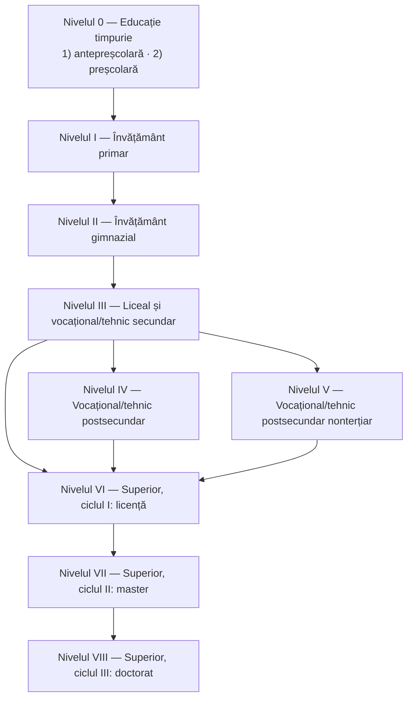

↑ [[Modulul 08 - Sistemul de educație și managementul educației]] · ← [[8.2 Tendințele de organizare a sistemului de învățământ]] · → [[8.4 Sisteme alternative de organizare a instruirii]]

> [!abstract] Pe scurt
> - Învățământul din R. Moldova e organizat pe **niveluri și trepte**, după principiul **continuității** și după **particularitățile de vârstă**.
> - Manualul prezintă **două structuri**: cea „tradițională” (preșcolar → primar I–IV → gimnaziu V–IX → liceu X–XII / profesional → colegiu → superior → postuniversitar) și cea din **Codul Educației (2014)**, aliniată la **ISCED 2011**: **nivelurile 0–8**.
> - Principiile sistemului au ca temei **Constituția**, **Declarația Universală a Drepturilor Omului** și **Codul Educației**. Manualul enumeră: dreptul la învățătură fără discriminare, învățământ de stat și particular, limba maternă, obligativitate, libertatea conștiinței, gratuitate, caracter unitar, accesibil și apolitic.
> - **Atenție**: o parte din datele manualului sunt **inexacte sau depășite** (articolul din Cod, obligativitatea „9 ani / 16 ani”, lista de principii). Vezi Partea II.

---

# PARTEA I — Ce spune manualul

## 1. Direcțiile de perfecționare (p. 284)

Structura de funcționare a sistemului din R. Moldova se perfecționează continuu prin:
- **reforma structurii de bază** a sistemului;
- **renovarea obiectivelor** învățământului obligatoriu;
- **evoluția socială a școlii**;
- orientarea învățământului superior spre **specializări largi**.

Organizarea **pe niveluri și trepte** are în vedere **continuitatea educației** și **particularitățile psihofiziologice de vârstă**.

## 2. Structura sistemului „la 30.06.2014” (p. 285–286)

- Manualul trimite la o **schemă** („Fig. 6. Structura sistemului de învățământ din Republica Moldova”, p. 285). Textul extras nu reproduce conținutul figurii.

| Nivel/treaptă | Descriere în manual |
|---|---|
| **I. Educație preșcolară** | în grădinițe, de la **(0) 3 ani** la **6 (7) ani**; programe diferite, după dezvoltarea copiilor și opțiuni. **Pregătirea pentru școală e obligatorie de la 5 ani**, în **grupe pregătitoare** (grădiniță sau școală) |
| **II. Învățământ primar** | clasele **I–IV**; înscriere obligatorie la **6 (7) ani** împliniți la începutul anului școlar; pot funcționa clase/grupe cu **program prelungit** |
| **III. Învățământ secundar general** | **1. Gimnazial**: **obligatoriu**, de zi, clasele **V–IX**; înscriere **fără concurs** a absolvenților școlii primare; se încheie cu **examene de absolvire** și **certificat de studii gimnaziale**. **2. Liceal**: **3 ani** (X–XII); admitere **prin concurs**, deschisă absolvenților de gimnaziu sau de școli profesionale |
| *(profesional)* | învățământ profesional, vocațional/tehnic **secundar**; vocațional/tehnic **postsecundar**; vocațional/tehnic **postsecundar nonterțiar** |
| **IV. Învățământ profesional** | colegiu |
| **V. Învățământ superior** | licență, masterat, doctorat |
| **VI. Învățământ postuniversitar** | postdoctorat |

**Alte forme**: învățământ **special**; învățământ **complementar** (în instituții extrașcolare); învățământ pentru **adulți**.

## 3. Structura din Codul Educației (p. 286–287)

Manualul afirmă că structura actuală e descrisă în **„articolul 18”** al Codului Educației **„din 30.06.2014”**:

> [!tip] De reținut
> Structura din Cod are **9 niveluri (0–8)**, corespunzătoare **ISCED 2011**. Învățământul superior are **trei cicluri** (licență – master – doctorat), conform **Procesului Bologna**.

## 4. Principiile de organizare a învățământului „din UE” (p. 287)

Manualul enumeră principiile care ar sta la baza sistemelor de învățământ **din UE**:
- dreptul la învățătură pentru toți cetățenii;
- învățământ **de stat** (principal) și **particular**;
- învățământ de toate gradele **în limba română** și în limbile **minorităților conlocuitoare**;
- învățământ bazat pe **libertatea conștiinței**;
- învățământ de stat **general și obligatoriu**;
- învățământ **accesibil**;
- învățământ **apolitic**;
- **educația permanentă**.

## 5. Principiile sistemului de învățământ din R. Moldova (p. 287–289)

- **Documente-temei**: **Constituția Republicii Moldova**; **Declarația Universală a Drepturilor Omului**; **Codul Educației**. Principiile sunt raportate la nivelul de dezvoltare a **economiei**, **democrației** și **statului de drept**.
- Manualul prezintă următoarele principii ca aprobate de **Codul Educației (2014)**:

| Principiu | Explicația din manual |
|---|---|
| **1. Dreptul la învățătură fără discriminare** | drepturi egale la toate nivelurile și formele, indiferent de naționalitate, apartenență politică sau religioasă, stare socială sau materială |
| **2. Învățământ de stat și particular** | — |
| **3. Învățământ de toate gradele în limba maternă** | dreptul de a învăța în limba maternă la toate nivelurile. Minoritățile pot organiza școli în limba maternă, dacă există cerere și elevi suficienți. **Limba oficială** e obligatorie în școlile minorităților; obligatorie e și studierea **Istoriei și Geografiei Moldovei** |
| **4. Învățământ de stat general și obligatoriu** | învățământul de **9 ani** e obligatoriu; elevul e obligat să învețe **până la 16 ani** |
| **5. Libertatea conștiinței** | — |
| **6. Învățământ de stat gratuit** | finanțat de la **buget**; și de agenți economici (burse, credite de studii, donații, sponsorizări). **Universitarul de stat** e gratuit, dar se pot percepe **taxe** (admitere, înmatriculare/reînmatriculare, reexaminare, repetenție, repetarea examenelor de absolvire/licență). Performanțele elevilor sunt subvenționate; există **burse** sociale și pe contract, **credite bancare**, **reduceri** la transportul public |
| **7. Învățământ unitar** | ansamblu de unități și instituții de tipuri, niveluri și forme diferite, **de stat și particulare**, organizat pe niveluri, cu **coerență și continuitate**, după particularitățile de vârstă și individuale |
| **8. Învățământ accesibil, deschis** | posibilitatea **trecerii de la un profil la altul**, inclusiv pentru elevii din învățământul particular |
| **9. Învățământ apolitic** | școala e **în afara politicii**: profesorii nu pot implica elevii în acțiuni stradale politice; formațiunile politice nu pot fi organizate în școală; elevii nu pot fi membri de partid |

## 6. Concluzia (p. 303–304)

- Principiile sistemului de învățământ sunt stipulate în **Constituție**, în **Declarația Universală a Drepturilor Omului** și în **Codul Educației** și sunt raportate la dezvoltarea economiei, a democrației și a statului de drept.
- **Temă de reflecție** (p. 304): identificați în Codul Educației (2014) tendințele de reformare la nivel de **organizare, structură, instituții, acte de studii**.

---

# PARTEA II — Completări (verificate pe textul Codului Educației)

## 7. Codul Educației: date de identificare

- **Codul Educației al Republicii Moldova nr. 152 din 17.07.2014**, publicat în **Monitorul Oficial nr. 319–324 din 24.10.2014**, art. 634. A fost modificat de multe ori; versiunea consolidată consultată include modificări până la **Legea nr. 200 din 10.07.2025**.

> [!warning] Trimiteri greșite în manual
> - Structura sistemului e stabilită de **art. 12** („Structura sistemului de învățământ”), **nu de art. 18**. **Art. 18** reglementează **managementul** sistemului de învățământ (→ [[8.6 Managementul educației și reforma]]).
> - Codul **nu** e „din 30.06.2014”. A fost adoptat la **17.07.2014** și publicat la **24.10.2014**. Și referința bibliografică [3] a manualului (Monitorul Oficial nr. 185–199 din 18.07.2014, „Hotărârea nr. 498 din 30 iunie 2014”) pare să vizeze **aprobarea proiectului** de către Guvern, nu legea adoptată de Parlament (de verificat).
> - Codul folosește termenul **„învățământ profesional tehnic”**, **nu** „vocațional/tehnic” (formularea proiectului). Nivelurile sunt numerotate **0–8**, cu cifre arabe.

## 8. Structura actuală a sistemului (Codul Educației, art. 12, 20–31, 62–63, 89–95)

| Nivel ISCED | Denumire (Cod) | Clase / vârste / durată | Finalizare, act de studii |
|---|---|---|---|
| **0** | **Educație timpurie**: antepreșcolară + preșcolară | antepreșcolar **0–2 ani**; preșcolar **2–6 (7) ani**, inclusiv **grupa pregătitoare** (versiunea inițială din 2014: 0–3 și 3–6/7 ani) | — |
| **1** | **Învățământ primar** | clasele **I–IV**; școlarizarea e obligatorie **după împlinirea vârstei de 7 ani**; mai devreme, la cererea părinților, după maturitatea psihosomatică | **testare națională** (art. 27 alin. 8); evaluare **criterială prin descriptori** |
| **2** | **Secundar, ciclul I: gimnazial** | clasele **V–IX** | **examene naționale de absolvire** → **certificat de studii gimnaziale** |
| **3** | **Secundar, ciclul II: liceal**; **profesional tehnic secundar** | liceu: clasele **X–XII** (cu frecvență) sau **X–XIII** (frecvență redusă); filiere **teoretică** (umanist, real, general) și **vocațională** (arte, sport, teologic, militar); admitere prin **concurs**. Școală profesională: **1–3 ani** | **bacalaureat** → **diplomă de bacalaureat** (fără bacalaureat: certificat de studii liceale); școala profesională → **certificat de calificare** |
| **4** | **Profesional tehnic postsecundar** (colegiu) | programe integrate după gimnaziu (în general **4 ani**; **5 ani** la medicină și farmacie) sau **2–3 ani** după liceu | **diplomă de studii profesionale** |
| **5** | **Profesional tehnic postsecundar nonterțiar** (colegiu) | **4–5 ani** după gimnaziu (pedagogie, sănătate) sau **2–3 ani** după bacalaureat | **diplomă de studii profesionale** |
| **6** | **Superior, ciclul I: licență** | **180–240 credite** ECTS | diplomă de licență |
| **7** | **Superior, ciclul II: master** | **90–120 credite**; studii **integrate** (medicină etc.): minimum **300 credite** | diplomă de master |
| **8** | **Superior, ciclul III: doctorat** | **180 credite**, în **școli doctorale** | diplomă de doctor |
| — | **Postdoctorat** | cel mult **3 ani** (art. 95), nu e nivel ISCED distinct | — |

- **Învățământul general** include și învățământul **special**, **extrașcolar** și **alternativele educaționale** (art. 20 alin. 2).
- **Scara de notare**: **10–1** și calificative. În primar, evaluarea se face prin **descriptori** (art. 16).

> [!note] Comentariu
> **Structura 4 + 5 + 3** (primar + gimnaziu + liceu) = **12 clase** a rămas **neschimbată** față de manual. S-au schimbat însă **numerotarea** (ISCED), **terminologia** (profesional tehnic; educație timpurie), **vârstele** din educația timpurie și statutul **colegiilor** (nivelurile 4 și 5).

## 9. Învățământul obligatoriu — informația cea mai schimbătoare

| Sursa | Ce prevede |
|---|---|
| **Manualul** (p. 288) | **9 ani** obligatorii; **până la 16 ani** — formularea corespunde **Legii învățământului nr. 547/1995** |
| **Codul Educației, versiunea inițială (2014), art. 13** | obligatoriu de la **grupa pregătitoare** până la finalizarea **învățământului liceal sau profesional tehnic**; obligativitatea încetează la **18 ani** |
| **Codul Educației, versiunea consolidată actuală, art. 13** | obligatoriu de la **grupa pregătitoare** până la finalizarea **învățământului gimnazial**; obligativitatea încetează la **16 ani** (anul modificării — de verificat) |

> [!warning] Contradicție în manual
> Manualul afirmă că principiile sunt cele „conform Codului educației (2014)”, dar descrie obligativitatea **după legea din 1995**, deși Codul din 2014 prevedea atunci **obligativitate până la 18 ani**. Ulterior, Codul a fost modificat și a revenit la **16 ani / gimnaziu**.

## 10. Principiile din Codul Educației (art. 7) — comparație cu manualul

Codul enumeră **19 principii fundamentale** (lit. a–s): **echitate**; **calitate**; **relevanță**; **centrarea educației pe beneficiari**; **libertatea de gândire și independența față de ideologii, dogme religioase și doctrine politice**; respectarea **dreptului la opinie** al elevului/studentului; **incluziune socială**; **egalitate și nediscriminare**; recunoașterea drepturilor **minorităților naționale**; **unitatea și integralitatea** spațiului educațional; **eficiență managerială și financiară**; **descentralizare și autonomie instituțională**; **răspundere publică**; **transparență**; **participarea și responsabilitatea comunității și a părinților**; susținerea **personalului din educație**; **învățământ laic**; **nonviolență**; **nonprofit**.

| Principiul din manual | Corespondent în Cod |
|---|---|
| Dreptul la învățătură fără discriminare | **echitate**; **egalitate și nediscriminare** (art. 7), **acces egal** (art. 9) |
| De stat și particular | instituții **publice și private** (art. 15 alin. 3; art. 21) |
| Limba maternă la toate nivelurile | **reformulat**: predarea în **limba română** și, în limita posibilităților, într-o limbă de circulație internațională sau în limbile minorităților; limba română e **obligatorie** în toate instituțiile (art. 10) |
| Apolitic | independență față de **doctrine politice** (art. 7 lit. e) |
| Libertatea conștiinței | libertatea de gândire; **învățământ laic** (lit. q) |
| Unitar | **unitatea și integralitatea spațiului educațional** (lit. j) |
| Gratuit | educația timpurie publică suportată de stat (art. 25); acte de studii gratuite în învățământul obligatoriu (art. 17); finanțare după principiul **„banul urmează elevul”** (art. 9) |
| *(lipsesc din manual)* | **calitate, relevanță, centrare pe beneficiar, incluziune, descentralizare, autonomie, răspundere publică, transparență, participare, nonviolență** |

> [!note] Comentariu
> Lista din manual reflectă **legislația anilor '90**. Principiile specifice Codului din 2014 — **calitate, relevanță, incluziune, descentralizare, autonomie, răspundere publică** — lipsesc aproape complet. Pentru examen, **lista corectă este cea din art. 7 al Codului**.

## 11. Documente strategice

- **Strategia de dezvoltare a educației pentru anii 2014–2020 „Educația-2020”** (aprobată prin HG nr. 944/2014): a însoțit implementarea Codului.
- **Strategia de dezvoltare „Educația 2030”** și Programul de implementare pentru 2023–2025, aprobate prin **Hotărârea Guvernului nr. 114 din 07.03.2023**. Strategia e corelată cu **Strategia națională de dezvoltare „Moldova Europeană 2030”** și cu **ODD 4**. Direcții: **calitatea** educației, **digitalizarea**, **cadre didactice calificate**, **incluziunea**; evaluarea finală e prevăzută pentru **2031**.
- **Curriculumul Național** a fost revizuit (curriculum pe **competențe**, 2018–2019). **Cadrul Național al Calificărilor** are **opt niveluri** (art. 11¹ al Codului), corelate cu **Cadrul European al Calificărilor**.
- **Procesul Bologna**: R. Moldova a aderat în **2005**.
- **Ministerul**: *Ministerul Educației* (2014) → *Ministerul Educației, Culturii și Cercetării* (2017) → **Ministerul Educației și Cercetării** (din 2021).

## 12. Comparație sumară cu România (sistem apropiat, des confundat)

| | R. Moldova | România (Legea învățământului preuniversitar nr. 198/2023) |
|---|---|---|
| Primar | I–IV (4 ani) | clasa pregătitoare + I–IV |
| Gimnaziu | V–IX (5 ani) | V–VIII (4 ani) |
| Liceu | X–XII (3 ani) | IX–XII (4 ani) |
| Total până la bacalaureat | 12 clase | 13 ani (cu pregătitoarea) |

## 13. Comentariu critic

> [!warning] Probleme ale textului
> - **Trimitere greșită**: art. 18 în loc de **art. 12**; data 30.06.2014 în loc de **17.07.2014** (vezi §7).
> - **Două structuri suprapuse fără explicație**: structura „veche” (niveluri I–VI, cu cifre romane) și structura din Cod (0–8) sunt prezentate una după alta, fără tabel de corespondență. Cititorul poate crede că ambele sunt în vigoare.
> - **Numerotare incoerentă**: în structura veche, „IV. Învățământ profesional – colegiu” apare **după** învățământul profesional secundar, iar acesta nu are număr propriu.
> - **Contradicție de vârstă**: pregătirea pentru școală e „obligatorie de la 5 ani”, iar clasa I la „6 (7) ani”. Codul prevede școlarizarea obligatorie **după 7 ani**.
> - **„Principiile din UE”** (p. 287) nu provin din vreun document al Uniunii Europene (UE nu reglementează principii unitare de organizare a sistemelor naționale). Formula „minoritățile **conlocuitoare**” și limba **română** trimit la **legislația românească** a anilor '90 (probabil Legea învățământului nr. 84/1995 a României, de verificat).
> - **Principii depășite** prezentate ca fiind „conform Codului educației (2014)” (vezi §9–10). Obligativitatea formării continue și alte date din 8.6 au aceeași problemă.
> - **Figura 6** nu e explicată în text; datele privind educația „(0) 3 ani” sunt ambigue.
> - **Redactare**: „Învățând accesibil” (p. 289) în loc de „Învățământ accesibil”; „opțiunile elevilor” la preșcolari (p. 285).

## 14. Întrebări de autoverificare

1. Care sunt direcțiile de perfecționare a sistemului de învățământ din R. Moldova, conform manualului?
2. Enumerați nivelurile sistemului de învățământ conform art. 12 al Codului Educației și corespondența lor ISCED.
3. Care sunt actele de studii eliberate la finalizarea gimnaziului, liceului, școlii profesionale și colegiului?
4. Cum s-a modificat, între 1995, 2014 și în prezent, durata învățământului obligatoriu în R. Moldova?
5. Numiți cinci principii fundamentale ale educației din art. 7 al Codului care lipsesc din lista manualului.
6. Explicați principiile învățământului „apolitic” și „laic” și relația lor cu principiul independenței față de doctrine politice.
7. Ce este Strategia „Educația 2030” și prin ce act a fost aprobată?
8. Comparați structura învățământului general din R. Moldova cu cea din România.
9. (Temă de reflecție) Ați constatat neglijarea unor principii în instituția de învățământ pe care ați absolvit-o? Argumentați.

## Surse

- Manual, p. 284–289, 303–304.
- **Codul Educației al Republicii Moldova nr. 152 din 17.07.2014**, Monitorul Oficial nr. 319–324/634 din 24.10.2014 — versiunea inițială și versiunea consolidată (modificată până la Legea nr. 200/2025), art. 7, 9, 10, 11¹, 12, 13, 15, 16, 17, 20, 23, 25, 27, 29, 31, 62, 63, 89, 90, 94, 95. [legis.md](https://www.legis.md/cautare/getResults?doc_id=110112&lang=ro)
- Legea învățământului a Republicii Moldova nr. 547 din 21.07.1995 (abrogată prin Codul Educației).
- Hotărârea Guvernului nr. 114 din 07.03.2023 privind aprobarea Strategiei de dezvoltare „Educația 2030”. [legis.md](https://www.legis.md/cautare/getResults?doc_id=136600&lang=ro); [MEC — anunțul aprobării](https://mecc.gov.md/ro/content/guvernul-aprobat-strategia-de-dezvoltare-educatia-2030)
- Hotărârea Guvernului nr. 944 din 14.11.2014 privind aprobarea Strategiei „Educația-2020”.
- UNESCO Institute for Statistics (2012). *ISCED 2011*.
- Legea învățământului preuniversitar a României nr. 198/2023.
