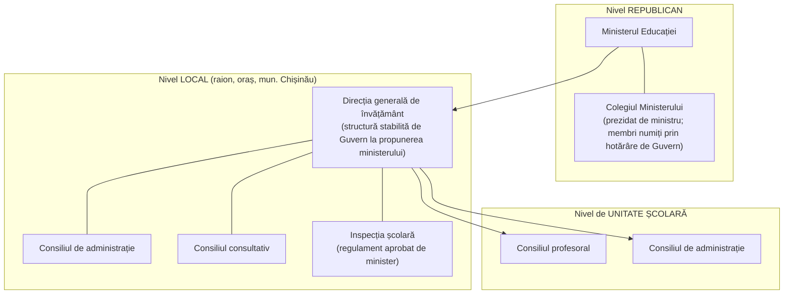
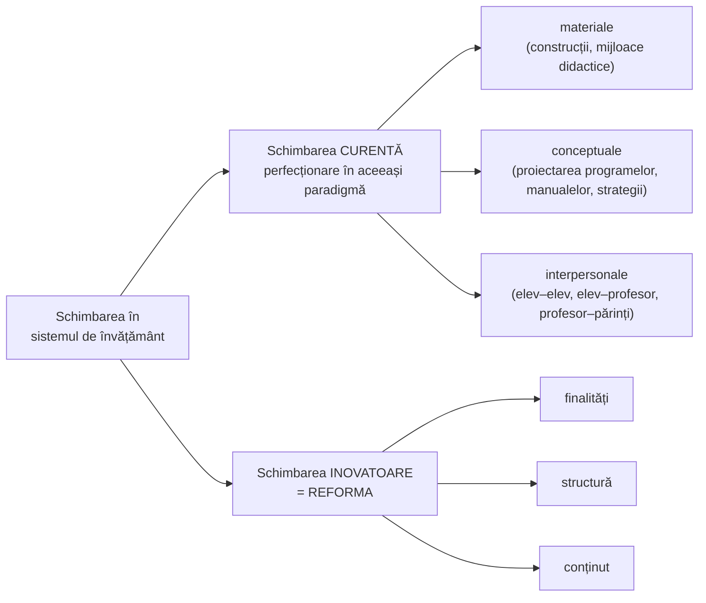

↑ [[Modulul 08 - Sistemul de educație și managementul educației]] · ← [[8.5 Învățământul simultan]] · → [[9.1 Profesorul școlar - roluri, competențe, stiluri]]

> [!abstract] Pe scurt
> - **Conducerea** învățământului se face pe **trei niveluri**: **republican** (Ministerul Educației, Colegiul ministerului), **local** (direcțiile de învățământ, cu consiliu de administrație și consiliu consultativ) și **al instituției** (consiliul profesoral, consiliul de administrație).
> - **Managementul educației** = conducerea **superioară — globală, optimă, strategică** — a sistemului de învățământ, la toate nivelurile, prin funcțiile **planificare-organizare, orientare-îndrumare, reglare-autoreglare**.
> - Trei **modele istorice** de conducere, care coexistă și azi: **birocratic** (Weber) → **tehnocratic** (D. Bell) → **managerial** (ierarhie funcțională, participativă).
> - **Schimbarea** în învățământ are două căi: **curentă** (în aceeași paradigmă: schimbări materiale, conceptuale, interpersonale) și **inovatoare = reforma**.
> - **Reforma** = tip **superior** de schimbare, la nivel de **structură și funcționalitate**; transformă **finalitățile, structura și conținutul** educației (după S. Cristea).

---

# PARTEA I — Ce spune manualul

## 1. Conducerea sistemului de învățământ (p. 298–299)

- **Organul central** al administrației publice în domeniu este **Ministerul Educației**: elaborează **strategia**, promovează **politica de stat** în învățământ și participă la politica de stat privind **copiii și tineretul**.

- Consiliile locale funcționează pe bază de **regulament** și sunt **prezidate de directorul general** al direcției de învățământ.

## 2. Personalul din învățământ (p. 299)

| Aspect | Prevederea din manual |
|---|---|
| **Categorii** | cadre **didactice**, cadre **științifice**, cadre didactice **auxiliare**, personal **administrativ** |
| **Ocuparea funcțiilor** | condiții stabilite de **Ministerul Educației** |
| **Norma didactică** | stabilită de **Guvern**, la propunerea Ministerului Educației, împreună cu **Ministerul Muncii și Protecției Sociale** |
| **Salarizarea** | după **nivelul de studii**, **funcție**, **grad** și **titlu didactic**, **titlu științific**, **vechime** |
| **Formarea inițială** | **prioritară**, **anticipează** dezvoltarea învățământului; se realizează **la un singur nivel — universitar** |
| **Perfecționarea** | **obligatorie**, **cel puțin o dată la 5 ani**; scop: racordarea calificării la **înnoirile conceptuale, metodologice, curriculare și tehnologice** |

## 3. Modelul managerial al sistemului de învățământ (p. 299)

**Obiectivele** modelului managerial, specific **societății informatizate**:
1. **definirea** conceptului pedagogic de management al educației;
2. **identificarea și analiza funcțiilor și structurilor manageriale** la nivelul sistemului;
3. **elaborarea unui model** de conducere managerială a sistemului.

- Managementul educației, **parte fundamentală a structurii de funcționare** (→ [[8.1 Sistemul de educație și sistemul de învățământ]]), apare ca **model de conducere deschis**, **adaptabil** la cerințele sociale. E un model de **raționalizare socială** a activităților educaționale, **superior** atât celui **birocratic**, cât și celui **tehnocratic**.

> [!quote] Definiție (p. 300)
> **Managementul educației** este activitatea de **conducere superioară — globală, optimă, strategică** — a sistemului de învățământ, **la toate nivelurile** acestuia, pe baza funcțiilor generale de **planificare-organizare**, **orientare-îndrumare** și **reglare-autoreglare**.

| Atribut al conducerii | Sens |
|---|---|
| **Globală** | vizează sistemul **în ansamblu** (toate nivelurile și componentele) |
| **Optimă** | valorifică **resursele** pentru rezultate maxime |
| **Strategică** | orientată spre **dezvoltare pe termen lung**, prin inovare |

## 4. Cele trei modele de conducere (p. 300–301)

- Modelele sunt **condiționate istoric**, dar **coexistă** și azi, pe fondul „valurilor de dezvoltare” **preindustrială, industrială, postindustrială** (A. Toffler).

| Model | Societatea corespunzătoare | Trăsături | Autori citați |
|---|---|---|---|
| **Birocratic** | societatea industrializată **timpurie** | posturi **pe viață**; **ierarhie verticală** a funcțiilor; **diviziunea muncii** pe domenii înguste; raporturi **impersonale** conducători–conduși | **Max Weber** (1969) |
| **Tehnocratic** | societatea industrializată **dezvoltată** | respinge birocrația; factorul politic devine **executant al unei „inteligențe științifice”** — o **meritocrație** de experți | **Daniel Bell** (1973); critici: „Jurgen Huberman” (1973), **A. Toffler** (1995), **E. Morin** (1996) |
| **Managerial** | societatea **informatizată / postindustrială** | **axă de raționalizare socială** care **depășește și valorifică** birocrația și tehnocrația; ierarhia administrativă și cea elitistă sunt înlocuite cu **ierarhia funcțională și reprezentativă/participativă** | S. Cristea |

**Critica tehnocrației** (p. 300): experții nu cunosc realitatea socială pe care o reprezintă și acționează ca „**savanți cu frunțile înguste**” sau ca specialiști care **fragmentează** problemele generale.

**Riscuri majore ale modelului tehnocratic în educație**:
1. **inegalizarea șanselor** de reușită școlară;
2. **precipitarea orientării** școlare și profesionale;
3. încurajarea **artificială** a problematicii **categoriilor speciale** (învățământ pentru deficienți / supradotați);
4. **supramotivarea externă** a învățării, prin **competiție**;
5. **reducerea educației la conținuturile intelectuale**;
6. încurajarea **structurilor elitiste**, care dezechilibrează procesul formativ.

- **Conducerea managerială** corespunde funcțiilor generale angajate la nivelul **întregului sistem social**, în vederea **eficientizării depline** a educației (p. 301).

## 5. Schimbarea în sistemul de învățământ (p. 301)

- Schimbarea sistemului de învățământ e **continuă** și reflectă transformările societății. Se produce **pe două căi**:

- **Schimbarea curentă** = perfecționarea procesului și sistemului **păstrând aceeași paradigmă pedagogică**: modernizarea proiectării prin **renovarea programelor**, a **manualelor/cursurilor**, a **metodologiilor de predare-învățare-evaluare**.
- **Concluzie** (p. 301): schimbările curente se produc la nivel **strategic și legislativ**, în cadrul procesului și sistemului de învățământ, ca răspuns la **noile cerințe sociale**.

## 6. Reforma sistemului de învățământ (p. 302)

> [!quote] Definiție
> **Reforma sistemului de învățământ** este un **tip superior de schimbare pedagogică/educațională**, extinsă la nivel de **structură și funcționalitate**, într-un **spațiu și timp** pedagogic și social.

**Reforma ca inovație structurală și sistemică** urmărește:
- a) **integrarea și corelarea** sistemului de educație/învățământ cu **celelalte subsisteme sociale**;
- b) **inovarea relațiilor** dintre componentele structurale ale sistemului (ex. **liceu ↔ superior**, **gimnaziu ↔ liceu**).

**Sinteza lui S. Cristea** (din perspective pedagogice, politice, sociologice, filosofice):

| Dimensiune | Conținut |
|---|---|
| **1. Inovație superioară** | transformarea **profundă a structurii de bază**: **externă** (raporturile educație–societate) și **internă** (legăturile dintre niveluri, trepte, discipline) |
| **2. Schimbare calitativă** | în sens **intensiv** (profunzimea inovațiilor structurale) și **extensiv** (amploarea lor — **globale și de durată**, la scara întregului sistem) |
| **3. Planificare calitativă** | transformarea inovatoare a **finalităților**, a **structurii** (niveluri, trepte, discipline) și a **conținutului** procesului de învățământ |

> [!tip] De reținut (Concluzii generale, p. 304)
> Reforma e **întotdeauna provocată de transformările sociale**, care impun schimbări **inovatoare** ale **finalităților, structurii și conținutului** educației (→ [[Modulul 04 - Finalitățile educației]]).

## 7. Concluziile generale ale modulului (p. 303–304)

Manualul reia **definițiile**: sistem de educație, sistem de învățământ, proces de învățământ, structura de funcționare, principiile sistemului de învățământ, managementul educației, reforma (→ [[8.1 Sistemul de educație și sistemul de învățământ]], [[8.3 Sistemul de învățământ din Republica Moldova]]).

## 8. Aplicații propuse de manual (p. 304–305)

- **Teme de reflecție**:
  - determinați, pe baza **Codului Educației (2014)**, tendințele de reformare la nivel de **organizare, structură, instituții, acte de studii**;
  - ați constatat **neglijarea unor principii** în instituția absolvită?
  - ce **schimbări** ați face în sistem, dacă ați avea împuterniciri?
  - analizați **alternativele** sistemului educațional național;
  - caracterizați **sistemul de învățământ al unei țări europene**, la alegere.
- **Exercițiu de creativitate**: eseu despre tendințele de organizare și perfecționare a sistemului de învățământ din țară.
- **Jurnal de modul**: „Ce am învățat” / „Ce pot să aplic și să schimb”.
- **Bibliografia modulului** (p. 305–306): 16 titluri (Andrițchi, Brițchi & Sadovei, Codul Educației, Cojocaru/Papuc/Sadovei, *Concepția educației în R. Moldova* (2000), Cristea 2000 și 2003, Dandara, Guțu, Iucu, Negură/Papuc/Pâslaru, Nicola, Papuc et al., Papuc, Patrașcu, Toffler).

---

# PARTEA II — Completări

## 9. Conducerea învățământului în Codul Educației (versiunea actuală)

| Nivel | Prevederi (Codul Educației nr. 152/2014) |
|---|---|
| **Principiu general** | managementul se realizează la **trei niveluri: național, local și instituțional** (**art. 18**) |
| **Național** | **Ministerul Educației și Cercetării** elaborează, promovează, monitorizează și evaluează **politica națională**; aprobă **standardele** și **Curriculumul național**; conduce, monitorizează și evaluează sistemul (art. 18, **140**). **Guvernul** are atribuții proprii (art. 139). Asigurarea calității în învățământul profesional tehnic și superior: **ANACEC — Agenția Națională de Asigurare a Calității în Educație și Cercetare** |
| **Local** | **organele locale de specialitate** în domeniul învățământului sunt create de **autoritățile publice locale de nivelul al doilea** (raion/municipiu), ca **subdiviziuni ale consiliilor raionale/municipale** (art. 18 alin. 5). Structuri de conducere: **consiliul de administrație**, **consiliul consultativ** și **conducătorul**, numit **prin concurs pentru 4 ani**, cel mult **8 ani** (art. 48) |
| **Instituțional** (învățământ general) | **consiliul de administrație** — decizie **administrativă**: director, director adjunct, reprezentant al APL de nivelul I, **3 părinți**, **2 cadre didactice**, **1 elev**; e condus de **altă persoană decât directorul**. **Consiliul profesoral** — decizie **educațională**: tot personalul didactic, condus de director (art. 49) |
| **Formare continuă** | dezvoltarea profesională e **obligatorie pe tot parcursul carierei** (art. 133); cadrele didactice au dreptul, garantat de stat, la **stagii de formare cel puțin o dată la 3 ani** (art. 134 alin. 4 lit. b) și pot obține **credite de dezvoltare profesională** |

> [!note] Comentariu
> Față de manual: (1) conducerea locală e acum **descentralizată** — organele de specialitate sunt **subordonate consiliilor raionale**, nu ministerului; (2) consiliul de administrație al școlii include **părinți și elevi** și **nu e condus de director** — expresie a principiilor **participării** și **descentralizării** (art. 7); (3) periodicitatea **„o dată la 5 ani”** provine din legislația anterioară; Codul vorbește de stagii **cel puțin o dată la 3 ani**; (4) formularea „formarea cadrelor … la un singur nivel, cel universitar” nu mai corespunde realității: colegiile pedagogice formează **educatori** la nivelul 5 ISCED (art. 63).

## 10. Rădăcinile teoriei manageriale

| Autor | Lucrare, an | Contribuție relevantă pentru educație |
|---|---|---|
| **Henri Fayol** | *Administration industrielle et générale* (1916) | **cinci funcții** ale conducerii: **a prevedea, a organiza, a comanda, a coordona, a controla**; 14 principii (unitatea de comandă, ierarhie etc.) |
| **Frederick W. Taylor** | *The Principles of Scientific Management* (1911) | **managementul științific**: eficiență, standardizare — inspiră „modelul tehnocratic” |
| **Luther Gulick** | „Notes on the Theory of Organization” (1937) | acronimul **POSDCORB**: *planning, organizing, staffing, directing, coordinating, reporting, budgeting* |
| **Max Weber** | *Wirtschaft und Gesellschaft* (1922, postum) | tipul ideal al **birocrației**: reguli impersonale, ierarhie, specializare, carieră |
| **Daniel Bell** | *The Coming of Post-Industrial Society* (1973) | societatea **postindustrială**, în care cunoașterea teoretică și **experții** devin centrali |
| **Alvin Toffler** | *Future Shock* (1970); *The Third Wave* (1980) | „**valurile**” de dezvoltare: agrar, industrial, informațional |
| **Karl E. Weick** | „Educational Organizations as Loosely Coupled Systems” (1976) | școlile sunt **„sisteme slab cuplate”**: deciziile de la vârf nu se transmit automat în clasă → limitele conducerii birocratice |
| **Henry Mintzberg** | *The Structuring of Organizations* (1979) | școala ca **„birocrație profesională”**: calitatea depinde de competența profesioniștilor, nu de ierarhie |

**Funcțiile managementului în literatura românească**:
- **S. Cristea** (preluat de manual): **planificare-organizare**, **orientare-îndrumare**, **reglare-autoreglare**;
- **Ioan Jinga**, *Managementul învățământului* (2001): funcțiile clasice adaptate școlii — **prevedere/proiectare, organizare, coordonare, antrenare (motivare), control-evaluare** (de verificat formularea exactă);
- **Emil Păun**, *Școala — abordare sociopedagogică* (1999): școala ca **organizație**, cu **cultură organizațională** proprie.

## 11. De la management la leadership educațional

| Model | Autori | Idee centrală |
|---|---|---|
| **Leadership instrucțional** | **Ph. Hallinger & J. Murphy** (1985) | directorul **definește misiunea** școlii, **conduce programul instrucțional**, promovează un **climat pozitiv de învățare** |
| **Leadership transformațional** | **K. Leithwood** (anii 1990) | construirea **viziunii comune**, dezvoltarea oamenilor, **restructurarea** organizației |
| **Efectele leadershipului** | **V. Robinson, C. Lloyd, K. Rowe** (2008), meta-analiză | leadershipul **centrat pe predare și învățare** are efecte asupra rezultatelor elevilor **de câteva ori mai mari** decât cel transformațional; cel mai puternic factor: **implicarea directorului în dezvoltarea profesională a profesorilor** |
| **Leadership distribuit** | J. Spillane (2006) | conducerea e **împărțită** între director, profesori-lideri, echipe |
| **Politici OCDE** | B. Pont, D. Nusche, H. Moorman, *Improving School Leadership* (OECD, 2008) | patru pârghii: **redefinirea responsabilităților** directorilor, **distribuirea leadershipului**, **formarea** liderilor, **atractivitatea** profesiei de director |

> [!note] Comentariu
> Manualul rămâne la **managementul sistemului** (macro). Cercetarea actuală mută accentul pe **leadershipul la nivelul școlii**, unde se produce efectiv schimbarea. Distincția clasică: **managementul** asigură **stabilitate și ordine** („a face lucrurile bine”), **leadershipul** produce **schimbare și direcție** („a face lucrurile potrivite”) — după **J. Kotter** și **W. Bennis**.

## 12. Teoria schimbării educaționale

- **A. Michael Huberman**, *Understanding Change in Education: An Introduction* (UNESCO–IBE, 1973): tipologia **schimbărilor materiale, conceptuale și interpersonale** — exact tipologia din manual (p. 301), unde sursa nu e numită.
- **Everett M. Rogers**, *Diffusion of Innovations* (1962): adoptarea inovațiilor urmează o **curbă în S**, cu categorii de adoptatori: **inovatori, adoptatori timpurii, majoritate timpurie, majoritate târzie, întârziați**.
- **Michael Fullan**, *The Meaning of Educational Change* (1982); ed. a 2-a, *The New Meaning of Educational Change* (1991, cu S. Stiegelbauer), ed. ulterioare 2001, 2007, 2016:
  - schimbarea are **trei faze**: **inițiere → implementare → instituționalizare** (continuare);
  - schimbarea reală presupune modificări simultane în **materiale**, **practici de predare** și **convingeri**;
  - **„sensul subiectiv”** al schimbării pentru profesori e decisiv: reformele impuse fără înțelegere eșuează;
  - **„implementation dip”**: performanța scade temporar la începutul unei inovații.
- **David Hopkins**, *School Improvement for Real* (2001): **ameliorarea școlii** (*school improvement*) — schimbarea pornită din **capacitatea internă** a școlii, centrată pe învățarea elevilor.
- **A. Hargreaves & M. Fullan**, *Professional Capital* (2012): capitalul **uman, social și decizional** al profesorilor ca motor al reformei.

> [!tip] De reținut — de ce eșuează reformele
> Literatura (Fullan, Hopkins, OCDE) indică: **suprasolicitare** cu inițiative („*initiativitis*”), **lipsa implicării profesorilor**, **implementare de sus în jos** fără sprijin, **orizont prea scurt** (reformele structurale cer 5–10 ani), **incoerență** între curriculum, evaluare și formare.

## 13. Reformele învățământului în R. Moldova — repere

| Perioadă | Reper |
|---|---|
| **1995** | **Legea învățământului nr. 547/1995** |
| **1990–2000** | **curriculum național** modernizat, noi manuale, reforma evaluării (examene de absolvire, bacalaureat) |
| **2005** | aderarea la **Procesul Bologna** |
| **2014** | **Codul Educației** (nr. 152/2014); **Strategia „Educația-2020”** (HG nr. 944/2014) |
| **2018–2019** | **Curriculumul național** revizuit, centrat pe competențe |
| **2023** | **Strategia de dezvoltare „Educația 2030”** (HG nr. 114 din 07.03.2023) |

→ Detalii: [[8.3 Sistemul de învățământ din Republica Moldova]].

## 14. Comentariu critic

> [!warning] Probleme ale textului
> - **Autor inexistent**: „**Jurgen Huberman**, 1973” pare o **contopire** între **Jürgen Habermas** (critic al tehnocrației, *Technik und Wissenschaft als „Ideologie”*, 1968) și **A. Michael Huberman** (teoretician al schimbării educaționale, 1973), a cărui tipologie (materiale–conceptuale–interpersonale) e folosită la p. 301 fără citare (de verificat în sursa lui S. Cristea).
> - **Anii citați** pentru Weber (1969), Toffler (1995) și Morin (1996) sunt ani de **ediții sau traduceri**, nu ai lucrărilor originale (Weber 1922; *Șocul viitorului* 1970). Pentru „valurile de dezvoltare”, lucrarea relevantă a lui Toffler e ***Al treilea val*** (1980), nu *Șocul viitorului*.
> - **Motto-ul lui John C. Maxwell** (p. 273) nu are sursă; Maxwell e autor de literatură de popularizare despre leadership, iar atribuirea nu a putut fi verificată.
> - **Date instituționale depășite**: **Ministerul Educației** (azi Ministerul Educației și Cercetării); direcțiile de învățământ subordonate ministerului; perfecționarea „o dată la 5 ani”; Colegiul ministerului „prezidat de ministru” cu „membrii **Consiliului**” (confuzie colegiu/consiliu).
> - **Ordinea logică**: fragmentul despre modelele birocratic/tehnocratic/managerial vorbește de „cele **trei** modele” **înainte** ca ele să fie introduse.
> - **Amestec de planuri**: subcapitolul pornește de la **administrația** învățământului (organe, salarizare, normă didactică) și trece brusc la **teoria managementului** și apoi la **reformă**, fără legături. Titlul modulului („schimbarea în sistemul de învățământ”) se regăsește doar în ultimele două pagini.
> - **Circularitate**: definiția managementului conține funcțiile („conducere globală, optimă, strategică”), reluate identic ca „funcții” la p. 301.
> - **Concluzie contradictorie**: schimbările **curente** sunt definite ca perfecționări în aceeași paradigmă, dar concluzia spune că se produc „la nivel **strategic și legislativ**” — nivel propriu mai degrabă **reformei**.
> - **Lipsesc** leadershipul, rolul **directorului de școală**, **asigurarea calității** (ANACEC), **descentralizarea** și **autonomia instituțională** — deși acestea sunt principii ale Codului din 2014.

## 15. Întrebări de autoverificare

1. Descrieți structura conducerii sistemului de învățământ pe cele trei niveluri (conform manualului și conform Codului Educației).
2. Definiți managementul educației. Ce înseamnă conducere „globală, optimă, strategică”?
3. Care sunt funcțiile managementului educației după S. Cristea? Comparați-le cu funcțiile lui H. Fayol.
4. Comparați modelele de conducere birocratic, tehnocratic și managerial.
5. Care sunt riscurile modelului tehnocratic în educație?
6. Distingeți schimbarea curentă de reformă. Dați exemple de schimbări materiale, conceptuale și interpersonale.
7. Care sunt dimensiunile esențiale ale reformei învățământului în sinteza lui S. Cristea?
8. Care sunt fazele schimbării educaționale după M. Fullan și de ce eșuează adesea reformele?
9. Prin ce se deosebește leadershipul instrucțional de managementul administrativ?
10. Ce componență are consiliul de administrație al unei școli conform Codului Educației și ce principiu reflectă aceasta?

## Surse

- Manual, p. 273, 298–306; Cristea, S. (2000). *Dicționar de pedagogie*; Cristea, S. (2003). *Fundamentele științelor educației. Teoria generală a educației*; Nicola, I. (2002). *Tratat de pedagogie școlară*; Toffler, A. (1995). *Șocul viitorului*. București: Politică.
- Codul Educației al Republicii Moldova nr. 152/2014 (versiunea consolidată), art. 7, 18, 48, 49, 63, 133, 134, 139, 140.
- Fayol, H. (1916). *Administration industrielle et générale*. Paris: Dunod.
- Weber, M. (1922). *Wirtschaft und Gesellschaft*. Tübingen: Mohr.
- Bell, D. (1973). *The Coming of Post-Industrial Society*. New York: Basic Books.
- Habermas, J. (1968). *Technik und Wissenschaft als „Ideologie”*. Frankfurt am Main: Suhrkamp.
- Huberman, A. M. (1973). *Understanding Change in Education: An Introduction*. Paris: UNESCO–IBE.
- Rogers, E. M. (1962). *Diffusion of Innovations*. New York: Free Press.
- Weick, K. E. (1976). Educational Organizations as Loosely Coupled Systems. *Administrative Science Quarterly*, 21(1), 1–19.
- Mintzberg, H. (1979). *The Structuring of Organizations*. Englewood Cliffs: Prentice-Hall.
- Fullan, M. (2016). *The New Meaning of Educational Change* (5th ed.). New York: Teachers College Press.
- Hopkins, D. (2001). *School Improvement for Real*. London: RoutledgeFalmer.
- Hallinger, P., Murphy, J. (1985). Assessing the Instructional Management Behavior of Principals. *The Elementary School Journal*, 86(2), 217–247.
- Robinson, V., Lloyd, C., Rowe, K. (2008). The Impact of Leadership on Student Outcomes. *Educational Administration Quarterly*, 44(5), 635–674.
- Pont, B., Nusche, D., Moorman, H. (2008). *Improving School Leadership, Volume 1: Policy and Practice*. Paris: OECD.
- Hargreaves, A., Fullan, M. (2012). *Professional Capital: Transforming Teaching in Every School*. New York: Teachers College Press.
- Jinga, I. (2001). *Managementul învățământului*. București: Aldin.
- Păun, E. (1999). *Școala — abordare sociopedagogică*. Iași: Polirom.
