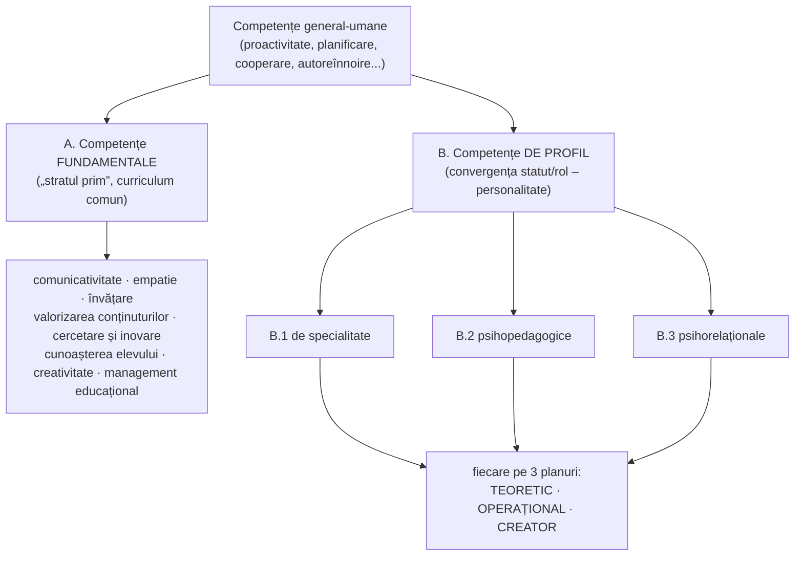
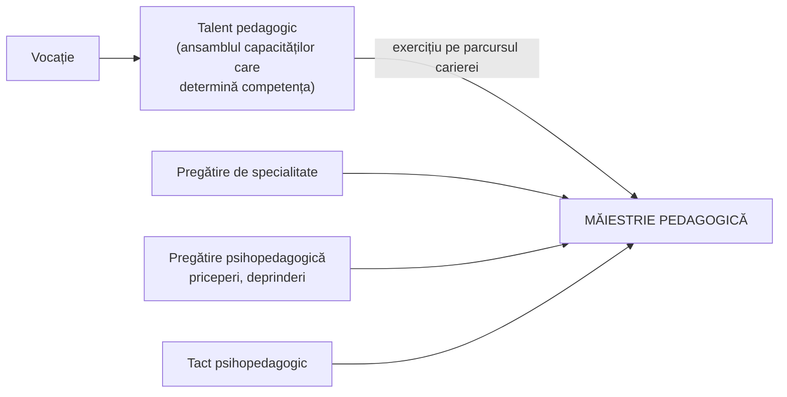

↑ [[Modulul 09 - Agenții educației și factorii dezvoltării]] · ← [[8.6 Managementul educației și reforma]] · → [[9.2 Profesorul postmodernist - facilitator al cunoașterii]]

> [!abstract] Pe scurt
> - **Profesorul** este **agent al acțiunii educative** și exercită un set de **roluri**: furnizor de informații, expert al predării–învățării–evaluării, cercetător, agent motivator, manager, consilier, tehnician/metodolog, evaluator.
> - **Referențialul profesional** (în literatura anglofonă: **standard profesional**) este „fișa” competențelor cadrului didactic. Se construiește pe **paradigme** ale meseriei: profesorul **instruit, tehnician, artizan, practician reflexiv, actor social, persoană**.
> - **Competența profesională** reunește capacități cognitive, afective, motivaționale și manageriale care, împreună cu trăsăturile de personalitate, fac activitatea eficientă. Manualul trece în revistă mai multe **tipologii** (Negură–Papuc–Pâslaru, M. Călin, N. Mitrofan, Jinga & Istrate etc.).
> - **Stilul educațional** este o **manieră relativ constantă** de lucru cu elevii. Tipologiile (autoritar/democratic/laissez-faire, nomotetic/ideografic etc.) sunt **cadre de referință**: în realitate există doar stiluri individuale.
> - **Calitățile** profesorului sunt intelectuale, moral-afective și moral-volitive. Prin exercițiu, **talentul pedagogic** și **tactul psihopedagogic** duc la **măiestria pedagogică**.

---

# PARTEA I — Ce spune manualul

## 0. Deschiderea modulului (p. 307)

- Motto: J.-J. Rousseau — omul se formează prin educație, așa cum plantele se formează prin cultivare.
- **Competențe vizate**: definirea conceptelor; analiza personalității profesorului din perspectivă postmodernă; descrierea rolurilor; construirea **referențialului** de competențe; distingerea **stilurilor**; explicarea eficienței activității **dirigintelui**; valorificarea factorilor dezvoltării și a factorilor educativi.
- **Concepte de bază**: profesor școlar, profesor diriginte, personalitate, agent al acțiunii educative, competență, referențial al competențelor profesionale, standard profesional, măiestrie pedagogică, tact psihopedagogic, vocație, stil educațional, comportament, educabilitate, factorii formării personalității.

## 1. Profesorul ca agent al educației (p. 308)

- Profesorul e **agent al acțiunii educative** și obiect al unor cercetări **pluridimensionale**: pedagogice, psihologice, psihosociale, axiologice.
- Aceste studii definesc **dimensiunile profesionalismului**: gradul în care profesorul stăpânește un ansamblu de competențe care îi asigură **dezvoltarea continuă** și **eficiența profesională** (după M. Călin).

## 2. Rolurile profesorului (p. 308)

Rolurile decurg din obiectivele fixate în documentele școlare:

| Rol | Ce face profesorul |
|---|---|
| **Furnizor de informații** | transmite cunoștințe |
| **Resursă / expert** al predării–învățării–evaluării | analizează, consultă |
| **Cercetător** | se documentează, reflectează, studiază fenomenele educaționale și personalitatea elevului, experimentează, **inovează** |
| **Agent motivator** | facilitează inițiativele, stârnește interesul, curiozitatea, dorința de a învăța |
| **Manager** | gestionează clasa; relațiile cu colegii, părinții etc. |
| **Consilier** | observă, îndrumă persuasiv, oferă sfaturi, soluții, strategii |
| **Tehnician / metodolog** | proiectează și realizează activități, elaborează mijloace didactice, definește progresul elevilor, folosește audiovizualul |
| **Evaluator** | examinează, apreciază, ia decizii evaluative |

> [!tip] De reținut
> Rolurile nu sunt separate. Din **multitudinea rolurilor** derivă **multitudinea competențelor**, iar legătura dintre ele se vede în **stilul individual** (concluzia de la p. 349).

## 3. Contextul: reforma din R. Moldova și întrebările-cheie (p. 308–309)

- Reforma învățământului cere profesori **flexibili profesional**, capabili să se adapteze permanent la schimbările din societate, învățământ, cultură și la „condiția internă” a educatului. Elevul trebuie să devină, în final, **obiectul propriei formări**.
- Patru întrebări structurează portretul profesorului eficient:
  1. Ce **trebuie să știe**?
  2. Ce **trebuie să poată face**?
  3. Ce **atitudini** trebuie să-și formeze?
  4. Cum își **dezvoltă permanent** competențele și personalitatea?

## 4. Referențialul profesional (p. 309)

> [!quote] Definiție
> **Referențialul profesional** este o **fișă a competențelor profesionale** ale cadrului didactic, care îi permit să atingă cu succes obiectivele educative. Servește drept **cadru de referință** pentru autorii de curriculum pedagogic și pentru formatorii de cadre didactice.

- Termeni echivalenți: **referențial profesional** (literatura francofonă) = **standard profesional** (literatura anglofonă) = **profesiogramă** (literatura rusă, până în anii '90).
- Referențialul se structurează pe **paradigme**. Aici paradigma înseamnă un **„nod” de principii, concepte și idei generale** care determină felul în care percepem și abordăm o realitate.

## 5. Paradigmele formării profesorului (p. 309–311)

### 5.1. Clasificarea atribuită lui K. M. „Zechner” (p. 309–310)

Manualul anunță **6 modele**, dar descrie **4 paradigme**:

| Paradigmă | Conținut |
|---|---|
| **Comportamentală** | capacități didactice dobândite într-o **instituție de formare** |
| **Artizanală** | competențe însușite **pe teren**, în practică |
| **Critică** | aptitudini de **cercetare** și **reflecție critică** asupra propriei activități. Profesorul sesizează problemele și le depășește prin cercetare, transformând stările dorite în stări reale |
| **Personalistă** | competențe pentru **dezvoltarea profesională pe tot parcursul vieții**, de tip ***savoir devenir*** („a ști să devii”) |

### 5.2. Cele șase paradigme (p. 310–311)

Un grup de cercetători din R. Moldova (**I. Negură, L. Papuc, Vl. Pâslaru**) a analizat cercetările de după Zechner (Calderhead 1992, Grootaers–Tilman 1991, Paquay 1994). Pe această bază au formulat un **referențial al competențelor didactice** în **6 paradigme**, adică reprezentări despre principalele roluri-funcții ale profesorului:

| # | Paradigma | Portret | Obiectiv dominant al formării (Tabelul 4, p. 311) |
|---|---|---|---|
| 1 | **Profesorul instruit** | știe multe, e sursă de cunoștințe, „doct în domeniu” | **Cunoștințe** |
| 2 | **Profesorul tehnician** | stăpânește și aplică tehnici pedagogice concrete | **Competențe procedurale** |
| 3 | **Profesorul artizan** | a învățat meseria pe teren, cu scheme de acțiune adaptate contextului; practică pedagogia **ca artă** | **Experiență** |
| 4 | **Practicianul reflexiv** | își construiește cunoștințe **sistematice și comunicabile** din propria experiență; „învață de la sine însuși” | **Reflecție pedagogică** |
| 5 | **Profesorul – actor social** | se implică în **proiecte educaționale colective** și își folosește competențele sociale | **Angajare** |
| 6 | **Profesorul ca persoană** | relația profesională **cu sine** și cu propria dezvoltare (*savoir devenir*); motivație de **autoactualizare** | **Atitudini și aptitudini de autoactualizare** |

> [!tip] De reținut
> Fiecărei paradigme îi corespunde un **obiectiv de formare** formulat în termeni de competență. Un referențial complet le **integrează** pe toate șase, nu alege una singură.

## 6. Competența: definiții și tipologii (p. 312–318)

### 6.1. Definiții (p. 312)

- Calitatea serviciilor educaționale depinde de competențele formate în **pregătirea inițială** (universitate) și **continuă** (cursuri, perfecționare, învățământ la distanță).

> [!quote] Definiție
> **Competența** este capacitatea de a **soluționa eficient probleme**, de a **lua decizii adecvate** și de a **exercita roluri profesionale** cu rezultate recunoscute ca bune.

- **Competent în științele educației** este cel bine informat, recunoscut ca **autoritate** în aprecierea științifică a fenomenelor educaționale și capabil să asigure eficiența serviciilor educaționale.
- Competența e apreciată **din exterior**: de elevi, colegi, inspectori, părinți, comunitatea locală.

### 6.2. Competențele general-umane pentru un rol social (Papuc, Negură, Pâslaru; p. 312–313)

1. **proactivitate**: comportament ales conștient, pe baza **valorilor**, nu a stărilor afective;
2. **proiectarea finalului**: formularea finalităților, anticiparea activității și a rezultatelor;
3. **planificarea după priorități**;
4. **raționamentul „avantaj/avantaj”**: conducere interpersonală, conștientizare, imaginație, conștiință morală, voință, autonomie în relații;
5. **a înțelege și a fi înțeles**;
6. **cooperare creativă**, **comunicare sinergică**, valorificarea diferențelor;
7. **autoreînnoire echilibrată**: fizică, spirituală, mentală, socioafectivă. Este competența care le face posibile **pe toate celelalte**.

Pe acest fundament se construiesc competențele **specifice profesiei**:

### 6.3. Structura competențelor profesionale (p. 313–316)

**A. Competențe fundamentale** (p. 313): derivă din obiective, conținuturi și rolurile profesorului. Formează **„stratul prim”** al formării: comunicativitate, empatie, învățare, valorizarea conținuturilor, cercetare și inovare, cunoașterea elevului, creativitate, management educațional. Cer un **curriculum comun** pentru toate facultățile care formează cadre didactice.

**B. Competențe de profil** (p. 313): **profilul de competență** este zona de **convergență dintre statut/rol și personalitate**, analizată din perspectiva eficienței socioprofesionale. Personalitatea educatorului funcționează ca un **„filtru”** care dă direcție întregului demers educativ.

| | Planul teoretic | Planul operațional | Planul creator |
|---|---|---|---|
| **B.1. De specialitate** (p. 314) | asimilarea conținuturilor științifice și a valențelor lor formative; corelații **intra-, inter-, pluridisciplinare**; actualizarea curriculumului disciplinar | structurarea conținuturilor pentru a dezvolta structuri operatorii, afective, motivaționale, volitive, atitudinale; formarea **modului de gândire specific disciplinei** și a gândirii sistemice | adaptarea curriculumului la vârstă; stimularea **potențialului maxim** al fiecărui copil; învățare participativă, anticipativă, creatoare; actualizarea strategiilor |
| **B.2. Psihopedagogice** (p. 314–315) | cunoașterea teoriei educației, instruirii, curriculumului, evaluării, cercetării, managementului, psihologiei (generale, a vârstelor, sociale); înțelegerea concepției educaționale contemporane și a raportului psihologie pedagogică – didactică – didactici speciale | identificarea problemelor elevului și ale grupului; decizii în situații educaționale; **„personalizarea” curriculumului dirigintelui**; proiectarea educației **formale, nonformale, informale**; conducerea predării–învățării–evaluării; dezvoltarea motivației, afectivității, voinței, creativității; **investigații ameliorative** | empatie; adaptare la **situații atipice**; inovare; dezvoltarea aptitudinilor |
| **B.3. Psihorelaționale** (p. 315–316) | psihologia și pedagogia socială, psihologia grupurilor școlare, a învățării, a creativității, managementul comportamentului | coordonarea grupului de elevi și de părinți (**parteneriat**); comunicare; facilitarea relațiilor; empatie; motivarea grupului (promovând **„asemănarea în diferențe”**); acordarea treptată a **autonomiei**; transformarea grupului într-un **mediu educogen**; **toleranță** | — (nu e detaliat) |

### 6.4. Alte tipologii ale competențelor (p. 316–318)

| Autor | Tipologia |
|---|---|
| **M. Călin** (1996) | 1) **comunicativă**: inițierea comunicării, pe cale verbală și nonverbală; 2) **informațională**: repertoriul de cunoștințe, noutatea lor; 3) **teleologică**: formularea rezultatelor ca scopuri informaționale, axiologice, pragmatice, operaționalizate; 4) **instrumentală**: folosirea metodelor și mijloacelor; 5) **decizională**: alegerea între cel puțin două variante; 6) **apreciativă**: măsurarea corectă a rezultatelor |
| **N. Mitrofan** (1988) | **politico-morală** (conduita etico-morală; legătura dintre finalitățile macro- și microstructurale) · **profesional-științifică** (cunoașterea disciplinei, autoformare) · **psihopedagogică** („construirea” personalității elevilor) · **psihosocială** (relații interumane, asumarea responsabilităților), toate **în interacțiune** |
| **Dragu** (1996) | politică, morală, psihologică, profesională, socială |
| **I. Manciuc** (1998) | de bază → de specializare în profesiunea didactică → specifice (didactica aplicată) |
| **R. Niculescu** (2000) | fundamentale, de specialitate, psihopedagogice, psihorelaționale |
| **I. Jinga, E. Istrate** (1998) | de specialitate, psihopedagogică, psihosocială și managerială |
| **D. Potolea** (1989), **I. T. Radu** (1996) | derivă competențele din **funcțiile predării–învățării** |

### 6.5. Competența profesională: definiția de sinteză (p. 318)

> [!quote] Definiție (după Jinga & Istrate)
> **Competența profesională** a educatorilor cuprinde **capacitățile cognitive, afective, motivaționale și manageriale** care, **interacționând cu trăsăturile de personalitate**, îi dau educatorului calitățile necesare unei activități eficiente. Eficiența înseamnă că **majoritatea elevilor** ating obiectivele, iar performanțele lor se apropie de **nivelul maxim al potențialului** fiecăruia.

- După **N. Mitrofan**, competențele depind de **aptitudinile pedagogice** și de **nivelul culturii profesionale**: organizarea superioară a proceselor cognitive, afective, psihomotorii (cu suport axiologic), manifestată în crearea modelelor de predare–învățare–evaluare și în relația cu elevii.

## 7. Stilul educațional (p. 318–321)

### 7.1. Definiție (p. 318–319)

- **Ansamblul competențelor determină stilul educațional**. Conceptul (numit și **„stil de predare”**) s-a impus **relativ recent**, din cercetările asupra comportamentului didactic și a relației profesor–elevi.

> [!quote] Definiție
> **Stilul educațional** este o **manieră de lucru relativ constantă** cu elevii. Depinde de **personalitatea** profesorului, de **cultura, pasiunea și experiența** lui și de situațiile pedagogice pe care le identifică și le ameliorează. Poate fi și rezultatul unui tip de **adaptare psihologică și deontică**.

- Este o **constelație de trăsături** care arată **nota personală** a fiecărui profesor. Chiar dacă stilurile au aceleași elemente, **ponderea și modul de corelare** diferă de la un profesor la altul.

### 7.2. Tipologia lui M. Călin (p. 319)

1. **cognitiv-creativ**: deschis la inovație;
2. **rutinar**: închis la inovație;
3. **perceptiv**: selectează informațiile necesare din surse diferite;
4. **directiv**: îndrumare riguroasă;
5. **nondirectiv**: favorizează independența elevilor;
6. **autoritar**: profesor distant;
7. **democratic**: amabil, înțelegător, facilitator, persuasiv, cooperant;
8. **apreciativ**: modul personal de a interpreta și evalua situațiile.

### 7.3. Tipologia lui I. Nicola (p. 319–320)

| Pereche / grup de stiluri | Criteriul |
|---|---|
| **democratic – autoritar – laissez-faire** | modul de conducere |
| centrat **pe elev** – centrat **pe grup** | ținta acțiunii |
| **autoritarist** – **liberalist** (nondirectivist) | gradul de control |
| **punitiv** (constrângere, stimulare aversivă) – **nepunitiv/afectuos** („căldură” sufletească, motivație intrinsecă) | tipul de întărire |
| **normativ** (respectarea întocmai a normelor) – **operațional-concret** (rezolvarea problemei în context) | raportul normă–situație |
| **interogativ** (conversație) – **expozitiv** (expunere și ascultare) | metoda dominantă |
| **nomotetic** – **ideografic** | orientarea spre instituție sau spre persoană |

- **Stilul nomotetic**: accent pe **dimensiunea normativă**. Primează imperativele sociale și presiunile instituționale, înaintea nevoilor copilului. Profesorul caută procedee care să răspundă cerințelor școlii. Rezultatul este **socializarea personalității**.
- **Stilul ideografic**: accent pe **cerințele și trebuințele copilului**. Fiecare își descoperă singur ce e relevant, iar rolul se adaptează persoanei. Rezultatul este **personalizarea rolurilor**.

> [!tip] De reținut (p. 320–321)
> - Tipologiile **nu există în stare pură** și nici ca dihotomii stricte. În realitate avem **stiluri individuale**, fiecare fiind o sinteză unică.
> - Tipologiile sunt **cadre de referință**. Alegerea uneia depinde de personalitatea, experiența și concepția filosofică a profesorului, dar și de particularitățile elevilor și de contextul organizațional.
> - **Eficiența unui stil nu se apreciază în sine**, ci doar raportat la **personalitatea profesorului** și la **contextul psihosocial**.

## 8. Calitățile profesorului (p. 321–324)

Calitățile sunt **dispoziții** ale structurii psihice care se dezvoltă în condiții potrivite de educație și mediu. Țin de **intelect, afectivitate și voință**.

| Grupa | Calități |
|---|---|
| **1. Intelectuale** (p. 321) | **inteligență** (comuniune continuă cu clasa); **gândire** vie, inventivă, dar ordonată, analitică și sintetică, clară; **memorie mobilă** (corelații între discipline); **spirit de observație** și **atenție distributivă** (supraveghează clasa și se autocontrolează); **imaginație** bogată; **limbaj** bogat, format prin lectură variată |
| **2. Moral-afective** (p. 322) | climat de **calm și voioșie**, cu distanța cuvenită; profesor **cald, binevoitor**; atmosferă sinceră, de **încredere reciprocă**, optimism, generozitate |
| **3. Moral-volitive** (p. 322–323) | **fermitate și energie**; **răbdare, perseverență, dârzenie, intransigență**; **tact și stăpânire de sine** în situații tensionate (fără apostrofări, amenințări, jigniri, care scad prestigiul și afectează disciplina); **curajul inovației** (metodologie, conținut); **voință consecventă** și **simțul măsurii** |

- Calitățile volitive se dezvoltă în **activitatea zilnică**, în lupta cu inerția și cu obstacolele. O activitate condusă la acest nivel dă cale liberă **potențialului creator** al elevilor și formează la ei trăsături de voință și caracter (p. 323).

### 8.1. Vocația (p. 322)

- Pedagogul francez **R. Hubert**: vocația pedagogică decurge din **dragostea pentru copii** și din nevoia de **a te dărui** lor, ajutându-i să se realizeze pentru ei înșiși și pentru societate.

> [!quote] Definiție
> **Vocația** înseamnă **aptitudini puternic integrate** în personalitate: aptitudini specifice, atitudini și trăsături de caracter care corespund **pasiunii** pentru profesie, **competenței** și **responsabilității** didactice.

- Apropierea de elevi îi permite profesorului să le **înțeleagă lumea lăuntrică** și să organizeze activitatea astfel încât aceștia să-și pună în valoare înclinațiile, aptitudinile, talentele.

### 8.2. Talentul pedagogic, măiestria, tactul (p. 323–325)

- **Talentul pedagogic** este ansamblul capacităților care determină competența profesională și care, pe parcursul carierei, duc la **măiestrie pedagogică** (p. 323).
- **Măiestria pedagogică** înseamnă **armonizarea la nivel optim** a teoriei educației cu **tactul pedagogic** și cu priceperile și deprinderile de organizare a activității, pentru cele mai bune rezultate (p. 325).

> [!quote] Definiție (p. 325)
> **Tactul psihopedagogic** este o **componentă a măiestriei pedagogice**: capacitatea personală a profesorului de a acționa **selectiv, adecvat, simplu, dinamic**, cu **sinceritate și fidelitate** față de elevi, **creator și eficient**, în cele mai variate situații educaționale.

## 9. Formarea și perfecționarea profesorului (p. 324–326)

- Meseria se dobândește în **instituții specializate** (educatoare, învățători, profesori). **Selecția** candidaților rămâne o **problemă deschisă**. Manualul consideră firesc ca formarea profesorilor să aibă **prioritate la recrutare** (p. 324).
- După absolvire, **perfecționarea** devine **obligație**. Se face **individual** și **organizat**: consilii pedagogice, catedre, comisii metodice, cercuri pedagogice, cursuri de perfecționare, examene de definitivare și de grade didactice, doctorat, sesiuni metodico-științifice, colocvii, simpozioane.
- **Scopul educativ**, bine cunoscut, mobilizează profesorul spre **autoperfecționare**.
- **Pregătirea de specialitate** (p. 324–325):
  - permite formarea la elevi a unui sistem trainic de cunoștințe, priceperi și deprinderi;
  - folosește conținutul lecțiilor pentru modelarea intelectuală, morală, estetică, fizică;
  - **contribuie cel mai mult la prestigiul real** al profesorului și la poziția lui de **lider**.
- **Pregătirea psihopedagogică** (priceperi, deprinderi, tact, măiestrie) este **indispensabilă**, dar **inutilă fără pregătirea de specialitate**. Orice profesor trebuie să studieze pedagogia generală, didactica, teoria educației, metodica de specialitate, psihologia copilului, igiena școlară (p. 325).
- **Orizontul cultural bogat** îi permite să răspundă întrebărilor neașteptate ale elevilor și dă clasei **vivacitate**, dincolo de obligația rigidă (p. 326).

## 10. Concluziile modulului privind profesorul (p. 349–350) și temele de reflecție (p. 351)

- Concluziile reiau: profesorul ca agent; cele 8 roluri; definiția referențialului; definiția competenței profesionale; definiția stilului educațional.
- Teme: identificați rolurile profesorului și argumentați necesitatea lor; **relația dintre competențe și stilul preferențial**. *Exercițiu de creativitate*: un set de roluri indispensabile profesorului postmodern, cu competențele și capacitățile corespunzătoare (→ [[9.2 Profesorul postmodernist - facilitator al cunoașterii]]).

---

# PARTEA II — Completări

## 11. Originea reală a paradigmelor: Zeichner (1983) și Paquay (1994)

- **Kenneth M. Zeichner**, *Alternative Paradigms of Teacher Education*, **Journal of Teacher Education**, 34(3), 1983. Descrie **patru** paradigme ale formării profesorilor: **behavioristă** (*behavioristic*), **personalistă**, **tradițional-artizanală** (*traditional-craft*) și **orientată spre investigație** (*inquiry-oriented*, reflexiv-critică). Numărul **patru** din manual este corect. Anunțul „6 modele” este greșit.
- **Léopold Paquay**, *Vers un référentiel des compétences professionnelles de l'enseignant ?*, **Recherche et formation**, nr. 16, 1994, p. 7–38:
  - pornește de la cele 4 paradigme ale lui Zeichner (sintetizate de Calderhead, 1992);
  - le pune în corespondență cu dimensiunile predării după **Grootaers & Tilman (1991)**;
  - propune **șase „etichete”** ale profesorului: *maître instruit, technicien, praticien-artisan, praticien réflexif, acteur social, personne*.
  
  Tot de la Paquay vin **definiția paradigmei** ca „nucleu de principii” și ideea că fiecărei paradigme îi corespund **competențe și strategii de formare** prioritare.

> [!note] Comentariu
> Cele **6 paradigme** din manual sunt **modelul lui Paquay (1994)**, preluat și adaptat de Negură, Papuc și Pâslaru (2000). Formularea din manual („au construit un referențial…”) poate lăsa impresia unei contribuții originale moldovenești. Contribuția lor este **adaptarea** modelului la curriculumul psihopedagogic universitar din R. Moldova. Paquay a reluat modelul în volumul colectiv **Paquay, Altet, Charlier, Perrenoud (coord.)**, *Former des enseignants professionnels* (De Boeck, 1996).

## 12. Sursa nemenționată a „competențelor general-umane”: Covey (1989)

Lista de la p. 312–313 urmează, aproape punct cu punct, cele **7 deprinderi** din **Stephen R. Covey**, *The 7 Habits of Highly Effective People* (1989):

| Manual (Papuc, Negură, Pâslaru) | Covey (1989) |
|---|---|
| a fi proactiv, conform valorilor | *Be proactive* |
| a „proiecta finalul în memorie” | *Begin with the end in mind* |
| a planifica după priorități | *Put first things first* |
| a raționa „avantaj/avantaj” | *Think win-win* |
| a înțelege și a fi înțeles | *Seek first to understand, then to be understood* |
| cooperare creativă, comunicare sinergică | *Synergize* |
| autoreînnoire fizică, spirituală, mentală, socioafectivă | *Sharpen the saw*: exact aceleași **patru dimensiuni** ale reînnoirii |

> [!note] Comentariu
> Sunt competențe de **eficacitate personală** din literatura de management și dezvoltare personală, nu competențe didactice propriu-zise. „Proiectarea finalului în memorie” este o traducere stângace a lui *begin with the end in mind* („începe având în minte rezultatul final”).

## 13. Cunoașterea profesională a profesorului: Shulman și cercetările de eficiență

| Autor, lucrare | Contribuție |
|---|---|
| **Lee S. Shulman**, *Those Who Understand: Knowledge Growth in Teaching* (Educational Researcher, 1986); *Knowledge and Teaching* (Harvard Educational Review, 1987) | ***Pedagogical Content Knowledge*** (**PCK**): cunoașterea specifică a felului în care **o anumită materie** devine predabilă (reprezentări, exemple, concepții greșite tipice ale elevilor). E mai mult decât suma „specialitate + pedagogie” și dă temei **legăturii** dintre competențele B.1 și B.2 |
| **Donald A. Schön**, *The Reflective Practitioner* (1983); *Educating the Reflective Practitioner* (1987) | ***reflection-in-action*** (în timpul acțiunii) și ***reflection-on-action*** (după acțiune). Este fundamentul paradigmei **„practicianului reflexiv”** |
| **Fred Korthagen** et al., *Linking Practice and Theory* (2001); articolul despre modelul „cepei” (*Teaching and Teacher Education*, 2004) | **modelul ALACT** al reflecției: *Action – Looking back – Awareness of essential aspects – Creating alternatives – Trial*. **Modelul „cepei”**: niveluri de la mediu și comportament, spre competențe, convingeri, identitate, „misiune”. Corespunde paradigmei **„profesorul ca persoană”** |
| **Linda Darling-Hammond**, *Teacher Quality and Student Achievement* (Education Policy Analysis Archives, 2000); *Powerful Teacher Education* (2006) | pregătirea și certificarea profesorilor se asociază cu rezultatele elevilor; programele de formare eficiente leagă strâns teoria de practica supervizată |
| **John Hattie**, *Visible Learning* (2009); *Visible Learning: The Sequel* (2023) | sinteză a peste 800 de meta-analize (în 2009). Printre factorii cu efect mare: **feedbackul**, **claritatea profesorului**, relația profesor–elev, iar în actualizări **eficacitatea colectivă a profesorilor**. Mesajul: „ce fac profesorii” contează mai mult decât structurile |
| **Charlotte Danielson**, *Enhancing Professional Practice: A Framework for Teaching* (1996; ed. 2007, 2013) | referențial în **4 domenii**: 1) **planificare și pregătire**; 2) **mediul clasei**; 3) **instruire**; 4) **responsabilități profesionale**, cu componente și niveluri de performanță. Este un exemplu de **„standard profesional”** în sens anglofon |

## 14. Standardele profesionale ale cadrelor didactice în R. Moldova

- **Codul Educației nr. 152/2014**:
  - art. **53**: categoriile de personal și **funcțiile didactice**;
  - art. **132**: cerințele minime de calificare, de ex. pentru gimnaziu cel puțin nivelul 6 ISCED (licență) și **modulul psihopedagogic**;
  - art. **133**: **formarea profesională continuă** este **obligatorie pe tot parcursul activității**, cu **credite de dezvoltare profesională**;
  - art. **134**: drepturile personalului didactic;
  - art. **135**: obligațiile personalului didactic.
  
  Numerotarea e cea din versiunea consolidată consultată.
- ***Standardele de competență profesională ale cadrelor didactice din învățământul general***, aprobate prin **Ordinul ministrului educației nr. 623 din 28 iunie 2016**. Au fost pilotate în 2016–2018 și sunt structurate pe **5 domenii de competență**:
  1. **Proiectarea didactică**;
  2. **Mediul de învățare**;
  3. **Procesul educațional**;
  4. **Dezvoltarea profesională**;
  5. **Parteneriate educaționale**.
  
  Fiecare domeniu are standarde, indicatori și descriptori.
- În **2025**, Ministerul Educației și Cercetării a aprobat o nouă versiune a standardelor (**Ordinul MEC nr. 1657 din 22.09.2025**). Structura exactă a noii versiuni este **(de verificat)** în documentul oficial.
- ***Codul de etică al cadrului didactic***, aprobat prin **Ordinul Ministerului Educației nr. 861 din 07.09.2015** (publicat în Monitorul Oficial în martie 2016). Prevede norme de conduită și **consilii de etică** în instituții.

> [!note] Comentariu
> Manualul (2014) vorbește despre referențiale în general, dar **nu menționează standarde oficiale**, pentru că acestea au apărut în 2016. Azi „referențialul” are în R. Moldova o formă normativă. Domeniile standardelor din 2016 seamănă cu cele ale lui **Danielson** (proiectare – mediu – instruire – responsabilități profesionale), la care se adaugă **parteneriatele**.

## 15. TALIS (OCDE)

- ***Teaching and Learning International Survey*** (**TALIS**), OCDE: sondaj internațional despre **profesori și directori**. Urmărește condițiile de muncă, formarea continuă, practicile didactice, climatul școlar și **auto-eficacitatea** profesorilor. Cicluri: **2008, 2013, 2018, 2024**.
- **România** a participat, inclusiv la TALIS 2024. **R. Moldova nu figurează** printre participanții la TALIS 2024.
- Relevanță: TALIS arată empiric cât de important e **dezvoltarea profesională colaborativă** (observare reciprocă, învățare între colegi) pentru încrederea profesorilor în propria eficacitate. Ideea completează paradigma **„actorului social”**.

## 16. Stilurile educaționale: sursele clasice

| Tipologie | Sursa | Precizări |
|---|---|---|
| **Autoritar – democratic – laissez-faire** | **K. Lewin, R. Lippitt, R. K. White**, *Patterns of Aggressive Behavior in Experimentally Created „Social Climates”* (Journal of Social Psychology, 1939) | experimente cu grupuri de băieți conduse de adulți în trei „climate”. **Autoritar**: productivitate în prezența liderului, ostilitate, dependență. **Democratic**: implicare, originalitate, continuarea lucrului și fără lider. **Laissez-faire**: cea mai slabă organizare și productivitate |
| **Nomotetic – ideografic** (+ tranzacțional) | **J. W. Getzels & E. G. Guba**, *Social Behavior and the Administrative Process* (School Review, 1957) | modelul dimensiunii **instituționale** (roluri, așteptări) și **personale** (personalitate, trebuințe). Stilul **tranzacțional** echilibrează cele două dimensiuni. Manualul omite sursa și **al treilea stil** |
| **Dominativ – integrativ** | **H. H. Anderson** (studii din 1939–1946) | profesorul „integrativ” acceptă și dezvoltă ideile elevilor. Profesorul „dominativ” impune. De aici vine noțiunea de **„profesor integrat”** citată în 9.2 (după Flanders) |
| **Influență directă – indirectă** | **N. A. Flanders**, *Teacher Influence, Pupil Attitudes, and Achievement* (1965) | **FIAC** (*Flanders Interaction Analysis Categories*): 10 categorii de comportament verbal în clasă, observate la intervale de 3 secunde |
| **Stiluri parentale** (analogie utilă) | **D. Baumrind** (1966, 1971); **Maccoby & Martin** (1983) | **autoritativ** (exigență + căldură) · **autoritar** · **permisiv**, plus **neglijent**. Clasa „autoritativă” (reguli clare și suport afectiv) este echivalentul educațional al stilului democratic |
| **Comportamentul interpersonal al profesorului** | **Th. Wubbels** și colab. (anii '80–'90), *Questionnaire on Teacher Interaction* | două axe: **influență** (dominanță – supunere) și **proximitate** (cooperare – opoziție). Arată că stilul **nu e unidimensional**, ceea ce confirmă că dihotomiile din manual sunt simplificări |

> [!note] Comentariu
> Manualul spune corect că eficiența stilului **nu se apreciază în sine**. Totuși, cercetările din anii '90–2000 (Wubbels, dar și sintezele lui Hattie despre relația profesor–elev) indică o tendință robustă: profesorii care combină **structura clară** cu **căldura** obțin rezultate mai bune decât cei care au doar una dintre ele.

## 17. Calitățile, vocația și aptitudinea pedagogică: tradiția românească

- **Nicolae Mitrofan**, *Aptitudinea pedagogică* (EDP, 1988): aptitudinea pedagogică văzută ca sistem de însușiri, nu ca „dar” unic. Include **competența științifică, psihopedagogică, psihosocială**. E sursa directă a tipologiei de la p. 317.
- **René Hubert**, *Traité de pédagogie générale* (PUF, 1946): tratat citat pentru ideea de **vocație** (dragostea pentru copii).
- **Ioan Jinga, Elena Istrate (coord.)**, *Manual de pedagogie* (ALL, 1998): definiția competenței profesionale de la p. 318.
- **Andrei Cosmovici, Luminița Iacob (coord.)**, *Psihologie școlară* (Polirom, 1998): capitole despre **personalitatea profesorului** și relația profesor–elev.

## 18. Comentariu critic

> [!warning] Erori, inconsecvențe, simplificări
> 1. **„Zechner”** = **Kenneth M. Zeichner**. Manualul anunță **„6 modele”**, dar descrie **4**, iar Zeichner are într-adevăr 4 paradigme. Cele **6 paradigme** aparțin lui **L. Paquay (1994)**, nu grupului moldovenesc. Alte nume sunt deformate: **„Golderhead”** = **Calderhead**; **„Paquai”** = **Paquay**; „Grootaers Tilman” = **Grootaers & Tilman**.
> 2. **Covey nemenționat**: „competențele” de la p. 312–313 reproduc cele 7 deprinderi ale lui Covey (1989), fără trimitere.
> 3. **Trimitere greșită**: stilurile lui I. Nicola sunt citate „[8, p. 368]”, dar poziția 8 din bibliografie este **E. Macavei**. Nicola este la poziția 7.
> 4. Autori citați care **lipsesc din bibliografia modulului**: Manciuc (1998), Niculescu (2000), Potolea (1989), Radu (1996), Hubert. „Dragu (1996)” nu corespunde intrării „Dragu, Cristea, 2003”.
> 5. **Diriginte**: competențele modulului promit explicarea eficienței activității **dirigintelui**, iar „profesor diriginte” apare printre conceptele de bază, dar **nu există secțiune** despre diriginte (doar o mențiune la p. 315).
> 6. **Tipologiile de stiluri** sunt **liste eterogene**: la M. Călin, „perceptiv” și „apreciativ” sunt stiluri cognitive, iar „autoritar/democratic” sunt stiluri de conducere. Criteriile de clasificare sunt amestecate și nu sunt citate sursele empirice (Lewin et al., Getzels & Guba).
> 7. **Repetiții**: definițiile referențialului, competenței și stilului apar din nou, identic, în concluzii (p. 349–350). Tabelul competențelor B.3 nu are plan creator, deși schema anunță trei planuri.
> 8. **Datare**: secțiunea despre calitățile profesorului (p. 321–326) are un **stil normativ-moralizator**, tipic manualelor din anii '70–'80 („disciplina severă a muncii”, „înarmarea elevilor cu cunoștințe”). Contrastează cu perspectiva postmodernă din 9.2. Manualul **nu menționează standardele profesionale oficiale** (apărute în 2016), cercetările de eficiență (Hattie) sau conceptul **PCK**.
> 9. **Ortografie și redactare**: „pedagogieii”, „aroape”, „sa făcut” etc. Enumerarea disciplinelor la B.2 teoretic este gramatical confuză.

## 19. Întrebări de autoverificare

1. Enumerați cele opt roluri ale profesorului și dați câte un exemplu concret de activitate pentru fiecare.
2. Ce este un referențial profesional? Prin ce se deosebește de „profesiogramă” și ce corespondent are în literatura anglofonă?
3. Prezentați cele șase paradigme ale formării profesorului și obiectivul dominant al fiecăreia. Cui îi aparține, de fapt, modelul?
4. Definiți competența profesională și explicați distincția dintre competențele fundamentale și cele de profil.
5. Comparați tipologiile competențelor propuse de M. Călin și N. Mitrofan.
6. Definiți stilul educațional. De ce nu putem vorbi despre un stil „cel mai bun” în sine?
7. Explicați diferența dintre stilul nomotetic și cel ideografic. Ce al treilea stil propun Getzels & Guba?
8. Ce relație există între vocație, talent pedagogic, tact psihopedagogic și măiestrie pedagogică?
9. Care sunt domeniile Standardelor de competență profesională ale cadrelor didactice din R. Moldova (2016)?
10. Ce aduce conceptul de *pedagogical content knowledge* (Shulman) față de clasificarea „competențe de specialitate / competențe psihopedagogice”?

## Surse

- **Manual**, p. 307–326, 349–352; Călin, M. (1996). *Teoria educației*. București: ALL; Mitrofan, N. (1988). *Aptitudinea pedagogică*. București: EDP; Jinga, I., Istrate, E. (coord.) (1998). *Manual de pedagogie*. București: ALL; Negură, I., Papuc, L., Pâslaru, Vl. (2000). *Curriculum psihopedagogic universitar de bază*. Chișinău; Nicola, I. (2003). *Tratat de pedagogie școlară*. București: Aramis.
- Zeichner, K. M. (1983). Alternative Paradigms of Teacher Education. *Journal of Teacher Education*, 34(3), 3–9.
- Paquay, L. (1994). Vers un référentiel des compétences professionnelles de l'enseignant ? *Recherche et formation*, 16, 7–38.
- Paquay, L., Altet, M., Charlier, É., Perrenoud, Ph. (coord.) (1996). *Former des enseignants professionnels*. Bruxelles: De Boeck.
- Covey, S. R. (1989). *The 7 Habits of Highly Effective People*. New York: Free Press.
- Shulman, L. S. (1986). Those Who Understand: Knowledge Growth in Teaching. *Educational Researcher*, 15(2), 4–14; (1987). Knowledge and Teaching. *Harvard Educational Review*, 57(1), 1–22.
- Schön, D. A. (1983). *The Reflective Practitioner*. New York: Basic Books.
- Korthagen, F. et al. (2001). *Linking Practice and Theory: The Pedagogy of Realistic Teacher Education*. Mahwah, NJ: Erlbaum.
- Darling-Hammond, L. (2000). Teacher Quality and Student Achievement. *Education Policy Analysis Archives*, 8(1).
- Hattie, J. (2009). *Visible Learning*. London: Routledge.
- Danielson, C. (1996/2007). *Enhancing Professional Practice: A Framework for Teaching*. Alexandria, VA: ASCD.
- Lewin, K., Lippitt, R., White, R. K. (1939). Patterns of Aggressive Behavior in Experimentally Created „Social Climates”. *Journal of Social Psychology*, 10, 271–299.
- Getzels, J. W., Guba, E. G. (1957). Social Behavior and the Administrative Process. *School Review*, 65(4), 423–441.
- Flanders, N. A. (1965). *Teacher Influence, Pupil Attitudes, and Achievement*. Washington: U.S. Office of Education.
- Baumrind, D. (1971). Current Patterns of Parental Authority. *Developmental Psychology Monographs*, 4(1, Pt. 2).
- Codul Educației al Republicii Moldova nr. 152/2014, art. 53, 132–135.
- Ministerul Educației al R. Moldova (2016). *Standarde de competență profesională ale cadrelor didactice din învățământul general* (Ordinul nr. 623 din 28.06.2016); [MEC — anunțul aprobării](https://www.mec.gov.md/ro/content/au-fost-aprobate-standardele-de-competenta-profesionala-ale-cadrelor-didactice-din); [textul standardelor (PDF)](https://mecc.gov.md/sites/default/files/standarde_cadre_didactice.pdf); [Ordinul MEC nr. 1657 din 22.09.2025](https://mec.gov.md/sites/default/files/ordin_standarde_cd.pdf).
- *Codul de etică al cadrului didactic* (Ordinul ME nr. 861 din 07.09.2015); [text](https://mecc.gov.md/sites/default/files/document/attachments/codul_de_etica_ro_4.pdf).
- OECD, [TALIS — Teaching and Learning International Survey](https://www.oecd.org/en/about/programmes/talis.html).
