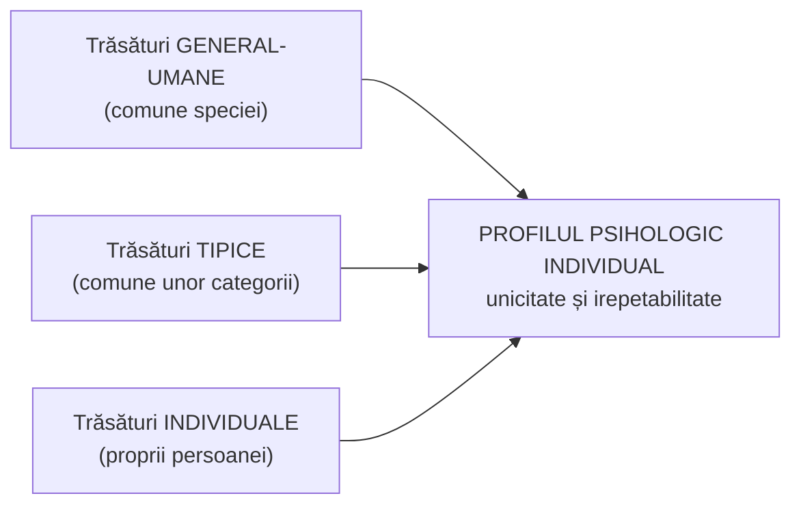

↑ [[Modulul 09 - Agenții educației și factorii dezvoltării]] · ← [[9.2 Profesorul postmodernist - facilitator al cunoașterii]] · → [[9.4 Factorii dezvoltării personalității și factorii educativi]]

> [!abstract] Pe scurt
> - Elevul se naște cu un **potențial uman** care se dezvoltă prin **socializare** și **enculturație**. Astăzi e privit ca **actor școlar**.
> - **Personalitatea** este un **sistem bio-psiho-socio-cultural**: ansamblul caracteristicilor **unice, originale, relativ stabile** care definesc individualitatea. Termenul vine din lat. *persona* („mască de teatru”).
> - Personalitatea reunește trăsături **general-umane, tipice și individuale**, sintetizate într-un **profil psihologic individual**. **Caracterul** are trăsături precum integrarea, conștiința morală, autocontrolul, perseverența, conștiința de sine.
> - **Expectanțele** (Bandura) și **optimismul pedagogic** orientează performanța. Diferențele individuale fac imposibile **strategiile uniforme**, deci e nevoie de **tratare individuală**.
> - **Comportamentul educațional** este ansamblul **reacțiilor adaptative** ale elevului la stimulii ambianței. Între personalitate și comportament există o **intercondiționare** permanentă.

---

# PARTEA I — Ce spune manualul

## 1. Elevul: potențial, socializare, enculturație (p. 335–336)

- Elevul se naște cu un **potențial uman** care se **valorifică treptat** prin:
  - **socializare**;
  - **enculturație**, adică asimilarea **valorilor și comportamentelor** printr-o învățare continuă.
- Acțiunea educațională se concentrează asupra elevului, dar se desfășoară **în societate**. Elevul e privit ca **actor școlar**, cu toată complexitatea **devenirii personalității**.
- Personalitatea este studiată de mai multe științe: **antropologia** biologică și culturală, **sociologia**, **medicina psihosomatică**, **istoria**, **științele educației** (p. 336).

## 2. Personalitatea: definiții (p. 336)

> [!quote] Definiția 1 — perspectiva sistemică
> **Personalitatea** este un **sistem bio-psiho-socio-cultural** care se constituie în condițiile existenței și activității, începând cu **primele etape** ale dezvoltării individului în societate.

- Din punct de vedere psihologic distingem:
  - fenomene psihice **locale, accidentale, variabile**;
  - fenomene **constante, invariante** (**trăsături**, structuri). Doar acestea din urmă definesc personalitatea.

> [!quote] Definiția 2 — perspectiva structurală
> Personalitatea este un **ansamblu sistemic foarte complex** de programe, structuri profunde și trăsături, împreună cu organizarea lor, la **omul concret**. Cuprinde ceea ce e **unic, original, relativ stabil** și îl deosebește de ceilalți.

- **Etimologie**: lat. ***persona*** = **masca actorului** în teatrul roman, chipul prezentat publicului.

> [!quote] Definiția de reținut
> **Personalitatea** este **ansamblul caracteristicilor** unei persoane care îi **definesc individualitatea**, permit **identificarea** ei printre alții și îi conferă o anumită **identitate**.

- Sens comun: „a fi **o personalitate**” înseamnă a avea ceva **ieșit din comun**, care se vede în **relațiile interpersonale**.

## 3. Structura: trăsături general-umane, tipice, individuale (p. 336–337)

- Manualul citează cercetători precum **J. Piaget, Weber, Galton, Cattell, Allport**. După ei, personalitatea include:

- Trăsăturile și relațiile dintre ele **se manifestă în activitatea** subiectului.
- **Personalitatea elevului** rezultă din **intersecția unor determinisme sociale și individuale**. Se exprimă pe planurile **genetic, social, cultural și psihic**, care trebuie analizate **în interdependență** (→ [[9.4 Factorii dezvoltării personalității și factorii educativi]]).

## 4. Caracterul (p. 337–338)

- **Etimologie**: gr. ***karakter*** = **amprentă individuală**, semnul care distinge o persoană de alta.
- Manualul observă că e **greșit** să spui că cineva „**nu are caracter**”. Caracterul **există mereu**, dar poate fi **construit pe o deformare a valorilor**.

> [!quote] Definiție (p. 337)
> **Caracterul** desemnează **componenta afectiv-dinamică** a comportamentului, adică ansamblul de **trăsături diferențiale** care constituie o personalitate.

**Trăsături de caracter importante** (după R. Cattell, H. Murray, T. Thomas, G. Berger; p. 337–338):

| Trăsătură | Conținut |
|---|---|
| **Integrarea** | comportament **consecvent, punctual, conștiincios, sincer** |
| **Conștiința morală** | **simțul răspunderii** |
| **Autocontrolul** | capacitatea de a **renunța la ceva** pentru alte scopuri |
| **Perseverența** | voința de a atinge scopuri **în ciuda dificultăților** |
| **Conștiința de sine** | corectă sau **deformată** (supraestimare / subestimare) |
| **Dominanță – supunere** | tendința de a-și impune punctul de vedere sau de a se supune |
| **Curaj – frică** | |
| **Prudență – imprudență** | |

## 5. Expectanța și optimismul pedagogic (p. 338)

- Conceptul de **expectanță** și **„autoinsuficiență”** (sic!) înseamnă **credința că poți îndeplini o sarcină**.
- **Bandura (1991)** a arătat rolul **expectanțelor** în **învățarea socială**, factor important al dezvoltării personalității.
- **Profesorii eficienți** în relațiile interpersonale au un **stil interactiv pozitiv, onest, prietenos** și **competență comunicativă** (→ [[9.1 Profesorul școlar - roluri, competențe, stiluri]]).
- **Expectanțele profesorilor orientează comportamentul și performanțele elevilor** (→ efectul etichetelor, [[9.2 Profesorul postmodernist - facilitator al cunoașterii]]).
- **Optimismul pedagogic** este o **componentă necesară a succesului**.

## 6. Personalitatea ca sistem: implicații educative (p. 338)

- Educatorul trebuie să știe că personalitatea e **un sistem** și că **dinamica ei e influențată de educație**. Unele trăsături „negative” pot fi **direcționate pozitiv**.
  - Exemplu: **colericii**, datorită **forței sistemului nervos** și **predominanței excitației**, pot lua **inițiative îndrăznețe** și pot deveni **buni organizatori**.
- **Tratarea individuală** este un **principiu**: activitatea se orientează după **profilul psihologic individual**, stimulând **contradicțiile** dintre cerințele externe și potențialul intern.
- Diferențele de **stil cognitiv, creativitate, comportament, imagine de sine** fac **imposibile strategiile educative uniforme**.
- Scopul este ca fiecare elev să-și definească o **strategie personală de progres**: obiective, probleme didactice, soluții individuale.

> [!tip] De reținut (p. 338)
> Individualizarea e dificilă pentru că **instruirea** se adresează adesea unui **elev „mijlociu”**, pe când **educarea** este **puternic personalizată**.

## 7. Comportamentul educațional (p. 339)

> [!quote] Definiție
> **Comportamentul educațional** este **ansamblul reacțiilor adaptative** pe care elevul le manifestă ca **răspuns la stimulii din ambianță**.

- Între **personalitate** și **comportament** există **raporturi permanente de intercondiționare**, analizate din perspectivă **motivațională, axiologică, normativă, situațională, teleologică și sociologică**. Ele facilitează **integrarea socială** a elevului.
- **Personalitatea** ține de ceea ce e **esențial**. **Comportamentul** se **adaptează** după variabile precum **mediul** și mai ales **nivelul de educație**. De aceea se numește **„educațional”**.
- **Pedagogia** studiază personalitatea din unghiul **dezvoltării și educației**, ca să identifice strategii de stimulare a **comportamentului adecvat**.
- **Formarea personalității în ontogeneză** este un proces **ierarhic, pe niveluri**, cu armonie proprie fiecărui nivel. Acțiunea educațională **se perfecționează continuu**, după cerințele societății.

## 8. Tema de reflecție (p. 351)

- Care este **principalul obstacol** ce ține de **personalitatea elevului** în formarea **comportamentului normativ școlar**?
  - Pistă de răspuns: **imaginea de sine / auto-eficacitatea scăzută** și **expectanțele negative interiorizate** (eticheta), pe fondul diferențelor individuale ignorate de strategiile uniforme.

---

# PARTEA II — Completări

## 9. Definiții clasice ale personalității

| Autor | Definiție / contribuție |
|---|---|
| **Gordon W. Allport**, *Personality: A Psychological Interpretation* (1937); *Pattern and Growth in Personality* (1961) | personalitatea este **organizarea dinamică**, în interiorul individului, a **sistemelor psihofizice** care îi determină comportamentul și gândirea **caracteristice**. Distinge trăsăturile **cardinale, centrale, secundare**. Cu H. Odbert (1936) a inventariat cuvintele-trăsături din limba engleză (**ipoteza lexicală**, anticipată de **F. Galton**) |
| **Raymond B. Cattell** | analiza factorială a trăsăturilor și chestionarul **16PF** (16 factori primari) |
| **Henry A. Murray**, *Explorations in Personality* (1938) | teoria **trebuințelor** (*needs*) și a **presiunilor** mediului (*press*); **TAT** (Testul de Apercepție Tematică) |
| **Modelul Big Five** (**Costa & McCrae**, NEO-PI-R, 1992; **L. Goldberg**, 1990) | cinci factori: **nevrotism, extraversie, deschidere spre experiență, agreabilitate, conștiinciozitate**. **Conștiinciozitatea** e cel mai constant predictor de personalitate al **performanței școlare** |
| **Mielu Zlate**, *Eul și personalitatea* (Trei, 1997) | modelul **Eului**: eul corporal, psihologic, social, spiritual; eul real, ideal, perceput, **reflectat** (cum cred că mă văd ceilalți). Util pentru **imaginea de sine** a elevului |
| **Andrei Cosmovici**, *Psihologie generală* (Polirom, 1996) | structura personalității în **latura dinamico-energetică** (**temperamentul**), **latura instrumental-operațională** (**aptitudinile**) și **latura relațional-valorică** (**caracterul**) |

> [!note] Comentariu
> În psihologia românească (Cosmovici, Zlate, Popescu-Neveanu), **temperamentul** este latura **dinamico-energetică**, iar **caracterul** este latura **relațional-valorică**, formată social. Definiția manualului („caracterul = componenta **afectiv-dinamică**”) **suprapune caracterul peste temperament**. Exemplul cu **colericii** (p. 338) ține tot de **temperament**: tipul de sistem nervos **puternic, neechilibrat, excitabil** după I. P. Pavlov. De aceea „trăsăturile negative” ale colericului nu sunt trăsături de caracter, ci **particularități dinamice** pe care educația le poate **canaliza**.

## 10. Caracterologia franceză: cine este „G. Berger”

- **Gaston Berger**, *Traité pratique d'analyse du caractère* (PUF, 1950), continuă tipologia **Heymans – Le Senne**. Folosește trei proprietăți de bază:
  - **emotivitate** / non-emotivitate;
  - **activitate** / non-activitate;
  - **ecou** (rezonanță) **primar** / **secundar**.
  
  Din combinarea lor rezultă **8 tipuri caracteriale** (nervos, sentimental, coleric, pasionat, sanguin, flegmatic, amorf, apatic).
- „**T. Thomas**” se referă probabil la **Alexander Thomas & Stella Chess**, *Temperament and Development* (1977). Aceștia au descris tipurile de temperament infantil **„ușor”, „dificil”, „lent la încălzire”** **(identificare de verificat)**.

## 11. Auto-eficacitatea (Bandura) — termenul corect

- **Albert Bandura**:
  - *Self-Efficacy: Toward a Unifying Theory of Behavioral Change* (Psychological Review, 1977);
  - *Social Foundations of Thought and Action* (1986);
  - *Social Cognitive Theory of Self-Regulation* (1991, sursa probabilă a trimiterii din manual);
  - *Self-Efficacy: The Exercise of Control* (1997).
- **Auto-eficacitatea** (*self-efficacy*) este **credința în capacitatea proprie** de a organiza și executa acțiunile necesare unei sarcini. Termenul corect în română este **„autoeficacitate”**, **nu „autoinsuficiență”** (p. 338).
- **Cele 4 surse** ale auto-eficacității:
  1. **experiențele de reușită** (*mastery experiences*), sursa cea mai puternică;
  2. **experiențele vicariante**: să vezi pe cineva asemănător reușind;
  3. **persuasiunea verbală**: încurajarea credibilă;
  4. **stările fiziologice și emoționale**: anxietatea scade auto-eficacitatea.
- Bandura distinge **expectanța de eficacitate** („pot face asta”) de **expectanța de rezultat** („dacă fac asta, obțin X”).

> [!note] Comentariu
> Pentru profesor, cea mai eficientă cale de a crește auto-eficacitatea elevului e să îi creeze **experiențe de succes reale, la nivelul său**: sarcini gradate, feedback care arată progresul. Lauda generală, fără temei, are efect mult mai slab.

## 12. Dezvoltarea personalității elevului: teorii de referință

| Teorie | Autor, lucrare | Relevanță pentru elev |
|---|---|---|
| **Stadiile psihosociale** | **Erik H. Erikson**, *Childhood and Society* (1950) | **8 crize** ale dezvoltării. Pentru școlar: **hărnicie vs. inferioritate** (≈ 6–12 ani), cu nevoia de competență și recunoaștere. Pentru adolescent: **identitate vs. confuzie de roluri**. Eșecurile școlare repetate alimentează **sentimentul de inferioritate** |
| **Statusurile identității** | **James Marcia** (1966) | **difuzie, preluare (*foreclosure*), moratoriu, identitate realizată**. Utile în consilierea pentru carieră |
| **Dezvoltarea cognitivă** | **J. Piaget** | școlarul mic gândește în **operații concrete**, preadolescentul trece spre **operații formale** (→ [[9.2 Profesorul postmodernist - facilitator al cunoașterii]]) |
| **Zona proximei dezvoltări** | **L. S. Vygotsky** | educația „merge înaintea” dezvoltării. Personalitatea se formează prin **interiorizarea** relațiilor sociale |
| **Modelul ecologic** | **Urie Bronfenbrenner**, *The Ecology of Human Development* (1979) | comportamentul elevului e un răspuns la **sisteme încastrate**: **microsistem** (familie, clasă), **mezosistem** (relația familie–școală), **exosistem** (ex. locul de muncă al părinților), **macrosistem** (cultură, valori), plus **cronosistemul** (timpul, adăugat ulterior). Dă conținut concret formulei manualului „răspuns la stimulii din ambianță” (→ [[9.4 Factorii dezvoltării personalității și factorii educativi]]) |
| **Dezvoltarea morală** | **Jean Piaget**, *Le jugement moral chez l'enfant* (1932); **Lawrence Kohlberg** (teza din 1958 și lucrările ulterioare) | trei niveluri: **preconvențional, convențional, postconvențional**. Comportamentul normativ școlar corespunde nivelului **convențional** (conformare la reguli și așteptări) |
| **Locul controlului** | **Julian B. Rotter** (1966) | elevii cu locus **intern** atribuie reușita efortului propriu, cei cu locus **extern** atribuie reușita norocului sau altora |

## 13. Diferențele individuale și instruirea diferențiată

- **Stilurile cognitive**: **H. A. Witkin** și colab. (1977) disting **dependența** și **independența de câmp**. Stilurile cognitive sunt diferite de **„stilurile de învățare”** (vizual/auditiv/kinestezic). Ipoteza **potrivirii predării cu stilul de învățare** (*meshing hypothesis*) **nu e susținută empiric** (vezi sinteza: P. A. Kirschner, *Stop Propagating the Learning Styles Myth*, Computers & Education, 2017).
- **Instruirea diferențiată**: **Carol Ann Tomlinson**, *The Differentiated Classroom* (ASCD, 1999). Diferențierea se face după **conținut, proces, produs, mediu de învățare**, în funcție de **nivelul de pregătire, interesele și profilul de învățare** ale elevilor. Este forma operațională a „tratării individuale” din manual.
- **Mentalitatea de creștere** (*growth mindset*): **Carol Dweck**, *Mindset* (2006). Credința că abilitățile se dezvoltă prin efort se asociază cu perseverența. **Precauție**: meta-analiza **Sisk et al. (2018)** arată efecte **mici** ale intervențiilor, mai vizibile la elevii **defavorizați** sau cu **risc de eșec**.

## 14. Elevul în Codul Educației al R. Moldova

- **Art. 136**: **drepturile** elevilor și studenților. **Art. 137**: **obligațiile** elevilor și studenților. **Art. 138**: drepturile și obligațiile **părinților** sau altor reprezentanți legali.
- Comportamentul normativ școlar are, așadar, și un **cadru juridic**: obligațiile elevului sunt stabilite prin lege și detaliate în **regulamentele instituțiilor de învățământ**, iar părinții au obligații corelative.

## 15. Comentariu critic

> [!warning] Erori, confuzii, simplificări
> 1. **„Autoinsuficiență”** este o eroare terminologică gravă: conceptul lui Bandura este **auto-eficacitatea** (*self-efficacy*). „Autoinsuficiența” ar însemna exact contrariul.
> 2. **Caracter vs. temperament**: definiția caracterului ca „componentă **afectiv-dinamică**” și exemplul colericilor amestecă **temperamentul** (dinamică, energie) cu **caracterul** (relațional-valoric).
> 3. **Lista de autori** e eterogenă: „J. Piaget, **Weber**, Galton, Catell, Allport”. **Piaget** nu e teoretician al personalității, iar „**Weber**” nu poate fi identificat (Max Weber? E. H. Weber?) **(de verificat)**. Galton, Allport și Cattell țin într-adevăr de tradiția **lexical-factorială** a trăsăturilor. Numele sunt deformate: „Piajet”, „Catell”.
> 4. **Etimologie**: gr. *kharaktēr* înseamnă inițial „**pecete, tipar gravat**”, de unde „semn distinctiv”. Manualul redă sensul corect, dar transcrie aproximativ.
> 5. **Formulări neclare**: „personalitatea se prezintă în ceea ce este esențial” (p. 339); raportul personalitate–comportament e enunțat, dar **nu explicat**.
> 6. **Subcapitol foarte scurt** (≈ 4 pagini) pentru tema anunțată. **Lipsesc**: stadiile dezvoltării elevului (tratate abia în 9.4), imaginea de sine, motivația școlară, disciplina/managementul comportamentului, dificultățile de învățare, **cerințele educaționale speciale**, **educația incluzivă** (prevăzută în Codul Educației din 2014). Titlul din lista de subiecte, „comportamentul**ui** școlar” (p. 307), are și o greșeală de acord.
> 7. **Afirmații nesusținute**: diferențele de stil cognitiv „subliniază imposibilitatea strategiilor uniforme”. Cercetările arată că multe principii de învățare (repetiție distribuită, testare, feedback) sunt **general valabile**, iar diferențierea contează mai ales pentru **nivelul de pregătire** anterior.

## 16. Întrebări de autoverificare

1. Ce înseamnă socializare și enculturație? Ce rol au în valorificarea potențialului elevului?
2. Definiți personalitatea și explicați etimologia termenului.
3. Care sunt cele trei categorii de trăsături care alcătuiesc profilul psihologic individual?
4. Prin ce se deosebesc temperamentul și caracterul? Unde greșește definiția din manual?
5. Enumerați cinci trăsături de caracter și dați exemple de comportamente școlare corespunzătoare.
6. Ce este auto-eficacitatea (Bandura) și care sunt cele patru surse ale ei?
7. Cum influențează expectanțele profesorului comportamentul și performanța elevului?
8. Definiți comportamentul educațional. De ce este numit „educațional”?
9. De ce individualizarea instruirii este dificilă? Cum o operaționalizează instruirea diferențiată (Tomlinson)?
10. Care este, în opinia voastră, principalul obstacol ce ține de personalitatea elevului în formarea comportamentului normativ școlar? Argumentați.

## Surse

- **Manual**, p. 335–339, 351; Cristea, S. (2002). *Dicționar de termeni pedagogici*; Nicola, I. (2003). *Tratat de pedagogie școlară*.
- Allport, G. W. (1937). *Personality: A Psychological Interpretation*. New York: Holt; (1961). *Pattern and Growth in Personality*.
- Murray, H. A. (1938). *Explorations in Personality*. New York: Oxford University Press.
- Costa, P. T., McCrae, R. R. (1992). *NEO-PI-R Professional Manual*. Odessa, FL: PAR.
- Berger, G. (1950). *Traité pratique d'analyse du caractère*. Paris: PUF.
- Bandura, A. (1977). Self-Efficacy: Toward a Unifying Theory of Behavioral Change. *Psychological Review*, 84(2), 191–215; (1997). *Self-Efficacy: The Exercise of Control*. New York: Freeman.
- Erikson, E. H. (1950). *Childhood and Society*. New York: Norton.
- Marcia, J. E. (1966). Development and Validation of Ego-Identity Status. *Journal of Personality and Social Psychology*, 3(5), 551–558.
- Bronfenbrenner, U. (1979). *The Ecology of Human Development*. Cambridge, MA: Harvard University Press.
- Rotter, J. B. (1966). Generalized Expectancies for Internal versus External Control of Reinforcement. *Psychological Monographs*, 80(1).
- Tomlinson, C. A. (1999). *The Differentiated Classroom*. Alexandria, VA: ASCD.
- Dweck, C. S. (2006). *Mindset*. New York: Random House; Sisk, V. F. et al. (2018). To What Extent and Under Which Circumstances Are Growth Mind-Sets Important to Academic Achievement? *Psychological Science*, 29(4), 549–571.
- Cosmovici, A. (1996). *Psihologie generală*. Iași: Polirom; Cosmovici, A., Iacob, L. (coord.) (1998). *Psihologie școlară*. Iași: Polirom.
- Zlate, M. (1997). *Eul și personalitatea*. București: Trei.
- Codul Educației al Republicii Moldova nr. 152/2014, art. 136–138.
