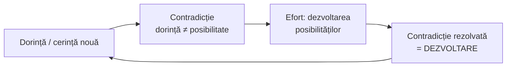
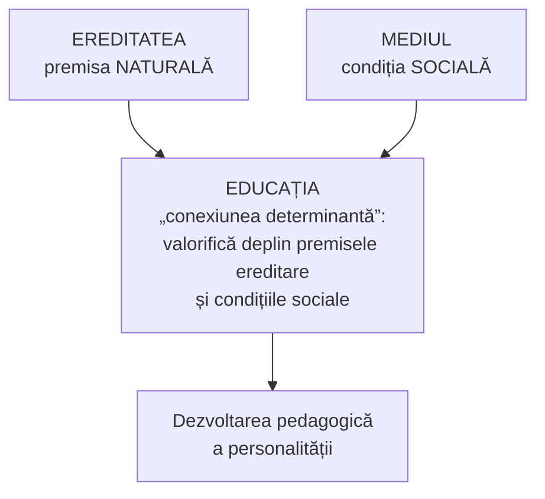

↑ [[Modulul 09 - Agenții educației și factorii dezvoltării]] · ← [[9.3 Personalitatea elevului și comportamentul școlar]] · → [[10.1 Proiectarea activității educaționale]]

> [!abstract] Pe scurt
> - **Educabilitatea** este capacitatea specifică psihicului uman de a se **modela structural și informațional** sub influența agenților sociali și educaționali. Doar omul e **educabil**, animalele pot fi doar **dresate sau domesticite**.
> - Dezvoltarea personalității e **stadială**. Are trei componente: **creșterea** (cantitativă), **maturizarea** (calitativă) și **dezvoltarea** propriu-zisă (noi priceperi, atitudini, relații). Stadiile psihice merg de la **copilul mic** la **bătrânețe** (după U. Șchiopu & E. Verza).
> - **Factorii dezvoltării**: **ereditatea** (internă, **premisa naturală**), **mediul** (extern, **condiția socială**), **educația** (externă, **factorul decisiv**, „conexiunea determinantă”). Teorii: **ereditaristă, ambientalistă, a dublei determinări**.
> - Pentru valorificarea educabilității trebuie: să cunoaștem **stadiile și crizele** de vârstă (mai ales în jurul vârstei de **14 ani**), să depășim **antinomia intern–extern** și să orientăm motivația spre **(auto)perfecționare**.
> - **Factorii educativi**: familia, școala, instituțiile conexe, grupurile informale, instituțiile culturale, asociațiile, mass-media, mediile informatizate, comunitățile religioasă, etnică, națională și internațională.

---

# PARTEA I — Ce spune manualul

## 1. Educabilitatea (p. 339–340)

- Educația se exercită **doar asupra omului**. Animalele pot fi **domesticite sau dresate**, nu educate. Omul e **unica ființă educabilă** și de aceea **devine personalitate**.

> [!quote] Definiție (p. 339, după I. Bontaș)
> **Educabilitatea** este **capacitatea** (particularitatea, calitatea) specifică psihicului uman de a se **modela structural și informațional** sub influența **agenților sociali și educaționali**.

- Prin receptivitate la educație și prin **socializare**, omul dobândește caracteristici specific umane: **limbajul articulat, gândirea logică, mersul biped**. **În afara socializării și educației** omul nu își poate însuși aceste deprinderi (p. 340).

## 2. Dezvoltarea stadială: creștere, maturizare, dezvoltare (p. 340)

- Personalitatea trece, de la naștere (când este un „simplu individ”) și pe tot parcursul vieții, prin **modificări stadiale**, **de la inferior la superior**, în funcție de condițiile sociale și de educație.
- Dezvoltarea are la bază **„legea automișcării universale”**. **I. Nicola**: dezvoltarea personalității este un **proces stadial dinamic**.

| Componentă | Definiție | Natura |
|---|---|---|
| **Creșterea** | mărirea treptată, rezultat al procesului vieții: **masa corpului**, masa nervoasă, aspectul fizic și anatomic | **cantitativă** |
| **Maturizarea** | starea de dezvoltare **fizică și intelectuală** | **calitativă** |
| **Dezvoltarea** personalității | însușirea de **noi priceperi, deprinderi de conduită, atitudini**, care strâng relațiile omului cu societatea | psihosocială |

- Creșterea și maturizarea sunt **indisolubil legate**. Împreună sunt **premisele naturale** ale dezvoltării psihice.
- **Motorul dezvoltării**: **contradicțiile dintre posibilități și dorințe**. Copilul își dezvoltă posibilitățile ca să-și împlinească dorințele și astfel înlătură contradicția. Viața aduce **noi cerințe** și **noi contradicții**, iar procesul continuă.

## 3. Periodizarea vârstelor (p. 340–341)

### 3.1. Periodizări istorice

| Autor | Periodizare |
|---|---|
| **Aristotel** | 3 perioade: **0–7**, **7–14**, **14–21** ani |
| **N. Milescu-Spătaru** | aceeași periodizare ca Aristotel |
| **J. A. Comenius** | **4 perioade** de câte **6 ani** |
| **J.-J. Rousseau** | 4 perioade: **0–2**, **2–12**, **12–15**, **15–20** ani |
| **D. Cantemir** | **7 perioade** ale întregii vieți, comparate cu **viața plantelor** |
| **Gh. Asachi** | **6 perioade**, comparate cu caracteristicile unor **animale** |

### 3.2. Stadiile dezvoltării psihice (după U. Șchiopu & E. Verza; p. 341)

| # | Stadiul | Vârsta |
|---|---|---|
| 1 | copilul **mic** | 0–1 an |
| 2 | copilul **antepreșcolar** | 1–3 ani |
| 3 | copilul **preșcolar** | 3–6(7) ani |
| 4 | **școlarul mic** | 6(7)–10(11) ani |
| 5 | școlarul **preadolescent** | 10(11)–14(15) ani |
| 6 | școlarul **adolescent** | 14(15)–18(19) ani |
| 7 | **adolescența întârziată** | 20–24 ani |
| 8 | **vârsta adultă**: tinerețea / maturitatea („vârsta adultă mijlocie și tardivă”) / bătrânețea („vârstele de involuție”) | 25–44 / 45–65 / 66–90 ani |

## 4. Factorii formării și dezvoltării personalității (p. 341–345)

### 4.1. Clasificare și teorii (p. 341–342)

- Dezvoltarea psihică e un **proces complex**, influențat de mai mulți factori, grupați în:
  - **factori interni**: **ereditatea**;
  - **factori externi**: **mediul** și **educația**.

| Teoria | Teza | Reprezentanți (după manual) |
|---|---|---|
| **Ereditaristă** | factorul **intern** (ereditatea) e **hotărâtor** | Platon, Spencer |
| **Ambientalistă** | **mediul și educația** determină dezvoltarea | Comenius, Locke |
| **A dublei determinări** | rolul eredității, mediului și educației este **„uniformizat”** (egal) | Democrit |

### 4.2. Ereditatea (p. 342–343)

- Dezvoltarea personalității depinde de **dezvoltarea speciei**: modificările acumulate de specie se transmit urmașilor. Lat. ***hereditas*** = „moștenire”.

| Omul moștenește de la **specie** | Omul moștenește de la **părinți** | **Nu** se moștenește |
|---|---|---|
| structura și sistemele anatomice; **poziția verticală**; reacțiile vitale; **reflexele necondiționate** | forma feței, culoarea ochilor și a părului, forma nasului, greutatea, înălțimea | **conținutul psihic**: trăsăturile morale, **caracterul**, **aptitudinile**, **cunoștințele** |

- **Genotipul** = totalitatea **proprietăților ereditare** ale individului.
- **Fenotipul** = potențialul **dobândit** în cursul dezvoltării. Se constituie din **genotip + mediul social**.
- **Predispozițiile** devin însușiri **doar în anumite condiții**. Fără condiții, genotipul **nu se actualizează**. Ereditatea e un **„teren prielnic”** (p. 343).
- Fără sistem nervos normal, structură anatomică și organe senzoriale funcționale, dezvoltarea personalității e imposibilă. De aceea ereditatea este **condiția de bază** a dezvoltării.

### 4.3. Mediul social-uman (p. 343)

- **Mediul** = condițiile **materiale și spirituale** în care trăiește și se dezvoltă omul.
  - **Mediul natural (geografic)**: condițiile favorabile înlesnesc dezvoltarea, cele nefavorabile o îngreunează.
  - **Mediul social**: are **importanță mai mare**. Include mediul **familial, preșcolar, școlar, de muncă, opinia publică**.
- Influențele mediului pot fi **spontane** sau **organizate**.
- Între ereditate și mediu există **interacțiune**, cu acțiune **concomitentă și integrală**. **Mediul mediază contribuția eredității** și modelează puternic fondul biologic. Caracteristicile dobândite **nu pot fi însușite în afara societății**.

### 4.4. Educația — factorul decisiv (p. 343–344)

- **Educația** este factorul **extern** cu **cea mai mare influență**. Contribuția ei e **hotărâtoare** pentru că are caracter **organizat, conștient, intenționat**, cu **conținut selectat** de specialiști care o și conduc. Contribuie la **socializarea și umanizarea** personalității.

> [!tip] De reținut (p. 344)
> Educația e **decisivă, dar nu singurul factor**:
> - **fără ereditate**, educația n-ar avea asupra cui acționa;
> - educația are loc **numai în mediul social**, care îi creează condițiile.

## 5. Educabilitatea ca direcție de evoluție a educației (S. Cristea; p. 344–346)

- Evoluția educației în secolul XXI presupune valorificarea **educabilității, educației permanente, autoeducației, proiectării curriculare** (→ [[3.6 Educația permanentă și autoeducația]]).
- **S. Cristea (2003)**: **valorificarea educabilității** e o **direcție fundamentală** de evoluție a educației. Educabilitatea este capacitatea de **dezvoltare pedagogică progresivă, permanentă, continuă**. Ea cere clarificarea raportului dintre factori:

### 5.1. Ereditatea din perspectiva educabilității (p. 344)

Interpretarea pedagogică a unor **perechi de concepte complementare** (după P. Golu):

| Pereche | Primul termen | Al doilea termen |
|---|---|---|
| **genotip – fenotip** | genotipul: **„patrimoniul moștenit”** | fenotipul: **efectul genotipului** în interacțiune cu mediul |
| **creștere – maturizare** | creșterea: aspecte **fizice** ale „schemei corporale”, ramificații nervoase, volumul masei cerebrale | maturizarea: aspecte **fiziologice** interne (biochimice, endocrine, senzoriale, cerebrale) |

> [!quote] Definiție (p. 344)
> **Ereditatea** este o **trăsătură biologică** a organismelor vii, tipică speciei umane. Asigură **premisa reușitei** personalității la nivelul unei **educații de bază** și premisa **evoluției particulare** a unor trăsături fizice, fiziologice și psihologice, **variabile de la o personalitate la alta**.

### 5.2. Mediul din perspectiva educabilității (p. 345)

- **UNESCO** (raportul coordonat de **Edgar Faure**): **transformarea progresivă a mediului social într-o „cetate educativă”**.
- Dezvoltarea pedagogică presupune **regruparea culturală** a factorilor de mediu:
  - **macromediul social** (economic, politic, cultural), care acționează prin **familie, școală, profesie, instituții sociale, timp liber, mass-media**;
  - **micromediul social** (după manual): **mediul natural, ambiant**, adică totalitatea condițiilor **bioclimatice și geografice**.

> [!quote] Definiție (p. 345)
> **Mediul** este ansamblul factorilor **naturali și sociali, materiali și spirituali** care condiționează, **organizat sau spontan**, dezvoltarea pedagogică a personalității. Este un **factor modelator**: **relevă, stimulează și chiar amplifică** dispozițiile genetice prin acțiuni instituționalizate **formal** (școala) și **nonformal** (activități extradidactice, extrașcolare).

### 5.3. Educația din perspectiva educabilității (p. 345)

- Prin finalitățile **macro- și microstructurale**, educația **alege deliberat perspectiva** dezvoltării și stabilește **cum se folosesc resursele** eredității și mediului (P. Golu, 1985) (→ [[Modulul 04 - Finalitățile educației]]).

> [!quote] Definiție (p. 345)
> **Educația** presupune **dezvoltarea pedagogică** a personalității prin **valorificarea deplină** a premiselor ereditare și a condițiilor de mediu.

### 5.4. Condițiile valorificării educabilității (p. 345–346)

1. **Cunoașterea fiecărui stadiu** al dezvoltării, mai ales a faptului că **momentele de „criză”** apar la **trecerea spre o nouă vârstă psihologică**. Fenomenul e **acutizat în jurul vârstei de 14 ani**, la trecerea din **preadolescență în adolescență**.
2. **Depășirea antinomiei** dintre influențele **interne** (ereditare) și **externe** (mediu, educație).
3. **Concentrarea substratului energetic-motivațional** al dezvoltării pe **obiectivele formative** ale educației, deschise spre **(auto)perfecționare**.

## 6. Factorii educativi (p. 346–349)

Omul se realizează în **diferite medii și comunități**. Acestea creează **climate de apartenență** și influențează formarea individului ca personalitate și **sintalitatea** (personalitatea) grupurilor.

| Factor educativ | Rolul (după manual) |
|---|---|
| **Familia** (p. 346–347) | comunitate umană, **nucleu social** întemeiat (în epoca modernă) prin **căsătorie**; grup unit prin drepturi și obligații economice, sociale, morale, juridice, biologice. **Climatul** depinde de condițiile materiale, felul căsătoriei, calitatea parteneriatului conjugal, cultură, afinitate spirituală, atitudinea față de educația copiilor, relațiile între generații. Pentru copil este **mediul natural, cel mai apropiat**, de structurare **intelectuală, afectivă, volitivă**. Oferă **securitate materială, morală, psihică**. Aici se formează **raportarea la lume și la sine** și concepțiile despre viață. E locul **reușitelor**, dar și **refugiul** în eșec și suferință. **Carențele** familiei afectează negativ dezvoltarea bio-psiho-socio-culturală. Manualul menționează situația copiilor **orfani, abandonați**, instituționalizați, în plasament sau adoptați |
| **Școala** (p. 347) | toate nivelurile, **inclusiv grădinița**. **Peste două decenii** de viață trec sub semnul obligațiilor școlare și universitare. În mod ideal, este mediul favorabil **învățării**, **culturii generale și de specialitate**, pregătirii pentru viața socioprofesională, civică, politică, culturală. Creează **deschideri pluri- și interculturale**, informează despre **problemele lumii contemporane**, întreține interesul pentru **autocunoaștere, autoevaluare, autoeducație**. Are și îndatorirea de a **corecta greșelile educației din familie** și de a **suplini** unele funcții ale acesteia |
| **Instituțiile conexe școlii** sau independente (p. 347) | cabinete de **asistență psihopedagogică**, laboratoare psihologice. Au **funcții educative auxiliare**: autocunoaștere, corectarea defectelor comportamentale, **orientare școlară și profesională**, orientarea carierei, **reconversie și recalificare** |
| **Grupurile informale** (p. 347–348) | prieteni, colegi, cunoștințe. Influențează **constant, uneori decisiv**, orientarea școlară și profesională, deciziile, cariera, **gusturile, preferințele, hobby-urile**, relațiile interpersonale |
| **Instituțiile culturale** (p. 348) | biblioteca, cinematograful, teatrul, Ateneul, sălile de concert. Creează **interese constante**, sunt surse de instruire și educație, oferă petrecerea timpului liber, **combaterea stresului**, **odihnă activă** |
| **Asociațiile culturale și profesionale** (p. 348) | reunesc persoane cu **interese comune**. Creează solidaritate, afirmarea prestigiului individual și de grup. Satisfac trebuințele de **apartenență, solidaritate, prestigiu, stimă** |
| **Mass-media** (p. 348) | presa, radioul, televiziunea: influențe **informative și formative puternice și constante**, prin felul în care **selectează, prelucrează, prezintă** informația. Impactul depinde de **profesionalismul și deontologia** jurnaliștilor. Deontologia **exclude manipularea**, iar când manipularea apare, publicul trebuie să **reacționeze cu discernământ** |
| **Mediile informatizate** (p. 348) | programe de calculator, internet, **realitate virtuală**, **biblioteci electronice**: informații foarte diverse, difuzarea opiniilor, **cadru inedit de comunicare** |
| **Comunitatea religioasă** (p. 348–349) | climat de **securitate sufletească** și **înălțare spirituală**. Satisface trebuințele de securitate sufletească, de **modele perfecte**, de **libertate a credinței**, de iubire |
| **Comunitatea etnică** (p. 349) | pentru **naționalitățile conlocuitoare**: **suport psihologic stabil** pentru integrare. Conștiința **identității de limbă și cultură** e un element al **echilibrului social** |
| **Comunitatea națională** (p. 349) | prin politica economică și culturală, oferă **garanții** pentru un climat de viață **prosper și pașnic** |
| **Comunitatea internațională** (p. 349) | **mediul educativ cu sfera cea mai largă**. „Marea familie a planetei”, prin interesele pentru **pace și prosperitate**, poate oferi **sau nu** garanții de coexistență și colaborare |

## 7. Concluziile modulului (p. 350) și teme (p. 351)

- Dezvoltarea personalității este un **proces stadial dinamic**, cu **creștere, maturizare, dezvoltare**. Stadiile se numesc **etape de dezvoltare**.
- Educația secolului XXI valorifică **factorii dezvoltării** (ereditate, mediu, educație), **educația permanentă**, **autoeducația**, **proiectarea curriculară** și **factorii educativi** (lista din §6).
- *Temă de reflecție*: argumentați **valorificarea factorilor dezvoltării psihice** și a **factorilor educativi**.

---

# PARTEA II — Completări

## 8. Teoriile raportului ereditate–mediu–educație: precizări

| Orientare | Teza | Reprezentanți verificați | Observații |
|---|---|---|---|
| **Ereditarism** | aptitudinile și caracterul sunt **predeterminate** biologic; educația doar le **actualizează** | **Platon** (*Republica*: „mitul metalelor”, oamenii au naturi diferite); **Francis Galton**, *Hereditary Genius* (1869), fondatorul **eugeniei**; **H. Spencer** (evoluționism social) | justificare istorică pentru **eugenie** și **segregare** școlară. Formă modernă atenuată: „determinismul genetic” din discursul popular |
| **Ambientalism** (sociologism, pedagogism) | omul se naște **„tabula rasa”**; mediul și educația pot „face” orice | **J. Locke**, *Eseu asupra intelectului omenesc* (1690) și *Some Thoughts Concerning Education* (1693); **C. A. Helvétius**, *De l'homme* (1773): „educația poate totul”; **J. B. Watson** (behaviorism, 1924–1925): celebra afirmație că poate face din orice copil sănătos orice specialist | **supraestimează** educația; ignoră **diferențele individuale** și **limitele biologice** |
| **Teoria dublei determinări** / **convergenței** | dezvoltarea rezultă din **ereditate + mediu** | **William Stern** (*Konvergenztheorie*, începutul sec. XX) | în multe manuale românești, dubla determinare se referă la **ereditate și mediu**. Adăugarea explicită a **educației** duce la „teoria **triplei determinări**” sau la perspectiva **interacționistă** (formularea exactă în manualele citate: **de verificat**) |
| **Interacționism / perspectiva bioecologică** | factorii **nu se adună**, ci **interacționează**. Efectul unuia **depinde de nivelul** celorlalți. Individul e **agent activ** | **Piaget**; **Bronfenbrenner & Morris** (modelul bioecologic, 1998/2006); **G. Gottlieb** (epigeneza probabilistă) | perspectiva dominantă în psihologia contemporană |

> [!note] Comentariu despre Democrit
> Atribuirea „dublei determinări” lui **Democrit** are un sâmbure real. Un fragment păstrat (DK 68 B 33) spune, în esență, că **natura și educația sunt asemănătoare**, fiindcă educația îl **transformă** pe om și, transformându-l, îi **creează o natură**. Ideea e mai aproape de **interacționism** decât de o „uniformizare” a rolurilor. Formula manualului („rolul... este **uniformizat**”) **nu redă nici** teza lui Democrit, **nici** teoria convergenței.

## 9. Genetica comportamentală: ce știm azi

| Cercetare | Rezultat |
|---|---|
| **Studiile pe gemeni** (monozigoți vs. dizigoți; gemeni crescuți separat) — ex. **Minnesota Study of Twins Reared Apart**, **T. J. Bouchard** et al. (*Science*, 1990) | gemenii monozigoți crescuți **separat** seamănă surprinzător de mult la inteligență și personalitate, ceea ce indică o **contribuție ereditară substanțială** |
| **Polderman et al.** (*Nature Genetics*, 2015): meta-analiza a **50 de ani** de studii pe gemeni (≈ 17.800 de trăsături, ≈ 14,5 milioane de perechi) | **heritabilitatea medie** a trăsăturilor umane este de **≈ 49%**. **Nicio trăsătură** nu are heritabilitate 0, **niciuna** nu e determinată exclusiv genetic |
| **R. Plomin & I. Deary** (*Molecular Psychiatry*, 2015); **R. Plomin**, *Blueprint* (2018) | heritabilitatea inteligenței **crește cu vârsta** (de la ≈ 20% în copilăria mică la ≈ 50–60% la adulți), deoarece oamenii își **aleg și construiesc medii** potrivite genotipului. Trăsăturile sunt **poligenice**: mii de variante, fiecare cu efect minuscul |
| **Scarr & McCartney** (*Child Development*, 1983) | corelații **genotip → mediu**: **pasive** (părinții oferă și gene, și mediu), **evocative** (copilul provoacă anumite reacții), **active** (copilul își caută mediul, *niche-picking*) |
| **Turkheimer et al.** (*Psychological Science*, 2003) | în familiile **sărace** din SUA, heritabilitatea IQ-ului e **aproape de zero**, iar în cele înstărite e ridicată. **Mediul precar limitează exprimarea potențialului genetic** (interacțiune gene × mediu). Meta-analiza **Tucker-Drob & Bates** (2016) confirmă efectul în SUA, dar **nu** în Europa de Vest și Australia |
| **Efectul Flynn** (J. R. Flynn, 1984, 1987) | scorurile IQ au **crescut cu câteva puncte pe deceniu** în multe țări, prea rapid pentru o cauză genetică. Rezultă un **rol puternic al mediului** (școlarizare, nutriție, complexitate culturală) |

> [!note] Comentariu
> **Heritabilitatea** e o statistică **populațională**: cât din **variația** unei trăsături, **într-o populație și un mediu dat**, se asociază cu variația genetică. Ea **nu** spune ce procent din inteligența **unei persoane** vine din gene și **nu** înseamnă **imuabilitate**. Înălțimea e foarte heritabilă, dar a crescut mult în ultimul secol datorită nutriției. De aceea afirmația că educația e „decisivă” rămâne compatibilă cu genetica, cu condiția să fie înțeleasă ca **valorificare a potențialului**, nu ca „modelare din nimic”.

## 10. Epigenetica: mecanismul interacțiunii

- **Epigenetica** studiază modificările **expresiei genelor** (ex. **metilarea ADN-ului**, modificarea histonelor) **fără schimbarea secvenței ADN**, modificări influențate de mediu.
- **Weaver, Meaney et al.** (*Nature Neuroscience*, 2004): la șobolani, **grija maternă** (lingere, îngrijire) modifică **epigenetic** gena receptorului pentru glucocorticoizi. Rezultatul este o reactivitate diferită la **stres** la puii adulți, efect **reversibil** farmacologic.
- **Heijmans et al.** (*PNAS*, 2008): persoanele expuse **prenatal** foametei din Olanda (**„Iarna foamei”**, 1944–1945) aveau, după **șase decenii**, metilare diferită a genei **IGF2**, comparativ cu frații neexpuși.
- **Fraga et al.** (*PNAS*, 2005): **gemenii monozigoți** sunt aproape identici epigenetic în copilărie, dar **diverg** odată cu vârsta, mai ales dacă au trăit **separat**.

> [!note] Comentariu
> Epigenetica **invalidează antinomia** „ereditate *sau* mediu” pe care manualul cere, pe bună dreptate, să o depășim (§5.4). Mediul **nu doar „mediază”** ereditatea, cum spune manualul la p. 343, ci **reglează biologic** expresia ei. Precauție: multe extrapolări populare (moștenirea „traumelor” pe generații la om) sunt **insuficient dovedite**.

## 11. Mediul timpuriu: dovezi din studiile pe copiii instituționalizați din România

Manualul menționează doar în treacăt copiii orfani și instituționalizați (p. 347). Două programe de cercetare arată cât de puternic e mediul familial:

- **English and Romanian Adoptees Study (ERA)**, **M. Rutter** și colab. (*Journal of Child Psychology and Psychiatry*, 1998 și urm.): copiii din orfelinatele românești adoptați în Marea Britanie au recuperat **spectaculos** dezvoltarea fizică și cognitivă. Recuperarea a fost **aproape completă** pentru cei adoptați **înainte de 6 luni**, iar la adopția mai târzie au persistat **deficite** la o parte dintre copii.
- **Bucharest Early Intervention Project (BEIP)**, **C. A. Nelson, N. A. Fox, C. H. Zeanah** (*Science*, 2007; carte: *Romania's Abandoned Children*, 2014): primul **studiu randomizat** care a comparat **plasamentul familial** cu îngrijirea **instituțională**. Plasamentul în familie a îmbunătățit **IQ-ul**, atașamentul și activitatea cerebrală, cu atât mai mult cu cât s-a făcut **mai devreme** (efect de **perioadă sensibilă**, în jurul vârstei de 2 ani).

> [!note] Comentariu
> Aceste studii dau un **temei empiric** tezei manualului că familia este mediul **„natural, cel mai apropiat și util”**. Arată și că există **perioade sensibile**: educația poate compensa mult, dar **nu oricând** și **nu integral**.

## 12. Periodizări moderne ale dezvoltării

| Autor | Criteriul | Stadii (pe scurt) |
|---|---|---|
| **J. Piaget** | structurile **cognitive** | senzorio-motor (0–2) · preoperațional (2–7) · operații concrete (7–11/12) · operații formale (11/12+) |
| **E. H. Erikson**, *Childhood and Society* (1950) | **crizele psihosociale** | încredere/neîncredere · autonomie/rușine · inițiativă/vinovăție · hărnicie/inferioritate · identitate/confuzie · intimitate/izolare · generativitate/stagnare · integritate/disperare |
| **S. Freud** | dezvoltarea **psihosexuală** | oral · anal · falic · latență · genital |
| **U. Șchiopu & E. Verza**, *Psihologia vârstelor* (EDP, 1981; ed. *Ciclurile vieții*, 1997) | **tipul fundamental de activitate** și de relații, cicluri ale întregii vieți | sursa periodizării din manual |
| **Tinca Crețu**, *Psihologia vârstelor* (Polirom, ed. a III-a, 2016) | abordare unitară a transformărilor pe tot parcursul vieții, cu accent pe copilărie și adolescență | periodizare apropiată de Șchiopu–Verza |
| **P. Golu**, *Învățare și dezvoltare* (Editura Științifică și Enciclopedică, 1985) | raportul **învățare–dezvoltare** | sursa perechilor genotip–fenotip și creștere–maturizare |

- **Codul Educației al R. Moldova** (art. 23) folosește o altă delimitare instituțională: **educația antepreșcolară 0–2 ani**, **învățământul preșcolar 2–6(7) ani**. Stadiile psihologice din manual (antepreșcolar 1–3, preșcolar 3–6/7) **nu coincid** cu ciclurile legale actuale.

## 13. Factorii educativi: completări pe categorii

| Factor | Completare | Sursa |
|---|---|---|
| **Familia** | **stilurile parentale**: autoritativ (exigență + căldură, asociat cu cele mai bune rezultate), autoritar, permisiv, neglijent | **D. Baumrind** (1966, 1971); **E. Maccoby & J. Martin** (1983) |
| **Familia vs. școala** | **Raportul Coleman** (SUA, 1966): **mediul familial** și compoziția socială a școlii explică mai mult din variația rezultatelor decât **resursele materiale** ale școlii. Sintezele ulterioare (Hattie) arată totuși că **calitatea predării** e factorul școlar cel mai important | J. S. Coleman et al., *Equality of Educational Opportunity* (1966) |
| **Relația familie–școală** | **mezosistemul** (Bronfenbrenner): calitatea **legăturilor** dintre familie și școală e ea însăși un factor de dezvoltare. Codul Educației RM, **art. 138**: drepturile și obligațiile **părinților** | Bronfenbrenner (1979); Codul Educației nr. 152/2014 |
| **Școala** | **curriculumul ascuns**: normele și valorile transmise implicit (→ [[3.2 Educația formală]]) | Ph. W. Jackson (1968) |
| **Grupurile informale** | **teoria socializării în grup**: grupul de **egali** are, după autoare, un rol **mai mare decât se credea**, uneori comparabil cu cel al părinților, în formarea personalității din afara familiei. Teza e **controversată**, dar a stimulat multe cercetări | **Judith Rich Harris**, *Psychological Review* (1995); *The Nurture Assumption* (1998) |
| **Mass-media** | **teoria cultivării**: expunerea îndelungată la televiziune **modelează percepția realității** (ex. supraestimarea violenței) | **G. Gerbner & L. Gross** (1976) |
| **Mediile digitale** | tehnologia în educație are beneficii doar dacă e **subordonată învățării**. Raportul discută **distragerea**, **protecția datelor** și inegalitățile de acces | UNESCO, *Global Education Monitoring Report 2023: Technology in Education — A Tool on Whose Terms?* |
| **Mediile digitale** | copiii și riscurile/oportunitățile online: **alfabetizarea digitală** și **medierea parentală** activă funcționează mai bine decât simpla restricție | rețeaua **EU Kids Online** (S. Livingstone și colab.) |
| **Comunitatea internațională** | „**cetatea educativă**” a raportului Faure. Reluată în raportul **Delors** (1996), cu cei **4 piloni**: a învăța să știi, să faci, să trăiești împreună, să fii | E. Faure (coord.), *Apprendre à être* (UNESCO, 1972); J. Delors (coord.), *Learning: The Treasure Within* (UNESCO, 1996) |

> [!note] Comentariu — legătura cu formele educației
> Factorii educativi din manual se suprapun cu **formele educației** din Modulul 3:
> - **școala** → [[3.2 Educația formală]];
> - **instituțiile culturale, asociațiile, cluburile** → [[3.3 Educația nonformală]];
> - **familia, grupurile informale, mass-media, mediile informatizate** → [[3.4 Educația informală]].
> 
> „Cetatea educativă” a lui Faure este ideea-cheie a [[3.6 Educația permanentă și autoeducația]].

## 14. Comentariu critic

> [!warning] Erori, contradicții, simplificări
> 1. **Contradicție internă: mersul biped**. La p. 340, mersul biped e prezentat ca dobândit **exclusiv prin socializare și educație**. La p. 342, **poziția verticală** e moștenită **de la specie**. Corect: bipedalismul e **programat genetic**, dar se actualizează doar în **condiții de mediu adecvate** (exemplu clasic: cazurile de copii crescuți în izolare, precum **Victor din Aveyron**, descris de J. M. G. Itard în 1801).
> 2. **„Nu se moștenesc aptitudinile, caracterul”**: formularea e **simplificatoare**. Nu se moștenesc aptitudinile **gata formate**, dar se moștenesc **predispoziții** cu heritabilitate substanțială (≈ 40–60% pentru inteligență la adulți, ≈ 40% pentru trăsăturile Big Five; Polderman et al., 2015). Manualul însuși vorbește la p. 343 despre „predispoziții”.
> 3. **Fenotip = genotip + „mediul social”**: fenotipul rezultă din interacțiunea genotipului cu **întregul mediu** (inclusiv biologic, prenatal, nutrițional), nu doar cu cel social.
> 4. **Teoria dublei determinări** este redată greșit („rol **uniformizat**” al celor **trei** factori). Numele teoriei indică **doi** factori (ereditate, mediu). Lipsesc **interacționismul** și perspectiva actuală (**epigenetică**, gene × mediu). Lista reprezentanților e sumară: lipsesc Galton, Helvétius, Watson, Stern. **Comenius** e mai curând susținătorul **puterii educației** decât un „ambientalist” în sens strict.
> 5. **Macromediu vs. micromediu**: manualul numește „micromediu social” **mediul natural, bioclimatic și geografic**, iar familia și școala apar la „macromediu”. În literatura pedagogică uzuală, **micromediul** este cel **apropiat** (familie, grup, școală), **macromediul** este cel economic, politic, cultural, iar mediul **natural** e o categorie distinctă. Formularea pare o **eroare de redactare** **(de verificat în sursa lui S. Cristea)**.
> 6. **Reziduuri ideologice**: **„legea automișcării universale”** și **contradicțiile** ca motor al dezvoltării provin din **materialismul dialectic** (psihologia sovietică). „Filosoful **materialist** Democrit” e o etichetă din aceeași tradiție. Ideea contradicției dorință–posibilitate e utilă, dar nu e o „lege” științifică.
> 7. **Trimiteri bibliografice greșite sau lipsă**:
>    - citatul despre creștere–maturizare și cel despre medierea eredității sunt trimise la **[11]**, adică *Pătrașcu & Rotaru, Cultura managerială a profesorului*, sursă evident nepotrivită;
>    - „comunitatea internațională… [9, p. 33]” trimite la *Mitrofan, Aptitudinea pedagogică*, sursă nepotrivită;
>    - **S. Cristea (2003)**, **P. Golu (1978, 1985)**, **E. Faure (1975)**, **Șchiopu & Verza (1991)** **lipsesc din bibliografie**;
>    - „[1].m” este o greșeală de tipar.
> 8. **Date de verificat**: raportul Faure (*Apprendre à être*) a apărut la UNESCO în **1972**, iar anul **1975** din manual poate fi al unei traduceri **(de verificat)**. *Psihologia vârstelor* de Șchiopu & Verza a apărut în **1981** (reeditată ulterior), iar „1991” poate fi o ediție intermediară **(de verificat)**.
> 9. **Periodizarea** (p. 341) are un **gol între 19 și 20 de ani** și grupări inconsecvente la vârsta adultă. Periodizările lui Cantemir, Asachi și Milescu-Spătaru sunt date **fără surse**. Nu se menționează periodizările psihologice de referință (Piaget, Erikson).
> 10. **Factorii educativi** sunt descriși **normativ și idealizat** (familia „refugiu”, deontologia media), fără date empirice și fără **riscuri actuale**: migrația părinților (fenomen major în R. Moldova), violența domestică, dezinformarea, rețelele sociale, dependența digitală. **Comunitatea etnică** e tratată doar pentru „naționalitățile conlocuitoare”, nu și din perspectiva **educației interculturale**.
> 11. **Titlul** anunță „valorificarea” factorilor, dar textul e în mare parte **descriptiv**. Recomandări operaționale apar doar în §5.4.

## 15. Întrebări de autoverificare

1. Definiți educabilitatea. De ce spunem că doar omul este educabil?
2. Explicați distincția dintre creștere, maturizare și dezvoltare, cu câte un exemplu.
3. Prezentați periodizarea stadiilor dezvoltării psihice după Șchiopu & Verza și comparați-o cu stadiile lui Piaget sau Erikson.
4. Comparați teoriile ereditaristă, ambientalistă și a dublei determinări. Care sunt limitele fiecăreia? Ce aduce perspectiva interacționistă?
5. Ce se moștenește și ce nu se moștenește? Cum nuanțează genetica comportamentală afirmația că „aptitudinile nu se moștenesc”?
6. Explicați conceptele de genotip și fenotip. Ce înseamnă (și ce nu înseamnă) heritabilitatea?
7. De ce este educația considerată „factorul decisiv” și de ce nu poate fi singurul factor?
8. Ce presupune valorificarea educabilității după S. Cristea? De ce vârsta de ≈ 14 ani cere o atenție specială?
9. Numiți factorii educativi din manual și plasați-i în raport cu educația formală, nonformală și informală.
10. Ce arată studiile ERA și BEIP despre rolul mediului familial și despre perioadele sensibile?

## Surse

- **Manual**, p. 339–352; Bontaș, I. (2008). *Tratat de pedagogie*. București: ALL; Cristea, S. (2002). *Dicționar de termeni pedagogici*; Nicola, I. (2003). *Tratat de pedagogie școlară*. București: Aramis.
- Șchiopu, U., Verza, E. (1981; ed. 1997). *Psihologia vârstelor. Ciclurile vieții*. București: EDP.
- Crețu, T. (2016). *Psihologia vârstelor* (ed. a III-a). Iași: Polirom.
- Golu, P. (1985). *Învățare și dezvoltare*. București: Editura Științifică și Enciclopedică.
- Faure, E. (coord.) (1972). *Apprendre à être*. Paris: UNESCO/Fayard.
- Delors, J. (coord.) (1996). *Learning: The Treasure Within*. Paris: UNESCO.
- Polderman, T. J. C. et al. (2015). Meta-Analysis of the Heritability of Human Traits Based on Fifty Years of Twin Studies. *Nature Genetics*, 47, 702–709.
- Plomin, R., Deary, I. J. (2015). Genetics and Intelligence Differences: Five Special Findings. *Molecular Psychiatry*, 20, 98–108; Plomin, R. (2018). *Blueprint: How DNA Makes Us Who We Are*. London: Allen Lane.
- Bouchard, T. J. et al. (1990). Sources of Human Psychological Differences: The Minnesota Study of Twins Reared Apart. *Science*, 250, 223–228.
- Scarr, S., McCartney, K. (1983). How People Make Their Own Environments. *Child Development*, 54(2), 424–435.
- Turkheimer, E. et al. (2003). Socioeconomic Status Modifies Heritability of IQ in Young Children. *Psychological Science*, 14(6), 623–628; Tucker-Drob, E. M., Bates, T. C. (2016). *Psychological Science*, 27(2), 138–149.
- Flynn, J. R. (1987). Massive IQ Gains in 14 Nations. *Psychological Bulletin*, 101(2), 171–191.
- Weaver, I. C. G. et al. (2004). Epigenetic Programming by Maternal Behavior. *Nature Neuroscience*, 7, 847–854.
- Heijmans, B. T. et al. (2008). Persistent Epigenetic Differences Associated with Prenatal Exposure to Famine in Humans. *PNAS*, 105(44), 17046–17049.
- Fraga, M. F. et al. (2005). Epigenetic Differences Arise During the Lifetime of Monozygotic Twins. *PNAS*, 102(30), 10604–10609.
- Rutter, M., ERA Study Team (1998). Developmental Catch-up, and Deficit, Following Adoption after Severe Global Early Privation. *Journal of Child Psychology and Psychiatry*, 39(4), 465–476.
- Nelson, C. A. et al. (2007). Cognitive Recovery in Socially Deprived Young Children: The Bucharest Early Intervention Project. *Science*, 318, 1937–1940; Nelson, C. A., Fox, N. A., Zeanah, C. H. (2014). *Romania's Abandoned Children*. Cambridge, MA: Harvard University Press.
- Bronfenbrenner, U. (1979). *The Ecology of Human Development*. Cambridge, MA: Harvard University Press.
- Baumrind, D. (1971). Current Patterns of Parental Authority. *Developmental Psychology Monographs*, 4(1, Pt. 2).
- Coleman, J. S. et al. (1966). *Equality of Educational Opportunity*. Washington: U.S. Government Printing Office.
- Harris, J. R. (1995). Where Is the Child's Environment? A Group Socialization Theory of Development. *Psychological Review*, 102(3), 458–489.
- Gerbner, G., Gross, L. (1976). Living with Television: The Violence Profile. *Journal of Communication*, 26(2), 172–199.
- UNESCO (2023). *Global Education Monitoring Report 2023: Technology in Education — A Tool on Whose Terms?* Paris: UNESCO.
- Codul Educației al Republicii Moldova nr. 152/2014, art. 23, 138.
